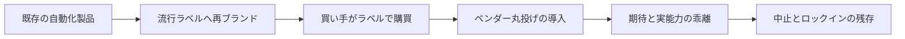

<!-- 採点理由: frequency 3 = エージェント導入を検討する企業に限られ、編集部の見立てでは市場の過熱とともに増えているとみられるため中位。damage 4 = 中止された投資が消えるだけでなく、検証なき丸投げ契約はロックインという形で中止後もコストを残すため4。 -->

> 💡 **ひとことで言うと**
> 中身は昔ながらの自動化ソフトなのに、「AIエージェント」という流行の札を貼り替えただけの商品を、札だけ見て買ってしまう失敗である。産地表示だけで買わずに店先で実物を確かめるのと同じで、自社の業務で実際に動かしてから買う、という話である。

## 症状

ベンダー(販売会社)の提案書にある「AIエージェント」(自律的に判断して作業を進めるとされるAI。用語集「AIエージェント」)という言葉を、能力の中身を確かめずに信じている。実体は従来型の定型自動化やチャットボットの再ブランド(中身はそのままの名前の付け替え)である。それなのに「自律的に判断し業務を遂行する」という説明をそのまま稟議に書き写し、要件定義も検証もベンダーに丸投げしている。これが「エージェント・ウォッシング掴まされ」である。

報道によれば、Gartner(2025年6月発表)は、エージェント型AIを称する多数のベンダーのうち実際にエージェント能力を持つのは僅少と推計し、既存のアシスタント・RPA(定型作業の自動化ソフト)・チャットボットを実質的な能力なしに再ブランドする「agent washing」が横行していると指摘した[src-2026-041](推計の数値はデータボックス参照)。なお本カードの実証は現時点でこの単一調査会社の発表(の報道)に依拠するため、規模感は幅をもって読まれたい。

### 症状チェック3問

1. 提案された「エージェント」が、自律的な計画・判断・道具の使い分けの何を実際に行うのかを、自社の実データ・実業務での実演で確認したか(資料上の説明だけなら症状である)。
2. 「エージェントでも人の検証は必要」という前提が、提案書と社内説明の双方で維持されているか(「エージェントだから検証不要」が紛れていれば症状である)。
3. その案件が失敗だったと判断する条件と判断時期を、契約前に自社側で文書化したか。

2問以上「いいえ」なら、本アンチパターンに該当する。

## なぜ起きるか

ハイプ期(技術への期待が過熱する時期)の市場では、売り手と買い手の誘因が罠の方向に揃う。供給側には、既存製品に流行のラベルを貼り替えるだけで商談が増えるという誘因がある。買い手側には「競合に乗り遅れる」という恐怖があり、検証より速度が優先される。そして自社に出力を検証できる人材がいないと、能力ではなくラベルと営業力で製品を選ぶことになる。選定会議の比較表は「エージェント対応」の有無で埋まり、実際の動作を自社の業務で見た者が一人もいないまま発注が決まる、ということが起きる。報道によれば、Gartnerのアナリストは現在のエージェント型AIプロジェクトの多くを「ハイプに駆動された初期実験かPoCであり、しばしば誤った適用がなされている」と評している[src-2026-041](PoCは試験導入のこと。用語集「PoC」)。

ラベル買いが中止に至る経路は次のとおりである(下図は本文の要約)。

## 放置コスト

放置コストは二重である。第一に中止コスト。報道によれば、Gartnerはエージェント型AIプロジェクトのかなりの割合が、コスト上昇・不明確なビジネス価値・不十分なリスク統制を理由に数年内に中止されると予測している[src-2026-041](予測の数値と期限はデータボックス参照)。第二に、丸投げ契約は中止後もコストを残す。業務知識がベンダー側にだけ蓄積し、データやワークフローが特定製品に縛られれば、撤退しても乗り換えの自由が戻らない。この抜けられない状態がロックインである(用語集「ロックイン」。5形態は原理編「反脆弱性の原則」を参照)。

> 📊 **データボックス(2026-06時点)**
> - エージェント型AIプロジェクトの40%超が2027年末までに中止されるとの予測(Gartner 2025年6月25日発表、RCR Wireless News報道)[src-2026-041]
> - エージェント型AIを称する数千社のうち実能力を持つベンダーは約130社のみとの推計(同発表の報道)[src-2026-041]
> - Gartnerの2025年1月ウェビナー参加者調査(3,412人)では、大規模投資済み19%・保守的投資42%・未投資8%・様子見等31%(同報道)[src-2026-041]

## 脱出方法

脱出は、ラベルではなく自社業務での実演で能力を確かめ、案件を投資判断の5択に振り分けてから買うことから始まる。エージェントという技術領域自体を避ける必要はない。避けるべきは、検証しないまま調達することである。

1. 【今すぐ】【推進担当】提案中の「エージェント」案件すべてについて、自社の実データ・実業務での実演検証を要求する。道具: ロードマップ編「投資判断の5択」の「エージェント・ウォッシング検証3問」(ベンダーの回答を書面で取る)。完了条件: 案件ごとに「何を自律的に行い、どこで人の検証が必要か」の実演記録が残っている。
2. 【今すぐ】【CFO(財務担当役員)】案件を本格投資/使い捨て構築/実験/待つ/やらないの5択に振り分け、撤退条件を稟議に明記させる。道具: ロードマップ編「投資判断の5択」の調達経路の設計。完了条件: 5択の判定と撤退条件のない稟議が差し戻される運用になっている。
3. 【1年以内】【経営】契約段階でデータの持ち出し可能性と乗り換え条件を確保する。道具: 原理編「反脆弱性の原則」の調達・契約チェックリスト。完了条件: 新規AI契約のすべてに可換性(いつでも乗り換えられること。用語集「可換性」)の確認結果が添付されている。

(関連: ロードマップ編「投資判断の5択」、原理編「反脆弱性の原則」)

<!-- 執筆メモ: 2026-06-12 文体改修: 格言調見出し平易化・内部用語排除・見立て定型句を自然文に置換 / 2026-06-12 平易化改修済み -->
