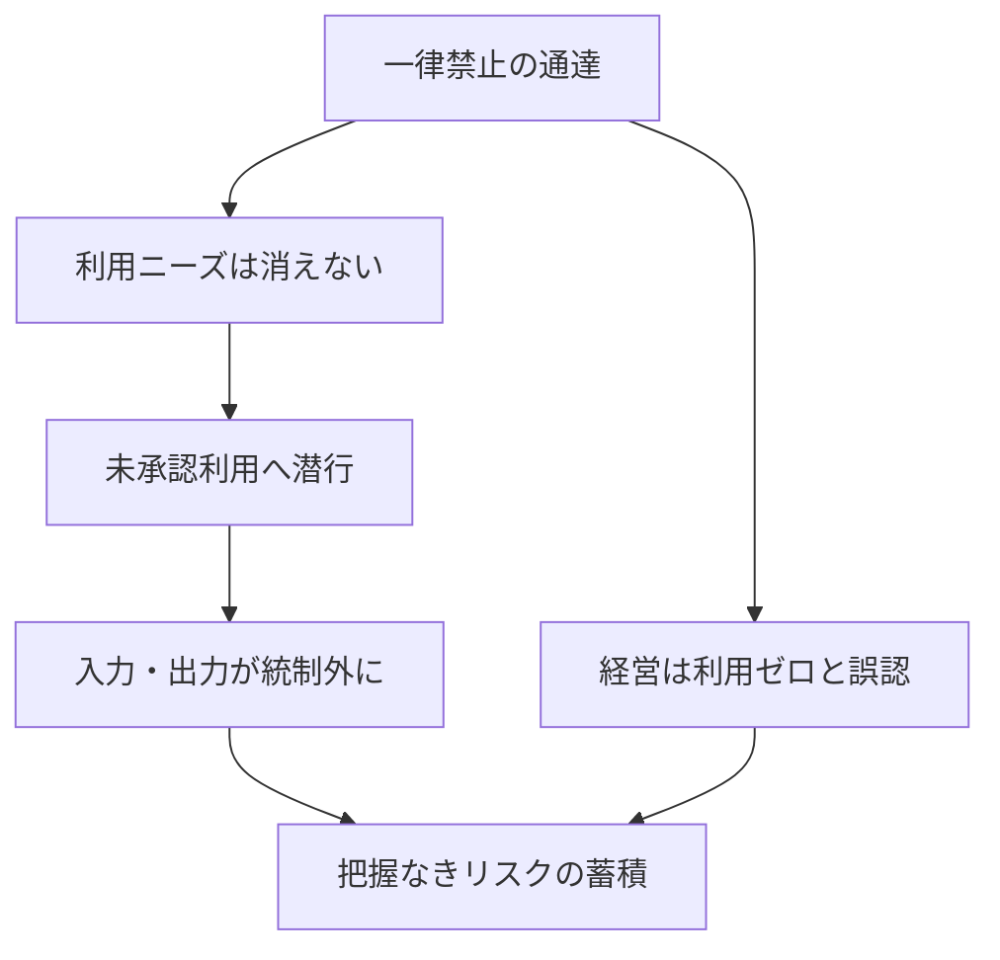

<!-- 採点理由: frequency 3 = 編集部の見立てでは一律禁止型ポリシーは日本企業で珍しくないとみられるが、全社的に常態化しているとまでは言えず中位。damage 4 = 統制外の情報入力と検証なし出力の業務混入は全社規模のリスクで、しかも経営からは「ゼロ」に見えるため発見が遅れる。 -->

> 💡 **ひとことで言うと**
> 「AIは使用禁止」と通達しても、便利さを知った社員は隠れて使い続ける。道を封鎖すると獣道ができるのと同じで、禁止はリスクを消すのではなく、見えなくするだけだという話である。

## 症状

「生成AIの業務利用を禁止する」という通達を出し、それでガバナンス(社内の管理・統制)対応が完了したことになっている。一方で現場では、私物端末や個人アカウントでの未承認利用——用語集「シャドーAI」——が日常化している。たとえば、個人のスマホで生成AIに顧客名入りの問い合わせ文を貼り付けて返信の下書きを作る。この利用は会社のログにいっさい残らない。経営が見ているのは利用ゼロの報告であり、実態は統制の外で進む利用である。

なお、本カードの実証は現時点で単一調査の報道に依拠するため、個々の数値は確定値ではなく傾向として読まれたい。その傾向とは「未承認利用は例外ではなく多数派であり、承認ツールだけで働く従業員のほうが少数派」というものである[src-2026-037]。

### 症状チェック3問

1. 自社のAIポリシー(利用方針)は「原則禁止」で止まらず、「何をどう使ってよいか」を定めた文書まで整備されているか。
2. 経営層・管理職自身は、個人アカウントの生成AIに頼らず、承認された手段の範囲で業務をしていると言い切れるか(規則を作る側の違反が最大のシグナルである)。
3. 「禁止しているので利用はない」という報告に対し、匿名調査やログで実態を確認したことがあるか。

2問以上「いいえ」なら、本アンチパターンに該当する。

## なぜ起きるか

禁止は利用ニーズを消さない。便益を体感した従業員にとって、禁止は「使わない理由」ではなく「黙って使う理由」になる。報道によれば、UpGuardが2025年に実施した国際調査(米・英・加・豪・NZ・シンガポール・インドのセキュリティリーダーおよび一般従業員1,500人対象)では、AIを同僚より信頼する従業員ほど、シャドーAIを日常業務に組み込む傾向が示された[src-2026-037]。同じ調査の報道では、セキュリティ知識が高い従業員ほど「自分でリスク管理できる」と過信し、ポリシーを無視する傾向も示されている[src-2026-037]。つまり禁止が最も効かないのは、最も活用が進む層である。

さらに同調査の報道では、役職別で経営幹部のシャドーAI常用率が最も高いとされる[src-2026-037]。規則を作る側が最初に破る構図では、現場への拘束力は望めない。

禁止が安全をもたらさない構造は次のとおりである(下図は本文の要約)。

## 放置コスト

放置コストは「リスクの不可視化」である。機密情報がどの外部サービスに入力されているか把握できず、検証されていないAI出力が成果物に混入しても追跡できない。インシデント(情報漏えいなどの事故)が起きたとき、会社は利用実態の台帳も検証手順も持たない状態で説明責任を負う。禁止の安心感だけが残り、統制は実質ゼロになる。

> 📊 **データボックス(2026-06時点)**
> - 80%超の労働者が未承認AIツールを業務で使用、セキュリティ専門職では約90%(UpGuard 2025年調査・7か国のセキュリティリーダーおよび一般従業員1,500人対象、Cybersecurity Dive 2025年11月報道。調査主体はセキュリティベンダーであり利益相反に留意)[src-2026-037]
> - 労働者の半数が未承認AIを「日常的に」使用し、会社承認ツールのみを使う労働者は20%未満(同調査の報道)[src-2026-037]
> - 従業員の約4分の1がAIを「最も信頼できる情報源」とみなし、同僚への信頼を上回る(同調査の報道)[src-2026-037]

## 脱出方法

脱出は、禁止を撤回するのではなく、禁止を「条件付きの使い方のルール」(用語集「ガードレール」)に置き換えることから始まる。入力可否・検証義務・相談先を1枚で定める暫定ガードレールと、リスク区分に応じた検証義務化ラインは、組織・人材編「推進体制とガバナンスの設計図」で定義している。

1. 【今すぐ】【経営】一律禁止を「条件付き許可+検証義務」へ置き換える方針を表明し、過去の未承認利用は申告すれば免責とする。道具: 経営メッセージと暫定ガードレール。完了条件: 方針が全社に通達され、免責付き申告窓口が開いている。
2. 【今すぐ】【推進担当】暫定ガードレール(入力してよい情報・禁止情報、出力の検証義務、迷ったときの相談先)を1枚配布する。道具: 組織・人材編「推進体制とガバナンスの設計図」の暫定ガードレール様式。完了条件: 全従業員に配布され、相談先に実際に問い合わせが届き始めている。
3. 【1年以内】【部門長】部門の利用実態を匿名調査で把握し、利用頻度の高い業務から検証義務化ラインに沿った正式手順に格上げする。道具: 匿名アンケートと検証義務化ライン。完了条件: 部門の主要なAI利用業務が台帳化され、検証手順が定義されている。

(関連: 組織・人材編「推進体制とガバナンスの設計図」)

<!-- 執筆メモ: 2026-06-12 文体改修: 格言調見出し平易化・内部用語排除・見立て定型句を自然文に置換 / 2026-06-12 平易化改修済み -->
