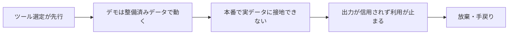

<!-- 採点理由: frequency 4 = データ未整備のままの着手はAI失敗の根本原因として学術調査・業界論考の双方で繰り返し挙がる最頻出型。damage 4 = 放棄・手戻りで投資がまるごと消えるが、放置しても負債のように後年へ複利では膨らみにくいため5未満。 -->

> 💡 **ひとことで言うと**
> AIに仕事をさせるには材料となる自社のデータが要るのに、その準備を飛ばしてソフトだけ先に買ってしまう失敗である。冷蔵庫が空のまま高級な調理家電を買うようなもので、まず材料の在庫を確かめる、という話である。

## 症状

業務データの所在・品質・アクセス権を確認しないまま、自動化プロジェクトが始まっている。ベンダーのデモはきれいなサンプルデータで快調に動くが、本番では自社の実データにつながらない、つながっても欠損と表記ゆれだらけで出力が信用できない——これが「データなき自動化」である。

RANDが2024年に公表した研究(AI/ML(AI・機械学習)構築経験5年以上のデータサイエンティスト・エンジニア65人へのインタビュー)は、AIプロジェクト失敗の根本原因5つの1つとして「効果的なモデルを訓練するのに必要なデータを組織が持っていない」ことを特定している[src-2026-035]。データはAIの前提であり、導入後に付け足せるものではない。

### 症状チェック3問

1. 対象業務でAIが参照するデータについて、「どこに・どんな形式で・誰の権限で」あるかを、ツール選定より先に一覧で答えられるか。
2. PoC(試験導入。用語集「PoC」)の評価を自社の実データで行っているか(ベンダー提供のサンプルデータ上の評価だけで、実データでの検証を「本番フェーズで実施」に先送りしていれば症状である)。
3. プロジェクト予算のうち、データの収集・整形・権限整理に割かれた金額と工数を答えられるか(答えられなければ症状である)。

2問以上「いいえ」なら、本アンチパターンに該当する。

## なぜ起きるか

第一に、ツールは見えるがデータは見えない。経営への報告では「導入した」が成果に見え、データ整備は何も導入していないように見える。役員報告の資料にはツールの画面と稼働開始日は載るが、項目の欠損率やデータ台帳の最終更新日が載ることはない。RANDの同研究は「実ユーザーの問題解決よりも最新技術の利用自体に組織がフォーカスする」ことも根本原因に挙げる。失敗は技術的障壁ではなくインセンティブの不整合(評価や損得の仕組みが目的とずれていること)によって起きる——克服は機械よりも人間の問題である——というのが同研究の結論である[src-2026-035]。

第二に、デモが問題を隠す。整備済みデータの上ではどのツールもよく動くため、自社データの未整備という本当のボトルネックは契約後まで発見されない。

データなき自動化が失敗に至る経路は単純である(下図は本文の要約)。

## 放置コスト

放置した場合の典型的な結末は放棄である。導入費・PoC費に加え、誤った出力を人手で検証・尻ぬぐいする運用コスト、そして「AIは使えない」という組織の学習性無力感(何をしても無駄だという思い込み)が残る。データ整備を飛ばした分は、消えるのではなく後工程で利息付きで請求される。

> 📊 **データボックス(2026-06時点)**
> - 報道によれば、GartnerはAI-readyなデータ基盤を欠く組織はAIプロジェクトの60%を2026年を通じて放棄することになると予測(CIO誌寄稿、2026年2月。寄稿者はAI関連企業役員のため利益相反に留意)[src-2026-011]
> - 同記事はAIイニシアチブの5件中4件が期待を下回る(失敗率約80%)と指摘し、Secoda調査として企業データの68%が分析・イノベーションに未活用と紹介[src-2026-011]
> - RAND(2024年、実務家65人インタビュー)は既存推計の引用として「80%超のAIプロジェクトが失敗し、AIを伴わないITプロジェクトの2倍」と記載[src-2026-035]

## 脱出方法

脱出は、自動化より先にデータを、データより先に棚卸しを片づけることから始まる。データを5資産の一つとして棚卸す枠組みはAI-Ready編「AI-Readyの5資産」で定義しており、着手の可否はAI-Ready編「AI-Ready自己診断」の投資ゲート(5資産の充足判定。未通過なら本格投資をしない)で判定する。

1. 【今すぐ】【推進担当】対象業務ごとにAIが参照すべきデータの所在・形式・品質・アクセス権を棚卸す。道具: AI-Ready編「AI-Readyの5資産」のデータ資産の観点。完了条件: 対象業務ごとに「ある/散在/ない」が一覧化され、経営に提出されている。
2. 【今すぐ】【経営】進行中・計画中の自動化案件を投資ゲートに通し、データ未整備の案件は本格投資から実験へ格下げまたは凍結する。道具: AI-Ready編「AI-Ready自己診断」。完了条件: 全案件にゲート判定結果が付いている。
3. 【1年以内】【部門長】自動化予算の一部をデータの整形・権限整理・更新フローの確立に振り替える。道具: データ棚卸し一覧と部門予算。完了条件: 優先業務のデータが「実データでPoCを評価できる」状態になっている。

(関連: AI-Ready編「AI-Readyの5資産」、AI-Ready編「AI-Ready自己診断」。ログ未整備のまま顧客直接の自動応答を入れる代表事例は部門別ガイド「カスタマーサポートのAIDX」を参照)

<!-- 執筆メモ: 2026-06-12 文体改修: 格言調見出し平易化・内部用語排除・見立て定型句を自然文に置換 / 2026-06-12 平易化改修済み -->
