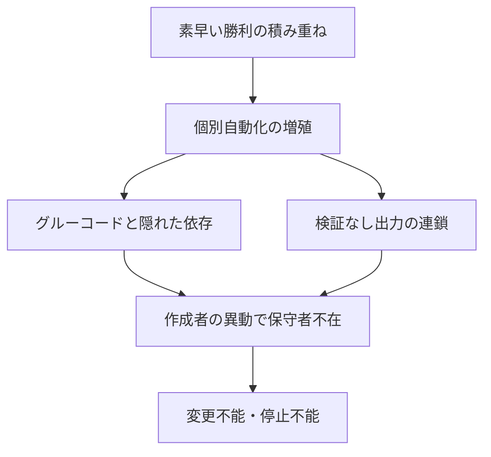

<!-- 採点理由: frequency 3 = 自動化が一定数積み上がった組織で顕在化する段階依存の症状であり中位。damage 5 = 保守不能化は個別案件の損失でなくシステム全体の変更不能・停止不能に至り、リファクタリングでは返済できず作り直ししか残らないため最大。 -->

## 症状

AIを使った小さな自動化・スクリプト・生成出力が部門ごとに増殖し、それぞれを誰が作り、何に依存し、出力を誰が検証しているのか、全社の誰も答えられない。個別には成功事例として報告されてきたのに、いざ業務を変えようとすると「どこかが壊れるので触れない」——これが「隠れ負債の雪だるま」である。

この構図には学術的な原典がある。Googleの研究者ら(Sculley et al.)がNeurIPS 2015で発表した論文は、機械学習が「素早い勝利(quick wins)」をもたらす一方で、実世界のMLシステムは巨大な継続保守コスト=隠れた技術的負債を伴うと指摘した[src-2026-040]。この枠組みは、生成AIやノーコード自動化が量産される現在の環境にもそのまま当てはまると考えられる。作る速度が上がった分、負債のたまる速度も以前より速い。

### 症状チェック3問

1. 社内で動いているAI絡みの自動化・スクリプト・連携の全件一覧(所有者・依存データ・検証方法付き)が存在するか(存在しなければ症状である)。
2. 作成者が異動・退職した後も動き続けている自動化のすべてについて、中身を説明できる現任の保守者がいるか。
3. AI出力をそのまま次工程の入力にしている箇所について、検証の責任者を即答できるか。

2問以上「いいえ」なら、本アンチパターンに該当する。

## なぜ起きるか

第一に、AIの負債は見えない層に積もる。同論文は、通常のコード負債と異なりML負債はシステムレベル・データレベルに存在するため検出が困難で、抽象化やリファクタリングだけでは返済できないとし、境界侵食・もつれ・隠れたフィードバックループ・宣言されないデータ消費者・グルーコード・構成負債といった固有の負債類型を特定した[src-2026-040]。たとえば隠れた依存とは、ある部門の集計スクリプトが、別部門が出力するファイルの列の並びに黙って依存している、といった状態である。列をひとつ足しただけで遠くの業務が止まるが、その依存はコードレビューでは見つからない。

第二に、組織の報告構造が蓄積を加速する。個別の自動化は「素早い勝利」として褒められるが、その保守コストは誰の評価にも計上されない。作ることは評価される一方で、維持と廃止は誰の評価にもならない。この非対称が続く限り、蓄積は止まらない。

蓄積から保守不能に至る経路は次のとおりである(下図は本文の要約)。

## 放置コスト

放置コストは「変更の自由の喪失」であり、これは個別案件の損失よりはるかに重い。隠れた依存とフィードバックループでもつれたシステム群は、一部を直すと別の場所が壊れるため、業務改革・システム更改・ベンダー乗り換えのすべてが高コスト化する。検証されていない出力が下流データに混入していれば、誤りの除去はさらに困難になる。終着点は「全体を捨てて作り直す」しかない状態であり、それまでに払った保守工数は資産として何も残らない。負債とスロップを含む4つの結末の分類は原理編「負債とスロップの分類学」を参照されたい。

## 脱出方法

脱出は、見えない負債を台帳で見えるようにし、複利テストで資産と負債に仕分け、維持と廃止に予算を付ける、という順で進める。

1. 【今すぐ】【推進担当】社内で稼働中のAI絡みの自動化・連携・定常生成物を全件棚卸しする。道具: 原理編「負債とスロップの分類学」のAI施策台帳。完了条件: 全件に所有者・依存データ・検証方法・停止時影響が記入されている。
2. 【1年以内】【部門長】台帳の各件を複利テスト(異動後も残るか・他部門で再利用できるか・モデル交代後も価値が残るか)で資産と負債に仕分け、負債には「作り直す」か「廃止する」かの期限を付ける。道具: 原理編「複利の法則」の複利テスト3問。完了条件: 全件に資産/負債の判定と、負債分の処理期限が付いている。
3. 【1年以内】【CFO】AI施策の稟議様式に保守コスト(検証工数・データ更新・廃止費用)の欄を設け、計上のない案件を差し戻す。道具: 稟議様式の改定。完了条件: 新規案件の全稟議に保守コストが明記され、年次で台帳と突合されている。

(関連: 原理編「負債とスロップの分類学」、原理編「複利の法則」)

<!-- 執筆メモ: 2026-06-12 文体改修: 格言調見出し平易化・内部用語排除・見立て定型句を自然文に置換 -->
