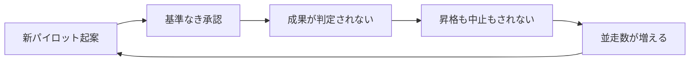

<!--
採点理由:
- frequency=5: PoC後の放棄はアナリスト予測(Gartner 30%)を実測(S&P系調査で「大半放棄」企業42%、PoCの46%破棄)が上回っており、報道によればMcKinseyも垂直ユースケースの本番化10%未満と整理。生成AIに着手した組織のほぼ既定ルートと言える遭遇頻度。
- damage=3: 損害は主にパイロット費用・機会損失・経営の信頼低下であり、負債やスロップのように業務・顧客へ直接蓄積はしにくい。部門KPIレベルの損害。
-->

> 💡 **ひとことで言うと**
> お試し導入ばかり次々と始まるのに、本採用も中止も決めないまま数だけ増えていく状態である。試食ばかりして何も買わずに店内を回り続けるようなもので、始める前に「合格ならこう、不合格ならやめる」と決めておく、という話である。

## 症状

パイロット(PoC=試験導入。用語集「PoC」)の数だけが増え、本番化された施策を誰も挙げられない。各パイロットに「いつまでに何を満たせば本番化し、満たさなければ中止するか」の基準がなく、成果報告は「学びが得られた」で終わる。中止が正式に宣言されることはなく、担当者の異動とともに静かに放置される。報道によればMcKinseyは、事業KPI(事業の成果指標)に直結する垂直的ユースケース(特定業務の流れに組み込む使い方)の大半が本番化に至らずこの状態に留まることを「パイロット煉獄(pilot purgatory)」——昇格も終了もできない宙づりの状態——と呼んだ [src-2026-039]。放棄は予測されていただけでなく、実測でも急増している [src-2026-034]。

> 📊 **データボックス(2026-06時点)**
> - Gartnerは2024年7月、生成AIプロジェクトの少なくとも30%が低品質データ・不十分なリスク統制・コスト膨張・不明確なビジネス価値により2025年末までにPoC後に放棄されると予測 [src-2026-033]
> - 「AIイニシアティブの大半を放棄した」企業の割合は前年の17%から42%へ上昇、組織は平均してPoCの46%を本番化前に破棄(S&P Global Market Intelligence調査、2024年10〜11月、北米・欧州の中堅・上級職1,000人超。CIO Diveの報道による)[src-2026-034]
> - 報道によればMcKinsey(2025年6月報告書)は、事業KPIに直結する垂直的ユースケースの本番化は10%未満で大半が「パイロット煉獄」に留まると整理 [src-2026-039]

### 症状チェック3問

1. 進行中のAIパイロットの総数と総コストを、経営会議で即答できるか。
2. 各パイロットに、本番化と中止の基準が着手時の文書として存在するか。
3. 過去1年間に「中止」を正式に宣言して終えたパイロットが1件以上あるか。

2問以上「いいえ」なら、本アンチパターンに該当する。

## なぜ起きるか

第一に、着手時に成功と撤退を定義していない。Gartnerが放棄の主因に挙げたのは低品質データ・不十分なリスク統制・コスト膨張・不明確なビジネス価値であり、いずれも着手前に答えられたはずの問いである [src-2026-033]。第二に、組織の力学が増殖に有利に働く。パイロットの開始は前向きな実績として評価される一方、中止の宣言には失敗を説明する手間と気まずさが伴う。だから、終わらせる判断を誰も引き受けないことが、個々の担当者にとっては合理的になってしまう。この力学の説明に出典はなく、組織運営でよく見られる経験則である。第三に、基準なき並走は互いに比較されないため、低インパクトな案件が淘汰されない。各案件は別々の会議体に別々の資料で報告され、横に並べて優先順位を問われる場がそもそも存在しない。

増殖の構造は次のループである(止める関門がどこにもない点が本質)。

## 放置コスト

本番化しないパイロットは、費用を使いながら資産を残さない。「何も残らない」という結末である(この結末を含む4分類は原理編「負債とスロップの分類学」で説明している)。さらに、後から一括破棄が起きる際の中止理由はコスト・データプライバシーリスク・セキュリティ懸念であり [src-2026-034]、本来は着手前に潰せた論点に事後精算の形で支払うことになる。最後に、経営の信頼が削られる。経営層は投資のリターンに苛立ち [src-2026-033]、AIへの次の本格投資の社内合意が通らなくなる。この合意形成の停滞こそ、金額には表れない最大の機会損失だと考えられる。

## 脱出方法

新規凍結ではなく、出口の宣言から始める。

1. 【今すぐ】【推進担当】進行中の全パイロットを台帳化し、判定フロー(原理編「負債とスロップの分類学」で定義。施策を投資判断の5択のどれかに振り分ける)にかけて出口を宣言する。道具: 同ページの4列台帳(施策名/出口/撤退条件/次回判定日)。完了条件: 全件に出口・撤退条件・次回判定日が記入され部門長承認を得る。
2. 【今すぐ】【経営】低インパクトなパイロットの中止を経営会議で正式に決定し、中止を咎めない旨を明言する。報道によればMcKinseyの処方箋も低インパクトなパイロットの中止を含む [src-2026-039]。道具: 経営会議の決定事項と議事録。完了条件: 中止件数と理由が議事録に残る。
3. 【1年以内】【部門長】新規パイロットは「本番化基準・中止基準・判定日」の事前文書化を起案の必須条件にする。道具: 起案様式への基準欄追加。完了条件: 基準欄が空欄のままでは起案できない状態になる。

中止を宣言した案件の実際の畳み方(契約の巻き戻し・学習の回収・完了宣言)は、ロードマップ編「撤退プレイブック」を参照。

(関連: 原理編「負債とスロップの分類学」=出口判定のフロー/ロードマップ編「撤退プレイブック」=中止確定後の畳み方の手順/ロードマップ編「最初の90日」)

<!--
執筆メモ:
- 「中止の説明コスト」「比較されないため淘汰されない」「経営信頼の毀損が最大の機会損失」は編集部の見立てとして明記。
- src-2026-034(medium)・039(medium)は報道帰属を本文に明示。高信頼の033と組み合わせて単源依存を回避。
- escapeのfirst-90-days(ロードマップ編「最初の90日」)は公開済みのため「※今後公開」表記を削除(2026-06-11 統合作業)。
- 2026-06-12 文体改修: 格言調見出し平易化・内部用語排除・見立て定型句を自然文に置換
- 2026-06-12 平易化改修済み
-->
