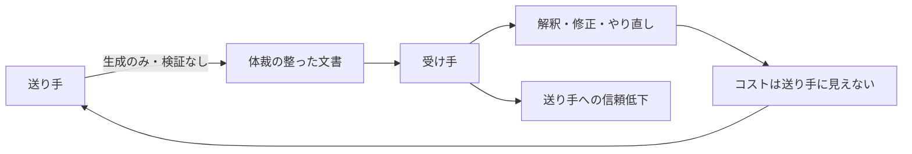

<!--
採点理由:
- frequency=4: 米国デスクワーカー調査で4割が直近1カ月に受領と報告されており、生成AIの個人利用が広がった組織では部門を問わず日常的に発生する。ただし全件が「工場化」(常態化)まで進むわけではないため4。
- damage=4: 損害が金銭(下流の修正工数)に加えて人と人の信頼に蓄積する点が重い。送り手の評判毀損と協働関係の劣化は回復に時間がかかり、部門KPIを超えて組織の協働基盤を侵食するため4。
-->

> 💡 **ひとことで言うと**
> 見た目は立派だが中身のない、AIが作った資料が社内に出回り、受け取った側が直す羽目になる状態である。生煮えの料理を皿だけきれいに盛って出すようなもので、確かめてから渡す責任は作った側にある、という話である。

## 症状

よくできた仕事を装うが実質を欠くAI生成文書——workslop(用語集「ワークスロップ」)——が、送り手の検証を経ずに組織内を流通する。workslopの定義は「よくできた仕事を装うが、タスクを有意義に前進させる実質を欠くAI生成の業務コンテンツ」である(BetterUp LabsとStanford Social Media Labの共同調査、HBR 2025年9月)[src-2026-036]。典型的には、会議の前日に体裁の整った長い資料が届くが要点がどこにも書かれておらず、当日は口頭での説明のやり直しになる。資料の量は増えたのに意思決定は前進せず、受け手側で「これは読む価値があるか」の選別作業が新たに発生していれば、組織はすでに工場化している。

> 📊 **データボックス(2026-06時点)**
> - 米国のフルタイムデスクワーカー1,150人への継続調査(2025年8〜9月時点の集計)で、回答者の40%が過去1カ月にworkslopを受け取ったと回答。職場で受け取るコンテンツの約15.4%が該当すると推計 [src-2026-036]
> - 1件への対処に平均1時間56分。従業員1人あたり月186ドル、1万人規模の組織で年間900万ドル超の生産性損失に相当と試算(米国デスクワーカー対象の試算であり日本企業への外挿はしていない)[src-2026-036]
> - 受け手の53%が不快、38%が混乱、22%が侮辱されたと感じたと回答。送り手については約半数が「創造性・能力が低い」とみなし、42%が「信頼できない」と評価 [src-2026-036]

### 症状チェック3問

1. AI生成物を他者に渡す前の検証責任が、送り手にあると文書で定められているか。
2. 受け手が「検証を経ていない生成物」を理由に差し戻した事例が、過去3カ月に1件以上あるか。
3. 会議資料・報告書の分量増加に対して、意思決定のスピードや質が改善したと言えるか。

2問以上「いいえ」なら、本アンチパターンに該当する。

## なぜ起きるか

構造は単純である。生成の費用がほぼゼロまで下がった一方、検証の費用は下がっておらず、しかも受け手に転嫁できてしまう。workslopは作業負担を下流に移転させる——受け手が解釈・修正・やり直しを強いられ、そのコストは送り手の画面には映らない [src-2026-036]。加えて、これまで品質の代理指標(中身の良さを推し量る目印)として機能してきた「体裁の良さ」が、AIによって誰でも再現できるようになった。外見から実質を見分けられなくなったのである。この説明は調査が直接実証したものではなく、構造からの推論である。検証責任の所在を定めないまま生成ツールだけが普及すれば、転嫁は個人のモラルの問題ではなく組織の既定動作になる。

負担転嫁の構造は次のとおりである(コストが送り手から見えない点が増殖の燃料になる)。

## 放置コスト

第一のコストは下流の修正工数である。受け手の対処時間は集計すると組織規模で無視できない損失になると試算されている [src-2026-036]。第二の、そしてより深刻なコストは信頼である。受け手は送り手の創造性・能力を低く評価し、信頼を下げる——低品質なAI出力は送り手個人の評判コストになる [src-2026-036]。負債(用語集「AI負債」=あとで保守費を請求される借金のような蓄積)がシステムに積もるのに対し、スロップは人と人の信頼に積もる(この分類は原理編「負債とスロップの分類学」で定義している)。稟議資料と報連相の文書が多い日本企業では、体裁の整った文書ほど通りやすいため、この被害はより出やすいと考えられる。敬語と定型を踏まえた体裁が、もっともらしさをさらに高めるからである。この日本企業への読み替えは調査の対象外であり、出典はない。なお本カードの定量データは単一調査(米国対象)に依拠しており、規模の数値は幅をもって読むべきである。

## 脱出方法

生成を禁止するのではなく、検証責任を送り手に固定する。

1. 【今すぐ】【部門長】「AI生成物を他者に渡す前の検証責任は送り手にある」「検証を経ていない生成物を受け手は差し戻せる」の2点を部門ルールとして明文化・周知する。道具: 部門業務ルールへの追記と周知文(低品質出力が送り手の評判コストになる構造 [src-2026-036] を周知材料に使う)。完了条件: 差し戻しの根拠として引用できる文書が存在する。
2. 【今すぐ】【推進担当】提出文書にAI利用の有無と検証者名の申告欄を設ける。道具: 主要な文書様式への2項目追加。完了条件: 検証者名が空欄の文書は受理されない運用が始まる。
3. 【1年以内】【経営】リスク区分に応じた検証義務を社内規程に組み込む(検証義務化ラインは組織・人材編「推進体制とガバナンスの設計図」で定義している。同ページの規程骨子を使い、別物を作らない)。完了条件: 規程に検証義務の条項が入り、経営会議で承認される。

(関連: 原理編「負債とスロップの分類学」=負債とスロップの分類/組織・人材編「推進体制とガバナンスの設計図」=検証義務化ラインと規程骨子/部門別ガイド「PR・広報のAIDX」=受け手が社外になる広報での損害構造の部門展開)

<!--
執筆メモ:
- 出典は指定どおりsrc-2026-036の単源。reliability: highだが単一調査のため、「単一調査に依拠し規模の数値は幅をもって読む」旨を本文で開示(medium単源ルールの精神を準用)。
- workslopの定義と「信頼に蓄積する」整理はdebt-slop-taxonomyと重複するが、定義の引用+正本参照に留め、分類体系自体は再掲していない。
- 「体裁が品質の代理指標として機能しなくなった」「日本では報連相・敬語文化で被害が出やすい」は編集部の見立てとして明記(後者はソースのjp_note由来の論点)。
- 金額・時間の試算は米国対象である旨をデータボックス内に注記し、本文では金額を直書きしていない。
- 2026-06-12 文体改修: 格言調見出し平易化・内部用語排除・見立て定型句を自然文に置換
- 2026-06-12 平易化改修済み
-->
