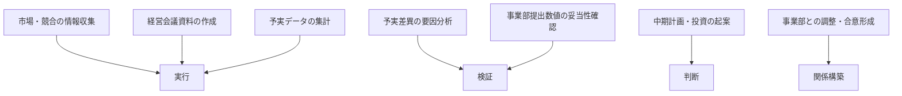

## 効果が早く出る部門ほど、設計のない利用が危ない

事業企画・経営企画の業務——情報収集、分析、資料作成——は、生成AIの主用途とほぼそのまま重なる。日鉄ソリューションズ(ITベンダーであり自社事業領域に関わる調査である点には留意)が大企業の正社員・役員3,757名を対象に実施した調査(2025年9月)では、職種別の活用率で「経営企画・事業企画」が最上位グループに入った[src-2026-053]。帝国データバンクの全国4,705社調査(2024年6〜7月)でも活用用途の最多は情報収集であり、この部門の中核業務とAIの主用途の重なりを裏づける[src-2026-049]。ただし帝国データバンク調査は中小企業を多く含む母集団であり、業務で活用する企業自体はまだ少数にとどまる(数値は下記データボックス)。「使えるか」を議論する段階をすでに超えているという本ページの前提は、大企業のこの部門に関する記述である。

問題はその先にある。同じ大企業調査で、活用の大半は情報収集・補助的利用にとどまり、業務プロセスへの組み込みは少数にとどまった[src-2026-053]。親和性が高い部門ほど、個人の時短で満足が成立してしまい、組織の能力への変換が起きない。さらにこの部門の成果物は経営会議資料という全社の意思決定の最上流に流れ込むため、検証なきAI利用は質の低い「もっともらしい資料」——ワークスロップ——の発生源になる[src-2026-036]。本ページは、この部門の業務をどう分解し、どこから委任し、何を人間に残すかを示す。

> 📊 **データボックス(2026-06時点)**
> - 大企業の生成AI業務活用率は全体で約4割。活用レベルは「情報収集・試行」「補助的・効率化」の補助的利用が約7割を占め、業務プロセスへの組み込みは2割未満。職種別では「経営企画・事業企画」「商品企画・サービス企画」「法務・知財・コンプライアンス」「研究開発」で活用率が高い(日鉄ソリューションズ、大企業の正社員・役員3,757名、2025年9月実施。ITベンダーによる調査)[src-2026-053]
> - 活用用途のトップは「情報収集」で59.9%。一方、生成AIを業務で「活用している」企業は17.3%にとどまる(帝国データバンク、全国4,705社・中小企業を多く含む母集団、2024年6〜7月実施)[src-2026-049]
> - 報道によれば、McKinsey調査「The State of AI in 2025」(2025年11月公表、回答1,993名・105カ国)では、88%が少なくとも1つの業務機能でAIを定常利用する一方、high performer(AI起因のEBITへの5%超の寄与を含む大きな価値創出の条件を満たす企業)は約6%。その企業群はワークフローの根本的再設計を行う割合が55%と、その他企業(約20%)の2.8倍だった[src-2026-004]

## 委任できる業務は「実行」に集中している

業務分解の方法と4分類(判断/検証/実行/関係構築)の定義は、組織・人材編「業務分解×再配置プレイブック」で説明している(委任の出発点は4分類の仕分けである)。本ページではその枠組みをこの部門の主要業務に当てはめる。以下の対応づけに出典はなく、業務内容からの整理である。

経営企画・事業企画の主要業務を4分類に対応づけると次のとおりである(委任の第一候補は「実行」に集まる)。

この部門の特徴は、業務時間の大きな割合が「実行」(リサーチ、集計、資料ドラフト)に費やされている一方、部門の存在価値は「判断」(計画・投資の起案)と「関係構築」(事業部との合意形成)にあるという非対称である。この整理に出典はないが、だからこそ委任の余地が大きく、同時に、委任で浮いた時間をどこに振り向けるかの設計——手順3の再構築——を省略すると、時短だけして価値が増えない部門になる。注意すべきは「実行」に紛れた暗黙の検証で、たとえば経営会議資料の作成には「事業部の数字を疑う」工程が埋め込まれている。これを資料ドラフトと一括でAIに渡すと、検証が業務から消える。

## AI影響の時間軸マップ(今/1年/3年)

どの業務がいつ変わるかの時間軸マップを示す。以下は出典のある予測ではなく、この部門の業務構成と現在の技術動向から置いた見通しである。

| 時間軸 | 起きること(出典のない見通し) | 部門の重心 |
|---|---|---|
| **今** | 「実行」タスクの委任はすでに成立——市場・競合リサーチの一次整理、経営会議資料の一次ドラフト、議事録とタスク整理。個人レベルの利用は調査が示すとおり既に広がっている[src-2026-053] | 論点は使うか否かではなく、検証者を明記した組織のフローに乗せるか否か。検証手順の文書化を開始 |
| **1年** | 予実差異分析・定例モニタリングへの組み込み。AIが差異の検出と要因仮説の下書きを担い、人間が仮説の裏取りと採否を行う協働型が定例業務のフローに入る | ここから先は個人の工夫では進まない。データの構造化と検証工程の常設が前提(下記「いまやるべき準備」) |
| **3年** | 計画策定サイクル自体の再設計。年1回の中期計画ローリングを構成する業務のうち、環境分析・予実集計・シナリオの下書きといった「実行」部分——出典のない目安だが中計ローリング工数の5〜7割——が、継続的なシナリオ更新と監視に置き換わる可能性がある | シナリオの採否・投資の起案・事業部との合意形成は人間が握る構図は変わらないとみている。サイクル全体の自動化は能力向上を待つ領域 |

## いまやるべき準備 — データ・フロー・情報管理

1年後の「組み込み」に進めるかは、いま準備する3つの資産で決まる(全社版の整理は AI-Ready編「AI-Ready自己診断」参照)。

- 【部門長】(今すぐ)**計画・予実データの構造化**。事業部から集まる数値が部門ごとに様式バラバラのスプレッドシートでは、分析の協働は成立しない。道具: 様式の統一と項目定義書。完了条件: 主要事業部の予実データが同一様式・同一定義で月次収集されていること
- 【推進担当】(今すぐ)**資料作成フローの文書化**。経営会議資料が「誰が・何を見て・どう検証して」作られているかを書き出す。道具: 組織・人材編「業務分解×再配置プレイブック」の業務分解ワークシート。完了条件: 定例資料1種類について全タスクに4分類・検証者が記入されていること
- 【部門長】【推進担当】(今すぐ)**計画数字の入力可否ルール**。未公表の計画数値・投資検討情報は機密性が最も高い情報群であり、どの環境なら入力してよいかを先に決める。道具: 組織・人材編「推進体制とガバナンスの設計図」の暫定ガードレール(入力可否+検証義務+相談先)——部門で別物を作らず全社ルールの当てはめとして書く。上場企業では、未公表の計画数値・業績見通しはインサイダー情報(未公表の重要事実)に該当しうるため、入力可否ルールとインサイダー情報管理規程との整合を法務に確認する。完了条件: 部員全員が「この数字はどこまで入れてよいか」に即答できること
- 【部門長】(1年以内)**検証基準の言語化**。「良い経営会議資料」の条件を暗黙知から文書に変える。完了条件: 下記の運用ルール5箇条のチェック項目が部門の資料レビューで実際に使われていること

## 人材再配置の方向 — 二重の当事者性を持つ部門

役割の重心移動の枠組み(検証者・設計者・例外処理者の3役割)は、組織・人材編「実行者から検証者・設計者へ」で定義している(実行をAIへ移し、人の重心を検証・設計・例外処理に移す)。この部門への当てはめは次のとおりで、出典のある整理ではない。

第一に、自部門の再配置。リサーチ・集計・ドラフトの「実行」をAIへ委任し、部員の重心を**検証者**(資料・分析の品質の最終責任。数値の突合、もっともらしい誤りの検出)と**例外処理者**(非定型の経営アジェンダ、事業部との折衝)へ移す。経営会議資料の品質責任は「AIが下書きし、起案者とは別の検証者が記名で差し戻す」役割設計に置き換える(下記の運用ルール5箇条)。

第二に、主管部門としての当事者性。自部門業務の変革と主管する全社機能の変革を同時に負う「主管部門の多重当事者性」の構造は、部門別ガイド「人事のAIDX」(三重の当事者性)で詳しく説明している。経営企画はその部門別断面として、「自部門の業務変革 × **全社AIDXの設計者の供給源**」という二重の当事者性を負う。設計者に必要なスキル——業務の分解力、費用対効果の試算、部門横断の調整——は経営企画の中核スキルとほぼ一致する。自部門の業務をワークシートで分解した経験者は、そのまま他部門の再設計の伴走者になれる。この部門の再設計が遅れると、遅れは1部門分では済まず、全社の設計能力の供給が細ると考えられる(スキルの重なりからの推論であり、出典のある分析ではない)。逆に先行すれば、自部門が全社展開の雛形と人材プールを兼ねる。

## この部門特有の罠

**罠1: 個人の時短で満足する(補助的利用の典型部門)。** 親和性が高いゆえに、各自が個人の工夫で使い始め、そこで止まる。秘伝プロンプトは異動とともに消え、組織には何も残らない。大企業調査で活用の大半が補助的利用にとどまる構図[src-2026-053]の典型がこの部門である。脱出の判定には原理編「複利の法則」の複利テスト3問を使う(関連: アンチパターン集「コパイロット一斉配布」)。

**罠2: 経営会議へのワークスロップ供給源になる。** ワークスロップとは、よくできた仕事を装うが実質を欠くAI生成の業務コンテンツであり、解釈・修正の負担を受け手に転嫁する[src-2026-036]。BetterUp LabsとStanford Social Media Labの共同調査(米国フルタイムデスクワーカー1,150人、2025年8〜9月)がこの被害を定量化した[src-2026-036]。企画部門は全社で最も資料を量産する部門の一つであり、その受け手は経営会議である。もっともらしいが裏付けのない資料が意思決定の最上流に流れることは、作成時間の節約をはるかに上回る損害になる——日本では稟議文化と体裁重視がもっともらしさを増幅するため、この被害構造は出やすいと考えられる——米国調査からの読み替えであり、日本での裏づけ調査はまだない(関連: アンチパターン集「ワークスロップ工場」、原理編「負債とスロップの分類学」)。

**罠3: 計画数字の無統制入力。** この部門が扱う未公表の計画数値・投資検討情報は、漏えい時の損害が全社で最大級である。禁止しても利用は止まらず、担当者が個人契約のチャットAIに計画資料の文面を貼り付けて下書きを作る——会社のログには何も残らない——という形で見えなくなるだけである。入力可否ルールと承認環境の提供が先である(関連: 組織・人材編「推進体制とガバナンスの設計図」)。

> 📊 **データボックス(2026-06時点)**
> - 回答者の40%が過去1カ月にワークスロップを受け取ったと回答。職場で受け取るコンテンツの約15.4%が該当すると推計され、1件への対処に平均1時間56分を要する(BetterUp Labs × Stanford Social Media Lab、米国フルタイムデスクワーカー1,150人、2025年8〜9月集計、HBR掲載)[src-2026-036]

導入そのものは広く行き渡る一方、価値は業務を再設計した少数の企業に集中する。この全社的な構図(関連: 原理編「AIDXの定義」)が最もはっきり表れるのが、導入だけなら最も簡単なこの部門である。

## 経営会議資料の「AI下書き+検証」運用ルール(そのまま使える)

そのまま部門ルールの叩き台に使える5箇条を示す。この5箇条は出典のある標準ではなく、叩き台として作成した様式である。検証ログの様式は組織・人材編「実行者から検証者・設計者へ」の最小様式をそのまま使い、部門で別様式を作らない。集計・解釈ドラフトの検証手順(検証チェック5問)は業務パターン「データ分析の一次集計と解釈ドラフト」を参照。

1. **記名検証**: AI下書きを使った資料は、起案者とは別の検証者1名を資料ごとに記名する。検証者欄が空白の資料は経営会議に上程しない
2. **数値の全件突合**: 資料中の数値・固有名詞・日付・出典は、検証者が原簿(基幹システム・原典資料)と全件突合する。AIの出力同士の突合は突合と認めない
3. **実質の差し戻し基準**: 「結論が数値で裏付けられているか」「示唆が自社の文脈に固有か(どの会社にも言える一般論は差し戻し)」「反対案・リスクが検討されているか」の3問のいずれかがNoなら差し戻す
4. **入力可否の遵守**: 未公表の計画数値・投資検討情報は、承認された環境以外に入力しない。可否に迷ったら入力せず相談先へ(全社ガードレールに従う)
5. **検証ログの記録**: 差し戻しは1件1行で記録し、月次で集計する。差し戻し理由の蓄積が部門の品質基準書に育つ

あわせて、業務分解ワークシート(様式は組織・人材編「業務分解×再配置プレイブック」のものを使う)のこの部門版の記入例を示す。対象は「中期計画の年次ローリング」で、記入内容は出典のない想定例である。なお、ここでの論点が「計画策定業務へのAIの組み込み」だとすれば、AIDX自体を中計・予算・取締役会決議の中身として書く側の論点はロードマップ編「経営計画への翻訳」が扱う。

| タスク | 4分類 | 再配置 | 検証者 | 移行時期 |
|---|---|---|---|---|
| 市場・マクロ環境のリサーチと一次整理 | 実行 | AI委任 | 担当者(原典と数値・出典を突合) | 今すぐ |
| 過年度計画と実績の差異集計 | 実行 | AI委任 | 担当者(基幹データと突合) | 今すぐ |
| 差異の要因仮説の立案・裏取り | 検証 | 協働 | 課長(AIの仮説を一次情報で裏取り) | 今すぐ |
| 事業部提出数値の妥当性チェック | 検証 | 人間保持(AIは指摘の下書きまで) | 部長 | 移行しない |
| シナリオ・打ち手オプションの整理 | 判断 | 協働(AIは選択肢と根拠の整理まで) | 部長(採否と責任は人間) | 1年以内 |
| 投資優先順位の起案 | 判断 | 人間保持 | 経営会議 | 移行しない |
| 事業部との数値すり合わせ・合意形成 | 関係構築 | 人間保持 | — | 移行しない |

## 体制と費用の目安

以下の規模・期間・決裁レンジに出典はなく、実務上の経験則である。**中堅(数百名規模、経営企画3〜10名)**: 兼務2〜3名で定例資料1種類から開始。期間90日。既存の全社契約ツールの範囲なら追加投資ゼロ〜数十万円で、経営企画部長の決裁で始められる。**大企業(数千〜数万名規模、経営企画・事業企画合計数十名以上)**: 先行1チーム(対象5〜10名、専任0.5〜1名+兼務)で90日のパイロット→部内展開90日の2段階。決裁は担当役員(CSO/CFO相当)。どちらのレンジでも、この部門のワークシートと検証基準は全社展開の雛形になるため、推進部門と様式を最初から共通化しておくことが横展開コストを下げる。経営が承認・否認する判断は1つに絞る——先行1チームのパイロット予算(上記レンジ)を承認するか否か、である。あわせて、パイロット終了時(90日目)にベースライン比較(作成時間・差し戻し率)を見て、この部門の様式・検証基準を全社展開の雛形に格上げするか否かを判定する、と判定時期を承認時に決めておく。

## 最初の90日 — 3手の部門版

全社版の工程は、ロードマップ編「最初の90日」を参照。ここではその部門版として3手に絞る。この工程立てに出典はなく、実務上の段取りである。

- **手1(〜30日)分解と計測**: 【部門長】【推進担当】(今すぐ)定例の経営会議資料1種類を業務分解ワークシートで分解し、現状の作成時間・差し戻し回数を計測する。道具: 上記記入例+組織・人材編「業務分解×再配置プレイブック」のワークシート。完了条件: 全タスクに4分類・再配置・検証者が記入され、現状のベースライン計測値が記録されていること
- **手2(31〜60日)ガードレールと委任開始**: 【部門長】(今すぐ)計画数字の入力可否ルールを全社ガードレールから当てはめて配布し、「AI委任・今すぐ」のタスクで上記5箇条の運用を開始する。道具: 運用ルール5箇条+検証ログ様式。完了条件: 上程資料の検証者欄に空白がなく、検証ログが回り始めていること
- **手3(61〜90日)複利化と報告**: 【推進担当】(今すぐ着手、90日目完了)差し戻し理由・有効だった指示文・検証基準を部門共有の資産にまとめ、効果(作成時間・差し戻し率の変化)を経営会議に報告する。道具: 検証ログの月次集計。完了条件: 共有資産が個人フォルダ外にあり、次の展開部門(候補1部門)への引き継ぎ計画が承認されていること
- 【経営】(能力向上を待て)計画策定サイクル全体の自動化や「判断」タスクの大規模委任は待つ。検証工程と責任設計が定着する前の拡大は、罠2をそのまま全社に配ることになる

**この主張が崩れる条件**: 検証者の記名や業務分解を伴わない個人任せのAI利用だけで、資料品質(差し戻し率・後工程での欠陥発覚)を悪化させずに部門のリードタイム短縮が持続した事例が、ベンダー発以外の複数の独立した調査で確認されたとき。

<!--
執筆メモ(ソースが薄い箇所・レビュー重点ポイント):
- 「業務時間は実行に偏り、価値は判断・関係構築にある」という非対称、時間軸マップ(今/1年/3年。3年の「中計ローリング工数の5〜7割が継続シナリオ更新に置き換わる」を含む)、規模感2レンジとパイロット予算承認・雛形化判定の設計、90日3手、運用ルール5箇条、ワークシート記入例はすべて出典のない編集部の見立て(本文にマーカー明示済み)。
- src-2026-053は日鉄ソリューションズ(ITベンダー)の調査。reliability: high だがベンダー発のため本文で調査主体と利益相反を開示。「補助的利用が大半」は本ページでは053単源——ただしページの結論はこの数値ではなく「親和性の高さが罠に直結する」という構造主張に置いた。aidx-is-redesign側に同趣旨の多源記述あり。
- src-2026-004はmedium(報道経由)。「報道によれば」帰属+データボックス隔離済み(結論節のデータボックスに配置。high performerの定義=AI起因のEBIT 5%超寄与を含む条件、を併記)。結論は背負わせていない。
- src-2026-049(帝国データバンク)は中小企業を多く含む全国調査のため、「使えるか議論は超えた」の根拠には使わず、用途構成(情報収集が最多)の裏づけに限定。母集団差(活用17.3%)は本文で開示しデータボックスに数値を隔離(2026-06-11 第3陣レビュー反映)。
- src-2026-036(workslop)の数値は米国デスクワーカー対象。日本文脈への適用(稟議文化・体裁重視)は jp_note を編集部見立てとして展開。
- 参照先のアンチパターン集「ワークスロップ工場」「コパイロット一斉配布」、ロードマップ編「最初の90日」は作成済み。タイトル一致を確認し、本文の参照名を実タイトルに合わせて修正した(2026-06-11 統合作業)。なお両アンチパターンカードのdepartmentsは[all](全部門対象)のため、corporate-planning個別指定は不要と判断。
- 4分類・3役割・ワークシート様式・暫定ガードレール・検証ログ様式・複利テスト・主管部門の多重当事者性(正本: 部門別ガイド「人事のAIDX」)はすべて正本参照のみで再定義していない(フレーム台帳照合済み)。「二重の当事者性」は多重当事者性フレームの部門別断面として正本参照+対応1行に置換済み(2026-06-11 第3陣レビュー反映)。図は「部門業務→4分類の対応づけ」であり正本の判定フロー図の複製ではない。時間軸マップは部門ページ標準構成に合わせ表形式(mermaid図は削除)。
2026-06-12 文体改修: 格言調見出し平易化・内部用語排除・見立て定型句を自然文に置換
-->
