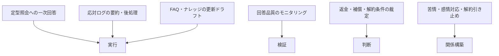
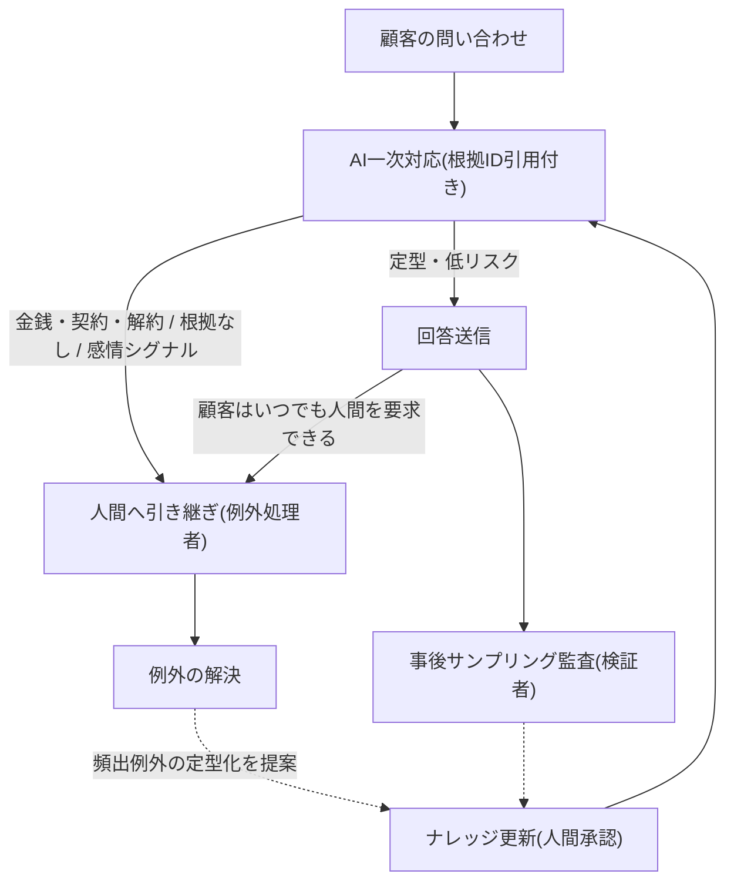

## 効果は実証済みだが、例外を拾う設計が前提になる

カスタマーサポートは、生成AIの業務効果が大規模な学術研究で実証された数少ない部門である。Brynjolfsson(スタンフォード)らがFortune 500企業のサポート担当者約5,200名への段階導入を分析した研究(査読版2025年)は、担当者支援型——AIが回答候補を提示し、人間が確認して送信する形——のAIで生産性が測定可能なかたちで向上し、効果は経験の浅い担当者に集中したこと、顧客満足度の向上・離職率の低下とも関連したことを示した[src-2026-069]。「使えるか」の議論はこの部門ではすでに終わっている。

問題は、成熟しているからこそ「人間を置き換える」方向へ踏み込みやすいことである。決済企業Klarnaは自社発表でAIアシスタントの大規模な成果を公表し人員を削減したが[src-2026-070]、その約1年後、報道によればCEO自身が「コストを重視しすぎた結果、品質の低下を招いた」と認めて人間のエージェント採用を再開し、AIから人間へのシームレスな引き継ぎを備えたハイブリッド体制へ移行した[src-2026-071]。撤回されたのはAI導入そのものではなく、人間を排除する運用方針の方である。顧客感情の側でも警戒は解けていない。Gartnerが2026年に公表した顧客調査(プレスリリースの配信転載による)では、製品・サービスの推奨について過半がAIより人間の担当者を信頼すると回答した[src-2026-090]。また報道によれば、同社の2025年発表の消費者調査で、顧客が生成AI応対をためらう主因は人間の担当者に到達できなくなる懸念であり、人間への到達経路の明示が受容の条件になる[src-2026-091]。乗り換え意向については、報道によれば2023年末のGartner調査で、AI利用を知れば競合への乗り換えを検討するとの回答が過半にのぼった(調査時点はやや古い)[src-2026-072]——この部門では品質低下が解約に直結する。顧客感情側の定量データはいずれもGartner調査(報道・配信経由)に依拠するため割り引きが必要だが、Klarnaの方針転換という独立した事例が同じ方向を示している。

したがってこの部門のAIDXの核心は、自動化率の最大化ではなく**エスカレーション設計**にあると考える。AIが落とす例外——規程にない返金要求、怒りや不安をぶつけてくる連絡、解約をほのめかす問い合わせのような、非定型・感情・金銭の裁定が絡む案件——を人が確実に拾い、顧客がいつでも人間に到達できる経路を保証する設計である。企業のAI利用の実態分析でも、自律性を抑えた「統制された委任」が優先されている[src-2026-023]。そしてその拡大を支える燃料が、質問・回答・解決結果が1件ごとに対で残る応対ログの構造化である。

> 📊 **データボックス(2026-06時点)**
> - AIアシスタント導入で1時間あたりの解決件数が平均14〜15%増加。経験の浅い担当者は約34%改善した一方、最も経験豊富な担当者は速度の小幅改善と品質の小幅低下にとどまった(Brynjolfsson・Li・Raymond、Fortune 500企業のサポート担当者約5,200名、QJE 140(2)、2025年)[src-2026-069]
> - Klarna発表(自社発表値): AIアシスタントは稼働1か月(2024年1〜2月)で230万件の会話を処理しチャットの3分の2を占め、フルタイム換算700名分に相当、解決時間は平均11分から2分未満に短縮(Klarnaプレスリリース、2024年2月)[src-2026-070]。ただし2025年5月、人間を置き換える運用方針は撤回された[src-2026-071]
> - 顧客の54%が製品・サービスの推奨について「AIより人間の担当者を信頼する」と回答(AIをより信頼するは32%)(Gartner顧客調査、米国の顧客5,801人、2025年1〜2月実施・2026年4月プレスリリース、Business Wire配信の転載で確認)[src-2026-090]
> - 報道によれば、生成AIアシスタントの利用に前向きな顧客は約半数。主要チャネルが電話の顧客では35%に下がり(ソーシャルメディアでは76%)、ためらいの主因は人間の担当者に到達できなくなる懸念(Gartner消費者調査、4,800人超、2025年6月発表、CX Dive報道)[src-2026-091]
> - 報道によれば、顧客の53%が「AI利用を知ったら競合への乗り換えを検討する」、64%が「企業にはカスタマーサービスでAIを使ってほしくない」と回答(Gartner 2023年12月調査、顧客5,728人、The Register 2024年7月報道。調査時点が古く、乗り換え意向の後継設問を持つ調査が出れば入れ替え予定)[src-2026-072]

## 業務の分解マップ

業務分解の方法と4分類(判断/検証/実行/関係構築)の定義は組織・人材編「業務分解×再配置プレイブック」で説明しており、ここでは再定義しない。カスタマーサポートの主要業務に当てはめると次のとおりである。対応づけは出典のある分類ではなく、本ページでの整理である。

サポート業務を4分類に対応づけた見取り図である(委任の第一候補は「実行」に集まる)。

この部門の分解で注意すべき点は2つある。第一に、**検証の設計が他部門と逆向きになる**。社内文書なら「送信前に人間が全件検証」が成立するが、顧客直接応対の規模では送信前全件検証は物理的に成立しない。だから検証は「事前の全件確認」ではなく、リスク振り分け(金銭・契約・解約に関わる回答は送信前に人間確認)+即時エスカレーション+事後のサンプリング監査という多段の検証アーキテクチャに再設計する必要がある。これは検証義務化ライン(定義は組織・人材編「推進体制とガバナンスの設計図」。誤りが顧客・お金・法令に直接届く利用は「高」リスク)の緩和ではなく、顧客応対への当てはめである——AIの顧客向け回答は誤りが顧客に直接届く以上、検証なしの自動送信を既定にしてはならない。第二に、**AIの回答は会社の公式発信である**。カナダの審判所はAir Canadaのサイト上のチャットボットが運賃を誤案内した事案で、「ウェブサイトの一部であるチャットボットの情報にも、静的ページと同様に企業が責任を負う」と判断し、同社に支払いを命じた(Moffatt v. Air Canada, 2024 BCCRT 149。大手法律事務所の解説による)[src-2026-087]。「チャットボットは別主体」という言い訳は通らない。

### 分解記入例: 問い合わせ対応(1窓口)のワークシート

様式(5列)は組織・人材編「業務分解×再配置プレイブック」の業務分解ワークシートをそのまま使う。問い合わせ窓口1系統の流れを分解した記入例を示す。記入内容は出典に基づくものではなく、本ページで作成した例である。

| タスク | 4分類 | 再配置 | 検証者 | 移行時期 |
|---|---|---|---|---|
| 定型FAQ照会への回答候補の提示(担当者支援型) | 実行 | AI委任 | 担当者(根拠記事と突合のうえ送信) | 今すぐ |
| 応対後の記録作成(要約・分類タグ付け) | 実行 | AI委任 | 担当者(誤分類のみ修正) | 今すぐ |
| 低リスク定型照会への直接自動応答 | 実行 | AI委任 | SV・品質管理(事後サンプリング監査+誤答率の月次計測) | 1年以内(運用ルール5箇条の整備後) |
| 返金・補償・解約条件に関わる回答 | 判断 | 協働 | 窓口責任者(AIは規程・履歴の整理まで。送信前に人間確認) | 移行しない(検証義務化ライン「高」の当てはめ) |
| 自動応答の品質モニタリング | 検証 | 人間保持 | SV・品質管理 | 移行しない |
| 苦情・感情的案件・解約引き止め | 関係構築 | 人間保持 | — | 移行しない |
| FAQ・ナレッジ記事の更新ドラフト | 実行 | AI委任 | ナレッジ担当(承認なしの還流禁止) | 今すぐ |

運用ルールは元のワークシートと同じである——「AI委任」で検証者欄が空白の行は委任禁止、「移行しない」には保持理由必須。

## AI影響の時間軸マップ(今/1年/3年)

以下の見通しに出典はない。確定予測ではなく、準備の優先順位を決めるための作業仮説として使う。

| 領域 | 今 | 1年 | 3年 |
|---|---|---|---|
| **一次対応(定型照会)** | 担当者支援型(AIが候補・人間が送信)の委任が成立。実証研究の効果もこの形態で測定された[src-2026-069] | 低リスク定型に限定した顧客直接応答の解禁判定。前提は運用ルール5箇条と誤答率の実測 | 定型一次対応の大半が自動化候補に。ただし人間到達経路は常設のまま残す |
| **例外・苦情・裁定** | 人間保持。エスカレーション基準(現在SVに上がる条件)の文書化から始める | 例外→ナレッジ化→自動化範囲の拡大、という例外の定型化サイクルが回り始める | 人間の主業務が例外・感情・高額案件に集約。例外処理者の専門職化 |
| **ナレッジ管理** | FAQ・応対ログの棚卸しと一意ID付与。回答と根拠の紐付け | 応対ログからのFAQ改訂自動起案+人間承認の還流運用 | 構造化されたログとFAQが、チャネル追加・モデル交代後も持ち出せる移行資産になる |
| **品質管理・VOC** | モニタリング観点の文書化(暗黙知の言語化) | 検証者によるサンプリング監査・誤答率/エスカレーション率の月次計測が常設 | 品質管理が「人の応対の監査」から「AIと人の混成応対の監査」へ再設計 |

## いまやるべき準備 — エスカレーション設計と応対ログの資産化

1年後に顧客直接応答の解禁を判定できるかは、いま整える3つの準備で決まる。

**① エスカレーション基準の文書化【SV・品質管理】(今すぐ)。** いま熟練オペレーターからSVに上がる基準——金額の閾値、感情の兆候、規程にない要求——を書き出す。これが将来のAI→人間引き継ぎ基準の原型になる。文書化されていないエスカレーション基準は、AIには実装できず、ベテランの退職とともに消える。完了条件: 引き継ぎ基準が1枚文書になり、現役SVのレビューを通っていること。

**② 応対ログ・FAQの構造化【部門長】(今すぐ)。** 応対ログは、入力(質問)・出力(回答)・結果(解決したか、再問い合わせが来たか)が1件ごとに対で残る稀有な業務データであり、全社でも最良級の構造化資産候補の一つといえる(資産の考え方はAI-Ready編「AI-Readyの5資産」、複利になる条件は原理編「複利の法則」参照)。FAQ記事に一意IDを振り、AIの回答に根拠IDの引用を必須化し、解決/未解決タグを揃える。完了条件: 主要FAQ記事にIDが振られ、回答→根拠→解決結果が機械的に追える状態になっていること。

**③ 顧客接点でのAI利用の開示方針【部門長】【法務・広報】(今すぐ)。** AIの回答は会社の公式発信として責任を問われ[src-2026-087]、顧客の側にはAI応対への警戒が根強く、人間への到達経路の明示が受容の条件になる[src-2026-091]。AI利用を隠す設計は、露見時に両方のリスクを同時に踏む。AI利用の開示と、人間到達経路の明示(問い合わせ導線から人間への経路を隠さない)を、自動化の拡大前に決めておく。完了条件: 開示文と人間到達経路が顧客向け導線上で確認でき、法務のレビューを通っていること。

この3つが揃ったときの運用の全体像を示す(一次対応AIの運用ループ。本ページで提案する設計である)。

## 人材再配置の方向

役割の重心移動の宛先(検証者・設計者・例外処理者)の定義・任命要件・評価観点は組織・人材編「実行者から検証者・設計者へ」で説明しており、ここでは再定義しない。カスタマーサポート固有の点は3つある。

第一に、**この部門は例外処理者の代表部門である**。一次対応の委任が進むほど、人間に残る案件は定義上「AIが解けなかったもの」——非定型・感情的・裁定が必要——に純化していく。オペレーターの重心は「件数をこなす実行者」から「AIが落とした例外を解き、頻出例外の定型化を設計者に提案する例外処理者」へ移る。評価指標も処理件数・平均処理時間系から、例外案件の解決リード時間・定型化提案数へ張り替える必要がある(KPI張り替えの考え方は同ページを参照)。

第二に、**SV・品質管理は検証者の最有力候補である**。応対モニタリングという既存業務は、対象が「人の応対」から「AIと人の混成応対」に変わるだけで、検証者の職務(サンプリング監査・誤答率の計測・差し戻し)とほぼ連続している。検証ログの様式は組織・人材編「実行者から検証者・設計者へ」の最小様式をそのまま使う。

第三に、**例外処理者の供給源を自分で断たない**。前掲の実証研究は、AI支援の効果が経験の浅い担当者に集中し、担当者の学習促進とも関連したことを示した[src-2026-069]——担当者支援型のAIは新人の底上げと育成補助に働きうる。しかし、定型一次対応は例外対応力を育てる場数の供給源でもあり、顧客直接型で新人の場数自体を消すと、数年後に例外処理者・検証者の任命候補が枯渇する(訓練価値の仕分けの手順は組織・人材編「新人が育たない問題」にある)。委任判定の前に訓練価値の点検を挟むこと。

## この部門特有の罠

**罠1: コスト削減だけを目的にした全面自動化。** 起案の成功指標が削減額単独になると、品質・解約への影響が判定から消える。Klarnaの方針転換[src-2026-071]が示すのはまさにこの構図で、報道によればCEOは「コストを重視しすぎた結果、品質の低下を招いた」と認めた。AI導入自体の効果は維持されており、撤回されたのは人間を置き換える運用方針である。解約率・再問い合わせ率・顧客満足を削減額と同列の判定指標に置き、人間到達経路を残す(関連: アンチパターン集「ツール先行・課題不在」——起案の主語が顧客の課題ではなく削減額・技術になる点で同型の失敗)。

> 📊 **データボックス(2026-06時点)**
> - 報道によれば、Klarnaの方針転換後もAI導入自体の効果(応答時間82%短縮・リピート問い合わせ25%減)は維持されており、撤回されたのは「人間を置き換える」運用方針の方(CX Dive、2025年5月)[src-2026-071]

**罠2: 検証なき回答の蓄積。** AIの回答実績を人間の承認なしにFAQ・ナレッジへ還流させると、誤答が「実績のある回答」として再生産され、蓄積するほど誤りの出所が追えなくなる。社内向けなら受け手が差し戻せるが、受け手が顧客の場合、誤答はAir Canada事案のとおり会社の責任として返ってくる[src-2026-087](関連: アンチパターン集「ワークスロップ工場」=検証責任の固定で防ぐ、同「隠れ負債の雪だるま」=無検証の生成物が保守不能の塊に育つ)。脱出は運用ルール5箇条の第1条(根拠の引用強制)と第5条(ナレッジ還流の人間承認)。

**罠3: ログを捨てたまま自動化に着手する。** 応対ログが録音のまま・自由記述のまま・委託先のシステム内に塩漬けのままでは、自社の問い合わせ分布に接地しないボットができあがり、デモは動くのに本番で使いものにならない(関連: アンチパターン集「データなき自動化」)。順序はログの構造化が先、自動化が後である。外部委託(BPO)の場合、ログの所有権・持ち出し条件が委託契約で曖昧なことが多く、契約確認を先に行う。

## 一次対応AIの運用ルール5箇条(そのまま使える文例)

そのまま部門ルールの叩き台に使える文例を示す。この文例自体に出典はない。検証義務化ラインの定義は組織・人材編「推進体制とガバナンスの設計図」、検証ログの様式は同「実行者から検証者・設計者へ」の最小様式を使い、部門で別様式を作らない。一次対応の一般的な型(三分岐と振り分け基準表)は業務パターン「問い合わせの一次対応と例外エスカレーション」で詳しく扱っている。

> 1. **根拠の引用強制**: AIの顧客向け回答は、根拠となるFAQ記事・規程のIDを引用できる場合のみ送信できる。根拠を引用できない回答は送信せず、自動で人間へ引き継ぐ。
> 2. **人間到達経路の保証**: 顧客はどの段階でも人間の担当者を要求でき、その経路を導線上で隠さない。
> 3. **リスク振り分け**: 金銭(返金・請求・補償)・契約(解約・更新条件)・法令に関わる回答は、送信前に人間が確認する(検証義務化ライン「高」の当てはめ)。
> 4. **事後モニタリング**: 自動送信された回答は検証者がサンプリング監査し、誤答率とエスカレーション率を月次で集計する。閾値超過時は自動応答の範囲を縮小する。
> 5. **ナレッジ還流の人間承認**: AIの回答実績をFAQ・ナレッジに反映する際は人間の承認を必須とする。無検証の還流は誤答の再生産になる。

## 体制と費用の目安

以下の目安に出典はなく、実務上の経験則である。**中堅(数百名規模、サポート窓口3〜10名)**: 担当者支援型から始める。対象1問い合わせカテゴリ・兼務2〜3名(SV1名含む)・期間90日・部門長決裁。既存の全社契約ツールの範囲なら追加投資は小さく抑えられる。顧客直接型の解禁はFAQ構造化と運用ルール5箇条の整備後に別途判定する。**大企業(数千〜数万名規模、コンタクトセンター数十〜数百席・BPO委託含む)**: 1窓口・1カテゴリの限定パイロット(専任1名+SV・品質管理2〜3名・90〜180日・担当役員決裁)から段階展開する。BPO委託がある場合、件数・席数ベースの委託契約は自動化と利害が衝突するため、契約更改(KPIを件数系から解決品質・例外対応系へ)が律速になる——委託先との契約・ログ所有権の確認をパイロット開始前に済ませる。なお国内の受託(BPO)事業者側では生成AIの活用がすでに大半に広がり(実務運用が最多回答)、従業員総数の微減と正規社員数の増加が同時に進んでいる[src-2026-092]——委託先自身が件数モデルから品質・専門性モデルへの移行期にあるとみられ、契約更改はこの動きと足並みを揃えて交渉できる。経営が承認・否認する判断は2つに絞る: パイロット予算の承認と、顧客直接型の解禁判定基準(誤答率・エスカレーション率の閾値。レンジ例は「最初の90日」参照)を事前に承認するか、である。

> 📊 **データボックス(2026-06時点)**
> - 国内のコンタクトセンター受託(BPO)事業者の規模: CCAJ会員の受託事業者68社(回収率62.4%)の回答で、総従業員数(直接雇用、60社)は計274,180人、年間総売上高(公開47社)は計1兆5,260億円。前年度と比較可能な50社の総従業員数は5,409人減の一方、比較可能な47社の正規社員数は2,061人増(CCAJ 2025年度コンタクトセンター企業実態調査、2025年6〜7月実施)[src-2026-092]
> - 受託事業者の生成AI活用: 実務・PoC・社内検証のいずれかでの活用は68社中55社(80.9%)、「実務で運用」は48.5%で最多。用途は応対内容の要約(74.5%)が最多で、チャットボットによる自動化対応は52.7%(同調査)[src-2026-092]

## 最初の90日

- 【部門長】【推進担当】(今すぐ)問い合わせ対応1カテゴリをワークシートで分解する。道具: 組織・人材編「業務分解×再配置プレイブック」のワークシート+本ページの記入例。完了条件: 全タスクに4分類・再配置・検証者が記入され、現役SVのレビューを通っていること
- 【SV・品質管理】(今すぐ)エスカレーション基準を文書化し、人間到達経路を点検する。道具: 運用ルール5箇条の第2条・第3条。完了条件: AI・自動応答経由でも顧客が人間に到達できる経路が導線上で明示され、引き継ぎ基準が1枚文書になっていること
- 【部門長】(今すぐ)FAQ・応対ログの棚卸しと構造化に着手する。道具: AI-Ready編「AI-Readyの5資産」のデータ資産の考え方+本ページ準備②。完了条件: 主要FAQ記事に一意IDが振られ、担当者支援型のAI回答に根拠ID引用が運用として乗っていること
- 【推進担当】【SV・品質管理】(1年以内)担当者支援型の実測(処理時間・誤答率・エスカレーション率)に基づき、低リスク定型に限った顧客直接型の解禁可否を判定する。道具: 検証ログの最小様式(組織・人材編「実行者から検証者・設計者へ」)+運用ルール5箇条。完了条件: 解禁/見送りの判定基準(閾値)が判定前に文書化され、判定会議の記録が残っていること。閾値のレンジ例(出典のない実務上の目安): 事後サンプリング監査の誤答率が人間担当者の実測と同等以下(目安1〜3%未満)かつ金銭・契約・法令に関わる重大誤答ゼロ、人間到達要求の引き継ぎ失敗ゼロ、再問い合わせ率が人間対応比で悪化なし——を判定前の90日間継続。絶対値は自社の人間対応の実測を基準線に調整する
- 【経営】(能力向上を待て)人間窓口の全廃と、人員削減を先行させる全面自動化。人間排除型は先行企業で撤回され[src-2026-071]、顧客の側にAI応対への根強い警戒がある[src-2026-090]以上、例外処理と検証の体制が実測で安定する前の削減先行は、解約リスクと例外処理能力の喪失を同時に抱え込む

**この主張が崩れる条件**: 人間到達経路を持たない全自動の顧客対応が、解約率・顧客満足度を悪化させずに複数年維持された事例が、ベンダー・導入企業の自社発表以外の複数の独立した調査で確認されたとき——そのときエスカレーション設計は過剰投資であり、定型窓口の全面自動化を「本格投資」として扱ってよい。

<!--
執筆メモ(ソースが薄い箇所・レビュー重点ポイント):
- 「エスカレーション設計が核」「応対ログは最良の構造化資産候補」「検証アーキテクチャの多段化(リスク振り分け+即時エスカレーション+事後サンプリング)」「運用ルール5箇条」「例外処理者の代表部門」はいずれも出典のない編集部の見立て(本文にマーカー明示済み)。069(統制された支援型で効果実証)・071(人間排除の撤回)・023(統制された委任)と方向は整合するが、設計自体の実証はない。
- src-2026-069はreliability: high(NBER/QJE査読論文)だが、効果が測定されたのは担当者支援型であり顧客直接型ではない。本文でこの区別を明示し、直接型の根拠に転用していない。数値(14〜15%・34%)はjp_noteの指示どおり「14〜15%」表記でデータボックスに隔離。
- src-2026-070(Klarna)はmedium・自社発表。jp_noteの指示どおり「Klarna発表」帰属+2025年方針転換[071]の併記を本文・データボックスの両方で実施。単独で人員代替の根拠に使っていない。
- src-2026-071(CX Dive)・src-2026-072(The Register経由のGartner調査)はmedium。「報道によれば」帰属済み。2026-06-11 batch4改稿で顧客感情データの主役を新しいGartner調査2本(src-2026-090: 2025年1〜2月顧客調査・配信転載/src-2026-091: 2025年6月発表・CX Dive報道。いずれもmedium)に入れ替えた。072は「乗り換え意向(53%)」に直接対応する後継設問が新調査にないため、時点の古さを本文・データボックスで開示のうえ乗り換え意向の根拠としてのみ残置。顧客感情の定量がいずれもGartner調査(報道・配信経由)に依拠する旨は結論節で開示し、Klarna事例を独立した補強として併置した。
- src-2026-087(Air Canada)はmedium(法律事務所解説経由)。判断内容はkey_factsの範囲で記述。賠償額は本文に載せず原則(チャットボット=会社の責任)のみ使用。
- 時間軸マップ・ワークシート記入例・規模感2レンジ・エスカレーション基準文書化の進め方・解禁判定の閾値レンジ例(誤答率1〜3%未満等)はすべて出典のない編集部の見立て(マーカー明示済み)。国内データは2026-06-11にCCAJ 2025年度実態調査[src-2026-092]を収載し、規模感のBPO記述(契約更改の律速)を受託事業者側の一次データで接地した。ただし092は受託(BPO)事業者側の調査であり、事業会社側(インハウス)のAI導入率・市場全体の外注比率は未収集(コールセンター白書2025=有償が出典候補。/aidx-research の残課題)。
- 多段検証アーキテクチャ(リスク振り分け+即時エスカレーション+事後サンプリング監査)の記述は、2026-06-11 batch4レビュー要判断#1(正本governance-structureに大量顧客応対の特例を定義するか)の裁定待ち。裁定後に当該箇所を正本参照へ書き換えるまで published への変更を保留する(batch4改稿指示6)。
- 4分類・3役割・検証義務化ライン・検証ログ様式・訓練価値の仕分け・5資産・複利テストはすべて正本参照のみで再定義していない(フレーム台帳照合済み)。多重当事者性には触れていない(カスタマーサポートは全社機能の主管部門ではないため)。運用ルール5箇条は部門ローカルの文例でありフレーム台帳への登録はしていない(corporate-planningの運用ルール5箇条と同格の扱い)。
- 図2点: 4分類対応図(正本の判定フロー図の複製ではない)+運用ループ図(本ページ固有の設計)。時間軸マップは表形式で図は作っていない。
2026-06-12 文体改修: 格言調見出し平易化・内部用語排除・見立て定型句を自然文に置換
-->
