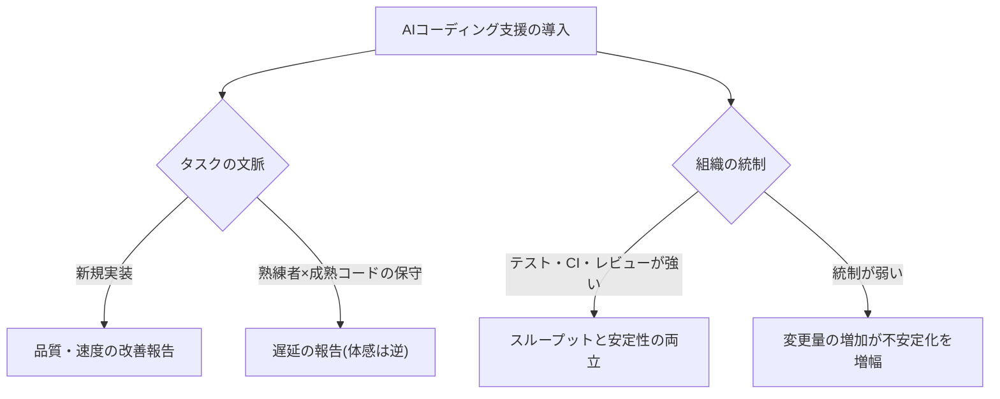
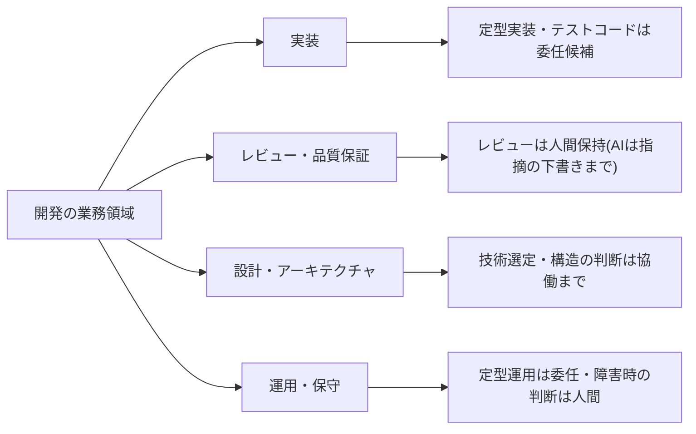

## 利用は飽和し、「速くなったか」が争点になっている

開発・エンジニアリングでは、AI利用はすでに飽和している。世界の技術職を対象としたDORA(Google Cloud)の大規模調査は、技術職でのAI利用がほぼ普遍化したと報告する[src-2026-078]。だからこの部門の問いは「使うか」ではない。「使って速くなったのか」であり、ここに楽観と懐疑の両論が真っ向から併存している。

懐疑側の代表が、AI評価研究機関METRによるランダム化比較試験(RCT)である。自身が長年関与する成熟リポジトリの実イシューに取り組む経験豊富な開発者では、AIツールの使用を許可されたタスクのほうが完了時間がむしろ長くなった。しかも開発者自身は事後も「速くなった」と認識しており、体感と実測が持続的に乖離した[src-2026-076]。楽観側の代表が、GitHub自身による自社のAIコーディング支援製品を対象としたRCTで、新規のAPI実装タスクでは盲検レビューで品質改善が観測された——ただし販売者自身の研究であり(利益相反に留意)、改善幅は小さく、方法論への批判もある[src-2026-077]。

両者は矛盾ではなく条件の違いである。METRは「熟練者×成熟コードベースの保守」、GitHubは「新規実装の単発タスク」を測っており、タスクの文脈で結果が反転する。そして両者を橋渡しするのがDORAの中心テーゼ「AIは増幅器」である——AI導入はスループットとは正の関係にある一方デリバリー安定性とは負の関係にあり、リターンはツールではなく、自動テスト・バージョン管理・高速フィードバックといった組織システム側の整備で決まる。強いチームはさらに速くなり、課題を抱えるチームは問題が増幅される[src-2026-078]。

効果は「ツールを入れたか」ではなく「文脈×統制」で決まる構図を示す。

この部門が他部門と大きく違う点は、**検証の制度を既に持っている**ことである。他部門が「AI出力の検証工程」をゼロから設計するのに対し、開発にはコードレビュー・自動テスト・CIという検証文化が制度として存在する。組織・人材編の3役割でいう「検証者」を、開発は名前を変えて昔からやってきた。つまり開発部門は全社の検証者の先行モデルであり——逆に言えば、AI生成コードをレビューから免除した瞬間に、この優位は消える。

> 📊 **データボックス(2026-06時点)**
> - 世界の技術職約5,000名への調査で90%が業務でAIを利用。80%超が生産性向上を認識する一方、30%はAI生成コードを「ほとんど/全く信頼していない」。AI導入はスループットと正、デリバリー安定性と負の関係(DORA / Google Cloud、2025年9月公表)[src-2026-078]
> - METRのRCT(2025年2〜6月、経験豊富なOSS開発者16名・実イシュー246件)では、AI使用許可タスクの完了時間が19%長くなった。開発者は事前に24%の高速化を予測し、事後も20%速くなったと認識していた。METR自身が「成熟リポジトリの熟練開発者という条件に限定され一般化できない」と明記[src-2026-076]
> - GitHubのRCT(Python経験5年以上の202名、盲検レビュー1,293件)では、自社製品使用群でユニットテスト全件合格の可能性が53.2%高く、可読性3.62%・保守性2.47%等の小幅改善(p<0.05)。新規実装タスク限定で、販売者自身による研究[src-2026-077]

## 業務の分解マップ

業務分解の方法と4分類(判断/検証/実行/関係構築)の定義は組織・人材編「業務分解×再配置プレイブック」で説明しており、ここでは再定義しない。開発の業務領域(実装・レビュー/品質保証・設計・運用/保守)に当てはめたときの見取り図を示す。対応づけは出典のある分類ではなく、本ページでの整理である。

開発の業務領域ごとの委任候補と人間保持の大づかみの見取り図である(詳細はワークシートで分解する)。

開発業務の特徴は2つある。第一に、**機械検証と人間検証の二層がもともとある**。テスト・静的解析・CIが機械で検証できる層を担い、設計判断の妥当性・保守性・文脈整合は人間レビューが担ってきた。AI委任で増えるのは前者では受け止めきれない出力量であり、律速になるのは人間レビューの容量である。第二に、**コードは書いた瞬間から負債性を帯びる**。機械学習システムの隠れた技術的負債を定義したGoogle研究者らの古典的論文が示すとおり、負債はコード単体ではなくシステムとデータの層に潜み、グルーコード・隠れた依存として蓄積する[src-2026-040]。たとえば、システムの隙間を埋めるためだけの変換処理や、どこから参照されているか誰も把握していないデータ連携が、レビューの目に触れないまま増えていく。生成の速度が上がるほど、蓄積の速度も上がる。

### 機能開発1件の分解ワークシート記入例(そのまま使える)

様式(5列)は組織・人材編「業務分解×再配置プレイブック」の業務分解ワークシートをそのまま使う。機能開発1件の流れを分解した記入例を示す。記入内容は出典に基づくものではなく、本ページで作成した例である。

| タスク | 4分類 | 再配置 | 検証者 | 移行時期 |
|---|---|---|---|---|
| 要件の整理・仕様書の一次ドラフト | 実行 | AI委任 | テックリード(業務要件と突合) | 今すぐ |
| 実装方針・技術選定 | 判断 | 協働(AIは選択肢と影響の整理まで) | テックリード | 1年以内 |
| 定型実装・ボイラープレート・テストコード | 実行 | AI委任 | レビュアー(マージ前に全行レビュー) | 今すぐ |
| コードレビュー | 検証 | 人間保持(AIは指摘候補の下書きまで) | レビュアー(記名) | 移行しない(検証は必ず人間に残す) |
| リリース判定 | 判断 | 人間保持 | 開発責任者 | 移行しない(障害時の責任) |
| 障害の原因調査 | 検証 | 協働(AIが仮説、人間が裏取り) | 担当+テックリード | 今すぐ |
| ドキュメント・リリースノート作成 | 実行 | AI委任 | 担当者(事実関係を確認) | 今すぐ |
| 事業部門との仕様調整 | 関係構築 | 人間保持 | — | 移行しない |

運用ルールは元のワークシートと同じである——「AI委任」で検証者欄が空白の行は委任禁止、「移行しない」には保持理由必須。

## AI影響の時間軸マップ(今/1年/3年)

以下の見通しに出典はない。確定予測ではなく、準備の優先順位を決めるための作業仮説として使う。

| 領域 | 今 | 1年 | 3年 |
|---|---|---|---|
| **実装** | 補完・定型実装・テストコードの委任は既に成立(利用は飽和)[src-2026-078] | 課題単位の委任(エージェント型)が定型領域で拡大。人間レビューの容量が律速になる | 定型実装の大半が委任候補に。人間の重心は仕様の確定とレビューへ |
| **レビュー・品質保証** | AIによる指摘下書きの併用開始。最終判定は人間 | レビューが部門の中心業務化。レビュー容量と基準の設計が部門課題に | 機械検証(テスト・静的解析)+人間レビューの階層化。検証の設計自体が職務に |
| **設計・アーキテクチャ** | 選択肢・トレードオフ整理の補助 | 設計判断は協働どまり。決定と責任は人間 | 判断の委任はしない構図は変わらないとみる。検証可能な統制が前提条件 |
| **運用・保守** | AI生成コード・自動化の台帳化 | 部門外で生まれた自動化・市民開発の保守流入に備える体制整備 | レガシー解読・負債返済へのAI活用が本格化。負債管理は全社業務に |
| **育成** | ジュニア業務の訓練価値仕分け | 「AIのコードを直す」型の検証者育成へ転換 | 習熟段階・等級要件の再定義(組織・人材編「新人が育たない問題」を参照) |

## いまやるべき準備

DORAの「AIは増幅器」テーゼに従えば、ツールの追加より先に増幅の土台を整えるのが投資順序である[src-2026-078]。

- 【開発部門長】(今すぐ)**AI生成コードのレビュー基準を明文化する**。AI由来であることはレビュー免除の理由にならない、という一文から始める。道具: 下記のマージ前チェック5項目。完了条件: 全チームのレビュー規約に「AI生成コードの扱い」の節があり、レビュアー記名が徹底されていること
- 【開発部門長】【テックリード】(今すぐ)**体感ではなくデリバリー指標で計測する**。METRが示した体感と実測の乖離[src-2026-076]がある以上、開発者の主観的な速度感を導入効果のKPIにしてはならない。道具: 既存のデリバリー指標(リードタイム・変更失敗率・障害復旧時間)+レビュー差し戻し率のベースライン計測。完了条件: AI委任の拡大前後を比較できる計測値が四半期単位で取れていること
- 【CTO/開発部門長】(今すぐ〜1年以内)**増幅の土台(自動テスト・CI・高速フィードバック)を先に固める**。統制がない組織では変更量の増加が不安定化を招く[src-2026-078]。完了条件: 主要リポジトリでテスト・CIが通らないコードはマージできない状態になっていること
- 【開発部門長】【CHRO・人材開発】(1年以内)**ジュニア業務の訓練価値を仕分ける**。開発はジュニア育成問題が最も早く顕在化した職種の一つである(下記「罠」参照)。道具: 組織・人材編「新人が育たない問題」の2×2マトリクスと判定3問。完了条件: 「設計し直す」象限の業務リストが部門長承認済みであること

## 人材再配置の方向

役割の重心移動の宛先(検証者・設計者・例外処理者)の定義は組織・人材編「実行者から検証者・設計者へ」で説明しており、ここでは再定義しない。開発の語彙に訳すと、検証者=AI出力の全行レビューと品質の最終責任を負うレビュアー、設計者=どの工程を委任しどこに人を残すかを決めるテックリード・エンジニアリングマネージャー、例外処理者=複雑障害・レガシー解読・非定型案件の担い手である。実利用データでも、企業利用ではタスクの複雑性によらずAIの自律性が一様に低く、人間の検証を残した「統制された委任」が優先されている——AI開発企業Anthropicによる自社プラットフォームデータの分析であり利用者層が技術職に偏る点に留意は要るが、その偏りゆえに開発職の実態に最も近いデータでもある[src-2026-023]。

開発固有の点は2つある。第一に、**重心移動の摩擦が最も小さい部門の一つ**である。コードレビューは記名の検証・差し戻しの記録・品質基準の言語化を既に備えており、検証者への移行は新設ではなく再定義で済む。レビューログは検証ログ(様式は組織・人材編「実行者から検証者・設計者へ」で定義)の原型そのものであり、他部門が検証文化を設計する際の社内手本になる(移植のやり方は下記の手順)。第二に、**主管部門としての当事者性**。主管部門が自部門の変革と全社機能の両方を背負う「多重当事者性」の構造は部門別ガイド「人事のAIDX」で説明しており、開発はその一断面として「自部門の業務変革 × 全社のAI実装と技術的負債管理の主管」という二重の当事者性を負う。ノーコード/ローコード開発の普及が示すとおり[src-2026-051]、ソフトウェアはもはや開発部門の外でも作られており、検証なき自動化が壊れたとき保守の相談が最後に届くのはこの部門である。

> 📊 **データボックス(2026-06時点)**
> - 国内大手企業のノーコード/ローコード開発の導入率: 51.0%(前年比4.9ポイント増)(NRI IT活用実態調査2025、国内売上上位約3,000社のCIO等対象・517社回答、2025年9月実施)[src-2026-051]

### レビュー文化の他部門移植手順(そのまま使える1枚)

「検証者の先行モデルを他部門に広げる」を主張で終わらせないための手順を示す。この手順自体に出典はない。移植先1部門を決め、90日で1巡する。検証ログの様式と3役割の定義は組織・人材編「実行者から検証者・設計者へ」、検証者育成プログラムは組織・人材編「新人が育たない問題」で定義しており、本手順はその立ち上げを開発部門が伴走支援するための段取りである。

1. **普遍要素の抽出**【開発部門長】: 自部門のレビュー規約から部門非依存の4要素(記名検証・差し戻しの記録・基準の言語化・免除禁止)を抜き出す。テスト・静的解析など技術固有の項目は移植対象から外す
2. **移植先の検証対象を1種類に絞る**【移植先部門長】: AI委任が始まっている文書・成果物1種(例: 照合報告、提案書)に限定する。対象選定は業務分解ワークシート(組織・人材編「業務分解×再配置プレイブック」の様式)で行う
3. **差し戻し語彙の翻訳**【両部門の兼務者】: 検証ログは組織・人材編「実行者から検証者・設計者へ」の最小様式を共用し、差し戻し理由の語彙だけを移植先の業務の言葉で10個以内に定義する(部門別の新様式を作らない)
4. **伴走レビュー**【開発のレビュアー経験者1名】: 90日間・週1時間、移植先の検証の場に同席し、指摘の深度・差し戻しの書き方を実例で教える
5. **計測と引き渡し**【推進担当】: 差し戻し率・検証所要時間を計測して移植先部門長に運用を引き渡す。完了条件: 開発の伴走なしで検証ログが回り続けていること

## この部門特有の罠

**罠1: 体感の速度を導入効果のKPIにする。** METRのRCTでは、開発者は実測で遅くなっていたにもかかわらず、事後も「速くなった」と認識し続けた[src-2026-076]。満足度サーベイと利用率だけで「効果あり」と総括するのは、この知覚ギャップをそのまま経営報告に載せる行為である。脱出はデリバリー指標と差し戻し率のベースライン比較(関連: アンチパターン集「コパイロット一斉配布」)。

**罠2: レビューなきAIコードのマージ。** 出力量が増えるとレビューが律速になり、「AIが書いたから大丈夫」「全部は見きれない」という免除の圧力が生じる。だがAI生成コードを信頼しない開発者が3割残る現状[src-2026-078]が示すとおり、信頼はまだ検証の代替になっていない。統制なき変更量の増加はデリバリー安定性の悪化と表裏である[src-2026-078]。検証は必ず人間に残す——他部門に教える側の部門が、自部門で最初に破ってはならない。

**罠3: グルーコードと使い捨てコードの増殖。** 隠れた技術的負債の古典的論文が特定したグルーコード・隠れた依存・宣言されないデータ消費者という負債類型[src-2026-040]は、生成の高速化でむしろ加速する。週単位の開発が時間単位に圧縮され使い捨てソフトウェアが成立するという論評(AI投資家であるベンチャーキャピタルa16zパートナーによるエッセイであり、ポジションに留意)[src-2026-009]が正しいとしても、使い捨て構築が負債と区別されるのは3条件(投資上限・残る資産の分離・捨てる条件の事前決定。定義は原理編「負債とスロップの分類学」)を満たす場合のみである。捨てる条件のない使い捨てコードが基幹業務に流入した状態が、アンチパターン集「隠れ負債の雪だるま」の症状そのものであり、脱出は同カードの台帳化と複利テストによる仕分けである。

**罠4: ジュニアの訓練機会を効率の名で消す。** 米国の研究では、AI曝露度が最も高い職種の例としてソフトウェア開発者が挙げられ、その22〜25歳層に限って相対的雇用減少が検出された(学術的には未決着)[src-2026-016]。METRの遅延が「熟練者だから」こそ起きた一方で、定型実装というジュニアの訓練装置はAIの最も得意とする領域と重なる。機序と対策(「AIのコードを新人が直す」型への転換)は組織・人材編「新人が育たない問題」で詳しく扱っている。開発はこの問題が最も早く顕在化した部門の一つであり、ここでの育成設計が全社の手本になる。

> 📊 **データボックス(2026-06時点)**
> - AI曝露度が最も高い職種(ソフトウェア開発者、カスタマーサービス担当等)の22〜25歳: 約16%の相対的雇用減(Stanford Digital Economy Lab、米国ペイロールデータ、2025年11月改訂版)[src-2026-016]

## AI生成コードのマージ前チェック5項目(そのまま使える)

そのままレビュー規約の追補に使える5項目を示す。この様式自体に出典はない。検証ログの様式は組織・人材編「実行者から検証者・設計者へ」の最小様式を使い、部門で別様式を作らない(レビューツールの差し戻し記録で代替してよい)。

1. **免除禁止**: AI生成・AI支援であることはレビュー省略の理由にならない。レビュアーは人間が記名で承認する。レビュアー欄のないマージは禁止
2. **理解の確認**: 提出者は変更内容を自分の言葉で説明できること。説明できないコードは「動いても」差し戻す(保守者のいないコードを増やさない)
3. **テスト同梱**: 変更にはテストが伴うこと。AIが書いたテストはテスト自体もレビュー対象(仕様を写しただけの自己言及テストを通さない)
4. **依存の申告**: 新たな外部依存・データ参照・他システム連携は申告し、台帳(原理編「負債とスロップの分類学」のAI施策台帳)に記載する。グルーコードの無申告増殖を防ぐ
5. **使い捨ての明示**: 実験・一時利用のコードは「捨てる条件と期限」をコード上と台帳に明記する。期限のない使い捨ては使い捨てではない

## 体制と費用の目安

以下の目安に出典はなく、実務上の経験則である。**中堅(数百名規模、開発組織10〜50名)**: 1チーム(5〜8名)でレビュー基準の明文化とベースライン計測から開始。期間90日。ツールは既契約の範囲で足りることが多いが、計測基盤(デリバリー指標のダッシュボード・レビューログの集計)の整備に兼務0.2〜0.5人分×3か月、外部支援を使う場合は100万〜300万円程度を見込む。決裁は開発部門長(数十万〜数百万円レンジ)。**大企業(数千〜数万名規模、開発組織数百名以上)**: 先行2〜3チームの並走+プラットフォーム/CoE側で計測基盤・レビュー基準・台帳様式を一元管理する。専任1〜2名(人件費換算で年1,500万〜3,000万円)+計測基盤の構築・運用に年数百万〜1,000万円台。期間90〜180日、決裁はCTO/CIO(年数千万円レンジ)。

**効果側の目安**(この試算に出典はなく、仮置きの前提による概算である): 定型実装・テストコード・ドキュメント作成の委任で開発者1人あたり週2〜4時間が浮くと置けば、開発組織50名で年約5,000〜10,000時間——人件費換算で年2,000万〜5,000万円相当。加えて、レビューなきマージ由来の本番障害を1件防ぐだけで、対応工数・機会損失で数百万円規模の損害回避になりうる。どちらのレンジでも、経営が承認する判断は「効果測定をデリバリー指標で行う計測体制に先行投資するか」の1点に絞る——計測なしのライセンス拡大は、罠1をそのまま固定化する。

## 最初の90日

- 【開発部門長】【テックリード】(今すぐ)対象1チームで機能開発フローを分解する。道具: 組織・人材編「業務分解×再配置プレイブック」のワークシート+本ページの記入例。完了条件: 全タスクに4分類・再配置・検証者が記入され、チームのレビューを通っていること
- 【開発部門長】(今すぐ)マージ前チェック5項目をレビュー規約に追補し、全チームに発行する。道具: 上記のマージ前チェック5項目。完了条件: レビュアー記名のないマージが技術的に不可能になっており(ブランチ保護等)、例外運用が承認制であること
- 【テックリード】【推進担当】(今すぐ)デリバリー指標+差し戻し率のベースラインを計測開始する。道具: 既存のリポジトリ・CI・レビューツールのログ。完了条件: AI委任拡大の前後比較が四半期単位で報告でき、体感サーベイ単独の効果報告が禁止されていること
- 【推進担当】(今すぐ〜90日)AI絡みの自動化・生成コード・部門外の市民開発ツールを台帳に棚卸しする。道具: AI施策台帳(原理編「負債とスロップの分類学」で定義)+アンチパターン集「隠れ負債の雪だるま」の脱出ステップ。完了条件: 全件に所有者・依存・検証方法・捨てる条件が記入されていること
- 【開発部門長】【CHRO・人材開発】(1年以内)ジュニア育成を「AIのコードを直す」型に再設計し、1チーム・新人3〜5名でパイロットする。道具: 組織・人材編「新人が育たない問題」の検証者育成プログラム表。完了条件: 指摘の深度・差し戻し的中率の先行指標が測定されていること
- 【CTO】(能力向上を待て)人間レビューを介さない自律エージェントの本番マージ。統制された委任が企業利用の実態であり[src-2026-023]、検証の階層化(機械検証で何を保証し人間が何を見るか)の設計と実測データが揃う前の全面委任は、罠2と罠3を同時に踏む

**この主張が崩れる条件**: 人間レビューを介さないAIコードの本番投入が、変更失敗率・障害率・保守コストを悪化させずにスループット向上を持続させた事例が、ベンダー発以外の複数の独立した調査で確認されたとき——そのとき「検証は必ず人間に残す」は開発部門では過剰統制であり、機械検証のみの委任領域を広げてよい。

<!--
執筆メモ(ソースが薄い箇所・レビュー重点ポイント):
- 「開発は検証者の先行モデル」「レビュー文化ゆえに重心移動の摩擦が最小」「機械検証と人間検証の二層」は出典のない編集部の見立て(本文にマーカー明示済み)。METR/GitHub/DORAの両論構図(タスク文脈で反転×統制で増幅)はソースのkey_facts・jp_noteに沿った整理。
- ページの結論はMETR[076・high]+DORA[078・high]の独立2源で支え、GitHub[077・medium・ベンダー自身の研究]は利益相反を本文開示のうえ楽観側の代表として併記(単源テーゼ回避)。製品名(Copilot等)・ツール名(Cursor等)は2層ルールに従い本文に書かず「自社のAIコーディング支援製品」等で記述。
- 二重の当事者性(自部門変革×全社のAI実装・技術的負債管理の主管)は多重当事者性フレーム(正本: 部門別ガイド「人事のAIDX」)の部門別断面として1行定義のみ。変種定義はしていない。
- 時間軸マップ・ワークシート記入例・マージ前チェック5項目・レビュー文化の他部門移植手順・規模感2レンジ(投資側の金額レンジ・効果側の換算含む)・90日は出典のない編集部の見立て(マーカー明示済み)。
- 2026-06-11 第4陣レビュー反映: ①マージ前チェック5項目と移植手順をフレーム台帳(実行素材の正本)に登録 ②[078]の30%を「一定数」から「3割」へ(境界値の弱い側) ③summary・見出し・本文の部門間最上級を相対表現+見立てマーカーへ(「全部門で最も普及」→技術職母集団に忠実な記述、「重心移動の摩擦が最も小さい」→「最も小さい部門の一つ」=financeとの王座調停で当ページ側が降りた) ④規模感に計測基盤・専任人件費の金額レンジと効果側レンジを追加 ⑤検証者モデル輸出に移植手順1枚を付与 ⑥review_byを2026-09-11へ短縮(METR 2026年2月の実験再設計の追跡と整合)。
- src-2026-009(a16z)はVCの論評(medium)。COI(AI投資家のポジション)を本文で開示し、使い捨て3条件の正本(debt-slop-taxonomy)参照で受けた。結論は背負わせていない。
- 罠4のStanford[016]は「ソフトウェア開発者が高曝露職の例」というkey_factsの範囲で引用。junior-pipelineが正本で、二層構造(Yale側の反論)はそちらに委ねた。本ページで悲観断定はしていない。
- METRの19%・GitHubの各数値・DORAの90%/30%・Stanford 16%・NRI 51%はすべてデータボックスに隔離。METRは2026年2月に実験再設計を公表しており(key_facts)、review_by時に後続研究を確認すること。
- 4分類・3役割・検証ログ・AI施策台帳・使い捨て3条件・育成プログラム・多重当事者性はすべて正本参照のみ(フレーム台帳照合済み)。図2点は両論構図と部門業務の見取り図で、正本フレームの図の複製ではない。時間軸マップは表形式(標準構成準拠)。
2026-06-12 文体改修: 格言調見出し平易化・内部用語排除・見立て定型句を自然文に置換
-->
