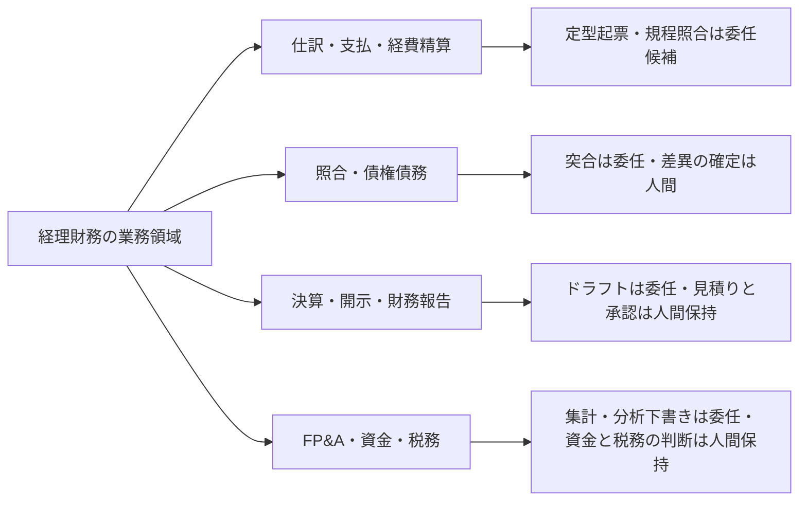
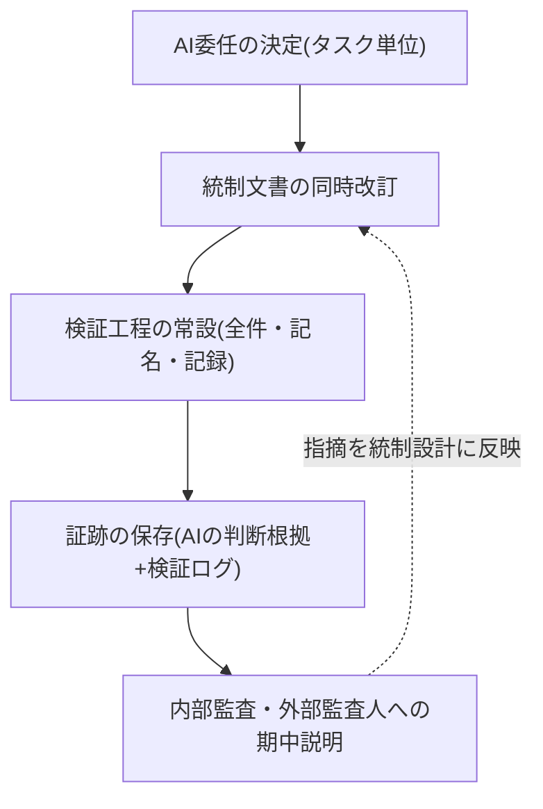

> 💡 **ひとことで言うと**
> 経理はAIに任せられる定型作業の宝庫だが、扱うのはお金の数字なので、間違いがそのまま会社の信用に響く。レジに自動釣銭機を入れるときは金庫の管理ルールごと見直すのと同じで、作業の委任とチェックの決まりを必ずセットで変える話である。

## 定型処理は委任候補が多いが、統制の再設計なしには動かせない

経理財務の定型処理——仕訳の起票、債権債務・残高の照合、経費精算のチェック——は、手順が決まれば結果が安定する「実行」タスクの密度が、全部門でも最も高い部類にある。AI委任の候補はここに集中している。しかし同時に、この部門の成果物は財務数値そのものであり、誤りがお金・法令・開示に直接届く。財務数値は全社の検証義務化ラインで「高」区分(全件・記名の人間検証必須)の典型例として明示されている(定義は組織・人材編「推進体制とガバナンスの設計図」)。さらに上場企業では、業務プロセスの変更は内部統制報告制度(J-SOX)の統制文書・評価とつながる、というのが実務の一般的な理解である。だからAI委任は単なる業務改善ではなく、**統制の変更**として扱うべきである(これはJ-SOX実務の一般的な慣行に基づく整理であり、金融庁実施基準等の一次資料は引用していない。適用の判断は自社の評価体制と監査人との協議による)。委任と統制再設計をセットで進めること——これが経理財務のAIDXの固有条件であり、全部門でも最も重い部類の制約といえる。

外部データはこの部門の「出遅れ・急追」構造を示す。KPMGの23カ国調査では、日本企業の経理財務でのAI利用は米中に劣後する一方、財務報告領域での利用は3年以内に大半へ達する見込みと報告されている[src-2026-079]。他方、日本CFO協会がベンダー(Coupa)と共同で実施した国内調査では、財務・調達業務にAIを戦略的に統合している日本企業はごく一部にとどまり、最多回答は導入前の検討段階だった(ベンダー共同調査のため利益相反に留意)[src-2026-080]。利用は広がる見込みだが、業務への統合はこれからである。両調査の差は「利用」と「戦略的統合」の定義差と読める。その間を埋める作業が、本ページの主題である業務分解と統制再設計にあたる。

> 📊 **データボックス(2026-06時点)**
> - 日本企業の経理財務業務でのAI利用率は47%で、中国66%・米国62%より低い。日本で財務報告領域にAIを利用する企業は31%(2024年4月)から6か月で39%に増加し、今後3年間で87%に達する見込み(世界平均83%超)——87%は回答企業の利用見込みに基づく予測値であり実績値ではない(KPMGインターナショナル、23カ国2,900社の経理財務部門、2024年実施・2025年1月日本語版発表)[src-2026-079]
> - 財務・調達業務全体にAIを戦略的に統合している日本企業は2%(グローバル48%)。最多回答は「AI未導入だが、Excelなど従来ツールからの脱却を検討中・調査段階」の39%(日本CFO協会×Coupa「日本CFO戦略調査:2025年」、経理・財務幹部358名、2025年6〜7月実施。ベンダー共同調査のため利益相反に留意)[src-2026-080]

## 業務の分解マップ

業務分解の方法と4分類(判断/検証/実行/関係構築)の定義は組織・人材編「業務分解×再配置プレイブック」で説明しており、ここでは再定義しない。経理財務の主要領域に当てはめたときの大づかみの見取り図を示す。対応づけは出典のある分類ではなく、本ページでの整理である。

経理財務の業務領域ごとの委任候補と人間保持の見取り図である(詳細はワークシートで分解する)。

経理業務の特徴は2つある。第一に、**検証工程が最初から業務に組み込まれている**。承認・照合・突合は経理の日常であり、「AIの出力を検証する」という再設計の中核動作を、この部門は職業訓練として既に持っている。再配置の素地は、検証文化(コードレビュー)を既に持つ開発と並んで、全部門でも最も良い部類にある。第二に、**「実行」の終端が必ず統制点(承認・照合)に接続している**。だから「実行」だけを切り出して委任すると、既設の統制点との接続が切れる。委任の単位はタスクだが、設計の単位は統制を含むプロセス全体である。

経費精算の再設計の手本は、原理編「AIDXの定義」のミニケース(経費精算の再設計——規程の条文単位化・全件チェック係から抜き取り検証と例外裁定への再配置・誤判定の記録から規程改訂へのループ)に詳しい。本ページでは再掲しない。そのまま自社の叩き台に使える。

### 月次決算業務の分解ワークシート記入例(そのまま使える)

様式(5列)は組織・人材編「業務分解×再配置プレイブック」の業務分解ワークシートをそのまま使う。月次決算の流れを分解した記入例を示す。記入内容は出典に基づくものではなく、本ページで作成した例である。

この表の見方: 行は月次決算のタスク、列は仕分けの結果で、まず「再配置」列(AIに任せるか人が持つか)を見る。

| タスク | 4分類 | 再配置 | 検証者 | 移行時期 |
|---|---|---|---|---|
| 定型取引の仕訳候補の起票 | 実行 | AI委任 | 経理担当(勘定科目・金額を検証し記名承認。検証記録を残す) | 今すぐ |
| 銀行残高・補助元帳と帳簿の突合 | 実行 | AI委任 | 経理担当(差異リストの全件確認) | 今すぐ |
| 照合差異の原因調査と仮説の裏取り | 検証 | 協働 | 経理担当(AIの仮説を原始証憑で裏取り) | 今すぐ |
| 経費精算の規程照合チェック | 実行 | AI委任 | 経理担当(抜き取り検証+例外・グレー案件の裁定) | 今すぐ |
| 引当金・減損等の会計上の見積り | 判断 | 協働 | 経理責任者(AIは根拠資料の整理まで。採否と責任は人間) | 能力向上を待て(監査上の重要論点) |
| 月次報告コメントの一次ドラフト | 実行 | AI委任 | 経理担当(数値と記述の整合を全件確認) | 今すぐ |
| 勘定残高・決算数値の最終承認 | 検証 | 人間保持 | 経理責任者(記名。統制上の承認点) | 移行しない(検証義務化ライン「高」) |
| 監査人対応・証憑提出の調整 | 関係構築 | 人間保持 | — | 移行しない |

運用ルールは元のワークシートと同じである——「AI委任」で検証者欄が空白の行は委任禁止、「移行しない」には保持理由必須。経理固有の追加ルールを1つ置く: **委任した行は、対応する統制文書の改訂とセットでなければ本番化しない**(下記の同時改訂チェック5問)。

## AI影響の時間軸マップ(今/1年/3年)

以下の見通しに出典はない。確定予測ではなく、準備の優先順位を決めるための作業仮説として使う。

この表の見方: 行は経理財務の業務領域、列は時期で、左から右へ委任の範囲が広がる。自分の担当領域の行から読むとよい。

| 領域 | 今 | 1年 | 3年 |
|---|---|---|---|
| **仕訳・支払・経費精算** | 定型起票の候補生成・経費の規程照合チェックの委任。全件の人間検証を維持 | 検証ログの蓄積を根拠に抜き取り検証へ移行する範囲を拡大。統制文書の改訂の速さが委任拡大の上限に | 定型取引の処理は例外中心の少人数運用。経理担当の主業務は例外裁定と検証に |
| **照合・債権債務** | 突合作業の委任(差異リストは人間が全件確認) | 差異原因の仮説生成まで協働が標準化 | 照合は常時実行(月次の一括処理から日次へ)になり、人間は差異の確定と取引先調整に専念 |
| **決算・開示・財務報告** | 開示文書・報告コメントの一次ドラフト委任。数値の全件突合は人間 | 財務報告領域への組み込みが広がる(調査では3年で大半に達する見込み)[src-2026-079]。会計上の見積り・開示判断は人間保持のまま検証記録が必須に | 決算プロセス全体の再設計(タスクの並び替え・統制点の再配置)。見積り・開示判断の委任は能力向上と監査実務の確立を待つ |
| **FP&A(予算管理・経営分析)・資金・税務** | 予実集計・分析下書きの委任 | 差異分析・資金繰り予測の協働が定例フローに入る | 資金・税務の判断は人間保持の構図のまま、判断材料の整備が自動化 |
| **内部統制・監査対応** | 統制文書の現状把握とAI利用箇所の棚卸し | 監査側・内部監査側の生成AI利用が広がり(証憑評価・調書作成)[src-2026-081]、AI委任箇所の証跡設計が監査対話の論点に | 「AIが処理し、人間が検証し、その記録が監査証跡になる」三層構造が統制の標準形に(出典のない見通し) |

3年欄の見通しのうち2つには下振れ条件を付す。「照合の日次化」は、銀行・取引先側のデータ連携が日次化しない場合や差異確定の人手が律速のままの場合、月次照合の高速化止まりに下振れする。「三層構造が統制の標準形」は、AI証跡を監査上どう受け入れるかの監査実務が確立しない場合、先行企業の任意慣行に留まる。

この見通しの外部根拠は3つある。第一に、財務報告でのAI利用は3年で大半に達する見込みと調査が示す(回答企業の利用見込みに基づく予測値)[src-2026-079]。第二に、企業のAPI(システム同士の接続口)経由の利用では、事務・管理サポート系タスクへの委任が拡大している。バックオフィス(管理部門)の定型実行から委任が進む基調がある(AI開発企業Anthropicの自社プラットフォームデータ分析であり、利用者層の偏りに留意)[src-2026-023]。第三に、監査・内部統制評価の側も生成AIの導入が始まっている。大手監査法人グループは、J-SOX評価の定型業務(証憑の自動評価・調書作成)へのRAG(社内資料を参照させて回答させる技術)活用支援を公式に開始した。AI出力に判断根拠(参照ファイル名・ページ数)を出力させる設計が実装要件になっている(監査法人グループ自身のサービス発表であり販促文脈に留意)[src-2026-081]。検証する側がAIで武装する以上、検証される側の証跡も機械可読(コンピュータがそのまま読める形)であることが前提になっていく、と本ページではみている。

> 📊 **データボックス(2026-06時点)**
> - 企業向け(API)利用では事務・管理サポート関連タスクの比率が2025年8月の3pp増を経て同年11月に13%へ上昇(Anthropic Economic Index、自社プラットフォームデータ、技術職偏重の留保あり)[src-2026-023]
> - デロイト トーマツ リスクアドバイザリーは2024年10月、内部監査・J-SOX評価向け生成AI導入支援サービスを開始。RAG活用アプリで証憑ファイルの自動評価(判断根拠のファイル名・ページ数を出力)・調書の自動作成を効率化対象とする(ベンダー自身のサービス発表)[src-2026-081]
> - J-SOXは2024年4月1日以後開始の事業年度から約15年ぶりの改訂基準が適用され、不正リスク・サイバーリスク・IT委託業務への対応が強化された(金融庁改訂基準、2023年公表)[src-2026-081]

## いまやるべき準備 — 検証義務の明文化・データの判定可能化・統制との同期

3つに絞る。いずれも「最初の90日」に展開する。

**検証義務「高」の部門内明文化と入力可否(今すぐ)。** 全社規程の完成を待たず、決算・開示に関わる全員に1枚で配る。中身は全社の暫定ガードレール(用語集「ガードレール」=やってよい範囲を定める社内ルール。入力可否+検証義務+相談先。定義は組織・人材編「推進体制とガバナンスの設計図」)の経理財務への当てはめであり、部門で別物を作らない。経理固有の論点は入力可否である——未公表の決算数値・業績見通しはインサイダー情報(未公表の重要事実)に該当しうるため、入力可否ルールとインサイダー情報管理規程との整合を法務に確認する(これは法令の一般論としての記述であり、金商法・取引所規則の一次資料は引用していない。該当性の判断は必ず自社の法務確認による)。規程が整う前に、担当者が手元の生成AIで報告文の下書きや照合結果の整形を済ませる——そんな使い方が先に広がりやすい。中堅企業の経理・総務では活用が先行し、規程整備が追いついていない「活用先行・統治遅れ」が調査で示されている[src-2026-084]。明文化の先送りは、統制外利用(用語集「シャドーAI」)の放置と同義である。

**規程・マスタの判定可能化(今すぐ〜1年以内)。** AIに経費や仕訳を判定させる前提は、判定基準が機械可読であることだ。経費規程を判定可能な条文単位に書き直す(進め方は原理編「AIDXの定義」のミニケースに詳しい)、勘定科目・取引先マスタ(基準となる一覧データ)の重複と表記ゆれを解消する、過去の差し戻し事例を判定基準に反映する——この3点が委任の土台になる。規程が曖昧なまま自動チェックを入れると、グレー案件が全部人間に戻ってきて効果が出ない(関連: アンチパターン集「データなき自動化」)。

**統制文書とAI委任の同時改訂ルール+監査人との早期対話(今すぐ〜1年以内)。** AIが起票・照合する工程は統制の変更である。統制文書(業務記述書・フローチャート・リスクコントロールマトリクス、いわゆる3点セット。一般慣行としての記載であり金融庁実施基準等の一次資料は引用していない。文書の名称・様式・評価範囲は自社の評価体制と監査人の方針に従う)への反映と評価方法の確認をセットにする。あわせて、AI利用箇所・検証体制・証跡の残し方を内部監査と外部監査人に**期中の早い段階で**説明し、期末に「この統制は評価できない」と言われる事態を防ぐ。監査側も生成AIでの評価効率化を始めており[src-2026-081]、対話の共通言語は「AIの判断根拠と人間の検証記録が、いつでも提示可能な形で残っているか」である。説明に使う資料の雛形は下記の「監査人への期中説明セット」に示す。

AI委任を統制の再設計とセットで回すループを示す(委任の決定から監査対話までを一巡で設計する)。

> 📊 **データボックス(2026-06時点)**
> - 従業員50〜500名の企業の経理・総務担当者のうち生成AIを業務で活用しているのは45.2%、活用者の約79%が業務負担の軽減を実感。一方57.5%の企業で生成AI利用の社内規程が未整備(PCA調査、104名、2025年2月実施。会計ソフトベンダーによる調査のため利益相反に留意)[src-2026-084]

## 人材再配置の方向 — 検証者への重心移動と、CFOの二重の当事者性

役割の重心移動の宛先(用語集「検証者」・設計者・例外処理者)の定義・任命要件・評価観点は組織・人材編「実行者から検証者・設計者へ」で説明しており、ここでは再定義しない。同ページの職務定義書改訂例はまさに**経理スタッフ版**(仕訳入力・支払処理の実行者 → AI起票の検証と例外取引の裁定へ)であり、そのまま自部門の叩き台に使える。

経理財務への翻訳は次のとおりである。**検証者**: AI起票の仕訳・照合結果・開示ドラフト(下書き)を採点し差し戻す役割。差し戻しの的中率と見逃しの重大度を検証ログ(様式は同ページの最小様式)で測る。**設計者**: 決算プロセスのどの工程を委任しどこに統制点を置くかを決める役割。経理では統制文書の改訂責任とセットになるため、内部統制の知識を持つ中堅が適任である。**例外処理者**: 非定型取引・会計上の見積り・監査人対応・税務当局対応を担う役割。経理の中核人材の重心は長期的にここへ寄る。

留意点が1つある。仕訳の起票と照合は、新人経理が勘定科目の感覚と取引の実在性への嗅覚を身につける伝統的な訓練の場だった。委任判定の前に訓練価値の点検を挟むこと(点検の手順は組織・人材編「新人が育たない問題」にある)。検証者は実行経験なしには育たない。この部門では検証の質が決算の質に直結するだけに、訓練機会の設計は他部門より重い。

経理財務(CFO)は二重の当事者性を負う。主管部門が自部門の変革と全社機能の両方を背負う構造(「多重当事者性」。詳しくは部門別ガイド「人事のAIDX」)の経理財務版であり、「自部門業務の変革 × 全社AI投資の財務ゲート(投資ゲート運用・10-20-70照合・予算区分)の当事者」という形をとる。その全社側の実務は、他の編で定義済みの仕組みの運用であり、3つある。AI施策の稟議様式への撤退条件・再判定日の組み込み(ロードマップ編「投資判断の5択」の様式)。投資ゲート判定の予算編成への接続(AI-Ready編「AI-Ready自己診断」)。AI予算の10-20-70原則(アルゴリズム10%・テクノロジーとデータ20%・人と業務プロセス70%)との照合[src-2026-038](展開は原理編「AIDXの定義」)。自部門で検証ログと統制再設計を回した経験は、他部門のAI稟議の費用対効果と検証体制を見抜く目になる。自部門変革が全社ゲート運用の説得力を支える構図は、人事(部門別ガイド「人事のAIDX」)と同じである。

## この部門特有の罠

**罠1: 統制の外で自動化が増殖する。** 現場が善意で作る個人マクロ・スプレッドシート関数・AI処理が、統制文書に載らないまま決算プロセスに食い込んでいく。気づいたときには「誰も全体を説明できない処理の連鎖」が月次を支えており、作った本人の異動で保守不能になる。J-SOXの観点では文書化されていない統制変更であり、評価範囲の手戻りを生む。脱出はAI委任の台帳化と同時改訂ルール(本ページの同時改訂チェック5問)である。この失敗の構造と脱出方法は、アンチパターン集「隠れ負債の雪だるま」が詳しい。

**罠2: 全件目視を残したままAIを上乗せし、検証が二重化する。** 原理編「AIDXの定義」のミニケースのBefore側——AIチェックを足したのに上長と経理の全件目視も残り、工数がむしろ増える——は経理で最も起きやすい。原因は「AIを信用してよい範囲」を決める検証ログがないことにある。全件検証から始めるのは正しいが、検証記録を取らずに始めると、いつまでも全件検証から降りられない。導入の目的と再設計を欠いたまま道具だけ足す構図は、アンチパターン集「ツール先行・課題不在」を参照。集計・解釈ドラフト(分析系のAI出力)の検証手順は業務パターン「データ分析の一次集計と解釈ドラフト」の検証チェック5問を参照。

**罠3: 規程・マスタが判定可能になっていないのに自動チェックを入れる。** 経費規程が「社会通念上妥当な範囲」のような曖昧条文のままでは、AIは実際の案件を判定できず、グレー案件の山が人間に戻る。マスタの重複・表記ゆれは照合の誤検知を量産する。データ整備を飛ばした導入が本番で接地しない構図は、アンチパターン集「データなき自動化」で扱っている。経理の強みはデータが既に構造化されている(会計データは仕訳という構造を持つ)ことであり、残る課題は規程とマスタの側にある。

## AI委任と統制の同時改訂チェック5問(そのまま使える)

経理財務のタスクをAI委任する稟議・部門決裁に添付する5問を示す。この様式自体に出典はない。業務分解ワークシートの後段で使う統制側の点検であり、分解様式そのものではない。1問でもNoのまま本番化しない。

1. 委任するタスクと検証工程は、統制文書(3点セット等、自社の評価文書)に反映されているか
2. 検証者は出力者と別の担当者として記名され、検証記録の様式と保存場所が決まっているか
3. AI出力の判断根拠(参照した規程条文・証憑・データ)は、監査人にいつでも提示可能な形で保存されるか
4. 例外・グレー案件・差し戻しの引き継ぎ経路(用語集「エスカレーション」)と裁定者は定義されているか
5. モデル・プロンプト(AIへの指示文)・参照データを変更したときに統制の再評価を行う手続はあるか

## 監査人への期中説明セット(そのまま使える雛形)

内部監査・外部監査人への期中説明に持参する資料(AI委任箇所一覧+証跡サンプル構成)の雛形を示す。この様式自体に出典はない。同時改訂チェック5問が委任前の部門内点検であるのに対し、これはその結果を監査対話用に束ねる説明資料である。AI施策台帳(原理編「負債とスロップの分類学」で定義)とは目的・粒度が異なる——施策の投資判定ではなく、統制評価のためのタスク×統制点の一覧である。

**1枚目: AI委任箇所一覧(5列)**

この表の見方: 列は監査人に示す5項目で、AIに委任したタスク1件につき1行を埋める。

| 業務プロセス(統制文書の単位) | 委任タスク | 統制文書の反映状況 | 検証の方式(記名検証者) | 証跡の所在・保存期間 |
|---|---|---|---|---|
| 経費精算 | 規程照合チェックの一次判定 | 業務記述書 改訂済(改訂日を記載) | 抜き取り検証+例外全件・検証者記名 | 経費システム内検証ログ・7年 |

**2枚目: 証跡サンプル構成(代表1件分)**。代表的な1取引について次の4点を綴じ、「いつでも提示可能」であることを実物で示す:

1. AI出力と判断根拠(参照した規程条文・証憑・データの特定情報)
2. 人間の検証記録(検証者名・日時・判定・差し戻しの有無)
3. 例外・差し戻し時のエスカレーション記録
4. モデル・プロンプト・参照データの変更履歴(当該期間分)

## 体制と費用の目安

以下の目安に出典はなく、実務上の経験則である。2レンジで示す。**中堅(数百名規模、経理財務3〜10名)**: 兼務2〜3名で経費精算または月次決算の1業務から開始。期間90日、既存の全社契約ツールの範囲なら追加投資ゼロ〜数十万円、CFO/経理部長決裁。上場・J-SOX適用会社は着手前に内部監査(評価担当)と統制文書の扱いを握っておく。非上場でも検証記録の設計は同じに保つ(将来の上場準備・税務調査対応の資産になる)。**大企業(数千〜数万名規模、経理財務・FP&A数十名以上)**: 先行2チーム(経費精算系+照合系)を並走(各チーム兼務2〜3名+推進専任1名、90〜180日)、CFO決裁。統制再設計は経理・内部監査・外部監査人の三者対話を四半期ごとに常設する。シェアードサービス会社(グループの事務集約会社)・経理子会社がある場合は、定型処理が集約されているそちらを先行実証の場とするのが効率的である。

**効果側のレンジ**(この試算に出典はなく、仮置きの前提による概算である): 照合・経費チェック・月次報告ドラフトの委任が回った場合、中堅(経理財務3〜10名)では転記・突合・一次チェックの作業が担当者1人あたり週2〜4時間浮く——部門合計で年300〜1,000時間、人件費換算で年100〜300万円程度に加え、月次決算の0.5〜1営業日の早期化が目安。大企業(数十名以上)では先行2チームの範囲だけで年2,000〜5,000時間(人件費換算で年800万〜2,000万円程度)、全面展開後は決算早期化1〜2営業日と差異・誤謬(誤り)の早期検知が効果側に加わる。いずれも自社の検証ログ(委任タスクの処理件数×1件あたり短縮時間)で90日以内に実測値へ置き換えることを前提とした仮置きである。

## 最初の90日

- 【経理部長】【推進担当】(今すぐ)経費精算または月次決算を1業務分解する。道具: 組織・人材編「業務分解×再配置プレイブック」のワークシート+本ページの記入例+原理編「AIDXの定義」の経費精算ミニケース。完了条件: 全タスクに4分類・再配置・検証者が記入され、経理責任者のレビューを通っていること
- 【CFO(財務担当役員)】【経理部長】(今すぐ)検証義務「高」の部門内明文化と入力可否の1枚を発行する。道具: 暫定ガードレール(組織・人材編「推進体制とガバナンスの設計図」で定義)の経理財務への当てはめ+インサイダー情報管理規程との整合の法務確認。完了条件: 決算・開示に関わる全員に周知され、検証者欄が空白のAI委任が止まっていること
- 【経理部長】【内部監査】(今すぐ着手、1年以内完了)AI委任箇所の統制文書改訂と監査人への期中説明を行う。道具: 本ページの同時改訂チェック5問+期中説明セット(AI委任箇所一覧+証跡サンプル構成)。完了条件: 委任済みタスクが統制文書に反映され、内部監査・外部監査人との協議記録が残っていること
- 【経理部長】(1年以内)経費規程の条文単位化と勘定科目・取引先マスタの整備を完了する。道具: 原理編「AIDXの定義」のミニケースの手順+過去の差し戻し事例。完了条件: 経費チェックのグレー判定率(人間に戻る比率)が計測され、規程改訂のループが回っていること
- 【CFO】(今すぐ)二重の当事者性の全社側に着手する。道具: 稟議様式への撤退条件・再判定日の組み込み(ロードマップ編「投資判断の5択」の様式)+AI支出の10-20-70照合[src-2026-038]。完了条件: 次の稟議サイクルから新様式で受付が始まり、AI支出の3区分比率が経営会議に報告されていること
- 【CFO】(能力向上を待て)会計上の見積り・開示判断の委任と、人間検証なしの自動仕訳の本番化。検証ログが四半期単位で蓄積され、AI委任を含む統制が内部統制評価を1サイクル通過してから再判定する。検証と証跡の設計が追いつく前の委任拡大は避ける。経理では一件の誤りが訂正報告・監査意見・市場の信頼に波及するためである

**この主張が崩れる条件**: AIが生成した財務数値が人間の全件検証なしで内部統制評価と外部監査を継続的に通過し、誤謬・訂正の発生率が人間検証付き運用と同等以下であることが、ベンダー発以外の複数の独立した調査・監査実務の蓄積で確認されたとき——全件・記名検証と統制同時改訂を前提とする本ページの基本線は緩和を検討すべきである。

<!--
執筆メモ(ソースが薄い箇所・見立てで書いた箇所・レビュー重点ポイント):
- 月次決算の分解記入例・時間軸マップ(今/1年/3年)・準備3点・3役割の経理翻訳・罠3つ・同時改訂チェック5問・期中説明セット・規模感2レンジ(投資側・効果側とも)・90日はすべて出典のない編集部の見立て(本文にマーカー明示済み)。時間軸マップの「照合の日次化」「三層構造が統制の標準形」は見通し色が強いため、第4陣改稿で下振れ条件を本文に1行ずつ明記した。効果側レンジ(年間削減時間・人件費換算・決算早期化日数)は完全な仮置きで、検証ログによる実測置き換えを本文で義務づけた。
- J-SOXの統制文書「3点セット」(業務記述書・フローチャート・RCM)は実務慣行の一般知識としての記載で、一次ソース未収載。2026-06-11 第4陣レビュー(必須修正14)を受け、結論節の「統制の変更である」を「統制の変更として扱うべき(一般慣行に基づく編集部の整理)」へ弱め、準備節・結論節とも「金融庁実施基準等の一次資料未収載」を明示開示した。金融庁実施基準・金商法の一次ソース収載は /aidx-research キューに登録済み(batch4「次フェーズへの提案」の明示テーマ)。収載後に当該2箇所の限定文言を見直すこと。J-SOX改訂基準の適用時期はsrc-2026-081のkey_factsに依拠。
- 「未公表の決算数値はインサイダー情報に該当しうる」は法令の一般論としての編集部の見立て(corporate-planningの計画数値と同型)。法務確認前提と金商法・取引所規則の一次資料未収載を本文に明示(第4陣改稿で開示を強化)。
- src-2026-079(KPMG)はreliability: high。数値(47%/66%/62%、31%→39%→87%、83%)はデータボックスに隔離し、本文は「米中に劣後」「3年で大半に達する見込み」(87%=7〜9割=大半)の程度表現。
- src-2026-080(Coupa×日本CFO協会)はmedium・ベンダー共同。COIを本文・データボックス双方で開示。「戦略的統合2%」は本文で「ごく一部」(1割未満=ごく一部)。079との差を「利用」と「戦略的統合」の定義差として解説(ソースの編集メモの示唆に従った)。ページの結論はこの単源数値に背負わせず、構造主張(委任候補の宝庫×統制再設計の制約)に置いた。
- src-2026-081(デロイト トーマツ)はmedium・ベンダーのサービス発表。COI(販促文脈)を本文・データボックスで開示。「監査側もAIで武装→証跡の機械可読性が前提化」の推論は編集部の見立てとして明示。定量効果の数値はソースになく書いていない。
- src-2026-084(PCA)はmedium・会計ソフトベンダー調査n=104。COI開示済み。「活用先行・統治遅れ」の裏づけに限定使用。
- 多重当事者性は正本(departments/hr)参照+経理財務の対応1行のみ(変種定義なし)。第4陣改稿で結論節の3主張渋滞を解消するため、当該段落を人材再配置節(CFOの全社側実務の段落)へ統合移設した。CFOの全社側の中身(投資ゲート・稟議様式・10-20-70)はすべて既存正本(self-assessment / investment-decision / aidx-is-redesign)への参照で、新フレームを作っていない。
- 「AI委任と統制の同時改訂チェック(5問)」は本ページが正本の新規実行素材としてフレーム台帳の実行素材表に登録した(業務分解ワークシートの後段で使う統制側点検、という対応関係を本文に明記)。「監査人への期中説明セット(AI委任箇所一覧+証跡サンプル構成)」も第4陣改稿で追加・台帳登録済み(AI施策台帳との目的差を本文に明記)。
- 部門間最上級の調停(第4陣・必須修正10): 「再配置の素地は全部門で最も良い」は開発(コードレビュー文化)と並ぶ相対表現+見立てマーカーへ、再配置節見出しの「経理が最も進めやすい」は除去、結論節の「他部門にない制約」は「全部門でも最も重い部類の制約(見立て)」へ、summaryの「他部門との最大の違い」は「経理財務の固有条件」へ変更。
- 4分類・3役割・検証義務化ライン・暫定ガードレール・検証ログ様式・経費精算ミニケース・訓練価値の点検はすべて正本参照のみで再定義していない(フレーム台帳照合済み)。参照名は各正本の実タイトルと一致を確認済み。図は2点(領域見取り図・統制同時改訂ループ)でいずれも本ページ固有、正本フレーム図の複製ではない。時間軸マップは表形式(標準構成準拠)。
- 経理財務の職種別活用率(NSSOL src-2026-053)はkey_factsに経理財務の言及がないため使用していない。経理財務特化の国内活用率データは079(グローバル調査の日本値)と084(中堅n=104)のみで、大企業の経理部門に絞った国内データが薄い。/aidx-research補強候補。
2026-06-12 文体改修: 格言調見出し平易化・内部用語排除・見立て定型句を自然文に置換
2026-06-12 平易化改修済み
-->
