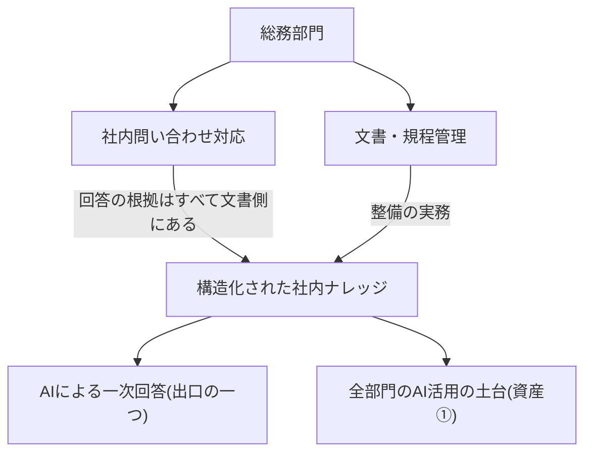
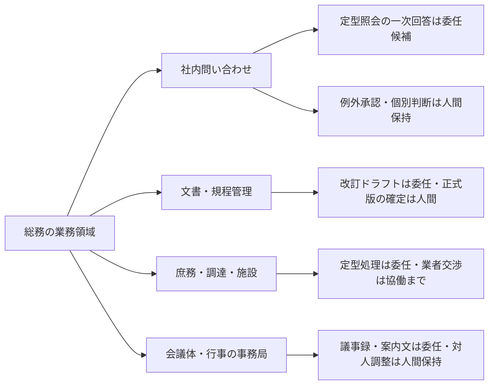

## 総務は全社のナレッジ構造化を主管する部門になり得る

総務のAIDXを「庶務の時短」と読むと、この部門の最大の機会を読み損なう。総務の中核業務——社内問い合わせ対応・文書管理・規程管理——は、見かけは別の仕事だが、実体は一つの資産の三つの顔である。問い合わせの多くは「規程・マニュアルのどこかに書いてあることを探して答える」業務であり、その品質は文書側の整備状態で決まる。出張旅費の精算方法、社用車の予約手順、申請書類の提出先——日々の照会の答えの多くは、すでにどこかの文書に書かれている。ただしこの前提は実務観察に基づくもので、定量的な実証はまだない。だから本ページはこの前提を信じて進めとは言わない。後述の問い合わせログ30日計測で「規程・FAQに答えがあった照会」の比率を自社で測り、前提の成否そのものを主管格上げ判断の検証対象に組み込む設計をとる。そして「業務判断に使う情報が共有された場所にあり、最新版が判別でき、機密区分が運用されている状態」は、本サイトがAI-Readyの土台と位置づける資産①データ・ナレッジの構造化そのものである(定義はAI-Ready編「AI-Readyの5資産」)。全社の文書・規程の管理者である総務は、この資産①整備の実務を主管する部門になり得る——これが本ページの核となる再定義であり、確立した所掌の記述ではなく、本ページからの提案である。

この構造は、主管部門が自部門の変革と全社機能の両方を背負う「多重当事者性」(詳しくは部門別ガイド「人事のAIDX」)の総務版であり、総務では「自部門の業務変革 × 全社の社内ナレッジ構造化(資産①)の主管」の二重の当事者性として現れる。

問い合わせ対応とナレッジ構造化の関係——botは出口にすぎず、資産は文書側に積まれる——を示す。

総務側の受け入れ態勢は悪くない。総務専門誌『月刊総務』編集部の読者調査(小規模・読者母集団のため代表性に留意)では、AI活用を促進したい総務担当者が大半を占め、同じく大半が「AIの進化で総務の仕事はおもしろくなる」と答えている[src-2026-082]。一方で同調査では、自業務のごく一部しかAIで代替できないと見る層が半数程度あり、意欲と業務の再設計のあいだに距離がある。また会計ソフトベンダーPCAの中堅企業調査(利益相反と小規模性に留意)では、経理・総務の現場で活用が先行する一方、生成AI利用の社内規程が未整備の企業が過半を占めた[src-2026-084]——活用先行・統治遅れのこのギャップを埋める文書実務(規程の整備・現行版管理・周知)は、まさに総務型の仕事である。

> 📊 **データボックス(2026-06時点)**
> - 2026年に総務でのAI活用を促進したい意向: 9割以上。「AIの進化により総務の仕事はおもしろくなる」: 約9割。一方、自業務の「1〜25%」がAIで代替可能と認識する層が約50%(『月刊総務』編集部、2025年10月実施、読者・メルマガ登録者の総務担当者174名。業界誌の読者調査で小規模のため代表性に留意)[src-2026-082]
> - 中堅企業(従業員50〜500名)の経理・総務担当者の生成AI活用率: 45.2%。活用者の約79%が業務負担の軽減を実感。一方、生成AI利用の社内規程が未整備: 57.5%(PCA、2025年2月実施、104名。会計ソフトベンダーによる小規模調査のため利益相反・代表性に留意)[src-2026-084]

## 業務の分解マップ

業務分解の方法と4分類(判断/検証/実行/関係構築)の定義は組織・人材編「業務分解×再配置プレイブック」で説明しており、ここでは再定義しない。総務の主要4領域(社内問い合わせ/文書・規程管理/庶務・調達・施設/会議体・行事の事務局)に当てはめたときの大づかみの見取り図を示す。対応づけは出典のある分類ではなく、本ページでの整理である。

総務の業務領域ごとの委任候補と人間保持の見取り図である(詳細はワークシートで分解する)。

総務業務の特徴は2つある。第一に、**委任候補の密度が高い代わりに、委任の成立が文書の整備状態に強く依存する**。定型照会への回答は、根拠となる規程・FAQが構造化されていれば突合可能で委任しやすいが、文書が散在し最新版が判別できない状態では、AIはもっともらしい誤答を量産するだけになる。第二に、**「実行」の中に例外判断が紛れている**。慶弔対応・施設利用の特例・規程に書かれていない個別事情の取り扱いは、定型処理の顔をした「判断」であり、人間が保持する。外部データもこの構図を支える——バックオフィス担当者が効果を実感する業務の最上位は文書の確認・校正系であり[src-2026-083]、AIベンダー自身の利用データ分析でも事務・管理サポート系タスクの企業利用が拡大している[src-2026-023](いずれもベンダー発データのため利益相反・母集団の偏りに留意)。

> 📊 **データボックス(2026-06時点)**
> - 生成AIの効果を実感する業務の上位: 「文書の確認・校正・チェック」69.0%、「データ入力・転記」53.6%(エイトレッド、2025年7月実施、DX推進に携わるバックオフィス担当者110名。ワークフローシステムベンダーによる調査で、母集団がDX推進担当者に偏るため活用率76.4%等は上振れに留意)[src-2026-083]
> - API経由の企業利用で事務・管理サポート関連タスクの比率が13%へ上昇(2025年11月時点)。メール管理・文書処理・スケジューリング等のバックオフィス自動化が拡大(Anthropic Economic Index、2026年1月公表。AIベンダー自身による自社プラットフォームデータの分析であり、利用者層の偏りに留意)[src-2026-023]

### 社内問い合わせ・文書管理の分解ワークシート記入例(そのまま使える)

様式(5列)は組織・人材編「業務分解×再配置プレイブック」の業務分解ワークシートをそのまま使う。総務の2領域をまたぐ記入例を示す。記入内容は出典に基づくものではなく、本ページで作成した例である。

| タスク | 4分類 | 再配置 | 検証者 | 移行時期 |
|---|---|---|---|---|
| 定型照会(規程・FAQに根拠がある質問)への一次回答ドラフト | 実行 | AI委任 | 総務担当(規程原文と突合のうえ送信。根拠条文の引用を必須に) | 今すぐ |
| 回答とFAQの突合・FAQへの還元(よくある質問の追記) | 検証 | 協働 | 文書責任者(AIが追記候補を抽出、人間が確定) | 今すぐ |
| 規程に書かれていない個別事情の取り扱い(特例承認) | 判断 | 人間保持 | 総務部門長 | 移行しない(規程外の判断は前例になる) |
| 社内規程・マニュアルの改訂ドラフト | 実行 | AI委任 | 文書責任者(改訂内容を承認。正式版の確定は人間) | 今すぐ |
| 規程改定の要否判断・改定起案 | 判断 | 協働 | 総務部門長(AIは改定影響・関連規程の整理まで) | 1年以内 |
| 備品・消耗品の発注、会議室・施設の定型手配 | 実行 | AI委任 | 担当者(金額・数量・日付の形式チェック) | 今すぐ |
| 取引業者との価格・条件交渉 | 関係構築 | 人間保持 | — | 移行しない |
| 会議体の議事録ドラフト・社内案内文の作成 | 実行 | AI委任 | 事務局担当(決定事項・固有名詞を全件確認) | 今すぐ |
| 慶弔対応・社外儀礼の判断と対人調整 | 関係構築 | 人間保持 | — | 移行しない |

運用ルールは元のワークシートと同じである——「AI委任」で検証者欄が空白の行は委任禁止、「移行しない」には保持理由必須。

## AI影響の時間軸マップ(今/1年/3年)

以下の見通しに出典はない。確定予測ではなく、準備の優先順位を決めるための作業仮説として使う。

| 領域 | 今 | 1年 | 3年 |
|---|---|---|---|
| **社内問い合わせ** | 定型照会の一次回答ドラフトの委任(根拠引用+人間検証つき)。問い合わせログの記録開始 | 構造化済みの文書を参照する一次対応がフローに組み込まれ、総務は検証・例外対応・FAQ還元へ重心移動 | 定型照会の一次対応は組み込みが標準化。総務の人手は例外処理とナレッジ品質の管理に集中 |
| **文書・規程管理** | 文書台帳の整備、正式版の一意化、機密区分(AI参照可否)の付与 | 規程・マニュアルの「AI可読化」改訂が定常業務になる。改訂ドラフトはAI、確定は人間 | 「AIが読める規程・マニュアル」の維持管理が総務の中核職務に。全部門のナレッジ整備への伴走が広がる |
| **庶務・調達・施設** | 発注・手配・案内文など定型処理の委任 | 申請・手配のワークフロー組み込み。担当者は形式チェックと例外対応へ | 例外処理中心の少人数運営。業者交渉・現場対応が人間の主業務に |
| **会議体・行事の事務局** | 議事録・資料準備・案内文の委任 | 運営事務の協働が拡大。決定事項の確認は人間保持のまま | 対人調整・儀礼判断は人間保持の構図は変わらない |

この進行は自動では起きない。大企業調査では生成AI活用の大半が補助的利用にとどまり、業務プロセスへの組み込みは少数である[src-2026-053]。働く個人側の調査でも、利用が広がらない要因の上位は「必要性を感じない」「使い方がわからない」「使える業務をイメージできない」であり[src-2026-052]、ツールの配布だけでは越えられない。総務にとってこれは二重の意味を持つ。自部門の組み込みには文書の構造化が前提になり、全社の「使い方がわからない」には社内FAQ・利用ガイドの整備という総務型の仕事が効く。全国調査でも社内ガイドラインの策定には過半の企業が前向きであり[src-2026-049]、規程まわりの文書実務の需要は明確である。

> 📊 **データボックス(2026-06時点)**
> - 大企業の生成AI活用レベルは「情報収集・試行」「補助的・効率化」の補助的利用が約7割、業務プロセスへの組み込みは2割未満(日鉄ソリューションズ、2025年9月実施、大企業の正社員・役員3,757名。ITベンダーによる調査)[src-2026-053]
> - 正規雇用就業者の業務での生成AI利用率: 32.4%。利用阻害要因の上位は「自分の業務には必要性を感じない」「使い方がわからない」「どのような業務で使えるのかイメージできない」(パーソル総合研究所、2025年10月実施、3,000名)[src-2026-052]
> - 社内ガイドラインの策定に半数以上の企業が前向き(帝国データバンク、2024年6〜7月実施、4,705社)[src-2026-049]

## いまやるべき準備 — 「AIが読める文書」への投資

3つに絞る。いずれも「最初の90日」に展開する。

**第一に、社内文書の棚卸しと台帳化(今すぐ)。** AI-Ready編「AI-Readyの5資産」の資産①の最初の90日(散在文書の棚卸し+最重要文書への責任者・更新日・機密区分の付与)を、総務が自部門の所管文書(規程・マニュアル・FAQ・様式)から始める。台帳の様式は下の文書台帳様式を使う。文書台帳は問い合わせ委任の前提であると同時に、全社展開の雛形になる。

**第二に、問い合わせログの記録開始(今すぐ)。** 何が・何件・どの規程を根拠に聞かれているかの記録がなければ、委任対象の選定もFAQ整備の優先順位も勘になる。1件1行(日付/質問の種別/根拠文書/回答に要した時間/規程に答えがあったか)で記録し、月次で集計する。「規程に答えがなかった」問い合わせの一覧は、そのまま文書整備のバックログである。このログにはもう一つの役割がある——本ページの核前提(照会の多くは文書に答えがある)を自社データで検証する装置である。「規程・FAQに答えがあった」比率が低ければ、委任の前にFAQ・文書整備のバックログ消化が先行課題であり、主管格上げの判定(規模感の節の閾値)もこの計測値で行う。

**第三に、規程・マニュアルの「AI可読化」改訂(1年以内)。** 規程・マニュアルを「AIが読める形」——正式版が一意で、最新版が判別でき、例外と適用条件が明文化され、用語が定義されている状態——に書き直す仕事は、総務の新しい職務になる。人が読んで迷う文書はAIも迷う。チェック項目は下のチェック5項目に示す。なお役割分担を明確にしておく——AI利用規程そのものの内容設計・法的レビューは組織・人材編「推進体制とガバナンスの設計図」と法務が主管する領域であり(参照: 部門別ガイド「法務のAIDX」)、総務の持ち分は規程という文書群の管理実務(現行版管理・体系整理・周知・可読化)である。

## 人材再配置の方向 — 保管者からナレッジの設計者へ

役割の重心移動の宛先(検証者・設計者・例外処理者)の定義・任命要件・評価観点は組織・人材編「実行者から検証者・設計者へ」で説明しており、ここでは再定義しない。総務固有の点は2つある。

第一に、**自部門の重心移動**。問い合わせ担当は回答の書き手からAI一次回答の検証者+規程外案件の例外処理者へ。文書担当は保管者・改訂作業者から、ナレッジの設計者——どの文書を正式版とし、どう構造化し、どの機密区分でAIに参照させるかを決める役割——へ。検証で見つけた誤答とその原因(文書側の曖昧さ)をFAQ・規程改訂に還元するループを回せる人材が、この部門の新しい中核になる。

第二に、**主管としての総務**。文書台帳の様式・機密区分の付け方・可読化チェックの運用を自部門で確立した総務は、他部門のナレッジ構造化の伴走者になれる。資産①の整備は全部門で必要であり、文書管理の実務を持つ部門は総務だけではない——法務は契約書の台帳管理を、情報システムはナレッジ基盤・検索ツールの所管を持つ。所掌の線引きは「契約文書=法務/基盤・ツール=情報システム/規程・マニュアル・FAQ等の全社共通文書の管理運用ルール=総務」と整理でき、総務はこの持ち分を足がかりに文書管理の運用を全社の文書一般へ広げやすい位置にいる。自部門で先にやって見せた実績が、全社主管の説得力になる(この進め方は部門別ガイド「人事のAIDX」で述べた構図と同じである)。

## この部門特有の罠

**罠1: 問い合わせbot導入だけで満足する(ナレッジ整備をしない)。** botは出口であり、読む対象の文書が散在・重複・旧版混在のままなら、もっともらしい誤答を高速で配るだけの装置になる。導入直後は目新しさで利用が伸び、誤答が数件露見した時点で現場が使わなくなり、「AIは使えない」という学習だけが残る——データ整備を飛ばした導入が本番で接地しない典型として、アンチパターン集「データなき自動化」がこの失敗の構造と脱出方法を扱っている。脱出の順序は同カードと同じく、文書台帳の整備が先、botが後である。

**罠2: 電子化を構造化と取り違える。** スキャンしたPDFの山、命名規則のない共有フォルダ、改訂履歴が本文に混ざった規程は、「電子化済み」だが構造化されていない。資産①の定義(AI-Ready編「AI-Readyの5資産」)は保存形式ではなく、正式版の管理・最新性・定義の統一・機密区分の運用を問うている。ペーパーレス化の完了報告をもってAI-Readyを名乗ると、罠1に直行する。

**罠3: 規程を「禁止の文書」としてだけ増やす。** 活用先行・統治遅れのギャップ[src-2026-084]を埋めようとして、利用実態の把握なしに禁止項目だけ並べた規程を発行すると、利用は統制の外に潜る——この力学はアンチパターン集「禁止すれば安全」が扱う。規程管理の実務者である総務が起草支援に入るなら、入力可否+検証義務+相談先をセットにした暫定ガードレール(定義は組織・人材編「推進体制とガバナンスの設計図」)の形式に沿わせ、禁止一辺倒の文書を作らない。

## 文書台帳様式と「AI可読化」チェック5項目(そのまま使える)

**社内文書台帳の様式。** この様式自体に出典はない。AI-Ready編「AI-Readyの5資産」資産①の最初の90日に言う「文書台帳」の具体様式である(別物を作らない)。1文書1行で記入する。整備後の業務側の展開は業務パターン「問い合わせの一次対応と例外エスカレーション」(三分岐の型)と「社内ナレッジ検索と回答生成」(評価質問セット)を参照。

| 文書名 | 種別(規程/マニュアル/FAQ/様式) | 正式版か(正式版/写し/廃止予定) | 責任者 | 最終更新日 | 機密区分(AI参照可否) |
|---|---|---|---|---|---|
| (例)出張旅費規程 | 規程 | 正式版 | 総務部門長 | 2026-04 | 社内限(承認済み環境で参照可) |
| (例)旧・旅費精算マニュアルv2 | マニュアル | 廃止予定(正式版に統合) | 総務担当A | 2024-08 | — |

**規程・マニュアルの「AI可読化」チェック5項目。** この基準に出典はなく、実務上の経験則である。改訂時に全項目を点検する。これは文書の形式・構造の点検であり、規程の内容設計(組織・人材編「推進体制とガバナンスの設計図」の社内規程の骨子)とは別物である。

1. **正式版の一意性**: 同じ内容の文書が複数の場所にない。写し・旧版は台帳上で「廃止予定」と明示されている
2. **最新性の判別**: 版数と最終更新日が文書自体に記載され、改訂履歴は本文と分離されている
3. **構造の明示**: 条文番号・見出しが階層的に付き、1条文1論点になっている(長文の中に複数ルールを埋め込まない)
4. **例外の明文化**: 「原則」と「例外」が分離して書かれ、例外の適用条件と承認者が明記されている(運用上の例外を口伝にしない)
5. **用語の定義**: 文書内の鍵となる用語(「所属長」「速やかに」等)が定義されているか、全社の用語定義を参照している

問い合わせログの様式(1件1行: 日付/質問の種別/根拠文書/回答所要時間/規程に答えがあったか)は前節のとおり。検証ログの様式は組織・人材編「実行者から検証者・設計者へ」の最小様式をそのまま使い、部門で別様式を作らない。

## 体制と費用の目安

以下の目安に出典はなく、実務上の経験則である。2レンジで示す。**中堅(数百名規模、総務2〜5名)**: 兼務1〜2名で開始。対象は問い合わせ1領域(人事労務系を除く総務所管の照会)+所管規程・マニュアルの台帳化(目安20〜50文書。社内規程数の実態に関する外部データがないため出典のないレンジであり、棚卸し初日の実数で置き換える)、期間90日、総務部門長の決裁。既存の全社契約ツールの範囲なら追加投資ゼロ〜数十万円。**大企業(数千〜数万名規模、総務部門数十名)**: 文書・規程管理の担当(2〜3名)と問い合わせ対応の担当(2〜3名)を分けて任命し、推進部門との兼務を含めて90〜180日のパイロット→部門展開の2段階、担当役員決裁。所管文書が数百本に及ぶ場合は、問い合わせログの頻度上位から台帳化・可読化の優先順位を付ける。bot等の外部ツール調達では、FAQ・問い合わせログ・整備済み文書のデータ可搬性(解約時の持ち出し)を契約前に確認する(確認項目は原理編「反脆弱性の原則」にある)。

**効果側の目安**(この試算に出典はなく、仮置きの前提による概算である): 定型照会の一次回答ドラフト化とFAQ還元で問い合わせ対応工数の3〜5割が浮くと置くと、中堅(月100〜200件、1件平均15分と仮定)で月8〜25時間=人件費換算で月数万円〜10万円規模、大企業(月数千件規模)では年換算で担当1〜数名分の工数に相当する。効果は文書整備の進捗に遅れて立ち上がるため、最初の四半期は計測の整備期間と割り切る。

経営が承認・否認する判断は1つ——パイロット(上記レンジ)の予算と、90日目に全社のナレッジ構造化主管へ格上げするか否かの判定である。格上げ判定の閾値の目安(出典のない実務上の目安): ①台帳カバー率——所管文書のほぼ全件が台帳に載り、全行に責任者・正式版かどうか・機密区分が記入済み ②検証付き一次回答の差し戻し率——1割未満かつ直近2か月で低下傾向 ③問い合わせログで「規程・FAQに答えがあった」照会が過半。③を満たさない場合は本ページの核前提が自社では成り立っていないことを意味し、格上げではなく文書整備の継続が先である。この閾値と判定時期を承認時に決めておく。

## 最初の90日

- 【総務部門長】【推進担当】(今すぐ)所管文書の棚卸しと文書台帳初版の作成。道具: 本ページの文書台帳様式(6列)。完了条件: 所管の規程・マニュアル・FAQが台帳に載り、全行に責任者・正式版かどうか・機密区分が記入され、総務部門長が承認していること
- 【総務担当】(今すぐ)問い合わせログの記録開始。道具: 本ページのログ様式(1件1行)。完了条件: 30日分のログが集計され、頻度上位の照会種別、「規程・FAQに答えがあった」照会の比率(核前提の検証値・格上げ判定の閾値③)、「規程に答えがなかった」案件の一覧が出ていること
- 【総務部門長】(今すぐ)問い合わせ業務をワークシートで分解し、定型照会の一次回答ドラフトの委任を検証つきで開始する。道具: 組織・人材編「業務分解×再配置プレイブック」のワークシート+本ページの記入例+検証ログの最小様式(組織・人材編「実行者から検証者・設計者へ」)。完了条件: 全タスクに4分類・再配置・検証者が記入され、送信される一次回答に根拠条文の引用と検証者の確認が付いていること
- 【総務部門長】【法務】(1年以内)規程のAI可読化パイロット1本。問い合わせ頻度が高く誤答リスクの低い規程を1本選び、チェック5項目で改訂する。道具: 本ページのAI可読化チェック5項目。完了条件: 改訂後の規程を根拠とする一次回答の差し戻し率が改訂前と比較・記録され、次の改訂対象3本が決まっていること
- 【経営】【総務部門長】(能力向上を待て)人間検証なしの自動応答の全面展開。文書台帳が埋まり、検証ログで誤答の発生源(文書側の曖昧さ)が四半期単位で潰せていることが確認できるまで、一次回答の無検証送信はしない。検証なきbotは罠1をそのまま全社に配ることになる

**この主張が崩れる条件**: ①自社の問い合わせログ計測で「規程・FAQに答えがあった」照会が2四半期連続で半数を大きく下回るか、文書整備を先行させた領域の一次回答差し戻し率が2四半期連続で改善しないとき(問い合わせ品質は文書側の整備で決まるという本ページの核前提が自社で成立していない)。②文書・規程が未構造化のままでも、検索・読解能力の向上だけで社内問い合わせの一次回答品質が人間検証付き運用と同等に維持された事例が、ベンダー発以外の複数の独立した調査で確認されたとき。いずれの場合も、総務の主管業務はナレッジ構造化ではなくツールの運用管理・例外処理に縮小して再設計する。

<!--
執筆メモ(2026-06-11 batch4レビュー反映で改稿。ソースが薄い箇所・レビュー重点ポイント):
- 「総務=資産①(社内ナレッジ構造化)の主管部門になり得る」はページの核だが出典のない編集部の見立て(本文で「提案」と明示済み)。二重の当事者性はフレーム台帳「主管部門の多重当事者性」(正本: departments/hr)の参照+対応1行のみで、独立定義・変種図は作っていない。
- 核前提「問い合わせの多くは規程・マニュアルに書いてあることの検索」は定量出典のない実務観察(batch4で3人格一致の論証最弱点と指摘)。改稿で①本文に無実証である旨を明示 ②問い合わせログ30日計測(「規程・FAQに答えがあった」比率)で自社検証する設計に再構成 ③その計測値を主管格上げ判定の閾値③および反証条件①に接続した。外部実証(社内問い合わせ構成の調査)の収集は /aidx-research キューに登録済み(batch4次フェーズ提案)。
- 主管格上げ判定の閾値3つ(台帳カバー率/差し戻し率1割未満かつ低下傾向/答えがあった照会が過半)はいずれも編集部の見立て。反証条件は自社観測可能な指標(①)+外部調査(②)の2本立てに改稿済み(CLAUDE.md必須スロット4の新規約対応)。
- 規模感に効果側レンジ(工数削減の人件費換算)を追加(CLAUDE.md必須スロット2の新規約対応)。月100〜200件・1件15分等の前提値はすべて見立てで、出典なし。
- 「20〜50文書」レンジは外部データ未収載の見立てと本文に明示し、棚卸し実数で置き換える運用にした。社内規程数の実態データの収集は /aidx-research 候補。
- 「文書管理の方法論を持つ部門は総務のほかにない」はbatch4必須修正12で削除し、法務(契約台帳)・情報システム(ナレッジ基盤・検索ツール所管)・総務(規程・マニュアル・FAQ等の全社共通文書の管理運用ルール)の三者の線引き+見立てマーカーに置換。
- [082]「9割以上」→本文「ほぼすべて」はbatch4必須修正3(境界値の上方丸め)で「大半」に修正済み。データボックスの実値は変更なし。
- 業務分解の見取り図・記入例(9タスク)・時間軸マップ・AI可読化チェック5項目・文書台帳様式・問い合わせログ様式・規模感2レンジ・90日はすべて出典のない編集部の見立て(マーカー明示済み)。
- src-2026-082(月刊総務)・083(エイトレッド)・084(PCA)はいずれもmedium・小規模(n=104〜174)。すべてデータボックス隔離+調査主体・COI・母集団の偏りを併記し、ページの結論(主管への再定義)はこれらの数値に背負わせていない。082は報道経由ではなく業界誌の自社調査のため「報道によれば」ではなく調査主体の直接帰属とした。
- 084のkey_factsにあるツール名別シェア(ChatGPT 74.5%)は2層ルール(ツール名は本文・データボックス不可)を考慮して不使用。
- 「文書業務がバックオフィスAIの主戦場」は083(ベンダー・medium)+023(Anthropic自社データ・high但しCOIあり)の2源で支え、両方のCOIを本文・データボックスで開示。
- 規程管理の所掌について法務(全社AIガバナンス主管)との衝突を回避するため、「内容設計・法的レビュー=法務/文書群の管理実務=総務」と分担を本文に明記した。
- 文書台帳様式(6列)とAI可読化チェック5項目は本ページが正本としてフレーム台帳の実行素材表に登録済み。文書台帳はfive-assets資産①90日の「文書台帳」の具体様式(別物の新造ではない)、可読化チェックはgovernance-structureの「社内規程の骨子」(内容)と別物(形式・構造)である旨を本文とフレーム台帳の両方に明記。
- 逆リンクの現況(batch4指摘のstale修正・2026-06-11確認): hr結論節の多重当事者性断面一覧への総務追加、five-assets資産①の最初の90日から本ページへの「整備実務の部門例」リンクは、いずれも反映済み。dataless-automationのdepartmentsは[all]のため変更不要。
2026-06-12 文体改修: 格言調見出し平易化・内部用語排除・見立て定型句を自然文に置換(文書管理の文脈の「正本」は読者向け本文では「正式版」と表記)
-->
