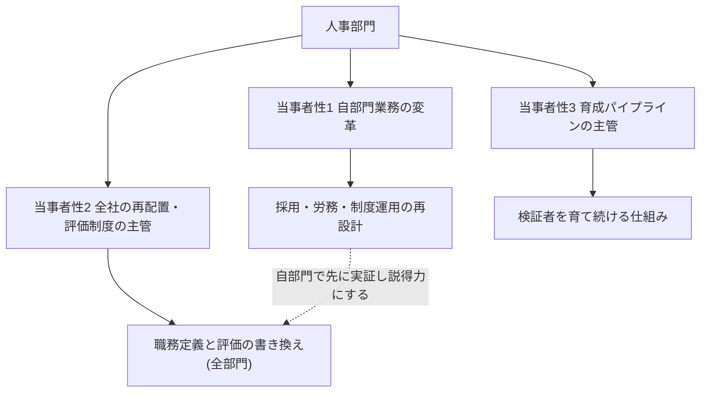
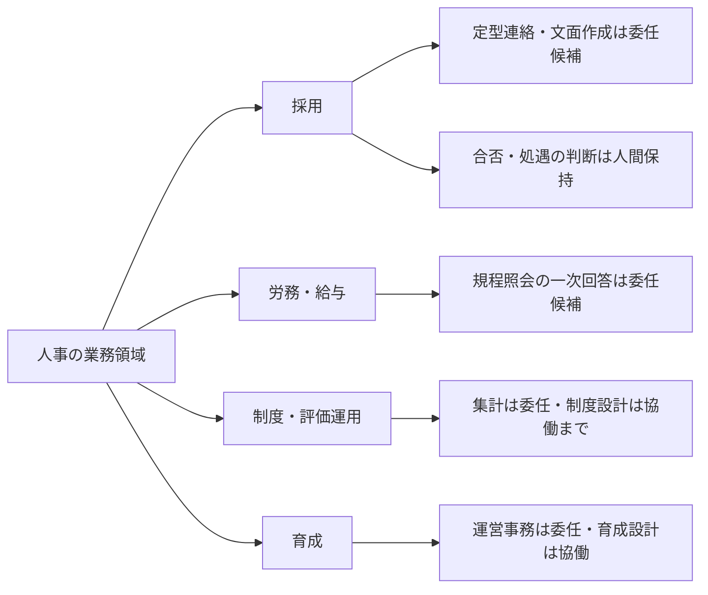

## 人事が同時に負う三つの当事者性

人事のAIDXを「人事業務の効率化」と読むと、このページの大半を読み損なう。人事は三重の当事者である。第一に、**自部門業務の変革**——採用・労務・制度運用へのAI適用。第二に、**全社の人材再配置の主管**——職務定義書と評価制度を3役割の語彙で書き換える施策は、どの部門で起きても制度の所管は人事である(制度の枠組みは組織・人材編「実行者から検証者・設計者へ」)。第三に、**育成パイプライン再構築の主管**——AIによる下流業務の代替が新人の訓練機会を消す問題への手当も、育成制度の所管として人事が設計する(手当の設計は組織・人材編「新人が育たない問題」)。このページの本丸は第二・第三の「主管としての人事」であり、第一の自部門変革はその実証実験台と位置づける。この位置づけに出典はなく、上記の所管の構造からの判断である。

この構造を本サイトでは**「主管部門の多重当事者性」**——自部門業務の変革 × 主管する全社機能の変革(部門により第3の当事者性が加わる)——と呼び、その定義は本ページに置いている。部門別ガイドの経営企画(自部門変革 × 全社の設計者供給源)、法務(同 × 全社AIガバナンス整備の主管)、経理財務(同 × 全社AI投資の財務ゲートの当事者)、開発(同 × 全社のAI実装・技術的負債管理の主管)、総務(同 × 全社ナレッジ構造化〈資産①〉の主管)、マーケティング(同 × 全社ブランド基準の主管)、広報(同 × 全社の対外AI接点のレピュテーション管理への関与)が言う「二重の当事者性」は、この構造の部門別の現れ方である。人事は主管する全社機能が2つ(再配置・評価制度/育成パイプライン)あるため三重になる。

三重の当事者性の構造と、自部門での実証が全社主管業務の説得力になる関係を示す。

外部の実態データもこの読みを支える。日本のリーディング企業では、生成AI導入に伴う人員の配置転換はすでに始まっていると報告されている[src-2026-050]——再配置の制度設計は将来の話ではなく、進行中の実務である。人事部門に特化したデータとしては、人事システムベンダーであるWorks Human Intelligence(WHI総研)が自社製品の利用企業を対象に行った小規模調査があり、人事業務での利用と成果実感の広がりを示唆する[src-2026-057]。ただしベンダーによる自社顧客対象・小規模の調査であり(利益相反と母集団の偏りに留意)、これをもって「人事業務は普及フェーズ」と断定はできない——「生成AI活用に関心のある大手企業人事という先行集団の傾向」を示す補助データとして読む。

> 📊 **データボックス(2026-06時点)**
> - 生成AI導入により人材の配置転換を行っている企業: 約4割(前年32.4%)。AIで代替される人材の雇用を減らし始めている企業: 23.0%で前年比横ばい(デロイト トーマツ、2025年7月実施、プライム上場・売上1,000億円以上の部長クラス以上700名)[src-2026-050]
> - 補助データ: 生成AIを全社に公開している大手企業: 75.0%(前回調査38.8%からほぼ倍増)。人事業務での生成AI利用: 75.0%。成果が「期待以上」「期待通り」の合計: 69.6%。用途は文章作成系が約8割で最多(WHI総研、2025年8〜10月実施、人事システム利用企業56法人64名。ベンダーによる自社顧客対象調査のため利益相反・母集団の偏りに留意)[src-2026-057]

## 人事業務を4分類に分けて考える

業務分解の方法と4分類(判断/検証/実行/関係構築)の定義は組織・人材編「業務分解×再配置プレイブック」で説明しており、ここでは再定義しない。人事の4領域(採用・労務/給与・制度/評価運用・育成)に当てはめたときの典型的な分布を示す。この分布に出典はなく、業務内容からの整理である。

人事の業務領域ごとの委任候補と人間保持の大づかみの見取り図である(詳細はワークシートで分解する)。

人事業務の特徴は2つある。第一に、**「実行」に見えるタスクに「判断」が埋まっている比率が高い**。書類選考の一次スクリーニングは作業に見えるが、その実体は「不合格」という人事判断である。前掲プレイブックの判定基準どおり「失敗したとき誰が責任を負うか」で切れば、候補者・従業員の処遇に影響するタスクは判断に分類される。第二に、**誤りが人の処遇に直接届く**。人事判断は検証義務化ラインの「高」リスク区分の典型例として明示されており、人間検証必須・全件・検証者記名が原則である(区分の定義は組織・人材編「推進体制とガバナンスの設計図」)。採用での利用は、候補者への公平性と説明可能性——なぜ不合格かを人間が説明できるか——が問われる点で、社内文書の効率化とはリスクの桁が違う。

### 採用業務の分解ワークシート記入例(そのまま使える)

様式(5列)は組織・人材編「業務分解×再配置プレイブック」の業務分解ワークシートを使う。中途採用1件の流れを分解した記入例を示す。記入内容は出典のない想定例である。

| タスク | 4分類 | 再配置 | 検証者 | 移行時期 |
|---|---|---|---|---|
| 求人票・スカウト文面の一次ドラフト | 実行 | AI委任 | 採用担当(要件・表現を全件確認) | 今すぐ |
| 応募書類の要約・経歴の構造化 | 実行 | AI委任 | 採用担当(原本と突合。要約のみで合否判断しない) | 今すぐ |
| 書類選考の合否判断 | 判断 | 人間保持 | 採用責任者 | 移行しない(候補者への説明責任。検証義務化ライン「高」) |
| 面接日程調整・定型連絡 | 実行 | AI委任 | 担当者(誤送信防止の形式チェック) | 今すぐ |
| 面接評価コメントと評価基準の突合 | 検証 | 協働 | 面接官本人 | 1年以内 |
| 面接・動機形成(口説き) | 関係構築 | 人間保持 | — | 移行しない |
| 内定条件(処遇)の決定 | 判断 | 協働 | 採用責任者(AIは相場・整合の整理まで) | 1年以内 |

運用ルールは前掲プレイブックと同じで、「AI委任」で検証者欄が空白の行は委任禁止、「移行しない」には保持理由を必ず書く。

### 労務業務の分解ワークシート記入例(そのまま使える)

採用だけが分解対象ではない。労務・給与の月次運用を分解した記入例を示す。記入内容は出典のない想定例である。給与・規程に関する従業員照会の一次回答は、根拠が規程に書かれており突合可能なため、委任の典型例である。

| タスク | 4分類 | 再配置 | 検証者 | 移行時期 |
|---|---|---|---|---|
| 給与・規程に関する従業員照会の一次回答ドラフト | 実行 | AI委任 | 労務担当(規程と突合のうえ送信。根拠条文の引用を必須に) | 今すぐ |
| 社内規程・FAQの改定ドラフト | 実行 | AI委任 | 労務責任者(改定内容を承認) | 今すぐ |
| 給与計算結果の異常値チェック | 検証 | 協働 | 労務担当(AIが候補抽出、人間が確定) | 1年以内 |
| 社会保険手続の申請書類ドラフト | 実行 | AI委任 | 労務担当(提出前の全件形式チェック) | 今すぐ |
| 休職・復職・介護等の個別事情への裁量判断 | 判断 | 人間保持 | 労務責任者 | 移行しない(従業員の処遇に直結。検証義務化ライン「高」) |
| 労使協議・従業員面談 | 関係構築 | 人間保持 | — | 移行しない |

制度運用(評価集計・サーベイ分析)も同じ様式で分解できる。

## AI影響の時間軸マップ(今/1年/3年)

以下は出典のある予測ではなく、準備の優先順位を決めるための作業仮説である。確定予測として読まないでほしい。

| 領域 | 今 | 1年 | 3年 |
|---|---|---|---|
| **採用** | 文面作成・日程調整・書類の構造化の委任 | 選考補助(要約・突合)の協働が標準化。合否判断は人間保持のまま、検証記録が必須に | 選考プロセス全体の再設計。公平性・説明可能性の検証体制が整わない限り判断の委任はしない |
| **労務・給与** | 規程照会への一次回答ドラフト、定型文書の委任 | 定型手続きの委任拡大、担当者は検証と例外対応へ重心移動 | 例外処理中心の少人数体制。労使協議・個別事情対応が人間の主業務に |
| **制度・評価運用** | 集計・資料作成の委任 | スキルデータの記録・整備の開始(全社主管業務の基盤) | スキルベース評価の運用開始。職務定義・評価の語彙が3役割系に置き換わる |
| **育成** | 研修運営事務の委任、コンテンツの一次ドラフト | 検証者育成プログラムのパイロット、訓練価値業務の仕分け | AI協働前提の習熟段階の再定義が等級要件に反映 |

この見通しの外部根拠は3つある。第一に、配置転換はリーディング企業で既に始まっている[src-2026-050]。第二に、スキルベース評価への転換は公的機関も提言している——IPAの調査分析ペーパーは、従来型の雇用関係から「スキルをベースに評価や役割を決定するダイナミックな関係」への変革と、スキルベースの人事評価制度の導入を不可欠と論じる[src-2026-055]。第三に、育成の入り口には異変の兆候がある——米国の研究では、AI曝露度の高い職種の若年層(22〜25歳)に限って相対的雇用減少が検出された(学術的には未決着。詳しい扱いは組織・人材編「新人が育たない問題」)[src-2026-016]。

> 📊 **データボックス(2026-06時点)**
> - 日本企業のDX推進人材の不足: 85.1%。米独と比べて著しく高い(IPA調査分析DP2025-02、2025年10月公表)[src-2026-055]
> - 9割以上のICT職種で主要スキルの過半がAIによって変化する可能性(同ペーパー)[src-2026-055]
> - AI曝露度が最も高い職種の22〜25歳: 約16%の相対的雇用減(Stanford Digital Economy Lab、米国ペイロールデータ、2025年11月改訂版)[src-2026-016]

## いまやるべき準備

3つに絞る。いずれも時間軸タグ付きで「最初の90日」に展開する。

**① 採用AI利用の暫定基準を出す(今すぐ)。** 全社規程の完成を待たず、選考に関わる全員に1枚で配る。そのまま使える文例3か条を示す(法令の整理ではない点は後述):

> 1. 候補者の合否・処遇に影響する判断(書類選考・面接評価・内定条件)はAIに委任しない。AIによる要約・整理を判断材料に使うことはできるが、判断とその説明の責任は記名された人間が負う。
> 2. 候補者・従業員の個人情報の入力可否は全社の暫定ガードレール(組織・人材編「推進体制とガバナンスの設計図」で定義)に従い、承認済み環境のみで扱う。
> 3. 候補者に選考プロセスを問われたとき「人間が判断した」と説明できる状態を維持する。説明できない選考フローを作らない。

なお開示しておく——**採用AIに関する国内外の規制動向(法令・行政指針)の一次ソースは本ページ未収載**である。上記3か条は法令の要求事項の整理ではなく、検証義務化ライン(「人事判断」=高リスク)を採用業務に展開した本サイト独自の整理であり、法令上の裏づけはまだ確認していない。一次ソースの収集・反映までは、自社の法務・コンプライアンス部門の確認を経て運用すること。

**② スキルの記録を始める(今すぐ〜1年以内)【CHRO】。** スキルベース評価への転換[src-2026-055]は制度改訂が本体だが、制度本体に着手する前に、異動・登用の判断材料としてスキル記録を使い始めることが外堀になる(進め方は組織・人材編「実行者から検証者・設計者へ」)。記録がなければ3年後の制度は設計できない。何を記録するかは、既存の職務スキルに加えて3役割系のスキル(検証・設計・例外処理。定義は同ページ)、粒度は個人×スキル項目×習熟段階の1件1行とし、四半期ごとに更新する。この進め方に出典はなく、実務上の経験則である。道具: 下のスキル記録ミニ様式。完了条件: 自部門(人事)の全員分の記録が作成され、四半期更新の担当と期日が定まっていること。

スキル記録ミニ様式(出典のない叩き台。全社のスキルベース評価制度の前段の暫定記録であり、制度本体の設計は組織・人材編「実行者から検証者・設計者へ」で扱う):

| 氏名 | スキル項目(職務スキル+検証/設計/例外処理) | 習熟段階(未着手/補助つき/独力/指導可) | 根拠となる実績(検証ログ・改訂実績・案件名) | 記録日 |
|---|---|---|---|---|
| (例)労務担当A | 規程照会回答の検証 | 独力 | 検証ログ4〜6月分(差し戻し12件) | 2026-06 |

**③ 訓練価値の仕分けを全社の委任判定に組み込む(1年以内)。** AI委任の意思決定プロセスに「この業務の訓練価値」の観点を常設する。仕分けの2×2マトリクスと判定3問は組織・人材編「新人が育たない問題」に収載している。米国企業のシニアリーダー調査では、意図的な役割設計・コーチング・練習時間がなければスキル萎縮(skill atrophy)が起きると相当数のリーダーが警告している[src-2026-026]。

## 人材再配置の方向 — 3役割を自部門で運用し、全社の制度も主管する

役割の重心移動の宛先(検証者・設計者・例外処理者)の定義・任命要件・評価観点は組織・人材編「実行者から検証者・設計者へ」で定義しており、ここでは再定義しない。人事固有の点は2つある。以下の整理に出典はない。

第一に、**人事部員自身の重心移動**。採用担当はスカウト文面の書き手からAI文面の検証者へ、労務担当は手続きの処理者から例外案件の処理者へ、制度企画は集計者から業務とAIの分担の設計者へ。同ページの職務定義書改訂例(経理スタッフ)と同じ要領で、人事スタッフ版の改訂が自部門で作れる。

第二に、**全部門の3役割化の制度面の主管**。検証者の任命が降格と受け取られないための処遇設計、評価指標を処理件数系から検証精度系へ張り替える際の経過措置、労働組合・従業員代表との協議——これらの労務リスクへの手当は組織・人材編「実行者から検証者・設計者へ」の労務リスク節で説明しており、その実務を回すのは人事である。自部門で検証ログ(同ページの最小様式)を先に運用しておくと、全社展開時に「人事は自部門でやって見せた」という説得力が立つ。

## この部門特有の罠

**罠1: 「実行」の皮をかぶった「判断」を委任する。** 書類スクリーニングの自動化は、作業の効率化ではなく不合格判断の自動実行である。応募書類の束をAIに渡して「要件に合う候補だけ残して」と指示した時点で、残らなかった応募者の不合格はAIが決めている——担当者の手元では作業が減ったようにしか見えない。候補者への公平性(学習データの偏りの再生産)と説明可能性(不合格理由を人間が説明できない)のリスクは、検証義務化ラインの「高」に相当する。脱出はワークシートでの分解と、暫定基準3か条の先行発行。

**罠2: 自部門の時短で「人事のAIDXは完了」と総括する。** 先行集団でも用途は文章作成系が中心と示唆される現状[src-2026-057]は入り口としては正しいが、そこで止まると三重の当事者性の第二・第三——職務定義・評価制度の改訂と育成再構築——が宙に浮く。これらは人事以外に主管できる部門がない。自部門の効率化の成果報告に、主管業務の進捗(職務定義の改訂試作数・スキル記録の整備状況)を必ず併記する。

**罠3: 効率を理由に、育成の入り口を人事が自ら閉じる。** 若手の訓練装置だった下流業務の委任と、エントリー層の雇用への悲観論[src-2026-016]を短絡させ、新卒採用枠を先回りで縮小すること。米国企業の調査では、インターン採用を増やす見込みの企業が減らす見込みを大きく上回っており[src-2026-026]、企業の多数派は入り口を閉じていない。問題は採用の有無ではなく入社後の育成設計である(設計の方法は組織・人材編「新人が育たない問題」)。

## 体制と費用の目安

2レンジで示す。以下の体制・期間・決裁レンジに出典はなく、実務上の経験則である。**中堅(数百名規模、人事部3〜10名)**: 自部門の分解は採用または労務の1業務・兼務2〜3名・90日・CHRO/人事部長決裁で始める。主管業務は職務定義1職種の改訂試作から(兼務1〜2名)。**大企業(数千〜数万名規模、人事部門数十名以上)**: 採用・労務・制度の2〜3チームを並走(各チーム兼務2〜3名+推進専任1名・90〜180日)、採用領域の暫定基準は法務・コンプライアンス部門のレビューを通す。全社の評価制度改訂の体制・期間は、組織・人材編「実行者から検証者・設計者へ」が示す目安(制度設計チーム2〜5名・1〜2年)に従う。

## 最初の90日

- 【人事部長】【推進担当】(今すぐ)自部門業務を1つ(採用を推奨)分解する。道具: 組織・人材編「業務分解×再配置プレイブック」のワークシート+本ページの記入例。完了条件: 全タスクに4分類・再配置・検証者が記入され、採用責任者のレビューを通っていること
- 【採用責任者】【CHRO】(今すぐ)採用AI利用の暫定基準を発行する。道具: 本ページの文例3か条+検証義務化ライン(定義は組織・人材編「推進体制とガバナンスの設計図」)。完了条件: 選考に関わる全員(面接官含む)に周知され、合否に影響するタスクのAI委任が止まっていること
- 【CHRO】(今すぐ)主管業務に着手する宣言として、職務定義書1職種を3役割の語彙で改訂試作する。道具: 組織・人材編「実行者から検証者・設計者へ」の改訂before/after表。完了条件: 対象部門長と合意したドラフト1本と、次四半期の展開計画が存在すること
- 【CHRO・人材開発】(1年以内)検証者育成パイロット(1部門・新人3〜5名・12週)とスキル記録の整備を開始する。道具: 組織・人材編「新人が育たない問題」の育成プログラム表、IPAが提言するスキルベース評価の枠組み[src-2026-055]。完了条件: パイロットの先行指標(指摘の深度)が測定され、スキル記録が異動・登用の判断材料として1件以上使われていること
- 【CHRO】(能力向上を待て)採用選考の合否判断の自動化。公平性・説明可能性を継続的に検証する手段が確立する前の委任は、候補者への説明責任と企業の信用の両方を毀損する。人間検証付きの選考補助で得た検証記録が四半期単位で蓄積されてから再判定する

**この主張が崩れる条件**: 人事の主管(職務定義・評価・育成の制度改訂)なしのツール配布だけで、各部門が自律的に役割再設計と育成再構築を完遂し、品質・定着の両面で遜色ない事例が、ベンダー発以外の複数の独立した調査で確認されたとき——そのとき人事の役割は制度主管ではなく環境整備に縮小してよい。

<!--
執筆メモ(ソースが薄い箇所・レビュー重点ポイント):
- 「三重の当事者性」は出典のない編集部の見立て(本文にマーカー明示済み)。2026-06-11 第3陣レビューでフレーム台帳「主管部門の多重当事者性」の正本として登録済み。corporate-planning / legal の「二重の当事者性」との対応関係は本文(結論節)に明記済み。
- src-2026-057はWHI総研(人事システムベンダー)の自社顧客調査・n=64・reliability: medium。第3陣レビュー指摘によりデータボックス先頭をデロイト[src-2026-050]に入れ替え、WHIは補助データに降格。「普及フェーズ」の断定を回避し先行集団の傾向として記述。テーゼ(三重の当事者性)はこの調査に依拠していない。
- 採用AIの公平性・説明可能性リスクと暫定基準3か条は、governance-structureの検証義務化ライン(「人事判断」=高リスク)を採用業務に展開した編集部の見立て。AI規制(採用AIの高リスク区分等)の一次ソースが未収集のため法令名は書かず、「規制動向は未収載」と本文で開示済み。/aidx-research で最優先補強し、収載後に暫定基準を「法令+見立て」へ格上げする。
- 時間軸マップ(今/1年/3年)・採用/労務ワークシート記入例・スキル記録ミニ様式・規模感2レンジは出典のない編集部の見立て(マーカー明示済み)。スキル記録ミニ様式はフレーム台帳の実行素材表に登録済み。
- 4分類・3役割・検証義務化ライン・育成プログラム・労務リスクはすべて正本参照のみで再定義していない(フレーム台帳準拠)。参照名が正本の実タイトルと一致していることを確認済み。
2026-06-12 文体改修: 格言調見出し平易化・内部用語排除・見立て定型句を自然文に置換
-->
