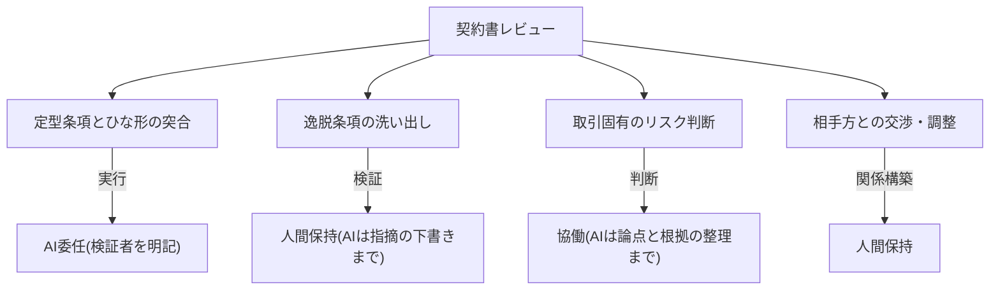

## 活用が進み、リスクが高く、全社の統治も担う部門である

法務・知財・コンプライアンス(以下、法務)は、部門別AIDXの中で特異な位置にある。第一に、日鉄ソリューションズが日本の大企業の正社員・役員を対象に実施した調査(2025年9月実施。ITベンダーによる自社調査である点には留意)では、法務・知財・コンプライアンスは職種別で生成AIの活用率が高い職種群に入る[src-2026-053]。第二に、その業務は誤りが法令・契約・対外責任に直結する——全社の検証義務化ラインで「高」区分(全件・記名の人間検証必須)に該当する利用の典型である(区分の定義は組織・人材編「推進体制とガバナンスの設計図」)。第三に、法務は自部門の利用者であると同時に、全社のAI利用規程・契約条項・インシデント対応を整備する主管部門でもある。

この構造は、部門別ガイド「人事のAIDX」で「主管部門の多重当事者性」として説明している構造(自部門の業務変革と全社機能の変革を同時に負う)の法務での現れ方であり、法務では「自部門の業務変革 × 全社AIガバナンス整備の主管」の二重の当事者性として現れる。この二つを同時に設計することが、法務のAIDXの固有課題である。どちらか片方に倒すと、後述の罠に落ちる。

なお本ページの各論は法務(契約・リサーチ・ガバナンス)を扱う。知財(AI生成物の著作権・学習データ利用の契約条項)とコンプライアンス調査の各論は未収載であり、出典の補強を待って追補する。

> 📊 **データボックス(2026-06時点)**
> - 日本の大企業(単体従業員1,000名以上かつ売上500億円以上、正社員・役員3,757件)の生成AI業務活用率は全体で約4割。職種別では「商品企画・サービス企画」「経営企画・事業企画」「法務・知財・コンプライアンス」「研究開発」で活用率が高い(日鉄ソリューションズ調査、2025年9月実施・同年11月発表。ITベンダーによる自社調査)[src-2026-053]
> - 同調査で、活用レベルは「情報収集・試行」「補助的・効率化」の補助的利用が約7割を占め、業務プロセスへの組み込みは2割未満。課題の最多は「AIが生成する情報の正確性や信頼性への不安」約4割[src-2026-053]

活用率が高い一方で利用の大半が補助的利用にとどまり、最大の課題が出力の正確性への不安である——この構図は法務にそのまま当てはまる。組み込みに進むための条件が検証体制の設計であり、それは法務が最も得意とするべき領域である。

## 契約レビューを「定型条項」と「取引固有」に分けて考える

分解の方法と4分類(判断/検証/実行/関係構築)の定義は、組織・人材編「業務分解×再配置プレイブック」で説明している。本ページではその4分類を法務業務に適用した分解例のみを示す。例示に出典はなく、実務の業務構成からの整理である。

鍵は、「契約書レビュー」をひとつの仕事として扱わないことである。定型条項のチェック(準拠法・裁判管轄・損害賠償上限・反社条項などの自社ひな形・チェックリストとの突合)は手順が決まれば結果が安定する「実行」であり、AI委任の第一候補になる。一方、取引固有のリスク判断(この相手と、この事業文脈で、この条項を受け入れるか)は責任を伴う「判断」であり、人間が保持する。同じ1通の契約書の中に、性質の異なるタスクが同居している。なお契約書の翻訳(正文条項の検証を含む)は業務パターン「翻訳・多言語化の生成・検証フロー」を参照。

契約書レビューの分解と再配置の対応を図示する(4分類と判定フローの詳細は前掲プレイブック)。

### 法務業務の分解記入例(そのまま使える)

業務分解ワークシート(様式は前掲プレイブックのものを使う。列構成はそちらに従う)への記入例を示す。記入内容は出典のない想定例である。

| タスク | 4分類 | 再配置 | 検証者 | 移行時期 |
|---|---|---|---|---|
| 定型条項とひな形・チェックリストの突合 | 実行 | AI委任 | レビュー担当者(指摘の全件確認) | 今すぐ |
| ひな形からの逸脱条項・欠落条項の洗い出し | 検証 | 協働 | レビュー担当者(AIの指摘を原文と突合) | 今すぐ |
| 取引固有のリスク評価と受諾可否の判断 | 判断 | 協働 | 法務責任者(採否と責任は人間) | 1年以内 |
| 相手方・事業部門との交渉・条件調整 | 関係構築 | 人間保持 | — | 移行しない |
| 法令・判例リサーチの一次サーベイ | 実行 | AI委任 | 担当者(引用元を原典で全件確認) | 今すぐ |
| リサーチ結果の法的評価・意見形成 | 判断 | 協働 | 法務責任者 | 1年以内 |
| 対外意見書・回答書の最終確認 | 検証 | 人間保持 | 法務責任者(記名) | 移行しない |
| 契約台帳への登録・期限管理 | 実行 | AI委任 | 担当者(件数突合) | 今すぐ |

運用ルールは前掲プレイブックと同じで、「AI委任」で検証者欄が空白の行は委任してはならない。法務で特に重いのは「リサーチの一次サーベイ」の検証である。引用された法令・判例は**原典で全件確認**する。存在しない判例や失効した条文の引用はAI出力の既知の欠陥モードであり、米国では架空判例を検証なしに裁判所へ提出した弁護士に対する制裁が現実に確定している[src-2026-058]。検証なしの引用は法務の信用を一撃で毀損する(事例の詳細は罠2)。

## AI影響の時間軸マップ(今/1年/3年)

以下は出典のある予測ではなく、現状の業務構成と技術動向から置いた見通しである。能力の進展速度には幅がある。

| 時間軸 | 起きること(出典のない見通し) | 法務の重心 |
|---|---|---|
| **今** | 定型条項チェック・リサーチ一次サーベイ・ドラフト作成の委任が実用域。利用の中心は補助的利用[src-2026-053] | 全件の人間検証を前提に「実行」タスクから委任。検証手順の文書化を開始 |
| **1年** | 契約類型ごとのレビュー基準(プレイブック)を整備した組織から、レビューの一次対応がフローに組み込まれ始める | 自社ひな形・過去契約・修正履歴の構造化(検証可能な参照集の整備)。検証ログで委任範囲を更新 |
| **3年** | 定型性の高い契約類型では一次レビューの組み込みが標準化し、法務の人手は非定型・高リスク案件と全社統治に集中する | 検証者・例外処理者としての法務+全社ガバナンス設計者としての法務へ重心移動 |

重要なのは、この進行が自動では起きないことである。契約類型別のレビュー基準・ひな形・過去の修正判断の蓄積という**構造化されたナレッジ**がない組織では、3年経っても補助的利用のまま止まると考えられる。これは出典のある予測ではないが、業務プロセスへの組み込みがまだ少数にとどまるという現状[src-2026-053]の延長線上にある見通しである。モデルの能力向上は全社に等しく降るが、自社の契約判断基準の構造化は自社にしか積めない。

## いまやるべき準備 — 二重の当事者性に対応する二系統

準備は二系統に分けて考える。

**系統1: 自部門の変革準備。** ①契約類型の棚卸しと定型度のランク付け(秘密保持契約のような定型性の高い類型から着手する)。②自社ひな形・条項チェックリスト・過去契約の修正履歴を、検証の基準として参照できる形に整備する。これは委任の前提であると同時に、AIに渡せる最重要のデータ資産である(関連: AI-Ready編「AI-Readyの5資産」)。③検証手順の文書化——何を原典確認し、何を突合し、誰が記名するか。

**系統2: 全社ガバナンス主管としての準備。** 推進体制・規程の作り方・検証義務化ライン・暫定ガードレール(入力可否+検証義務+相談先の1枚文書)の設計手順は、組織・人材編「推進体制とガバナンスの設計図」で説明している。法務固有の持ち分は3つ。①規程・入力可否表の法的レビュー——個人情報・営業秘密・契約上の秘密保持義務との整合を確認する。参照基準は総務省・経済産業省「AI事業者ガイドライン」(AIを業務利用する一般企業は「AI利用者」として対象に含まれ、別添のチェックリスト・ワークシートが実務に使える。継続改定されるリビングドキュメントのため常に最新版を参照する)[src-2026-056]。米国NISTの生成AIプロファイルは、ガバナンス・コンテンツ来歴・デプロイ前テスト・インシデント開示の領域で条項の抜け漏れ検査に使える任意の枠組みである[src-2026-022]。②**調達契約の出口条項・データ可搬性の審査**——AIサービスの解約時のデータ返還・移行支援・ログの持ち出しを契約前に条項化させる関門は法務が握っている(チェックリストは原理編「反脆弱性の原則」に収載)。出口条項のないAI契約を通さないことは、法務が全社の将来の選択肢を守る最も確実な貢献である。③外部委託先・ベンダーがAIを使う場合の開示義務・検証責任の契約条項の整備。

> 📊 **データボックス(2026-06時点)**
> - 日本の「AI事業者ガイドライン」最新版は第1.2版(総務省・経済産業省、2026年3月31日公表)。第1.0版(2024年4月)から継続改定[src-2026-056]
> - 米国NIST生成AIプロファイルの文書番号はNIST AI 600-1(2024年7月26日発行)[src-2026-022]

## 人材再配置の方向 — 3役割を法務に当てはめる

役割の重心移動の枠組み(検証者/設計者/例外処理者)は組織・人材編「実行者から検証者・設計者へ」で定義している。法務への当てはめは次の通りで、出典のある整理ではない。

- **検証者**: AIの一次レビュー・リサーチ出力を採点し差し戻す役割。法務では当該分野の実務経験者が担い、対外的な意見・契約の最終確認は記名で行う。検証の的中率と見逃しの重大度を検証ログで測る(様式は前掲ページのものを使う)
- **設計者**: 契約類型ごとに「どこまで委任し、どこに人を残すか」を決め、レビュー基準・ひな形を整備する役割。法務では同時に**全社のAI利用規程の設計者**でもある——二重の当事者性は、この役割に最も色濃く現れる
- **例外処理者**: 非定型取引・紛争対応・当局対応・M&Aなど、定型化できない案件を担う役割。法務の中核人材の重心は長期的にここへ寄る

法務固有の留意点が一つある。定型条項チェックやリサーチの一次サーベイは、若手法務担当者の伝統的な訓練の場でもあった。委任を進めるほど、検証者を育てる土壌が痩せる。委任判定の前に訓練価値の点検を挟むこと(関連: 組織・人材編「新人が育たない問題」)。

## この部門特有の罠

**罠1: 全面禁止に倒してシャドーAIを生む。** リスクに最も敏感な部門として、法務は全社利用の全面禁止を主導しがちである。しかし報道によれば、UpGuardの国際調査では労働者の大半が未承認のAIツールを業務で使用し、役職別では経営幹部の常用率が最も高い[src-2026-037]。禁止は利用を消すのではなく見えなくする方向に働きやすい、というのが本サイトの立場である(詳しい論拠は組織・人材編「推進体制とガバナンスの設計図」)。禁止しても、担当者が個人のスマホで生成AIに契約文面の要点整理をさせて下書きに使う、といった利用は水面下で続く。法務が禁止令の起草者になると、誰が何を入力しているかの把握もログも失った状態で、法的リスクだけを引き受けることになる。これは統制ではなく、統制の放棄に近い。

**罠2: AI出力の鵜呑みによる引用ミス。** 存在しない判例・失効した条文・改正前の法令の引用は、AI出力の既知の欠陥モードである。米国では、ChatGPTが生成した架空判例6件を準備書面で引用・提出した弁護士に連邦地裁が制裁を科した事例(Mata v. Avianca)が確定しており[src-2026-058]、報道によれば同種の事案は制裁事例の周知後も世界の裁判所で継続的に記録され続けている[src-2026-059][src-2026-060]。注意喚起では再発が止まっていない以上、個人の注意ではなく検証手順の制度化で防ぐべき欠陥モードだと考えるのが妥当である。法務の成果物は引用の正確性が信用の基盤であり、原典確認なしの引用が一度でも対外文書に混入すれば、部門のAI活用全体が巻き戻される。「高」区分の全件・記名検証は、法務自身の利用にこそ最も厳格に適用する。

**罠3: 主管業務に忙殺されて自部門の変革が止まる。** 全社の規程整備・契約審査・問い合わせ対応が法務に集中し、自部門の業務分解が後回しになる。すると法務は「自分では使わずに規程だけ書く部門」になり、規程が実務から遊離する。自部門での検証経験こそが規程の品質を担保する素材であり、二系統は片方だけでは成立しない。この因果関係に出典はないが、自分で検証したことのない利用ルールは実務の細部を外す、という実務上の経験則に基づく。

> 📊 **データボックス(2026-06時点)**
> - 報道によれば、UpGuardが2025年に実施した2本の調査(米・英・加・豪・NZ・シンガポール・インドのセキュリティリーダーおよび一般従業員1,500人対象)で、80%超の労働者が未承認AIツールを業務で使用。労働者の半数が「日常的に」使用し、経営幹部の常用率が最も高い(調査主体はセキュリティベンダーであり利益相反に留意)[src-2026-037]
> - 米ニューヨーク南部地区連邦地裁は2023年6月、ChatGPT生成の架空判例6件を引用・提出した弁護士らに、連邦民事訴訟規則11条の「主観的悪意」を認定し5,000ドルの制裁金等を命じた(Mata v. Avianca制裁決定)[src-2026-058]
> - 報道によれば、AIの捏造引用等の誤りを裁判所が扱った事案は3年間で1,400件超が追跡データベース(HEC Paris研究員運営)に記録され、四半期350〜400件のペースで増加(Scientific American、2026年5月報道)[src-2026-059]
> - 報道によれば、米テキサス州でも2024〜2025年に架空判例の引用3件で計1万5,000ドルの制裁金が勧告された(JBpress、2025年2月報道)[src-2026-060]

## 契約類型の棚卸し様式(そのまま使える3列)

90日の最初の一歩である「契約類型の棚卸し」に使う3列様式を示す(記入例付き)。この様式に出典はなく、叩き台として作成したものである。類型ごとに定型度と件数を埋めるだけで、着手順が機械的に決まる。

| 契約類型 | 定型度(高/中/低) | 年間件数 |
|---|---|---|
| 秘密保持契約(NDA) | 高(自社ひな形あり・修正率低) | 例: 120件 |
| 業務委託基本契約 | 中(ひな形あり・個別修正が常態) | 例: 40件 |
| 共同開発・アライアンス契約 | 低(案件ごとに構造が異なる) | 例: 5件 |

- **定型度の判定目安**: 高=自社ひな形があり修正が定型条項に収まる / 中=ひな形はあるが取引固有の修正が常態 / 低=案件ごとに構造が異なる
- **着手順の決め方**: 「定型度: 高 × 件数: 多」の類型から分解・委任に着手する。「低」の類型は人間保持のまま動かさない

## 体制と費用の目安

2レンジで示す。以下の体制・期間・決裁レンジに出典はなく、実務上の経験則である。**中堅(数百名規模、法務担当2〜5名)**: 兼務で進める。対象は契約1類型+リサーチ業務の2業務、法務責任者+担当1名で90日、部門長決裁の範囲。**大企業(数千〜数万名規模、法務・知財・コンプライアンスで数十名)**: 自部門変革の担当(2〜3名)と全社ガバナンス主管の担当(2〜3名、推進部門・情報システムとの兼務含む)を分けて任命し、90〜180日・担当役員決裁。どちらのレンジでも、二系統を同一人物に背負わせると罠3に直行する。

## 最初の90日

6項目を同時に始めない。**最初の1つは優先1(契約類型の棚卸しと1類型の分解)である**——分解の結果が検証手順(優先2)と規程レビュー(優先3)の素材になるため、順序を入れ替えると空論から書き始めることになる。中堅(法務2〜5名)は90日で優先1〜3まで、優先4・5は次の90日に回す。大企業は系統1(優先1・2)と系統2(優先3・4)を別担当で並行させる。この順序立てに出典はなく、実務上の段取りである。

- 【優先1】【法務部門長】(今すぐ)契約類型を棚卸しし、定型性の高い1類型を選んでワークシートで分解する。道具: 本ページの棚卸し様式(3列)+業務分解ワークシート(様式は組織・人材編「業務分解×再配置プレイブック」)+本ページの記入例。完了条件: 棚卸し表が全類型を覆い、選んだ1類型の全タスクに4分類・再配置・検証者が記入され、実際にレビューを担う担当者本人の確認を通っていること
- 【優先2】【法務部門長】【推進担当】(今すぐ)法務部内の検証手順を文書化する。道具: 検証義務化ライン「高」区分の要件(全件・記名・記録。定義は組織・人材編「推進体制とガバナンスの設計図」)+検証ログの最小様式(様式は組織・人材編「実行者から検証者・設計者へ」)。完了条件: リサーチ引用の原典全件確認と対外文書の記名検証がルール化され、検証ログの記録が始まっていること
- 【優先3】【法務部門長】【経営】(今すぐ)全社の暫定ガードレール(入力可否+検証義務+相談先)の法的レビューを完了させ、発行を支援する。道具: AI事業者ガイドライン最新版の別添チェックリスト[src-2026-056]。完了条件: 入力可否表が秘密保持義務・個人情報の扱いと整合した状態で全社周知されていること
- 【優先4】【法務部門長】【CFO】(1年以内)AI調達契約の審査基準に出口条項・データ可搬性のチェックを組み込む。道具: 可換性チェックリスト(原理編「反脆弱性の原則」に収載)。完了条件: 出口条項・データ可搬性が「不明」のAI契約の稟議を差し戻すルールが決裁規程に入っていること
- 【優先5】【法務部門長】(1年以内)自社ひな形・条項チェックリスト・修正履歴を、レビュー基準として参照可能な形に構造化する。道具: 契約類型別プレイブック(条項ごとの許容範囲と判断理由)。完了条件: 選んだ1類型について、新任担当者が基準だけでレビューの一次判定を再現できること
- 【優先外】【経営】(能力向上を待て)非定型・高リスク契約のレビュー委任と、対外意見の検証省略。検証と責任の設計が追いつく前に委任を拡大すると、法務では一件の事故が全社の活用を止めかねない

**この主張が崩れる条件**: 検証工程を省いたAIレビューが、人間の全件検証付き運用と同等以上の正確性(引用・条項の欠陥率)を示したという独立した複数の検証データが出てきた場合、「高」区分の全件検証を前提とする本ページの基本線は緩和を検討すべきである。

<!--
執筆メモ(ソースが薄い箇所・レビュー重点ポイント):
- 法務業務の分解記入例(8タスク)・時間軸マップ(今/1年/3年)・3役割の法務への翻訳・罠3(二重当事者性の自家中毒)・規模感2レンジ・契約類型棚卸し様式(3列)・90日の優先順位はすべて出典のない編集部の見立て(本文にマーカー明示済み)。特に時間軸マップは見通しであり、レビューで実務家の妥当性確認を受けたい。
- 「存在しない判例・失効条文の引用」は2026-06-11改稿で一次ソース補強済み: src-2026-058(Mata v. Avianca制裁決定の裁判所意見書。reliability: high)を本文の支えに、src-2026-059(Charlotin追跡DBのScientific American報道)・src-2026-060(テキサス制裁勧告のJBpress報道。いずれもmedium→「報道によれば」帰属)を継続性の補助に使用。件数・金額・増加ペースはすべてデータボックスに隔離し、本文は構造記述で自立。
- src-2026-053は日鉄ソリューションズ(ITベンダー)による自社調査。reliability: highだがベンダー発のため本文で調査主体と利益相反を開示。数値(約4割・約7割・2割未満)はデータボックスに隔離し、本文は「活用率が高い職種群」「補助的利用が大半」の構造記述。
- src-2026-037はreliability: mediumのため「報道によれば」帰属+UpGuard明記。データボックスにCOI注記(セキュリティベンダー)を追加しban-and-prayと開示水準を統一済み。罠1の結論はgovernance-structure(正本)の立場の参照として書き、本ページ単独で背負わせていない。
- 「二重の当事者性」は独立定義をやめ、フレーム台帳「主管部門の多重当事者性」(正本: departments/hr)の参照+対応1行に置換。変種図(二重役割の図)も削除済み(2026-06-11改稿)。
- タイトルは「法務のAIDX」に絞った(第3陣レビュー指摘5・要判断#2の暫定対応)。知財(著作権・学習利用条項)・コンプラ調査の各論は未収載と結論節で本文開示。各論を埋める判断になった場合は著作権・契約条項の/aidx-researchが先。
- 4分類・3役割・検証義務化ライン・暫定ガードレール・可換性チェックリスト・業務分解ワークシートはすべて正本参照のみで再定義していない(フレーム台帳準拠)。契約類型棚卸し様式(3列)は本ページが正本としてフレーム台帳の実行素材表に登録済み。図は1点(契約レビュー分解例)で法務固有の内容。
2026-06-12 文体改修: 格言調見出し平易化・内部用語排除・見立て定型句を自然文に置換
-->
