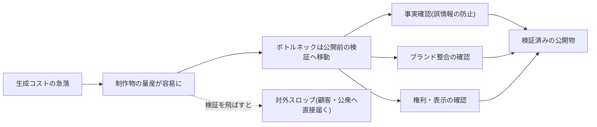
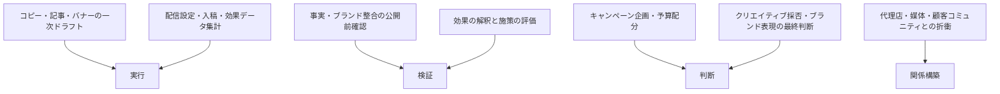

## 量産が容易になるほど、検証されないまま社外へ出るリスクが増す

マーケティングの中核業務——コピー、記事、バナー、動画、SNS投稿の制作——は、生成AIの得意領域とそのまま重なる。需要側の圧力も強い。サイバーエージェントが大手広告主のデジタル広告出稿担当者に実施した調査(2025年6月実施。広告事業者による調査である点には留意)では、クリエイティブ制作物の量は過半の企業で増え続けており、制作での生成AI活用はすでに過半に達し、数年内に制作の主体がAIに移るとの予想も過半を占めた[src-2026-065]。日本の大企業の職種別調査でも、隣接する「商品企画・サービス企画」は生成AIの活用率が高い職種群に入る[src-2026-053]。マーケティングにとって生成AIは「使うか否か」の問いをすでに超えている。

問題は、この部門の生成物が組織の外へ直接届くことである。経営企画のワークスロップ——よくできた仕事を装うが実質を欠くAI生成コンテンツ[src-2026-036]——は経営会議で止まるが、マーケティングのスロップは顧客と公衆に配信される。誤情報・誇大表現・ブランドトーンの逸脱は、社内の手戻りではなく対外的な信用毀損として返ってくる。生成のコストがほぼゼロに近づいた今、部門の能力を決めるのは生成量ではなく、公開前の検証——事実・ブランド整合・権利——をどれだけの速度と精度で回せるかである。この整理自体に出典はなく、生成コストの低下という前提からの推論である。なお対外発信のリスク管理は広報と分担する——広告・記事・SNS等の公開コンテンツは本ページ、報道対応・プレスリリース等の対外公表文は部門別ガイド「PR・広報のAIDX」が扱う。

生成コストの急落が検証をボトルネックに変える構造と、検証を飛ばした場合の出口を示す。

> 📊 **データボックス(2026-06時点)**
> - 近年クリエイティブ制作物が「増えた」企業: 69.0%、広告用動画に限ると86%。今後3年で「増える」予想: 59.0%。クリエイティブ制作での生成AI活用率: 54%(アイデア出し・コピーやテキストの自動生成が中心)。3年後にバナー・動画広告の制作主体がAIになるとの予想: 50〜58%(サイバーエージェント、大手広告主100社のデジタル広告出稿担当者対象、2025年6月実施。広告事業者による調査のため利益相反に留意)[src-2026-065]
> - マーケティング専門家は生産性44%向上・週平均11時間削減と自己申告(ZoomInfo、米国の営業・マーケティング職1,002名、2025年調査。ベンダーによる自社領域の自己申告ベース調査のため利益相反に留意)[src-2026-062]
> - 日本の大企業の職種別調査では「商品企画・サービス企画」が生成AI活用率の高い職種群に入る(日鉄ソリューションズ、大企業の正社員・役員3,757名、2025年9月実施。ITベンダーによる調査)[src-2026-053]

## 制作の「実行」とブランドの「判断」を分けて考える

業務分解の方法と4分類(判断/検証/実行/関係構築)の定義は、組織・人材編「業務分解×再配置プレイブック」で説明している。本ページではその4分類をマーケティングの主要業務に当てはめる。対応づけに出典はなく、業務内容からの整理である。

マーケティングの主要業務を4分類に対応づけると次のとおりである(委任の第一候補は制作・運用の「実行」に集まる)。

この部門の分解で最も重要な線引きは、**「制作」と「採否」を同じタスクとして扱わないこと**である。この線引きに出典はなく、業務の性質からの整理である。一次ドラフトの生成は手順が決まれば結果が安定する「実行」であり委任の第一候補だが、そのドラフトを世に出すか否か——ブランドとして何を語り、何を語らないかの選択——は責任を伴う「判断」であり、人間が保持する。同じ1本のバナーの中に、性質の異なるタスクが同居している。もう一つの特徴は、検証が三層(事実・ブランド・権利)あることだ。社内文書なら誤字脱字の確認で済む検証が、対外公開物では誤情報の防止・ブランドガイドラインとの整合・第三者の権利と広告表示ルールの確認という別種の検証に分かれ、それぞれ検証者が異なりうる。

### コンテンツ運用の分解ワークシート記入例(そのまま使える)

様式(5列)は組織・人材編「業務分解×再配置プレイブック」の業務分解ワークシートを使う。オウンドメディア・SNSの月次コンテンツ運用を分解した記入例を示す。記入内容は出典のない想定例である。

| タスク | 4分類 | 再配置 | 検証者 | 移行時期 |
|---|---|---|---|---|
| 過去実績・顧客データの集計とテーマ候補の整理 | 実行 | AI委任 | 担当者(原データと突合) | 今すぐ |
| 記事・SNS投稿・バナーコピーの一次ドラフト | 実行 | AI委任 | コンテンツ担当(全件確認のうえ次工程へ) | 今すぐ |
| 商品仕様・価格・数値・固有名詞のファクトチェック | 検証 | 人間保持 | 担当者(原典・商品部門と突合。AI出力同士の突合は不可) | 移行しない(誤情報は対外事故に直結) |
| ブランドガイドラインとの整合チェック | 検証 | 協働 | ブランド担当(AIが逸脱候補を指摘、人間が判定) | 1年以内(ガイドラインの構造化が前提) |
| 第三者の商標・肖像・著作物の混入、広告表示ルールの確認 | 検証 | 協働 | 担当者(疑義案件は法務へ。AIは候補抽出まで) | 1年以内 |
| クリエイティブの採否・公開可否の判断 | 判断 | 人間保持 | マーケ責任者(記名) | 移行しない(ブランド判断) |
| キャンペーン企画・予算配分 | 判断 | 協働(AIは案と根拠の整理まで) | マーケ責任者 | 1年以内 |
| 配信設定・入稿・効果レポートの集計 | 実行 | AI委任 | 担当者(設定値・件数の形式チェック) | 今すぐ |
| 代理店・媒体・インフルエンサーとの折衝 | 関係構築 | 人間保持 | — | 移行しない |

運用ルールは前掲プレイブックと同じで、「AI委任」で検証者欄が空白の行は委任禁止、「移行しない」には保持理由を必ず書く。

## AI影響の時間軸マップ(今/1年/3年)

以下は出典のある予測ではなく、準備の優先順位を決めるための作業仮説である。確定予測として読まないでほしい。

| 領域 | 今 | 1年 | 3年 |
|---|---|---|---|
| **コンテンツ制作** | コピー・記事・バナーの一次ドラフト委任はすでに実用域[src-2026-065] | 公開前検証フローを通した制作の組み込みが標準化。検証ログで委任範囲を更新 | 制作の主体は広くAIへ移る見通し(広告主側の予想も同方向[src-2026-065])。人間の価値は採否判断・ブランド判断・検証に集中 |
| **広告運用** | 入稿・レポーティングの委任 | 運用最適化の協働(AIが配分案、人間が承認)がフローに入る | 運用の自動化が拡大。予算とブランドの判断、媒体・代理店との関係は人間が保持 |
| **顧客分析・パーソナライズ** | 集計・セグメント整理の委任 | 顧客データの構造化が済んだ組織からセグメント仮説の協働へ | 顧客データ基盤を前提とした個別化の本格化。データ整備の有無がここで差になる |
| **コンテンツ計測・流入設計** | AI検索による検索流入の変化の把握[src-2026-068] | 検索流入依存の指標体系の見直し。AI経由の接点を含む計測の再設計 | AIが情報接点の入口になる前提でのコンテンツ戦略への組み替え |

3年後の姿は自動では来ない。制作主体がAIへ移るほど、自社にしか作れないもの——ブランドガイドラインの構造化された言語化、顧客データ、検証基準——が成果の差になる。この見通しに出典はないが、モデルの能力向上は競合にも等しく降る以上、差がつくのは自社固有の資産しかない。

> 📊 **データボックス(2026-06時点)**
> - AI検索(AI Overviews/対話型AI等)の影響を実感するコンテンツマーケティング実務者: B2B約61%・B2C約63%。最多の影響は「検索流入・訪問数が減少」。対策意向はB2B80.5%・B2C82.7%(日本SPセンター CM-SURVEY 2025、実務者65名、2025年11月〜2026年1月実施。小規模調査のため傾向の示唆として読む)[src-2026-068]

## いまやるべき準備 — 検証基準とデータを資産化する

4つに絞る。共通する考え方は、生成は買えるが検証基準は買えない、である(全社版の整理は AI-Ready編「AI-Readyの5資産」参照)。

- 【ブランド担当】【マーケ部門長】(今すぐ)**ブランドガイドラインの構造化**。トーン&マナー・禁止/要注意表現・表記ルール・ビジュアル規定が担当者の頭の中やPDFの中に眠ったままでは、AIによる一次チェックにも人間の検証にも使えない。道具: 下記の構造化最小様式。完了条件: 主要項目が判定可能な文章(良い例・悪い例つき)で文書化され、公開前検証で実際に参照されていること
- 【推進担当】(今すぐ)**公開前検証フローの文書化**。いま「なんとなくダブルチェック」で済ませている確認を、事実・ブランド・権利の三層に分けて書き出す。道具: 業務分解ワークシート+下記の公開前チェック5項目。完了条件: 主要チャネル1つについて全タスクに4分類・検証者が記入されていること
- 【マーケ部門長】(今すぐ〜1年以内)**顧客データの整備**。セグメント・配信・効果測定の協働は、顧客データが名寄せされ項目定義が揃っていることが前提である。整備を飛ばした個別化の自動化は接地しない(関連: アンチパターン集「データなき自動化」)。完了条件: 主要チャネルの顧客接点データが同一定義で結合・参照できること
- 【法務】【マーケ部門長】(規制確認は今すぐ着手・90日以内に完了、ポリシー策定は1年以内)**AI生成表示の規制確認と開示ポリシー**。先行タスクとして、AI生成コンテンツの表示義務に関する国内外の法令・行政指針(EU AI Act等)を法務が一次情報で確認する——本ページに規制の一次ソースが未収載のため、開示ポリシーの設計より先に期限を切って行う。そのうえで、消費者はAI生成かどうかの開示を広く求める一方、開示が広告への評価・購買意欲を下げるという実験結果がある——開示すれば安心、にはならない(下記・罠2)。どの顧客接点でAI生成を使い、どう開示するかを、確認した規制要件を踏まえて法務と決める。完了条件: ①90日以内に、自社の事業地域・媒体に適用される表示義務の有無が一次情報で確認・文書化されていること ②接点別の使用可否・開示要否の一覧表が存在し、公開前チェックから参照されていること

なお開示しておく——**AI生成コンテンツの表示義務に関する国内外の規制(法令・行政指針)の一次ソースは本ページ未収載**である(上記の期限付き先行タスクの対象)。開示ポリシーの設計は消費者調査・実験研究[src-2026-066][src-2026-067]から本サイトが導いた整理であって法令の要求事項の整理ではなく、法令上の要否は自社の法務部門の確認を経て運用すること。

## 人材再配置の方向 — 編集長機能の再建

役割の重心移動の宛先(検証者・設計者・例外処理者)の定義・任命要件・評価観点は組織・人材編「実行者から検証者・設計者へ」で定義しており、ここでは再定義しない。マーケティングへの当てはめは次のとおりで、出典のある整理ではない。

- **検証者**: 事実・ブランド・権利の公開前検証を記名で担う役割。実態は出版でいう編集長機能の再建である。コピーライター・コンテンツ担当の重心は、書く人からAIドラフトを採点し差し戻す人へ移る。検証ログ(様式は前掲ページのものを使う)で差し戻し的中率と見逃し重大度を測る
- **設計者**: チャネルごとに制作フローとAIの分担を決め、ブランドガイドラインを検証可能な形に構造化する役割。ブランドマネージャー・編集責任者が最有力の供給源
- **例外処理者**: 炎上・批判への対応、非定型のクリエイティブ判断、代理店・媒体・インフルエンサーとの関係構築を担う役割。AIが進むほど、この関係資本の比重は上がる

クリエイティブの発想そのものはどうなるか。発想の出発点(アイデアの量出し)は協働に移る一方、「ブランドとして何を語るか」の選択は3役割に解消されない判断としてマーケ責任者が保持し続ける——これは出典のある予測ではなく、本ページの見通しである。また、部門別ガイド「人事のAIDX」で説明する「主管部門の多重当事者性」(自部門の業務変革と全社機能の変革を同時に負う)のマーケティングでの現れ方として、この部門は自部門の業務変革に加え、全部門がAIで対外発信物を作る時代の全社ブランド基準の主管という当事者性を負う——構造化したガイドラインは自部門の検証基準であると同時に全社の検証基準になる。

## この部門特有の罠

**罠1: ワークスロップ工場の出口が社外に向く。** 検証なきAI生成物の流通という構造(症状と脱出方法はアンチパターン集「ワークスロップ工場」)は全部門共通だが、マーケティングでは被害の宛先が同僚ではなく顧客と公衆になる。社内スロップの修正コストは下流の部門が払うが、対外スロップのコストはブランドへの信頼で払う。たとえば改定前の旧価格を載せたバナーがそのまま配信されれば、社内なら差し替えで済む誤りが、配信先では訂正と謝罪を要する事故になる。誤った商品情報、根拠のない訴求、トーンの崩れた発信は、1本でも部門のAI活用全体を巻き戻しうる(この損害構造の実証データはなく、推論である)。工場化の引き金は指標である。生成本数・公開本数・更新頻度を成果指標にした瞬間、量産は合理的行動になる。指標は検証済み品質(差し戻し率・公開後の訂正件数)とブランド整合、そして最終成果に置く。

**罠2: 「AI生成と表示すれば安全」という誤解(透明性のパラドックス)。** 消費者調査では、AI生成画像かどうかを知りたいという開示要求は消費者の大半に及ぶ[src-2026-066]。一方、実験研究では、同一の広告でも「AI生成」と表示すると評価と購買意欲が下がることが示されており、AI自体を信頼する消費者は少数にとどまる[src-2026-067]。つまり開示は求められるが、開示だけでは信頼は買えない。ここから導かれる運用は、表示を免罪符にした全面利用ではなく、**どの接点でAI生成を使うか自体の設計**である——効果が文脈依存である(革新的な製品では受容され、従来型では拒否反応が強い)という知見[src-2026-067]は、接点別の使い分け表を作る根拠になる。信頼が問われる接点(企業の顔になるビジュアル、実在性が価値の事例・お客様の声)では人間制作・実写を残す判断も、コスト増ではなくブランド投資である——というのが本ページの考え方である。

**罠3: 生成だけ進み、データと計測が旧いまま止まる。** 制作の効率化に投資が偏り、顧客データの整備とコンテンツ計測の再設計が置き去りになる形である。顧客データが未整備のままのパーソナライズ自動化は接地せず(関連: アンチパターン集「データなき自動化」)、検索流入を前提にした量産型コンテンツ戦略は、AI検索が情報接点の入口を変えつつある環境では計測ごと陳腐化していく[src-2026-068]。各自がバラバラにツールを使う個人時短で止まる形(関連: アンチパターン集「コパイロット一斉配布」)も含め、脱出の判定には原理編「複利の法則」の複利テスト3問を使う。効果測定の集計・解釈ドラフトの検証は業務パターン「データ分析の一次集計と解釈ドラフト」を参照。

> 📊 **データボックス(2026-06時点)**
> - 消費者の90%が、画像がAI生成かどうかを知りたいと回答。98%が「本物(authentic)の画像・動画が信頼の確立に重要」と同意(Getty Images VisualGPS、25か国・延べ3万人超、データ収集は2022年7月〜2023年9月・2024年4月発表。ストックフォト事業者による調査のため利益相反に留意。収集時期が古いため、次回の回転リサーチで新しい消費者調査への入れ替え予定)[src-2026-066]
> - 同一広告でも「AI生成」と表示すると「より自然でなく、有用性が低い」と評価され、広告への態度・購買意欲が低下。AI自体を信頼する回答者は約20%。効果は文脈依存で、革新的・ハイテク製品では受容され、従来型製品では拒否反応が強まる(NIM=Nuremberg Institute for Market Decisions、米英独各1,000名の代表調査+ドイツでのラベル操作実験、2024〜2025年の研究)[src-2026-067]

## 公開前チェック5項目とブランドガイドライン構造化様式(そのまま使える)

そのまま部門ルールの叩き台に使える公開前チェック5項目を示す。この様式に出典はなく、叩き台として作成したものである。検証ログの様式は組織・人材編「実行者から検証者・設計者へ」の最小様式をそのまま使い、部門で別様式を作らない。

1. **記名検証**: AI下書きを使った公開物は、制作者とは別の検証者1名をコンテンツごとに記名する。検証者欄が空白のものは公開しない
2. **事実の全件突合**: 商品仕様・価格・数値・固有名詞・引用は、検証者が原典(商品部門の正式資料・公式発表)と全件突合する。AIの出力同士の突合は突合と認めない
3. **ブランド整合**: 構造化したガイドライン(下記様式)の禁止・要注意表現とトーン基準に照らす。AIによる一次チェックを使ってよいが、判定は人間が行う
4. **権利・表示**: 第三者の商標・肖像・著作物の混入と、広告表示に関する法令・媒体規約上の確認を行い、疑義案件は法務の確認ルートへ回す
5. **開示判定**: AI生成の開示要否を、接点別の開示ポリシー(準備節)に従って判定し、判定結果を記録する

ブランドガイドライン構造化の最小様式(出典のない叩き台。「AIと検証者が同じ基準を参照できる形」が目的。(例)行は架空の記入例):

| 項目 | 記述内容 | 検証での使い方 |
|---|---|---|
| トーン&マナー | 語り口・人称・敬体/常体・温度感を文章で定義 | AI一次チェックのプロンプト素材+人間の判定基準 |
| 禁止・要注意表現 | 使わない語・競合言及・効果効能の断定など、理由つきの一覧 | 機械的な照合(全件) |
| (例)禁止・要注意表現 | 効果効能の断定(「必ず〜できる」)・根拠資料のない優位性訴求は使用不可。競合名への言及は法務確認を経たもののみ。理由: 誇大表示・優良誤認の防止 | 機械的な照合(全件)で候補を検出し、検証者が判定 |
| 表記ルール | 商品名・サービス名の正式表記、数字・単位の書式 | 機械的な照合(全件) |
| ビジュアル規定 | ロゴ・色・フォント・写真のトーン、AI生成ビジュアルの使用可否(接点別) | 制作時の制約条件+公開前確認 |
| 根拠つき事例 | 過去の「良い例・悪い例」と、なぜ良い/悪いかの理由 | 検証者の判定の校正材料。差し戻し理由の蓄積で増やす |
| (例)根拠つき事例 | 良い例: 「設定は3ステップで完了します」(検証済みの仕様のみで簡潔)/悪い例: 「誰でも一瞬で完璧に使いこなせます」(根拠のない断定と誇張)。理由を必ず1行添える | 検証者の差し戻し判定の校正材料 |

### 入稿物(代理店・制作会社の制作物)への適用と契約への落とし込み

日本の実務では制作の主力が代理店・制作会社側にあることが多く、社内だけ検証を固めても、入稿物が無検証では穴は塞がらない——出典のある調査ではないが、発注実務の構造からそう言える。公開前チェック5項目は入稿物にもそのまま適用し(検証者は発注側=自社の担当)、あわせて委託契約に次の要求事項を入れる。条項化の主管・法的レビューは法務である(条項の整備は部門別ガイド「法務のAIDX」の「外部委託先・ベンダーがAIを使う場合の開示義務・検証責任の契約条項」が扱う。以下はマーケ部門が法務へ依頼する際の要求仕様の叩き台で、出典のない文例である):

> **契約要求事項の文例**: 「受託者は、本契約に基づく制作物の制作に生成AIを利用する場合、その利用範囲(利用工程・対象物)を委託者に書面で開示する。受託者は、制作物について第三者の商標・肖像・著作物に関する権利確認を行ったうえで納品し、委託者が定める公開前チェックに必要な根拠資料(数値・固有名詞の出所、権利処理の記録)を制作物に添付する。」

## 体制と費用の目安

2レンジで示す。以下の体制・費用・期間に出典はなく、実務上の経験則である。**中堅(数百名規模、マーケ担当3〜10名)**: 対象は主要チャネル1つ(オウンドメディアまたはSNSを推奨)、兼務2〜3名・90日・マーケ部門長決裁。既存の全社契約ツールの範囲なら追加投資ゼロ〜数十万円で始められる。**大企業(数千〜数万名規模、マーケ・宣伝部門数十名以上+代理店)**: 先行1ブランド×1チャネルでパイロット90日(兼務2〜3名+推進専任0.5〜1名)→ブランド横断展開90〜180日の2段階、決裁は担当役員(CMO相当)。大企業では制作の相当部分が代理店・制作会社に外在するため、外部パートナーがAIを使う場合の開示義務・検証責任の契約条項の整備(文例は上記。条項化の主管は部門別ガイド「法務のAIDX」)を並走させる——社内だけ検証を固めても、入稿物の大半が無検証では穴は塞がらない。どちらのレンジでも、経営が承認する判断は「パイロット予算」と「成果指標の張り替え(生成量系→検証済み品質・ブランド整合系)」の2つに絞る。

## 最初の90日

- 【マーケ部門長】【推進担当】(今すぐ)主要チャネル1つの業務を分解する。道具: 組織・人材編「業務分解×再配置プレイブック」のワークシート+本ページの記入例。完了条件: 全タスクに4分類・再配置・検証者が記入され、実際に制作を担う担当者本人のレビューを通っていること
- 【マーケ部門長】(今すぐ)公開前チェック5項目を発行し、「AI委任・今すぐ」のタスクから委任を開始する。道具: 本ページの5項目+検証ログ様式(組織・人材編「実行者から検証者・設計者へ」のものを使う)。完了条件: 検証者欄が空白の公開物がゼロになり、検証ログの記録が始まっていること
- 【ブランド担当】(今すぐ着手、90日目に初版)ブランドガイドラインを構造化する。道具: 本ページの構造化最小様式+過去の差し戻し・修正事例。完了条件: 主要項目の初版が文書化され、公開前チェックの項目3で実際に参照されていること
- 【法務】【推進担当】(今すぐ着手、90日以内に完了)AI生成表示の規制一次ソースを確認する。道具: 国内外の法令・行政指針(EU AI Act等)の一次情報の確認(法務主導)。完了条件: 自社の事業地域・媒体に適用される表示義務の有無の確認結果が文書化され、開示ポリシー設計の前提として共有されていること
- 【マーケ部門長】【法務】(規制確認の完了後、1年以内)接点別のAI生成使用可否・開示要否の一覧表を作る。道具: 透明性のパラドックスの知見[src-2026-066][src-2026-067]+先行タスクの規制確認結果。完了条件: 一覧表が公開前チェックの項目5から参照され、四半期ごとの見直し担当が決まっていること
- 【CMO】(1年以内)成果指標を張り替える。生成本数・公開本数系の指標を、検証済み品質(差し戻し率・公開後訂正件数)・ブランド整合・最終成果系へ更新する。道具: 検証ログの月次集計。完了条件: 部門と代理店の評価項目に反映され、量産系の指標が単独でKPIになっていないこと
- 【CMO】(能力向上を待て)クリエイティブ採否・ブランド表現の最終判断の委任と、検証なしの全自動公開。対外事故は一件で部門のAI活用全体を巻き戻す。検証ログで品質が四半期単位で実測されてから委任範囲を再判定する

**この主張が崩れる条件**: 公開前の人間検証を省いたAI生成コンテンツの大量配信が、ブランド指標・顧客の信頼・最終成果を毀損せず、人間検証付き運用と同等以上の成果を持続させた事例が、ベンダー発以外の複数の独立した調査で確認されたとき——そのとき検証は全件からサンプリングへ緩和してよい。

<!--
執筆メモ(ソースが薄い箇所・レビュー重点ポイント。2026-06-11 第4陣レビュー対応で改稿・本メモも更新):
- ページの結論(量産容易→検証ボトルネック→対外スロップ)は構造主張であり、根拠は src-2026-036(workslop、high)+src-2026-065(制作量増・活用過半、medium・広告事業者発)の組み合わせ。第4陣レビュー対応で「全部門で最も容易/対外リスク最大」等の出典なき部門間最上級をsummary・見出し・本文から除去し構造記述化。「対外リスク」の王座はprと調停済み——棲み分け(広告・記事・SNS等の公開コンテンツ=本ページ/報道対応・対外公表文=pr)を結論節に明記。
- 業務分解マップ・ワークシート記入例・時間軸マップ・3役割の翻訳(編集長機能)・公開前チェック5項目・ブランドガイドライン構造化様式(記入例行含む)・代理店向け契約要求事項の文例・規模感2レンジ・90日はすべて出典のない編集部の見立て(マーカー明示済み)。
- src-2026-065(サイバーエージェント)・src-2026-062(ZoomInfo)・src-2026-066(Getty)はベンダー・事業者発のmediumソース。いずれも本文・データボックスで調査主体と利益相反を開示し、数値はデータボックスに隔離。テーゼは単独で背負わせていない。Getty[066]の「90%」は変換基準どおり本文「大半」に修正済み(9割ちょうどの境界は弱い側)。データ収集時期(2022-07〜2023-09)と次回回転での入れ替え予定をデータボックスに明記。
- 透明性のパラドックス(罠2)は src-2026-067(NIM、high)を主、src-2026-066(Getty、medium)を従とする2源構成。NIMはpublished不明のため「2024〜2025年の研究」と表記。**review_by(2026-12-11)時に原典の版・公開日を再確認する(予約済み・第4陣指摘)**。
- AI生成コンテンツの表示義務に関する規制(EU AI Act等)の一次ソースは未収載。第4陣レビュー対応で、規制一次ソースの確認を開示ポリシー策定に先行する期限付きタスク(90日以内・法務主導)に組み替え、本文で未収載を開示。/aidx-research で収載後に開示ポリシー節を「法令+見立て」へ格上げする。
- 代理店・委託先のAI利用検証は第4陣指摘5で実行素材に昇格(入稿物への公開前チェック適用+契約要求事項の文例)。条項化の主管は legal(系統2-③)で、本ページの文例は法務への要求仕様の叩き台——変種の新造ではない旨を本文とフレーム台帳の両方に明記。
- src-2026-068はn=65の小規模調査。データボックスに小規模注記を入れ、本文は「変化の把握」「計測の再設計」という構造記述に留めた。
- src-2026-032(MIT 95%批判)はmarketingでgrepにかかるが内容は失敗率統計の方法論批判でありこのページでは未使用。
- 多重当事者性は正本(departments/hr)参照+「全社ブランド基準の主管」の対応1行のみ(変種定義なし)。4分類・3役割・検証ログ・ワークシート・複利テストはすべて正本参照のみで再定義していない(フレーム台帳照合済み)。台帳登録済みの本ページ固有実行素材: 「公開前チェック5項目」「ブランドガイドライン構造化様式」「代理店・委託先AI利用の開示・検証の契約要求事項(文例)」。
2026-06-12 文体改修: 格言調見出し平易化・内部用語排除・見立て定型句を自然文に置換
-->
