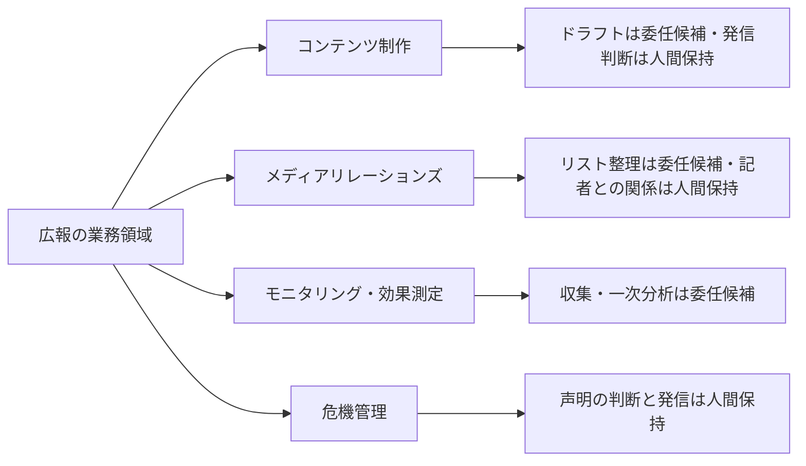
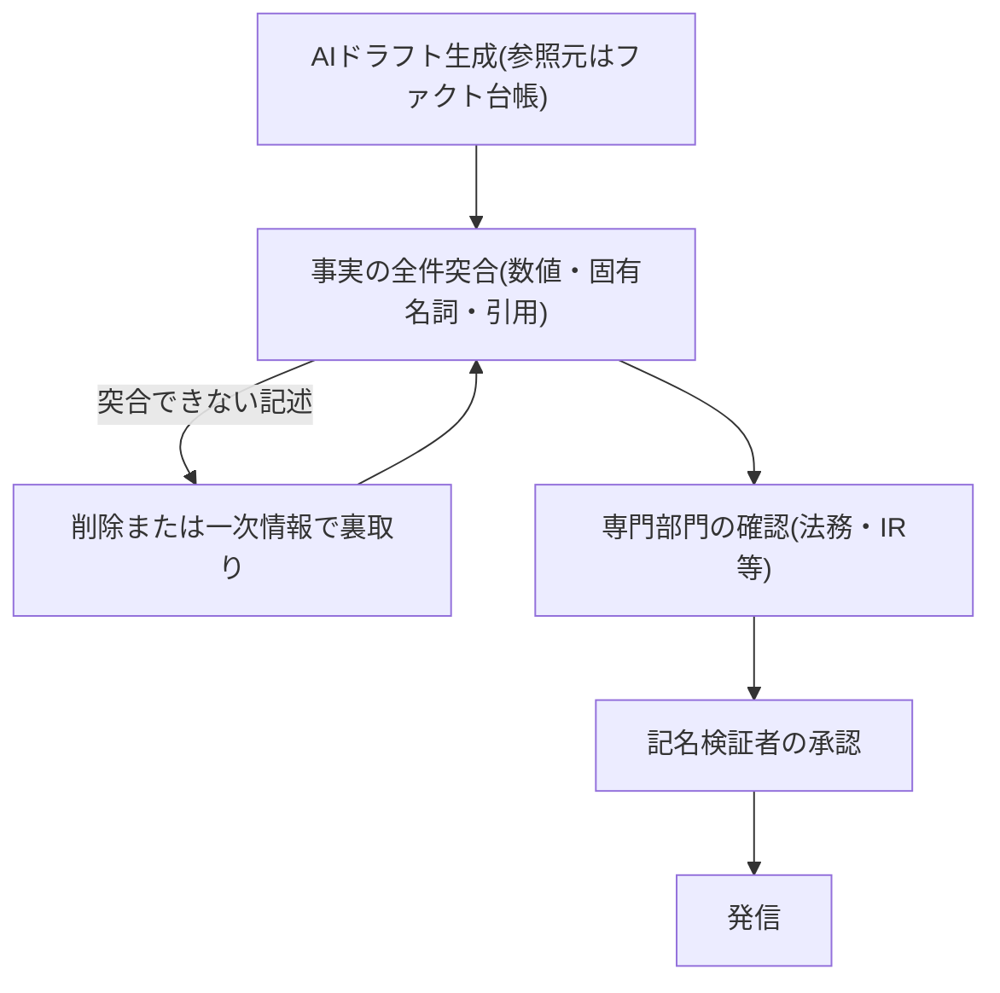

> 💡 **ひとことで言うと**
> 広報の文章は社外に出た瞬間に取り消せず、間違いは訂正そのものがニュースになる。AIに下書きを任せるのはよいが、印刷前の校了印にあたる「人による事実確認と署名」を必ず最後に残す話である。

## 広報の成果物はほぼすべて高リスク区分に乗る

広報のAIDXの出発点は、利用率でも効率化余地でもなく、リスク区分の確認である。検証義務化ライン(定義は組織・人材編「推進体制とガバナンスの設計図」)の高リスク区分——誤りが顧客・お金・法令に直接届く利用——の典型例の筆頭は「対外公表文」である。プレスリリース・公式SNS・声明・FAQ(よくある質問集)という広報の成果物は、ほぼすべてこれに該当する。経理の誤りは締めで直せるし、社内資料の誤りは差し戻せる。だが発信された誤りは取り消せず、訂正自体が二次報道の材料になる。広報は、誤り1件あたりの損害が社外(レピュテーション=評判)へ最も直接出る部門の一つといえる。したがって本ページの原則は一貫している——**ドラフト(下書き)は委任してよい。発信判断と事実への責任は、全件・記名で人間が持つ**。なお対外発信のリスク管理はマーケティングと分担する。広告・記事・SNS等の公開コンテンツは部門別ガイド「マーケティングのAIDX」、報道対応・プレスリリース・声明等の対外公表文は本ページが扱う。

これは「広報はAIを使うな」ではない。米国の広報担当者調査(PRプラットフォームベンダーMuck Rackによる自社領域の調査である点に留意)では生成AI利用は大半に達した一方、AI利用ポリシーを持たない企業が過半と報告されている[src-2026-086]。国内でもPR業界団体の調査が、重点課題への「生成AIの活用」の初登場を報告している[src-2026-085]。ただし回答62社の単一調査であり、業界全体の実態を確定させる証拠ではなく、方向を示す示唆として読む。利用は先行し、統治が遅れている。この間隙を埋める設計図が本ページである。

さらに広報の守備範囲は自部門の道具の話に閉じない。カナダの審判例がある。自社サイトのチャットボット(自動応答プログラム)が運賃を誤案内した件で、「チャットボットもウェブサイトの一部であり、その情報に企業が静的ページと同様の責任を負う」と判断され、賠償が命じられた(Moffatt v. Air Canada, 2024 BCCRT 149。大手法律事務所の解説による)[src-2026-087]。AIの発言は会社の公式発信である。この原則のもとでは、各部門が設置する自動応答接点のすべてがレピュテーションの発生源になる。この構造は、主管部門が自部門の変革と全社機能の両方を背負う「多重当事者性」(詳しくは部門別ガイド「人事のAIDX」)の広報版である。広報では「自部門の業務変革 × 全社の対外発信チャネル(自動応答接点を含む)のレピュテーション管理への関与」の二重の当事者性として現れる。

> 📊 **データボックス(2026-06時点)**
> - PR業の重点課題で「生成AIの活用」が初登場3位(48%)。今後ニーズが増えると予想される業務の筆頭は「危機管理」関連。「情報収集」「効果測定」等のインテリジェンス活動の取り扱いが前回調査から著しく伸びた(日本パブリックリレーションズ協会 2025年PR業実態調査、2025年3月実施、PR業221社対象・回答62社=回収率28.1%のため業界全体への一般化には幅がある)[src-2026-085]
> - PR担当者の4人に3人が生成AIを業務利用(初回2023年調査からほぼ3倍化)。プレスリリース・ピッチ作成への利用は過半。一方55%が「自社にAI利用ポリシーがない」と回答(Muck Rack「The State of AI in PR 2025」、2024年11〜12月実施、PR・広報従事者1,013名。米国中心・PRプラットフォームベンダーによる調査)[src-2026-086]

## 業務の分解マップ — ドラフトと発信判断を切り離す

業務分解の方法と4分類(判断/検証/実行/関係構築)の定義は組織・人材編「業務分解×再配置プレイブック」で説明しており、ここでは再定義しない。広報の4領域(コンテンツ制作/メディアリレーションズ=報道機関との関係づくり/モニタリング=報道・世論の観測と効果測定/危機管理)に当てはめたときの大づかみの見取り図を示す。対応づけは出典のある分類ではなく、本ページでの整理である。

広報の業務領域ごとの委任候補と人間保持の見取り図である(詳細はワークシートで分解する)。

広報業務の特徴は2つある。第一に、**「実行」(書く)と「判断」(出す)の距離が極端に近い**。リリースのドラフトは実行だが、その1文が「会社として何を公式に認めるか」を確定させる。書く工程をAIに委任しても、出す判断の重さは少しも軽くならない。むしろドラフトが量産されるほど、発信判断と事実検証が全体の速度を決める工程として表に出てくる。第二に、**事実の正否を会社の外側が採点する**。社内文書の誤りは社内で見つかるが、リリースの誤りは記者・投資家・顧客が見つけ、指摘はそのまま公開される。検証を後置できない理由がここにある。

### プレスリリース業務の分解ワークシート記入例(そのまま使える)

様式(5列)は組織・人材編「業務分解×再配置プレイブック」の業務分解ワークシートをそのまま使う。プレスリリース1本の流れを分解した記入例を示す。記入内容は出典に基づくものではなく、本ページで作成した例である。

この表の見方: 行はリリース作成のタスク、列は仕分けの結果で、まず「再配置」列(AIに任せるか人が持つか)を見る。

| タスク | 4分類 | 再配置 | 検証者 | 移行時期 |
|---|---|---|---|---|
| リリース本文の一次ドラフト(決裁済み事実の文章化) | 実行 | AI委任 | 広報担当(事実・数値を原資料と全件突合) | 今すぐ |
| 翻訳・媒体別の体裁調整・要約版作成 | 実行 | AI委任 | 広報担当(用語・トーンの確認。翻訳の検証手順は業務パターン「翻訳・多言語化の生成・検証フロー」) | 今すぐ |
| 数値・固有名詞・引用の事実突合 | 検証 | 人間保持(AIは矛盾候補の指摘まで) | 起案者と別の記名検証者 | 移行しない(検証義務化ライン「高」) |
| 経営者・関係者コメントの作成 | 判断 | 人間保持 | 本人(実発言の確認) | 移行しない(実在人物の発言をAIに生成させない) |
| 発信可否・タイミングの判断 | 判断 | 人間保持 | 広報責任者 | 移行しない |
| 記者への個別ピッチ(売り込み)・問い合わせ対応 | 関係構築 | 人間保持(AIは記者の関心領域の整理まで) | — | 移行しない |
| 掲載結果・論調の収集と一次整理 | 実行 | AI委任 | 担当者(重要案件は原記事に当たる) | 今すぐ |

運用ルールは元のワークシートと同じである——「AI委任」で検証者欄が空白の行は委任禁止、「移行しない」には保持理由必須。SNS投稿・オウンドメディア(自社運営媒体)の記事も同じ様式で分解できる。

## AI影響の時間軸マップ(今/1年/3年)

以下の見通しに出典はない。確定予測ではなく、準備の優先順位を決めるための作業仮説として使う。

この表の見方: 行は広報の業務領域、列は時期で、左から右へ委任の範囲が広がる。自分の担当領域の行から読むとよい。

| 領域 | 今 | 1年 | 3年 |
|---|---|---|---|
| **コンテンツ制作(リリース・SNS・社内報)** | 一次ドラフト・翻訳・媒体別展開の委任。発信前の全件・記名検証を同時に制度化 | 検証ログが蓄積され、差し戻し基準が部門の品質基準書に育つ。外部委託先のAI利用も検証ラインに乗せる | ドラフト工程はほぼ委任。広報の主業務は事実検証・発信判断・トーンの統括に移る |
| **メディアリレーションズ** | 記者リスト・過去報道の整理の委任。ピッチ文の下書き補助 | 記者の関心領域分析との協働。関係構築そのものは人間保持のまま | 量的な情報配信の価値が下がり、人間同士の関係と独自情報の価値が相対的に上がる |
| **モニタリング・効果測定** | ソーシャルリスニング(SNS上の声の収集)・記事クリッピングの一次整理の委任 | 論調分析・報告書作成の協働が定例化(情報収集・分析活動の需要増[src-2026-085]と整合) | 常時監視と早期警報は協働運用。検知後の対応判断は人間保持 |
| **危機管理** | 委任しない。平時の想定問答・シナリオ訓練の下書き補助まで | リスク検知の早期警報との協働開始。声明の判断・発信は人間保持のまま | 検知は協働、対応は人間——の分業が定着。声明自動生成は「この部門特有の罠」罠3の3条件が解消されない限り委任しない領域(出典のない見通し) |

## いまやるべき準備

3つに絞る。いずれも「最初の90日」に展開する。

- 【広報部長】(今すぐ)**発信前ファクトチェック(事実確認)の制度化**。AIドラフト解禁と同じ日に、全件・記名の検証工程を発信フローに常設する。順序を逆にしない——ドラフトの量産が先に始まると、検証が「ボトルネック扱い」されて省略圧力がかかる。道具: 下記の発信前ファクトチェックリスト+組織・人材編「実行者から検証者・設計者へ」の検証ログ最小様式。完了条件: 直近の発信物全件に記名検証者と突合記録が存在すること
- 【広報担当役員】【広報部長】(今すぐ)**AI利用の開示ポリシーを先に持つ**。ポリシー未整備が過半という調査結果[src-2026-086]は、裏返せば「方針を持ち、問われたら誠実に説明できる」こと自体が信頼の差別化になるということでもある。隠して使い、後から指摘されるのが最悪の経路になる。道具: 下記の開示ポリシー文例3か条。入力可否・相談先は全社の暫定ガードレール(用語集「ガードレール」=やってよい範囲を定める社内ルール。定義は組織・人材編「推進体制とガバナンスの設計図」)に従い、部門で別物を作らない。完了条件: 広報部員と外部委託先(PR会社・制作会社)に適用範囲が周知され、社外から問われたときの説明文が用意されていること
- 【推進担当】(今すぐ〜1年以内)**正データ集(ファクト台帳)の整備**。AIドラフトの誤りは、参照すべき正しい事実が一箇所にまとまっていないことから生まれることが多い。会社概要・沿革・数値・役員経歴・表記ルールの「公式に正しい版」を1つに集約し、ドラフト生成の参照元と検証の突合先を同じ台帳にする。完了条件: 発信物の事実突合が個人の記憶ではなく台帳との照合で実行されていること

あわせて1年以内に、**対外AI接点の棚卸し**に着手する。チャットボット・自動応答・AI生成FAQは設置部門がばらばらでも、誤案内の責任は会社に帰属する[src-2026-087]。レピュテーションの損害は、広報が受け止めることになる。接点×所管部門×正データとの突合状況の台帳を作り、広報がレピュテーション観点のレビューに入る(接点自体の所管は各部門・情報システムのまま。広報がすべてを運用する話ではない)。あわせて、自社が設置した接点の外側——外部プラットフォームのAI要約・AI検索が自社について語る内容——もモニタリング対象に加える(自組織に関する誤情報がAI経由で配信された国内実例は「この部門特有の罠」罠3を参照)[src-2026-089]。

## 人材再配置の方向

役割の重心移動の宛先(用語集「検証者」・設計者・例外処理者)の定義・任命要件・評価観点は組織・人材編「実行者から検証者・設計者へ」で説明しており、ここでは再定義しない。広報への当てはめは次のとおりである。

- **検証者**: 発信物の事実・整合の最終責任。数値・固有名詞・引用の原資料との突合、過去発信との矛盾検出。広報では「社外に出る前の最後の人間」であり、3役割の中で最も重い。検証者の記名は処罰のためではなく、責任の所在を曖昧にしないためである
- **設計者**: 発信工程のどこを委任しどこに人を残すかの決定、開示ポリシーと検証基準の設計、外部委託先への要求水準の設定。ドラフト速度が上がるほど、工程設計の巧拙が部門の品質を決める
- **例外処理者**: 記者からの突っ込んだ問い合わせ、危機対応、経営トップの発信支援。定型化できない対応こそ広報の存在価値であり、委任で浮いた時間の振り向け先はここになる

メディアとの関係構築(4分類の「関係構築」)は再配置の対象外として人間が保持する。記者との信頼は個人と個人の間に蓄積する資産であり、AIに委任した瞬間に消滅する種類のものである。

## この部門特有の罠

**罠1: スピード優先の未検証発信。** AIはドラフトを数分で出すため、「すぐ出せるのに検証で寝かせるのか」という圧力が生まれる。だが広報の律速工程はもともと書く速さではなく、事実確認と社内確認である。ドラフトの高速化を発信の高速化と取り違え、検証を「形式的な一読」に縮めた組織から誤発信が出る。アンチパターン集「ワークスロップ工場」が示す検証コストの受け手への転嫁が、社内ではなく社外——記者・顧客・投資家——に向かう構図であり、損害の桁が変わる。脱出は検証工程の制度化(発信前チェックリスト+記名)であり、ドラフト禁止ではない。

**罠2: AI生成と気づかれたときの信頼コスト。** 検証なきAI生成物の受け手は、内容だけでなく送り手その人の創造性・能力・信頼性を低く評価する。これが用語集「ワークスロップ」を巡る研究の核心の発見である[src-2026-036]。社内ならば送り手個人の評判の問題で済むが、広報の場合は受け手が社外であり、低評価はブランドそのものに付く。テンプレート感のあるお詫び文、どの会社にも言える中身のないリリース、明らかに機械的なSNS返信——「雑に作った」と受け取られた瞬間に、伝えたい中身ではなく作り方が話題になる。これは想定ではなく国内で観測済みの構図である。日本航空(JAL)は2025年8月、新クレジットカード公式サイトの生成AI画像の不自然さをSNSで指摘され、謝罪・差し替えに至った。その訂正対応自体が、複数メディアの報道対象になった(J-CASTニュース等の報道による)[src-2026-088]。新商品の発表が、AI生成物の検証不足の話題に置き換わった実例である。予防は2つ: 開示ポリシーによる誠実性の確保(隠してバレるのが最悪)と、固有の事実・固有の言葉を人間が足す編集工程である。

> 📊 **データボックス(2026-06時点)**
> - 検証なきAI生成文書(workslop)の受け手の約半数が送り手を「創造性・能力が低い」とみなし、42%が「信頼できない」と評価。受け手の53%が不快、22%が侮辱されたと感じたと回答(BetterUp Labs × Stanford Social Media Lab、米国フルタイムデスクワーカー1,150人、2025年8〜9月集計。社内の同僚間の評価であり、社外ステークホルダーへの外挿は出典のない解釈である)[src-2026-036]

**罠3: 危機管理をAIで回そうとする。** 危機管理需要は増えるとPR業界の調査も示唆している[src-2026-085]が、需要の増加と委任可能性は別物である。危機時は、①事実が流動的で確定情報がない(AIの参照すべき正データが存在しない)、②過去パターンの「もっともらしい」謝罪文がテンプレ感として炎上を増幅する、③声明の一語一語が法的責任と経営判断に直結する——の3条件が重なり、AIが最も不得意な状況になる。この3条件の整理自体に出典はない。前段の「AI起因の誤発信が危機の引き金になる」こと自体は、国内ですでに観測事実である。自社の対外公表物のAI生成画像が指摘を受け、謝罪・差し替えに至った例がある[src-2026-088]。加えて、大手SNSプラットフォームのAI要約機能が他自治体の施策を京都市のものと誤って配信し、市が公式の注意喚起と削除依頼の対応に追われた例も報じられている(ITmedia等の報道による)[src-2026-089]。後者は、自社がAIを一切使っていなくても、外部のAIが自社についての誤情報を「公式の顔」で発信しうることを示す。危機管理の監視対象に「自社に関するAI生成情報」を加える根拠である。AIの持ち場は平時にある: 想定問答の網羅性チェック、シナリオ訓練の素材生成、検知の早期警報。危機が起きてからAIに頼る組織は、平時に準備しなかった組織である。なお「危機が怖いから広報のAI利用を全面禁止する」は逆方向の同じ誤りであり、利用を見えなくする(用語集「シャドーAI」化する)だけである(関連: アンチパターン集「禁止すれば安全」)。

## 発信前ファクトチェックリストと開示ポリシー文例(そのまま使える)

**発信前ファクトチェックリスト(5項目)。** そのまま発信フローの必須ゲートに使える。この様式自体に出典はない。対象はプレスリリース・声明等の対外公表文であり、マーケティングの「公開前チェック5項目」(対象は広告・コンテンツ等の公開物)とは対象文書が異なる別物である(それぞれの部門ページで定義している)。検証ログの様式は組織・人材編「実行者から検証者・設計者へ」の最小様式をそのまま使い、部門で別様式を作らない。

1. **数値・日付・固有名詞の全件突合**: 原資料(決裁文書・公表済み資料・ファクト台帳)と突合したか。AIの出力同士の突合は突合と認めない
2. **引用・コメントの本人確認**: 実在の人物の発言は本人の確認を得た実発言か。AIが生成した発言が紛れていないか
3. **過去発信との整合**: 自社サイト・過去リリース・自動応答接点の案内と矛盾しないか
4. **専門部門の確認**: 業績・契約・係争・製品安全に触れる記述は法務・IR(投資家向け広報)・所管部門の確認を経たか
5. **記名と記録**: 起案者と別の検証者が記名し、何と突合したかの記録を残したか

発信前の検証ゲートの流れを示す(検証義務化ライン「高」のプレスリリース工程への展開)。

**AI利用の開示ポリシー文例(3か条)。** ステークホルダー(顧客・株主・取引先などの利害関係者)への誠実性の宣言として、そのまま叩き台に使える(法的要求事項の整理ではないため、運用前に法務の確認を経ること)。

> 1. 当社の対外発信物におけるAIの利用は、下書き・調査・翻訳・体裁調整の補助に限る。事実の確認と最終的な文責は、記名された担当者が負う。AI利用の有無と範囲について社外から問われた場合、誠実に説明する。
> 2. 実在の人物の発言・コメントをAIに生成させない。掲載するコメントは本人の確認を経た実際の発言に限る。
> 3. 報道用の写真・映像にAI生成・AI加工素材を使う場合は、生成・加工である旨を明示する。明示できない用途には使わない。

適用範囲には外部委託先(PR会社・制作会社)を含める。委託先のAI利用物も、自社の検証ラインを通ってから発信する。

## 体制と費用の目安

以下の目安に出典はなく、実務上の経験則である。**中堅(数百名規模、広報1〜3名・総務等と兼務)**: プレスリリース工程1本の分解+チェックリスト運用から開始。兼務1〜2名・90日・広報部長(または総務部長)決裁。既存の全社契約ツールの範囲なら追加投資ほぼゼロ〜数十万円。開示ポリシーは文例の当てはめ+法務確認で足り、専任は不要。人繰りの試算: 広報が実質1名のときは「起案者と別の記名検証者」を部門内で確保できないため、総務部長・法務担当など隣接職務者を検証者にあらかじめ指名しておく。発信が月2〜5本なら検証は1本30〜60分、検証者側の負担は月数時間で運用は成立する見込みである。**大企業(数千〜数万名規模、広報部門10名以上・グループ広報あり)**: リリース・SNS・モニタリングの2〜3チームで並走(各チーム兼務2〜3名+推進兼任0.5〜1名)、90日のパイロット→グループ会社・委託先への展開90〜180日の2段階。開示ポリシーは法務・IRのレビューを通し、決裁は広報担当役員(CCO相当)。対外AI接点の棚卸しは情報システム・各事業部門との横断作業になるため、大企業では推進部門との共同プロジェクト(四半期1巡)として設計する。効果側の目安(この試算に出典はなく、仮置きの前提による概算である): 検証工程の常設コストは中堅で月数時間、大企業で兼務数名分(人件費換算で年数十万〜数百万円規模)である。対して防げる損害は、誤発信1件の直接対応(訂正発信・問い合わせ対応・経緯報告・委託先との原因究明)だけで延べ数十〜数百時間=人件費換算で数十万〜数百万円にのぼる。信頼回復・取引・採用への二次影響を含めれば、その桁を超えうる。年1件の誤発信を防げば検証体制の費用は回収できる計算になる。経営が承認・否認する判断は1つ——「全件・記名の検証工程を発信の必須ゲートにする」という部門ルールの承認である。これを承認しないままドラフトだけ解禁することが最も危険な選択になる。

## 最初の90日

- 【広報部長】【推進担当】(今すぐ)プレスリリース工程1本を分解する。道具: 組織・人材編「業務分解×再配置プレイブック」のワークシート+本ページの記入例。完了条件: 全タスクに4分類・再配置・検証者が記入され、現状の作成時間・修正回数のベースラインが記録されていること
- 【広報部長】(今すぐ)発信前ファクトチェックリストの運用を開始する。道具: 本ページの5項目+検証ログ最小様式(組織・人材編「実行者から検証者・設計者へ」)。完了条件: 運用開始後の発信物全件に記名検証者と突合記録が存在し、検証者欄が空白のまま発信された件数がゼロであること
- 【広報担当役員】(今すぐ)AI利用の開示ポリシーを発行する。道具: 本ページの文例3か条+全社の暫定ガードレール(組織・人材編「推進体制とガバナンスの設計図」で定義)。完了条件: 広報部員・SNS運用担当・外部委託先に周知され、社外から問われた場合の説明文が承認済みであること
- 【推進担当】(1年以内)ファクト台帳と対外AI接点の棚卸しを整備する。道具: 接点×所管部門×突合状況の台帳(1接点1行)。完了条件: 発信物の事実突合が台帳照合で実行され、全AI接点に所管と検証責任者が記名され、正式情報との矛盾点検が1巡していること
- 【広報担当役員】(能力向上を待て)人間の承認を介さないSNS自動投稿・問い合わせ自動回答、および危機時声明の自動生成。平時の検証ログが四半期単位で蓄積され、差し戻し率と誤り類型が部門の品質基準書に育ってから、自動化の対象範囲を再判定する——ただし危機時声明の自動生成は、罠3の3条件(確定情報の不在・テンプレ感による増幅・一語の法的重み)が自社の訓練記録と外部事例の双方で解消されたと確認できるまで委任しない(現時点で解消の見通しは立っておらず、年1回のシナリオ訓練時に再判定する)

**この主張が崩れる条件**: 記名検証を介さないAI自動発信を常時運用しながら、誤発信・訂正・炎上の発生率を人間検証体制と同等以下に保った事例が、ベンダー発以外の複数の独立した調査で確認されたとき。または自社で観測可能な指標として、検証ログ上のAIドラフトの事実誤りの検出(差し戻し・修正)が発信物の1%未満の状態が4四半期連続で続き、かつ検証起因の発信遅延が実害を生んでいるとき——そのときは低リスク定型(既報の再掲・体裁修正等)に限り全件・記名検証の原則を範囲を絞って緩和してよい(新規事実を含む公表文の全件突合は維持する)。

<!--
執筆メモ(2026-06-11 第4陣レビュー改稿時に再生成。ソースが薄い箇所・レビュー重点ポイント):
- 「実行と判断の距離が近い」「危機時の3条件」「ドラフト高速化≠発信高速化」「メディア関係は委任で消滅する資産」「規模感2レンジ」「人繰り試算」「効果側レンジ」「時間軸マップ」「チェックリスト5項目」「開示ポリシー文例3か条」「ファクト台帳」は出典のない編集部の見立て(本文にマーカー明示済み)。第4陣指摘によりタイトル・見出し・本文の部門間最上級(「全部門で最も外に出る」「唯一の部門」「他にない」)は削除・相対化済み。marketingとの対外リスクの棲み分け(公開コンテンツ=マーケ/公表文=本ページ)は両ページの結論節に明記済み(王座調停済み)。
- src-2026-085(PRSJ)はn=62・回収率28.1%。第4陣指摘により「軸」から「示唆」へ降格——本文で単一調査である旨を開示し、結論はこの調査に依拠しない構成へ変更済み(要判断#3のhigh→medium遡及降格が決まっても本文は耐える)。
- src-2026-086(Muck Rack)はPRプラットフォームベンダーの調査・medium。COIを本文・データボックス両方で開示。ページの結論(全件・記名検証)はこの調査に依拠していない(検証義務化ラインの展開)。
- src-2026-087(Air Canada)は法律事務所解説経由のmedium。帰属(「大手法律事務所の解説による」)を本文に明示。賠償額の具体額は本文に書かず、判断の原則(チャットボット=会社の発信)のみ使用。
- src-2026-088(JAL生成AI画像・J-CAST等)・src-2026-089(京都市を巡るプラットフォームAI要約の誤情報・ITmedia等)は第4陣指示で追加した国内実例。いずれも報道経由のmediumのため帰属を本文に明示。罠3の3条件そのものの実証ではなく「AI起因の誤発信・誤情報インシデントが国内で現実に発生している」ことの実証として使用(3条件自体は見立てのまま)。089は2層ルールに従い本文では製品名(Grok/X)を出さず「大手SNSプラットフォームのAI要約機能」と構造記述。
- src-2026-036(workslop)の評判コストは「社内の同僚間評価」の調査であり、社外ステークホルダーへの外挿は見立てである旨をデータボックス内に明記。
- 「危機時声明は委任しない」は恒久断言をやめ、罠3の3条件の解消を再判定条件とする反証可能な形に変更済み(時間軸マップ・90日の両方)。ページ末尾の反証条件には自社で観測可能な指標(差し戻し検出率1%未満×4四半期等)を追加済み。
- 検証義務化ライン「高」(典型例筆頭が「対外公表文」)は governance-structure の正本表に実在することを確認済み。本ページはその広報展開のみで再定義していない。4分類・3役割・ワークシート様式・暫定ガードレール・検証ログ様式・多重当事者性(正本: departments/hr)はすべて正本参照のみ(フレーム台帳照合済み)。
- 「発信前ファクトチェックリスト5項目」「対外AI接点棚卸し台帳」はフレーム台帳の実行素材表に登録済み(2026-06-11)。対外文書検証チェックの共通コア正本化(次フェーズ)が実施されたら本ページはコア参照+差分のみに書き換えること。
- 多重当事者性は「関与」と書き、hr(制度主管)・legal(規程主管)より一段弱い当事者性として表現した(広報は全AI接点の所管部門ではないため)。変種定義はしていない。
2026-06-12 文体改修: 格言調見出し平易化・内部用語排除・見立て定型句を自然文に置換
2026-06-12 平易化改修済み
-->
