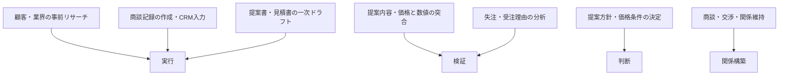
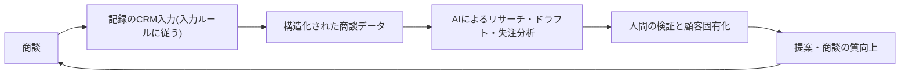

## 業務分解が効きやすい部門だが、AIの採用は遅れている

営業職の労働時間の大半は記録・調査・資料作成といった周辺業務に費やされ、実際に売る活動(顧客との商談・折衝)に使えている時間は少ない——Bain & Companyのテクノロジーレポート2025はこの構造を示し、周辺業務をAIが肩代わりすれば実セリング時間を大きく増やせる余地があると試算した(コンサルティング会社による自社推計であり、数値はデータボックス参照)[src-2026-061]。商談記録・提案書ドラフト・顧客リサーチは「実行」の典型でAI委任の第一候補、商談・交渉・関係維持は「関係構築」の典型で人間保持——業務分解の4分類(定義は組織・人材編「業務分解×再配置プレイブック」)が最も素直に当てはまる部門の一つである。この位置づけ自体に出典はなく、業務構成からの判断である。なお、この時間配分の実証は現時点でBainの自社推計1本に依拠しており、独立した2源目はまだない。編集部はこの数量感を確定値ではなく作業仮説として扱う——導入判断の前に、自部門で1〜2週間のセルフログを取って時間配分を実測し、前提を自社の数値で置き直すことを推奨する。

ところが同レポートは、営業部門のAI採用が他部門に比べて遅れていることも指摘する[src-2026-061]。遅れの根は2つあると見ている(この分析自体に出典はない)。第一に、委任の前提となる商談データが営業個人の頭とメモ帳の中にあり、組織のデータになっていない。Bainもプロセス再設計を伴わない単純な自動化は効率化につながらない傾向があり、営業データの品質と統合が最大の課題だと指摘する[src-2026-061]。第二に、「営業は人間関係の仕事だ」という正しい自己認識が、業務をほどかずに丸ごと聖域化する誤りに転びやすい。関係構築が中核であることと、周辺業務まで人間が抱え込むことは別の話である。日本側でも、AIを利用する営業担当者への調査(SaaS比較サイト運営のスマートキャンプによる調査)で、活用は提案資料・メール作成に集中し、利用者の過半が成果への寄与を実感している[src-2026-063]——委任はすでに資料・文章の領域から始まっている。

> 📊 **データボックス(2026-06時点)**
> - 営業職が実際の営業活動(セリング)に費やす時間: 労働時間の約25%。周辺業務のAI委任で実セリング時間は約2倍にでき、商談勝率は30%以上向上する可能性があるとBainは推定(Bain & Company Technology Report 2025、2025年9月。コンサルティング会社の自社推計)[src-2026-061]
> - 営業でのAI活用業務は「提案資料の作成」40.0%、「営業メールの作成・送付」39.4%が上位。「成果・質ともに向上」40.4%を含む66.9%が成果への寄与を実感(スマートキャンプ(BOXIL)調査、AI利用中の営業担当者389人、2025年12月実施。母集団はAI利用者のみ)[src-2026-063]
> - 同調査でAI活用成功に最も重要な要素の最多回答は「学習データの入力ルールの徹底」13.6%——最多ではあるが、残る86.4%は別の要素を回答しており突出した単独要因ではない[src-2026-063]
> - AI利用者の生産性向上は自己申告で47%、反復作業の自動化で週平均12時間削減(ZoomInfo調査、米国の営業・マーケティング職1,002名、2025年。ベンダーによる自社領域の自己申告調査のため割引が必要)[src-2026-062]

## 「売る」業務と「売るための準備」を分けて考える

業務分解の方法と4分類(判断/検証/実行/関係構築)の定義は組織・人材編「業務分解×再配置プレイブック」で説明しており、ここでは再定義しない。営業の主要業務を4分類に対応づけると次のとおりである。対応づけに出典はなく、業務内容からの整理である。

営業の主要業務と4分類の対応を示す(委任候補は「実行」=周辺業務に集まり、部門の中核価値は「関係構築」と「判断」にある)。

営業の分解で注意すべき点は2つある(以下の整理に出典はない)。第一に、**時間と価値の非対称**。時間は「実行」(記録・調査・資料)に費やされるが、受注を決めるのは「関係構築」(商談・交渉)と「判断」(提案方針・価格)である。だから委任の余地が大きく、浮いた時間の振り向け先——顧客接点の増加——が最初から明確だという利点がある。第二に、**「実行」に埋まった暗黙の検証**。提案書作成には「顧客要件との突合」「価格・納期・実績数値の確認」が埋め込まれている。ドラフト作成と一括でAIに渡すと検証が業務から消え、誤った価格や事実がそのまま顧客に届く。営業の誤りは社内の手戻りで止まらず、顧客の信頼毀損として直撃する——この一点が、営業の検証設計を他部門より厳しくする理由である。

### 商談1件の分解ワークシート記入例(そのまま使える)

様式(5列)は組織・人材編「業務分解×再配置プレイブック」の業務分解ワークシートを使う。法人営業の商談1件の流れを分解した記入例を示す。記入内容は出典のない想定例である。

| タスク | 4分類 | 再配置 | 検証者 | 移行時期 |
|---|---|---|---|---|
| 顧客・業界の事前リサーチと一次整理 | 実行 | AI委任 | 担当営業(数値・固有名詞を原典と突合) | 今すぐ |
| 商談の文字起こし・記録作成・CRM入力 | 実行 | AI委任 | 担当営業(発言の帰属・数値・宿題事項を確認して確定) | 今すぐ |
| 提案書・見積書の一次ドラフト | 実行 | AI委任 | 担当営業+上長(下記「顧客提出前チェック5項目」) | 今すぐ |
| 価格・納期・実績数値と原簿の突合 | 検証 | 人間保持 | 営業マネジャー(AIは指摘の下書きまで) | 移行しない(誤りが顧客に直撃) |
| 提案方針・価格条件の決定 | 判断 | 協働 | 営業責任者(AIは選択肢と過去案件の整理まで。採否と責任は人間) | 1年以内 |
| 失注・受注理由の分析 | 検証 | 協働 | 営業企画(AIの仮説を商談記録と突合) | 1年以内 |
| 商談・交渉・クロージング | 関係構築 | 人間保持 | — | 移行しない |
| 既存顧客との関係維持・フォロー | 関係構築 | 人間保持(AIはフォロー漏れの検知と準備資料まで) | — | 移行しない |

運用ルールは前掲プレイブックと同じで、「AI委任」で検証者欄が空白の行は委任禁止、「移行しない」には保持理由を必ず書く。

## AI影響の時間軸マップ(今/1年/3年)

以下は出典のある予測ではなく、準備の優先順位を決めるための作業仮説である。確定予測として読まないでほしい。

| 領域 | 今 | 1年 | 3年 |
|---|---|---|---|
| **商談記録・CRM入力** | 文字起こし・記録ドラフトの委任。担当営業が確認して確定する運用 | 入力ルールが統一された組織で、CRMが「AIが読める商談データベース」に育ち始める | 記録は完全委任に近づき、人間の仕事は確度・温度感など判断情報の付与に絞られる |
| **顧客リサーチ・提案書** | 一次リサーチとドラフトの委任。提出前検証を人間が握る | 自社の商談データ・過去提案を参照したドラフトへ高度化。新任者の提案品質の底上げ | 提案作成は「書く仕事」から「検証して顧客固有に仕立てる仕事」へ移行 |
| **商談データの活用** | 失注分析・パイプライン整理の協働を試行 | 次アクション提案・確度評価の協働が定例フローに入る(データ構造化が前提) | 商談データが営業コーチングと提案の勝ちパターン共有の基盤になる |
| **顧客接点そのもの** | 人間保持。AIは準備と後処理まで | インサイドセールスの一次接触の協働を限定的に検証 | 定型的な一次接触の一部に委任の可能性。交渉・クロージング・関係維持は人間保持のまま(とりわけ不確実な見通し) |

この見通しを支える外部データもある。国内では、NTTデータとテプコカスタマーサービスが営業業務への生成AI適用PoCを実施し、提案書のテンプレート自動生成・建物情報調査の自動化・AIエージェントによるインサイドセールス代行を検証した(実施当事者による公開事例であり成功側バイアスに留意)。PoCの狙いには稼働削減と並んで「新任者の質の平準化」が挙げられている[src-2026-064]。またAI開発企業Anthropicの自社プラットフォーム利用データ(技術職偏重のバイアスに留意)では、企業のAPI利用でメール管理・文書処理・CRM等の事務サポートタスクの委任が拡大している[src-2026-023]——営業の周辺業務はまさにこの領域にある。

> 📊 **データボックス(2026-06時点)**
> - 営業1人が1件あたり2時間半程度を要していた提案ストーリー検討を対象に、テンプレート全10ページの提案書を高い精度で自動生成。月120時間程度の手動の建物情報調査も航空写真解析で削減可能と検証(NTTデータ×テプコカスタマーサービスPoC、2025年1〜4月実施。実施当事者発表の単一事例)[src-2026-064]
> - 週1回以上AIを使う営業職の81%が商談サイクル短縮、80%が成約率向上、73%が平均商談規模の拡大を報告(ZoomInfo調査2025、n=1,002。自己申告の相関であり、優秀な営業ほどAIを使う逆因果は排除できない)[src-2026-062]
> - 企業向け(API)利用では事務・管理サポート関連タスク(メール管理・文書処理・CRM等)の比率が2025年11月に13%へ上昇(Anthropic自社プラットフォームデータ、技術職偏重の留保あり)[src-2026-023]

## いまやるべき準備 — まず商談データを構造化する

1年後の「商談データの活用」に進めるかは、いま整備する商談データで決まる。これはAI-Ready編「AI-Readyの5資産」の資産①(データ・ナレッジの構造化)の営業版である——CRMの空欄を埋める作業ではなく、AIに渡せる商談データベースを育てる投資として位置づける。

商談データが構造化されて初めて、リサーチ・ドラフト・分析の質が上がり受注に返ってくる複利ループを示す(入力ルールがなければこのループは最初の矢印で断絶する)。

- 【営業部門長】(今すぐ)**商談記録の入力ルール統一**。項目・粒度・用語が営業ごとにバラバラの記録は、AIにとって存在しないのと同じである。Bainは営業データの品質と統合を最大の課題に挙げる[src-2026-061]。日本のAI利用営業への調査でも成功に最も重要な要素の最多回答は「学習データの入力ルールの徹底」だったが、最多といっても回答者の少数にとどまり、大半は別の要素を選んでいる(実値はデータボックス参照)——この調査単独で入力ルールの優先性は支えられず、ここでは傍証として扱う[src-2026-063]。道具: 下記「商談記録の最小入力様式」。完了条件: 部門の全商談記録が同一様式で入力され、月次で入力率と質の抜き取り検査(後述の罠4)が計測されていること
- 【営業部門長】【推進担当】(今すぐ)**顧客情報の入力可否ルール**。顧客名・商談内容・見積条件は顧客から預かった機密である。どの環境なら入力してよいかを全社の暫定ガードレール(組織・人材編「推進体制とガバナンスの設計図」で定義)の当てはめとして1枚で配る——営業独自の別ルールを作らない。秘密保持契約を結んでいる顧客の情報は、契約上の開示制限とAI入力の整合を法務に確認する。完了条件: 営業全員が「この顧客情報はどこまで入れてよいか」に即答できること
- 【営業マネジャー】(今すぐ)**提出前検証フローの常設**。AI下書きの提案書・見積書・メールが検証なしに顧客へ出る経路を塞ぐ。道具: 下記「顧客提出前チェック5項目」。完了条件: 顧客向け文書の検証者が文書ごとに特定され、検証なしの送付が部門ルール違反として扱われること
- 【営業企画】(1年以内)**「良い提案書」の条件の言語化**。トップ営業の暗黙知——何を顧客固有と呼び、どこで差し戻すか——を検証基準として文書化する。完了条件: 検証基準が部門の提案レビューで実際に使われ、四半期ごとに改訂されていること

## 人材再配置の方向 — 重心移動は周辺業務だけで起きる

役割の重心移動の枠組み(検証者・設計者・例外処理者の3役割)は組織・人材編「実行者から検証者・設計者へ」で定義している。営業への当てはめは次のとおりで、出典のある整理ではない。

営業の再配置は他部門より素直である。関係構築——3役割でいう例外処理者の中核スキル——が最初から部門の本業だからだ。重心移動は「周辺業務の実行者」の部分だけで起きる: 担当営業はリサーチ・記録・ドラフトの書き手から**AI出力の検証者**(数値・事実・顧客固有性の品質責任)へ、営業企画・営業推進は集計係から**設計者**(営業プロセスとAIの分担、商談データの設計)へ。トップ営業は大型・非定型案件の**例外処理者**であると同時に、検証基準の言語化の供給源になる——この言語化こそ、後述の「神プロンプト化」の罠への組織的な対抗手段である。

**育成の再設計が最も切実になる部門の一つが営業である**。部門間の比較調査があるわけではないが、理由は構造にある——テレアポ・商談同行の議事録・リスト作り・提案書の下書きという新人営業の訓練装置は、ほぼすべてAI委任の第一候補と重なる。委任で効率を取りながら育成を壊さないための仕分け(訓練価値×AI代替効率の2×2と判定3問)は組織・人材編「新人が育たない問題」で説明しており、営業部門はその最重要の適用先である。たとえば「AIの提案書ドラフトを新人が顧客になったつもりで差し戻す」「商談録画とAI記録の突合で商談の読み方を訓練する」といった形で、訓練機能を明示的に再実装する。前掲PoCの狙いである「新任者の質の平準化」[src-2026-064]は底上げとしては正しいが、平準化された出力に頼るだけでは、出力の良し悪しを裁ける中堅が育たない。底上げと検証者育成は別の設計だと考えるべきである。

## この部門特有の罠

**罠1: 顧客向け文書のワークスロップ——信頼毀損が顧客に直撃する。** 体裁の整ったAI生成文書が検証なしに流通する構造はアンチパターン集「ワークスロップ工場」を参照。米国デスクワーカー調査では、低品質なAI出力は受け手の対処コストになるだけでなく、送り手の能力・信頼への評価を下げる[src-2026-036]。この調査は社内の受け手を測ったものであり、顧客側を測った出典はないが、営業はこの構造が最も高くつく部門の一つだと考えられる——受け手が顧客だからである。どの会社にも送れる中身のない提案書・宛先や数値を誤ったメールは、1通で商談と関係資本を失わせ、回復には新規開拓より多くの時間がかかる。脱出は生成の禁止ではなく、提出前検証の固定(下記5項目)である。

**罠2: 個人の神プロンプト化——トップ営業の暗黙知が二重に属人化する。** 成果を出す営業ほど強力な指示文や使い方を個人で編み出すが、それが個人フォルダに閉じると、営業スキルの属人化にAI活用スキルの属人化が上塗りされ、異動・退職で両方が消える。もともと暗黙知への依存が強い営業では、この問題の影響はとりわけ大きいと考えられる(部門間の比較調査があるわけではない)。個人の時短が組織の能力にならない構造はアンチパターン集「コパイロット一斉配布」を、組織に残るかの判定は原理編「複利の法則」の複利テスト3問を参照。対抗手段は、有効だった指示文・検証基準・勝ちパターンを部門共有の資産として月次で吸い上げ、提供者を評価で報いることである。

**罠3: データなき自動化——空のCRMの上にAIを載せる。** 商談データが空欄・形骸のままSFA/CRM搭載AIや自動化ツールを導入しても、参照すべきデータがないAIは一般論しか返せない。典型的な失敗構造はアンチパターン集「データなき自動化」を参照。日本のAI利用営業の調査でも、使われているのは汎用の生成AIが最多で、SFA/CRM搭載AIの利用は少数にとどまる[src-2026-063]。これはツールの優劣ではなく、商談データの構造化がまだAIに渡せる水準にないことの傍証だと読める(調査が理由まで特定しているわけではない)。順序は入力ルール→データ蓄積→AI活用であり、逆走はできない。

**罠4: 入力率の評価接続が招く形骸入力——数字は埋まるがデータは死ぬ。** 入力ルールの定着を急いで入力率を人事評価に接続すると、90日目を待たずに副作用が出る——これは出典のある知見ではなく、実務上の経験則である: 空欄を埋めるための定型文コピペ、AIで水増しした長文記録、実態と乖離した楽観的な確度登録である。入力率という量の指標は達成されるが、「顧客の言葉のまま」「根拠1行」という質が死に、その上に載るAIのリサーチ・失注分析まで汚染される——罠3を回避したつもりで、中身の腐ったCRMという同じ場所に戻る。手当は3つ。①評価に使うなら入力率単独ではなく、様式準拠率+質の抜き取り検査(月次で記録をサンプリングし、顧客の課題欄が顧客の言葉か・確度に根拠が書かれているかを営業マネジャーが判定)を必ず併用する。②水増しが見つかった場合は個人の懲罰より先に様式・運用の欠陥(項目が多すぎる、入力時間が確保されていない)を疑い、直す。③抜き取りの差し戻し率を部門のデータ品質指標として計測し、改善傾向を評価の対象にする。

## 顧客提出前チェック5項目と商談記録の最小入力様式(そのまま使える)

**顧客提出前チェック5項目**(提案書・見積書・顧客向けメールに適用。この様式に出典はなく、部門ルールの叩き台として作成した。マーケティングの「公開前チェック5項目」〈対象は公開コンテンツ〉とは対象文書が異なる別物である。海外顧客向け提出文書の翻訳は業務パターン「翻訳・多言語化の生成・検証フロー」を参照):

1. **数値の原簿突合**: 価格・納期・数量・スペックは原簿(価格表・基幹システム・該当契約)と突合したか。AIの出力同士の突合は突合と認めない
2. **宛先・固有名詞**: 顧客名・担当者名・敬称・他社情報の混入(過去提案の使い回し痕跡)を確認したか
3. **実績・事例の事実確認**: 引用した導入実績・事例は事実か、顧客名の開示許可はあるか
4. **顧客固有性**: この提案はこの顧客にしか出せないか。どの会社にも送れる一般論なら差し戻す
5. **約束の権限確認**: 文中の確約(値引き・納期・仕様・無償対応)は自分の決裁範囲内か。範囲外なら確約表現を消すか決裁を取る

**商談記録の最小入力様式**(6項目・1商談1レコード。この様式に出典はなく、AI-Ready編「AI-Readyの5資産」資産①の入力ルールの営業版として作成した):

| 項目 | 記入内容 | なぜ必要か |
|---|---|---|
| 日付・先方出席者と役職 | 事実のまま | 意思決定者への到達度の分析に使う |
| 商談フェーズ | 部門共通の選択肢から選ぶ(自由記述にしない) | パイプライン分析の前提 |
| 顧客の課題 | 顧客の言葉のまま記録(営業の解釈と区別) | 提案ドラフトと失注分析の最重要入力 |
| 決定事項・宿題 | 誰が・何を・いつまでに | フォロー漏れ検知の入力 |
| 次アクション・期日 | 1行 | 同上 |
| 受注確度と根拠 | 確度(共通選択肢)+根拠1行 | 確度だけの記録は検証できない |

## 体制と費用の目安

以下の体制・費用・期間と効果側の目安に出典はなく、実務上の経験則である。**中堅(数百名規模、営業部門20〜50名)**: 先行1チーム(5〜10名)で90日のパイロット。兼務の推進役1名、対象は商談記録と提案書ドラフトの2業務に絞る。既存の全社契約ツールの範囲なら追加投資ゼロ〜数十万円で営業部長の決裁で始められる。**大企業(数千〜数万名規模、営業部門数百〜数千名)**: 先行2〜3チーム(対象計20〜30名)で90日パイロット→営業部単位へ半年で展開。専任0.5〜1名+チームごとの兼務推進役。CRM連携・商談解析まで踏み込む場合の外部支出は年数百万〜数千万円規模で営業担当役員決裁。どちらのレンジでも律速は商談データの入力ルール定着であり、ツール調達を先行させても期間は縮まない。経営が承認・否認する判断は「先行チームのパイロット予算と、入力ルール統一を人事評価(入力率の計測)に接続するか(接続する場合の形骸入力の手当は罠4)」の2点に絞る。

**効果側の目安**: 商談記録・リサーチ・資料ドラフトの委任で営業1人あたり週2〜4時間が浮くと置くと、年90〜180時間/人。人件費をフルコスト5,000円/時で換算して1人あたり年45万〜90万円——中堅(営業30名)で年1,400万〜2,700万円、大企業(営業500名)で年2億〜4.5億円規模の工数原資に相当する。海外のベンダー調査の自己申告値はこれより大きいが(データボックス参照)[src-2026-062]、編集部は保守側の値を採る。浮いた時間は削減でなく顧客接点へ振り向けるのが本ページの設計なので、効果は「人件費の削減額」ではなく「商談時間の増加分とその受注転化」で測るのが筋である。加えて提出前検証の固定は、誤った価格・宛先の文書が顧客に届いて商談1件と関係資本を失う損害(商談単価×想定勝率で各社換算)を防ぐ保険であり、役員会への提示は工数原資と防げる損害の両面で行う。

## 最初の90日

- 【営業部門長】【推進担当】(今すぐ)商談1件の流れを業務分解ワークシートで分解する。道具: 組織・人材編「業務分解×再配置プレイブック」の様式+本ページの記入例。完了条件: 全タスクに4分類・再配置・検証者が記入され、トップ営業1名を含む現場レビューを通っていること
- 【営業部門長】(今すぐ)商談記録の入力ルールを統一し、顧客情報の入力可否ルールを配布する。道具: 本ページの最小入力様式+全社の暫定ガードレール(組織・人材編「推進体制とガバナンスの設計図」で定義)。完了条件: 新規商談記録の様式準拠率が月次で計測され、入力可否の相談先が周知されていること
- 【営業マネジャー】(今すぐ)顧客提出前チェック5項目の運用を開始する。道具: 本ページの5項目。完了条件: 顧客向け文書の検証者が文書ごとに記名され、検証なし送付の差し戻し実績が記録され始めていること
- 【営業企画】(今すぐ着手、90日目完了)有効だった指示文・検証基準・勝ちパターンを部門共有の資産に集約する。道具: 月次の吸い上げ会+共有リポジトリ(個人フォルダ外)。完了条件: トップ営業を含む3名以上から素材が集まり、新任者のオンボーディング教材として1回以上使われていること
- 【営業部門長】【CHRO】(1年以内)新人営業の訓練業務(テレアポ・議事録・下書き)を訓練価値×代替効率で仕分け、AI差し戻し演習型の育成に置き換える。道具: 組織・人材編「新人が育たない問題」の2×2マトリクスと判定3問。完了条件: 「設計し直す」象限の業務リストが承認され、代替育成手段が次年度育成計画に反映されていること
- 【経営】(能力向上を待て)AIエージェントによる顧客との自律対話・交渉の委任。国内でもインサイドセールス代行はまだPoC段階であり[src-2026-064]、顧客接点での誤りは社内で補正できない。提出前検証付きの委任で検証記録が四半期単位で蓄積され、誤り率が自社の許容水準を下回ってから再判定する

**この主張が崩れる条件**: 入力ルールの統一も提出前検証も経ない個人任せのAI利用だけで、受注率・顧客からの信頼(失注理由・クレーム)を悪化させずに営業生産性の向上が組織として持続した事例が、ベンダー発以外の複数の独立した調査で確認されたとき——そのとき本ページの「データ構造化と検証固定が先」という順序論は過剰であり、配布と個人裁量で足りる。自社で観測可能な反証はこれ: 顧客提出前チェックの差し戻し率が2四半期連続でほぼゼロ(目安1%未満)のまま、受注率・クレーム・失注理由に悪化がなければ、全件検証のコストは過剰になっており、チェックを必須5項目から抜き取り方式へ緩める再判定を行う。

<!--
執筆メモ(ソースが薄い箇所・見立てで書いた箇所・レビュー重点ポイント。2026-06-11 第4陣レビュー反映で再生成):
- 4分類への対応づけ・分解ワークシート記入例・時間軸マップ・提出前チェック5項目・商談記録の最小入力様式・規模感2レンジ・効果側レンジ(週2〜4時間×5,000円/時)・罠4(形骸入力)・90日はすべて出典のない編集部の見立て(本文にマーカー明示済み)。
- ページの結論(周辺業務の委任余地が大きい+営業部門の採用は遅い+データ品質が最大の課題)はsrc-2026-061(Bain、reliability: high)に依拠。Bainの数値(25%/2倍/30%以上)はコンサルの自社推計のため本文は程度表現とし数値はデータボックスに隔離。第4陣レビューを受け、タイムスタディが単一推計依拠である旨を本文で開示し、自社セルフログでの実測を推奨する作業仮説に一段慎重化した。独立2源目(営業タイムスタディ)は/aidx-researchキュー登録済み(要判断#3で061がmediumへ降格された場合は「medium単源にテーゼを背負わせない」規約により2源目収集が必須化する)。
- src-2026-062(ZoomInfo)はベンダーの自己申告調査・medium。単独でテーゼを背負わせず、データボックスのみ+自己申告と逆因果の注記付き(規模感の効果側レンジからの参照もボックス誘導のみで数値は本文に出していない)。src-2026-063(BOXIL)はSaaS比較サイト運営社の調査・medium・母集団がAI利用者のみ——調査主体と母集団の限定を本文・ボックス双方で開示。最多回答「入力ルールの徹底」は実値13.6%(86.4%は別回答)をデータボックスに併記し、本文では傍証へ降格(第4陣・必須修正5対応)。src-2026-064(NTTデータ)は実施当事者発表の単一PoC事例——成功側バイアスを本文で開示し、「待て」判定(エージェント自律対話)の根拠にも使用。
- 罠1のワークスロップ調査[src-2026-036]は社内の受け手を測ったもの。「顧客向けではより高くつく」は編集部の見立てとして明示(原典の拡大解釈をマーカーで区分)。
- 「神プロンプト化」はアンチパターン集に専用カードがないため、既存カード(コパイロット一斉配布=個人時短の拡散)+複利テストへの参照で構成した。営業特化の属人化・暗黙知共有・セールスイネーブルメントの実証は未収集——/aidx-researchキュー登録済み(第4陣・次フェーズ提案)。
- 多重当事者性フレームは営業が全社機能の主管部門でないため使用していない(変種も作っていない)。
- 4分類・3役割・暫定ガードレール・訓練価値2×2・複利テストはすべて正本参照のみで再定義していない(フレーム台帳照合済み)。商談記録の最小入力様式・提出前チェック5項目はフレーム台帳(08-framework-registry)登録済み(five-assets資産①の入力ルールの営業版、marketingの公開前チェック5項目とは対象文書が異なる別物としてページ内・台帳双方に対応を明記)。対外文書チェックの共通コア正本化(第4陣・横断課題#2)が実施されたら、提出前チェック5項目はコア参照+営業差分(顧客固有性・約束の権限確認)のみへ書き換えること。
- 部門間最上級は第4陣・必須修正9対応でsummary・見出し・本文とも相対表現(「とりわけ」「最も〜の一つ」+見立てマーカー)へ落とした。部門間の相対位置づけは索引正本(新設は要判断#2)へ移管予定。
2026-06-12 文体改修: 格言調見出し平易化・内部用語排除・見立て定型句を自然文に置換
-->
