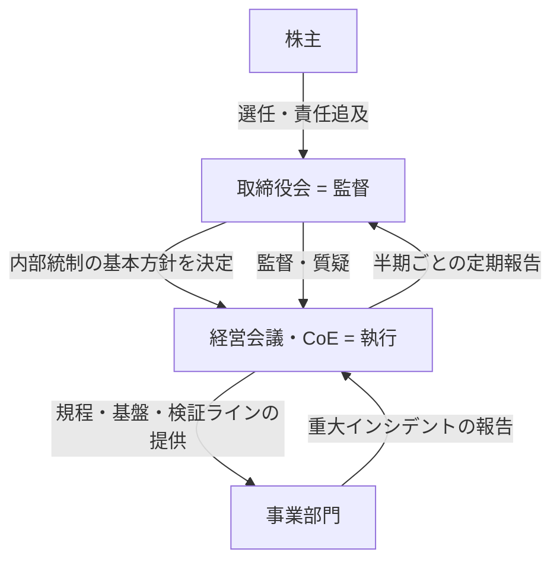
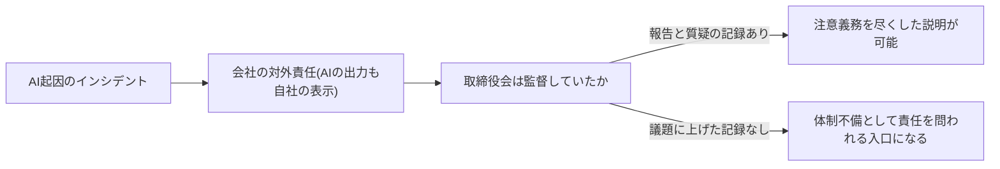

> ⚖️ **免責**: 本ページは一般的な情報提供であり、法的助言ではない。会社法・内部統制に関する個別の判断は、顧問弁護士等の専門家に確認すること。

> 📎 **このページ+別添3点で会議に出られる**: 本ページのアジェンダで取締役会に上程する際の別添は、①AI施策台帳の要約(様式は原理編「負債とスロップの分類学」——全施策を5択区分・撤退条件付きで一覧化)②検証ログの集計(組織・人材編「実行者から検証者・設計者へ」の最小様式——差し戻し率の出所)③四半期経営報告1枚(様式はAI-Ready編「AI-Ready自己診断」——経営会議向けの手前の報告)の3点で足りる。

## このページで扱う範囲

CoE(推進体制)と社内規程の整備——執行側のAIガバナンス——の設計は組織・人材編「推進体制とガバナンスの設計図」で扱っている。本ページはその続きではなく、**もう一段上の層**を扱う。すなわち、執行がどれだけ精緻に規程を作っても、それを監督する取締役会の側に議題・報告ライン・記録がなければ、AIガバナンスは会社の統治機構として完結しない。

会社法は、取締役会の職務として「取締役の職務の執行の監督」を定め、業務の適正を確保するための体制(いわゆる内部統制システム)の基本方針の決定を、取締役に委任できない取締役会の専決事項としている [src-2026-094]。AIが業務フローに組み込まれ、その出力が顧客・お金・法令に届くようになった段階では、AIの利用統制を「業務の適正を確保する体制」の一部として整理するのが安全だと考えられる(この整理を直接定めた条文・判例はまだない)。そう整理した場合、AI利用統制の基本方針はCoE任せにできない取締役会のテーマになる。

監督(取締役会)と執行(経営会議・CoE)の二層構造を示す。本ページが扱うのは上の層である。

## 土台になる会社法の条文と義務

土台になる条文は三つである(条文の引用は一次法源 [src-2026-094] による)。

1. **会社法362条2項** — 取締役会の職務は、業務執行の決定・**取締役の職務の執行の監督**・代表取締役の選定及び解職である
2. **会社法362条4項6号・5項** — 「取締役の職務の執行が法令及び定款に適合することを確保するための体制その他株式会社の業務……の適正を確保するために必要なものとして法務省令で定める体制の整備」は取締役に委任できない専決事項であり、**大会社である取締役会設置会社では、取締役会がこれを決定しなければならない**(362条5項)。監査等委員会設置会社・指名委員会等設置会社では根拠条文が異なる(399条の13、416条。下の分岐表)
3. **会社法330条** — 会社と役員の関係は委任に関する規定に従う。これにより取締役は善管注意義務を負う

### 自社の機関設計でどの条文が根拠になるか

上記2は監査役(会)設置型の取締役会設置会社を前提にした条文である。「うちは大会社ではない」「うちは監査等委員会設置会社だ」と読み飛ばす前に、自社の機関設計の行を確認してほしい——監査等委員会設置会社・指名委員会等設置会社では、内部統制体制の整備の決定は**会社の規模を問わず**取締役会の義務である [src-2026-094]。

| 機関設計 | 内部統制の基本方針の決定 | 根拠条文 | 監査の担い手 |
|---|---|---|---|
| 監査役(会)設置会社 × 大会社 | 決定義務あり(取締役会の専決) | 362条4項6号・5項 | 監査役・監査役会 |
| 監査役(会)設置会社 × 非大会社 | 決定義務はない(決定する場合は取締役会の専決) | 362条4項6号 | 監査役 |
| 監査等委員会設置会社 | 規模を問わず決定義務あり | 399条の13第1項1号ハ・2項 | 監査等委員会 |
| 指名委員会等設置会社 | 規模を問わず決定義務あり(取締役へ委任不可) | 416条1項1号ホ・2項・3項 | 監査委員会 |

非大会社に決定義務がないことは、監督が不要であることを意味しない。取締役(指名委員会等設置会社では執行役等)の職務執行の監督は、どの機関設計でも取締役会の職務であり(362条2項・399条の13第1項2号・416条1項2号)、善管注意義務(330条)も共通である [src-2026-094]。決定義務の有無は「基本方針への明文化が必須か」の差にとどまる、というのが本ページの整理である。したがって本ページの監督4点とアジェンダは、機関設計・規模を問わず使える。

三様監査(監査役等・内部監査・会計監査人)とアジェンダ報告事項5項目(後述)の分担の目安を示す。この分担に出典はなく、内部統制の一般的な役割分担からの整理である。

- **監査役・監査(等)委員会** — 報告事項1〜5の全体を業務監査の対象として受領し、特に2(インシデント)・3(規程・体制)の運用を執行から独立に検証する
- **内部監査部門** — 報告事項1・2の実態面(シャドーAI実態調査・検証ログの運用)の事実確認を担い、監査役等への報告ラインを保つ
- **会計監査人** — 報告事項4(投資の状況)のうち資産計上・減損、および財務報告プロセスへのAI委任が内部統制報告制度(J-SOX)の評価に関わる範囲で接点を持つ(J-SOXの基準・実施基準は2023年4月に改訂され、2024年4月1日以後開始事業年度から適用されている [src-2026-098])

条文にAIの文字はない。しかし国の公式文書は、AIガバナンスを経営層の責任として明示し始めている。総務省・経済産業省「AI事業者ガイドライン」(第1.1版)は、AIガバナンスの構築について「これらを効果的な取組とするためには、経営層の責任は大きく、そのため、リーダーシップを発揮することが重要である」と本編に明記し、ガバナンス構築を単なるコストではなく持続的成長に向けた先行投資と捉えることを求めている [src-2026-093](なお同ガイドラインは継続改定されており、第1.2版が2026年3月に公表済み。参照時は最新版にあたること)。ガイドラインは法的拘束力のないソフトローだが、**善管注意義務の具体的な行為規範を考える際の「国の標準」としての参照点**になると考えられる。AIに固有の裁判例の蓄積はまだ乏しいため、「AI起因の損害で取締役の内部統制構築義務違反が問われうる」という記述は確立した法解釈ではない推測であり、条文の確定した射程(大会社の決定義務・委任禁止)とは区別して読んでほしい。

## 多くの取締役会ではまだ議題になっていない

グローバルの取締役調査では、AIを議題化していない取締役会は減少傾向にあるもののなお一定数残り、取締役・経営幹部の過半が自らのAI知識・経験を限定的と自認している [src-2026-095]。また米国大手企業の取締役会調査は、AIに直面する企業では「特化したAI知識を持つ技術専門家より、デジタル中心の事業変革を率いた経験を持つ取締役の方が有効な場合がある」と指摘している [src-2026-096]。この指摘を踏まえると、**「AIに詳しい社外取締役を1人入れる」ことを監督体制の代わりにはできない**。構成(誰がいるか)より先に、運営(何を・いつ・どう報告させるか)を整えるのが先手である。いずれも海外調査であり、日本企業のサンプル比率は開示されていない。日本の取締役会の水準がこれより高いと見る根拠は現時点でなく、ギャップはむしろ大きい可能性がある(これを直接示す国内調査はまだない)。

> 📊 **データボックス(2026-06時点)**
> - 「AIは取締役会の議題に上っていない」との回答は31%(前回調査の45%から改善)。取締役・経営幹部の約3分の2が自らのAI知識・経験を「限定的またはない」と回答(Deloitte Global Boardroom Program、2025年1〜2月調査、56カ国・700人、取締役84%)[src-2026-095]
> - S&P 500の2025年新任独立取締役の出身業界はテクノロジー/通信が16%で最多。スキルマトリクスを開示する取締役会は2020年の38%から2025年に80%へ(Spencer Stuart、2025年10月、proxy statement分析)[src-2026-096]
> - CEOの53%が「最重要課題に直結する専門性を持つ取締役」を理想とする一方、自社で実現できていると答えたCEOは43%(取締役自身の認識は63%)[src-2026-096]

## 取締役会が監督すべき4点

何を監督すればよいか。出典のある確立した標準はまだない。以下の4点は、会社法の内部統制の枠組みとAI事業者ガイドラインの構造から本サイトが組み立てた整理である。各項目の判定基準は執行側のページ(表の右列)で定義しており、取締役会はその**存在と機能**を確認する。

| # | 監督対象 | 取締役会が確認すること | 執行側の定義ページ |
|---|---|---|---|
| 1 | リスク管理体制 | 利用規程・検証義務化ライン・シャドーAIの実態把握が存在し、運用されているか | 組織・人材編「推進体制とガバナンスの設計図」 |
| 2 | 重大インシデント報告ライン | AI起因の重大インシデントが「何を・いつまでに」取締役会へ届くかの基準が事前に定まっているか | 同上(規程骨子 第5章・第9章) |
| 3 | 投資の規律 | AI投資が5択の語彙で判定され、台帳と撤退条件付きで管理されているか | 原理編「負債とスロップの分類学」(投資判断の5択・AI施策台帳) |
| 4 | 開示 | 対外開示(有価証券報告書・統合報告・プライバシーポリシー等)の記載とAI利用の実態が整合しているか | 開示主管部門の所掌(下の確認3問) |

要点は、取締役会が規程の条文を審議することではない。**「体制はあるか・機能しているか・重大事は自分たちに届くか」を定期的に問い、その質疑を議事録に残すこと**である。

#4(開示)だけは執行側の手順がまだ薄い。当面は、アジェンダ報告事項5の質疑で開示主管役員に次の3問を投げ、存在と整合を確認する(この3問に出典はなく、実務上の経験則である)。

1. 有価証券報告書・統合報告等のAI関連記載(リスク情報・取組の記述)は、**AI施策台帳と突合して**作成されているか。突合の記録はあるか(台帳の様式は原理編「負債とスロップの分類学」——全施策を5択区分・撤退条件付きで一覧化したもの)
2. 財務報告プロセスへのAI委任箇所は、**内部統制報告制度(J-SOX)の統制文書・評価範囲に反映**されているか——J-SOXの基準・実施基準は2023年4月に改訂され、2024年4月1日以後開始事業年度から適用されている [src-2026-098]。点検の実務様式は部門別ガイド「経理財務のAIDX」の「AI委任と統制の同時改訂チェック(5問)」を使う(委任を変えたら統制文書も同時に変わっているかの点検)
3. プライバシーポリシー・利用規約等の対外的な記載と、**顧客接点のAI利用実態**(自動応答・AI生成FAQ等)は整合しているか——接点の一覧は部門別ガイド「広報」の「対外AI接点棚卸し台帳」を使う(接点×所管×突合状況の管理様式)

3問とも、取締役会が点検作業を行うのではなく、執行側の様式の存在と突合結果を確認するだけでよい(執行側の判定基準をこのページで作り直すことはしない)。

## 取締役会AI監督アジェンダ(そのまま使える・半期1回・報告事項5項目)

そのまま招集通知の議題に使えるテンプレを示す(編集部作成。執行側の規程骨子第9章「取締役会への報告・監督」を議題化した運用様式である)。頻度は半期1回・所要15〜30分を標準とし、重大インシデント発生時は臨時報告とする。

**報告事項(半期1回)**

1. **利用状況の概況** — 全社利用率の推移・主要用途・シャドーAI実態調査の結果概要(報告者: CoE主管役員)
2. **リスクとインシデント** — 重大インシデント・ヒヤリハットの件数と内容、検証ログの差し戻し率の推移、是正の状況(報告者: 同上。検証ログの様式は組織・人材編「実行者から検証者・設計者へ」のものを共用)
3. **規程・体制の変更** — 規程の重要改定、検証義務化ラインの変更、参照ガイドラインの版数と追随状況(報告者: 同上)
4. **投資の状況** — AI施策台帳の要約: 5択区分別の件数・投資額レンジ・「捨てる条件」発動の実績(報告者: CFOまたはCoE主管役員。効果欄の記載区分はロードマップ編「経営計画への翻訳」の効果の3分類を共用)
5. **開示・対外整合** — 開示文書とAI利用実態の整合確認の結果、当局・取引所の動向、外部からの照会(報告者: 開示主管役員)

**決議事項(該当時のみ)** — 内部統制システムの基本方針へのAI利用統制の位置づけ(新設・改定)。決定の義務と根拠条文は機関設計で異なる(「法的土台」節の分岐表を参照。監査役(会)設置の大会社は362条5項、監査等委員会・指名委員会等設置会社は規模を問わず決定義務)[src-2026-094]。

各項目の中身を組み立てる判定基準・様式は新たに作らず、上表の執行側のページにある定義を使う。取締役会側に必要なのは、この5項目が**毎回同じ構成で**届き、比較可能であることだ。

**2年目以降の深化**: 定例報告は4期(2年)で儀式化しやすい。5項目の定例受領は維持しつつ、半期ごとに重点1項目を選んで深掘る運用(担当役員の出席質疑、検証ログ・施策台帳の実物確認など)へ移行する。この運用案に出典はなく、定例報告の形骸化を防ぐための経験則である。

## 監督を怠った場合に何が起きるか

AIの出力を「ツールが勝手にやったこと」として会社から切り離す抗弁は、海外で早くも否定されている。カナダ・ブリティッシュ・コロンビア州の審判所決定(Moffatt v. Air Canada、2024 BCCRT 149。大手法律事務所の解説経由で確認 [src-2026-097])によれば、自社サイトのAIチャットボットが運賃を誤案内した件で、「チャットボットは別個の法主体」とする航空会社の主張は「サイト上の全情報に責任を負うのは明白」として退けられ、会社の不実表示責任が認められた。少額・海外の事案であり、取締役個人の責任を認めたものでもないが、**「AIの出力も会社自身の表示である」という方向性**を示した事例として読める。日本法に直接適用されるわけではないが、この方向性は国内でも基調になっていくというのが本ページの読みである。

国内のソフトローも同じ構造を示す。AI事業者ガイドラインは、AIの予期せぬ事故の際にバリューチェーンに連なる者は説明を求められる立場に立ちうるため、**関与の記録を残し合理的な説明ができるようにすること**を求めている [src-2026-093]。この「説明を求められる構造」は取締役会にも及ぶと考えられる。インシデント後に問われるのは「なぜ起きたか」だけでなく「取締役会は何を監督していたか」である。議題に一度も上げていなければ、「知らなかった」という説明は免責にならず、むしろ**体制が整っていなかったことの裏づけ**として扱われかねない。逆に、半期ごとの報告と質疑の記録は、善管注意義務を尽くしたことの説明材料になる(この評価を裏づける判例はまだなく、確実な免責を約束するものではない)。

インシデント発生後に問いがどこへ向かうかの構造を示す。分岐を決めるのは平時の監督記録である。

## 監督のコストと防げる損害の目安

出典のある標準はなく、以下の数字はいずれも出典のない実務上の目安である。**中堅(数百名規模)**: 半期1回・15〜30分の報告議題。準備は推進担当+管轄役員で半期あたり3〜5人日、年間の追加コストは人件費換算で数十万〜百万円台にとどまる。**大企業(数千〜数万名規模)**: 半期1回の取締役会報告に加え、監査(等)委員会・リスク委員会との分担で四半期粒度に割る運用が現実的。準備はCoE・内部監査・開示部門で半期あたり10〜20人日、年間人件費換算で数百万円規模。**効果側**: AI起因の重大インシデント(誤案内・誤公表・情報漏えい等)1件の直接対応コストは、内訳式(原因調査・技術対応の人日×単価+顧客対応・補償+公表・広報対応+再発防止策の策定・展開の工数)で積むと中堅で数百万〜数千万円、大企業ではこれに訴訟・信用毀損対応が加わり数千万〜数億円規模になりうる。加えて監督記録の存在は役員責任追及の局面での防御材料になりうる(いずれも出典のない目安である)。感度を1行で言えば、半期3〜5人日の監督準備は、この規模のインシデント1件の発生確率または被害規模を数%下げるだけで投資に見合う——逆に、2年運用して執行側の是正も報告基準該当もゼロが続くなら頻度を縮小する(末尾の反証条件)。

## 執行側の規程第9章とどうつながるか

組織・人材編「推進体制とガバナンスの設計図」の社内規程骨子テンプレは、第9章に「取締役会への報告・監督」を置いている。あの章が規程(執行側の文書)に書く**下半分**だとすれば、本ページのアジェンダテンプレと監督4点は、取締役会側で受け止める**上半分**である。両者は同じ報告ラインの両端であり、別の仕組みではない。規程第9章を起草する際は、本ページの報告事項5項目と頻度(半期1回)をそのまま規程側の報告内容として引用すれば、二重定義を避けられる。

## 今日からやること

- 【今すぐ】【経営】次回の取締役会にAIガバナンス整備状況を報告議題として上程する。道具: 本ページのアジェンダテンプレ(初回は5項目のうち報告可能なものだけでよい——空欄自体が体制の現在地を示す)。完了条件: 報告と質疑が議事録に記録される
- 【今すぐ】【推進担当】重大インシデントの取締役会報告基準(何を・いつまでに・誰が)を1枚で起草する。道具: 規程骨子の第5章(記録とインシデント報告)・第9章。完了条件: 経営会議の承認と取締役会への共有
- 【1年以内】【経営】内部統制システムの基本方針にAI利用統制を位置づける改定を検討する。道具: 顧問弁護士のレビュー+AI事業者ガイドライン最新版。完了条件: 取締役会決議、または見送りの判断理由が議事録に残る
- 【1年以内】【CFO】AI施策台帳のうち本格投資区分の案件すべてに撤退条件が付いているか点検し、結果を報告事項4(投資の状況)に含める。道具: AI施策台帳(様式は原理編「負債とスロップの分類学」)。完了条件: 台帳と取締役会報告書の整合
- 【待て】【経営】「AI専門家の社外取締役を招聘すれば監督は完成」とみなすこと。構成の手当ては議題と報告ラインが回り始めてから検討しても遅くない(米国調査でも専門家1人より変革経験が有効な場合があると指摘される [src-2026-096])

**この主張が崩れる条件**: 半期報告を4期(2年)運用しても、取締役会の質疑に起因する執行側の是正が一度も発生せず、重大インシデント報告基準の該当事案もゼロが続くなら、独立議題としての半期報告は過剰であり、年次報告への統合を検討すべきである(本ページの頻度設計は崩れる)。観測者は【推進担当】(取締役会事務局と連携)、判定の場は4期目の定期報告の準備時(年次の取締役会実効性評価と併せてよい)、記録場所は取締役会議事録と重大インシデント報告台帳——是正の件数と該当事案の件数をここから数えて判定する。また、AI利用統制を内部統制システムの射程外とする確定判例・法改正が出た場合、法的土台の読みは全面的に見直しを要する。

(関連: 組織・人材編「推進体制とガバナンスの設計図」=執行側のCoE・規程の設計図(検証義務化ライン=リスク区分×検証義務もここ)/原理編「負債とスロップの分類学」=投資判断の5択・AI施策台帳を定義/AI-Ready編「AI-Ready自己診断」=四半期経営報告1枚の様式——取締役会報告の手前の経営会議向け様式)

> ⚖️ **免責(再掲)**: 本ページは一般的な情報提供であり、法的助言ではない。会社法・内部統制・開示に関する個別の判断は、顧問弁護士等の専門家に確認すること。

<!--
執筆メモ(2026-06-11):
- 法的土台は一次法源(src-2026-094: 会社法362条・330条)+国のガイドライン(src-2026-093: 第1.1版、1.2版公表の事実を併記)で構成。「AIの利用統制は内部統制システムの一部」「AI起因損害で構築義務違反が問われうる」はjp_noteの指示通り見立てマーカー付きで条文の射程と区別した。免責は冒頭blockquote+summary+規模感・やらないリスク節内に重ねて明記。
- src-2026-097(Air Canada)はmediumのため、事件番号(2024 BCCRT 149)併記+「大手法律事務所の解説経由で確認」と孫引きを可視化。日本法への直接適用ではない旨・取締役個人責任の事案ではない旨を本文に明記。ページの結論は094(high・一次法源)+093(high)が支えており、mediumにテーゼを背負わせていない。
- Deloitte(095)・Spencer Stuart(096)の数値はすべてデータボックスに隔離。本文は「一定数残り(31%)」「過半が限定的と自認(約2/3)」の程度表現(変換基準準拠)。「日本はギャップがより大きい可能性」はjp_note指示通り見立て明記。
- 「監督すべき4点」「アジェンダテンプレ(半期・5項目)」「規模感(監督コスト2レンジ+効果側レンジ)」「半期1回という頻度」は全面的に編集部の見立て。フレーム台帳に登録済み(governance-structure規程骨子第9章の監督側展開である旨を本文「執行側との接続」節に明記)。
- 単一情報源ルール対応: 投資判断の5択・AI施策台帳はdebt-slop-taxonomy参照、検証ログはtalent-reallocation様式を共用、規程骨子・検証義務化ラインはgovernance-structure参照。本ページで執行側の再定義はしていない。
- 逆リンク要望: governance-structureの規程骨子第9章に「運用様式は本ページのアジェンダテンプレを参照」の1行追加が望ましい(既存ページ編集禁止のため未実施)。

第5陣レビュー対応(2026-06-11改稿):
- 必須修正8: 362条5項の主語を「大会社である取締役会設置会社」へ正確化。399条の13・416条はe-Gov法令APIで条文全文を確認のうえsrc-2026-094のkey_factsに追記し、機関設計の分岐表(4行)を法的土台節に追加。
- 機関設計分岐表+三様監査×報告事項5項目の分担1行ずつを追加(分担は編集部の見立て。条文事実は094、J-SOX改訂の事実は098)。
- 監督4点#4(開示)の空白: 開示整合の確認3問を追加(見立て)。J-SOX反映の点検実務はdepartments/finance「AI委任と統制の同時改訂チェック(5問)」、対外接点はdepartments/pr「対外AI接点棚卸し台帳」が正本で、本3問は存在・整合の確認のみ(再定義なし)。フレーム台帳の実行素材表に登録済み。J-SOX×AIの本格展開は要判断6(第6陣テーマ)の裁定待ち。
- 免責を冒頭1+末尾1に整理(summary・法的土台節・やらないリスク節・規模感節の重複を削除。見立てマーカー自体は維持)。
- 「監督コストは執行側整備費の1割未満」(見立て×見立ての掛け算)を削除。代わりに効果側レンジへ内訳式+感度1行を追加(必須スロット2の新規約対応)。
- アジェンダに「2年目以降の深化」1行(見立て)。
- 反証条件に観測者(【推進担当】)・判定の場(4期目の定期報告準備時)・記録場所(取締役会議事録・重大インシデント報告台帳)を指定(必須スロット4の新規約対応)。
- 正本参照が5本超(governance-structure/debt-slop-taxonomy/talent-reallocation/self-assessment/business-translation+finance/pr)のため、冒頭に「このページ+別添3点」一覧を明記(CLAUDE.md新規約対応)。
- リサーチ起案(未実施・/aidx-research候補): 国内判例の補強——大和銀行株主代表訴訟(大阪地判2000年)・日本システム技術事件(最判平成21年)等、内部統制の構築・整備をめぐり役員責任が現実化した国内事例のsources化。収載後に「やらないリスク」節へ国内判例の段落を追補する(経営者人格指摘: カナダの少額審判1件では役員は痺れない)。sources未収載のため本文には未記載。

2026-06-12 文体改修: 格言調見出し平易化・内部用語排除・見立て定型句を自然文に置換
-->
