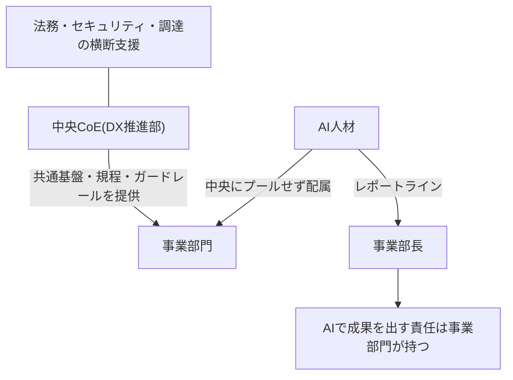
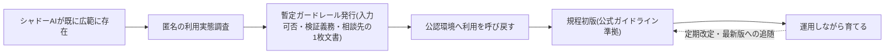

## ガバナンスの目的を「利用を止めること」と定義すると失敗する

AIガバナンスの目的を「リスクのある利用を止めること」と定義した瞬間に、設計は失敗する——というのが本ページの立場である。報道によれば、国際調査では労働者の大半が未承認のAIツールを業務で使用し、役職別では経営幹部の常用率が最も高い [src-2026-037]。ただし、この実態の定量的な裏付けは現時点でこの単一調査(の報道)に依拠しており、独立した追試はまだない。その留保つきで言えば、禁止令を出す側が最大の利用者である構図のもとでは、禁止は利用を消すのではなく見えなくする方向に働きやすい。つまり禁止は、統制ではなく実態把握の放棄になりかねない。

ガバナンスの正しい目的は、**安全に・速く使えるガードレールを提供し、利用を可視化された場所に呼び戻すこと**である。本ページは、そのための推進体制(ハイブリッド型CoE)、規程の作り方(国際枠組みと日本のガイドラインの使い分け)、検証義務化ライン、規程骨子テンプレを示す。

## 禁止してもAI利用は止まらない

(用語定義は用語集「シャドーAI」を参照)

> 📊 **データボックス(2026-06時点)**
> - 報道によれば、UpGuardが2025年に実施した2本の調査(米・英・加・豪・NZ・シンガポール・インドのセキュリティリーダーおよび一般従業員1,500人対象)で、80%超の労働者が未承認AIツールを業務で使用。セキュリティ専門職では約90% [src-2026-037]
> - 同調査で、労働者の半数が未承認AIを「日常的に」使用し、会社承認ツールのみを使う労働者は20%未満。経営幹部の常用率が最も高い [src-2026-037]
> - AIを「最も信頼できる情報源」とみなす従業員(約4分の1)ほどシャドーAIを日常業務に組み込む傾向(相関であり、因果の向きは特定されていない)[src-2026-037]

禁止アプローチは3つの歪みを生むと考えられる(この3分類に出典はない)。①**利用の地下化**。個人のスマホで生成AIに顧客名入りの問い合わせ文を貼り付けて下書きを作る——会社のログにはいっさい残らない。こうしてログも入力内容も把握できなくなり、統制の手段を自ら手放すことになる。②**検証文化の不在**。公認の利用がないため、AIの出力をどこまで確認してから使うかを部署で教え合う機会が生まれず、各自が自己流のまま使い続ける。組織としての検証の学習が始まらない。③**正統性の崩壊**。経営層自身が日常的に使っているなら、現場は禁止を建前と見抜き、規則そのものへの信頼が下がる。報道では、セキュリティ知識が高い従業員ほど過信からポリシーを無視する傾向も示され、研修だけでは抑止できない [src-2026-037]。「禁止すれば安全」という発想自体の解剖はアンチパターン集「禁止すれば安全」で扱う。

## 推進体制は中央にガードレール、人材は事業部門に置く

推進体制の設計は「中央集権か分散か」の二択ではない。米国連邦政府のCoE(Center of Excellence)が公開する組織設計ガイドは、ハイブリッド型を具体的に示している。すなわち、**AI実務者は中央にプールせず事業部門に配属し、事業部門のリーダーにレポートさせる**(サイロ化したAIチームの防止)。一方、**中央のCoEは共通ツール・開発環境・コードライブラリと、法務・セキュリティ・調達の支援を提供するが、実務者を貸し出す組織にはしない** [src-2026-027]。実行は、技術PMが率いる職能横断チームと、法務・財務・セキュリティ・調達を束ねる横断支援体制で構成し、高インパクトな用途から小さく始めて段階的に全社能力へ拡張する [src-2026-027]。

日本企業に読み替えると、「DX推進部が基盤・規程・ガードレールを持ち、AI人材は事業部に配属して事業部長にレポートさせる」型になる(この読み替えはガイドの記述そのものではなく、本サイトによる翻案である)。CoEを「人材派遣部隊」にしないという原則は重要だ。派遣型にすると、①CoEが各部の便利屋と化して基盤整備が止まり、②事業部側に当事者能力が育たず、③成果責任の所在が曖昧になる。AIで成果を出す責任は事業部門に置き、CoEはそれを速く安全にする側に徹する。

ハイブリッド型推進体制の構図を示す。CoEは人材を貸し出さず、ガードレールの提供に徹する。

## 規程は公式の枠組みを下敷きに作る

社内規程をゼロから書く必要はない。参照すべき公式文書は二つある。

第一に、米国NISTの生成AIプロファイル。AIリスクマネジメントフレームワークの生成AI版で、Govern/Map/Measure/Manageの4機能ごとに推奨アクションを提供し、ガバナンス・コンテンツ来歴・デプロイ前テスト・インシデント開示を主要領域とする。義務ではなく組織が選択適用する任意の枠組みである [src-2026-022]。条項の抜け漏れ検査に向く。

第二に、総務省・経済産業省「AI事業者ガイドライン」。本編(基本理念=why、指針=what)に加え、別添としてチェックリスト・ワークシート・事例集(how)を提供し、AI開発者・提供者・利用者の主体別に取り組むべき事項を整理する。AIを業務利用する一般企業は「AI利用者」として対象に含まれる [src-2026-056]。使い分けとしては、**規程の土台は日本のガイドライン(利用者向け事項+別添ワークシート)で作り、NISTプロファイルは検証・来歴・インシデント対応の条項を厚くする材料として使う**のがよい——この使い分けは両文書の性格から導いた提案であり、どちらかの公式文書が指定しているものではない。なおガイドラインは継続的に改定されるリビングドキュメントであり [src-2026-056]、参照する際は常に最新版にあたること。参照する側の社内規程にも、最新版に追随する改定手続が要る。文書番号・版数・公表日は時点依存の情報としてデータボックスに示す。

> 📊 **データボックス(2026-06時点)**
> - 日本: 「AI事業者ガイドライン」の最新版は第1.2版(総務省・経済産業省、2026年3月31日公表)。第1.0版(2024年4月)・第1.1版(2025年3月)から継続改定 [src-2026-056]
> - 米国: NIST生成AIプロファイルの文書番号はNIST AI 600-1(2024年7月26日発行)[src-2026-022]

規程・入力可否表の法的レビューと調達契約の出口条項審査における法務の持ち分は、部門別ガイド「法務のAIDX」を参照。

## どの利用に、どの重さの検証を義務付けるか

規程の中核は「どの利用に、どの重さの検証を義務付けるか」の線引きである。リスクの区分そのものは原理編「負債とスロップの分類学」の判定フロー(誤りが顧客・お金・法令に直接届くか)で定義しており、ここではその区分に検証義務を対応させる。以下の対応表に出典はなく、実務上の経験則である。

| リスク区分 | 典型例 | 検証義務 | 頻度・実施者の目安 |
|---|---|---|---|
| 高: 誤りが顧客・お金・法令に直接届く | 対外公表文・契約関連・財務数値・人事判断 | 人間検証必須(全件・検証者を記名・記録を残す) | 全件・配布/実行前。検証者は出力者と別の記名された担当者 |
| 中: 社内の意思決定に影響する | 会議資料・分析レポート・社内通知 | 送り手の自己点検を義務化+定期の抜き取り検査 | 自己点検は毎回。抜き取りは四半期ごとに部門あたり5〜10件を部門のAI推進担当が実施し、結果をCoEへ報告 |
| 低: 本人の作業内に閉じる | 下書き・アイデア出し・自分用の要約 | 自己点検のみ(配布時点で中以上に昇格) | 随時・本人 |

要点は「低リスク利用を軽くすること」にある。全利用に重い検証を課す規程は、守られないことで高リスク利用の統制まで道連れにする。(関連: アンチパターン集「ワークスロップ工場」=検証義務が未整備な組織で起きる典型症状。高リスク典型例の部門展開は、「人事判断」を採用業務に展開した例が部門別ガイド「人事のAIDX」、「対外公表文」を発信フローに展開した例が部門別ガイド「PR・広報のAIDX」、「財務数値」を統制再設計とセットで扱う例が部門別ガイド「経理財務のAIDX」にある)

## 規程の完成を利用解禁の条件にしない

ガバナンス整備は速くない。国際的な経営層調査では、ガバナンス体制の整備完了に1年超かかると見込む回答が多数派を占め、規制コンプライアンスが最大の障壁と認識されている(障壁としての比重は前回調査より増加)[src-2026-024]。ここから引き出すべき結論は「急げ」ではなく「**規程の完成を利用解禁の条件にするな**」である。整備に1年超かかる以上、「規程ができるまで全面禁止」は1年のシャドーAI放置と同義になる。暫定ガードレール(入力可否=入力禁止情報の定義、検証義務化ライン、相談先の3点だけの1枚文書)を先に出し、規程は使いながら育てるのが現実的な工程だ。

規程の完成を待たず、暫定ガードレールを先行させて利用を可視化された場所へ呼び戻す工程を示す。

> 📊 **データボックス(2026-06時点)**
> - 14か国2,773人(ディレクター〜Cスイート)対象のDeloitte調査(2025年1月公表)で、69%がガバナンス体制の整備完了に1年超かかると見込む [src-2026-024]
> - 同調査で、規制コンプライアンスが最大の障壁(38%、前回調査から10ポイント上昇)[src-2026-024]

日本の大企業はすでに「整備しながら使う」段階に入っている。

> 📊 **データボックス(2026-06時点)**
> - プライム上場・売上1,000億円以上の企業(部長クラス以上700名、2025年7月実施)で、生成AIを「全社的に導入している」企業は47.0%(前年26.4%)。部分導入を含む導入済みは95.6% [src-2026-050]
> - 「ほぼ全社員が生成AIを利用している」企業は18.5%で前年の6.3%から約3倍 [src-2026-050]
> - (母集団が大企業の部長以上に限定されている点に注意。全国の中小を含む実態とは乖離がある)

## 社内AI利用規程の骨子テンプレ(そのまま使える・9章構成)

そのまま章立てとして使える骨子を示す(編集部作成。AI事業者ガイドライン最新版の別添ワークシート・チェックリスト [src-2026-056] と突き合わせて肉付けすること)。

1. **目的と適用範囲** — 「安全に速く使うため」と明記する。禁止目的の規程にしない。対象者・対象業務・適用除外を定義
2. **利用の承認手続** — 承認済み利用環境の一覧の所在と、新規利用の申請・審査・追加の手順。審査の標準日数を明記(遅い審査はシャドーAIの最大の生産者)
3. **入力してよい情報・してはならない情報** — 社内のデータ分類(公開/社内/機密/個人情報)と対応付けた入力可否表。規程で最も参照される章
4. **利用区分と検証義務** — 本ページの検証義務化ラインを採用し、高リスク利用の全件検証・記名を義務化
5. **記録とインシデント報告** — ログの保全範囲、誤出力・情報漏えい時の報告先と報告期限。報告者を罰しない原則を明記
6. **調達・外部委託** — 外部ベンダーがAIを使う場合の開示義務・検証責任の契約条項
7. **教育と例外申請** — 入社時・年次の教育、規程でカバーされない用途の例外申請ルート
8. **改定手続と責任体制** — 改定の主管(CoE)・改定周期(半年〜1年)・経営承認の範囲。参照ガイドラインの版数を記載し改定に追随する
9. **取締役会への報告・監督** — 執行側(CoE・経営会議)とは別系統の監督ラインとして、AI起因の重大インシデント・規程の重要改定・全社利用状況の概況を取締役会へ定期報告する(頻度は半期〜年1回が目安)。この章は公式ガイドラインに直接の根拠条項がない、本サイト独自の追加である——執行を担うCoEに監督報告まで委ねると自己点検の構図になるため、内部統制の一般原則から加えた。本章の運用様式(半期1回の監督アジェンダ・報告事項5項目)は組織・人材編「取締役会の監督義務」のテンプレを参照

### 匿名利用実態調査の設問例(そのまま使える3問)

規程整備の初手となる匿名利用実態調査の設問例を示す(編集部作成)。

1. **用途**: 業務でAIツール(会社の承認外を含む)を何に使ったことがあるか(複数選択: 文章の下書き/要約・翻訳/コード作成/データ分析/アイデア出し/調べもの/使っていない)
2. **頻度**: 直近1か月の利用頻度(ほぼ毎日/週に数回/月に数回/使っていない)
3. **入力情報**: 入力したことがある情報の種類(公開情報のみ/社外秘の社内情報/顧客・取引先の情報/個人情報/入力したことはない)

回答は匿名であること・回答内容を処罰に使わないことを調査文面で確約する。正直な回答が得られなければ、調査は実態把握ではなく建前の確認に終わる。

## 体制と期間の目安

出典のある標準はなく、以下の数字は出典のない実務上の目安である。**中堅(数百〜1,000人規模)**: CoEは専任2〜3名(リーダー+基盤・規程担当)に、法務・情報システム・人事からの兼任3〜5名を加えた構成で立ち上がる。**大企業(数千〜1万人規模)**: 専任5〜10名(リーダー+基盤・規程・教育・部門支援の機能分担)に、法務・情報システム・人事・調達からの兼任5〜10名が目安で、事業部門側の推進担当は部門数に比例して増える。数万人規模・複数事業会社のグループでは、中央CoEが規程と基盤を一元管理し、事業会社ごとにサブCoEを置く連邦型(中央+事業会社)が現実的である。いずれの規模でも、事業部門側には**各部に兼任のAI推進担当1名**を置き、レポートラインは事業部長に向ける(前掲の政府系ガイドの原則 [src-2026-027] の適用)。期間は、暫定ガードレール発行まで1か月、規程初版まで3か月、体制整備の完了までは1年超を見込む [src-2026-024]。決裁の目安: 暫定ガードレールと規程初版は経営会議の承認事項、運用細則の改定はCoE主管で足りる。

## 今日からやること

- 【今すぐ】【推進担当】匿名の利用実態調査を実施する。禁止下でも使われている前提で、部門別の利用率と用途を把握する。道具: 匿名アンケート(本ページの設問例3問=用途・頻度・入力情報。処罰しないことを明記)。完了条件: 部門別の利用実態・用途一覧が経営会議に報告される
- 【今すぐ】【経営】暫定ガードレールを1枚文書で発行する。道具: 骨子テンプレの第3章(入力可否)・第4章(検証義務化ライン)に相談先(問い合わせ・例外申請の窓口)を添えた先行版。完了条件: 全社周知され、承認済み利用環境が最低1つ提供される
- 【1年以内】【推進担当】規程初版をAI事業者ガイドライン(最新版)の別添チェックリストと対応付けて起草し、NISTプロファイルで検証・インシデント条項を補強する。完了条件: 経営会議承認
- 【1年以内】【部門長】自部門のAI推進担当を任命し、成果責任が部門側にあることを目標設定に反映する。完了条件: 任命とCoEとの定例接続
- 【待て】【経営】CoEへのAI人材の集約・抱え込み。事業部門に検証能力と当事者意識が育つまで、CoEは基盤と規程の提供に徹する

**この主張が崩れる条件**: 全面禁止ポリシーを敷いた組織群で、未承認利用が実際に大幅に減り、かつ可視化された統制下の組織と同等以上の安全性・業務成果を示した追跡データが出てきた場合、「禁止で利用が消える前提は置けない」という本ページの前提は崩れる。

(関連: 原理編「負債とスロップの分類学」=高リスク判定の判定フローを定義/アンチパターン集「禁止すれば安全」=一律禁止が未承認利用を統制外へ潜らせる失敗形/ロードマップ編「最初の90日」=本ページの【今すぐ】を初動90日の週次に割り付けた統合ガイド)

<!--
執筆メモ(2026-06-11):
- シャドーAI統計(src-2026-037)はreliability: mediumのため、本文・データボックスとも「報道によれば」帰属を付けた。結論は「禁止は地下化を招く」という構造記述で自立させ、数値はデータボックスに隔離。「AIを信頼する層ほど常用」は相関である旨を注記。
- 「禁止が生む3つの歪み」「検証義務化ライン(頻度・実施者列含む)」「規程骨子9章(第9章=取締役会監督は本文中でも見立て+無根拠条項である旨を明示)」「CoE規模感(2レンジ+連邦型)」「暫定ガードレール先行発行」「利用実態調査の設問例3問」は全面的に編集部の見立て。出典は禁止の実効性欠如(037)・整備期間(024)・体制原則(027)による間接的裏付けのみ。
- リスク区分(顧客・お金・法令)は原理編debt-slop-taxonomyのQ3が正本。本ページでは再定義せずテキスト参照し、検証義務の対応付けのみ追加(単一情報源ルール対応)。
- 「禁止すれば安全」アンチパターンの正本はアンチパターン集「禁止すれば安全」(公開済み。2026-06-11 統合作業で「※今後公開」を解消)。本ページでは歪みの列挙にとどめ深掘りしない。
- src-2026-050は母集団限定(プライム上場・売上1,000億以上・部長以上)をデータボックス内に注記。
- NIST AI 600-1・AI事業者ガイドラインの「使い分け」(背骨=日本ガイドライン、補強=NIST)は見立てマーカー付き。両文書とも法的拘束力なしはsources のjp_note/key_facts に基づく。
- 内部リンクは規約によりテキスト参照のみ。

改稿メモ(2026-06-11 レビュー第2陣・指示1〜7反映):
- 指示1(必須・V1): 69%/38%/+10pt [src-2026-024] を本文から「工程の現実感」節のデータボックスへ隔離。本文は「1年超かかると見込む回答が多数派」「規制コンプライアンスが最大の障壁」の構造記述に置換。
- 指示2: 結論節に「単一調査(の報道)に依拠・独立した追試なし」の開示1文を追加し、summary・結論の「禁止は機能しない」断定を見立てマーカー付きの慎重表現に弱化。結論本文の「8割超」も傾向表現(大半)に置換(数値はデータボックス側に既存)。
- 指示3: 第1.2版・公表日・NIST AI 600-1・発行日を「規程の作り方」節の新設データボックスへ。本文・実行素材・アクションは「最新版を参照」の構造記述に統一。
- 指示4: 検証義務化ライン表に「頻度・実施者の目安」列を追加(節全体が見立て宣言済み)。
- 指示5: 匿名利用実態調査の設問例3問(用途・頻度・入力情報)を実行素材化し、アクション第1項の道具から参照。
- 指示6: 規程テンプレに第9章「取締役会への報告・監督」を追加(8章は無改変、9章構成に改題)。出典なしのため見立て+無根拠条項である旨を章内に明記。
- 指示7: CoE規模感を中堅(数百〜1,000人)/大企業(数千〜1万人)の2レンジ化し、数万人規模の連邦型CoE(中央+事業会社)に1行言及。
- 付随: 暫定ガードレールの構成をフレーム台帳の正本定義(入力可否+検証義務+相談先)に一致させた(従来は2点と記載しズレていた)。

2026-06-12 文体改修: 格言調見出し平易化・内部用語排除・見立て定型句を自然文に置換
-->
