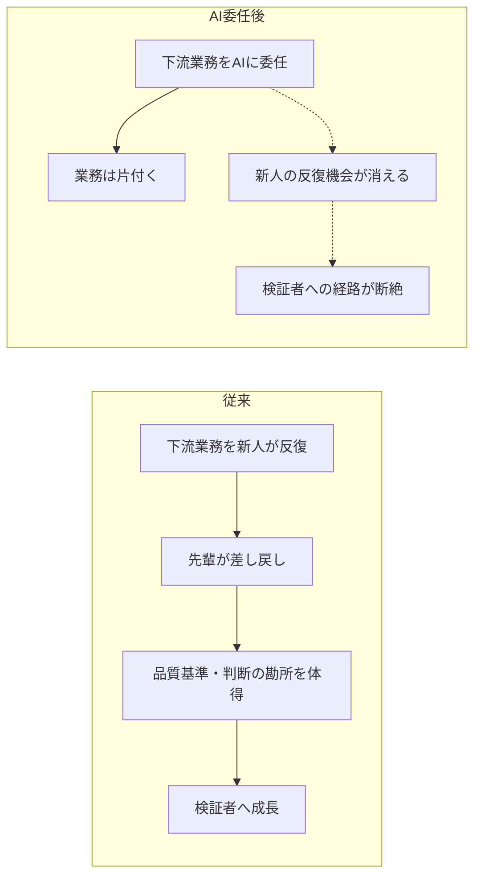
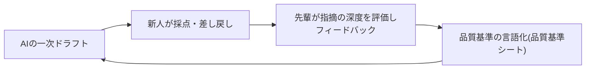

## 生産性が上がる一方で、人が育つ入り口が壊れる

AIによる業務代替には、ほとんどの経営指標に映らない副作用がある。組織の「現在の生産性」を引き上げながら、「将来の人材供給」を静かに毀損しうることだ。新人が最初に担ってきた下流業務——議事録、一次ドラフト、データ集計、定型対応——は、AIが最も得意とする領域と重なる。そこをAIに渡すと、効率は確実に上がる。しかし、その業務は単なる作業ではなく、人が判断力を獲得するための暗黙の訓練装置でもあった。

数年後にAIに乗れている会社とは、最も高性能なツールを選んだ会社ではなく、AIの出力を検証できる人材を育て続けられた会社である——本ページはこの立場を取る。以下では、この「育成パイプライン問題」の証拠と機序、そして再設計の方向を示す。

## 異変を検出した研究と、否定する研究が対立している

先に断っておくと、この問題のエビデンスは現在対立しており、学術的に未決着である。

異変を検出した側の代表が、スタンフォード大学Digital Economy Labの研究(2025年11月改訂版)である。米国最大の給与計算プロバイダーの個人レベル高頻度ペイロールデータを分析した結果、AI曝露度が最も高い職種(ソフトウェア開発者、カスタマーサービス担当等)の22〜25歳の若年労働者は、企業レベル要因を統制した後でも大幅な相対的雇用減少を経験していた[src-2026-016]。一方、AI曝露度の低い分野や、同じ曝露職種でも経験豊富な労働者の雇用は安定または成長を維持しており[src-2026-016]、影響は「入り口」に集中している。(関連: 曝露職の代表に挙がるソフトウェア開発の最先行部門の事例は、部門別ガイド「開発・エンジニアリングのAIDX」を参照)

慎重な側の代表が、イェール大学The Budget Labの分析(2025年10月公表)である。政府統計とAI利用実データを突合した結果、対話型AIの一般公開から約3年時点で、労働市場全体にはAIによる識別可能な混乱は観察されておらず、職業別のAI曝露度と失業率の間に明確な関係も確認されなかった[src-2026-017]。ただし同分析も、20〜24歳の新卒層と25〜34歳層の職業構成の乖離が直近で速く拡大しており、若年層へのAI影響と整合的な可能性があると指摘する——労働市場全体の減速の反映やサンプルサイズの小ささにも留意が必要との但し書き付きで[src-2026-017]。

| | スタンフォード Digital Economy Lab [src-2026-016] | イェール The Budget Lab [src-2026-017] |
|---|---|---|
| **対象データ** | 米国最大の給与計算プロバイダーの個人レベル高頻度ペイロールデータ | CPS等の政府統計+AI利用実データの突合 |
| **結論** | AI曝露職種の22〜25歳に限って大幅な相対的雇用減。経験豊富な層・低曝露分野は安定 | 労働市場全体に識別可能な混乱なし。曝露度と失業率に明確な関係なし |
| **限界** | 単一プロバイダーのデータに依拠。報告値は版の改訂で変動(下記データボックス参照) | 若年層の職業構成乖離は「兆候」として自ら留保。サンプルサイズの小ささに言及 |

> 📊 **データボックス(2026-06時点)**
> - AI曝露度が最も高い職種の22〜25歳: 約16%の相対的雇用減(Stanford Digital Economy Lab、2025年11月改訂版。初版2025年8月時点の報告値は約13%)[src-2026-016]
> - 対話型AI一般公開から33か月時点で、労働市場全体に識別可能な混乱は観察されず(The Budget Lab at Yale、2025年10月)[src-2026-017]

両者を併せると、現時点の整理は「労働市場全体は安定しているが、入り口の若年層に異変の兆候がある」となる。断定はできない。ただし育成には数年かかるため、兆候が確定的な統計になってから動いたのでは間に合わない。

## 企業側も自覚し始めている — ただし悲観一色ではない

企業側の認識を定量化したのが、ペンシルベニア大学ウォートン校による年次調査(従業員1,000人超・売上5,000万ドル超の米国企業のシニアリーダー約800人対象、2025年10月公表)である。リーダーは生成AIの影響が最も大きいのはジュニア職と予測し、意図的な役割設計・コーチング・練習時間がなければ「スキル萎縮(skill atrophy)」が起きると相当数のリーダーが警告している[src-2026-026]。

一方で悲観一色ではない。同調査では、インターン採用を減らすと見込む企業は少数派で、増やすと見込む企業がそれを大きく上回る。また大多数のリーダーは生成AIを「スキルを置き換える」ものより「スキルを高める」ものと認識している[src-2026-026]。つまり企業の多数派は、若手の入り口を閉じる気はない。問題は採用の有無ではなく、入った後に「何で育てるか」が空洞化することにある。

> 📊 **データボックス(2026-06時点)**
> - スキル萎縮(skill atrophy)を警告するリーダー: 43%(Wharton/GBK年次調査、2025年10月)[src-2026-026]
> - インターン採用の見込み: 増加49% vs 減少17%(同調査)[src-2026-026]
> - 生成AIへの認識: 「スキルを高める」89% vs 「スキルを置き換える」71%(同調査)[src-2026-026]

## なぜ起きるか — 業務と一緒に訓練機会が消える

ここからは、なぜそうなるかの機序を整理する。この機序に直接の実証ソースはなく、次節の先行指標で各社が自社検証できる形にした仮説である。従来の育成は、明示的な研修よりも「下流業務の反復」に依存してきた。新人は一次ドラフトを書き、先輩に直され、なぜ直されたかを体で覚える。この反復が、品質の基準・業務の文脈・判断の勘所を移転する暗黙の訓練装置だった。AIがその下流業務を代替すると、業務は確かに片付くが、訓練装置だけが静かに消える。誰も育成を止める決定をしていないのに、育成が止まる——これがこの問題の検出しにくさの核心である。

従来の暗黙の訓練装置と、下流業務のAI委任後に検証者への経路が断絶する機序を対比する(前述の仮説の図解である)。

この仮説と整合するデータもある。スタンフォードの研究では、雇用減少はAIが人間の労働を「増強」するのではなく「自動化」する用途が多い職種に集中していた[src-2026-016]。また、AI開発企業Anthropicが自社の対話型AIの利用データを分析したレポート(2026年1月公表)では、直近で増強(協働)型への揺り戻しが観測されたものの、基調としては自動化(委任)型の拡大傾向が続くと分析されている[src-2026-023]。ただしこれはベンダー自身による自社プラットフォームデータの分析であり、利用者層が技術職に偏るバイアスがある点には留意が必要だ[src-2026-023]。その留保を置いた上でも、自動化が進む業務とは、まさに新人が最初に任されてきた業務である。

> 📊 **データボックス(2026-06時点)**
> - Anthropic自社プラットフォームの利用分類: 2025年11月時点で増強52%(5pt上昇)・自動化45%(4pt低下)。同年8月は自動化優位で、約1年前比では自動化シェアは依然高水準[src-2026-023]

### この仮説を自社で検証する先行指標

「訓練機会の消失」は直接の実証ソースがない仮説である。だから、各社が自社で検証できる先行指標を添える(指標の設計にも出典はない)。

- **新人の一次ドラフト作成量**: 議事録・報告書・提案書等を新人自身がゼロから書いた本数(年間)。人事評価資料や文書管理システムの作成者ログで測れる
- **差し戻し率と指摘の深度**: 先輩レビューによる差し戻しの頻度と、指摘が「表記→構成→事実関係→判断」のどの層まで届いているか
- **訓練価値業務の残存率**: 後述の判定3問で「訓練価値が高い」とされた業務のうち、新人の担当に残っている割合

これらの指標が自社で低下していなければ、本仮説はあなたの会社には(まだ)当てはまらない。逆に、生産性指標が改善しながらこれらが沈んでいるなら、訓練機会の消失が進行中である。

## 日本では影響がより大きく出やすい

この問題は日本でより深刻に増幅されうる。新卒一括採用・メンバーシップ型雇用の下では、人材供給の入り口が事実上「新卒配属後の下流業務」に一本化されているため、そこが毀損すると中途市場で補う米国型の調整が効きにくい。米国の研究が観察した採用減・雇用削減という調整[src-2026-016]は、日本では「新卒採用枠の縮小」や「配属業務の変質」として、より見えにくい形で現れる可能性がある(米国研究からの推論であり、日本の直接データはまだない)。

構造的な弱点も重なる。IPAの調査分析ペーパー(2025年10月公表)によれば、日本企業の大多数でDXを推進する人材が不足しており、米独と比べて著しく高い水準にある。同ペーパーは、従来型の雇用関係から「スキルをベースに評価や役割を決定するダイナミックな関係」への変革を提言している[src-2026-055]。スキルが評価・処遇に結びつかない構造のままでは、若手が検証能力を磨く動機も組織側の育成投資も生まれにくい。

さらに利用実態には職位の偏りがある。パーソル総合研究所の調査(正規雇用就業者3,000名対象、2025年10月実施・2026年2月公表)によれば、生成AIの業務利用率は職位別に見ると山型の分布を描く。部長・課長のミドルマネジメント層で最も高く、意思決定層である役員・社長と、育成対象である一般社員層の双方で低い[src-2026-052]。つまりAI利用はミドルに偏在し、これから判断力を獲得すべき若手と、AI前提の組織を設計すべき意思決定層の双方に届いていない。この分布は、育成パイプラインにとって二重の悪材料だと読める。一般社員層の利用率の低さは「AIと協働しながら学ぶ機会」自体が若手に行き渡っていないことを意味し、経営層の低さは、育成の再設計を主導すべき層がAIの実務感覚を持たないまま意思決定することを意味する。

> 📊 **データボックス(2026-06時点)**
> - 日本企業のDX推進人材の不足: 85.1%(IPA調査分析DP2025-02、2025年10月)[src-2026-055]
> - 生成AIの業務利用率(全体): 32.4%(パーソル総合研究所、2025年10月実施・2026年2月公表)[src-2026-052]
> - 職位別利用率(山型分布): 部長クラス62.0%・課長クラス58.3%>役員クラス43.6%・代表取締役/社長40.2%・一般社員/従業員35.5%[src-2026-052]

## 育成を明示的な設計対象に変える3つの方向

対策の本質は下流業務の温存ではなく、育成を業務の副産物から明示的な設計対象に変えることである。方向は3つある(いずれも出典のない提案であり、自社のパイロットで検証しながら使ってほしい)。

**① 「型稽古」として意図的に残す業務を選定する。** すべての下流業務をAIに渡すのではなく、判断力の獲得に効く業務を訓練用として意図的に残す。ウォートン調査の「意図的な役割設計・コーチング・練習時間がなければスキル萎縮が起きる」という警告[src-2026-026]は、まさにこの設計の必要性の論拠である。効率だけを基準に代替範囲を決めると、訓練価値の高い業務から先に消える。仕分けには次の2×2を使う(この整理に出典はない)。

| 訓練価値 \ AI代替効率 | 高(AIが安く速く代替できる) | 低(人がやるほうが早い) |
|---|---|---|
| **高(判断力の獲得に効く)** | **設計し直す** — 丸ごと渡さない。型稽古として一部を残すか、「AIの一次ドラフトを新人が差し戻す」形に転換して訓練機能を再実装する | **残す** — 従来通り人が担い、育成の中核業務として明示的に位置づける |
| **低(単純反復で学びが薄い)** | **渡す** — AIに委任して効率を取る。ためらう理由がない | (参考)代替も訓練も優先度が低い。業務自体の要否を見直す |

営業(同行・テレアポ・議事録)は訓練装置とAI委任候補の重なりが特に大きい部門の代表であり、この仕分けの部門展開は部門別ガイド「営業のAIDX」を参照。

**② 最初から「検証者」として鍛える。** AIの出力を採点し、差し戻す訓練を育成課題として正式に組み込む。一次ドラフトを書く経験が減るなら、先輩が新人を直してきた構図を「新人がAIを直す」構図に置き換え、品質基準の言語化と判断根拠の説明を求める。これは従来の暗黙の訓練装置の機能を、明示的な形で再実装する試みである。具体的なプログラムの雛形を示す(そのまま1部門のパイロットに使える)。(関連: 組織・人材編「実行者から検証者・設計者へ」)

「先輩が新人を直す」構図を「新人がAIを直す」構図に置き換えた育成ループを示す。

| 課題 | 内容 | 頻度 | 評価方法 | 先輩側工数(目安) |
|---|---|---|---|---|
| AI一次ドラフトの差し戻し演習 | 実業務の文書(議事録・報告書・顧客返信)のAI一次ドラフトを新人が採点し、差し戻しコメントを書く | 週2本×12週 | 指摘の深度(表記→構成→事実関係→判断の4層のうち何層まで指摘できたか)と的中率 | 1本あたり15〜30分のレビュー |
| 品質基準シートの作成 | 担当業務の「良い成果物の条件」を新人が5項目で言語化し、先輩の暗黙基準と突合する | 月1回更新 | 先輩基準との一致度+新人側から追加された観点の数 | 月30分の突合会 |
| 判断根拠の口頭説明 | 差し戻し・採用の判断理由を3分で説明する | 隔週 | 「なぜそう判断したか」を2段掘り下げて答えられるか | 同席15分 |

体制と期間の目安(この目安に出典はなく、実務上の経験則である): パイロットは1部門・新人3〜5名・12週間。先輩側の追加工数は週2〜3時間で、部門長決裁で開始できる規模に収まる。全社展開の判断は、パイロットで先行指標(指摘の深度)が改善したことを確認してからでよい。育成制度の所管としてこの再構築を主管するのは人事である(関連: 部門別ガイド「人事のAIDX」)。

**③ AIとの協働を前提に習熟段階を再定義する。** 9割以上のICT職種で主要スキルの過半がAIによって変化する可能性が指摘されている以上[src-2026-055]、「何年目に何ができるか」の定義自体を作り直す必要がある。IPAが提言するスキルベースの評価制度と実践型学習の拡充[src-2026-055]を、若手の検証能力の習熟段階と接続することを推奨する。

3方向の着手順を時間軸で整理する。

| 再設計の方向 | 今すぐ | 1年以内 | 能力向上を待て |
|---|---|---|---|
| ① 型稽古の選定 | 若手業務の棚卸しと2×2での仕分け | AI代替の意思決定プロセスに「訓練価値」の観点を常設 | — |
| ② 検証者として鍛える | 1部門でパイロット設計・開始 | 新人育成プログラムの正式課題化と品質基準シートの整備 | 全社展開はパイロットの先行指標改善を確認後 |
| ③ 習熟段階の再定義 | 現行の等級要件・OJT基準の点検 | 検証能力を含むスキルベース評価との接続を設計 | 等級・評価制度本体の改定は②の事例蓄積を待つ |

## 90日でやること

- 【部門長】【推進担当】(今すぐ)新人・若手が直近1年で担っていた業務を棚卸しし、上の2×2マトリクスで「残す/渡す/設計し直す」に仕分ける。判定には次の3問を使う(この3問に出典はない): ①この業務の失敗は先輩のフィードバックで補正される構造になっているか ②この業務を1年続けた人と続けなかった人で判断の質に差がつくか ③この業務で身につく基準は他の業務に転用できるか——2問以上Yesなら訓練価値が高い。完了条件: 「設計し直す」象限の業務リストが部門長承認済みであること
- 【CHRO・人材開発】(今すぐ)生成AIの利用率を職位別に測る。道具: 既存の従業員サーベイへの設問追加。完了条件: 自社の職位別分布が出て、調査が示す山型(ミドル偏在)[src-2026-052]と同様に「若手と経営層の双方が低い」状態かどうか判定できること。偏在が確認されたら、若手への利用機会(ライセンス・演習時間)の付与を次四半期の人材開発計画に入れる(利用率と業務組み込み率の2軸で定着を測る計測設計は組織・人材編「抵抗と定着」を参照)
- 【CHRO・人材開発】【部門長】(1年以内)「AI出力の採点・差し戻し」を新人育成プログラムの正式課題として設計し、1部門・新人3〜5名・12週でパイロットする。道具: 上のプログラム表と品質基準シート。完了条件: 先行指標(指摘の深度・一次ドラフト作成量)の測定値が四半期で取れていること。意図的な役割設計と練習時間の確保がスキル萎縮の予防条件である[src-2026-026]
- 【経営】(能力向上を待て)エントリー層の雇用影響を理由とした新卒採用枠の大幅な縮小。学術的にはマクロの混乱は確認されておらず[src-2026-017]、企業側もインターン採用は増加見込みが減少見込みを上回る[src-2026-026]。確定していない悲観論で入り口を自ら閉じることこそ、将来の検証能力の供給を断つ最大のリスクである

**この主張が崩れる条件**: 自社の先行指標(新人の一次ドラフト作成量・差し戻し指摘の深度・訓練価値業務の残存率)が低下しておらず、かつ米国の若年層雇用減の検出が今後の改訂・追試で消えた場合、「育成パイプラインの危機」は本ページの過剰反応であり、育成投資の積み増しより通常の業務効率化を優先してよい。

<!--
執筆メモ(ソースが薄い箇所・レビュー重点ポイント):
- 「下流業務の反復=暗黙の訓練装置」という中核の機序は全面的に編集部の見立てであり、直接の実証ソースがない。本文で見立てと明示した上で、反証用の先行指標3つを併記して反証可能性を担保した(2026-06-11改稿)。
- 職位別利用率は2026-06-11のレビューで事実誤認を修正済み: 旧版の「上位職位ほど高い」は誤りで、原典[src-2026-052]は部長62.0%・課長58.3%>役員43.6%・社長40.2%・一般35.5%の山型分布(ミドル偏在)。本文は「ミドルに偏在し、若手と意思決定層の双方に届いていない」に書き直した。
- 日本特有の増幅要因(新卒一括採用・メンバーシップ型雇用で入り口毀損が全社に直結)は、src-2026-016のjp_noteの示唆を編集部見立てとして展開したもの。日本の新卒採用動向の一次データ(リクルートワークス等)が未収集。/aidx-research で補強したい。
- src-2026-023はAnthropic自身による自社プラットフォームデータの分析。改訂後の2層ルール(publisherは開示義務)に従い本文で社名と技術職偏重バイアスを明示した(2026-06-11改稿)。
- Stanford 16%は2025年11月改訂版の数値(初版は13%)。今後さらに改訂される可能性があるため、数値はデータボックスに隔離済み。review_by 時に最新版を確認すること。
- 2×2マトリクス・先行指標・検証者育成プログラム表・判定3問・規模感はいずれも出典のない編集部の見立て(本文にマーカー明示済み)。パイロット実績が出たらミニケースとして差し替えたい。

2026-06-12 文体改修: 格言調見出し平易化・内部用語排除・見立て定型句を自然文に置換
-->
