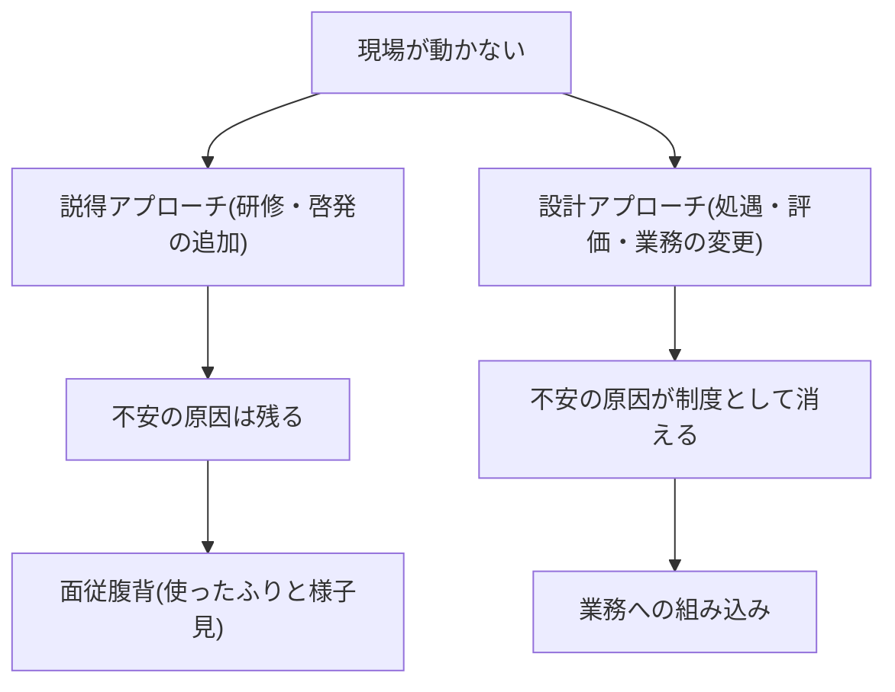
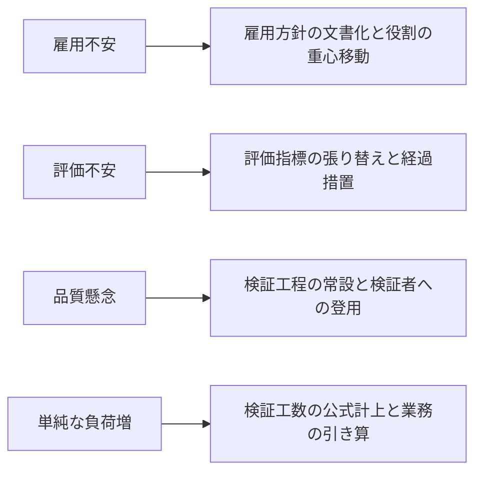
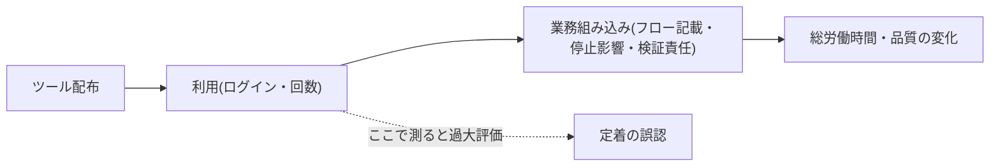

## 抵抗は合理的な反応であり、説得では解けない

ツールを配り、研修をやり、それでも現場が使わない。このとき推進側が口にする「現場の理解が足りない」という診断が、定着失敗の最初の誤りである。働く側から見れば、AIへの委任は自分の雇用・評価・熟練の価値に直接触れる変化であり、損得が設計で確定していない段階で様子見するのは合理的な防衛行動である。非合理なのはむしろ、「合理的な懸念を説得で上書きできる」という推進側の想定のほうである——という整理が本ページの出発点になる。

したがって処方は説明の量を増やすことではなく、懸念の原因を制度と業務の設計で消すことである。本ページは、抵抗の実態データ、抵抗の4類型と処方、上層(役員・部門長)の抵抗への手当と縮退手順、降格と受け取られない伝え方、定着の計測、そしてそのまま使える雇用方針文書の文例と部門説明会の構成案を提供する。

説得アプローチと設計アプローチの帰結の違いを示す。

**別添一覧(このページ+別添3枚で部門説明会に出られる)**: ①雇用方針文書(本ページの文例A/B・中間形から作成し、役員会決議を経たもの)②業務分解ワークシートの記入例1枚(組織・人材編「業務分解×再配置プレイブック」=現場参加型の分解3手順を定めたページ)③新旧指標並走・経過措置の説明1枚(組織・人材編「実行者から検証者・設計者へ」=労務リスク・3役割を定めたページ)。

## 不安と未利用が併存している — 実態データ

データが示す構図は「不安が高く、しかも使っていない」の併存である。米国の大規模調査では、職場での将来のAI利用に不安を抱く就業者が期待を抱く層を上回り、自分の長期的な雇用機会が減ると見る層が増えると見る層を大きく上回る。その一方で、AIを業務でほとんど使っていない層が過半を占める[src-2026-115]。国内でも、生成AIを業務利用する就業者は一定数にとどまり、非利用の理由は「必要性を感じない」「使い方がわからない」「使える業務をイメージできない」が上位に並ぶ[src-2026-052]。利用経験自体も米国に比べ大きく低い[src-2026-047]。

国内の組織現場の一次資料もこれを裏づける。総務省のワーキンググループ資料によれば、生成AIを本格運用する先行自治体でも積極的に利用する職員とそうでない職員への二極化が観測され、未導入団体では生成物の正確性への懸念や幹部間の意見対立が導入判断を止めている[src-2026-111]。配布しても浸透は自動では進まず、経営層の足並みの乱れ自体が定着の阻害要因になる。

未経験と不安の併存は、重要な含意を持つ。不安の相当部分は「使った上での評価」ではなく「使ったことがないまま想像する変化」への反応であり、安全な体験機会の提供は説得よりも先に置くべき前提条件である。

> 📊 **データボックス(2026-06時点)**
> - 職場での将来のAI利用に「不安」52% vs「期待」36%。AIで自分の長期的な雇用機会が「減る」32%・「増える」6%。AIチャットボットを業務でほとんど/全く使わない55%(Pew Research Center、米国就業者5,273名、2024年10月実施)[src-2026-115]
> - 生成AIの業務利用率32.4%、週4日以上の利用は11.7%。非利用理由の上位は「必要性を感じない」「使い方がわからない」「使える業務をイメージできない」(パーソル総合研究所、正規雇用就業者3,000名、2025年10月実施)[src-2026-052]
> - 個人の生成AIサービス利用経験: 日本26.7%、米国68.8%(総務省 令和7年版情報通信白書、2024年度調査)[src-2026-047]
> - 先行自治体で職員利用の二極化を報告(北海道当別町)。未導入団体の課題は生成物の正確性への懸念・予算説明の困難・幹部間の意見対立(総務省 自治体AI利用WG資料、2025年3月)[src-2026-111]

## 抵抗の4類型と処方

抵抗を一塊の「現場の意識の問題」として扱うと、処方がすべて研修になる。そこで抵抗を4類型に分け、それぞれ別の設計で解く。この4類型に出典はなく、処方の宛先を本サイトの該当ページへ振り分けるための整理である。

| 類型 | 典型的な声 | 背後にある合理性 | 処方(詳細を扱うページ) |
|---|---|---|---|
| **雇用不安** | 「結局、人減らしの準備だろう」 | 委任の拡大が要員計画にどう響くか、会社が明言していない | 雇用方針の文書化(本ページ)+人を減らさず役割の重心を移す設計(組織・人材編「実行者から検証者・設計者へ」) |
| **評価不安** | 「AIに任せたら自分の評価が下がる」「長年の熟練が無価値になる」 | 評価指標が処理件数・作成量のままなら、委任は自分の評価原資を手放す行為になる。熟練者ほど失うものが大きい | KPIの張り替えと新旧指標の並走・経過措置(組織・人材編「実行者から検証者・設計者へ」労務リスク節)。熟練の言語化を品質基準シートの作成という役割に転化する(組織・人材編「新人が育たない問題」) |
| **品質懸念** | 「AIの出力は信用できない。事故が起きる」 | 検証の仕組みが見えないまま委任だけ進めば、事故の責任は現場に落ちる。懸念はリスク感度の現れ | 検証は必ず人間に残す再配置(組織・人材編「業務分解×再配置プレイブック」)+検証義務の明文化(組織・人材編「推進体制とガバナンスの設計図」)。懸念の強い人を検証者候補として取り込む |
| **単純な負荷増** | 「覚える時間も検証する時間もない。仕事が増えるだけ」 | 移行期は旧業務と新手順が二重に走る。検証工数を業務として計上しなければ実質のサービス残業になる | 検証工数の公式計上と業務の引き算(組織・人材編「業務分解×再配置プレイブック」手順3)。委任で浮いた時間の使途を本人と合意する |

4類型から処方への対応を図示する。

運用上の要点は2つ。第一に、類型の診断は説明会の質疑と個別ヒアリングで行う——どの類型が支配的かは部門で異なり、診断を誤ると処方がすべて空振りする。第二に、品質懸念は抵抗の中で唯一、そのまま戦力化できる。AIの出力を疑う人は検証者の素質要件をすでに半分満たしており、「反対する人」から「基準を言語化する人」への転換が最も筋のよい取り込みである。

なお、この4類型は網羅を主張しない。たとえば利用ログ・検証記録が監視や人事評価に転用されることへの不安、入力した個人情報・業務データの扱いへの不安は独立の類型になりうるが、本ページでは処方が共通する評価不安・品質懸念の側に含めて扱い、ログの利用目的の限定・入力可否の線引きは組織・人材編「推進体制とガバナンスの設計図」(暫定ガードレールに入力可否と検証義務を明記)に委ねる。診断時に4類型のどれにも収まらない声が出たら、類型に押し込まず、その懸念を扱うページを個別に探すこと。

## 役員・部門長側の抵抗にも手当てが要る

本ページの説明会設計は「話し手(経営・部門長)は推進側である」ことを前提にしているが、自社で引用しているデータはこの前提を無条件には支持しない。国内の職位別利用分布では役員層の利用率は部課長層を下回り、経営層では「活用イメージの不足」が阻害要因として顕著である[src-2026-052]。未導入自治体では幹部間の意見対立そのものが導入判断を止めている[src-2026-111]。話し手自身が様子見層である場合、説明会は「信じていない人が原稿を読む場」になり、質疑で確実に見抜かれる。

処方は現場と同じで、説得ではなく設計である。第一に、役員・部門長自身の業務で先に体験させる。経営層の阻害要因が活用イメージの不足である以上、必要なのは啓発研修ではなく、自分の業務(資料レビュー・報告ドラフトの確認等)での委任と検証の実体験である。部門長には、全社展開の前段に「自部門業務での体験+説明会のリハーサル」をセットにした事前セッションを置く。第二に、雇用方針の役員会決議(後述の文例・決議雛形)自体を役員の当事者化の装置として使う——決議に名を連ねた役員は、以後この方針を他人事として扱えない。第三に、役員間の意見対立が解けない場合は全社一斉を諦め、推進に同意した部門長の部門だけで先行し、結果(業務組み込み率・質疑ログ)を役員会の定例報告に載せて外堀から埋める(取締役会側の枠組みは組織・人材編「取締役会の監督義務」=半期の監督アジェンダで台帳分布・検証の機能を確認、を参照)。

**部門長が話せない場合の縮退手順**: 雇用方針が役員会未承認のまま部門説明会を開いてはならない——最大の質問(「人を減らすのか」)に答えられない説明会は、不信を組織として確定させてしまう。縮退の順序は次の3段である(この手順に出典はない)。①説明会を延期し、雇用方針の役員会承認を先に取りに行く(【CHRO】が後述の決議雛形3行で起案)。②承認に時間がかかる場合、説明会は開かず、範囲を「希望者による業務分解パイロットの参加募集」に縮小する——雇用・評価に触れる約束を一切せず、分解の体験だけを先行させる。③その場合も「雇用方針は役員会で審議中であり、[期限]までに文書で示す」と、未確定であることと確定期限を明示する。未確定をぼかした全体説明会より、範囲を絞った正直なパイロット募集のほうが信頼の損耗が少ない。

## 「降格と受け取られない」役割変更の伝え方

役割の重心移動は、設計を誤ると「実行の第一線から検証係に回された」という降格の物語として受け取られる。制度側の手当——不利益変更性への配慮、新旧評価指標の並走と経過措置、労使協議・本人への事前説明——は組織・人材編「実行者から検証者・設計者へ」の労務リスク節で扱っており、本ページでは繰り返さない。ここでは伝え方の設計だけを足す。

原則は3つである。**①決めてから告げず、決める前に参加させる。** 業務分解を現場参加型で行うこと自体が最大の伝達手段である——自分で分解した業務の委任は「奪われた」にならない(現場参加型の方法は組織・人材編「業務分解×再配置プレイブック」で説明している)。**②変わらないことを先に文書で確定する。** 雇用・等級・賃金の方針は口頭の安心材料ではなく配布文書で示す。書面にできない約束は、現場から見れば存在しないのと同じに扱われる。**③検証者への任命を選抜として扱う。** 任命の根拠(品質基準を言語化できる実務経験)と、品質の最終責任者であることを職務定義書上も明示し、処遇の維持以上とセットで提示する。「手が空いた人に検証をやらせる」運用が一度でも観測されると、検証者という役割全体が閑職の同義語になる。

## 定着は利用率で測らない — 業務組み込み率と職位別分布

「利用率○割」は、定着の指標として二重の意味で当てにならない。第一に、利用は業務の変化を意味しない。国内調査では、生成AI利用者のタスク単位の時間は削減されている一方、総業務時間の減少を実感する利用者は少数にとどまり、削減された時間の過半は既存業務に再投入されていると報告されている[src-2026-052]。ツールに触れていても業務の設計が変わっていなければ、効果は組織の成果に転化しない。第二に、平均利用率は分布の偏りを隠す。国内の職位別利用率はミドルマネジメント層が高く一般社員層と経営層が低い山型であり[src-2026-052]、平均値が上がっても、これから育つ層と意思決定する層に届いていない可能性がある(この偏りが育成に与える含意は組織・人材編「新人が育たない問題」で扱っている)。

定着の計測は次の2軸で行う(この計測設計に出典はない)。**業務組み込み率**: 主要業務のうち、原理編「AIDXの定義」の判定3テスト(業務フロー記載・停止影響・検証責任)をすべて満たす業務の比率。これは判定3テストの適用比率であり、新しい判定基準の新造ではない。**職位別・部署別の利用分布**: 平均でなく分布で見て、二極化と未到達層を特定する。先行自治体でも利用の二極化が観測されている以上[src-2026-111]、平均の改善報告は定着の証拠にならない。あわせて検証ログの稼働(組織・人材編「実行者から検証者・設計者へ」の最小様式)が動いているかを組み込みの実在確認に使う。

測る場所を一段奥に移す構図を示す。

> 📊 **データボックス(2026-06時点)**
> - タスク単位の業務時間は平均16.7%削減(週あたり26.4分)。しかし総業務時間が減ったと答えた利用者は25.4%のみ。削減時間の61%超は既存業務に再投入(パーソル総合研究所、2025年10月実施。調査会社モニターによるインターネット定量調査)[src-2026-052]
> - 職位別利用率の山型分布: 部長クラス62.0%・課長クラス58.3%>役員クラス43.6%・一般社員35.5%(同調査)[src-2026-052]

## 雇用方針文書の文例(そのまま使える2パターン+中間形)と役員会決議雛形

本ページの最大の負荷がかかる道具——説明会で配布する雇用方針文書——の文例を示す(いずれも伝達面の叩き台であり、出典はない。不利益変更・労使協議など労務手続きは組織・人材編「実行者から検証者・設計者へ」労務リスク節=新旧指標の並走・経過措置・協議手続が安全側、を参照し、発出前に自社の労務担当・社会保険労務士・弁護士のレビューを前提とする)。[ ]内は自社の数値・日付に置き換える。

**文例A: 「削減しない」型**(委任拡大を再配置で吸収すると決めた企業向け)

> **AI活用に伴う雇用方針**
> 当社は、AIへの業務委任を理由とする解雇・雇止めを行わない。委任により生じた余力は、検証・設計・例外対応など人にしか担えない役割への再配置に充てる。役割変更に際して等級・賃金の現行水準を維持し、評価指標の変更には[12か月]の新旧指標並走の経過措置を設ける。本方針は[年月日]の役員会決議に基づき、変更には同会の決議を要する。

**文例B: 「配置転換はあるが解雇はしない+条件」型**(部署間の人員移動を伴う企業向け)

> **AI活用に伴う雇用方針**
> 当社は、AIへの業務委任を理由とする解雇は行わない。ただし業務量の変化に応じ、部署間の配置転換を行うことがある。配置転換は、①本人への事前説明と希望聴取、②[3か月]の移行研修期間、③転換後[12か月]の賃金水準維持、を条件として実施する。評価指標の変更には新旧指標並走の経過措置を設ける。本方針は[年月日]の役員会決議に基づき、変更には同会の決議を要する。

**中間形の書き方**(削減の可能性を否定できない企業向け): 一番判断が止まりやすいのがこのケースだが、できない約束(「解雇しない」)を書かないことと、文書化しないことは別である。書くべきは確定している順序と手続きの3点——①人員調整は自然減・採用調整・再配置を削減に先行させる順序、②削減を検討する場合は[時期]までに判断し、労使協議を経ること、③現時点で確定している保障(経過措置・移行研修)。確定部分と未確定部分を分けて正直に書いた文書は、曖昧さを残した口頭の安心材料より様子見を解く。文書化を止めると説明会自体が開けなくなり(前節の縮退手順)、定着はそこで止まる。

**役員会決議の雛形(3項目)**: 文例のどの型でも、決議は次の3行に集約できる。

> 1. **削減方針**: AI委任を理由とする解雇は行わない(中間形の場合: 人員調整は自然減・再配置を先行させ、削減の検討は[時期]までの判断と労使協議を経る)
> 2. **再配置原則**: 委任で生じた余力は検証・設計・例外対応(組織・人材編「実行者から検証者・設計者へ」の3役割)への再配置に充てる
> 3. **経過措置期間**: 評価指標の変更には[12か月]の新旧指標並走の経過措置を設ける

なお労働組合がある企業では、労使協議(組合がない場合は従業員代表への事前説明)を部門説明会より**前**に置く——組合側が一般従業員と同時に方針を知る順序になると、協議が条件闘争に変わり、全部門の説明会日程ごと巻き戻しになりかねない(協議事項・手続きの詳細は同労務リスク節を参照)。

## 部門説明会30分の構成案(そのまま使える)

そのまま使える説明会の骨子を示す(この構成に出典はない。スライドはこの行構成のまま1行1枚で起こせる)。話し手は推進部門ではなく部門長本人とする——雇用と評価に触れる話は、人事権を持つ者が話さない限り信用されない。

| 時間 | スライド骨子 | 押さえる点 |
|---|---|---|
| 0〜3分 | なぜこの部門で、なぜ今始めるか | 経営の意図を部門長自身の言葉で話す。推進部門の代読にしない |
| 3〜10分 | 変わらないことの確定(雇用・等級・賃金の方針) | 方針を文書で配布する(前節の文例A/B・中間形)。口頭のみの安心材料は様子見を解かない |
| 10〜18分 | 業務がどう変わるか(1業務の分解例) | 業務分解ワークシートの実例を見せ、「仕事が消える」ではなく「タスク単位で移り、検証が人に残る」ことを具体で示す |
| 18〜23分 | 役割と評価がどう変わるか | 3役割と評価の経過措置(新旧指標の並走)を説明。検証者任命は選抜であると明言する |
| 23〜28分 | 質疑 | 下の反論5問の返しを準備。答えられない質問は持ち帰りログに記録し、回答期限をその場で約束する |
| 28〜30分 | 次の90日と参加の募集 | 分解パイロットへの現場参加者を募る。締めを「お願い」ではなく「募集」にする |

## よくある反論への返し5問

質疑で必ず出る5問への返しの要点を示す(出典のない実務上の想定問答である)。共通原則は、約束できることとできないことを区別し、できない約束をその場の空気でしないことである。

| 反論 | 返しの要点 | してはならない返し |
|---|---|---|
| 「結局、人を減らすためでは?」 | 配布済みの雇用方針文書を指して答える。方針が「削減しない」なら、検証能力の担い手を先に減らすと委任自体が拡大できないという構造も添える。方針が未確定なら未確定と正直に言い、確定期限を約束する | 文書の裏付けなく「絶対に減らさない」と口頭で約束する |
| 「AIの出力は信用できない。品質が下がる」 | その懸念は正しく、だから検証は人間に残す設計になっていると答える。その上で、品質基準を言語化できる人として検証者への参加を打診する | 「最近のAIは賢いから大丈夫」と精度の話にすり替える |
| 「覚える時間も検証する時間もない」 | 移行期の二重負荷は実在すると認める。検証工数を業務として計上すること、委任で浮いた時間の使途を本人と合意することを示す | 「効率化されるからすぐ楽になる」と移行コストを否認する |
| 「検証係への配置換えは降格では?」 | 検証者は品質の最終責任者であり、職務定義書・評価指標・処遇にそれが反映されることを示す。任命基準(実務経験・採点テスト)も開示する | 「誰でもできる仕事だから心配ない」と役割の価値を下げて安心させる |
| 「うちの業務は特殊でAIには無理」 | 正しい——ジョブ丸ごとは無理であり、だからタスク単位に分解して一部だけ委任すると答える。どのタスクが特殊かは現場にしか分からないので、分解への参加を求める | 「他社もやっているからできるはず」と特殊性の主張を退ける |

## 体制と費用の目安

以下の目安に出典はなく、実務上の経験則である。**中堅(数百名規模)**: 説明会は1部門30分+質疑を全部門(5〜10部門)で1〜2か月かけて一巡。準備は推進担当1〜2名×2〜4週間(雇用方針文書の役員会承認を含む)で、投下は延べ10〜20人日程度。部門長決裁で回り、追加の金銭投資はほぼ不要。**大企業(数千〜数万名規模)**: 説明会キット(スライド骨子・反論集・雇用方針文書)を推進部門が一元作成し、各部門長が実施するカスケード方式。先行2〜3部門で質疑ログを集めてキットを改訂してから全社展開し、半年〜1年。体制は推進専任1〜2名+各部門の兼務、CHRO・推進部門の主管で、雇用方針は役員会承認を前提とする。

効果側の目安(出典のない試算): 定着失敗の最大の損失は、配布済みライセンスの死蔵と効果の未実現である。配布席の過半が月数回未満の利用に沈む状態を1年放置すると、ライセンス費だけで中堅で年間数百万円、大企業で数千万円規模が空転する。内訳式: 死蔵損失/年 ≒ 配布席数 × 死蔵席比率 × 席あたり年額ライセンス費(例: 中堅で数百席 × 過半が死蔵 × 年1〜2万円/席=年数百万円規模。大企業で1万席なら同比率で年数千万円規模)。感度1行: 説明会・参加設計が死蔵席比率をほとんど動かせない(1割未満)場合、中堅では投下工数(延べ10〜20人日の人件費換算で百万円前後)と効果が拮抗し純効果はほぼゼロ——その場合はページ末尾の反証条件に従い先行投資を縮小する。逆に説明会と参加型設計はほぼ工数のみの投資であり、組み込みに到達した業務ではタスク時間の削減が処理能力・残業の改善に転化しうる(削減幅の実測値はデータボックス参照)。費用対効果の構造上、「配ってから考える」より「配る前に説明会と分解参加を済ませる」ほうが安い。

## 今日からやること

- 【経営】【CHRO】(今すぐ)AI委任に伴う雇用・等級・賃金の方針を1枚の文書にする。削減しないなら明記し、可能性があるなら条件と時期を正直に書く。道具: 本ページの雇用方針文書の文例(2パターン+中間形)+役員会決議雛形3行。完了条件: 役員会承認済みの方針文書が存在し、説明会で配布できる状態にあること(労働組合がある場合は労使協議を説明会より先に設定済みであること)
- 【推進担当】【部門長】(今すぐ)全社展開の前に部門長向け事前セッション(自部門業務での体験+説明会リハーサル)を実施する。道具: 本ページの上層の抵抗節+業務分解ワークシート(組織・人材編「業務分解×再配置プレイブック」)。完了条件: 説明会の話し手全員が自部門の業務で委任と検証を1回以上体験済みであること
- 【部門長】【推進担当】(今すぐ)本ページの構成案で部門説明会を実施する。雇用方針が役員会未承認なら開かず、縮退手順(パイロット参加募集への縮小)に切り替える。道具: 説明会30分構成案+反論5問の返し。完了条件: 雇用方針文書が配布され、質疑の持ち帰りログと回答期限が記録されていること
- 【推進担当】(今すぐ)定着指標のベースラインを取る。道具: 判定3テスト(原理編「AIDXの定義」)による主要業務の組み込み判定+職位別・部署別の利用分布集計。完了条件: 業務組み込み率と利用分布の初回値が経営に1枚で報告されていること
- 【部門長】【推進担当】(今すぐ)説明会の質疑から部門の支配的な抵抗類型を診断し、4類型表の宛先ページに沿って処方を選ぶ。完了条件: 部門ごとの類型診断と処方が推進会議で共有されていること
- 【CHRO】(1年以内)評価不安への制度的手当を実装する。道具: 組織・人材編「実行者から検証者・設計者へ」の新旧指標並走・経過措置。完了条件: 経過措置が文書化され、対象者への説明が完了していること
- 【経営】(能力向上を待て)利用率の全社KPI化と未利用者への利用強制。利用率は定着の指標として機能せず、強制は面従腹背の利用実績を量産するだけである。KPIにするなら業務組み込み率と検証ログの稼働を待ってからでよい

**この主張が崩れる条件**: 説明会と参加型設計を実施した部門と、ツール配布のみの部門との間で、業務組み込み率(判定3テスト)と検証ログの稼働に2四半期連続で差がつかない場合、抵抗は設計ではなく習熟時間が解く問題であり、本ページの説明会・参加設計への先行投資は縮小してよい。

(関連: 組織・人材編「業務分解×再配置プレイブック」=現場参加型の分解手順/組織・人材編「実行者から検証者・設計者へ」=労務リスク・経過措置の詳細/組織・人材編「新人が育たない問題」=職位別利用分布の育成面の含意/組織・人材編「推進体制とガバナンスの設計図」=入力可否・ログの扱いを定める暫定ガードレール/組織・人材編「取締役会の監督義務」=半期の監督アジェンダ)

<!--
執筆メモ(ソースが薄い箇所・レビュー重点ポイント):
- 中核の「抵抗の4類型(雇用不安/評価不安/品質懸念/単純な負荷増)」は出典のない編集部の見立て(本文にマーカー明示済み)。フレーム台帳に登録し、処方の宛先を既存正本へ振り分ける索引フレームと位置づけた。網羅性の限界(監視・人事評価転用への不安、データプライバシー不安は独立類型たりうる)は第5陣レビュー指摘を受けて本文側で開示済み(評価不安・品質懸念に含め、線引きはgovernance-structureへ委ねる整理)。
- 「抵抗は合理的反応」という結論は src-2026-115(Pew, high)・src-2026-111(総務省, high)・src-2026-052(パーソル, high)の複数highソースの実態データに接地させたが、「合理的である」という解釈自体は編集部の見立て。
- 旧src-2026-116(同一調査のプレスリリース別ID)は2026-06-11にsrc-2026-052へ統合済み(第5陣・必須修正6)。効果側数値(16.7%/25.4%/61%)はデータボックスに隔離の上、調査方法(モニターによるネット調査)を box 内に明示している。
- 説明会30分構成案・反論5問・規模感(2レンジ+ライセンス死蔵の効果側レンジ)はすべて出典のない編集部の見立て。実施実績が出たら質疑ログをミニケースとして差し替えたい。
- 第5陣改稿で追加した雇用方針文書の文例A/B・中間形・役員会決議雛形3行、上層の抵抗節(部門長事前セッション・縮退手順3段)、労使協議を説明会より先に置く順序は、いずれも出典のない編集部の見立て(本文にマーカー明示済み)。文例は伝達面の叩き台であり、発出前の労務専門家レビューを本文で前提化した。
- 上層の抵抗節の実証は src-2026-052(役員層利用率<部課長層、経営層の阻害要因=活用イメージ不足)と src-2026-111(幹部間の意見対立)に接地。数値はデータボックス側に既出のため本文は構造記述のみ。
- 「業務組み込み率」は判定3テスト(principles/aidx-is-redesign 正本)の適用比率であり、新しい判定基準は定義していない(単一情報源ルール対応を本文に明記)。
- 労務(不利益変更・経過措置・労使協議)は talent-reallocation の労務リスク節が正本のため本ページでは要約参照のみとし、伝え方3原則と文例(伝達面)だけを追加した。重複が生じていないかレビューで要確認。

2026-06-12 文体改修: 格言調見出し平易化・内部用語排除・見立て定型句を自然文に置換
-->
