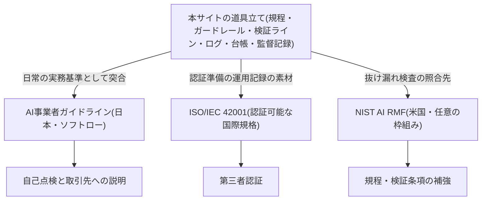

> ⚖️ **免責**: 本ページは一般的な情報提供であり、法的助言・認証取得の保証ではない。規制対応・認証審査に関する個別の判断は、顧問弁護士・認証機関等の専門家に確認すること。

> 📎 **このページ+別添4点で監査・照会の初回対話に出られる**。別添は次の4点である。
> ①AI施策台帳の最新版(様式は原理編「負債とスロップの分類学」——全施策を5択区分・撤退条件付きで一覧化)。
> ②検証ログの集計(組織・人材編「実行者から検証者・設計者へ」の最小様式——記名検証と差し戻し率の記録)。
> ③社内AI利用規程の現行版(骨子は組織・人材編「推進体制とガバナンスの設計図」の9章テンプレ)。
> ④取締役会議事録のAI報告部分(議題の組み方は組織・人材編「取締役会の監督義務」の半期アジェンダ)。

## このページの用途

社内のAIガバナンスを整備していくと、ある日突然「外の言葉」で説明を求められる局面が来る。取引先のセキュリティチェックシートに「AIガバナンスの整備状況」の欄が現れる。内部監査部門が年次計画にAI利用統制を載せる。入札条件に国際規格への対応が書かれる。このとき必要なのは新しい仕組みではなく、**すでに運用している道具を外部の規格・ガイドラインの語彙に翻訳する対応表**である。

規程や検証の仕組みの作り方そのものは本ページでは扱わない。社内規程の骨子と検証義務化ライン(誤りが顧客・お金・法令に直接届く利用は全件・記名の人間検証を義務化する線引き)は組織・人材編「推進体制とガバナンスの設計図」で、取締役会側の監督(体制・報告ライン・投資規律・開示の4点の存在確認)は組織・人材編「取締役会の監督義務」で定義している。本ページはそれらの道具が、AI事業者ガイドライン・ISO/IEC 42001・NIST AI RMFのどの領域に対応するかだけを扱う。

## 三つの文書は性格が違う

三つを並べて「どれに準拠すべきか」と問うのは正しくない。性格が異なるため、用途で使い分けるものである。

**AI事業者ガイドライン(総務省・経済産業省)**は、日本の事業者向けの統合指針である。法的拘束力のない「非拘束的なソフトロー」であり、ルールで縛るのではなく関係者の自主的取組を促すゴールベースの考え方で作られている [src-2026-126]。対象はAI開発者・AI提供者・AI利用者の3主体で、AIを業務利用する一般企業は「AI利用者」として対象に含まれる [src-2026-056]。構成は、本編が基本理念(why)と指針(what)、別添が実践(how)という公式の役割分担になっている [src-2026-127]。本編第2部の「共通の指針」は、人間中心・安全性・公平性・プライバシー保護・セキュリティ確保・透明性・アカウンタビリティ・教育/リテラシー・公正競争確保・イノベーションの10項目である [src-2026-126]。別添にはこの10項目を要約したチェックリストとワークシートが付属する [src-2026-127]。なお2025年に公布・施行されたAI推進法のもとでは、同法13条に基づく政府の「適正性確保に関する指針」(2025年12月19日、AI戦略本部決定)が定められており、本ガイドラインは冒頭の脚注でこの指針との関係を示している [src-2026-126]。法施行後も事業者の実務基準はこのガイドラインが引き続き担う、という読み方は本サイトの整理である。

**ISO/IEC 42001**は、AIマネジメントシステム(AIMS)の確立・実施・維持・継続的改善の要求事項を定めた国際規格であり [src-2026-121]、**第三者認証が可能**である [src-2026-122] [src-2026-128]。対象はAIシステムを開発・提供・利用するあらゆる規模の組織で、AIへの取り組みをリスクアセスメントからリスク対応まで統合的に管理するアプローチを提供する [src-2026-121]。日本語版のJIS規格が発行済みで、国内の認証制度はこのJIS規格(=ISO/IEC 42001)を基準に運用される [src-2026-122]。認証機関を認定する国内インフラも稼働を始めており [src-2026-128] [src-2026-129]、「認証を取る」ことが日本企業の現実の選択肢になった。ただし国内の認証取得はまだ先行者の段階であり、取得が業界標準になっているとまでは言えない。

**NIST AI RMF**は、米国国立標準技術研究所による任意採用のリスクマネジメント枠組みである。認証制度はない。GOVERN(リスク管理文化の醸成)・MAP(リスクの文脈の確立)・MEASURE(リスクの分析・評価・監視)・MANAGE(リスクへの資源配分と対応)の4機能と、その下の計19カテゴリで構成され、GOVERNは他の3機能に浸透する横断機能と位置づけられる [src-2026-124] [src-2026-125]。生成AIに固有のリスクへの推奨アクションは、本体を具体化した生成AIプロファイル(NIST AI 600-1)が提供する [src-2026-022]。

使い分けはこうなる——**日常の実務基準と自己点検にはAI事業者ガイドライン、取引先・市場への第三者証明が必要になったらISO/IEC 42001、規程・検証条項の抜け漏れ検査にはNIST AI RMF**。この使い分けは三つの文書の性格から導いた本サイトの整理であり、どれかの文書が指定しているものではない(規程起草時の使い分け——土台は日本のガイドライン、補強はNISTプロファイル——は組織・人材編「推進体制とガバナンスの設計図」で述べたことと同じ整理である)。

三つの文書と本サイトの道具立ての関係を1枚で示す。

> 📊 **データボックス(2026-06時点)**
> - AI事業者ガイドラインの最新版は第1.2版(2026年3月31日公表)。第1.0版(2024年4月)・第1.1版(2025年3月)から継続改定されるリビングドキュメント [src-2026-056]
> - ISO/IEC 42001:2023は2023年12月発行(第1版・全51ページ)[src-2026-121]。対応するJIS Q 42001:2025は2025年8月20日発行 [src-2026-122]
> - 国内のAIMS認証インフラ: 認証機関への要求事項ISO/IEC 42006:2025の発行(2025年7月7日)を受けてISMS-ACが認定を開始(2025年7月8日)[src-2026-128]。2026年1月14日に国内初のAIMS認証機関2機関を認定 [src-2026-129]
> - NIST AI RMF 1.0(AI 100-1)は2023年1月発行。リビングドキュメントとして2028年までのレビューを予定 [src-2026-124]。生成AIプロファイル(AI 600-1)は2024年7月発行 [src-2026-022]

## 対応表 — 本サイトの道具と三つの文書の該当領域

以下が本ページの核である。行は本サイトの道具(各様式の定義ページを併記)、列は三つの文書の該当領域を示す。対応付けの根拠にしたのは各文書の公開されている構成情報——共通の指針10項目と本編・別添の構成 [src-2026-126] [src-2026-127]、ISO公式ページが示すAIMSの目的・対象・便益 [src-2026-121]、4機能・19カテゴリの定義 [src-2026-124] [src-2026-125]——であり、**この粒度での対応付け自体は編集部の整理である。規格本文の箇条や管理策との逐条対応ではない**(理由は次節)。

| 本サイトの道具(定義ページ) | AI事業者ガイドライン | ISO/IEC 42001 | NIST AI RMF |
|---|---|---|---|
| 暫定ガードレール=入力可否+検証義務+相談先の1枚(組織・人材編「推進体制とガバナンスの設計図」) | 共通の指針のうちプライバシー保護・セキュリティ確保。第5部 AI利用者の事項 | AIマネジメントシステム確立の起点(方針の文書化・周知) | GOVERN(方針・手続の整備) |
| 社内規程の骨子9章(同上) | 第5部 AI利用者の事項+別添チェックリストとの突合 | AIマネジメントシステムの確立・実施(規程体系の本体) | GOVERN全般。検証・インシデント条項は生成AIプロファイルの推奨アクションで補強 |
| 検証義務化ライン=リスク区分×検証義務(同上) | 共通の指針のうち安全性・アカウンタビリティ | リスクアセスメントからリスク対応までの統合管理 | MAP(リスクの文脈・優先度の確立)+MANAGE(検証資源の配分) |
| 検証ログ=記名検証・差し戻しの記録(組織・人材編「実行者から検証者・設計者へ」) | 共通の指針のうち透明性・アカウンタビリティ(関与の記録) | トレーサビリティ・透明性・信頼性の実証 | MEASURE(運用中の監視・評価の記録) |
| AI施策台帳=全施策の5択区分・撤退条件つき一覧(原理編「負債とスロップの分類学」) | 第2部E「AIガバナンスの構築」(取組のモニタリング) | リスクと機会の管理の枠組み・継続的改善の材料 | MAP(用途と文脈の記録)+MANAGE(対応・撤退の計画) |
| 5資産と投資ゲート=データ/業務/人材/統治/調達の充足判定(AI-Ready編「5つの資産」「AI-Ready自己診断」) | 第2部E(経営層による体制整備) | マネジメントシステムを維持する組織の資源・能力の土台(対応は緩い) | GOVERN(組織体制・資源・人材の整備) |
| 取締役会の監督4点と半期アジェンダ(組織・人材編「取締役会の監督義務」) | 第2部E+別添2「経営層によるAIガバナンスの構築及びモニタリング」[src-2026-127] | マネジメントシステムの維持・継続的改善への経営の関与 | GOVERN(横断機能としての監督・説明責任) |

読み方の注意を二つ。第一に、この表は「領域の対応」であって「要求の充足」ではない。たとえば検証ログがMEASURE機能の領域に対応することと、MEASUREの各カテゴリの内容を満たすことは別である。第二に、対応の濃さは行によって違う。規程・検証ライン・ログの行は文書の中核領域に重なるが、5資産の行は前提条件としての緩い対応にとどまる(表内に注記した)。

## 認証・監査の証跡として使うときの限界

外部評価・認証の文脈で本サイトの様式を使う場合、**そのまま認証文書になるという期待は持たないでほしい**。ギャップは三つある。

第一に、**粒度のギャップ**。ISO/IEC 42001の規格本文は有償であり、公開ページで確認できるのは目的・対象・便益までである [src-2026-121]。本ページの対応表もその公開情報の粒度で作られている。認証審査で問われる箇条・管理策レベルの適合は、規格本文(日本語ではJIS Q 42001 [src-2026-122])を入手し、自社でギャップ分析を行わなければ判定できない。

第二に、**文書体系のギャップ**。マネジメントシステム認証は、方針・適用範囲・手順・記録が規格の要求に沿った文書体系として整備されていることを審査する。本サイトの台帳・ログ・規程骨子は、その文書体系の「中身の素材」と「運用実績の証跡」にはなるが、体系そのものの設計は認証機関・コンサルタントとの作業として別途必要になる。

第三に、**主体のギャップ**。AI事業者ガイドラインは開発者・提供者・利用者で求められる事項が異なる [src-2026-126]。本サイトの道具立てはAIを業務利用する企業(=AI利用者)を想定して作られており、自社プロダクトにAIを組み込んで顧客に提供する事業を持つ会社は、提供者・開発者向けの事項を別途確認する必要がある。

逆に言えば、この三つのギャップを認識した上でなら、本サイトの様式は監査・認証の準備作業のうち証跡を集めて整える部分の手間を減らせる。検証ログと施策台帳は「運用している証拠」として最も要求されやすい記録であり、これが日常業務の中で自然に溜まっている状態は、監査の直前に証跡を遡って作る状態(それは証跡の捏造に近づく)と決定的に違う。

## 内部監査での使い方

外部の認証より先に来るのは、たいてい自社の内部監査である。年次の内部監査計画にAI利用統制を1項目追加し、往査では本ページの対応表と次節の監査前チェック5問を使う——これが最小の組み込み方である。質問状の土台には、AI事業者ガイドライン別添のチェックリスト(共通の指針10項目の要約 [src-2026-127])がそのまま使える。なお財務報告プロセスへのAI委任(J-SOX側)の点検は別系統であり、部門別ガイド「経理財務のAIDX」の「AI委任と統制の同時改訂チェック(5問)」と監査人への期中説明セット(委任を変えたら統制文書も同時に変わっているかの点検様式)が担当する。本ページのチェックはAI利用統制の全社横断面、経理財務ページのチェックは財務統制の断面で、対象が異なる。

## 監査前チェック5問(そのまま使える)

内部監査の往査前、または外部からの照会・審査への回答前に、証跡の状態を点検する5問である(編集部作成。点検対象の様式はすべて既存ページで定義済みのもので、新しい様式は登場しない)。

1. **AI施策台帳**は全施策を網羅し、各施策に投資区分(5択)と撤退条件が記入されているか。最終更新は直近四半期内か
2. **検証ログ**に、検証義務化ラインで「高」に区分された利用の記名検証と差し戻しの記録が残っているか
3. **社内規程**に参照したガイドライン・規格の名称と版数が記載され、それが最新版と一致しているか(ガイドラインも枠組み側も継続改定される [src-2026-056] [src-2026-124])
4. AI事業者ガイドライン**別添チェックリストとの突合記録**(実施日・担当・結果・未対応項目)があるか
5. **取締役会議事録**に、直近半期のAI報告と質疑が残っているか

5問すべてに「はい」と答えられる状態が、外部の言葉で説明を求められたときの最低限の備えである。「いいえ」が2問以上あるなら、照会への回答より先に証跡側の整備に戻るほうがよい。

## 体制と費用の目安

出典のある標準はなく、以下はいずれも出典のない実務上の目安である。

**ガイドライン対応(自己点検)**: 中堅(数百名規模)では、対応表の整備+別添チェックリスト突合+監査前チェックを推進担当+法務の兼任で5〜10人日。大企業(数千〜数万名規模)では、内部監査部門の年次計画への組み込みと部門展開を含めて10〜30人日。いずれも外部費用はほぼ不要である。

**ISO/IEC 42001認証(取得する場合)**: 準備6〜12か月+審査。体制は推進担当・ISMS等の既存マネジメントシステム事務局・対象部門で専任相当1〜2名+兼任数名。審査・コンサルティングの外部費用は適用範囲の広さに依存して数百万円台からとなる——この金額はISMS等の既存認証の相場からの類推であり、AIMS固有の公表相場はまだない。

**効果側の目安(同じく出典のない見立て)**: 主な定量効果は、取引先・顧客からのAIガバナンス照会(セキュリティチェックシート・監査対応)への回答工数の削減である。内訳式: 年間照会件数 × 1件あたり削減工数(対応表と証跡が整備済みなら下調べと社内照会が不要になる分)× 人件費単価 − 証跡・対応表の年間維持工数。中堅で年10件 × 0.5人日 × 5万円/人日 − 維持2人日 ≒ 年15万円程度、大企業で年100件 × 0.5人日 × 6万円/人日 − 維持10人日 ≒ 年240万円程度。金額は小さく見えるが、効果の本体は金額化しにくい側——「回答できないことによる失注・取引条件の悪化・監査指摘の回避」——にある。感度を1行で言えば、**外部からの照会が年数件未満の会社では維持工数が削減を上回り、純効果はマイナスになる**。その場合、対応表の整備は照会が現実に来てからで足りる(次節のアクションも、まず照会頻度を確認してから整備に進む並びにしてある)。

認証取得の要否は投資判断の5択(判定の手順は原理編「負債とスロップの分類学」——本格投資/使い捨て構築/実験/待つ/やらない)で判定する。顧客・入札からの明示的な要求がない段階での認証着手は「待つ」が標準、要求が現実化したら準備期間を踏まえて「本格投資」へ切り替える、というのが本サイトの目安である。

## 今日からやること

- 【今すぐ】【推進担当】取引先・顧客からのAIガバナンス照会(セキュリティチェックシートの該当欄・監査対応)が過去1年に何件あったかを数える。道具: 営業・情シスの照会対応記録。完了条件: 年間件数が把握され、年数件未満なら次項の整備を「照会が来てから」に繰り下げる判断とあわせて記録される
- 【今すぐ】【推進担当】照会が現にある(または入札・取引で見込まれる)場合、本ページの対応表の右端に「自社の現物」列を足し、各行の証跡(台帳・ログ・規程・議事録)の所在と最終更新日を記入する。道具: 本ページの対応表+監査前チェック5問。完了条件: 全行が埋まるか、空欄が課題一覧として経営会議に報告される
- 【今すぐ】【法務】AI事業者ガイドライン最新版の別添チェックリストと社内規程の突合を実施する。道具: 別添チェックリスト [src-2026-127] +社内AI利用規程の現行版。完了条件: 突合記録(実施日・担当・未対応項目)が残る
- 【1年以内】【推進担当】内部監査部門と協議し、年次内部監査計画にAI利用統制の監査項目を追加する。道具: 監査前チェック5問+対応表。完了条件: 年次監査計画への記載と初回往査の実施
- 【1年以内】【経営】ISO/IEC 42001認証の要否を5択の語彙で判定する。判定材料は顧客・入札からの要求の有無と見込み。完了条件: 判定と理由が経営会議の議事録に残る
- 【待て】【経営】顧客要求がない段階での認証取得の着手。認証は証明の手段であり、証明を求める相手が現れる前に取るものではない。それまでは証跡(台帳・ログ・突合記録)を日常運用で溜めることが最良の認証準備になる

**この主張が崩れる条件**: 二つある。第一に、外部からの照会・監査・入札要件でこの対応表を使う機会が2年連続でゼロなら、規格対応は「先回りの整備」ではなく「来てから作る」で足り、本ページの優先度(今すぐ整備)は崩れる——観測者は【推進担当】、判定の場は年次の内部監査計画策定時、記録場所は照会対応の記録(セキュリティチェックシート・監査対応の件数をここから数える)。第二に、規格本文(JIS Q 42001)との逐条照合で本ページの対応表に重大な齟齬が見つかった場合、または各文書の改定で構成(共通の指針10項目・4機能)が変わった場合、対応表は改訂が必要になる——突合の担当は【推進担当】、判定の場は半期の規程レビュー時。

(関連: 組織・人材編「推進体制とガバナンスの設計図」=社内規程の骨子9章と検証義務化ラインを定義/組織・人材編「取締役会の監督義務」=監督4点と半期アジェンダを定義/原理編「負債とスロップの分類学」=投資判断の5択とAI施策台帳を定義/部門別ガイド「経理財務のAIDX」=J-SOX側の統制点検と監査人対応の様式)

> ⚖️ **免責(再掲)**: 本ページは一般的な情報提供であり、法的助言・認証取得の保証ではない。対応表は各文書の公開構成情報に基づく編集上の整理であり、認証審査・規制対応における適合の判定は、規格本文・最新版ガイドラインとの照合および専門家の確認によること。

<!--
執筆メモ(2026-06-12):
- 外部評価フィードバック#1(docs/reviews/2026-06-12-external-feedback.md)への対応ページ。監査・認証・規制対応の証跡としての翻訳表が主目的。
- 使用ソース: 121(ISO公式)/122(JIS Q 42001発行)/124・125(AI RMF本体とCore)/126・127(AI事業者GL1.2本編・別添)/128・129(国内AIMS認証インフラ)/022(600-1)/056(GL掲載ページ)。すべてkey_factsの範囲内。
- 123(JQA)・130(IIA Japan)は不引用とした(123はmedium・公開日不明、130は調査告知のみで結果未公表。いずれもページの主張に不要)。なお両ファイルのreliability「medium-high」はスキーマ(high/medium/low)違反のためmediumへ正規化、123のpublished「n.d.」も「unknown」へ修正(ビルド失敗回避。jp_noteの趣旨は維持)。
- 対応表の行×列の対応付けは全面的に編集部の整理。根拠は公開構成情報のみ(共通の指針10項目[126]・本編/別添の役割分担[127]・AIMSの目的/便益[121]・4機能19カテゴリ[124/125])。ISO列はjp_note(121)の指示通り箇条・附属書A管理策に言及せず、公開情報の粒度にとどめた。この限界は本文「粒度のギャップ」で読者にも開示。
- 「使い分け」(日常=GL/証明=ISO/検査=NIST)・「監査前チェック5問」・「規模感(2レンジ+効果内訳式+感度)」・「認証は待つが標準」・「内部監査への組み込み方」は出典のない実務上の整理である旨を本文中の自然文で開示済み。
- 「国内認証は先行者の段階」はsrc-2026-129のjp_note・詳細メモの趣旨(取得社数一桁台)を程度表現に落としたもの。具体社数はkey_facts外のため不使用。
- 単一情報源ルール対応: 検証義務化ライン・規程骨子・暫定ガードレール=governance-structure、検証ログ=talent-reallocation、5択・施策台帳=debt-slop-taxonomy、5資産=five-assets、投資ゲート=self-assessment、監督4点=board-oversightをすべて参照のみで再定義なし。J-SOX系チェックはfinanceの様式と対象が異なる旨を本文に明記。
- 新規実行素材2点(規格対応マップ・監査前チェック5問)はフレーム台帳の実行素材表に登録済み。
- 版数・発行日・認証インフラの日付は時点依存としてデータボックスに隔離(governance-structureの先例に従う)。本文は「最新版にあたる」構造記述。
- 正本参照が5本超のため冒頭に「このページ+別添4点」一覧を設置(CLAUDE.md規約)。
- 2026-06-12改稿(docs/reviews/2026-06-12-external-feedback.md「standards-mapping」軽微4件): ①AI推進法の記述を126のkey_facts(13条「適正性確保に関する指針」2025-12-19)に基づく形に修正、分担の読みは本サイトの整理と開示 ②「第三者認証が可能」に[122][128]併記、監査前チェック#3を「枠組み側も継続改定」に修正([124]はNISTのためISOの根拠から外す)③「大きく短縮」を控えめ表現に ④冒頭ボックス・GL段落の長文分割、アクションを照会頻度確認→現物列整備の順に並べ替え(感度分析との優先度衝突解消)。
-->
