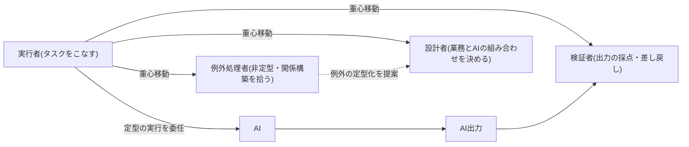
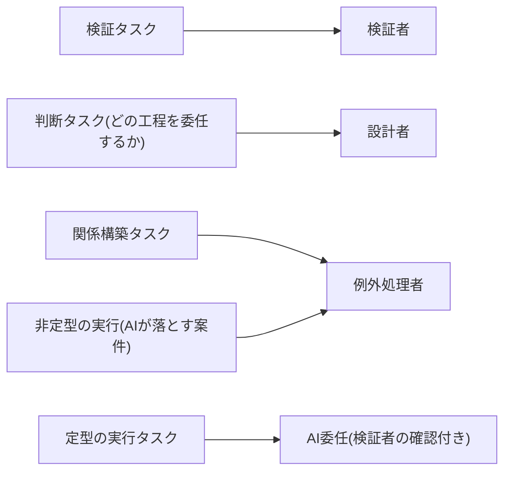

> 💡 **ひとことで言うと**
> 工場に機械が入ったとき、職人の仕事は「作る」から「出来栄えを確かめる・段取りを組む・トラブルを裁く」に変わった。同じことが事務の仕事にも起きる。人を減らすのではなく、肩書と評価の物差しを新しい仕事に合わせて書き換える話である。

## 削減でも全員リスキリングでもなく、役割の重心を移す

AIによる業務代替を前にした人材戦略の選択肢は、人員削減か全員リスキリング(学び直し)か、の二択ではない。本ページが薦めるのは第三の道、役割の重心移動である。実行(タスク=個々の作業をこなす)に張り付いていた人材の重心を、検証(AIの出力を採点し差し戻す)・設計(業務とAIの組み合わせを決める)・例外処理(AIが落とす非定型を拾う)へ移す。人は減らさず、職務定義を書き換える。これが本ページの主張である。

削減が誤りな理由はこうだ。AIの出力品質を担保する検証能力こそが、将来の競争力の源泉である。その担い手を先に減らすと、委任を拡大できなくなる(育成面の根拠は組織・人材編「新人が育たない問題」参照)。全員一律のリスキリングが誤りなのは、3役割の必要スキル・任命要件が異なる以上、一律研修では誰の重心も動かないからである。

## 何が起きているか — 全職位が「実行する側」から「任せて管理する側」へ

経営者側の認識を最も大規模に定量化したのが、Microsoftによる年次調査(31か国31,000人のナレッジワーカー=事務職・専門職などの知識労働者が対象、2025年2〜3月実施)である。同調査は、役割や階層を問わず全従業員がAIエージェント(自分で段取りして仕事を進めるAI。定義は用語集「AIエージェント」)を構築・委任・管理する側に回り、人間の仕事は実行から監督・指揮へ移ると予測した。職能別の組織図は、目標を軸に人とエージェントを束ねる動的な編成へ移ると見る。そして「タスクごとにエージェント何体に対し人間何人か」という比率の設計が、リーダーの新たな経営課題になるとする[src-2026-018]。これはベンダー(製品を売る側の企業)自身による自社事業文脈の調査であり、その分の割引は必要だが、「実行者ポストの縮小と監督ポストの拡大」という方向性の整理として参照に値する。

利用の実態側のデータもある。AI開発企業Anthropicが、自社の対話型AIの利用データを分析したレポートだ(2026年1月公表)。直近では、増強(協働)型が自動化(委任)型をやや上回る揺り戻しが観測された。ただし基調としては、自動化の拡大傾向が続くと分析されている。また企業のAPI(プログラムからAIを呼び出す接続口)経由の利用では、タスクの複雑さによらずAIの自律性が一様に低い。企業が「統制された委任」——人間の検証を残した委任——を優先している実態が示された[src-2026-023]。ベンダー自身による自社データの分析であり、利用者層が技術職に偏る点には注意が要る。それでも、「委任は拡大するが、検証は人間に残る」という本ページの前提と整合するデータである。

> 📊 **データボックス(2026-06時点)**
> - エージェントによるワークフローの完全自動化を既に活用しているリーダー: 46%(Microsoft年次調査、31か国31,000人、2025年2〜3月実施。ベンダー自身による調査)[src-2026-018]
> - AI利用の分類: 2025年11月時点で増強52%(5pt上昇)・自動化45%(4pt低下)。同年8月は自動化優位で、約1年前比では自動化シェアは依然高水準(Anthropic自社プラットフォームデータ、技術職偏重の留保あり)[src-2026-023]

## 重心移動の宛先 — 検証者・設計者・例外処理者

では実行者の重心はどこへ移すのか。ここで3つの役割を定義する(検証者の一般的な定義は用語集「検証者」も参照)。この3分類は出典のある分類ではなく、前節の調査が示す方向(実行から監督へ)を職務の語彙に落とした本サイトの整理である。新ポストの増設ではなく、既存の職務定義に明示的に書き込む役割タグと考えてほしい。

定型の実行をAIへ委任し、人材の重心を3役割へ移す構図を示す。

この表の見方: 縦に3つの役割が並ぶ。自部門で任命を考えるときは、まず「任命の目安」列で候補者を探し、「評価の観点」列を評価シートの叩き台にする。

| 役割 | 担うこと | 必要スキル | 任命の目安 | 評価の観点 |
|---|---|---|---|---|
| **検証者** | AI出力の採点・差し戻し。品質の最終責任 | 当該業務の品質基準を言語化できること。事実確認とリスク感度 | 当該業務の実務経験3年以上はあくまで目安。代替条件として成果物の採点テスト(良い成果物と悪い成果物を根拠付きで見分けられること)の通過でも可 | 差し戻しの的中率/見逃した欠陥の重大度/品質基準の文書化量 |
| **設計者** | 業務とAIの組み合わせの設計。どの工程を委任しどこに人を残すかの決定 | 業務の分解力、AI能力の現在地の理解、費用対効果の試算 | 部門業務の全体像を持つ中堅〜管理職。部門横断の調整経験 | 再設計後の処理時間・品質・例外発生率/設計の他部門への再利用回数 |
| **例外処理者** | AIが落とす非定型案件・顧客や社内の関係構築を拾う | 関係資本、交渉と判断、エスカレーション(自分で判断できない案件を上に引き上げること)の見極め | 例外対応・顧客折衝の実績がある担当者(専任化せず役割を明示) | 例外案件の解決リード時間(発生から解決までの時間)/例外の定型化(再発防止)提案数 |

設計者の供給源としてまず有力なのは経営企画・事業企画である(関連: 部門別ガイド「事業企画・経営企画のAIDX」)。例外処理者の代表部門はカスタマーサポートであり、エスカレーション設計への部門展開は部門別ガイド「カスタマーサポートのAIDX」を参照。検証者の先行モデルは、コードレビューという検証文化を制度として既に持つ開発部門にある(関連: 部門別ガイド「開発・エンジニアリングのAIDX」)。

組織・人材編「業務分解×再配置プレイブック」の業務分解4分類(判断/検証/実行/関係構築)との対応は次の通りである。「検証」タスクの担い手が検証者。「関係構築」と、AIが落とす非定型の「実行」を拾うのが例外処理者。どの工程を委任するかという「判断」を担い、再配置全体を決めるのが設計者。定型の「実行」はAIへの委任が進む側であり、3役割はその受け皿となる人間側の職務である。

業務分解4分類と3役割・AI委任の対応を図示する(この対応は本ページで定義する)。

業務をどう分解してどの工程を委任するかの手順は本ページでは再定義しない(関連: 組織・人材編「業務分解×再配置プレイブック」)。また検証者を将来にわたり供給し続ける育成側の設計は、組織・人材編「新人が育たない問題」で扱っている。

## なぜ「人」から設計するのか — 人間中心の進め方の優位

役割の再設計を後回しにして、ツール配布を先行させる進め方には、不利を示すデータがある。Deloitteがオックスフォード・エコノミクスと協働した年次調査(89か国9,000人超のビジネス・HR=人事のリーダー対象)によれば、組織の過半はAIに対しテクノロジー中心の進め方(アプローチ)を取っている。しかし、人間中心の戦略を優先する組織のほうが、ROI(投資に見合う効果)の期待を超過する確率が高い(1.6倍、データボックス参照)。同調査は、AIで人を増強する時代に代替できない競争優位として、人間の判断力と適応力を挙げる。そして、固定的な要員計画から、ケイパビリティ(人と組織の能力)を機動的に再配置する運用への転換を提示している[src-2026-025]。これはツール先行導入になりがちな日本のDX(デジタル変革)施策への警鐘と読める——横断面調査(一時点の比較調査)ゆえ因果の確定はできないものの、職務再設計を伴わない一斉配布が成功企業の多数派の型でないことは言える。

> 📊 **データボックス(2026-06時点)**
> - テクノロジー中心アプローチの組織: 59%。人間中心の戦略を優先する組織はROI期待を超過する確率が1.6倍(Deloitte/Oxford Economics、89か国9,000人超調査)[src-2026-025]
> - 意図的な役割設計・コーチング・練習時間がなければスキル萎縮(skill atrophy)が起きると警告するリーダー: 43%(Wharton/GBK年次調査、米国シニアリーダー約800人、2025年10月)[src-2026-026]

## 職務定義と評価制度を書き換える — スキルベースへの転換

役割の重心移動を口頭の期待で済ませると、評価制度が旧来の実行量(処理件数・作成本数)を測り続け、重心は戻る。制度側の書き換えが必要である。

方向はIPA(情報処理推進機構)の調査分析ペーパー(2025年10月公表)が示している。同ペーパーの起点は、日本企業のDX人材不足が米独比で著しく高い水準にあることだ。そこから、企業と個人の関係を従来型の雇用関係から「スキルをベースに評価や役割を決定するダイナミックな関係」へ変革する必要を提言する。そしてスキルベース(技能を基準にした)人事評価制度の導入と、実践型学習の拡充を不可欠と論じる[src-2026-055]。9割以上のICT(情報通信技術)職種で主要スキルの過半がAIによって変化する可能性が指摘されている以上[src-2026-055]、職務定義の据え置きは選択肢にない。あわせて手当てすべきは、米国企業のシニアリーダー調査が警告するスキル萎縮である。意図的な役割設計と練習時間がなければ、検証に必要なスキル自体が衰える[src-2026-026]。その予防として、検証スキルの維持・獲得を評価項目に組み込む必要がある。

メンバーシップ型雇用(職務を限定せず、会社の一員として人を雇う日本型)の日本企業では、「ジョブ型(職務ごとに人と処遇を決める方式)への全面転換」を待たずに進めるのが現実的である(この進め方に出典はなく、実務上の経験則である)。職務を固定せず人に仕事を割り当てる日本型の柔軟性は、役割の重心移動にはむしろ追い風になりうる。等級制度本体を動かす前に、①職務定義書(職位要件書)に3役割の語彙を書き込む、②評価シートに検証・設計・例外処理の観点を追加する、③異動・登用の判断材料にスキル記録を使い始める——の順で進め、制度本体の改定は最後に回す。

> 📊 **データボックス(2026-06時点)**
> - 日本企業のDX推進人材の不足: 85.1%。米独と比べて著しく高い(IPA調査分析DP2025-02、2025年10月)[src-2026-055]
> - 9割以上のICT職種で主要スキルの過半がAIによって変化する可能性(同ペーパー)[src-2026-055]

### 労務リスク — 役割変更は「不利益変更」と受け取られうる

役割の重心移動は人を減らさない施策だが、労務上は無風ではない。以下は日本の労務実務の一般論からの注意点であり(個別の出典はない)、実施時は自社の労務担当・社会保険労務士・弁護士への確認を前提とすること。第一に、職務定義書・評価指標の書き換えが賃金・等級に影響する場合、労働条件の不利益変更と受け取られ、変更の合理性と手続の相当性が問われうる。評価指標を処理件数から検証精度へ張り替える際は、新旧指標の並走期間を設け、移行期に不利に扱わない経過措置を明示するのが安全である。第二に、労働組合がある場合は労使協議(労働協約・労使協定の確認)を経ること。組合がない場合も、従業員代表と対象者本人への事前説明・意見聴取を行い、説明の記録を残す。第三に、検証者への任命が事実上の降格・閑職化と受け取られると重心移動は定着しない。任命を等級・処遇の維持以上とセットにし、検証者が品質の最終責任者であることを職務定義書上も明示することが、制度面・士気面双方のリスクを下げる。この労務実務を全社で主管する人事部門の動き方は、部門別ガイド「人事のAIDX」を参照。制度面を整えた上で「降格と受け取られない」伝え方・部門説明会の構成は、組織・人材編「抵抗と定着」を参照。

## 職務定義書の改訂例(経理スタッフ・そのまま使える)

そのまま叩き台に使える改訂例を示す(架空の例示である。月次決算業務への部門展開は部門別ガイド「経理財務のAIDX」を参照)。

| 項目 | 改訂前(実行者定義) | 改訂後(検証者・設計者・例外処理者定義) |
|---|---|---|
| 主たる職務 | 仕訳入力、支払処理、月次決算資料の作成 | AIが起票した仕訳・作成した資料の検証と差し戻し。例外取引(新規スキーム・イレギュラー精算)の判断。業務とAIの分担の見直し提案 |
| 求めるスキル | 簿記知識、正確かつ迅速な入力 | 簿記知識に加え、勘定科目・処理の妥当性を根拠付きで説明できる検証力。異常値への感度 |
| 評価指標 | 処理件数、入力ミス率、期日遵守 | 差し戻しの的中率、見逃した欠陥の重大度、例外案件の解決リード時間、分担見直しの提案数 |
| 育成 | OJT(実務を通じた訓練)での入力業務の反復 | AI起票の採点・差し戻し演習(設計は組織・人材編「新人が育たない問題」の検証者育成プログラム参照) |

## 検証ログの最小様式(そのまま使える)

検証者の評価指標(差し戻しの的中率・見逃した欠陥の重大度)は、検証のたびに1件1行で記録するログがなければ測れない。最小様式を示す(この様式に出典はない)。

| 列 | 記入内容 | 集計での使い方 |
|---|---|---|
| 案件ID・日付 | 検証対象のAI出力と検証日 | — |
| 判定 | 承認 / 差し戻し | 差し戻し率の分母・分子 |
| 差し戻し理由 | 欠陥の種別(事実誤り・基準逸脱・形式不備 等) | 品質基準を文書化する際の素材 |
| 差し戻しの結果 | 修正過程で欠陥が実際に確認された / 過剰差し戻しだった | **差し戻し的中率** = 欠陥が確認された差し戻し ÷ 全差し戻し |
| 後工程で発覚した欠陥 | 承認後に下流工程・顧客側で見つかった欠陥と重大度(高: 対外・金額影響 / 中: 社内手戻り / 低: 軽微) | **見逃し重大度** = 承認案件のうち後工程発覚欠陥を重大度別に件数集計 |

運用は月次集計・設計者が確認、で始める。的中率だけを追うと安全側の差し戻し乱発(検証の形骸化の裏返し)を招くため、的中率と見逃し重大度は必ず対で見る。このログの不在が「現場が静かに離反する」失敗に直結する経路は、アンチパターン集「学習しないAI」を参照。

## 体制と期間の目安、始め方

以下の数字はいずれも出典のない実務上の目安である。役割の人数比は、実行者10名あたり検証者2〜3名・設計者1名(兼務可)、例外処理者は専任化しない。委任が拡大するほど検証の比重は漸増するため、人数比はパイロット(小規模の試行)の実測(検証ログ)で更新する。

**中堅(従業員300〜1,000名規模)**: まず1部門・対象5〜10名で開始する。体制は検証者2〜3名(既存の中堅を任命)、設計者1名(部門長または企画担当の兼務可)、例外処理者は専任化せず既存担当への役割明示のみ。期間は1四半期、等級・賃金制度に触れない範囲なら部門長〜CHRO(人事最高責任者)の決裁で開始できる。全社の職務定義書・評価シートの改訂はCHRO主管で約1年。

**大企業(数千〜数万名規模)**: 一斉改訂ではなく段階展開とする。先行2〜3部門(対象計30〜50名)で1四半期のパイロット→事業部単位(数百名)へ半年〜1年で水平展開→全社の職務定義書・評価制度改訂は1〜2年計画でCHRO主管・人事制度委員会の担当事項とする。専任の制度設計チーム2〜5名(人事+推進部門)と、事業部ごとの設計者の横串ネットワークを置く。労使協議・評価制度改定の手続(上記「労務リスク」参照)が律速になるため、制度本体の改定は先行部門の実測データが揃ってから着手する。

等級制度本体の改定は、どちらのレンジでもパイロット部門の実績を見てからでよい。

## 今日からやること

- 【CHRO】(今すぐ)職務定義書1職種を3役割の語彙で改訂試作する。道具: 上記の経理スタッフの改訂前後の対比表。完了条件: 対象部門長と合意したドラフト(下書き)1本が存在すること
- 【部門長】【推進担当】(今すぐ)部門の業務を分解し(関連: 組織・人材編「業務分解×再配置プレイブック」)、検証者の任命候補2〜3名を選ぶ。道具: 上記の任命の目安(実務経験3年以上は目安。成果物の採点テストで代替可)。完了条件: 任命の内示と品質基準シートの作成着手
- 【CHRO】(1年以内)検証・設計スキルを評価シートと等級要件に接続する改訂案を作る。道具: IPAが提言するスキルベース評価の枠組み[src-2026-055]。完了条件: 改訂案が役員会に上程されていること
- 【経営】(能力向上を待て)実行者ポストの大幅削減を重心移動に先行させない。人間中心の戦略がROI面で優位を示すデータ[src-2026-025]と、役割設計なき委任がスキル萎縮を招くという警告[src-2026-026]がある以上、削減先行は検証能力の供給を断つ。削減の検討は、検証・例外処理の所要工数が四半期単位で実測できてからでよい

**この主張が崩れる条件**: パイロット部門で次の2つがともに起きた場合である。①検証者・設計者を任命しても、品質・処理時間・例外対応が役割明示なしの部門と差がつかない。②AI出力の重大欠陥が、人手検証なしでも許容水準を下回り続ける。この場合、役割の重心移動は過剰投資であり、職務定義は据え置いたまま委任だけ拡大すればよい。

<!--
執筆メモ(ソースが薄い箇所・レビュー重点ポイント):
- 中核の「検証者・設計者・例外処理者」の3役割フレーム(必要スキル・任命の目安・評価の観点を含む)は出典のない編集部の見立て。src-2026-018の「実行から監督・指揮へ」、src-2026-023の「統制された委任」と方向は整合するが、3分類自体の実証はない。
- 経理スタッフのbefore/after表、検証ログの最小様式、3役割×4分類のマッピング、役割の人数比(実行者10名→検証2〜3名・設計1名)、規模感の2レンジ(中堅/大企業の段階展開)、メンバーシップ型での進め方(外堀から埋める3ステップ)もすべて編集部の見立て(本文にマーカー明示済み)。
- 労務リスクの段落(不利益変更性・労使協議・経過措置)は日本の労務実務の一般論としての編集部の見立てで、出典なし。本文に専門家確認を前提とする旨を明示した。法的助言ではない位置づけを維持すること。
- src-2026-018はベンダー(Microsoft)自身の調査、src-2026-023はAnthropic自社プラットフォームデータ。2層ルールのpublisher開示義務に従い、本文で調査主体とバイアス(自社事業文脈/技術職偏重)を明示した。
- src-2026-025の「人間中心でROI 1.6倍」は横断面調査の相関。本文で「因果の確定はできない」と注記。key_factsに有意性検定の記載がないため「有意に」とは書かず、レビュー指示に従い本文は「高い(1.6倍、データボックス参照)」の表記とし、時点情報付きの数値本体はデータボックス側に置く。published: unknown のソースなので review_by 時に原典の版・年次を再確認すること。
- 業務分解の手順は work-redesign.md(並行執筆中)が正本になる予定のため、本ページでは定義せずテキスト参照のみとした。work-redesign 公開時に参照名「業務分解×再配置プレイブック」が実タイトルと一致するか要確認。
- 検証者の育成側は junior-pipeline.md が正本。junior-pipeline 側に本ページへの参照「(関連: 組織・人材編「実行者から検証者・設計者へ」)」が既にあり、相互参照が成立している。

2026-06-12 文体改修: 格言調見出し平易化・内部用語排除・見立て定型句を自然文に置換
2026-06-12 平易化改修済み
-->
