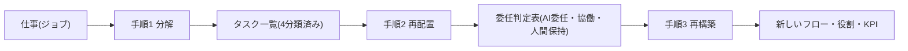
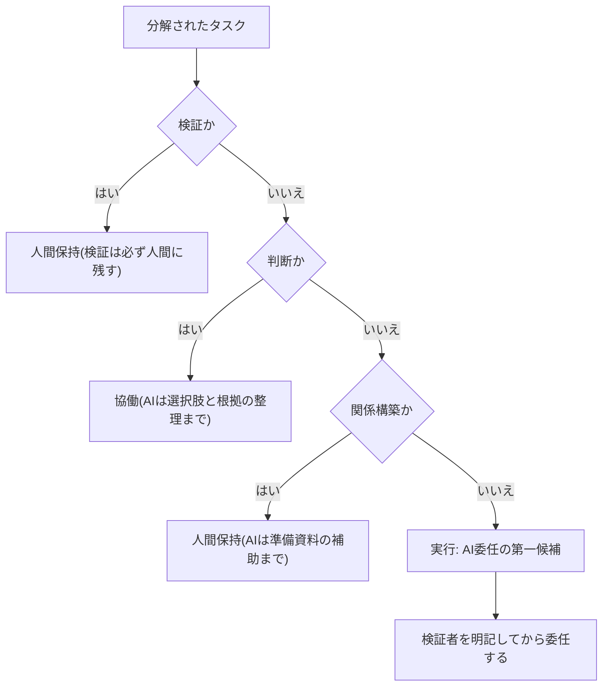

## AIに任せられるのは「仕事」ではなく「分解されたタスク」だけである

「経理をAIに任せる」という文は、実行可能な意思決定ではない。仕事(ジョブ)は性質の異なるタスクの束であり、AIへの委任が成立するのは束をほどいた後のタスク単位だけだからである。したがって業務再設計の本体は、**分解(Deconstruct)→再配置(Redeploy)→再構築(Reconstruct)** の3手順となる。この方法論は、MIT Sloan Management Review掲載の実務論文(著者は人事コンサルティング大手Mercerの幹部であり、その立場には留意)が提示したもので、テクノロジー起点(どのAIを入れるか)ではなく業務起点(仕事をどう作り直すか)で始めることを原則とする[src-2026-019]。

本ページは、原理編「AIDXの定義」が示す再設計4要素のうち「業務の分解」「人の役割の再配置」を実行手順に落としたものである。業務分解の手順とタスク4分類はこのページで定義し、本サイトの他のページはここを参照している。

3手順と各手順の成果物の流れは次の通りである。

## なぜジョブ単位ではなくタスク単位か

ジョブ単位の議論は「この職務はAIで置き換えられるか否か」という二択に陥り、ほぼ必ず「置き換えられない」で終わる。どの職務にも人間にしかできないタスクが含まれるからだ。タスク単位に降りて初めて、部分委任という現実的な選択肢が生まれる。前掲論文も、ジョブを要素タスクに分解して代替・増強・変革の対象を特定することを第1段階に置く[src-2026-019]。

実利用データもタスク単位の混在を裏付ける。AI開発企業Anthropicが自社プラットフォームの利用データを分析したレポート(利用者層が技術職に偏るバイアスには留意)では、AI利用は委任型の「自動化」と協働型の「増強」に二分され、企業利用ではタスクの複雑性によらず自律性が一様に低く、企業は統制された委任を優先していると示唆された[src-2026-023]。また、Microsoftによる31か国31,000人の労働者調査(ベンダーによる自社製品文脈の調査である点は割引が必要)は、「タスクごとにエージェント何体に対し人間何人が必要か」というhuman-agent ratioの設計を経営課題として提起した[src-2026-018]。委任の単位も、人員配置の単位も、すでにタスクである。

## 手順1 分解 — タスクを4種に分類する

対象業務を「1人が1回で完結する作業単位」(目安30分〜半日)までほどき、各タスクを次の4種に分類する。この4分類は出典のある分類ではなく、本サイト独自の整理である。

| 分類 | 判定の問い | 典型例 | 再配置の初期見立て |
|---|---|---|---|
| **判断** | 複数の選択肢から、責任を伴う選択をしているか | 価格決定、採用可否、与信、投資判断 | 協働(AIは選択肢と根拠の整理まで) |
| **検証** | 成果物の正しさ・妥当性を確認しているか | 数値照合、品質チェック、承認、レビュー | 人間保持(AIは指摘の下書きまで) |
| **実行** | 手順が決まれば誰がやっても同じ結果になるか | データ集計、転記、定型文書の作成、検索 | AI委任の第一候補 |
| **関係構築** | 相手との信頼・合意形成そのものが目的か | 顧客折衝、部門間調整、部下との面談 | 人間保持(AIは準備資料の補助まで) |

判定に迷ったら「このタスクが失敗したとき、誰が責任を負い、どう補正されるか」で切る。補正の仕組みが上長の確認なら、その確認作業は独立した「検証」タスクとして切り出す。1つのタスクが複数分類に該当する場合は **検証>判断>関係構築>実行** の順で上位の分類を採る(誤って委任したときの事故が大きい側に倒す保守ルールで、この優先順位に出典はない)。分解の品質はここで決まる——「実行」に紛れ込んだ暗黙の検証を見落とすと、手順2でそのまま委任されて事故になる。

## 手順2 再配置 — AI委任・協働・人間保持を判定する

タスクごとに **AI委任 / 協働 / 人間保持** の3択を判定する。初期見立ては上表の通りだが、原則は1つだけ動かさない。**検証は必ず人間に残す。** AI出力の品質確認は再設計4要素の一つであり(関連: 原理編「AIDXの定義」)、検証まで委任した瞬間に、誤りを補正する最後の仕組みが業務から消える。先行企業の実態もこれと整合する——企業利用では自律性の低い「統制された委任」が優先されている[src-2026-023]。完全自動化をうたう動きはあるが、それは検証を捨ててよい理由にならない。

4分類から再配置3択への判定フローを示す。手順1の優先順位どおり、誤委任の事故が大きい分類から順に確認する。

> 📊 **データボックス(2026-06時点)**
> - エージェントによるワークフローの完全自動化を既に活用していると回答したリーダー: 46%。一方、世界の労働者の80%は業務をこなす時間やエネルギーが不足と回答(Microsoft Work Trend Index、31か国31,000人、2025年2〜3月実施)[src-2026-018]
> - Anthropic自社プラットフォームの利用分類(2025年11月): 増強52%(5pt上昇)・自動化45%(4pt低下)。指示型(最小限のやり取りで委任)会話は同年8月の39%から32%へ低下。ただし約1年前比では自動化シェアは依然高水準で、基調は自動化拡大[src-2026-023]
> - 同社の企業向け(API)利用では事務・管理サポート関連タスクの比率が、2025年8月の3pp増を経て同年11月に13%へ上昇。バックオフィスの定型実行から委任が進む[src-2026-023]

## 手順3 再構築 — フロー・役割・KPIを引き直す

再配置で止めると、旧フローの一部にAIを埋め込んだだけになる。第3段階は変更を前提に業務モデル全体を作り直すことである[src-2026-019]。引き直す対象は3つ。**フロー**(検証工程と例外処理ルートの常設)、**役割**(実行者から、AIに依頼し・出力を検証し・例外を裁く役割へ)、**KPI**(処理件数・作業時間系から、検証精度・例外解決時間・差し戻し率系へ)。Microsoftの前掲調査も、人間の仕事が実行から監督・指揮へ移り、職能別の組織図が目標軸の編成へ移行するとの予測を示している[src-2026-018]。

KPI張り替えのbefore/after例(例示であり、出典はない): ①月次処理件数 → 検証精度(差し戻しの的中率)、②1件あたり作業時間 → 例外案件の解決リード時間、③作成ドラフト本数 → 差し戻し率(素通し率と過剰差し戻しの両方を監視)。役割の受け皿と任命・評価の設計は、組織・人材編「実行者から検証者・設計者へ」の3役割(検証者・設計者・例外処理者)で定義しており、4分類との対応も同ページに置く。1点だけ先取りすれば、「判断」タスクの担い手は3役割に解消されず、権限と責任を持つ既存職位が保持し続ける。

この3手順を完遂した場合の効果として、前掲のMIT Sloan Management Review論文は、グローバル金融サービス企業1社の事例で労働投入と離職率の双方が大きく改善したと報告している[src-2026-019]。単一企業の事例でありコンサルタントによる報告である点は割り引くべきだが、「再設計はコスト削減と働きやすさを両立しうる」ことを示す参照点にはなる。

> 📊 **データボックス(2026-06時点)**
> - 事例企業(グローバル金融サービス)は4つの主要職種を横断して68タスクを自動化、17タスクをAI支援付きでシニアからジュニア人材へ移管、29タスクをグローバル・ケイパビリティセンターへ再配置、14タスクをAIで増強。結果、労働投入50%削減・営業費用40%削減・従業員離職率18%低下と報告(MIT Sloan Management Review掲載論文。著者はMercer幹部、単一事例)。なお各削減率の分母・測定期間・検証方法は論文に開示されていない[src-2026-019]

### 経営層はこの事例数値をどう読むか

データボックスの労働投入半減という数値を自社の期待値にそのまま置いてはならない。読み方は3段である(この読み方の整理に出典はない)。①これは4職種・128タスクの分解と再構築を完遂した後の数値であり、ツール導入単体の効果ではない。②削減幅にはグローバル・ケイパビリティセンターへの再配置(人件費の安い拠点への移管)分が含まれ、AIだけの寄与ではない——国内で完結する日本企業ではこの分を差し引く必要がある。③自社で見込む場合は、対象業務の「実行」タスク比率を効果の上限とみなし、そこから検証工程の新設コストを差し引いて試算する。この読み方なら、稟議書の期待効果欄に書ける数字は自社のワークシートから出る。

## 分解を現場参加型で行う理由

3手順を推進部門だけで行うと、手順1の分解が机上になる。例外処理・暗黙の検証・関係構築の重みは現場しか知らず、トップダウンの一括分解は「実行」を過大に、「検証・関係構築」を過小に見積もりがちだからである(この傾向自体を測った調査はなく、経験則である)。MIT Sloan IWER(労働・雇用研究所)は、AI導入時の業務再設計に現場労働者を関与させる戦術的ガイダンスを開発中で、医療現場で労働組合と協働したパイロットを実施している。同プロジェクトは、AIが低価値タスクを減らして仕事を改善することも、生産性プレッシャーを増幅して仕事を劣化させることもあり得ると整理し、労働者関与により実装率向上・スキル開発促進・バーンアウトと離職の低減が見込まれるという仮説を検証中である(効果は検証途上)[src-2026-020]。改善と劣化のどちらに転ぶかを分ける変数が現場の関与だ、というのがこの研究系譜の含意である。それでも現場が動かないときは、抵抗の類型診断と部門説明会の素材(組織・人材編「抵抗と定着」)を先に当てる。

## 日本の雇用慣行での読み替え

前掲論文の「タスクをシニアからジュニアへ下ろす」再配置は、職務等級と賃金が連動する欧米型ジョブ型の発想である。職能資格制度のもとで等級と業務の対応が緩い日本では、再配置は人の異動ではなく**同一人物の業務構成の組み替え**として運用するのが現実的だ。またメンバーシップ型雇用では職務記述書がなく業務の境界が曖昧なため、手順1の分解はそもそもの前提作業として一層重要になり、次節のワークシートは運用を続ければ事実上の職務記述書に育つ。現場参加型の再設計自体はカイゼン文化と親和性が高く、労使協議を通じた導入プロセス設計の下敷きにもなる。この節の読み替えはいずれも出典のない解釈である。

一点だけ警告を添える。「実行」タスクの委任は新人の訓練機会を静かに消しうる。委任判定の前に訓練価値の点検を挟むこと。(関連: 組織・人材編「新人が育たない問題」)

## 業務分解ワークシート(そのまま使える)

列は5つ。**タスク / 4分類 / 再配置(AI委任・協働・人間保持)/ 検証者 / 移行時期(今すぐ・1年以内・能力向上を待て・移行しない=保持理由の記入必須)**。移行時期の選択肢は投資判断の5択(定義は原理編「負債とスロップの分類学」)と接続しており、「能力向上を待て」は5択の「待つ」、「移行しない」は「やらない」に対応する——「待て」のタスクに今予算を付けてはならない。記入例として「月次レポート作成」1業務を分解する(架空の記入例である)。

| タスク | 4分類 | 再配置 | 検証者 | 移行時期 |
|---|---|---|---|---|
| 各システムからのデータ抽出・集計 | 実行 | AI委任 | 担当者(件数・合計値を原簿と突合) | 今すぐ |
| 前月差異・異常値の原因調査 | 検証 | 協働 | 担当者(AIの仮説を裏取り) | 今すぐ |
| レポート本文の一次ドラフト作成 | 実行 | AI委任 | 担当者(事実関係を全件確認) | 今すぐ |
| 数値と本文記述の整合チェック | 検証 | 人間保持 | 課長 | 移行しない |
| 経営向けの示唆・打ち手案の執筆 | 判断 | 協働 | 課長(採否と責任は人間) | 1年以内 |
| 関係部門への数値確認・すり合わせ | 関係構築 | 人間保持 | — | 移行しない |
| 体裁調整・配信 | 実行 | AI委任 | 担当者(配信前に体裁・宛先を目視確認) | 今すぐ |

運用ルールは2つ。①「AI委任」の行で検証者欄が空白のものは委任してはならない。②移行時期を「移行しない」とした行(人間保持)には保持理由を必ず書く(理由が書けない保持は、次回の見直し対象である)。

このワークシートの様式(上記の記入例に、業務名・記入日と処理時間の実測列(移行前/移行後)を加えたCSV)は、本サイトの「テンプレート」ページからダウンロードできる。処理時間の移行後の値は検証時間を含めて記録する。

部門別の記入例は部門別ガイドに置く——経営会議資料の分解例は「事業企画・経営企画のAIDX」、契約書レビューの分解例は「法務のAIDX」、採用業務の記入例は「人事のAIDX」、商談1件の分解例は「営業のAIDX」、コンテンツ運用の記入例は「マーケティングのAIDX」、問い合わせ対応の記入例は「カスタマーサポートのAIDX」、機能開発の分解例は「開発・エンジニアリングのAIDX」、月次決算の分解例は「経理財務のAIDX」を参照。業務単位の分解例(定型文書の生成、会議記録、問い合わせ一次対応など)は業務パターン集の各ページにも置かれている。

## 分解ワークショップの進め方(90分)

前節のワークシートは、推進担当が1人で埋めるのではなく、現場を集めた90分のワークショップで埋めるのが定石である。以下の進め方は実務上の経験則であり、出典のある手順ではない。

**参加者**は4〜5名に絞る。部門長(保持理由と移行時期をその場で決裁する)、対象業務の実務者2〜3名(例外処理と暗黙の検証を知っているのはこの人たちである)、推進担当1名(進行役。判定基準の解釈を一元化する)。これに加えて**記録役**を必ず決める——書記を1名置くか、実務者が共有シートに直接記入して全員に画面投影するか、どちらかである。進行役が書記を兼ねる構成は避ける。30分で15件前後のタスクを切り分けながら記録まで担うと、進行と記録の両方が止まる。なお部門長は後半45分(委任判定の途中から決裁まで)だけの参加でも成立する——前半の洗い出しは実務者と進行役で進められる。**事前準備**は2つ——対象業務を1つ選定しておくこと(目安はタスク10〜20件に収まる業務)と、ワークシートと4分類表を参加者に事前配布し、実務者には自分のタスクを思いつく範囲で書き出してきてもらうことである。

| 時間 | 内容 |
|---|---|
| 10分 | 目的と4分類の説明(時短調査ではなく業務の再設計であること、検証は人間に残す原則) |
| 30分 | タスクの洗い出し(実務者が事前に書き出してきたリストの読み合わせから始め、進行役が30分〜半日単位に切る。口頭での手順の再現は、リストにない例外処理・暗黙の検証の抜けを確認するために使う) |
| 30分 | 4分類と委任判定(タスクごとに4分類→AI委任・協働・人間保持を判定) |
| 15分 | 検証者と移行時期の決定(部門長がその場で決裁。「AI委任」で検証者が決まらない行は委任保留) |
| 5分 | 次回までの宿題の確認(埋まらなかったタスクの追記、移行時期「今すぐ」の行の着手担当) |
| 1〜2週間後に30分 | フォローアップ(固定で予定に入れる。宿題タスクの4分類と、「今すぐ」行の着手状況の確認) |

進行のコツは3つ。①完璧な分解を目指さない——90分でタスクの8割が埋まれば十分で、残りは宿題に回す。網羅を狙うと洗い出しだけで時間が尽きる。②判定が割れたら、誤って委任したときの事故が大きい側に倒す(手順1の優先順位: 検証>判断>関係構築>実行)。その場の多数決で「実行」に寄せない。③洗い出しの読み合わせと補足は実務者から先に話してもらう——部門長が同席する場合でも、部門長が先に業務像を語ると、手順書にない例外処理や暗黙の検証が出てこなくなる。

## 体制の目安と90日でやること

体制と期間の目安を2レンジで示す(この目安に出典はなく、実務上の経験則である)。**中堅(数百名規模)**: 対象1業務・タスク10〜20件・兼務含め3〜5名・期間90日・部門長決裁の範囲で始める。**大企業(数千〜数万名規模)**: 推進部門がワークシート様式と判定基準を一元管理した上で2〜3部門を並走させる。部門ごとに兼務3〜5名+推進専任1〜2名・期間90〜180日・事業部長〜担当役員決裁。横展開のコストは部門数にほぼ比例する。どちらのレンジでも、全社一斉の業務棚卸しから始めると分解が粗くなり1年かかる。

- 【部門長】【推進担当】(今すぐ)対象業務を1つ選び、現場担当者へのヒアリングを踏まえてワークシートで分解する。道具: 本ページのワークシート+4分類表。完了条件: 全タスクに4分類・再配置・検証者が記入され、現場担当者本人のレビューを通っていること。あわせて推進担当と現場担当の2人が同じ業務を独立に分解し、4分類の判定者間一致をパイロットの計測項目とする——不一致が多いタスク群は、人ではなく判定の問いの側を直す
- 【推進担当】【現場担当】(今すぐ)「AI委任・今すぐ」のタスクから移行を開始し、検証方法を業務フローに明記する。道具: 既存の業務手順書への追記。完了条件: 検証者欄に空白がなく、移行前後の処理時間と差し戻し率が計測されていること
- 【CHRO】【部門長】(1年以内)委任した「実行」タスクの訓練価値を点検し、訓練価値の高いものは代替の育成手段を設計する。道具: 組織・人材編「新人が育たない問題」の仕分けマトリクスと判定3問。完了条件: 代替育成手段が次年度の育成計画に反映されていること
- 【部門長】(1年以内)手順3の再構築として役割定義とKPIを引き直す。完了条件: 処理件数系のKPIが検証精度・例外解決時間系に更新され、評価面談で実際に使われていること
- 【経営】(能力向上を待て)「判断」「関係構築」タスクの大規模なAI委任。企業利用の実態は自律性を抑えた統制された委任が中心であり[src-2026-023]、検証と責任の設計が追いつく前の委任拡大は事故の温床になる

**この主張が崩れる条件**: 分解・再配置を経ない「ジョブ丸ごと委任」で、検証工程なしに品質・コスト両面で再設計実施企業と同等以上の成果を上げた事例が、ベンダー発以外の複数の独立した調査で確認されたとき。

(関連: ロードマップ編「最初の90日」=本ページの【今すぐ】を初動90日の週次に割り付けた統合ガイド/アンチパターン集「コパイロット一斉配布」=業務分解なき全社配布の症状と脱出/アンチパターン集「学習しないAI」=分解とフィードバック設計なき汎用ツール導入の失敗形)

<!--
執筆メモ(ソースが薄い箇所・レビュー重点ポイント):
- 「判断・検証・実行・関係構築」の4分類は出典のない編集部の独自フレーム(本文に見立てマーカー明示済み)。本ページが正本であり、他ページから参照される前提。分類軸の妥当性と「迷ったら責任と補正で切る」判定基準が実務に耐えるかをレビューで重点確認したい。
- src-2026-019はMIT SMR掲載のJesuthasan(Mercer)論文でreliability: medium。事例数値(50%/40%/18%、68/17/29/14タスク)はデータボックスに隔離し、本文は「労働投入と離職率の双方が改善した事例の報告」という構造記述に留めた。単一事例・コンサルタント発の留保も本文に明示。
- src-2026-018(Microsoft)・src-2026-023(Anthropic)はベンダー発データのため調査主体と利益相反(自社製品文脈・利用者層バイアス)を本文で開示した。製品名は本文に書いていない(2層ルール)。
- 「トップダウン一括分解は実行を過大・検証/関係構築を過小に見積もる」は src-2026-020 の直接の主張ではなく編集部の見立て(マーカー済み)。020の労働者関与の効果は「仮説検証中」であり確定効果として書いていない点を維持すること。
- ワークシートの記入例(月次レポート)・規模感(中堅/大企業の2レンジ)は出典のない編集部の見立て。パイロット実績が出たら実例に差し替えたい。
- 2026-06-11レビュー対応で追加した見立て: 複数該当時の優先順位(検証>判断>関係構築>実行)、KPI張り替えbefore/after 3例、事例数値の読み方3段(経営翻訳)、判定者間一致の計測。いずれも無出典のため見立てマーカー明示済み。4分類×3役割の対応の正本はtalent-reallocation側(フレーム台帳の取り決め)。
- 日本の雇用慣行の読み替えは src-2026-019/020 の jp_note を編集部見立てとして展開したもの。日本側の一次データ(職能資格制度下の業務再配置事例)が未収集。/aidx-research で補強候補。

2026-06-12 文体改修: 格言調見出し平易化・内部用語排除・見立て定型句を自然文に置換
2026-06-12 外部評価対応(#5): 「分解ワークショップの進め方(90分)」を追記。参加者構成・タイムテーブル・進行のコツはいずれも出典のない実務経験則(本文に開示済み)。パイロット実施後に実例で補強したい。
2026-06-12 外部評価対応レビュー(site-guidance改稿3〜5): 記録役(書記1名または共有シート直接記入+投影)を参加者構成に明記/洗い出しを事前リストの読み合わせ起点に修正(口頭再現は抜け確認用、事前宿題との設計矛盾を解消)/フォローアップ固定行(1〜2週間後30分)と部門長の後半45分参加で成立する旨を追記。いずれも無出典の実務経験則の範囲内で、新しい事実・数値は導入していない。
-->
