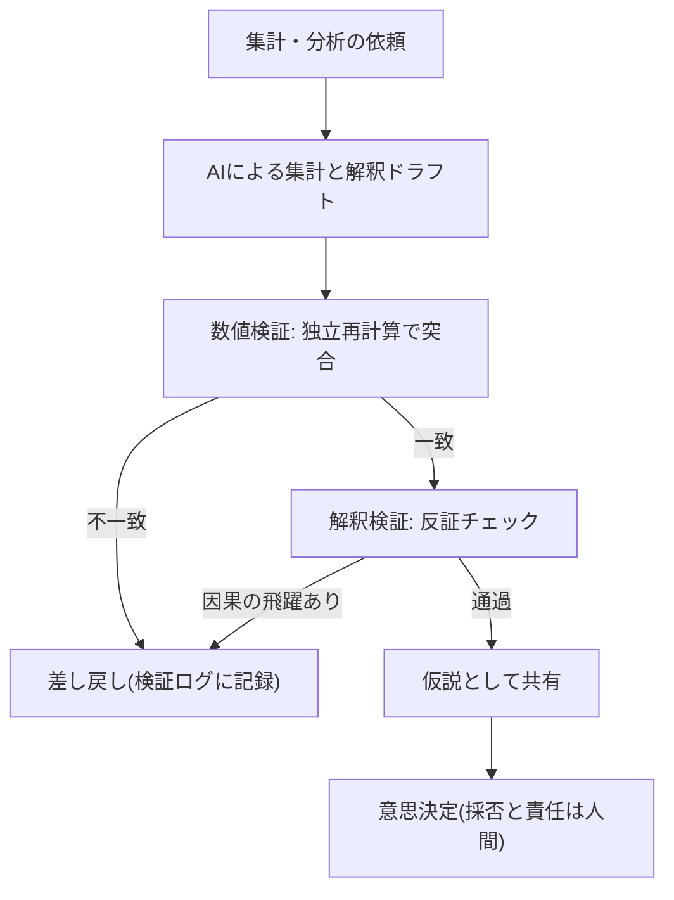

<!--
採点理由:
- impact 4: 一次集計・解釈ドラフトは経営会議・予算編成・施策評価の入力であり、意思決定の速度と品質という部門横断のKPIが動く。全社の業務構造変更(5)までは単体で到達しない。
- difficulty 3: 集計の委任自体は容易だが、数値検証(独立再計算)と解釈検証(反証チェック)の工程新設、「仮説」ラベル運用という業務フローの再設計が必要なため3。
- horizon now: 効果(完了数・速度・品質の向上)と限界(境界外での誤答増)の両方が査読水準の実験で確認済み[src-2026-106]。検証設計とセットなら待つ理由がない。
- scalability scales: 検証チェックと再計算の習慣はツール・モデル非依存で他部門に移植でき、データ定義の文書化はデータ資産として複利で効く。
- maturity practical: ベンチマーク上は人間アナリスト同等の報告があるが[src-2026-112]、境界外の誤りが残り、検証込みの標準運用はまだ確立していないためstandardとしない。
-->

## 集計と解釈の委任で得られる効果と残る危険

データの一次集計・図表化・解釈ドラフトは、AI委任の効果が実験的に確認されている領域である。コンサルタント758名を対象としたフィールド実験では、AIの能力境界の内側のタスクで完了数・速度・品質がそろって向上した[src-2026-106]。複数ドメインのデータベースでの分析業務をAIに通しで実行させた研究も、定義されたベンチマーク上では人間アナリストと同等の性能を報告している(AIベンダーであるAlibaba所属の研究者による査読採択研究であり、利益相反の可能性を割り引いて読む)[src-2026-112]。

しかし同じフィールド実験は裏面も示した。データと定性情報の統合判断が必要な、能力境界の**外側**に設計されたタスクでは、AI利用群の正答率が非利用群より大きく低下した[src-2026-106]。AIは誤るときも、正しいときと同じ自然な文章で誤る。そして境界がどこにあるかは、作業者からは事前に見えない。だから本パターンで設計すべきは生成の導入ではなく、もっともらしい誤りを業務フローのどこで捕まえるかである。出力はすべて検証前の「仮説」として扱い、検証を通ったものだけを確定した数字として使う。

> 📊 **データボックス(2026-06時点)**
> - BCGコンサルタント758名・18タスクの事前登録フィールド実験: 能力境界の内側でタスク完了数12.2%増・所要時間25.1%短縮・品質評価40%超向上。境界の外側(データ+インタビューの統合分析)ではAI利用群の正答率が19パーセンテージポイント低下(HBS Working Paper 24-013、2023年。後に査読誌掲載)[src-2026-106]
> - 同実験ではスキル下位半分の伸びが上位半分より大きく、成績分布が圧縮された[src-2026-106]
> - 大分県別府市: 生成AIとRPAの組み合わせで市民アンケートの分類作業が2週間から2日間程度に短縮(総務省WG資料、2025年3月。分析本体ではなく前処理にあたる分類工程の事例)[src-2026-111]

## 分析業務をタスクに分解する

分析業務をタスクに分け、判断/検証/実行/関係構築の4分類を当てる(分類の定義は組織・人材編「業務分解×再配置プレイブック」で説明している)。

| タスク | 4分類 | 再配置 | 検証者 |
|---|---|---|---|
| データ抽出・集計・分類 | 実行 | AI委任 | 担当者(独立再計算で突合) |
| 図表・レポート体裁の作成 | 実行 | AI委任 | 担当者(数値と表記の一致確認) |
| 異常値・前提条件の点検 | 検証 | 人間保持(AIは候補の指摘まで) | 担当者 |
| 解釈ドラフト(差異の説明仮説) | 判断の入口 | 協働(AIは仮説の列挙まで) | 分析責任者 |
| 意思決定への示唆・打ち手案 | 判断 | 協働 | 分析責任者(採否と責任は人間) |
| 関係部門への説明・すり合わせ | 関係構築 | 人間保持 | — |

注意すべきは「解釈ドラフト」の位置である。文章の形をしているため「実行」(定型作成)に見えるが、実体は判断の入口であり、ここの誤りが意思決定を直接汚染する。実行として委任せず、協働(AIは複数仮説の列挙まで、選択と断定は人間)に置く。

## 導入ステップ

1. **再計算可能な領域から始める**: データの定義(分母・期間・集計単位)が文書化されており、別経路で答え合わせできる集計業務を最初の対象にする。定義が口伝の領域への委任は誤りの検出手段がない(関連: アンチパターン集「データなき自動化」)
2. **集計の委任+全件突合**: 委任初期は合計値・件数を全件、独立経路で突合する。不一致率が2か月連続で1%未満になったら抜き取り(例: 3割)へ移行し、不一致が再発したら全件に戻す(このしきい値に出典はなく、実務上の経験則である)。なお国内公共部門で報告された大幅な時短も、分析本体ではなく前処理(分類)の委任によるものである[src-2026-111]。まず前処理・集計から始め、解釈には踏み込ませないのが初期の手堅い進め方である
3. **「仮説」ラベルの運用**: AIの解釈ドラフトには検証前であることを示すラベルを付け、検証を通るまで会議資料に載せない
4. **検証ログの運用**: 差し戻しと後工程発覚の誤りを記録する。様式は組織・人材編「実行者から検証者・設計者へ」の検証ログ最小様式を共用する(分析専用の様式を新造しない)

## 数値の誤りと解釈の誤りを分けて検証する

分析出力の誤りは**数値の誤り**(抽出条件・分母・期間・単位・計算)と**解釈の誤り**(相関の因果化・選択効果の無視・都合のよい期間切り取り・外れ値の黙殺)に分かれる。解釈の誤りは、たとえば「施策を実施した拠点ほど成績がよい」という集計から「施策が成績を押し上げた」と書いてしまう形で現れる。もともと成績のよい拠点が施策に選ばれていた可能性は、指摘されるまで見落とされやすい。検証はこの2類型に別々に当てる。

数値検証の原則は**独立再計算**——AIの計算過程を目で追うのではなく、別経路(元システムの集計機能・既存の確定値)で同じ答えに到達するかを見る。具体例を2つ挙げる(いずれも出典のない実務上の例である): ①BI・基幹システムの確定集計画面で同じ条件の合計値・件数を出して突合する、②前月・前期の確定値からのブリッジ(増減要因の積み上げ)で水準と方向を確認する。解釈検証の原則は**反証要求**——ドラフトの説明仮説に対し、反対仮説を最低1つ挙げさせ、どちらも棄却できない場合は両論併記で上げる。もっともらしい解釈ほど検証が甘くなる——これは実験が直接示した結論ではなく、境界外問題が実務でどう現れるかについての推測である。

一次集計から意思決定までの検証フローを示す。

## 効果の測り方

測る指標は次の3つとする(この組み合わせに出典はなく、実務上の設計である)。①**分析リードタイム**(依頼から共有まで)。②**差し戻し率と差し戻し的中率**(検証ログから。差し戻し的中率=差し戻した件のうち実際に数値・解釈の誤りが確認された比率——低すぎれば検証が過敏、差し戻しゼロが続けば素通りを疑う)。③**後工程発覚の誤り件数**(会議・経営層・他部門で見つかった誤りとその重大度)。①だけを測ると検証を省く圧力がかかり、もっともらしい誤りが意思決定に到達し始める。①と③は必ず対で報告する。

## 落とし穴

- **整った図表が生む信頼の錯覚**: 体裁の完成度は正しさの証拠ではない。むしろ完成度が検証を省かせる
- **検証力が育たない委任**: スキル下位層ほどAIの恩恵が大きいという実験結果[src-2026-106]は、裏返せば下位層ほど出力を鵜呑みにしやすいことを示唆する——ただしこれは実験の直接の結論ではなく、結果からの推測である。再計算と反証の訓練を委任と同時に始める(関連: 組織・人材編「新人が育たない問題」)
- **分析の民主化によるスロップ量産**: 誰でも分析レポートを作れる状態は、検証なしでは下流の修正コストに変わる(関連: アンチパターン集「ワークスロップ工場」)
- **ベンチマーク性能の過信**: 「人間同等」はベンチマーク上の話であり、自社の業務文脈・暗黙の前提の理解は測られていない[src-2026-112]

## 分析ドラフト検証チェック5問(そのまま使える)

検証者が差し戻し判定に使う5問である。出典のある標準ではなく実務向けに作成したチェックで、1問でも「いいえ」なら差し戻す。

1. 合計値・件数を、AIの出力と独立した経路で再計算して一致を確認したか
2. 分母(母集団の定義・除外条件)が依頼の意図と一致しているか
3. 期間・単位・通貨・集計粒度は資料内で整合しているか
4. 相関にとどまる関係を因果として記述している箇所はないか
5. 結論と矛盾する反対仮説・外れ値に説明が与えられているか

部門細則に載せる場合の文例: 「経営会議・予算会議に提出する分析資料は、分析ドラフト検証チェック5問の通過と検証者の記名を提出条件とする。会議事務局は受付時に記名の有無を確認し、記名のない資料は受け付けない。」

## 体制と費用の目安

以下の規模・期間・効果の数字に出典はなく、実務上の目安である。**中堅(数百名規模)**: 経営企画または経理の月次レポート系2業務から開始。兼務2〜3名(うち検証担当を明示的に任命)、期間1四半期、部門長決裁。**大企業(数千〜数万名規模)**: 検証チェックとデータ定義集をCoEまたは経営企画が一元管理し、3部門程度で並走。部門ごとに兼務2〜3名+推進専任1名、期間90〜180日、担当役員決裁。効果側のレンジ: 文書・分析系タスクで2〜4割の時間短縮という実験報告[src-2026-106]を自社のレポート業務量に当てると、月40時間のレポート業務を持つ部署で月10時間前後の創出(検証工程の新設コスト控除後)。これに対し効果の本丸は、誤った集計・解釈が経営会議に到達して起きる意思決定の誤りと手戻りの防止であり、1件の重大誤りの訂正・信頼回復コストだけで検証体制の年間コストを上回りうる(金額は自社の検証ログの後工程発覚欠陥から実測する)。

## 今日からやること

- 【推進担当】(今すぐ)対象業務を1つ選び、データ定義(分母・期間・集計単位)を文書化する。道具: 業務分解ワークシート(様式は組織・人材編「業務分解×再配置プレイブック」にある)。完了条件: 第三者が定義書だけで同じ集計を再現できること
- 【部門長】(今すぐ)検証チェック5問と「仮説」ラベル運用を部内のレポート作成手順に追加する。道具: 本ページのチェック5問+検証ログ最小様式。完了条件: 検証を通らない分析が会議資料に載らない運用が2か月続くこと
- 【CFO】(今すぐ)財務数値を含む分析は検証義務化ライン(区分の定義は組織・人材編「推進体制とガバナンスの設計図」にある)の「高」区分として全件・記名検証を義務付ける。完了条件: 規程または部門細則への明記
- 【推進担当】(1年以内)検証ログを四半期集計し、差し戻し率・後工程発覚件数を委任範囲の拡大・縮小の判断材料にする。完了条件: 委任範囲の見直しが検証ログを根拠に少なくとも1回行われること
- 【経営】(能力向上を待て)定性情報との統合判断・打ち手の選択までの委任。境界外タスクでの誤答増が実験で示されており[src-2026-106]、検証能力が部門に育つ前の委任拡大は意思決定の汚染リスクが大きい

**この主張が崩れる条件**: 自社の検証ログで、検証チェックによる差し戻し(的中したもの)と後工程発覚の誤りが2四半期連続でゼロに近いなら、本ページの検証強度は自社の対象業務には過剰であり、抜き取り検証へ軽量化すべきである(観測:【推進担当】が四半期の検証ログ集計レビューで差し戻し的中件数・後工程発覚件数を見て判定し、結果を検証ログ台帳に記録する)。逆に、統合判断を含むタスクでもAIの誤答が増えないことを示す独立の実験が複数出れば、「境界外では誤りが増える」前提自体を見直す。

(関連: 原理編「負債とスロップの分類学」=リスク区分の判定基準を定めるページ/部門別ガイド「事業企画・経営企画のAIDX」「経理財務のAIDX」「マーケティングのAIDX」=部門での適用例)

<!--
執筆メモ(レビュー重点・見立て箇所):
- 核となる実証はsrc-2026-106(high・フィールド実験)とsrc-2026-112(high・ベンチマーク)の独立2源。数値(+12.2%/25.1%/40%/19pp)はすべてデータボックスに隔離し、本文は「向上/低下」の構造記述。src-2026-112のベンダー(Alibaba)帰属は、2026-06-11第5陣の必須修正5(COI明記義務——査読採択は免罪符にならない)に従い本文の初出引用箇所で開示済み。
- 「もっともらしいほど検証が甘くなる」「下位層ほど鵜呑みにしやすい」はskill compression結果からの編集部の見立て(マーカー済み)。実験の直接の主張ではない。
- 検証チェック5問・効果測定3指標・規模感2レンジ・効果側換算(月10時間前後)は出典のない編集部の見立て。
- 検証ログは talent-reallocation の最小様式を共用し、分析専用様式を新造していない(単一情報源ルール)。「高」区分の適用は governance-structure の検証義務化ラインを参照(再定義なし)。
- 別府市事例[src-2026-111]は「分類作業」であり厳密には分析の前処理。2026-06-11第5陣レビュー(3人格一致)に従い、本文(導入ステップ2)・データボックスの両方で「前処理(分類)」の位置づけを明示済み。
- 2026-06-11 第5陣レビュー対応(上記のほか): ①独立再計算の具体例2つ(BI確定集計との突合/前月確定値とのブリッジ)と全件→抜き取り移行の数値基準(不一致率1%未満×2か月・見立て)を追記 ②検証チェック5問の経営会議提出条件としての制度化文例(部門細則記載例)を追加 ③差し戻し的中率の定義1行を効果測定に追加 ④反証条件に観測者・判定の場・記録場所を指定(新規約対応)。
- 2026-06-12 文体改修: 格言調見出し平易化・内部用語排除・見立て定型句を自然文に置換
-->
