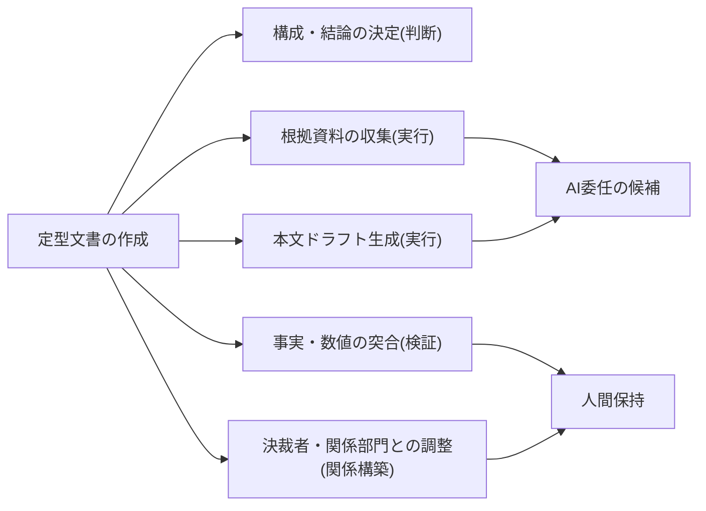

<!--
採点理由:
- impact=3: 文書作成は全部門にあるが、効果は部門の作成工数・リードタイムというKPI単位で現れる(全社の業務構造を単独で変えるものではない)。
- difficulty=2: 個人でも始められるが、定着には検証者の指名と依頼様式の整備という業務フローの軽い再設計が要るため1ではなく2。
- horizon=now: 査読付き実験2本で効果が確認済みで、担当者+検証者の体制があれば今日から運用できる。
- scalability=scales: 生成依頼カードと検証基準は文書種・部門をまたいで再利用でき、様式・文例集への還流で複利が効く。
- maturity=standard: 文書ドラフト生成は実証・実務の両面で最も確立した利用形態の一つであり、論点は可否ではなく検証フローの設計に移っている。
-->

## 一次ドラフトは委任できるが、確定と検証は人間に残す

様式が決まった文書——定例報告書、提案書、稟議書のドラフト——の一次生成は、AIへの委任が最も確実に成立する業務パターンの一つである。Science誌掲載の無作為化実験は、専門職の文書作成でAI利用群の作成時間が大幅に短縮し品質評価も向上したこと、作業の重心がドラフト執筆からアイデア出し・編集へ移ったことを示した[src-2026-107]。コンサルタント758名のフィールド実験も、AIの能力境界の内側のタスクで速度・品質の双方の向上を確認している[src-2026-106]。「使えるか」という議論は既に決着している。急ぐ理由は、個人利用が先行していることにある。手順を決めなければ、検証を経ていないドラフトが今も社内を流通し続ける——個人のアカウントで下書きを作り、体裁だけ整えて共有する使い方では、受け手からはどこまでが確認済みの記述か見分けがつかない。未承認ツールの業務利用が広範に及ぶことは海外調査の報道でも示されている(数値はデータボックス)。

ただし同じ実験が裏面も示した。能力境界の外側(複数情報の統合判断が必要なタスク)では、AI利用群の正答率が非利用群を下回り、もっともらしい誤りがむしろ増幅された[src-2026-106]。文章の「それらしさ」は品質の証拠にならない。だから本パターンの本体は生成ではなく、**生成依頼の様式化+人間の記名検証**という前後の工程設計である。

> 📊 **データボックス(2026-06時点)**
> - 大卒専門職453名の事前登録RCT: AI利用群は文書作成時間40%減・品質評価18%向上。低スキル層ほど恩恵が大きく生産性格差が縮小(Noy & Zhang、Science誌、2023年)[src-2026-107]
> - コンサルタント758名のフィールド実験: 能力境界内側のタスクで完了数12.2%増・速度25.1%向上・品質評価40%超向上。一方、境界外側に設計された統合分析タスクでは正答率が19パーセンテージポイント低下(HBS Working Paper 24-013、2023年。後にOrganization Science誌に査読掲載)[src-2026-106]
> - 報道によれば、セキュリティベンダーUpGuardの国際調査(米英加豪・NZ・シンガポール・インドの従業員等1,500人)で、80%超の労働者が未承認AIツールを業務利用し、半数が日常的に使用(Cybersecurity Dive、2025年11月報道。ベンダー発調査・報道経由のため割引が必要)[src-2026-037]

## 文書作成をタスクに分解する

分解の方法と4分類(判断/検証/実行/関係構築)の定義は組織・人材編「業務分解×再配置プレイブック」で説明している。定型文書の作成に当てはめると次のとおりである(この対応づけに出典はなく、実務上の整理である)。

文書作成を4分類にほどいた見取り図である(委任できるのは「実行」だけである)。

委任の第一候補は「実行」の2つ(根拠収集とドラフト生成)。根拠収集の前段には社内ナレッジの検索が絡むため、業務パターン「社内ナレッジ検索と回答生成」と接続する。「構成・結論の決定」は協働まで(AIは選択肢と根拠の整理まで)、検証と関係構築は人間が保持する。

## 導入ステップ

1. **対象文書の選定**: 月次以上の頻度で発生し、様式が決まっており、誤りが社内で補正可能な文書から始める(稟議書のように金銭・法令に直結する文書は検証義務化ラインの「高」扱い。区分の定義は組織・人材編「推進体制とガバナンスの設計図」にある)。
2. **生成依頼の様式化**: 下の生成依頼カードで依頼条件を固定する。依頼の質のばらつきがドラフトの質のばらつきになる。
3. **検証者の指名**: 文書種ごとに検証者を名指しし、検証ログ(最小様式は組織・人材編「実行者から検証者・設計者へ」にある)を付ける。
4. **様式への還流**: 差し戻しの頻出原因を依頼カードと文例集に書き戻す。ここで初めて複利が効き始める。

## 誰が何を検証するか

二段で設計する(この分担に出典はなく、実務上の設計である)。**作成者本人**は、ドラフト中の事実・数値・固有名詞を根拠資料と全件突合する(根拠資料に存在しない記述は削除が原則)。**検証者(上長または指名検証者)**は、論旨と結論の妥当性、読者(決裁者)に対する過不足を確認し、差し戻しは理由付きで記名記録する。差し戻しの観点は最低3つを固定する——①**論旨**(結論が根拠から導けるか)、②**過不足**(決裁者の判断に必要な情報の欠落・冗長)、③**根拠突合**(事実・数値・固有名詞が原資料と一致しているか)。観点を検証者任せにすると検証が属人化し、人が替わると品質が変わる——これは出典のある知見ではなく、運用上の経験則である。能力境界の外側ではもっともらしい誤りが増える[src-2026-106]以上、「読んで違和感がない」は確認の代替にならない——突合という機械的な工程を先に置く。

## 効果測定

測るのは3つ。①文書1本あたりの作成時間(委任前後の比較)、②検証時間、③差し戻し率。効果は「①の短縮 −②の新設コスト」の純額で報告する。作業の重心はドラフト執筆から編集・確認へ移る[src-2026-107]ため、①だけを見ると効果を過大評価する。差し戻し率は品質の代理指標であり、低すぎる場合は素通し(検証の形骸化)も疑う。対象文書種を広げる解禁基準の数値レンジ例(この数値に出典はなく、実務上の目安である): 差し戻し率が2四半期連続で15%未満なら次の文書種へ展開、ただし5%を下回り続ける場合は形骸化の閾値とみなし、抜き取り監査で検証の実態を確認してから判定する。

## 落とし穴

- **検証なき送付**: 体裁の整ったドラフトがそのまま流通し、修正コストが受け手に転嫁される(アンチパターン集「ワークスロップ工場」)。脱出は送り手への検証責任の固定。
- **能力境界の外への外挿**: 定型文書で得た成功体験のまま、複数データの統合判断を要する分析文書まで委任する[src-2026-106]。文書種ごとに委任可否を判定し直す。
- **本数のKPI化**: 作成本数・利用率が成果として報告され始めたら、アンチパターン集「ツール先行・課題不在」の入口である。

## 文書生成依頼カード(そのまま使える5項目)

ドラフト依頼時に必ず埋める様式である(出典のある標準ではなく、実務向けに作成した様式である)。検証側の様式は組織・人材編「実行者から検証者・設計者へ」の検証ログ最小様式を共用し、本パターン用の検証チェックリストは新造しない(対外文書の送付前チェックは部門別ガイドの各ページ〔営業・マーケティング・PR〕を参照)。

| 項目 | 記入内容 | 記入例(月次報告書) |
|---|---|---|
| 目的・読者 | 何を判断してもらう文書か、誰が読むか | 部門長が予算継続を判断する |
| 必須要素 | 様式上欠かせない節・記載事項 | 実績/差異要因/翌月計画 |
| 根拠資料 | 参照してよい資料の指定(これ以外から書かない) | 実績データ、前月報告書 |
| 制約・禁止 | 書いてはならない内容、入力禁止情報 | 未公表の人事情報は入力禁止 |
| 様式・分量 | 既存テンプレートと分量上限 | 標準様式、2枚以内 |

ミニケース(架空の例である): 中堅製造業の経理部門が月次経営報告に本カードを導入した。初月は「根拠資料」欄を「実績データ」とだけ書いて依頼したため、前月比差異の説明が根拠資料にない推測で埋まり差し戻しが3件出た。2か月目に根拠資料欄へ「実績データ+前月差異一覧+為替前提メモ」と資料を名指しで列挙する運用に改めてから、推測記述の差し戻しは止まり、作成は会議前日の残業帯から定時内に収まった。カードの効きどころは5項目のうち「根拠資料の名指し」である。

## 体制と費用の目安

以下の規模・期間・効果の数字に出典はなく、実務上の目安である。**中堅(数百名規模)**: 対象1文書種・作成者2〜3名+検証者1名(兼務)・期間90日・部門長決裁。既存の全社契約ツールの範囲なら追加投資はゼロ〜数十万円。**大企業(数千〜数万名規模)**: 推進部門が依頼カードと検証基準の様式を一元管理し、2〜3部門×各1文書種で並走。部門ごとに兼務2〜3名・90〜180日・担当役員決裁。**効果側の目安**: 作成時間の短縮を3〜5割と置くと(前掲実験のレンジに沿わせた仮置きであり、自社値の保証ではない)、月50本×平均2時間の文書種で月30〜50時間=人件費換算で月10万円前後、複数文書種に広げた大企業では年換算で担当数名分の工数に相当する。検証時間の新設分を差し引いた純額で稟議に書く。

## 今日からやること

- 【部門長】(今すぐ)対象文書1種を選び、ワークシートで分解する。道具: 組織・人材編「業務分解×再配置プレイブック」のワークシート。完了条件: 全タスクに4分類・再配置・検証者が記入されていること
- 【推進担当】(今すぐ)生成依頼カードを対象文書種向けに埋めて配布する。道具: 本ページの5項目様式。完了条件: 依頼カードなしの生成依頼が部内ルールで禁止されていること
- 【部門長】(今すぐ)検証者を指名し、検証ログの記録を開始する。道具: 検証ログ最小様式(組織・人材編「実行者から検証者・設計者へ」にある)。完了条件: 差し戻しが理由付きで記録され、月次で集計されていること
- 【経営】(能力向上を待て)検証工程を省いた全社一斉展開。差し戻し率と検証時間の実測が2四半期分揃うまで、無検証運用の解禁判定はしない(展開判定の数値レンジ例は効果測定の節)

**この主張が崩れる条件**: 自部門の計測で、検証工程を省いた生成文書の差し戻し率・手戻り工数が、検証付き運用と比べて2四半期連続で悪化しないとき(検証前置は過剰であり、対象文書種では事後サンプリングへ軽量化する。観測:【推進担当】が四半期レビューで検証ログ台帳を集計して判定し、結果を同台帳に記録する)。また、統合判断を要する文書でもAIの誤り増幅が観測されなくなったとの独立した複数の実験が出たとき、委任範囲の線引きを引き直す。

(関連: 業務パターン「社内ナレッジ検索と回答生成」=根拠資料側の整備/アンチパターン集「ワークスロップ工場」「ツール先行・課題不在」)

<!--
執筆メモ(ソースが薄い箇所・レビュー重点ポイント):
- src-2026-106・107はいずれもreliability: high(査読付き)。数値(40%/18%、12.2%/25.1%/19pp)はすべてデータボックスに隔離し、本文・summaryは構造記述。107のjp_note通り「中位レベルの定型的文書作成での値」であり、本文の対象を定型文書に限定して外挿を避けた。
- 4分類への当てはめ、二段検証(本人の突合+検証者の論旨確認)、生成依頼カード5項目、規模感2レンジ、効果側の目安(3〜5割・月10万円前後)はすべて出典のない編集部の見立て(マーカー明示済み)。
- 生成依頼カードはフレーム台帳の実行素材表に登録済み。検証側は検証ログ最小様式(talent-reallocation)を共用し、sales/marketing/prの対外文書チェック群とは工程(生成前の入力様式 vs 送付前の出力チェック)が異なる別物である旨を本文に明記。
- ワークスロップの統計(40%受領等)は本ページでは引用せずページ参照のみとした(sourcesにsrc-2026-036を載せない判断)。
- 2026-06-11 第5陣レビュー対応: ①検証者の差し戻し観点3つ(論旨・過不足・根拠突合)を本文に明記 ②展開解禁基準の数値レンジ例(15%未満/形骸化閾値5%)を見立てで追加 ③依頼カードのミニケース(架空例と明記)を追加 ④シャドー利用の実態数値としてsrc-2026-037(medium・ベンダー発・報道経由)をデータボックスに1点追加——「報道によれば」+COI(セキュリティベンダー)+割引注記を付し、結論には背負わせていない ⑤反証条件に観測者・判定の場・記録場所を指定(新規約対応)。
- 2026-06-12 文体改修: 格言調見出し平易化・内部用語排除・見立て定型句を自然文に置換
-->
