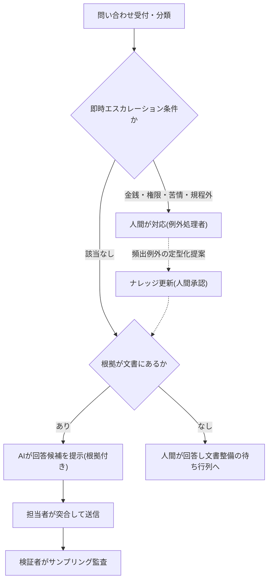

<!--
採点理由:
- impact=3: 一次解決率・処理時間・育成期間という窓口部門のKPIが動く。全社の業務構造を単独で変えるものではない。
- difficulty=3: エスカレーション基準の文書化と問い合わせフローの再設計が必須であり、ツール配布では成立しない。組織・制度の変更までは不要。
- horizon=now: 担当者支援型(AIが候補・人間が送信)は大規模な準実験で効果が確認済みで今すぐ始められる。無人の直接応答は実測後の解禁判定事項。
- scalability=scales: 振り分け基準・エスカレーション条件・ログの構造は窓口をまたいで再利用でき、例外の定型化サイクルで委任範囲が複利的に広がる。
- maturity=practical: 担当者支援型は実証済みだが、直接自動応答は運用条件付きであり、人間排除型の撤回事例もある。標準とまでは言えない。
-->

> 💡 **ひとことで言うと**
> 問い合わせ対応は、よくある質問にはAIに答えの下書きを出させ、お金や苦情などの難しい話は最初から人につなぐ、と入口で仕分ける。病院の受付が症状を聞いて診察先を振り分けるのと同じ要領である。

## AIは熟練者の応対パターンを回答候補として全員に配る

問い合わせ対応——社内ヘルプデスクも顧客サポートも——は、受付・分類・定型回答・例外対応という同じ骨格を持つ。この骨格に対するAI委任の効果は大規模に実証されている。Fortune 500企業のサポート担当者5,179名への段階導入を分析した研究は、AIが熟練者の応対パターンを回答候補として配ることで生産性が向上し、効果が経験の浅い担当者に集中したことを示した[src-2026-108]。つまりこのパターンの狙いは省人化ではなく、熟練者の暗黙知を回答候補のかたちで全員に配ることにある——これは研究の直接の結論ではなく、結果の読み解きである。

いま着手する理由もはっきりしている。国内では情報システム部門の過半が社内ヘルプデスク業務の負荷を課題と認識しており(ベンダーによる小規模PR調査のため割引が必要)[src-2026-109]、公共部門でも規程・申請方法への照会にAIで一次回答する実証が政府資料に収載される段階まで来ている[src-2026-111]。一方で、人間への到達経路を消す全面自動化は先行企業で撤回されている(部門別ガイド「カスタマーサポートのAIDX」参照)。型の核心は自動化率ではなく、**例外を人間へ確実に引き継ぐ三分岐の設計**である(この引き継ぎをエスカレーションと呼ぶ。用語集「エスカレーション」)。

本ページと部門別ガイド「カスタマーサポートのAIDX」の分担は次のとおり(相互参照)。

| ページ | 扱う範囲 |
|---|---|
| 本ページ(業務パターン) | 社内・顧客に共通する三分岐の型、振り分け基準表、検証設計、効果測定 |
| 部門別ガイド「カスタマーサポートのAIDX」 | 顧客向け窓口に固有の運用——一次対応AIの運用ルール5箇条(文例)、直接自動応答の解禁条件、BPO契約・撤回事例 |

> 📊 **データボックス(2026-06時点)**
> - カスタマーサポート担当者5,179名へのAI応対支援の段階導入: 1時間あたり解決件数が平均14%向上。新人・低スキル層は34%改善、熟練層への効果は最小限。経験2か月のAI利用者が経験6か月の非利用者と同等の成績(Brynjolfsson・Li・Raymond、NBER WP 31161、2023年。後にQJE掲載)[src-2026-108]
> - 従業員300〜1,000名企業の情報システム部門担当者108名への調査: 64.8%が社内ヘルプデスク業務に課題を実感。最大の課題は「対応に時間を取られ他の業務が進められない」62.9%。外部委託していない企業の約半数でヘルプデスクが情シス業務の20%以上を占める(キヤノンMJ、2024年。BPO事業者によるPR調査・小規模のため割引が必要)[src-2026-109]
> - 自治体のAIチャットボット導入事例: 質問数月平均7,494件に対し回答率93.9%。北九州市の規程照会実証(AI会計室)では複数部局の職員約100名が旅費の申請方法・財務会計システムの取扱・会計規程の照会に利用(総務省WG資料、2025年3月)[src-2026-111]

## 問い合わせ対応をタスクに分解する

分解の方法と4分類(判断/検証/実行/関係構築)の定義は組織・人材編「業務分解×再配置プレイブック」で説明している。問い合わせ対応に当てはめると次のようになる(この対応づけに出典はなく、実務上の整理である)。受付・分類とログ記録は「実行」、根拠が文書にある定型照会への回答も「実行」で委任候補。一方、規程にない要求の裁定・金銭や権限に関わる回答は「判断」、苦情・感情的案件は「関係構築」であり人間が保持する。回答品質のモニタリングは「検証」で人間保持。一次対応の事故は、「実行」の顔をした「判断」(定型処理に見える特例)を委任してしまうことから起きる。たとえば「規程ではこうなっているが、今回だけ認めてほしい」という依頼は、文面だけ見れば定型の照会と変わらないが、中身は裁量を要する判断である。

三分岐の振り分けと例外の還流ループを示す(本パターンの骨格)。

## 導入ステップ

1. **問い合わせログの30日計測**: 何が・何件・どの文書を根拠に聞かれているかを記録する(ログ様式は部門別ガイド「総務のAIDX」)。ログなしの着手は委任対象の選定が勘になる。
2. **振り分け基準表の作成**: 下の振り分け基準表の様式で、自動回答候補/人間確認後送信/即時エスカレーションの3区分と判定条件を文書化する。現在熟練者から上長へ上がる条件の書き出しが原型になる。
3. **担当者支援型で開始**: AIが回答候補を提示し、担当者が根拠と突合して送信する形から始める。実証された効果はこの形態のものである[src-2026-108]。
4. **実測に基づく解禁判定**: 誤答率・エスカレーション率の実測が安定してから、低リスク定型に限った直接自動応答の解禁を別途判定する(顧客向けの解禁条件・運用ルールは部門別ガイド「カスタマーサポートのAIDX」)。解禁判定の数値目安(この数値に出典はなく、実務上の目安である): サンプリング監査での誤答率1%未満・再問い合わせ率が支援型運用と同水準・即時エスカレーション条件の取りこぼしゼロ、の3つが2四半期続いてから。

## 誰が何を検証するか

**担当者**は送信前に回答候補を根拠文書と突合(突き合わせて一致を確認)する(根拠を引用できない候補は送信せず人間対応へ)。**検証者(SV=スーパーバイザー・品質管理。役割の整理は用語集「検証者」)**は送信済み回答をサンプリング監査(抜き取り点検)し、誤答率とエスカレーション率を月次集計する。**例外処理者**はエスカレーション案件を解き、頻出例外の定型化を提案する。図中の「ナレッジ更新(人間承認)」——回答の根拠となる文書・FAQの更新——の承認者は検証者(SV・品質管理)とする——例外処理者が定型化を提案し、検証者が根拠文書との整合を確認して承認する(この分担に出典はなく、実務上の設計である)。役割の定義は組織・人材編「実行者から検証者・設計者へ」、金銭・法令に関わる回答を送信前確認とする線引きは検証義務化ライン(区分の定義は組織・人材編「推進体制とガバナンスの設計図」にある)の当てはめである。

## 効果測定

①一次解決率(エスカレーションなしで完結した比率)、②平均処理時間、③再問い合わせ率(品質の代理指標)、④エスカレーション率とその解決リード時間。効果は経験の浅い担当者に集中する[src-2026-108]ため、②は新人/熟練の層別で測る——平均値だけ見ると「効果が小さい」と誤読する。育成面では、新人が独り立ちするまでの期間も指標になる。

## 落とし穴

- **ログなしの着手**: 問い合わせの分布を知らずにFAQやボットを作ると、実際の照会に接地しない(アンチパターン集「データなき自動化」)。
- **エスカレーション経路の閉塞**: 自動化率を上げるために人間到達経路を狭めると、例外と苦情が行き場を失う。人間排除型の運用は先行企業で撤回された(部門別ガイド「カスタマーサポートのAIDX」罠1)。
- **例外の還流なし**: エスカレーション案件を解いて終わりにすると、同じ例外が永遠に来る。定型化提案→ナレッジ更新(人間承認)のループを常設する。

## 一次対応の振り分け基準表(そのまま使える3区分)

窓口ごとに1枚作る(出典のある標準ではなく、実務向けに作成した様式である)。区分の重さは検証義務化ライン(区分の定義は組織・人材編「推進体制とガバナンスの設計図」にある)の当てはめであり、顧客向け窓口の文例は部門別ガイド「カスタマーサポートのAIDX」の運用ルール5箇条、前段の計測は「総務のAIDX」の問い合わせログ様式を使う。

この表の見方: 縦に3つの区分が重い順に並び、横にその判定条件・処理のしかた・記入例が並ぶ。自社の窓口に来る問い合わせがどの行に入るかを当てはめて使う。

| 区分 | 判定条件 | 宛先・処理 | 記入例(社内ヘルプデスク) |
|---|---|---|---|
| 即時エスカレーション | 金銭・権限・苦情・規程にない要求 | 例外処理者へ直接引き継ぎ | 「特例で承認してほしい」 |
| 人間確認後送信 | 根拠文書はあるが誤りの影響が大きい | AI候補+担当者の突合送信 | 「退職時の手続きを教えて」 |
| 自動回答候補 | 根拠文書があり誤りが軽微・自己修復可能 | AI候補の提示(運用安定後に直接応答を判定) | 「経費精算の締め日はいつか」 |

## 体制と費用の目安

以下の規模・期間・効果の数字に出典はなく、実務上の目安である。**中堅(数百名規模、情シス・総務の兼務ヘルプデスク1〜3名)**: 1領域(情シス系または総務系の照会)・兼務1〜2名・期間90日・部門長決裁。既存の全社契約ツールの範囲なら追加投資ゼロ〜数十万円。**大企業(数千〜数万名規模、専任ヘルプデスク・コンタクトセンター)**: 1窓口・1カテゴリの限定パイロット(専任1名+SV1〜2名・90〜180日・担当役員決裁)から段階展開。BPO(業務の外部委託)の契約がある場合は、契約・ログ所有権の確認が先行する(詳細: 部門別ガイド「カスタマーサポートのAIDX」)。**効果側の目安(算定式を主とする)**: 内訳式は「月間問い合わせ件数 × AI候補化可能比率(振り分け基準表の『人間確認後送信』+『自動回答候補』の合計比率)× 1件あたり処理時間の短縮分 − 検証・監査の新設工数」。各項は導入ステップ1の30日ログ計測の自社値で埋めるのが主であり、仮置き例(出典のない目安)では月300件×5割×10分短縮−監査月5時間≒月20時間前後=人件費換算で月数万円(中堅)。数十席の大企業窓口では、年換算で担当数名分になる。感度1行: AI候補化可能比率が3割を切る窓口(非定型に偏る)では効果は半減し、例外処理の体制強化が先になる。ヘルプデスク負荷が情シス業務の2割前後を占めるというベンダーPR調査[src-2026-109]は規模感の参考(従)に留め、結論は自社ログの実測に置く。加えて新人の独り立ち期間の短縮[src-2026-108]が採用・育成費側に効く。

## 今日からやること

- 【部門長】(今すぐ)問い合わせログの記録を開始する。道具: 部門別ガイド「総務のAIDX」のログ様式。完了条件: 30日分が集計され、頻度上位の照会種別と根拠文書の有無が一覧になっていること
- 【SV・熟練担当】(今すぐ)30日計測の完了を待たず、直近1週間のメール・チケットから100件を手動でサンプル分類する。道具: 本ページの振り分け基準表(3区分)。完了条件: 100件の区分比率と根拠文書の有無が一覧になり、基準表の初版とログ計測の仮説に反映されていること
- 【SV・熟練担当】(今すぐ)振り分け基準表を作る。道具: 本ページの3区分様式。完了条件: 即時エスカレーション条件が文書化され、現役の熟練担当のレビューを通っていること
- 【部門長】【推進担当】(今すぐ)担当者支援型の運用を1カテゴリで開始する。道具: 組織・人材編「業務分解×再配置プレイブック」のワークシート+検証ログ最小様式(組織・人材編「実行者から検証者・設計者へ」にある)。完了条件: 送信される回答に根拠の引用が付き、誤答率・エスカレーション率が月次計測されていること
- 【経営】(能力向上を待て)人間到達経路の縮小を伴う全面自動応答。誤答率・再問い合わせ率の実測が安定し、例外処理の体制が確認できるまで解禁判定をしない

**この主張が崩れる条件**: 自社の月次計測で、エスカレーション案件の定型化を続けても即時エスカレーション率が2四半期連続で下がらず、かつ担当者支援型の一次解決率・処理時間が改善しないとき(問い合わせ分布が非定型に偏っており、本パターンの委任対象がそもそも少ない。観測:【SV・品質管理】が月次の品質レビューで一次解決率・エスカレーション率の集計を見て判定し、検証ログ台帳に記録する)。その場合は一次対応の委任ではなく、例外処理の体制強化と文書整備に投資を振り替える。

(関連: 業務パターン「社内ナレッジ検索と回答生成」=回答根拠の供給側/部門別ガイド「カスタマーサポートのAIDX」「総務のAIDX」/アンチパターン集「データなき自動化」)

<!--
執筆メモ(ソースが薄い箇所・レビュー重点ポイント):
- src-2026-108はhigh(NBER/QJE)。部門別ガイド「カスタマーサポートのAIDX」が引くsrc-2026-069と同一研究(WP版と査読版)であり、数値は108のkey_facts(14%/34%/2か月=6か月)に従いデータボックスへ隔離。効果が測定されたのは担当者支援型である区別を本文・導入ステップで明示し、直接応答の根拠に転用していない。
- src-2026-109はmedium・ベンダー(BPO事業者)PR調査・n=108。報道経由ではないため「報道によれば」ではなく調査主体の直接帰属とし、COI(BPO事業者によるPR調査)と小規模性を本文・データボックスの両方で開示。結論には背負わせていない(負荷の規模感の補助のみ)。
- 「本質は熟練者の暗黙知を配ること」「三分岐の型」「振り分け基準表」「規模感2レンジ」「効果側の目安(3〜5割・月数万〜十数万円)」は出典のない編集部の見立て(マーカー明示済み)。
- 振り分け基準表はフレーム台帳の実行素材表に登録済み。検証義務化ライン(governance-structure)の当てはめであり、CSの運用ルール5箇条(顧客向け文例)・総務の問い合わせログ(前段計測)との対応を本文に明記(変種の新造ではない)。
- 図はCS部門ページの運用ループ図(顧客向け・監査ループ中心)とは別内容(三分岐の判定が中心)として作成。Klarna撤回事例はソースを持つCS部門ページへの参照で済ませ、本ページのsourcesには含めていない。
- 逆リンク要望: customer-support・general-affairsの両ページから本パターンへのリンクが望ましい(既存ページ編集禁止のため報告へ)。
- 2026-06-11 第5陣レビュー対応: ①customer-supportページとの分界を結論節の表で明示(執筆メモ内の弁明から本文へ昇格。customer-support側からの逆リンクは上記の要望として継続)②効果側目安を「自社ログ30日計測の算定式が主・ベンダーPR調査[src-2026-109]は従」に逆転し、内訳式+感度1行を追加(新規約対応。109は削除せず参考として残置——結論は背負っていない)③直近1週間100件の手動サンプル分類を今日からやることに追加 ④直接自動応答の解禁判定の数値目安(見立て)と図中「ナレッジ更新(人間承認)」の承認者(検証者=SV・品質管理)を明記 ⑤反証条件に観測者・判定の場・記録場所を指定(新規約対応)。
- 2026-06-12 文体改修: 格言調見出し平易化・内部用語排除・見立て定型句を自然文に置換
- 2026-06-12 平易化改修済み
-->
