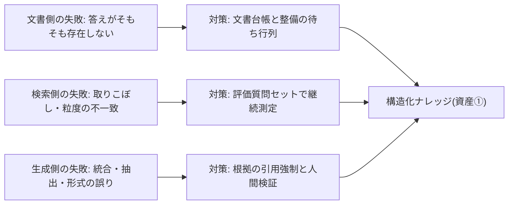

<!--
採点理由:
- impact=4: 「探して答える」は全部門の業務に埋まっており、整備されたナレッジは他の業務パターン(文書生成・問い合わせ対応)の土台にもなるため部門KPI(3)を超える。ただし単独で全社の業務構造を変える(5)わけではない。
- difficulty=3: 文書台帳・正本性・機密区分の整備という業務フロー横断の再設計が前提で、ツール導入だけでは成立しない。組織・制度の変更(5)までは不要。
- horizon=now: 着手対象は文書整備と限定領域での検証付き運用であり今すぐ始められる。無検証の全社展開は待つ対象。
- scalability=scales: 構造化された文書・評価質問セット・誤答の原因分類はモデルやツールを替えても持ち出せる複利資産。ただし構造化を飛ばした構築はdebt-riskに転落する(本文の落とし穴参照)。
- maturity=practical: 検索拡張型の回答生成は実装が普及し公共部門の実証も出たが、商用ツールでも誤答が残ることが実証されており、運用検証込みでしか成立しない。
-->

> 💡 **ひとことで言うと**
> 社内の規程やマニュアルをAIに探させて答えさせる仕組みは、本棚が散らかったままでは役に立たない。古い版や写しが混ざった棚から取った答えは間違うので、先に本棚を整理し、答えには必ず出どころを付けさせる、という話である。

## 検索回答の品質は文書側の整備で決まる

「規程のどこに書いてあるか」「過去に同じ事例はないか」——探して答える作業は全部門の業務に埋まっている。検索拡張(RAG。社内文書を探させてから答えを作らせる方式)型の回答生成はこの作業の委任候補であり、国内でも例規集・会計マニュアルを参照して職員の照会に答える公共部門の実証が政府資料に収載されている[src-2026-111]。なぜ今かと言えば、実装が普及した結果、論点が「作れるか」から「品質をどう維持するか」へ移ったからである。

ただし前提が2つある。第一に、**ナレッジ(社内の知識・文書)の構造化が先**である。本パターンは、AI-Ready編「AI-Readyの5資産」の資産①(データ・ナレッジの構造化——どれが正式な文書かが一意に決まり、最新版が判別でき、機密区分が運用されている状態)を前提条件とする。旧版と写しが混在した文書群の上では、検索は「もっともらしい誤答」を高速で配る装置になる。たとえば改訂前の規程を根拠に「手続きは変わっていない」と答えてしまう——回答に引用が付いているぶん、利用者は誤りに気づきにくい。第二に、**検索拡張しても誤答は残る**。Stanford大学の事前登録研究は、「検索拡張でハルシネーションを解消した」とうたう商用のリーガルリサーチAI(法律調査用のAIサービス)でも相当の頻度で誤答が残ることを実証した[src-2026-117](対象は米国の判例・法令検索であり、社内規程検索への適用は構造的類推である)。ハルシネーションとは、AIが事実でない内容をもっともらしく述べてしまう現象を指す。RAGを導入しても出典確認の運用は省けない。むしろRAGは、出典確認を可能にするための仕組みである——この捉え方は出典のある知見ではなく、本ページの解釈である。

> 📊 **データボックス(2026-06時点)**
> - 「検索拡張でハルシネーションを回避」とうたう商用AIリーガルリサーチツールの実測誤答率: 17〜33%。汎用モデルよりは改善するが「ハルシネーションフリー」には程遠い(Stanford RegLab、事前登録研究、2024年。後にJournal of Empirical Legal Studies掲載)[src-2026-117]
> - 北九州市「AI会計室」実証: 例規集・会計事務マニュアルを学習データとする検索回答構成で、複数部局の職員約100名が規程・申請方法の照会に利用。実証費99万円(総務省WG資料、2025年3月)[src-2026-111]
> - RAGシステムの7つの失敗点(コンテンツ不在/上位文書の取りこぼし/コンテキスト統合失敗/抽出失敗/出力形式の誤り/粒度の不一致/回答の不完全性)。「検証は運用中にのみ可能であり、頑健性は設計時に作り込まれるのではなく運用を通じて進化する」(Deakin大学、IEEE/ACM CAIN 2024採択の経験報告)[src-2026-110]

## 「探して答える」業務をタスクに分解する

分解の方法と4分類(判断/検証/実行/関係構築)の定義は組織・人材編「業務分解×再配置プレイブック」で説明している。当てはめると次のようになる(この対応づけに出典はなく、実務上の整理である)。文書の検索・該当箇所の抽出・回答ドラフトの生成は「実行」で委任候補。回答と根拠原文の突合は「検証」で人間保持。文書に答えがない問いの裁定(規程外の特例・解釈)は「判断」で人間保持——検索回答の事故の多くは、答えが存在しない問いにAIがもっともらしく答えてしまうことから起きる[src-2026-110]。

失敗の発生箇所を3グループにまとめ、対策を対応づけた図である(失敗点の出典は前掲の経験報告[src-2026-110]。3グループへのまとめ方は出典になく、本ページの整理である)。

## 導入ステップ

1. **資産①の整備状態を確認する**: 対象領域に文書台帳(どれが正式版か・責任者・機密区分)があるか。なければ本パターンの着手前にAI-Ready編「AI-Readyの5資産」資産①の最初の90日(台帳の具体様式は部門別ガイド「総務のAIDX」)を先に実行する。ここを飛ばした構築は後述の落とし穴に直行する。
2. **対象文書群を1領域に限定する**: 照会頻度が高く、誤答の影響が社内で補正可能な領域(旅費・経費規程等)から始める。機密区分で「AI参照可」の文書だけを対象にする。
3. **評価質問セットを作る**: 運用開始前に20〜30問の質問・正答根拠・合格基準を固定する(様式は下の評価質問セット様式)。質問の供給源は問い合わせログの頻出照会である。
4. **根拠の引用を強制して運用開始**: 回答には根拠文書のID・該当箇所の引用を必須とし、引用できない回答は「文書に答えがない」として人間対応へ回す。
5. **誤答を分類し文書整備へ還流する**: 検証は運用中にしかできない[src-2026-110]。誤答の原因(文書側/検索側/生成側)を分類し、文書側起因は整備の待ち行列へ書き戻す。

## 誰が何を検証するか

三層で設計する(この分担に出典はなく、実務上の設計である)。**利用者**は回答ごとに根拠原文を開いて突合してから業務に使う(出典確認の運用。引用リンクを開かずに使った誤りは利用者の責任と明文化する)。**ナレッジ責任者**は月次で評価質問セットを実行し、正答率の推移と「出典なし回答」の発生率を計測する——文書の改訂やモデルの更新で品質は静かに変動するため、定点の回帰測定が要る。**検証者**(AIの出力の正誤を判断する役割。用語集「検証者」)は誤答事例を四半期ごとに7失敗点で分類し、文書整備・運用ルールの改訂に反映する。検証ログは組織・人材編「実行者から検証者・設計者へ」の最小様式を共用する。

## 効果測定

①検索・照会の所要時間(委任前後)、②評価質問セットの正答率(月次の定点)、③「文書に答えがなかった」率(文書整備の優先度を示す先行指標。出典のない目安として、この率が3割を超える月が2か月続く領域は、検索側の改善ではなく文書整備へ投資を振り替える)、④利用者の再利用率(使われなくなった検索回答は品質警報である)。①の時短だけで成果を報告せず、②の品質定点とセットで報告する。

## 落とし穴

- **「RAGを入れればハルシネーションは解決」**: ベンダーの信頼性主張は実測で否定されている[src-2026-117]。誤答が残る前提で出典確認の運用を設計しなかった導入は、最初の重大誤答で利用停止に至る(関連: アンチパターン集「エージェント・ウォッシング掴まされ」=ベンダー主張の鵜呑み)。
- **未構造化のままの構築**: 文書整備を飛ばすとデモは動くが本番で接地しない(アンチパターン集「データなき自動化」)。構築費を払う前に、文書台帳の有無を投資ゲートの確認事項に入れる。
- **作って終わり**: 検索回答の品質は運用中にしか検証できず、設計時に作り込めない[src-2026-110]。評価質問セットと誤答還流の運用体制に予算が付いていない構築は、初期品質のまま劣化していく。

## 評価質問セット様式(そのまま使える)

運用開始前に固定し、月次で実行する回帰テスト(同じ質問を定期的に出し、品質の低下を見つける再テスト)である(出典のある標準ではなく、実務向けに作成した様式である)。質問の供給源は問い合わせログ(様式は部門別ガイド「総務のAIDX」にある)の頻出照会、前提となる文書整備は同ページの文書台帳様式を使う。

この表の見方: 1行が1つのテスト質問で、横にその正答の根拠・合格基準・直近の測定結果が並ぶ。自社版を作るときは、この3例をひな型に質問を20〜30問足していく。

| 質問 | 正答の根拠文書ID・該当箇所 | 合格基準 | 直近結果 |
|---|---|---|---|
| (例)国内出張の宿泊費上限はいくらか | 出張旅費規程 第12条 | 該当条文を引用し金額が一致 | 合格 |
| (例)規程にない交通手段を使いたい場合は | 出張旅費規程 第18条(特例) | 「総務へ申請」へ誘導し承認者を明示 | 不合格(承認者の記載漏れ) |
| (例)退職した社員の旅費精算は可能か | (文書に答えなし) | 「答えが文書にない」と回答し人間へ誘導 | 合格 |

3行目のような「答えが存在しない質問」を必ず混ぜる——もっともらしく答えてしまわないかが、このセットで最も重要な検査項目である。

合否の線(このしきい値に出典はなく、実務上の目安である): 月次測定で正答率9割以上なら運用継続。7〜9割なら対象領域を絞り、文書整備を優先する。7割未満が2か月続いた領域は検索回答の提供を停止し、人間対応へ戻す。なお「答えが存在しない質問」へのもっともらしい誤回答は、件数によらず即時の運用見直し対象とする——この型の誤りだけは利用者側で検出しにくいためである。

## 体制と費用の目安

以下の規模・期間・効果の数字に出典はなく、実務上の目安である。**中堅(数百名規模)**: 1文書領域(規程・マニュアル20〜50本)・兼務1〜2名(ナレッジ責任者+検証兼務)・期間90日・部門長決裁。既存の全社契約ツールの範囲なら追加投資ゼロ〜数十万円。外部構築する場合は数百万円規模になるため、投資判断の5択(定義は原理編「負債とスロップの分類学」)で 用語集「使い捨て構築」(捨てる前提・上限つきで作ること)の3条件を満たすかを先に判定する——捨てても文書台帳と評価質問セットは残る設計にする。**大企業(数千〜数万名規模)**: 領域ごとの段階展開。推進専任1〜2名+領域ごとのナレッジ責任者(兼務)・90〜180日のパイロット→展開・担当役員決裁・外部支出は年数百万〜数千万円規模。**効果側の目安(内訳式)**: 公共部門でも小規模・低額の限定実証から始める形が政府資料に収載されている[src-2026-111](規模・費用の実例はデータボックス)。内訳式は「対象領域数 × 領域あたり月間照会・検索件数 × 1件あたり時短 − 評価・検証・文書整備の運用工数」。仮置き例(出典のない目安): 1領域・月300件×5分短縮=月25時間から運用工数10時間を引いて月15時間前後=人件費換算で月数万円(中堅)、複数領域に広げた大企業では年換算で担当数名分。感度1行: 「答えが文書にない」率が警報水準(効果測定の節)を超える領域では時短が検証・差し戻しに食われ、純効果はゼロに近づく。効果は文書整備の進捗に遅れて立ち上がるため、最初の四半期は計測の整備期間と割り切る。

## 今日からやること

- 【推進担当】(今すぐ)対象候補領域の文書台帳の有無を確認し、なければ資産①の整備を先に起案する。道具: AI-Ready編「AI-Readyの5資産」資産①+部門別ガイド「総務のAIDX」の文書台帳様式。完了条件: 対象領域の台帳に正式版の指定・責任者・機密区分が記入されていること
- 【部門長】【ナレッジ責任者】(今すぐ)評価質問セット20問を作成し合格基準を固定する。道具: 本ページの様式+問い合わせログの頻出照会。完了条件: 「答えが存在しない質問」を含む20問が文書化され、運用開始前の初回測定が記録されていること
- 【部門長】(今すぐ)外部構築を伴う場合は、着手前に「使い捨て構築」の3条件(投資上限/残る資産の分離/捨てる条件の事前決定)を満たすか判定する。道具: 投資判断の5択(原理編「負債とスロップの分類学」で定義。使い捨て構築は3条件を満たす場合のみ負債と区別される)。完了条件: 稟議・起案書に3条件の記載が埋まり、捨てても文書台帳と評価質問セットが残る設計になっていること
- 【ナレッジ責任者】(今すぐ)出典確認の運用ルールを発行する。道具: 根拠引用の強制+利用者の突合義務の2点を部門ルールに明記。完了条件: 引用なし回答が人間対応へ回る動線が確認されていること
- 【検証者】(1年以内)誤答の四半期分類と文書整備への還流を定常化する。道具: 検証ログ最小様式(組織・人材編「実行者から検証者・設計者へ」にある)+7失敗点の分類。完了条件: 文書側起因の誤答が文書整備の待ち行列に載り、消化実績が報告されていること
- 【経営】(能力向上を待て)人間検証なしの全社展開。評価質問セットの正答率が安定し、誤答の原因分類が四半期単位で回るまで、無検証運用の解禁判定はしない

**この主張が崩れる条件**: 文書整備を進めた領域で、評価質問セットの正答率が2四半期連続で改善しないとき(品質は文書側で決まるという本ページの前提が自社では成立しておらず、検索・生成側の見直しか、本パターン自体の投資縮小を判定する。観測:【ナレッジ責任者】が四半期レビューで評価質問セットの正答率推移を見て判定し、結果を測定記録に残す)。また、未構造化の文書群のままでも検索回答の品質が人間検証付き運用と同等に維持されるとの独立した複数の調査が出たとき、前提条件(資産①先行)は過剰となる。

(関連: AI-Ready編「AI-Readyの5資産」資産①=前提条件を定義するページ/業務パターン「定型文書の生成・検証フロー」「問い合わせの一次対応と例外エスカレーション」=本パターンを土台に使う隣接パターン/アンチパターン集「データなき自動化」「エージェント・ウォッシング」)

<!--
執筆メモ(ソースが薄い箇所・レビュー重点ポイント):
- src-2026-117はhigh(Stanford RegLab・事前登録)だが対象は米国リーガルリサーチツール。jp_noteの指示どおり「社内規程検索への適用は構造的類推」と本文に明示し、17〜33%はデータボックスに隔離。本文は「相当の頻度で誤答が残る」の構造記述。
- src-2026-110はhigh(CAIN 2024経験報告)。7失敗点の3グループ化(文書側/検索側/生成側)は編集部の見立てによる再整理であり、図の直前に出典とグループ化の帰属を分けて明示した。
- src-2026-111(総務省・high)の北九州AI会計室は「100名規模・実証費99万円」を効果側レンジの接地に使用。数値の記載はデータボックスのみ(規模感節は「小規模・低額の限定実証」の程度表現+データボックス参照)。
- 評価質問セット様式・三層の検証設計・規模感2レンジ・効果側の試算(週1〜2時間等)は出典のない編集部の見立て(マーカー明示済み)。
- 評価質問セット様式はフレーム台帳の実行素材表に登録済み。供給源=問い合わせログ(general-affairs)、前提=文書台帳様式(general-affairs)との対応を本文に明記(変種の新造ではない)。
- 資産①が前提条件である旨は結論・導入ステップ1・関連リンクの3箇所で明示(発注仕様の要求事項)。資産①の定義は再掲せずfive-assetsへの参照のみ。
- 逆リンク要望: five-assets資産①・general-affairs・customer-supportから本パターンへのリンクが望ましい(既存ページ編集禁止のため報告へ)。
- 2026-06-11 第5陣レビュー対応: ①必須修正3——規模感節の「100名規模で実証費約100万円」の本文再掲を程度表現(小規模・低額の限定実証)へ変換し、数値はデータボックスのみに(隔離義務に例外なし)②評価質問セットの合格基準しきい値(9割/7〜9割/7割未満の3段)を見立てで明示 ③「使い捨て3条件」判定を今日からやることへ昇格(規模感の記述は残置)④効果側レンジを領域数×照会量の内訳式に書き換え+「答えが文書にない」率の警報水準(3割×2か月)を効果測定に追加(新規約対応)⑤反証条件に観測者・判定の場・記録場所を指定(新規約対応)。
- 2026-06-12 文体改修: 格言調見出し平易化・内部用語排除・見立て定型句を自然文に置換
- 2026-06-12 平易化改修済み
-->
