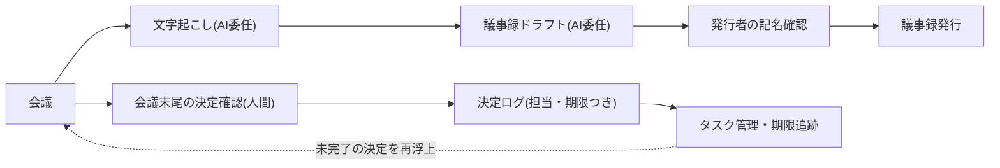

<!--
採点理由:
- impact 3: 全部門の会議運営に効くが、文字起こし・要約の自動化だけなら個人の時短(impact 1相当)。決定ログがタスク管理・次回会議・他業務の入力として再利用される設計まで到達して部門KPI(決定の実行率・会議時間)が動くため3。
- difficulty 2: 技術的には個人でも始められるが、「会議の終わり方」(決定読み上げ・確定)という運用の変更と録音同意・機密区分の整理が必要なため1ではなく2。組織・制度の変更までは不要。
- horizon now: 国内自治体で本格運用・定量効果が政府一次資料で確認されており[src-2026-111]、着手を待つ理由がない。
- scalability scales: 決定ログ様式と確定の運用は部門・ツール非依存で横展開でき、蓄積された決定ログはモデル交代後も残るデータ資産。
- maturity practical: 文字起こし・要約の自動化は広く普及しているが、本パターンの中心である「決定とタスクの構造化」までを含む運用は確立途上のためstandardとしない。
-->

> 💡 **ひとことで言うと**
> 議事録書きはAIに任せてよいが、本当の狙いは「誰が・何を・いつまでにやると決まったか」を一覧で残すことにある。会議のメモを清書するだけでなく、約束事を台帳に記して期限まで見張る、という話である。

## 価値の重心は記録の自動化ではなく決定の構造化にある

会議記録のAI化は、ほとんどの組織で最初に成立する委任の一つである。文字起こしと議事録ドラフトの作成時間が大幅に短縮されることは、国内自治体の運用実績として政府の一次資料で報告されている[src-2026-111]。ただし、本ページの定量実証は現時点でこの単一の資料に依拠しており、企業側・海外の独立実証は未収載である。時短の幅は普遍の値ではなく、自社の実測で確かめる前提で読まれたい。しかも作成時間の短縮は個人の時短であり、それだけでは投資判断の5択(定義は原理編「負債とスロップの分類学」)で「実験」止まりの案件になる。

本パターンの価値の重心は記録の自動化ではなく、**決定事項・担当・期限・根拠を構造データ(あとから検索・集計できる形のデータ)として残し、検索・追跡・突合(突き合わせ確認)できるようにすること**にある。「あの件は誰がいつまでにやると決まったか」が即座に引けて、期限切れの決定が翌週の会議に自動的に再浮上する状態が完成形である。議事録という文書はその副産物にすぎない。

> 📊 **データボックス(2026-06時点)**
> - 北海道当別町: 議事録支援ツールの本格運用(令和5年10月〜)で、導入前2〜3時間要していた議事録作成が30分程度に短縮(総務省WG資料、2025年3月)[src-2026-111]
> - 総務省研究会資料(令和6年11月再掲): 会議の議事録作成作業が1回あたり3時間30分〜6時間程度削減(75%削減)[src-2026-111]
> - 当別町では積極的に利用する職員とそうでない職員に二極化し、有効事例の発信機会を設けて対応[src-2026-111]

## 会議記録の業務をタスクに分解する

会議記録業務をタスクに分け、判断/検証/実行/関係構築の4分類を当てる(分類の定義は組織・人材編「業務分解×再配置プレイブック」で説明している)。

この表の見方: 縦に会議記録のタスク、横に分類・AIに任せられるか・誰が確かめるかが並ぶ。「決定の確定」の行だけが会議の場の人間に残る点に注目して読む。

| タスク | 4分類 | 再配置 | 検証者 |
|---|---|---|---|
| 録音・文字起こし | 実行 | AI委任 | 出席者名・固有名詞の確認のみ |
| 要約・議事録ドラフト作成 | 実行 | AI委任 | 発行者 |
| 論点の整理・対立点の明確化 | 判断 | 協働 | 議長 |
| 決定事項・担当・期限の確定 | 判断 | 人間保持(会議の場で) | 議長+出席者 |
| 議事録の最終確認・発行 | 検証 | 人間保持 | 発行者(記名) |
| 決定ログへの転記・タスク管理への接続 | 実行 | AI委任 | 担当欄の本人 |

要点は、AIは「決まったらしいこと」の下書きまでを担い、「決まったこと」への昇格は人間が行う、という分担である。会議の合意は往々にして曖昧であり、AIは曖昧な合意をもっともらしく断定形に整形する。確定の工程を会議の外(後日のドラフト確認)に置くと、誰も決めていない「決定事項」が静かに発効する。

会議から決定ログ、次回会議への循環を示す。

## 導入ステップ

1. **対象会議の選定**: 決定が多く定例で回る会議(部課の定例・プロジェクト会議)から始める。雑談的な会議は効果が薄い
2. **入力可否と録音同意の整理**: 会議音声は機密と人事情報を含みうる。録音の事前同意と、機密区分ごとの利用可否を暫定ガードレール(使ってよい範囲を定めた当面の安全ルール。用語集「ガードレール」。組織・人材編「推進体制とガバナンスの設計図」で定義)に沿って明文化する。会議冒頭で議長が読み上げる同意の文例: 「本会議は議事録作成のため録音し、AIで文字起こし・要約を行います。録音データと文字起こしは所定の場所に保管し、保存期間の経過後に削除します。記録に残したくない発言は、その場でお申し出ください。」 録音・保管をめぐる法的留意(個人情報・労務面)の主管は部門別ガイド「法務のAIDX」を参照
3. **ドラフト生成と記名確認の運用開始**: 議事録はAIドラフト+発行者の記名確認で発行する
4. **会議末尾の決定確認を定着させる**: 終了前の数分で決定事項・担当・期限を読み上げて確定し、決定ログに記帳する
5. **タスク管理への接続**: 期限切れの決定を次回会議の冒頭議題に自動で載せる

## 転記誤りと構造誤りを分けて検証する

議事録の誤りには**転記誤り**(発言の取り違え・数値の誤記)と**構造誤り**(決定でないものを決定と書く、留保条件の脱落、担当の取り違え)がある。構造誤りは、たとえば「予算は見直す方向で再検討」という発言が、ドラフトでは「予算削減を決定」と断定形で書かれる形で現れる。転記誤りは読めば気づきやすいが、構造誤りはもっともらしく書かれるため素通りしやすく、影響も大きい——この軽重の評価は出典のある知見ではなく、運用上の経験則である。検証は次の2段で設計する。

- **会議の場での確定**(構造誤りの予防): 決定・担当・期限は出席者の面前で読み上げて確定する。ドラフト側の記載はこの確定結果に合わせる
- **発行者の記名確認**(転記誤りの検出): 数値・固有名詞・否定表現を重点確認する。検証義務の重さは検証義務化ライン(区分の定義は組織・人材編「推進体制とガバナンスの設計図」にある)に従う——通常の社内会議は「中」区分だが、取締役会議事録など法定文書・対外に出る記録は「高」区分として全件・記名・記録ありで扱う

## 効果は決定の追跡可能性で測る

作成時間の短縮だけを測ると、記録の自動化で満足して止まる。測るべき指標は次の3つである(この組み合わせに出典はなく、実務上の設計である)。①**決定の追跡率**=決定ログのうち担当・期限が埋まっている割合。②**期限内完了率**=決定が期限までに実行された割合。③**検索解決時間**=「過去の決定の確認」が必要になったとき答えに到達するまでの時間。作成時間は副次指標として併記する。

なお①のベースラインは導入前には存在しない——決定ログ自体がないためである。代替として、導入直前1〜3か月分の既存議事録から「決定らしき記述」を拾い出し、担当・期限まで読み取れた割合を遡及計測(過去分にさかのぼって計測)して比較の起点にする(この代替手順も実務上の工夫である)。この遡及値が低いこと自体が、本パターンの必要性を示す最初の証拠になる。

## 落とし穴

- **全文文字起こしの保管リスク**: 発言の生データは要約より機密性が高い。保管範囲・期間・アクセス権を先に決める
- **発言の萎縮**: 録音される会議では試行的な発言が減りうる。録音しない会議の区分を残す
- **曖昧な合意の断定化**: 前述の構造誤り。会議末尾の確定で防ぐ
- **利用の二極化**: 使う人だけが使う状態は自治体の運用でも観察されている[src-2026-111]。事例共有と会議体単位での標準化で底上げする(関連: 組織・人材編「抵抗と定着」)

## 決定ログの最小様式と確定スクリプト(そのまま使える)

決定ログは5列で始める(出典のある標準ではなく、実務向けに作成した様式である)。**決定事項(1文)/根拠・留保条件/担当(個人名)/期限/確認方法(完了をどう確認するか)**。担当欄に部署名しか書けない決定は、まだ決定になっていない。

会議末尾の確定スクリプト(議長用・3行): 「本日の決定事項を読み上げます。○○を△△が□□までに行う。完了は◇◇で確認する。——修正・異議はありますか。」

決定ログが蓄積で価値を増す理由: 蓄積された決定ログは、業務パターン「社内ナレッジ検索と回答生成」の検索対象になる。「この件は過去にいつ・誰が・何を根拠に決めたか」が根拠付きで即答できるようになると、同じ議題の再審議や経緯の聞き回りという会議の固定費が下がり、ログは書くほど価値が増すデータ資産になる(資産として残るかどうかの判定は、原理編「複利の法則」の複利テスト——異動・再利用・モデル交代後も価値が残るか——で説明している)。

## 体制と費用の目安

以下の規模・期間・効果の数字に出典はなく、実務上の目安である。**中堅(数百名規模)**: 定例会議10〜20本を対象に、推進兼務1名+各会議の発行者で開始。期間1四半期、部門長決裁の範囲。**大企業(数千〜数万名規模)**: 決定ログ様式と録音・保管ルールを 用語集「CoE」(全社横断の専門チーム)が一元管理し、2〜3部門で並走。部門ごとに兼務1〜2名、期間90〜180日、決裁は担当役員。効果側のレンジ(内訳式。数字は出典のない仮置きである): 「月間対象会議数 × 1回あたり短縮時間 × 時間単価 − 確定・確認運用の新設工数」で積む。公的事例では作成時間の大幅な短縮が報告されている(数値はデータボックス)が単源のため、仮置きは保守側に置く。中堅で月80会議×1時間短縮×3,000円から確認運用(1回15分相当)を差し引いて年200万円前後。大企業では部門展開数に比例して年千万円規模になる。感度1行: 短縮が1回30分程度に留まる、または確認運用が想定の2倍かかるなら、効果は半分以下に縮む。これに加えて、決定の追跡漏れによる手戻り・再決定コストの削減が本丸だが、金額換算は自社の決定ログ運用後に実測すべきである。

## 今日からやること

- 【推進担当】(今すぐ)対象会議を選定し、録音同意と入力可否を1枚で整理する。道具: 暫定ガードレールの入力可否表。完了条件: 対象会議の出席者に同意が周知され、機密会議の除外リストがあること
- 【部門長】(今すぐ)決定ログ5列と会議末尾の確定スクリプトを自部門の定例に導入する。道具: 本ページの様式。完了条件: 2回連続で全決定に担当・期限・確認方法が記入されていること
- 【推進担当】(1年以内)決定ログをタスク管理に接続し、期限切れ決定の自動再浮上を仕組み化する。完了条件: 期限内完了率が月次で集計・報告されていること
- 【経営】(能力向上を待て)決定・担当・期限の確定までAIに委任する運用。曖昧な合意の断定化リスクが残るため、確定は会議の場の人間に残す

**この主張が崩れる条件**: 決定ログ運用を2四半期続けても、決定の追跡率・期限内完了率・検索解決時間のいずれも改善せず、効果が作成時間の短縮のみに留まるなら、「価値の重心は構造化にある」という本ページの主張は自社では成立していない——その場合は記録自動化の時短だけで投資判断をやり直すこと(観測:【推進担当】が四半期レビューで決定ログの3指標集計を見て判定し、結果を決定ログ台帳に記録する)。

(関連: アンチパターン集「コパイロット一斉配布」=効果が個人時短に拡散する失敗形/原理編「複利の法則」=決定ログが資産として残る理由)

<!--
執筆メモ(レビュー重点・見立て箇所):
- 一次出典はsrc-2026-111(総務省、high)のみの単源。ただしページの核「価値の重心は構造化」は編集部の見立てとして明示しており、111が背負うのは「作成時間の短縮」の事実のみ。時短数値はすべてデータボックスに隔離。ツール名(LoGoAIアシスタント等)は2層ルールに従い本文に書かず「議事録支援ツール」と記載。
- 「転記誤りより構造誤りが重い」「効果測定3指標」「決定ログ5列」「確定スクリプト」「規模感2レンジ+効果側換算」はすべて出典のない編集部の見立て(マーカー明示済み)。
- 取締役会議事録=高区分の適用は governance-structure の検証義務化ライン(高: 法令に直接届く)からの当てはめで、新しい区分は作っていない。
- related の knowledge-search / data-analysis-assist は、本ページの決定ログ・議事録が両パターンの入力(検索対象となる社内知識・会議で確定した数値)になる接続。
- 2026-06-11 第5陣レビュー対応: ①必須修正4——規模感節の「2〜5時間規模の削減」の本文再掲を程度表現(大幅な短縮)へ変換し、数値はデータボックスのみに ②総務省単源である旨を結論節で本文開示し、主張を一段慎重化(「確認」→「報告」、自社実測前提を明記)。企業側・海外の独立2源目の/aidx-research収集と収集前のpublished可否は要判断1で人間裁定待ち(本ページはdraft維持)③効果換算を内訳式(会議数×短縮時間×単価−確認控除)で開示し保守側へ(年数百万円→年200万円前後の仮置き。新規約対応)④決定の追跡率のベースライン遡及計測の設計を効果測定に追記 ⑤録音同意の文例1段落を導入ステップ2に追加し、法的留意はlegal正本へ参照 ⑥決定ログがknowledge-searchの検索対象になる複利の具体を1段追加 ⑦反証条件に観測者・判定の場・記録場所を指定(新規約対応)。
- 2026-06-12 文体改修: 格言調見出し平易化・内部用語排除・見立て定型句を自然文に置換
- 2026-06-12 平易化改修済み
-->
