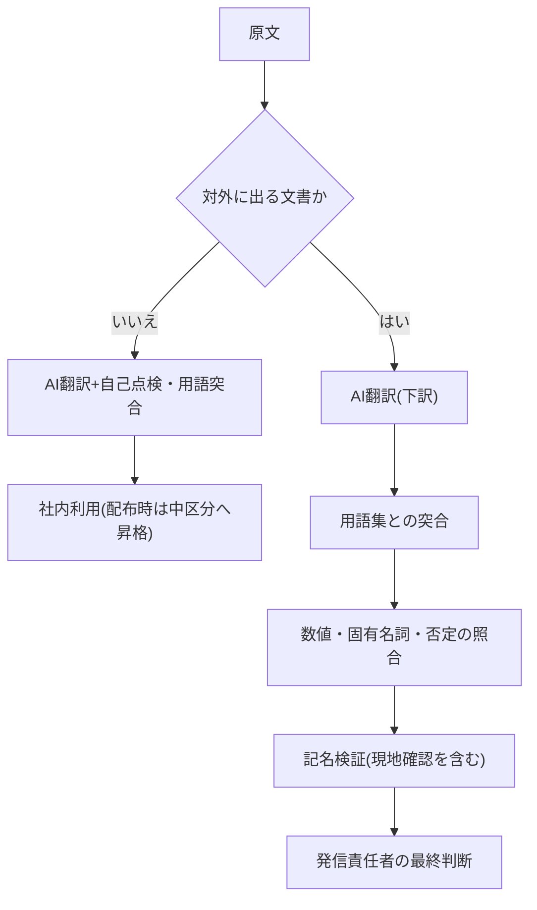

<!--
採点理由:
- impact 3: 海外取引・多言語発信を持つ部門の翻訳リードタイム・外注費・発信範囲という部門KPIが動く。翻訳単独で全社の業務構造(5)までは変わらない。
- difficulty 2: 社内文書の委任は個人でも始められる。対外文書も、既存の発信前・提出前チェック(pr/sales正本)に用語突合と記名検証を追加する差分で運用でき、フローの全面新設は不要なため3未満。
- horizon now: 機械翻訳は業務利用の歴史が長く、LLMで品質が底上げされたことは国際共通評価でも確認されている[src-2026-114]。検証区分とセットなら待つ理由がない。
- scalability scales: 対訳用語集と検証区分の運用はツール・モデル非依存で、用語集は使うほど精度が上がるデータ資産。
- maturity standard: 翻訳支援は業務パターンとして広く確立した定番。ただし「解決済み」ではなく、ドメイン・言語ペア依存の品質リスクが残る[src-2026-114]ため、検証フロー込みでの標準と位置づける。
-->

## 翻訳の委任判断は一律ではなく文書単位で行う

翻訳はAI委任が最も進めやすい業務の一つだが、「解決済み」と扱った瞬間に設計を誤る。機械翻訳の国際共通評価の2024年版総括は、LLMが上位を占める時代になったことと、ドメイン・言語ペアによる品質課題が残ることを同時に結論している[src-2026-114]。人間翻訳者との直接比較研究では、総エラー数で経験の浅い(ジュニア)翻訳者と同等、熟練(シニア)翻訳者には及ばないと報告された[src-2026-113]。

この「ジュニア相当」という位置づけが業務設計の出発点になる。ジュニア翻訳者に無検収で任せられる文書(社内共有・参考訳)はAIにも任せられる。シニアの検収を要する文書(契約・対外公表文)は、AI翻訳でも同じ重さの検証を要する。つまり本パターンの核は、翻訳の品質をツールで競うことではなく、文書のリスク区分ごとに検証の深さを定めることである。区分には検証義務化ライン(組織・人材編「推進体制とガバナンスの設計図」で定義)をそのまま使い、対外に出る翻訳文書は「高」区分(全件・記名・記録あり)に当たる。ただし重要な留保がある——前掲の比較研究は日本語ペアを評価しておらず[src-2026-113]、「ジュニア相当」という前提自体が日本語では未検証である。したがって本ページの区分設計は、主要言語ペア×文書種での自社サンプル事前評価(導入ステップ3で必須化)で確かめるまでの仮置きとして扱うこと。

> 📊 **データボックス(2026-06時点)**
> - 人間翻訳者との比較研究(2024年11月): 評価対象は中国語⇔英語・ロシア語⇔英語・中国語⇔ヒンディー語×ニュース/テクノロジー/バイオ医療。総エラー数でジュニア翻訳者と同等、シニアには及ばず。日本語ペアは未評価[src-2026-113]
> - WMT24(国際共通評価、2024年11月): 11言語ペア×3〜5ドメインで8つのLLMと4つのオンライン翻訳プロバイダを、プロの人間アノテーターによるエラースパン注釈で評価。総括は「LLM時代は来たが機械翻訳は未解決」[src-2026-114]

## 翻訳業務をタスクに分解する

翻訳・多言語化業務をタスクに分け、判断/検証/実行/関係構築の4分類を当てる(分類の定義は組織・人材編「業務分解×再配置プレイブック」で説明している)。

| タスク | 4分類 | 再配置 | 検証者 |
|---|---|---|---|
| 一次翻訳(下訳)の生成 | 実行 | AI委任 | 文書区分に応じた検証者 |
| 用語・表記の統一(用語集との突合) | 検証 | 協働(機械突合+人間確認) | 翻訳責任者 |
| 数値・固有名詞・否定表現の照合 | 検証 | 人間保持(AIは候補指摘まで) | 検証者(記名) |
| 文化的適合・現地法規との整合判断 | 判断 | 協働 | 現地拠点・法務 |
| 対外発信・提出の最終判断 | 判断 | 人間保持 | 発信責任者 |
| 現地拠点・代理店とのすり合わせ | 関係構築 | 人間保持 | — |

## 導入ステップ

1. **文書の棚卸しと区分**: 翻訳対象を「対外(契約・公表文・顧客提出物)/社内(議事録・通知・参考資料)」に分け、検証義務化ラインの高・中・低を当てる。新しい区分表は作らない
2. **対訳用語集の整備**: 製品名・役職・法務用語など、揺れると実害が出る用語から登録する。用語集はAIへの指示と人間の検証の両方が参照する共通基準になる
3. **自社サンプルの事前評価(必須)**: 委任開始前に、主要言語ペア×文書種ごとに自社の実文書サンプル50件程度(この件数に出典はなく、実務上の目安である)でAI下訳を評価する。検証者が誤りを「重大(数値・固有名詞・否定/義務の反転)」と「軽微(用語揺れ・直訳調)」に分けて数え、重大誤りの発生率で当該ペア×文書種の検証深度と委任可否を決める(記録様式は下に掲載する)。日本語ペアの公開評価は乏しく[src-2026-113]、この事前評価が区分設計の根拠になる
4. **社内文書(低・中区分)から委任開始**: 自己点検+用語突合で運用し、速度の効果を先に取る
5. **対外文書(高区分)の検証フロー接続**: 記名検証を義務化し、既存の発信前ファクトチェック(部門別ガイド「PR・広報のAIDX」)・顧客提出前チェック(同「営業のAIDX」)に用語突合を追加する。新しいチェックリストの新造はしない
6. **検証ログの運用**: 差し戻しと公開後修正を記録する。様式は組織・人材編「実行者から検証者・設計者へ」の検証ログ最小様式を共用する

文書区分による検証フローの分岐を示す。

## 誤りの型ごとに検証手段を当てる

比較研究は、AIと人間で誤りの型が異なることを示している。AI翻訳は**過度な直訳と語彙の不統一**が特徴で、人間翻訳者には文脈の過剰解釈や原文にない内容の追加が時折見られる[src-2026-113]。この非対称が検証設計の根拠になる(誤りの型から検証手段への展開は出典になく、本ページの整理である)。

- **語彙の不統一**には対訳用語集との突合を当てる。機械的に検出でき、検証コストが低い
- **直訳による意味のずれ**には、数値・固有名詞・否定/肯定の反転・義務/任意(shall/may等)の照合を当てる。意味が反転する箇所に検証を集中する
- **ドメイン依存の品質劣化**[src-2026-114]には、自社の主要言語ペア×文書種別でのサンプル事前評価(導入ステップ3で必須化)を当てる。特に日本語ペアは前掲の比較研究で未評価であり[src-2026-113]、海外研究の品質水準をそのまま前提にしない
- **契約翻訳**は、どの言語版が法的に優先するか(正文条項)の確認を検証項目に必ず含める。訳文が一人歩きして交渉相手との理解齟齬になる事故は翻訳品質と独立に起きる——これは研究の知見ではなく、実務上の注意である。なお契約類型ごとの利用可否・検証深度の細則は部門別ガイド「法務のAIDX」で定める(法務主管)こととし、本ページは検証項目に含めることだけを定める

## 効果の測り方

効率と品質を必ず対で測る(この指標構成に出典はなく、実務上の設計である)。効率側: ①翻訳リードタイム(依頼から利用可能まで)、②外注費・一次翻訳工数。品質側: ③検証での差し戻し率(検証ログから)、④公開・提出後の修正件数と重大度。効率側だけを測ると、検証を省く圧力がかかり、品質劣化が顧客・対外で発覚する。

## 落とし穴

- **「解決済み」前提の一律委任**: ドメイン・言語ペアで品質が揺れる[src-2026-114]。低リソース言語や専門文書ほど検証を厚くする
- **検証者不在の言語ペアへの委任**: 目標言語を読める検証者がいなければ、高区分文書の委任は成立しない。訳文を読める者が社内に誰もいない言語で発信すれば、誤訳は相手からの指摘で初めて発覚する。現地拠点・外部検収を検証者として確保してから委任する
- **用語の不統一の放置**: 製品名・契約用語の揺れは、文書単位では軽微でも、対外的には一貫性のない企業発信・契約解釈の火種として蓄積する
- **外注費削減だけの稟議**: 効果を外注費だけで語ると、検証体制の費用が「削減を食う邪魔者」に見え、品質側の崩壊を招く(関連: アンチパターン集「ワークスロップ工場」)

## 対訳用語集とサンプル事前評価の記録様式(そのまま使える)

用語集は5列で始める(出典のある標準ではなく、実務向けに作成した様式である)。**用語(原語)/訳語(言語別)/使用禁止の訳語/用例・文脈注記/最終確認者・確認日**。
記入例: 「検収 / acceptance (inspection) / (禁止) approval — 契約上の検収完了と社内承認を混同させるため / 売買契約の検収条項で使用 / 法務・2026-06」。
運用ルールは2つ。①公開後修正・差し戻しで見つかった訳語の揺れは、その都度用語集に追記する(検証ログが用語集を育てる)。②用語集はAIへの指示文と検証チェックの双方から参照し、二重基準を作らない。

サンプル事前評価(導入ステップ3)の記録は5列で残す(これも実務向けに作成した様式である)。**言語ペア×文書種/サンプル件数/重大誤り件数(数値・固有名詞・反転)/軽微誤りの傾向/判定(委任可・検証厚めで条件付き可・委任不可)**。
記入例: 「日→英×製品マニュアル / 50件 / 重大2件(数値転記1・shall/may反転1) / 用語揺れ多め(用語集で対処可) / 条件付き可——数値・助動詞の照合を全件実施」。
評価は言語ペア×文書種ごとに行い、結果は当該区分の検証深度の根拠として保管する。モデル・ツールの変更時は再評価する。

## 体制と費用の目安

以下の規模・期間・効果の数字に出典はなく、実務上の目安である。**中堅(海外取引のある数百名規模)**: 対象は製品資料・顧客向けメール・社内通知の3種から。推進兼務1〜2名+検証担当(現地拠点・営業の兼務)1〜2名、期間1四半期、部門長決裁。**大企業(数千〜数万名規模)**: 対訳用語集を広報またはCoEが一元管理し、対象言語2〜3・部門3〜5で並走。専任1名+部門兼務各1〜2名、期間90〜180日、担当役員決裁。初期整備の工数: 対訳用語集は主要用語100〜300語の登録で2〜5人日、サンプル事前評価は言語ペア×文書種1区分あたり50件で2〜3人日を見込む(以後は検証ログからの追記・モデル変更時の再評価で維持)。

効果側のレンジ(内訳式。数字は出典のない仮置きである): 「年間翻訳外注費 × 内製化対象比率(社内文書・参考訳が中心)− 検証工数(件数×1件あたり確認時間×単価)− 用語集整備・事前評価の工数」で積む。仮置き例: 年600万円の外注費の5割を内製化し、検証・整備に100万円相当を充てて純効果200万円前後(中堅)。多言語展開する大企業では外注費の母数に比例して数千万円規模が目安。感度1行: 検証工数が想定の2倍なら純効果はほぼ半減し、高区分文書まで内製化対象に含めると事故対応コストが効果を食う。対外文書では金額換算より、誤訳が契約解釈・対外発信の事故に発展した場合の対応コスト(訂正・交渉・信頼回復)の回避が効果の本体であり、稟議には両方を書く。

CFOが最初に行う判断: まず翻訳外注費の現状を費目横断で把握する(翻訳外注・現地法人経由・代理店費に分散しがちで、合計を誰も知らないことが多い)。次に圧縮目標を社内文書・参考訳の範囲で設定し、浮いた費用の一部を検証者の工数・用語集整備へ付け替える(削減を全額利益化すると品質側が崩れる)。外注契約は全廃ではなく、高区分文書と検証者を置けない言語ペアを外注に残す縮小判定を四半期ごとの検証ログ実績で行う。

## 今日からやること

- 【推進担当】(今すぐ)翻訳対象文書を棚卸しし、検証義務化ラインの高・中・低を当てる。道具: 検証義務化ライン(区分の定義は組織・人材編「推進体制とガバナンスの設計図」にある)。完了条件: 高区分文書の一覧と検証者(記名)が決まっていること
- 【推進担当】【翻訳責任者】(今すぐ)主要言語ペア×文書種の自社サンプル50件の事前評価を開始する。道具: 本ページのサンプル事前評価の記録様式。完了条件: 主要区分の重大誤り発生率が記録され、区分ごとの委任可否・検証深度の判定根拠になっていること
- 【広報・PR部門長】(今すぐ)対外公表文の翻訳に、発信前ファクトチェックへの用語突合の追加と記名検証を義務付ける。道具: 対訳用語集+発信前ファクトチェックリスト(部門別ガイド「PR・広報のAIDX」にある)。完了条件: 高区分の翻訳が記名検証なしに発信されない運用の確立
- 【法務】(今すぐ)契約翻訳の検証項目に正文条項の確認を追加し、AI下訳の利用範囲を定める。完了条件: 契約類型ごとの利用可否・検証深度の細則化(主管: 部門別ガイド「法務のAIDX」)
- 【営業部門長】(1年以内)顧客提出文書の翻訳を顧客提出前チェック(部門別ガイド「営業のAIDX」にある)に統合し、検証ログで差し戻し率を計測する。完了条件: 四半期ごとの差し戻し率・提出後修正件数の報告
- 【CFO】(1年以内)翻訳外注費の現状把握と圧縮目標・検証費への付け替えを予算に反映する。道具: 本ページの内訳式+外注費の費目横断集計。完了条件: 外注契約の縮小・継続の判定基準(外注に残す文書種・言語ペア)が文書化され、検証費が予算化されていること
- 【経営】(能力向上を待て)検証者を置けない言語ペア・高リスク文書への委任拡大。検証なき高区分翻訳は、速度と引き換えに対外事故の確率を買う行為である

**この主張が崩れる条件**: 自社の検証ログで、高区分文書のAI下訳の差し戻し率と提出・公開後の修正件数が4四半期連続で人手翻訳(外注)と同水準以下なら、高区分の検証を二重から一重へ軽量化してよい(観測:【翻訳責任者または推進担当】が四半期レビューで検証ログの差し戻し率・提出後修正件数を見て判定し、結果を検証ログ台帳に記録する)。加えて、日本語を含む主要言語ペア・専門ドメインでシニア翻訳者同等以上を示す独立評価が複数出れば、「ジュニア相当」を前提とした本ページの区分設計自体を見直す。

(関連: 原理編「複利の法則」=用語集が資産として残る理由/業務パターン「会議記録と決定事項・タスクの抽出」=多言語チームでの議事録展開は本パターンの低・中区分の典型)

<!--
執筆メモ(レビュー重点・見立て箇所):
- 実証はsrc-2026-113・src-2026-114(ともにhigh・独立2源)。「ジュニア同等・シニア未満」「未解決」は質的結論のため本文に置き、評価規模・言語ペア等の時点依存情報はデータボックスに隔離。日本語ペア未評価の注意(113のjp_note)は本文に明記した。
- 「誤りの型に検証手段を当てる」展開、効果測定の対、規模感2レンジ、効果側レンジ(外注費圧縮額)、正文条項の検証項目化、用語集5列様式と記入例はすべて出典のない編集部の見立て(マーカー済み)。
- 文書リスク区分は governance-structure の検証義務化ラインを参照し、翻訳専用の区分表は新造していない。対外チェックは pr(発信前ファクトチェックリスト)・sales(顧客提出前チェック5項目)の既存正本への「用語突合の追加」として書き、同型チェックリストの変種を作っていない(単一情報源ルール)。
- 対訳用語集の最小様式は新規の実行素材としてフレーム台帳に登録(marketingのブランドガイドライン構造化様式とは対象が異なる旨を台帳に明記)。
- departmentsはpr/legal/salesの指定どおり。マーケティング(多言語コンテンツ)も実務上は関係するが指定外のため related・本文参照に留めた。
- 2026-06-11 第5陣レビュー対応: ①日本語ペア未評価の含意をパイロット設計へ直結——「主要言語ペア×文書種で自社サンプル50件の事前評価」を導入ステップ3(必須)と実行素材(記録様式5列)に昇格し、結論節で「区分設計は自社検証までの仮置き」と半歩強めた(記録様式はフレーム台帳に登録済み)②CFO向けの1判断(外注費の費目横断把握→圧縮目標→検証費への付け替え/外注縮小の判定基準)を規模感に1段+【CFO】アクションを追加 ③正文条項チェックは法務正本(legal)主管を明確化(本ページは検証項目化のみ)、用語集・事前評価の初期整備工数を規模感に追加、効果側を内訳式+感度1行に書き換え(新規約対応)④反証条件に観測者・判定の場・記録場所を指定(新規約対応)。impactの3→2引き下げは要判断8で人間裁定待ちのため据え置き。
- 2026-06-12 文体改修: 格言調見出し平易化・内部用語排除・見立て定型句を自然文に置換
-->
