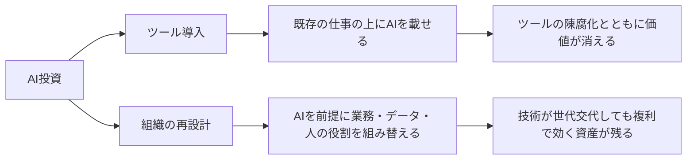
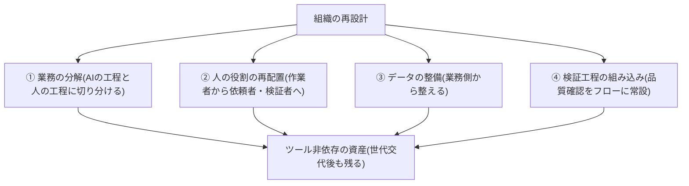

## AIDXとは業務・データ・人の役割を組み替えることである

AIDXとは「AIツールを業務に追加すること」ではなく、「AIが働けるように業務・データ・人の役割を組み替えること」である。ツール導入は既存の仕事の上にAIを載せる行為であり、組織の再設計はAIを前提に仕事そのものを作り直す行為である。

両者の分かれ道を図にすると次のとおりである(ツール導入と組織の再設計では、同じAI投資でも残るものが違う)。

この区別が本サイト全体の土台である。モデルとツールは急速に陳腐化する。一定性能のAIの推論コストは桁違いのペースで下がり続け[src-2026-003]、エンタープライズLLM市場では首位ベンダーが短期間で入れ替わった[src-2026-007]。この環境では、特定ツールへの習熟は資産として残りにくいと考えられる(これはコスト低下と首位交代という2つの観察からの推論であり、習熟の陳腐化を直接示す出典はない)。残るのは、構造化された業務、整備されたデータ、AIの出力を検証できる人の能力であり、これらは技術が世代交代しても複利で効き続ける。

> 📊 **データボックス(2026-06時点)**
> - 一定水準の性能を持つAIシステムの推論コスト: 2022年末から2024年末の2年で280分の1以下に低下(Stanford HAI AI Index 2025)[src-2026-003]
> - エンタープライズLLM市場の首位シェア: 2023年の50%が2025年には27%へ半減し、首位企業が交代(Menlo Ventures。VCによる自社調査でありポジションを持つ点に留意)[src-2026-007]

## 導入はほぼ終わったが、価値はまだ出ていない

導入率だけを見れば、AIの普及は飽和に近い。主要なグローバル調査は、大多数の組織がすでに何らかの業務機能でAIを使っている点で一致する[src-2026-003][src-2026-004]。一方、AIの価値をスケールで実現している企業はごく少数で、大多数は実質的な価値をまだ出せていない[src-2026-002][src-2026-004]。導入は飽和し、価値は少数に集中する——これが「導入と価値のギャップ」である。

日本ではこのギャップがさらに深刻だ。報道によればPwCの5カ国比較調査では、生成AIで「期待を大きく上回る効果」を得た日本企業の割合は米国の4分の1程度にとどまり、日米の効果格差は拡大傾向にある[src-2026-048]。日鉄ソリューションズの大企業調査でも、活用レベルは「情報収集・試行」「補助的・効率化」の補助的利用が大半を占め、業務プロセスへの組み込みはごく一部だった[src-2026-053]。日本の課題は導入の遅れ以上に「効果創出の遅れ」であり、その急所が業務プロセスへの組み込みである。

> 📊 **データボックス(2026-06時点)**
> - 導入率: 78%(Stanford HAI、2024年に組織の1機能以上でAI利用。前年55%)[src-2026-003] / 88%(報道によればMcKinsey 2025年調査。回答者ベースの「定常利用」。調査年・母集団・定義の違いが両者の幅の理由)[src-2026-004]
> - 価値: スケールで実現5%・実質価値なし60%(BCG 2025年、n=1,250社)[src-2026-002] / AI起因EBIT 5%超のhigh performerは約6%(報道によればMcKinsey 2025年調査)[src-2026-004] / PoCを超える能力を構築できた企業26%(BCG 2024年、59カ国1,000人)[src-2026-038]
> - 日本: 「期待を大きく上回る効果」は日本10%・米国45%(報道によればPwC 生成AI実態調査2025春)[src-2026-048] / 大企業の補助的利用約7割・プロセス組み込み2割未満(日鉄ソリューションズ 2025年、従業員1,000名以上の大企業3,757名対象。ITベンダー自社調査)[src-2026-053]

## 失敗の原因は技術ではなく組織にある

RANDが経験5年以上のデータサイエンティスト・エンジニア65人へのインタビューから特定したAIプロジェクト失敗の根本原因は5つある。①解くべき問題の誤解・誤伝達、②訓練に必要なデータの不在、③ユーザーの問題解決より最新技術の利用自体へのフォーカス、④データ管理・モデル展開インフラの不足、⑤AIには難しすぎる問題への適用、である[src-2026-035]。5つのうち純粋に技術的な原因はほぼない。RANDの結論も「AIプロジェクトの失敗は技術的障壁ではなくインセンティブの不整合によって起き、克服は機械よりも人間の問題である」と明言している[src-2026-035]。

投資配分でも同じ結論が出ている。BCGの2024年調査(59カ国のCxO・上級幹部1,000人対象)では、PoCを超えて価値を生む能力を構築できた企業は少数派にとどまり、成功企業はリソース配分の「10-20-70原則」——アルゴリズムに10%、テクノロジーとデータに20%、人と業務プロセスに70%——をとっていた[src-2026-038]。価値の源泉の7割は、ツールの外側にある。

## では「再設計」とは何か

再設計の中身を最も直接に示すのがマッキンゼーの2025年調査である。報道によれば、高い成果を出す企業はワークフローの根本的再設計を行う割合がその他企業の3倍近くに達し、再設計の実施と価値創出が強く相関している[src-2026-004]。ただしこれは横断面調査の相関であり、再設計したから成果が出たのか、成果を出す余力のある企業ほど再設計に踏み込めたのか(選択効果・逆因果)は、この調査だけでは区別できない。

> 📊 **データボックス(2026-06時点)**
> - high performerのワークフロー根本的再設計の実施率55%、その他企業約20%(2.8倍)(報道によればMcKinsey 2025年調査)[src-2026-004]
> - AI利用による何らかの負の結果を51%が経験、不正確さは30%が経験(同調査)[src-2026-004]

これらの調査を踏まえると、「組織の再設計」は次の4要素で定義できる。4要素という枠組み自体は調査に直接の出典があるわけではなく、本サイトの整理である。

1. **業務の分解**: 業務をAIに任せる工程と人が担う工程に分解し、解くべき問題を明確に定義する(RANDの根本原因①③への対処)[src-2026-035]
2. **人の役割の再配置**: AIの出力を前提に、人を「作業者」から「依頼者・検証者」へ再配置する。たとえば資料を一から書いていた担当者が、前提条件を指示してAIに下書きさせ、出来上がりに赤を入れる側に回る
3. **データの整備**: AIが働くために必要なデータとインフラを業務側から整える(根本原因②④への対処)[src-2026-035]
4. **検証工程の組み込み**: AIの出力品質を確認する工程を業務フローに正式に組み込む。負の結果の経験は珍しくない(データボックス参照)[src-2026-004]

この4要素はいずれも特定のツールに依存しない。だからこそ、モデルが世代交代しても資産として残る。

4要素の関係を図にすると次のとおりである(いずれもツールの外側にあり、世代交代後も残る資産に合流する)。

### 経費精算の再設計の例(架空のミニケース)

以下は実在の事例ではなく、4要素の使い方を示すために作った架空の例である。

**Before(ツール導入)**: 社員が領収書を見て申請画面に手入力し、規程はAIチャットに質問できるようにした。入力ミスと規程違反のチェックは従来どおり上長と経理の目視で、差し戻しの往復も残ったまま。効果は1件数分の時短止まり。

**After(4要素での再設計)**:
1. 業務の分解: 「読み取り・規程照合」はAI、「例外・グレー案件の判定」は人、と工程を切り分ける
2. 役割の再配置: 経理は全件チェック係から、AIの判定根拠を抜き取り検証し例外を裁く係へ
3. データの整備: 経費規程を判定可能な条文単位に書き直し、過去の差し戻し事例を判定基準に反映する
4. 検証工程の組み込み: AI判定の抜き取り検査と、誤判定の記録→規程改訂のループをフローに常設する

ツールを入れ替えても、分解された業務・機械可読の規程・検証の仕組みはそのまま次のモデルで使える。この再設計を月次決算・内部統制を含む部門全体に展開した例は、部門別ガイド「経理財務のAIDX」を参照。

## 日本企業への含意

日本の効果格差は、能力の差というより構え方の差が大きいと考えられる(断定できるだけの出典はない)。報道によればPwCの調査では、生成AI導入を「業界構造の根本変革」と捉える企業、社長直轄の推進体制を持つ企業、業務プロセスに正式に組み込む企業で期待以上の効果を出す割合が高いと報告されている(各属性の非該当群との比較値は報道に記載がない)[src-2026-048]。もっともこれは横断面調査の片側集計であり、構えが効果を生んだのか、効果を出せた企業が構えを整えたのかは確定できない。

> 📊 **データボックス(2026-06時点)**
> - 期待以上の効果の達成率: 「業界構造の根本変革」と捉える企業55% / 社長直轄の推進体制61% / プロセスへの正式組み込み72%(報道によればPwC 生成AI実態調査2025春)[src-2026-048] ※いずれも実施企業側の比率のみで非実施群の比較値は報道になく、要因と断定する根拠にはならない

大企業の大半が補助的利用で止まっている現状[src-2026-053]は、裏返せば再設計の余地が最も大きく残っているということでもある。

待つこと自体にもコストがある。再設計は買って済むツールと違い、業務の分解・データ整備・検証能力という組織能力の蓄積であり、後発が短期間で追いつくのは難しいと考えられる(追いつきにくさを直接測った出典はない)。日米の効果格差が拡大傾向にある[src-2026-048]以上、様子見を続けるほど相対的な劣後が固定化するリスクが高まる。ツールの選定は待ってもよいが、再設計の着手は待つほど不利になる。

## 「補助的利用」か「組み込み」かを判定する3つのテスト

業務ごとに次の3問で判定する。この3問に出典はなく、実務上の経験則である。

1. **業務フロー記載テスト**: その業務の標準手順書・フロー図にAIの工程が明記されているか。個人の裁量で使っているだけならNo
2. **停止影響テスト**: 明日AIが使えなくなったとき、業務の納期や処理量に測定可能な影響が出るか。出ないならNo
3. **検証責任テスト**: AI出力の品質を誰がどの基準で確認するか決まっているか。決まっていないならNo

3問すべてYesなら「組み込み」、1つでもNoなら「補助的利用」と判定する。補助的利用の典型部門での脱出手順は部門別ガイド「事業企画・経営企画のAIDX」が示す。

## 今日からやること

- 【今すぐ】【推進担当】判定3テストで自社のAI活用を業務単位に棚卸しする。道具: 判定3テスト+主要業務一覧。完了条件: 主要業務20件程度の判定と組み込み比率が1枚で経営に報告されている
- 【今すぐ】【CFO】AI関連予算を10-20-70原則[src-2026-038]と照合する。道具: 直近年度のAI支出の費目別集計。完了条件: 3区分(10/20/70)の比率が算出され、「70」側の不足が金額で特定されている
- 【1年以内】【部門長+推進担当】価値の出やすい業務を1つ選び、4要素でワークフローを再設計するパイロットを実施する。規模の目安(この目安に出典はなく、実務上の経験則である): 対象1業務・兼務含め3〜5名・期間90日・部門長決裁の範囲内。完了条件: before/afterの処理時間と差し戻し率が計測され、横展開可否の判定が経営会議に上がっている
- 【待て】【経営】特定ツールへの全社一斉の大型投資。推論コストの急落とベンダーシェアの激変が続く環境では[src-2026-003][src-2026-007]、ツール選定の固定化より、どのツールでも効く業務・データ・検証能力の整備を先行させることを推奨する

**この主張が崩れる条件**: 未整備のデータと暗黙知の業務のままでもAIが高精度に業務を遂行できるようになり、再設計なしの「載せるだけ」導入で価値上位企業と同等の効果が出た事例が、複数の独立した調査で確認されたとき。

(関連: 原理編「負債とスロップの分類学」/アンチパターン集「ツール先行・課題不在」=ツール導入が目的化した場合の症状と脱出/アンチパターン集「アルゴリズム90%・人10%」=本ページの10-20-70照合を放置した場合の投資偏重の失敗形)

<!--
執筆メモ(レビュー重点ポイント):
- src-2026-004はMcKinsey原典でなくCX Todayの報道(reliability: medium)のため、本文・データボックスとも「報道によれば」で帰属を明示した。原典mckinsey.comでの再確認は引き続き望ましい(調査環境からは403/タイムアウトで未確認)。
- 「推論コスト低下・シェア激変→ツール習熟は資産に残らない」は編集部の解釈であるため見立てマーカーを付し、媒介証拠としてsrc-2026-007(首位ベンダー交代)を追加した。
- 「再設計の4要素」は編集部の独自フレーム。要素2「人の役割の再配置」は直接の出典がなく見立て色が強い(フレーム全体に見立てマーカー済み)。
- src-2026-048はPwC公式でなくEnterpriseZineの解説記事(公式は403)のため「報道によれば」を付した。「10% vs 45%」はPwC公式発表での裏取りが望ましい。
- ミニケース・判定3テスト・パイロット規模感は出典のない編集部の見立てとして明記した。
2026-06-12 文体改修: 格言調見出し平易化・内部用語排除・見立て定型句を自然文に置換
-->
