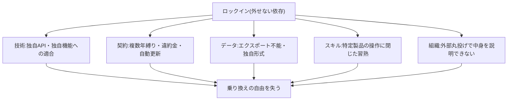
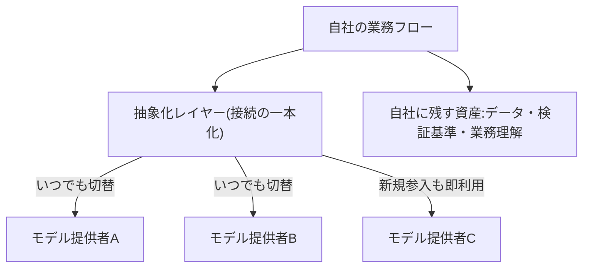

> 💡 **ひとことで言うと**
> 携帯電話の会社をいつでも乗り換えられる人は、値下げ競争が起きるたびに得をする。AIの契約も同じで、「いつでも乗り換えられる状態」を保っておけば、激しい競争はぜんぶ自社の味方になる。

## 目標は変化に耐えることではなく、変化から利益を得ることである

「反脆弱性(antifragility)」は、思想家ナシーム・ニコラス・タレブが提唱した概念で、変動や衝撃に耐えるだけでなく、そこからむしろ利益を得る性質を指す(用語の整理は用語集「反脆弱性」を参照)。この概念を企業のAI調達・契約設計に当てはめたのが本ページであり、当てはめ方自体は本サイト独自の整理である。本ページで反脆弱性と呼ぶのは、変化への耐性(壊れないこと)ではなく、**変化が起きるほど有利になる構え**である。目標は、いま選んだベンダー(製品・サービスの提供会社)が勝ち続けることに賭けることではない。**どのベンダーが勝っても負けても自社の業務能力が損なわれず、乗り換えの自由によって性能向上と価格低下の恩恵を取り込める状態**を作ることである。

判断基準は一つに集約できる。「主要な依存先が明日サービスを止めたら、業務は何日で復旧するか」。この問いに答えられない依存が本ページの対象である。

## ベンダーの勢力図は安定していない

エンタープライズ(大企業向け)AI市場では、首位ベンダーが2年余りで交代した。支出が急拡大する市場では競争と新規参入が続き、今日の最適解が来年も最適である保証はない。なお、この「市場は安定しない」という見方は、現時点では単一のVC(ベンチャーキャピタル。新興企業に投資する会社)の調査 [src-2026-007] に依拠する。独立した複数の調査で確認されたものではない。本サイトはこれを確定した構造ではなく「特定ベンダーの安定を当て込まない」ための作業仮説として扱う。その前提に立てば、特定ベンダーの独自機能に深く適合させた作り込みは、ベンダーの安定という確認できない前提に立った投資である。それ自体がリスクになる。

> 📊 **データボックス(2026-06時点)**
> - エンタープライズLLM市場(LLM=生成AIの中核技術である大規模言語モデル。その企業向けの市場)の首位シェアは2023年の50%から2025年に27%へ半減して首位が交代し、前年シェア24%の企業が40%で新たな首位に立った(Menlo Ventures、2025年11月、米国の企業AI購買意思決定者約500名調査。VCの自社調査であり投資先へのポジションに留意)[src-2026-007]
> - 同調査で企業の生成AI支出は2025年に370億ドルと前年の3.2倍に拡大 [src-2026-007]
> - 実装コスト: かつて数週間かかった開発がLLMにより1時間以下に圧縮された(米ベンチャーキャピタルa16zのパートナーのエッセイによる主張)[src-2026-009]

この不安定さを嘆く必要はない。乗り換えられる側にとって、激しい競争は「より良いものがより安く出続ける」ことを意味する。問題は乗り換えられない側に回ることである。

## ロックインには5つの形がある

ロックイン(やめたくても抜けられなくなること。用語集「ロックイン」)は、プロプライエタリ(特定企業の独自仕様)なインフラやプラットフォームを通じて生じ、テクノロジー業界全体で一般的な現象である [src-2026-012]。日本企業の実務で点検すべきロックインは、次の5つに整理できる(この5分類は出典のある枠組みではない。表注参照)。

| 形態 | 中身 | 気づきにくい理由 |
|---|---|---|
| 技術 | 独自API(システム同士の接続口)・独自機能への依存。コードや業務フローが特定製品の仕様に適合してしまう | 動いている間は問題が見えない |
| 契約 | 複数年縛り・高額な違約金・自動更新 | 契約時は割引に見える |
| データ | 蓄積したデータ・設定・ログをエクスポート(外部に取り出すこと)できない、または独自形式でしか出せない | 解約を検討して初めて発覚する |
| スキル | 従業員の習熟が特定製品の操作に閉じ、他製品に移転しない | 「使いこなし」として称賛される |
| 組織 | 構築・運用をベンダーに丸投げし、中身を説明できる人が社内にいない | 短期的には効率的に見える |

※表注: 5分類および各行の記述(中身・気づきにくい理由)に出典はなく、実務上の整理である。出典 [src-2026-012] が裏付けるのは「ロックインは業界全体で一般的な現象」という指摘までで、この分類自体ではない。

最後の組織ロックインは、構築をSIer(システム構築を請け負う会社)など外部ベンダーに委ねる慣行の強い日本企業では特に重いと考えられる(この点を直接示す調査はない)。製品ベンダーを替えられても、構築ベンダーを替えられなければ可換性(いつでも乗り換えられること。用語集「可換性」)は実現しない。

5形態の構造を図にすると次のとおりである(いずれも「外せない依存」として乗り換えの自由を奪う)。



再ブランド製品をラベルで買って中止後もロックインが残る失敗形は、アンチパターン集「エージェント・ウォッシング掴まされ」を参照。

## 依存を断つのではなく、外せるようにしておく

可換性とは依存をゼロにすることではない。外部の力は使ってよい。要点は、**個々の依存をいつでも外せる設計**にしておくことである。TechTargetの技術解説は、AIベンダーロックイン回避の実践として次の7項目を挙げる [src-2026-012]。①依存関係の把握と定期監査 ②出口戦略(データポータビリティ条項=データを持ち出す権利の取り決めを契約前に交渉する) ③モジュラー設計(部品ごとに交換できる作り) ④AIゲートウェイ(複数のAIサービスへの共通の出入口)等の抽象化レイヤー(レイヤー=層。個別のサービスに直接つながず、共通の窓口を一段はさむ作り) ⑤オープンなモデル・データ形式の優先 ⑥複数のクラウド(インターネット経由で借りる外部のコンピューター基盤)の併用 ⑦標準化動向の追跡。本ページではこれを5形態に対応づけて次のように読む。

1. **抽象化レイヤー** — AIモデルへの接続を直接依存にせず、抽象化レイヤー経由にしてモデル提供者への直接依存を断つ [src-2026-012]。業務システム側からは常に同じ窓口に依頼し、その先でどのモデルにつなぐかは設定で差し替えられるようにする構成である。技術ロックインへの対処
2. **オープン標準** — データ形式・連携仕様は独自仕様よりオープンな標準を優先する [src-2026-012]。技術・データロックインへの対処
3. **データ可搬性と出口条項** — 解約時のデータ持ち出し手段・費用・期間を**契約前に**交渉して条項化する [src-2026-012]。契約・データロックインへの対処
4. **依存の棚卸し** — 何にどう依存しているかを台帳化し、定期監査する [src-2026-012]。全形態の前提となる可視化
5. **スキルと知見の内部化** — 操作習熟より検証能力・業務分解といったツール非依存の能力に投資し、外部構築物も中身を説明できる担当を社内に置く。スキル・組織ロックインへの対処(この項は出典の7項目にはない、本サイトによる拡張である)

可換性の基本構成を図にすると次のとおりである(接続を抽象化レイヤーに一本化し、提供者をいつでも差し替えられるようにする。残すべき資産は提供者側でなく自社側に置く)。



## 可換性は守りだけでなく、市場の改善を取り込む攻めにも効く

可換性は守りの保険にとどまらない。乗り換えられる企業にとって、モデルの性能向上は「すぐ取り込める改善」、価格競争は「自動的な値下げ」、新規参入は「選択肢の増加」であり、市場の変動がすべて利益方向に働く。これが「耐える」と「利益を得る」の差である。

使い捨て構築は、この乗り換えの自由を最も気軽に使える手段だ。実装のコストは桁違いに圧縮され(データボックス参照)、「ソフトウェア創造はROIに制約されていたが、今や想像力にのみ制約される」と論じられる(ROI=投資に見合う効果。作る費用が高かった時代は見返りの見込めるものしか作れなかったが、いまは思いつけば安く作れる、の意)[src-2026-009]。捨てる前提で作れば、そもそもロックインは成立しない。ただし負債と区別されるには3条件(捨てられる額・残る資産の分離・捨てる条件の事前決定)が必要で、その詳しい定義は原理編「負債とスロップの分類学」で説明している。撤退条件・再判定日を含む調達の統治はロードマップ編「投資判断の5択」が扱い、本ページのチェックリストはその契約前段の点検にあたる。

## 調達・契約前チェックリスト(契約書に向かう前にそのまま使える8問)

新規のAI関連契約(購入・構築委託とも)の稟議前に、起案者が全問に記入する。「不明」のまま進めない。

```
【可換性チェックリスト】
1. 出口条項: 解約条件・違約金の上限・契約終了時のデータ返還と移行支援義務が
   書面にあるか
2. データ可搬性: 入力・出力・ログ・設定を含む全データを標準的な形式で
   エクスポートできるか。その費用と所要期間は明記されているか
3. 解約条件: 最低契約期間、自動更新の有無、更新拒否の通知期限はいつか
4. 技術依存: 接続を抽象化レイヤー経由にできるか。独自機能への依存箇所を
   特定し、代替手段を一つ挙げられるか
5. 標準準拠: データ形式・連携仕様はオープンな標準か、独自仕様か
6. スキル可搬性: 利用に必要な習熟は他製品でも通用するか。運用ノウハウを
   社内文書として残す体制があるか
7. 社内知見: 設定・運用の中身を説明できる社内担当が指名されているか
   (ベンダー任せにしない)
8. 台帳記載: 本契約を依存関係台帳に記載し、年次監査の対象にしたか
```

1〜5は前掲の実践 [src-2026-012] に基づく。6〜8は出典のない拡張で、実務上の点検項目として加えたものである。この関門の運用主体は法務である(関連: 部門別ガイド「法務のAIDX」)。なお、実際に解約する局面での出口側の消し込み(通知期限・データエクスポート・残存接続の停止)は、ロードマップ編「撤退プレイブック」の撤退レビュー項目4で行う。

## 体制と費用の目安

可換性はただではない。抽象化レイヤーの導入・出口条項の交渉・台帳の維持には工数がかかる。以下の目安に出典はなく、実務上の経験則である。**本格投資には初期構築費の5〜15%を可換性(抽象化・可搬性・文書化)に充てる**枠をあらかじめ取り、個別に値切らない(独自機能への依存が深い・解約困難な契約ほど上限側に寄せる)。逆に**使い捨て構築には可換性コストを掛けない**——捨てる前提のものに保険は不要で、残すべき資産の分離は前述の3条件(原理編「負債とスロップの分類学」で定義)が担保する。依存の棚卸しの体制は規模で変わる。**中堅(数百名)** なら推進担当1名の兼務で初回1〜2カ月、以後年1回の監査で維持できる。**大企業(数千〜数万名)** では部門ごとの台帳を中央の推進組織が統合する形を取り、中央に専任相当1名+各部門に兼務の記入担当、初回3〜6カ月が目安である。重い投資には厚く掛け、捨てる前提のものには掛けない。この非対称が要点である。

## 今日からやること

- 【今すぐ】【推進担当】AI関連の外部依存をすべて台帳化する [src-2026-012]。道具: 依存台帳(サービス/対象業務/データの所在/出口手段/代替候補の5列)。完了条件: 全契約が記載され、出口手段が「不明」の件数が経営に報告されている
- 【今すぐ】【CFO(財務担当役員)】新規AI契約の稟議に本ページのチェックリスト添付を必須化する。道具: 可換性チェックリスト+ロードマップ編の稟議追記欄。完了条件: 出口条項・データ可搬性が「不明」の申請を差し戻すルールが決裁規程に入る
- 【1年以内】【推進担当】AIモデルへの接続を直接依存から抽象化レイヤー経由へ移行する [src-2026-012]。道具: 移行対象の優先順位リスト(業務影響の大きい順)。完了条件: 主要な接続で代替への切替演習が年1回実施される。切替演習の最小手順(この手順に出典はなく、実務上の経験則である): 対象1接続を選び、半日で代替モデル・サービスへ切り替え、①業務出力の品質 ②コスト・応答速度 ③切替の所要時間 の3点を確認して依存台帳に記録する
- 【1年以内】【CHRO(人事担当役員)】研修予算をツール固有の操作研修からツール非依存の能力(検証能力・業務分解)へ寄せる。道具: 研修費の内訳集計。完了条件: ツール固有研修の比率が把握され、翌年度計画で非依存側が過半になる
- 【待て】【経営】解約困難な複数年の大型契約。市場の首位が短期で入れ替わる現状では [src-2026-007]、縛りの長さは割引でなくリスクである。再開条件: チェックリスト8問すべてに「不明」がなくなること

**この主張が崩れる条件**: AI市場が寡占で安定して首位が複数年固定され、かつ乗り換えで得られる性能・価格の利得が可換性維持コストを下回り続けることが実測で示されたとき、可換性投資は過剰な保険となり「最有力ベンダーへの深い適合」が最適解になる。

(関連: 原理編「負債とスロップの分類学」=使い捨て構築3条件の定義、ロードマップ編「投資判断の5択」=調達経路・撤退条件・再判定の手順、原理編「AIDXの定義」=ツール非依存で残る資産の定義。役割分担: AI-Ready編「AI-Readyの5資産」資産⑤が可換性を全社資産として定義し、AI-Ready編「AI-Ready自己診断」問21〜25はその現状診断、本ページのチェックリスト8問は個別契約の締結前点検を担う)

<!--
執筆メモ(2026-06-11、同日レビュー指示反映):
- 「反脆弱性」はレビュー指示3に従いナシーム・ニコラス・タレブの提唱概念と帰属し、「企業AI調達への適用は編集部の整理」と本文冒頭に明示した。タレブの書誌(『Antifragile』2012)はsources/未登録のため、概念帰属(数値なし)の範囲にとどめた。glossary追加+書誌ソース登録が候補。
- レビュー指示1: 「数週間→1時間以下」[src-2026-009]は本文直書きをやめデータボックスへ隔離。表現はsrc-2026-009のkey_facts原文に忠実な形(time-horizonのボックスと同型)で統一。time-horizonは並行改稿中のため、公開前に両ページの突合を監査(/aidx-audit)で確認のこと。
- レビュー指示2: 市場不安定性の構造主張が単一VC調査[src-2026-007]依拠である旨を本文開示し、「作業仮説」へ一段階慎重化した。
- ロックインの5形態は編集部の独自整理(src-2026-012は「ロックインは業界全体で一般的」という一般的指摘のみ)。本文の見立てマーカーに加え、レビュー指示4に従い表直下に無出典である旨の表注を追加。「組織ロックイン(SIer丸投げ)」はsrc-2026-012のjp_note由来で、本文では編集部の見立てとして記載。
- 設計原則5項のうち1〜4はsrc-2026-012のkey_facts(7実践)の再構成、5(スキル・知見の内部化)は編集部の拡張であることを本文に明記。チェックリストも同様に1〜5が出典あり/6〜8が拡張と本文で区別した。
- src-2026-007はVC自社調査(medium)のため、データボックスで調査主体・利益相反を開示。個社名は2層ルールに従い本文・データボックスとも記載せず「首位が交代」の構造記述とした(aidx-is-redesign.mdの先例に合わせた)。「2年余りで交代」の期間表現はinvestment-decision.mdの執筆メモ(原データ2023→2025年)に準拠。
- 規模感はレビュー指示6に従い「初期構築費の5〜15%」のレンジ+中堅/大企業の2レンジに改稿。切替演習の最小手順(指示7: 対象1接続・半日・確認3点)も含め、全面的に出典なしの見立て(本文明記済み)。人間レビューで妥当性確認を。
- 使い捨て3条件・撤退条件・再判定日は単一情報源ルールに従い再定義せず、正本2ページへのテキスト参照のみとした。
- 「相互運用標準を推進する業界団体」(src-2026-012のAgentic AI Foundation)は団体名の固有性が高く検証が薄いため本文から割愛した。
2026-06-12 文体改修: 格言調見出し平易化・内部用語排除・見立て定型句を自然文に置換
2026-06-12 平易化改修(検品反映): 冒頭段落の話者切替を明示(タレブ→本サイトの整理)/LLM・a16z・抽象化レイヤー・クラウドの初出言い換え/「オプションを行使」を「乗り換えの自由を使う」に平文化/ROI引用文に意味の注記/CFO・CHRO初出言い換え。事実・数値・出典タグは不変。
-->
