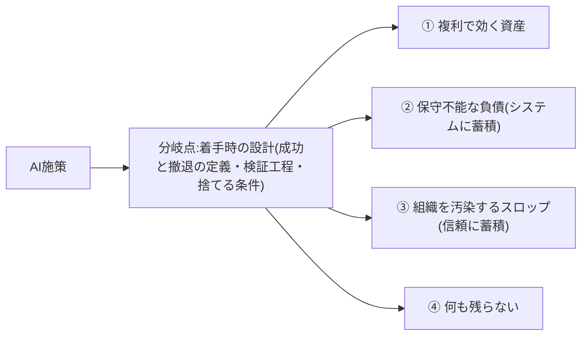
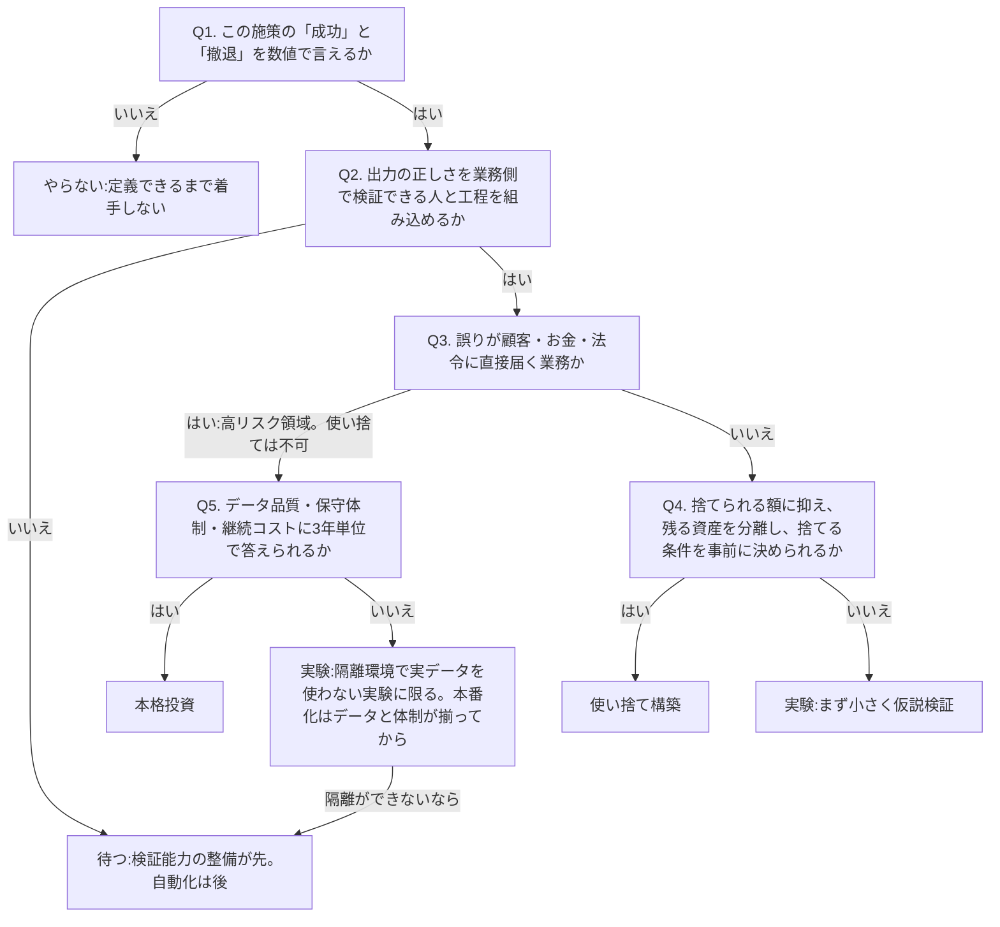

> 💡 **ひとことで言うと**
> AIの取り組みの行き着く先は、続けるほど効く財産になることもあれば、直せる人のいない厄介物や、見た目だけ立派な書類の山で終わることもある。家の工事と同じで、出来上がりの良し悪しは着工前の設計図でほぼ決まる。だから始める前に5つの質問で「本気でやる・小さく試す・様子見・やらない」などの行き先を決めておく、というページである。

## AI施策の結末は4つに分かれ、分岐は着手時にほぼ決まる

AI施策の結末は4つに分かれる。**①複利で効く資産、②保守不能な負債、③組織を汚染するスロップ、④何も残らない**、である。スロップとは、よくできた仕事を装うが中身のないAI生成物のことで、受け取った側に確認や手直しの負担を押しつける(詳しくは後述の節で説明する)。どの結末に落ちるかは運用の巧拙ではなく着手時の設計でほぼ決まる、というのが本ページの立場である(この因果を直接実証した調査はない)。すなわち「成功と撤退の定義」「出力を検証する工程」「捨てる条件」を最初に決めたかどうかだ。本ページは、いま進めている(これから始める)AI施策がどの結末に向かっているかを判定するための1枚である。

4つの結末の分岐を図にすると次のとおりである(分岐点は運用ではなく着手時の設計にある)。

施策1件を投資判断の5択──本格投資/使い捨て構築/実験/待つ/やらない──へ振り分ける判定の質問・しきい値・出口(=最終的に5択のどれに行き着くかの結論)は、本ページで定義する。他のページはこの判定を要約・参照の形で扱っており、記述が食い違う場合は本ページの定義が優先する。ロードマップ編「投資判断の5択」は、判定後の調達経路(buy/build)の選択とポートフォリオ全体の設計を扱う。

## 放棄は事前の予測より速く広がっている

構造はこう要約できる。導入の急拡大とともに放棄も急増している。PoC(試験導入。用語集「PoC」)の後に放棄される割合は、アナリストの事前予測より実際のほうが多かった。組織はPoCの相当部分を本番化(実際の業務への投入)の前に破棄しており、中止の主因はコスト・データプライバシーリスク・セキュリティ懸念である [src-2026-034]。一方で早期採用者には収益増・コスト削減・生産性向上が同時に報告されており、価値を出す企業との二極化がはっきりしている [src-2026-033]。失敗が多数派でも、資産化に成功する側は確かに存在する。問題は「やるかやらないか」ではなく、どちらの側に入る設計をしているかだ。

> 📊 **データボックス(2026-06時点)**
> - 「AIイニシアティブの大半を放棄した」企業の割合: 前年の17%から42%へ急増(S&P Global Market Intelligence調査、2024年10〜11月実施、北米・欧州のITおよび事業部門の中堅・上級職1,000人超が回答。CIO Diveの報道による)[src-2026-034]
> - 同調査で、組織は平均してPoCの46%を本番化前に破棄 [src-2026-034]
> - Gartnerは2024年7月、生成AIプロジェクトの少なくとも30%が低品質データ・不十分なリスク統制・コスト膨張・不明確なビジネス価値により2025年末までにPoC後に放棄されると予測 [src-2026-033]
> - Gartner早期採用者調査(2023年9〜11月、822組織): 平均で収益15.8%増・コスト15.2%削減・生産性22.6%向上 [src-2026-033]

> **囲み: 「95%失敗」の読み方 — 数字の乱立を整理する**
> 最も流通している「企業の生成AIパイロットの95%が失敗」は、MIT NANDAイニシアティブの報告書(2025年8月公表、Fortune報道。リーダー150人へのインタビュー・従業員350人調査・公開事例300件の分析)による数字で、「急速な収益加速を達成したのは約5%のみ、残り95%はP&L(損益計算書)に測定可能なインパクトをほぼ与えなかった」とするものである [src-2026-031]。ただしこの「失敗」の定義は「パイロット後6カ月以内に測定可能な財務ROI(投資に見合う効果)を伴う本番展開へ進まなかった」ことに限定され、効率化・コスト削減など他の価値創出経路を除外しており、「ゼロリターン」の判定はわずか52件のインタビューに依拠する [src-2026-032]。つまり95%は「半年で損益計算書を動かせなかった割合」であって「全AI投資が無駄」という意味ではない。引用するなら定義込みで使うべき数字である。

## 負債はどう生まれるか——「素早い勝利」の保守コストは後から膨らむ

AI技術的負債の原典は、機械学習システムの隠れた技術的負債を体系化したSculleyらの2015年の論文(機械学習分野の国際会議NeurIPSで発表)である。機械学習は「素早い勝利」をもたらすが、実世界のシステムには巨大な継続保守コスト=隠れた技術的負債が伴う、というのが論文の警告である。論文は負債の類型として、境界侵食(仕組み同士の区切りが崩れること)・もつれ(部品が絡み合い一部だけ直せないこと)・隠れたフィードバックループ(出力が回り回って入力に影響する見えない循環)・宣言されないデータ消費者(そのデータを誰が使っているか把握されていないこと)・構成負債(設定の継ぎ足しが管理不能になること)・グルーコード(仕組み同士をつなぐ即席の継ぎはぎプログラム)を特定した。この負債は通常のプログラムの負債と違い、システム全体やデータの側に潜むため見つけにくく、リファクタリング(プログラムの内部整理・書き直し)だけでは返済できない [src-2026-040]。

この枠組みは、生成AI時代に次の3つの形で繰り返されていると本ページでは整理する(古典類型との対応づけに出典はない)。

この表の見方: 読むのは左2列(負債型・中身)で足りる。右列は前段の論文の専門用語との対応で、原典に当たる読者向けの参考である。

| 負債型 | 中身 | 古典類型との対応(本ページの対応づけ) |
|---|---|---|
| 検証工程なき自動化 | 出力の正否を判定する人と基準を置かないまま業務に組み込む | 隠れたフィードバックループ、もつれ |
| ブラックボックス外注 | 中身を説明できる人が社内にいない成果物 | 境界侵食、構成負債 |
| グルーコード蓄積 | 個別の自動化をつなぐ即席の連結部が増殖し、全体を誰も把握していない | グルーコード、宣言されないデータ消費者 |

共通項は「動いているが、直せる人がいない」である。たとえば、問い合わせへの自動返信が誤った案内を出し続けているのに、設定した担当者はすでに異動していて、直し方を知る人が社内に誰もいない——という状態がこれにあたる。負債は止まった日に初めて請求書になる。

負債が組織内で雪だるま式に蓄積し保守不能化する経過は、アンチパターン集「隠れ負債の雪だるま」を参照。

## スロップは受け手に負担を押しつける

workslop(ワークスロップ)とは「よくできた仕事を装うが、タスクを有意義に前進させる実質を欠くAI生成の業務コンテンツ」である(BetterUp LabsとStanford Social Media Labの共同調査、HBR 2025年9月)[src-2026-036]。(用語の正式表記は用語集「ワークスロップ」を参照)

重要なのは損失額より構造である。第一に、workslopは作業負担を下流に移転させる。受け手が解釈・修正・やり直しを強いられ、コストは送り手の画面には映らない [src-2026-036]。第二に、評判コストが送り手個人に返ってくる。受け手は送り手の創造性・能力を低く評価し、信頼を下げる [src-2026-036]。負債がシステムに蓄積するのに対し、スロップは人と人の信頼に蓄積する。稟議資料と報連相文書の多い日本企業では、体裁の整った文書ほど通りやすいぶん、この被害構造はより出やすいと考えられる(日本企業を対象にこの点を調べた出典はない)。

> 📊 **データボックス(2026-06時点)**
> - 米国のフルタイムデスクワーカー1,150人を対象とした継続調査(2025年8〜9月時点の集計)で、回答者の40%が過去1カ月にworkslopを受け取り、職場で受け取るコンテンツの約15.4%が該当すると推計 [src-2026-036]
> - 1件への対処に平均1時間56分を要し、従業員1人あたり月186ドル、1万人規模の組織では年間900万ドル超の生産性損失に相当と試算(米国デスクワーカー対象の試算であり、日本企業への外挿はしていない)[src-2026-036]
> - 送り手の約半数が「創造性・能力が低い」とみなされ、42%が「信頼できない」と評価された [src-2026-036]

## 着手前の5問で出口を決める判定フローチャート

以下の質問を順に問い、出口を投資判断の5択──**本格投資 / 使い捨て構築 / 実験 / 待つ / やらない**──に振り分ける。質問の設計自体に出典はなく、PoC放棄の主因(不明確なビジネス価値・低品質データ・リスク統制 [src-2026-033])と負債・スロップの発生構造 [src-2026-040] [src-2026-036] から逆算して本ページが組み立てたものである。Q5の「3年」という期間にも直接の出典はなく、「半年でP&Lを動かしたか」という短期判定(前掲95%の定義)への対置として設定した。

次のフローチャートが判定の全体である(Q1から順に問い、5つの出口のいずれかを宣言する)。

| 出口 | 条件の要約 | 主に防いでいる結末 |
|---|---|---|
| 本格投資 | 成功定義・検証工程・3年の保守とデータの計画が揃う | 負債 |
| 使い捨て構築 | 低リスク領域で、後述の3条件を満たす | 負債(野良ツール化) |
| 実験 | 価値仮説はあるが本番化の条件が未充足(高リスク領域では隔離環境・実データ不使用が条件) | 何も残らない |
| 待つ | 検証能力が未整備 | スロップ・負債 |
| やらない | 成功と撤退を定義できない | 何も残らない |

Q1で止まる施策は珍しくない。不明確なビジネス価値はGartnerが挙げたPoC放棄の主因の一つである [src-2026-033]。Q2はスロップと負債の両方を分ける質問である。検証なき自動化はシステムに負債として [src-2026-040]、検証なき配布は受け手への負担転嫁として [src-2026-036] 蓄積する。

### 判定を誰が・いつ・どう記録するか

以下の運用設計に出典はなく、実務上の経験則である。判定は推進担当が起案し、部門長が承認する。ただし高リスク領域(Q3=はい)の施策は部門長承認で済ませず、経営会議の承認事項とする。判定は一度きりにせず四半期ごとに再判定し、撤退条件に触れた施策は次回を待たずに即時再判定する。新規施策だけでなく既進行の案件も、次回の四半期レビューで一括して本フローにかけて出口を宣言する——「もう走っているから」は判定免除の理由にならない。記録は次の4列の台帳で足りる。

| 施策名 | 出口 | 撤退条件 | 次回判定日 |
|---|---|---|---|
| (記入例)問い合わせ一次回答の下書き生成 | 使い捨て構築 | 出力の修正率が3カ月連続で半数を超えたら廃棄 | 2026-09末 |

この台帳の様式(部門・対象業務・検証者・状態・撤退条件発動日・最終更新日の列を加えた記入例付きCSV)は、本サイトの「テンプレート」ページからダウンロードできる。

## 「使い捨て構築」が負債と区別される3条件

ソフトウェア構築の経済性は根本的に変わった。かつて数週間かかった開発は1時間以下に圧縮され、「ソフトウェア創造はROIに制約されていたが、今や想像力にのみ制約される」と論じられる。スケールや収益化を前提としない超ニッチ・短命の目的特化ソフトウェアが成立し、汎用製品の購入に代わってマイクロな対象向けの自作が正当化されうる [src-2026-009]。

だからこそ規律が要る。使い捨て構築が負債と区別されるのは、次の3条件を満たす場合のみである。

1. **投資上限を「捨てられる額」に抑える** — 惜しくなる金額を入れた時点で、それは捨てられないものになる。「捨てられる額」かどうかは次の3点で判定する(この基準に出典はなく、実務上の経験則である): ①部門長の決裁枠内に収まる、②単年度で費用化できる、③全損しても経営会議への説明が不要。一つでも外れるなら、それは「捨てられる額」ではない。
2. **捨てても残る資産を分離する** — データ・業務理解・検証基準を成果物の外に置く。道具は消えても、この3つは次の道具に引き継げる。
3. **捨てる条件を事前に決める** — 「いつ・何が起きたら廃棄するか」を着手前に文書化する。

使い捨てに向くのは周辺・実験領域であり、基幹業務は別である(この線引きに出典はなく、フローチャートのQ3がこの境界を担う)。3条件なしの「安く作れるからとりあえず作る」は、業務部門発の野良ツール(会社が把握していない自作ツール)の乱立という新種の負債を生むだけである。

## 今日からやること

- 【今すぐ】【推進担当】進行中のAI施策をすべて一覧化し、本ページのフローチャートにかけて5択のどれかを宣言する。道具: 本ページのフローチャートと4列台帳(施策名/出口/撤退条件/次回判定日)。完了条件: 全施策に出口・撤退条件・次回判定日が記入され、部門長の承認を得る。「撤退条件を言えない施策」がいくつあるかが、組織の負債予備軍の数である。
- 【今すぐ】【部門長】AI生成物を他者に渡す前の検証責任を送り手に置くルールを明文化する。道具: 部門業務ルールへの追記と周知文。低品質なAI出力は送り手自身の評判コストになる構造 [src-2026-036] をそのまま周知材料にする。完了条件: 送り手の検証を経ていない生成物を受け手が差し戻せる旨が文書化・周知される。
- 【1年以内】【推進担当】使い捨て構築の3条件をチェックリスト化し、捨てても残る資産(データ・業務理解・検証基準)の保管場所を標準化する。道具: 稟議・起案様式への3条件欄の追加。完了条件: 3条件欄が空欄のままでは使い捨て構築案件を起案できない状態になる。
- 【待て】【経営】検証工程を設計できない高リスク領域の全面自動化。再開条件: 業務側の検証能力が整備され、Q2とQ5に答えられるようになるまで承認しない。

**この主張が崩れる条件**: 成功・撤退・検証を着手時に定義しなかった施策群が、定義した施策群と同等以上の確率で資産化したことを示す追跡データが出てきた場合、「分岐は着手時の設計でほぼ決まる」という本ページの骨格は崩れる。

(関連: ロードマップ編「投資判断の5択」=判定後の調達経路とポートフォリオ設計/ロードマップ編「AIDXのリターン構造」=5択それぞれの期待値の断面/ロードマップ編「撤退プレイブック」=再判定で中止が確定した後の畳み方の手順/アンチパターン集「PoC煉獄」「ワークスロップ工場」=本ページの判定フロー・スロップ分類から脱出先として参照される/ロードマップ編「最初の90日」=本ページの【今すぐ】を初動90日の週次に割り付けた統合ガイド)

<!--
執筆メモ(2026-06-11 ルーブリック評価反映済み):
- フローチャートの質問設計・出口対応表、運用設計(権限者・四半期再判定・台帳様式)、Q4「捨てられる額」の3基準は全面的に編集部の見立てであり、本文にその旨を明記した。ソースは失敗要因(033/034)と負債・スロップ構造(040/036)による間接的裏付けのみ。
- Q5「3年単位」に直接の出典がないことは本文に明記済み(95%統計の「6カ月」定義への対置として設定)。
- 「使い捨ては周辺・実験領域、基幹は別」はsrc-2026-009の本文key_factsではなく詳細メモ(対抗言説)由来のため、編集部の見立てとして記載した。
- workslopの金額(月186ドル/年900万ドル超)は米国デスクワーカー対象の試算である旨をデータボックス内に注記。日本円換算・日本企業への外挿はしていない。
- 「負債は止まった日に初めて請求書になる」等の比喩は事実主張ではなくレトリック。強すぎれば削除可。
- アンチパターン集は公開済み。「※今後公開」を実参照(PoC煉獄/ワークスロップ工場/隠れ負債の雪だるま)に差し替えた(2026-06-11 統合作業)。
2026-06-12 文体改修: 格言調見出し平易化・内部用語排除・見立て定型句を自然文に置換
2026-06-12 平易化改修(検品反映): ひとことボックス追加/スロップを冒頭で一言定義/PoC・本番化・出口・P&L・ROI・リファクタリング・野良ツールの初出言い換え/負債6類型に各1句の言い換えを付与し、負債型表の右列は「原典参照用」と位置づける「この表の見方」を追加/「予測を実測が上回った」を平文化。事実・数値・出典タグは不変。
-->
