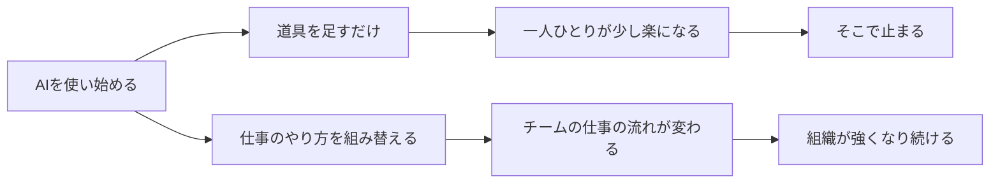

> 💡 **ひとことで言うと**
> AIを会社に入れることは、新しい家電を買うことより、台所を改装することに近い。高性能な道具を置くだけでは、料理は速くならない。段取りや人の動き方まで変えて、はじめて効く。

このページは、AIに詳しくない人のための入口である。専門用語を使わずに、このサイトの考え方と歩き方を案内する。読む時間の目安は15分。なお、サイト名にあるAIDXとは「AIを前提に、仕事のやり方を作り直す取り組み」のことである。詳しい定義は用語集「AIDX」にある。

## このサイトが言いたいことは3つ

**1つめ。道具をそろえることより、仕事のやり方を組み替えることが大事である。** AIを買って配るだけでは、一人ひとりが少し楽になって終わる。たとえば会議資料の下書きをAIに任せるなら、誰が中身を確かめ、誰が仕上げるかまで決め直す。そこまでやって、はじめてチームの成果が変わる。考え方の本体は原理編「AIDXの定義」にある(結論: AIの活用とは道具の導入ではなく、業務・データ・人の役割の組み替えである)。

**2つめ。「やる・やらない」の2択ではなく、選び方は5つある。** 本格的にお金をかける。安く作って、学んだら捨てる。小さく実験する。あえて待つ。やらないと決める。——この5つである。案件ごとにこの5つから選べば、無理な全面導入も、考えるのをやめた様子見も避けられる。選び方の手順は原理編「負債とスロップの分類学」にある(結論: 5つの選択肢へ振り分ける判定の手順を1枚で示す)。

**3つめ。人の仕事の重心は「作る」から「確かめる」に移る。** 下書きや集計は、AIのほうが速い。一方で、その中身が正しいか、お客様に出してよいかを決められるのは人だけである。だから「確かめて仕上げる力」を持つ人が、これからの組織の主役になる。詳しくは組織・人材編「実行者から検証者・設計者へ」(結論: 人の配置を、作る係から確かめる係・設計する係へ移す)。

## 道が分かれる場所を図で見る

次の図は、同じ「AIを使い始める」でも、進む道で行き先が変わることを示す。

このサイトの全ページは、下の道(仕事の組み替え)を進むための案内である。

## よくある3つの誤解

**「AIをみんなに配れば、生産性が上がる」。** 配るだけで速くなるのは、個人の作業までである。誰かがAIで速く作った下書きを、受け取った側が一から確かめ直す。その手間が増えれば、チーム全体では差し引きゼロにもなる。配ったあとに仕事の流れを組み替えたかどうかで、結果が分かれる。配って終わりの失敗の典型は、アンチパターン集「コパイロット一斉配布」で描いている。

**「禁止しておけば安全」。** 禁止しても、便利さを知った社員は自分のスマホでこっそり使う。会社の目が届かない場所で、お客様の情報が外のサービスに貼り付けられる。つまり禁止は、危険をなくすのではなく、見えなくする。必要なのは「ここまでは使ってよい」という線引きである。詳しくはアンチパターン集「禁止すれば安全」。

**「うちはまだ早い」。** 道具選びなら、待つのは悪くない。道具は次々によくなり、値段も下がるからである。しかし、社内の資料を整理しておくことや、AIの結果を確かめられる人を育てることは、あとからお金で買えない。時間のかかる準備ほど、先に始めた会社との差が開く。考え方は原理編「時間軸の考え方」にある(結論: 数年後に残る力から逆算して、いま着手するものを決める)。

## どこから読めばよいか(立場別の最初の3ページ)

この表の見方: 縦に3つの立場が並ぶ。自分に近い行を1つ選び、左から順に3ページ読む。

| 立場 | 1ページめ | 2ページめ | 3ページめ |
|---|---|---|---|
| 部門のマネージャー | 原理編「AIDXの定義」——なぜ道具だけでは変わらないか | 組織・人材編「業務分解×再配置プレイブック」——チームの仕事をどう切り分けるか | 自分の部門のページ(例: 部門別ガイド「営業のAIDX」。一覧は部門別ガイドの目次から選ぶ) |
| 推進を任された人 | ロードマップ編「最初の90日」——何から手をつけるか | AI-Ready編「AI-Ready自己診断」——自社の準備の度合いを25問で測る | 組織・人材編「推進体制とガバナンスの設計図」——禁止でも放任でもない決まりの作り方 |
| 役員 | 原理編「AIDXの定義」——投資判断の前提になる考え方 | ロードマップ編「経営計画への翻訳」——中期計画・予算・決議にどう書くか | 組織・人材編「取締役会の監督義務」——取締役会は何を見届けるか |

3ページ読んだあとは、各ページの末尾にある「関連ページ」をたどれば迷わない。

## このサイトでよく出てくる言葉5つ

ここだけ覚えれば、どのページも読み進められる。

- **5択** — AIへのお金のかけ方を「本格投資・使い捨て構築・実験・待つ・やらない」の5つから選ぶ考え方。
- **台帳** — 社内でAIを「どの部署が・何に・いくらで」使っているかを書き出した1枚の一覧表。
- **ガードレール** — 「ここまでは使ってよい、ここからは相談」という社内の線引きの決まり。
- **検証** — AIが作ったものを人が確かめて、責任を持って仕上げる仕事。
- **業務の分解** — 1つの仕事を細かい手順に分けて、AIに任せる部分と人が受け持つ部分に切り分けること。

## 今日からやること

まずは1つだけでよい。

- 【今すぐ】【部門長・推進担当・経営】上の表から自分の立場の行を選び、3ページを読む。道具: この表だけ。完了条件: 読んだ内容を、翌日に部下か同僚へ自分の言葉で3分で説明できる。

<!--
執筆メモ(2026-06-12 作成):
- 本サイト唯一の「専門用語ゼロ」入門ページ。sources: [] のため、本文には出典を要する事実・数値を一切書かず、構造記述と他ページへの案内のみで構成した(絶対ルールと整合)。
- 実行素材スロット=「立場別の最初の3ページ」表。
- 規模感スロットは省略: 案内ページであり投資・体制の承認判断を扱わないため(必須スロット2の適用外として本メモに明記)。
- 反証条件は省略: 主張ページではないため(執筆指示により省略可)。
- 比喩は「台所の改装」1つのみ(冒頭ボックスで使用。1ページ1比喩の枠をここで消費)。
- 「言いたいこと3つ」「誤解3つ」はいずれも既存正本(AIDXの定義/負債とスロップの分類学/実行者から検証者・設計者へ/時間軸の考え方/各アンチパターン)の平易な要約+参照であり、新フレームの定義はない(フレーム台帳への登録不要)。5択・業務の分解・ガードレール等の語の定義もすべて各正本の1行要約にとどめた。
- 用語5つの節は用語集の再定義ではなく、サイト内頻出語の日常語での言い換え(正式な定義は各正本・用語集を参照する建て付け)。
- ホームの「はじめての方はここから」カードが本ページへ既にリンク済み(src/pages/index.astro)。
-->
