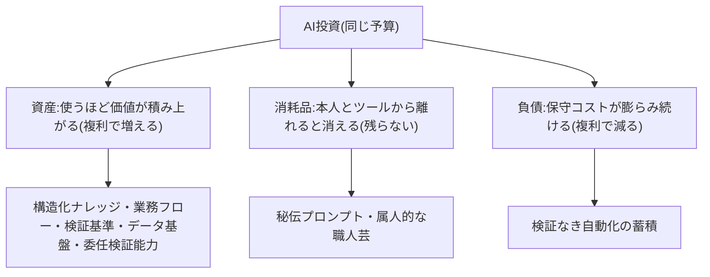
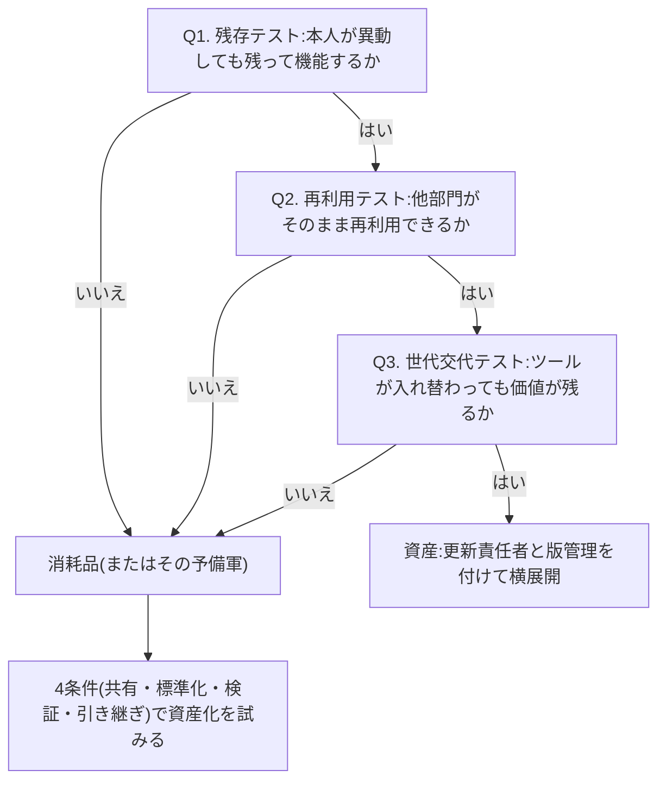

> 💡 **ひとことで言うと**
> AIにかけたお金は、貯金のように増えていくもの、使ったら消えるもの、借金のように後から膨らむものの3つに分かれる。同じ金額をかけても、どれに変わったかで数年後の会社はまるで違う。どれに変わるのかを見分ける3つの質問を、このページに用意した。

## AI投資の成果は資産・消耗品・負債の3つに分かれる

AI投資の成果は3つに分かれる。**複利で増える資産、その場限りの消耗品、複利で減る負債**である。資産とは、使うほど・時間が経つほど価値が積み上がるもの——構造化されたナレッジ(社内の知識)、分解された業務フロー、検証基準、データ基盤、人の委任・検証能力。消耗品とは、その場では役立つが本人と現在のツールから離れると消えるもの——個人の秘伝プロンプト(プロンプト=AIへの指示文)や属人的な職人芸。負債とは、動いているうちは便利だが保守コストが複利で膨らむもの——検証なき自動化の蓄積である。同じ予算を投じても、それがどれに変換されたかで数年後の組織はまるで違う。本ページは、この変換先を見分けるための1枚である。

3つの変換先と複利の向きを図にすると次のとおりである(同じ予算でも、時間が味方になるのは資産だけである)。

なお、本ページの3分類は新しい枠組みではなく、原理編「負債とスロップの分類学」の「4つの結末」(資産/負債/スロップ/何も残らない)を「複利で効くか」という観点から見直したものである。本ページの「消耗品」は同ページの「何も残らない」にほぼ対応する。スロップ(受け手に被害を転嫁する中身のない生成物)は本ページでは扱わないので、同ページを参照されたい。初めて読む場合、両ページの対応はここまで分かれば十分である。

## 資産は個人ではなく組織の構造に蓄積する

MIT CISR(米マサチューセッツ工科大学の研究センター)の4段階成熟度モデルによれば、最大の財務インパクトは「パイロットと能力の構築」(Stage 2=第2段階)から「AIの働き方の開発」(Stage 3=第3段階)への移行で得られ、上位段階(Stage 3-4)の企業は業界平均を上回る財務パフォーマンスを示す[src-2026-001]。個別のパイロット(小規模の試験導入)の成功ではなく、AIを前提とした働き方が組織に根づいた段階で初めて投資が財務に跳ね返る——これが複利の入口である。

BCGの2025年調査では、AIから大きな価値を引き出す先頭集団(future-built)は出遅れ企業に比べ、中央AIデータポリシー・中央AIプラットフォーム・全社データモデルといったデータ基盤の整備で大きく先行している(倍率はデータボックス参照)[src-2026-002]。また報道によればマッキンゼーの2025年調査では、高成果企業がワークフローの根本的再設計を行う割合はその他企業の3倍近くに達し、再設計の実施と価値創出が強く相関する[src-2026-004](具体的な数値は原理編「AIDXの定義」のデータボックス参照)。ただしこれらはいずれも横断面調査(ある一時点の各社を並べて比べた調査)の相関であり、資産整備が成果を生んだのか、余力のある企業ほど整備に投資できたのか(選択効果・逆因果)は調査単体では区別できない。

> 📊 **データボックス(2026-06時点)**
> - 企業のAI成熟度分布の推移(MIT CISR、2022年→2025年): Stage 1: 28%→13% / Stage 2: 34%→23% / Stage 3: 31%→46% / Stage 4: 7%→18%。最大の財務インパクトはStage 2→3の移行で得られる[src-2026-001]
> - future-built企業(AIから大きな価値を引き出す先頭集団)は出遅れ企業比で売上成長1.7倍・3年TSR(株主総利回り)3.6倍・ROIC(投下資本利益率)2.7倍・EBITマージン(利払い前・税引き前の利益率)1.6倍(BCG 2025年、n=1,250社)[src-2026-002]
> - future-built企業は出遅れ企業比で、中央AIデータポリシー・中央AIプラットフォーム・全社データモデルといったデータ基盤の整備が3倍(同調査)[src-2026-002]
> - AIの潜在価値の70%は営業・マーケ、製造、サプライチェーン、価格設定などコア業務機能に集中(同調査)[src-2026-002]

これらの調査が指す「スケールする資産」は、次の5つに整理できる(この5分類は調査を踏まえた本サイトの整理であり、分類自体に出典はない)。①構造化ナレッジ(AIが読める形に整理した規程・手順・判断事例)、②分解・文書化された業務フロー、③出力の合否を判定できる検証基準、④全社で参照可能なデータ基盤、⑤人の委任・検証能力(何をAIに任せ、出来上がりをどう確かめるかを判断できる力)。いずれも特定のモデルやツールに依存しないため、技術が世代交代しても次の道具にそのまま載せ替えられる。

※参照用の注記: この5つは、AI-Ready編「AI-Readyの5資産」の一部を「技術の世代交代後も価値が残るか」という観点で再整理したものである。対応関係は、本ページの①と④が5資産の「①データ・ナレッジ」、②が「②業務フロー」、③と⑤が「③人材の検証・委任能力」にあたる。5資産の「④ガバナンス」「⑤調達」は本ページでは扱わない。

## 消耗品は悪ではないが、組織には残らない

個人の「神プロンプト」、ベテランの属人的な使いこなし、特定ツールの画面に深く作り込んだ設定、操作方法を教えるだけの研修——これらは消耗品である。本人がいる間・そのツールがある間は生産性を上げるが、異動・退職・モデル交代とともに価値が消える。

日本の大企業の現状はこの構造を示している。活用レベルは情報収集・補助的利用が大半で、業務プロセスへの組み込みは2割未満にとどまり(原理編「AIDXの定義」のデータボックス参照)[src-2026-053]、実感されている効果の最上位も「業務時間・作業工数の削減」、すなわち個人の時短である[src-2026-053]。報道によればPwCの5カ国比較調査でも、生成AIを業務プロセスに正式に組み込んでいる企業の72%が期待以上の効果を創出している(非組み込み群との比較値は報道に記載がなく、組み込みと効果の相関を示す数値ではない)[src-2026-048]。少なくとも現状のデータが示すのは、個人利用の広がりが組織の成果に自動的には変換されていないという事実である。消耗品自体は悪ではない。立ち上がりが速く心理的なハードルも低いため、普及の入り口としては役に立つ。問題は、消耗品を資産だと思い込んで予算をつけ続けることである。

> 📊 **データボックス(2026-06時点)**
> - 大企業のAI活用者が実感する効果の最上位は「業務時間・作業工数の削減」約4割。課題の最多は「生成情報の正確性・信頼性への不安」約4割、「AI人材の不足」約3割(日鉄ソリューションズ 2025年、単体従業員1,000名以上かつ年間売上高500億円以上の大企業の正社員・役員3,757名対象。ITベンダー自社調査)[src-2026-053]

## 負債は時間とともに高くつく

3つ目の変換先である負債には1段落だけ触れる。機械学習システムの技術的負債を体系化した原典研究(機械学習分野の国際会議NeurIPSで2015年に発表)は、AIは「素早い勝利」をもたらす一方、実世界のシステムには巨大な継続保守コスト=隠れた技術的負債が伴い、それはシステムやデータの側に潜むため見つけにくく、リファクタリング(プログラムの内部整理・書き直し)だけでは返済できないと警告した[src-2026-040]。検証なき自動化やグルーコード(仕組み同士をつなぐ即席の継ぎはぎプログラム)の蓄積は、消耗品と違って「自然に消えてくれない」。コストが複利で増える側に積み上がる。負債・スロップの類型と、施策を投資判断の5択(本格投資/使い捨て構築/実験/待つ/やらない)に振り分ける判定フローチャートは、原理編「負債とスロップの分類学」で定義している。

## 個人の生産性を組織の能力に変える4条件

資産と消耗品を分けるのは個人の才能ではなく仕組みである。条件は次の4つに整理できる(この4条件に出典はなく、実務上の経験則である)。①**共有**——成果物が個人のローカル(手元の端末)ではなく組織の場所にある。②**標準化**——誰が使っても再現できる形式(目的・入力・出力・前提が書かれている)になっている。③**検証**——出力の合否基準と確認工程が付いている。④**引き継ぎ可能性**——作者が異動しても次の担当が保守・改良できる。この4条件を通せば、個人のプロンプトは標準手順書に、属人的な使いこなしは検証基準付きの業務フローに変わる。逆に、どれか1つでも欠ければ、どれほど優れた活用も属人で終わる。

## 施策の「複利テスト」3問(そのまま使える)

進行中・完了済みの施策の成果物が資産か消耗品かを、次の3問で判定する(このテストは本ページで定義する。着手前に施策を投資判断の5択へ振り分ける判定フローチャートは原理編「負債とスロップの分類学」で定義しており、あちらは着手前、こちらは成果物の事後判定と役割が異なる)。

1. **残存テスト**: この施策の成果物は、担当者本人が異動しても残って機能するか
2. **再利用テスト**: 他部門が(短い説明だけで)そのまま再利用できるか
3. **世代交代テスト**: 来年モデル・ツールが入れ替わっても価値が残るか

3問すべてYesなら資産、1つでもNoなら消耗品(またはその予備軍)と判定する。判定後の打ち手は次の3行である(この打ち手に出典はなく、実務上の経験則である)。

- **資産** → 更新責任者と版管理を付けて保守し、他部門への横展開を計画する
- **消耗品** → 4条件(共有・標準化・検証・引き継ぎ)を通して資産化を試みる。判断規準: 欠けている条件を1四半期で埋められない、または利用が個人に閉じたままなら、次期予算を停止する
- **負債(疑い)** → 原理編「負債とスロップの分類学」の判定フローチャートに回し、検証工程の追設か、撤退条件付きの廃棄かを決める

複利テスト3問の判定の流れを図にすると次のとおりである(3問すべてYesで資産、1つでもNoなら消耗品として資産化を試みる)。

| 成果物の例 | 残存 | 再利用 | 世代交代 | 判定 |
|---|---|---|---|---|
| 個人フォルダの秘伝プロンプト集 | No | No | No | 消耗品 |
| 条文単位に書き直した経費規程+判定基準 | Yes | Yes | Yes | 資産 |
| 特定ツール画面に作り込んだ自動化設定(設計書なし) | No | No | No | 消耗品(放置すれば負債化) |
| AI工程入りの業務フロー図+検証チェックリスト | Yes | Yes | Yes | 資産 |
| 操作研修の全社受講修了 | No | No | No | 消耗品 |

注記: 「操作研修=消耗品」は研修の全否定ではない。消耗品なのはツールの操作の習得に閉じた研修であり、何をAIに委任し出力をどう検証するかを訓練する研修は、スケールする資産⑤(人の委任・検証能力)への投資である(後述「今日からやること」の研修改訂を参照)。

## 今日からやること

- 【今すぐ】【推進担当】AI施策の成果物をすべて複利テストにかけ、資産/消耗品/負債(疑い)に3分類した台帳を作る。道具: 複利テスト3問+施策一覧。完了条件: 全施策に判定が付き、予算が3分類のどこへ流れているかの比率が1枚で経営に報告されている
- 【今すぐ】【部門長】部門内の優良プロンプト・AI活用手順を集め、4条件(共有・標準化・検証・引き継ぎ)を満たす標準様式(目的/入力/出力/検証基準/更新責任者の5項目)に書き直して登録する。道具: 組織共有の置き場+標準様式。完了条件: 属人運用だった手順が5件以上、作者以外でも再現できる状態で登録されている
- 【1年以内】【CHRO(人事担当役員)+推進担当】リテラシー研修(AIの基礎知識の研修)を「操作の習得」から「委任と検証」(何をAIに任せ、出力をどう確かめるか)の訓練へ改訂する。規模の目安(この目安に出典はなく、実務上の経験則である): 設計は推進担当1〜2名・3カ月、対象は管理職から先行、部門長〜役員の決裁レンジ。完了条件: 修了判定が「操作できる」ではなく「実業務1件をAIに委任し、その検証基準を自分で書ける」に変わっている
- 【待て】【経営】特定ツールへの深い作り込みを伴う全社投資。再開条件: 捨てても残る資産(データ・業務理解・検証基準)を成果物の外に分離する仕組みと、複利テスト台帳の運用が回り始めていること

**この主張が崩れる条件**: 共有・標準化・検証に投資せず個人の自由利用に任せた企業群が、資産整備を行った企業群と同等以上の組織レベルの財務成果を持続的に出したことを、複数の独立した追跡調査が示したとき。

(関連: 原理編「AIDXの定義」=導入と価値のギャップデータの詳細/原理編「負債とスロップの分類学」=負債類型と判定フローチャートの定義)

<!--
執筆メモ(2026-06-11 第2陣ルーブリック評価の改稿指示1〜6反映済み):
- 「資産/消耗品/負債」の3分類、「スケールする資産5つ」、「4条件」、「複利テスト3問」、判定後の打ち手3行はいずれも編集部の独自フレームで直接の出典はない(見立てマーカーを本文に明記)。ソースは成熟度・データ基盤・再設計の相関(001/002/004)による間接的裏付けのみ。
- タイトルを「複利の法則」に変更(AIのscaling laws=モデル規模則との誤読回避。改稿指示4)。ファイル名・id(scaling-laws)は不変。
- フレーム台帳対応: 冒頭で①3分類×分類学「4つの結末」(消耗品≒何も残らない、スロップは分類学参照)②「スケールする資産5つ」×five-assets 5資産(部分集合・別断面、①④=データ/②=業務/③⑤=人材)の対応を宣言した。
- [048]の72%は比較群のない片側比率のため「相関」とは記述せず、「非組み込み群との比較値は報道に記載なし」を本文に明示した(改稿指示1の指定表現に準拠。数値を本文に置くのはレビュー指示の明示指定による。同数値はaidx-is-redesignのデータボックスにも収載——表現分裂はaudit時に突合のこと)。
- 重複回避: 88%/5%/6%等のギャップ統計、再設計55% vs 20%、補助的利用約7割は正本(aidx-is-redesign)のデータボックスにあるため再掲せず、テキスト参照+構造記述(「3倍近く」「大半」)にとどめた。組み込み「2割未満」は原典(053 key_facts)通りの表現に修正。BCG「整備3倍」は本文から本ページのデータボックスへ隔離(five-assetsのデータボックスにも同統計あり)。
- src-2026-004(McKinsey報道)・src-2026-048(PwC報道)はreliability: mediumのため「報道によれば」帰属。原典での裏取りは引き続き望ましい。
- src-2026-001はStage 3の特徴詳細が詳細メモ由来のためkey_factsの範囲(段階名・移行効果・分布推移)のみ使用した。
- 複利テストと debt-slop-taxonomy の判定フローチャートの役割分担(成果物の事後判定 vs 着手前の5択振り分け)を本文に明記し、単一情報源ルールに対応した。
- 消耗品の予算停止規準(欠落条件を1四半期で埋められない)・研修改訂の規模感(1〜2名・3カ月・部門長〜役員決裁)は出典のない編集部の見立て。
2026-06-12 文体改修: 格言調見出し平易化・内部用語排除・見立て定型句を自然文に置換
2026-06-12 平易化改修(検品反映): ひとことボックス追加/冒頭の枠組み対応段落を「4つの結末との関係のみ」へ圧縮し、5資産との番号対応は「スケールする資産5つ」直下の※参照用注記へ移動(フレーム対応のページ内明記は維持)/プロンプト・ナレッジ・パイロット・ローカル・リテラシー・横断面調査・グルーコード・リファクタリング・CISR・Stage・NeurIPS・TSR/ROIC/EBITマージンの初出言い換え/CHRO初出言い換え。事実・数値・出典タグは不変。
-->
