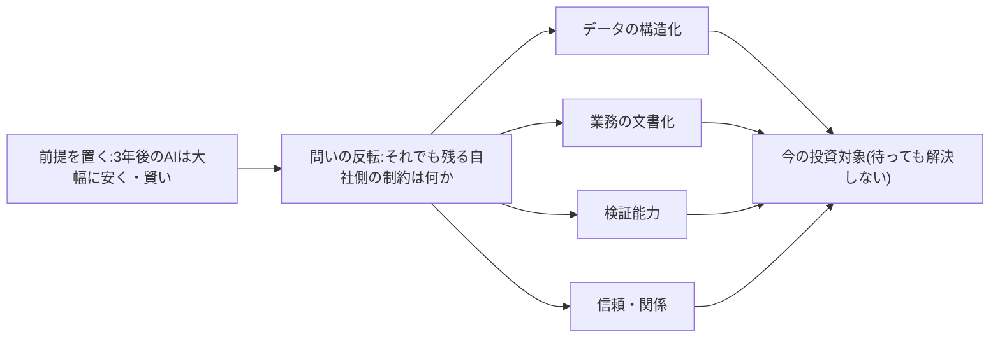
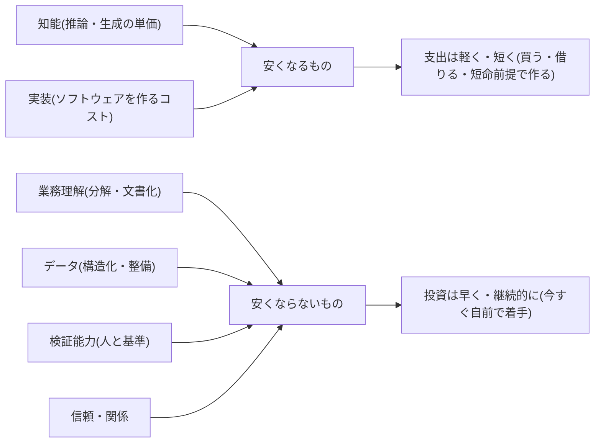

## 計画は「いまの能力」ではなく「改善カーブ」に対して立てる

AI投資の計画は、いまのAIに何ができるかではなく、能力とコストがどの速度で動いているかに対して立てるべきである。「現在のAIでは無理だ」という評価は、動く標的を静止画で撮った感想にすぎず、投資判断の根拠にならない。施策が業務に着地するのは数カ月から数年後であり、判断の対象はその時点の能力だからである。

この「静止画で判断する」誤りには2つの形がある。第一に、**今できないから永久にやらない**という見送り。これは、能力向上がいずれ解消する制約を恒久の壁と見誤っている。第二に、**今の能力の穴に合わせて重く作り込む**という過剰投資。こちらは、放っておいても能力向上が解消してくれる問題に、自社の費用で対処してしまっている。本ページは、この両方を避けるための逆算の方法を示す。

## 能力とコストは3つの方向に動いている

構造はこう要約できる。第一に、**同じ水準の知能の値段は桁違いの速度で下がり続けている** [src-2026-003]。第二に、**利用のかたちは協働と委任のあいだを揺れながら、基調としては自動化(委任)の比重が増す方向にある** [src-2026-023]。第三に、**どのモデルが優位かという勢力図は短期間で入れ替わる** [src-2026-007]。さらに、知能だけでなく**ソフトウェアを作ること自体のコストも急落し、「ソフトウェア創造はROIに制約されていたが、今や想像力にのみ制約される」と論じられる** [src-2026-009]。

この3つから導かれる計画上の含意は単純である。特定時点の能力評価も、特定ベンダーを前提にした作り込みも、計画の土台としては短命だということだ。寿命が長いのは「安く・賢くなり続ける」というカーブの形そのものである。

> 📊 **データボックス(2026-06時点)**
> - 推論コスト: 一定水準の性能を持つAIシステムの推論コストは2022年末から2024年末の2年で280分の1以下に低下。原典は2023年時点の特定モデル相当の性能水準で測定した等価比較であり、最先端モデルの利用価格の推移ではない(Stanford HAI AI Index 2025)[src-2026-003]
> - 利用の自動化シフト: 2025年11月時点で増強(協働)52%・自動化(委任)45%と直近は協働へ揺り戻したが、自動化シェアは約1年前より高水準で、基調としては自動化拡大が続くと分析(Anthropic Economic Index、2026年1月。AIベンダー自身による自社プラットフォーム利用データの分析であり、ユーザー層の偏りに留意)[src-2026-023]
> - 勢力図の入れ替わり: エンタープライズLLM市場の首位シェアは2023年の50%から2025年には27%へ半減し、首位企業が交代(Menlo Ventures、2025年11月、米国企業のAI購買意思決定者約500名調査。VCの自社調査でありポジションを持つ点に留意)[src-2026-007]
> - 実装コスト: かつて数週間かかった開発がLLMにより1時間以下に圧縮された(a16zパートナーのエッセイによる主張)[src-2026-009]
> - スキル萎縮への警告: 意図的な役割設計・コーチング・練習時間がなければスキル萎縮(skill atrophy)が起きるとシニアリーダーの43%が警告(Wharton Human-AI Research & GBK Collective、2025年10月、従業員1,000人超・売上5,000万ドル超の米国企業のシニアリーダー約800人調査)[src-2026-026]

## 「3年後、AIは大幅に安く・賢い」と置いて逆算する

計画の起点は、精密な予測ではなく前提の設定である。すなわち「**3年後、AIは今より大幅に安く・賢くなっている**」と置いてしまう。3年という長さに統計的な根拠はなく、中期経営計画の一般的な期間に合わせた便宜上の設定だが、起点を「今日の能力」から「数年後の前提」へずらすことが本質である。

この前提を置くと、問いが反転する。「AIに何ができるか」ではなく、「**AIがどれだけ賢くなっても、それでも残る自社側の制約は何か**」になる。残る制約は次の4つに集約できる(この4分類に出典はなく、実務上の整理である)。

1. **データの構造化** — モデルがいくら賢くなっても、構造化されていない自社データを勝手に読めるようにはならない
2. **業務の文書化** — 文書化されていない暗黙知の業務を、外部の知能が知ることはない
3. **検証能力** — 出力の正否を業務側で判定できる人と基準は、モデルの性能向上では代替されない
4. **信頼・関係** — 顧客・取引先・社内の納得と、誤りの責任を引き受ける関係は、技術の進歩と無関係に時間がかかる

なお、この「残る制約4つ」はAI-Ready編「AI-Readyの5資産」(資産の定義は同ページ)の一部を時間軸の切り口で見たものである——①②③は5資産のデータ・業務・人材に対応し、④信頼・関係は5資産に含まれない時間軸固有の補完概念である。

この4つは外から買えず、蓄積に時間がかかり、モデルが世代交代しても持ち越せる。だからこそ、改善カーブの上で唯一「待っても解決しないもの」として投資対象になる。逆に、いまの能力の穴をふさぐための作り込みは、カーブが自然に解消する制約に金を払う行為になりやすい。

逆算の流れを図にすると次のとおりである(前提を置く→問いを反転する→残る制約だけを今の投資対象にする)。



## 時間とともに安くなるもの・ならないもの

以下の分類自体に出典はなく、本サイトの整理である(各行の根拠ソースは表中に示す)。

| 区分 | 中身 | 時間の効果 | 投資の含意 |
|---|---|---|---|
| 安くなるもの | 知能(推論・生成の単価)[src-2026-003] | 待つほど安く・賢くなる | 重い作り込みを避ける。買う・借りる・短命前提で作る |
| 安くなるもの | 実装(ソフトウェアを作るコスト)[src-2026-009] | 待つほど安く・速くなる | 自社固有でないものを長期資産として抱え込まない |
| 安くならないもの | 業務理解(分解・文書化) | 待っても誰も文書化してくれない | 今すぐ自前で着手する |
| 安くならないもの | データ(構造化・整備) | 放置するほど整備コストが積み上がる | 今すぐ自前で着手する |
| 安くならないもの | 検証能力(正否を判定する人と基準) | 育成・基準づくりに時間がかかる | 今すぐ自前で育てる |
| 安くならないもの | 信頼・関係(顧客・社内の納得) | 一朝一夕に買えず、失えば戻らない | 検証なき出力を配らず、守りながら蓄積する |

上3行と下4行で予算の扱いを分けることが、時間軸の考え方の実務的な帰結である。安くなるものへの支出は軽く短くし、安くならないものへの投資は早く始めて継続する。

この予算の分け方を図にすると次のとおりである(時間の効果で投資の向きが反対になる)。



「安くならない」側には傍証もある。米国大企業のシニアリーダー調査では、意図的な役割設計・コーチング・練習時間を確保しないままAI利用を広げると、人のスキルはむしろ萎縮する(skill atrophy)と警告する声が一定の割合を占めた(比率はデータボックス参照)[src-2026-026]。検証能力は「待てば育つ」どころか、設計を欠いた待機の間に劣化しうる資産だということである。

## 「待つ」「使い捨て構築」との関係

「安くなるものを待つ」「短命前提で軽く作る」という本ページの帰結は、投資判断の5択の「待つ」「使い捨て構築」にそのまま接続する。施策1件をどの出口に振り分けるかの判定フローと使い捨て3条件は原理編「負債とスロップの分類学」で定義しており、「待つ」に再判定日を必須とする運用と調達経路の設計はロードマップ編「投資判断の5択」が扱う。本ページでは再定義しない。時間軸の観点から付け加わるのは1点のみ——「待つ」は怠慢ではなく、改善カーブ上では経済合理的な能動の選択になりうる、ということである。

なお、「3年」と「6カ月」という2つの期間は役割が違う。本ページの「3年」は投資対象を選ぶための逆算の前提(どの制約が3年後も残るか)であり、「投資判断の5択」の再判定(最長6カ月)は見送り判断の鮮度を保つための運用の周期である。3年前提を置いたからといって再判定を3年後に延ばしてよいわけではない。3年前提を基本/加速の2シナリオとして年次運用に落とす方法は、ロードマップ編「1年プランと3年シナリオ」が扱う。

## 3年逆算ワークシート(業務・施策1件ごとに記入してそのまま使える)

```
【3年逆算ワークシート】
Q1. 対象業務・施策: ______
Q2. 3年後、AIが今より大幅に安く・賢いとき、この業務は
    どうなっているのが理想か(1文で): ______
Q3. その理想を妨げる制約のうち、AIの能力向上が
    勝手に解消してくれるものはどれか: ______
Q4. AIが賢くなっても残る自社側の制約はどれか
    (データの構造化/業務の文書化/検証能力/信頼・関係): ______
Q5. Q4の制約の解消に今日から着手すると、
    誰の工数がどれだけ・いくらかかるか: ______
Q6. 「現在のAIでは無理」を理由に見送った判断があれば、
    その再判定日はいつか: ____年__月__日
Q7. 逆に「今の能力の穴」に合わせて作り込んでいる投資はどれか
    (高値掴み候補として棚卸し): ______
```

記入例(1行): Q1=契約書の一次レビュー / Q2=AIが一次レビューし人は例外判定に専念 / Q3=読解精度と処理単価 / Q4=過去契約のデータ化と自社判断基準の文書化、例外を裁ける検証者 / Q5=法務2名兼務×90日で基準の文書化 / Q6=2026年12月末 / Q7=現行モデルの誤読を前提にした二重入力の仕組み。

Q5の概算の仕方: 工数=人数×兼務率×期間(人月換算)、金額=人月×社内人件費単価で概算する。記入例のQ5なら2名×兼務3割×3カ月≒1.8人月、単価100万円/人月なら約180万円——施策1件あたり数十万〜数百万円の桁に収まるのが通常で、桁が億に乗るならQ4の切り出し方が大きすぎる。

## 今日からやること

- 【今すぐ】【推進担当】主要業務と進行中施策に3年逆算ワークシートを適用する。道具: 本ページのワークシート。完了条件: 主要業務10〜20件分のQ4(残る制約)の一覧が1枚で経営に報告されている
- 【今すぐ】【経営】「現在のAIでは無理」を理由に見送った案件を棚卸しし、全件に再判定日を付ける。道具: 過去の却下案件リスト+ワークシートQ6。完了条件: 全件に日付(最長6カ月後)が入り、日付のない見送りが残っていない
- 【1年以内】【部門長+推進担当】Q4で挙がった制約のうち1業務を選び、データ構造化・業務文書化・検証基準づくりに先行投資する。規模の目安(この目安に出典はなく、実務上の経験則である): 中堅(数百名)なら対象1業務・兼務2〜3名・期間90日・部門長決裁(数百万円規模)。大企業(数千〜数万名)なら対象2〜3業務を並行・推進担当の専任1〜2名+各部門の兼務5〜10名・期間90〜180日・本部長決裁(数千万円規模)。完了条件: 次のモデル世代でもそのまま使える成果物(構造化データ・手順書・検証基準)が残っている
- 【待て】【CFO(財務担当役員)】今の能力の穴をふさぐための重い作り込み投資。再開条件: 原理編「負債とスロップの分類学」の判定フローで本格投資と判定され、撤退条件と再判定日が文書化されること

**この主張が崩れる条件**: 推論コストの低下とモデルの世代交代が止まり、「今の能力に最適化した作り込み」の寿命が投資回収期間を安定して上回ることが複数の独立した調査で確認されたとき、改善カーブから逆算する本ページの方法は前提を失う。

(関連: 原理編「負債とスロップの分類学」=施策判定フローの定義、ロードマップ編「投資判断の5択」=「待つ」の運用と調達設計、原理編「AIDXの定義」=再設計の4要素)

<!--
執筆メモ(2026-06-11 セルフチェック結果):
- 「3年」という期間に出典はなく、中計の一般的期間に合わせた編集部の設定であることを本文に明記した(debt-slop-taxonomyのQ5「3年」の整理と整合)。
- 「残る制約4つ(データ構造化・業務文書化・検証能力・信頼)」と対比表の分類は全面的に編集部の見立て。出典は安くなる側(003/009)の間接的裏付けに加え、安くならない側はスキル萎縮43%[src-2026-026]を傍証として追加(2026-06-11レビュー指示3)。43%はデータボックスに隔離し、本文は構造記述のみ。
- src-2026-023はAIベンダー(Anthropic)自身の自社プラットフォームデータ分析のため、publisher名と利益相反・ユーザー層偏りをデータボックス内に開示した(2層ルールのpublisher例外)。本文では構造記述(「揺れながら基調は自動化拡大」)のみとし、52%/45%等の数値は隔離した。
- src-2026-007(Menlo Ventures)・src-2026-009(a16z)はreliability: mediumのため、データボックスで調査主体と「VCの自社調査」「エッセイによる主張」を明示。summary・結論はこれらの数値に依存させていない。
- 280分の1[003]と首位シェア交代[007]はaidx-is-redesign.mdのデータボックスと重複掲載になるが、統計は回転在庫でありフレーム再掲ではないため許容と判断。入れ替え時は両ページ同時更新が必要(監査対象)。
- 「待つ」「使い捨て構築」は定義・運用とも正本参照のみとし、再定義・3条件の再掲はしていない。
- 「動く標的を静止画で撮った感想」等の比喩はレトリックであり事実主張ではない。
- 本文約3,400字(frontmatter・コメント除く)。必須スロット4点(実行素材=ワークシート/規模感=1年以内アクション内/役割タグ+道具+完了条件/反証条件)を確認済み。

改稿メモ(2026-06-11 batch2レビュー指示1〜6を実施):
1. 「残る制約4つ」とfive-assetsの5資産の対応1行(部分集合・別断面、④信頼・関係は5資産外の補完概念)→フレーム台帳の記載と整合
2. ワークシートQ5の桁感・算出の足場(人月換算式+記入例の算定根拠)を追記
3. スキル萎縮43%[src-2026-026]を傍証として引用(本文=構造記述、数値=データボックス、sources追加)
4. 280分の1に等価条件を復元(「2023年時点の特定モデル相当の性能水準で測定」。2層ルールによりモデル名は本文・データボックスに書かない)。なおaidx-is-redesign.md側の同一統計は等価条件未記載のまま(同時更新は今回の指示範囲外。監査時の突合対象)
5. 「3年前提」(逆算の時計)とinvestment-decision「再判定最長6カ月」(運用の時計)の二重時計の使い分け1行を「待つ」接続節に追加
6. 規模感を中堅(数百名)/大企業(数千〜数万名)の2レンジ化(編集部の見立て)
2026-06-12 文体改修: 格言調見出し平易化・内部用語排除・見立て定型句を自然文に置換
-->
