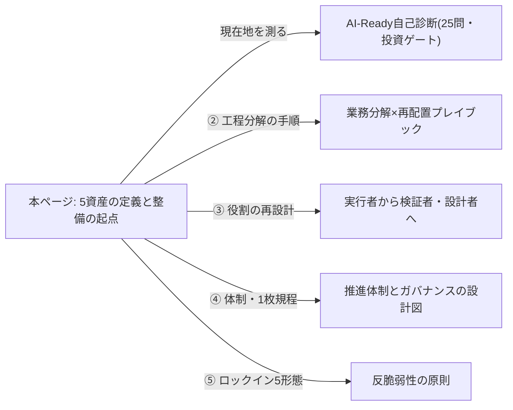
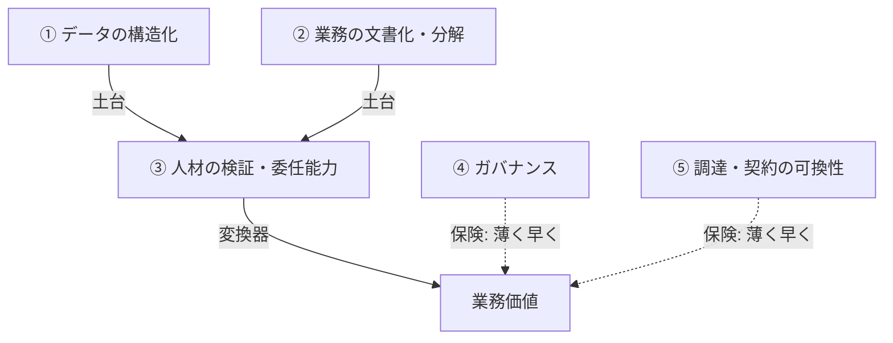

## AI-Readyは5つの資産の蓄積で決まる

AI-Readyかどうかは「何を導入したか」では測れない。モデルとツールは陳腐化するが、AIの進歩をそのまま業務価値に変換できる組織側の受け皿——構造化されたデータ、分解された業務、検証できる人、統制の仕組み、乗り換えられる契約——は複利で効く。本ページではこの5資産について、定義と「なぜ・どう整備するか」を説明する。自社が今どこにいるかを測る25問の診断と、診断結果を投資判断につなぐ手順は、姉妹ページ「AI-Ready自己診断」が担うため、本ページでは扱わない。

なお、5資産という枠組み自体と、各節の「整っている企業の状態」「最初の90日」は、後掲の調査群を踏まえて編集部が独自に組み立てた整理であり、特定の調査の公式区分ではない。

本ページと、診断・各資産の深掘りを担う姉妹ページの分担は次の通りである。

## 資産① データ・ナレッジの構造化

**定義**: 業務判断に使う情報が共有された場所にあり、最新版が判別でき、データの定義が部門間で揃い、AIに渡してよい・ならないの機密区分が運用されている状態。

**なぜ資産か**: AIの精度を決めるのはモデルではなく食わせるデータである。デロイトのグローバル調査は、レガシーなデータ・インフラはリアルタイムで動く自律型AIを支えられず、近代化が前提になると指摘する [src-2026-005]。CIO誌へのベンダー寄稿(AIベンダーのCMOによる)も、高度なモデルの追求よりデータ基盤の確立が先決とし、基盤を欠くAIプロジェクトの大量放棄を予測するガートナーの見解を伝える [src-2026-011]。BCGの調査でも、AI価値を出す少数派は全社データモデル等の整備で出遅れ企業を大きく引き離す [src-2026-002]。

**整っている企業の状態**: 新任者が「どの文書が正しい最新版か」を訊かずに仕事を始められる。人が迷わずたどり着ける文書の状態は、そのままAIに渡せる状態でもある。

**最初の90日**: 【推進担当】が1部門を選んで散在文書を棚卸しし、最重要文書に責任者・更新日・機密区分を付ける。完了条件: 文書台帳1冊が実在し、部門長が承認している。データ整備を飛ばして着手した場合の典型的な失敗は、アンチパターン集「データなき自動化」を参照。整備実務の部門例として、文書台帳の具体様式は部門別ガイド「総務のAIDX」、入力ルールの営業版(商談記録の最小入力様式)は部門別ガイド「営業のAIDX」、整備した文書を業務側で生かす型は業務パターン「社内ナレッジ検索と回答生成」にある。

## 資産② 業務フローの文書化・分解可能性

**定義**: 主要業務が担当者以外でも実行できる粒度で文書化され、工程ごとに判断/定型の別と入力・出力・合格基準が定義されている状態。つまり「AIに渡せる単位」に業務を切れる状態。

**なぜ資産か**: 同じツールでも成果は活用の深さで分かれる。デロイトの調査は、業務プロセスをほぼ変えない表層利用の層と、主要プロセスを再設計する層、事業モデルまで変える層に企業が分化し、後者ほど成果に近いことを示す [src-2026-005]。IPAの日米独比較では、個人利用は3か国とも高い一方「部署の業務プロセスに組み込まれている」は日本の回答率が低い [src-2026-046]。組み込みの前提は、業務が文書化され分解可能であることだ。

**整っている企業の状態**: 引き継ぎが口伝でなく文書で完了する。工程表を見れば「どこをAIに任せ、どこで人が検収するか」を線引きできる。

**最初の90日**: 【部門長】が月次で必ず発生する業務1つを選び、担当者が工程分解+入力・出力・合格基準を書く。完了条件: その手順書だけで第三者が業務を再現できる。

工程分解の具体的な手順(4分類とワークシート)は、組織・人材編「業務分解×再配置プレイブック」で説明している。

## 資産③ 人材の検証・委任能力

**定義**: AIの出力の正誤を判断できる人を利用場面ごとに特定でき、「任せてよい仕事」と「人が握る仕事」の線引きを組織として決められる状態。

**なぜ資産か**: デロイトの調査では従業員のスキル不足がAI統合の最大障壁とされ、リテラシー教育やアップスキリング戦略の整備はまだ半数前後にとどまる [src-2026-005]。IPAの調査では「誤った回答を信じて業務に利用してしまう」課題が日本で突出して高い [src-2026-046]。検証できる人がいなければ、AIの性能が上がるほど、誤りが業務に流れ込む速度も上がる。

**整っている企業の状態**: 各業務にレビュー担当が名指しで紐づき、「確認なしで社外提出禁止」級のルールが暗黙でなく明文で回っている。

**最初の90日**: 【CHRO】【部門長】が主要業務ごとに「検証できる人」を一覧化し、検証必須の場面を定めて通知する。完了条件: 一覧と通知文書が存在し、全員に既読確認が取れている。

役割の再設計(検証者・設計者への移行)は組織・人材編「実行者から検証者・設計者へ」、検証能力の供給源である育成は同「新人が育たない問題」を参照。

## 資産④ ガバナンス

**定義**: 誰が何にAIを使っているか把握でき、利用ルールが明文化・更新され、問題発生時の報告ルートと「止める」権限が機能している状態。

**なぜ資産か**: BCGの調査では、管理されていないAIセキュリティリスクを既に報告する企業が多数派に達する [src-2026-002] 一方、デロイトの調査では自律型AIエージェントのガバナンスが成熟した企業はなお少数にとどまる [src-2026-005](具体値はデータボックス参照)。リスクの報告はすでに広がっている一方で、統制の整備は追いついていない。この非対称があるからこそ、④は整備すれば差がつく資産になる。設計の参照枠には、米国NISTの生成AIプロファイルがある。Govern/Map/Measure/Manageの4機能で利用範囲の定義・人間によるレビュー・インシデント対応等の推奨アクションを体系化しており、社内規程の条項チェックリストに使える(任意採用で法的拘束力はない)[src-2026-022]。

**整っている企業の状態**: AI利用台帳が存在し、新しい用途が増えるたびに台帳が先に更新される。事故の一報が現場から24時間以内に上がる。

**最初の90日**: 【推進担当】【法務】がNISTの4機能を目次代わりに1枚のAI利用規程(目的・禁止・相談先)を発行し、既存の情報セキュリティ報告ルートにAIを追加する。完了条件: 規程の発行と、報告ルートの試行訓練1回。この「1枚規程」は組織・人材編「推進体制とガバナンスの設計図」の暫定ガードレール(最初の1枚)と同一物であり、本ページ用に別の規程を新造しない。体制設計の全体も同ページを参照。

## 資産⑤ 調達・契約の可換性

**定義**: 特定ベンダー・特定モデルが使えなくなっても乗り換えられ、外部委託してもデータ・プロンプト・業務知識の権利が自社に残る契約・アーキテクチャになっている状態。

**なぜ資産か**: モデルの優劣は短期間で入れ替わるため、選び直せること自体が資産になる。米IT専門メディアTechTargetの技術解説は、ロックイン回避の実践として、依存関係の定期監査、データポータビリティ条項など出口戦略の事前交渉、抽象化レイヤーによる特定プロバイダー依存の遮断などを挙げる [src-2026-012]。日本固有の文脈では、IPAの調査が示す通りコア事業のシステムすら外部委託が最多で内製化が進んでいない [src-2026-046]。この構造を踏まえると、日本企業が先に点検すべきはモデルそのものへのロックインよりも、構築ベンダー経由の間接的なロックインだと考えられる(出典のある指摘ではなく、上記調査からの読み替えである)。

**整っている企業の状態**: 最も依存度の高いAI利用について「来月使えなくなったら」のシナリオが文書である。委託契約に成果物・中間生成物の権利帰属が明記されている。

**最初の90日**: 【CFO】【法務】がAI関連の契約とシステム依存関係を棚卸しし、権利帰属・出口条項の欠落を一覧化する。完了条件: 依存一覧と、次回更新で改訂すべき契約の優先順位リスト。

ロックインの5形態(技術/契約/データ/スキル/組織)と乗り換え可能性の作り方は、原理編「反脆弱性の原則」で説明している。

> 📊 **データボックス(2026-06時点)**
> - 【予測値(実績データではない)】ガートナーは「AI-readyなデータ基盤を欠く組織は、2026年を通じてAIプロジェクトの60%を放棄する」と予測(CIO誌へのベンダー寄稿経由)。同寄稿はSecodaの調査(こちらは実績値)として企業データの68%が未活用とも紹介 [src-2026-011]
> - AIで大きな価値を実現している企業は5%にとどまり、60%は実質的な価値を出せていない。価値を出す企業は中央AIデータポリシー・全社データモデルの整備が出遅れ企業の3倍(BCG、2025年調査、n=1,250社)[src-2026-002]
> - 活用の深さ: 37%は業務プロセスをほぼ変えない表層利用、30%は主要プロセスの再設計、34%は事業モデルの変革(デロイト、2025年8〜9月調査、24か国3,235名)[src-2026-005]
> - 72%の企業が管理されていないAIセキュリティリスクを既に報告 [src-2026-002]。自律型エージェントのガバナンスが成熟している企業は約5社に1社 [src-2026-005]
> - 「必要な部分は内製化済み」の日本企業は16.7%で米独の半分以下(IPA DX動向2025、2025年2〜3月調査)[src-2026-046]

## 5資産を整備する順番

5資産は並列ではなく、**①②が土台、③が変換器、④⑤が保険**という積み上げの関係にある。この整理に出典はなく、前掲の調査群を踏まえた実務上の経験則である。次の図は、土台(①②)を変換器(③)が業務価値に変え、保険(④⑤)が薄く早く掛かるという積み上げ構造を示す。

- **①②が先**: データと業務分解がなければ、人材教育は実務に接続しないまま終わり、ガバナンスは管理対象を持たない。基盤を欠くプロジェクトの放棄予測 [src-2026-011] が示す通り、ここを飛ばした投資は戻りにくい。
- **③は①②と並走**: 検証能力は座学でなく、文書化された自部門の業務で出力を検証する実地で育つ。①②の90日施策に検証担当を最初から組み込む。③は①②の入力を価値に変える変換器である。
- **④⑤は薄く早く**: 完璧を待つ必要はないが、ゼロのまま規模を拡大してはならない。1枚規程と依存棚卸しという最低限の保険を90日以内に掛け、利用拡大に比例して厚くする。

順番を誤る典型は「④だけ厚い(規程はあるが利用台帳がない)」と「⑤を忘れて②を外部委託する(業務知識ごとベンダーに渡す)」の2つである。前者では、規程を整えたことに安心して、実際にどの部署が何にAIを使っているかを誰も一覧できない状態が続く。後者では、業務の手順を委託先だけが知っている状態になり、契約が終わると手順ごと社外に失われる。

なお、原理編「時間軸の考え方」が挙げる残る制約のうち「信頼・関係」を本ページの5資産に含めないのは、信頼が施策で直接整備できる資産ではなく、5資産を誠実に運用した結果として蓄積される補完概念だからである(この整理も出典のある区分ではなく、編集部の解釈である)。

## 資産台帳テンプレート(そのまま使える)

四半期ごとに経営会議へ出す1枚である。「根拠資料」の欄を埋められない行は、整備済みとは言えない。記載例は編集部が作成した架空の例である。

| 資産 | 現状(整備済/部分/未) | 根拠資料 | 責任者 | 次の一手(90日) |
|------|----------------------|----------|--------|------------------|
| ①データ | 部分 | 営業部門の文書台帳v1 | 営業企画部長 | 機密3区分の付与完了 |
| ②業務フロー | 未 | — | 製造部長 | 月次帳票業務の工程分解 |
| ③人材 | 部分 | 検証担当一覧(営業のみ) | CHRO | 対象を2部門へ拡大 |
| ④ガバナンス | 部分 | AI利用規程v1 | 法務部長 | 利用台帳の初版作成 |
| ⑤調達 | 未 | — | CFO | AI関連契約の権利帰属棚卸し |

## 体制と費用の目安

以下の目安に出典はなく、実務上の経験則である。

- **中堅(数百名規模)**: 第1巡(5資産すべてを「未」から「部分」へ)は、1事業部門を対象に2四半期・専任の推進担当1名+各資産の兼務オーナー5名で回せる。外部支出は教育・法務照会など部門長決裁レンジ(数百万円規模)にとどめる。
- **大企業(数千〜数万名規模)**: 1部門ずつの直列展開では年単位で遅れる。先行3〜5部門を並走させ、所要は部門数にほぼ比例する。専任の推進チーム2〜5名+部門ごとの兼務オーナー、外部支出は年数千万円規模(役員決裁レンジ)が目安。

いずれの規模でも、全社基盤への投資はこの台帳が「部分」以上で埋まってから役員決裁で諮る。

## 今日からやること

- 【経営】資産台帳の5行に責任者の名前を入れる。使う道具: 上のテンプレート。完了条件: 経営会議の議事録に5名の氏名が残る。(今すぐ)
- 【推進担当】各資産の「最初の90日」から自部門で完結する2つを選び着手する。使う道具: 各節の90日施策。完了条件: 文書台帳・手順書・1枚規程のいずれか2点が実物として存在する。(今すぐ)
- 【CFO】【法務】AI関連契約の棚卸しを指示する。使う道具: 資産⑤の90日施策。完了条件: 依存一覧と契約改訂の優先順位リスト。(1年以内)
- 【経営】全社一斉のAI基盤投資・プロセス再設計は、台帳の①④が「部分」以上になるまで待つ。稟議を「待て」と判定する基準そのもの(25問のYes数で凍結/解禁を決める投資ゲート)は姉妹ページ「AI-Ready自己診断」で定義しており、本ページの「①④が部分以上」は資産の面から見た補助条件である。(能力向上を待て)

**この主張が崩れる条件**: 5資産が未整備のまま(特に①②を欠いたまま)AIから持続的に業務価値を上げる企業が相当数観測されるなら、「組織資産の蓄積がAI-Readyを決める」という本ページの前提は成立しない。

(関連: AI-Ready編「AI-Ready自己診断 — 5資産×25問チェックリスト」、ロードマップ編「投資判断の5択」)

<!--
執筆メモ(レビュー重点ポイント):
1. 単一情報源の設計: 本ページを5資産の定義・整備方法の正本とし、self-assessment側の25問・採点閾値・投資ゲート・経営報告様式は一切再掲していない。2026-06-11レビュー(batch2)指示2に基づき、self-assessment側の「なぜこの5資産か」節は本ページへの参照+要点要約に置換・圧縮済み(正本宣言は双方向)。Gartner予測[011]とIPA内製化[046]は引き続き両ページで使用するが、根拠の詳述は本ページのみ。
2. 各節の「整っている企業の状態」「最初の90日」「依存関係(①②土台/③変換器/④⑤保険)」「資産台帳テンプレ」「規模感」はすべて編集部の設計で出典なし(本文に見立て明記済み)。特に規模感(2四半期・専任1名+兼務5名・数百万円)はself-assessmentの「1部門・四半期・数百万円」と整合させた目安であり、妥当性のレビューを要する。
3. Gartner 60%予測[011]はreliability: mediumのベンダー寄稿経由(原典プレスは未確認)。本文では数値を出さず構造記述+データボックス隔離とし、寄稿経由であることを両方で明示した。資産⑤の根拠は012(medium・技術解説、定量データなし)と046のみで5資産中最も薄い——self-assessmentの執筆メモと同じ弱点が残る。
2026-06-12 文体改修: 格言調見出し平易化・内部用語排除・見立て定型句を自然文に置換
-->
