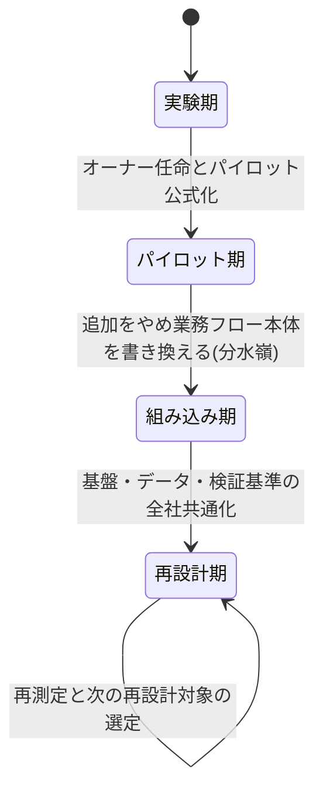
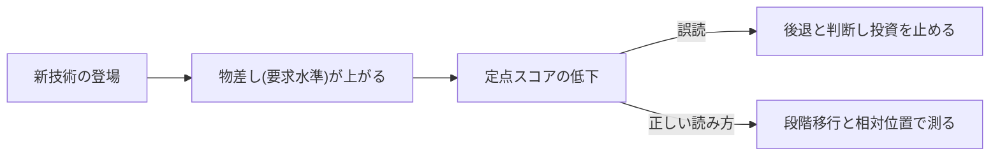

## 成熟度は導入数ではなく段階で測る

AIの成熟度は、導入したツールの数でもパイロットの本数でも測れない。測るべきは「変革がどの段階まで進んだか」であり、分水嶺は、パイロットを増やす段階から、AIが標準業務フローに組み込まれた「AIの働き方」へ移行できたかどうかにある。MIT CISRの追跡調査は、最大の財務インパクトがパイロット段階(Stage 2)から「AIの働き方」段階(Stage 3)への移行で得られると結論している [src-2026-001]。財務インパクトを生むのはツールを増やすことではなく、段階の移行である。

なお本ページの軸は**段階の診断**(変革がどこまで進んだか)である。**資産の診断**(いま何を持っているか)はAI-Ready編「AI-Ready自己診断」(5資産×25問)が担うため、本ページでは扱わない。資産診断が「移行に必要な持ち物」を、本ページが「いまどの段階にいて、次にどこへ渡るか」を測る補完関係にある。

## 統合4段階モデル

以下の4段階は、MIT CISRの4段階モデル [src-2026-001]、BCGの成熟度4類型 [src-2026-002]、Oxford EconomicsとServiceNow(ITベンダー)の共同調査が用いる5次元の成熟度測定 [src-2026-006] を編集部が統合した独自の区分であり、特定調査の公式区分ではない。いずれの調査も、技術導入度ではなく組織の働き方で成熟度を測る点で共通する。

| 段階 | 特徴 | 典型的な罠 | 次へ進む条件 |
|------|------|-----------|--------------|
| **1. 実験期** | 個人・有志がAIを試す。経営は様子見 | 利用率の高さを成果と誤認し、方針なき放任が続く | 経営がオーナーと目的を定め、領域を絞ってパイロットを公式化する |
| **2. パイロット期** | 経営承認のパイロットが部門単位で複数走る | 本数を増やすこと自体が目的化し、どれも業務本体を変えない | パイロットの「追加」をやめ、勝ち筋業務で業務フロー本体の書き換えに踏み込む |
| **3. 組み込み期** | AIが標準業務フローに組み込まれ、止まると業務が止まる。再配置が始まる | 成功が特定部門に閉じ、基盤・データ・検証ルールがばらばらのまま広がる | 基盤・データ・検証基準を全社共通化し、横展開を仕組み化する |
| **4. 再設計期** | AI前提で事業・組織を設計し直し、AIが収益創出に直結する | 「完成した」と誤認して再測定・再投資を止める | 再測定と次の再設計対象の選定を定例化し、ループを回し続ける |

4段階の遷移と各段階を抜ける条件を図にすると次の通りである(分水嶺は段階2→3、段階4はループで完成しない)。

「統合」の中身を検証できるよう、出典モデルとの対応を示す(対応付けは編集部による整理であり、MIT CISRは段階モデル、BCGは成熟度の類型なので、両者の一対一対応は各原典には存在しない)。

| 統合4段階 | MIT CISR 4段階 [src-2026-001] | BCG 4類型 [src-2026-002] |
|------|------|------|
| 1. 実験期 | Stage 1: Experiment and Prepare | stagnating |
| 2. パイロット期 | Stage 2: Build Pilots and Capabilities | emerging |
| 3. 組み込み期 | Stage 3: Develop AI Ways of Working | scaling |
| 4. 再設計期 | Stage 4: Become AI Future Ready | future-built |

## 分水嶺は段階2→3にある

MIT CISRの調査では、Stage 3〜4の企業は業界平均を上回る財務パフォーマンスを示し、Stage 1〜2の企業は下回る [src-2026-001]。境界線はちょうど「パイロット止まり」と「業務に組み込まれたAIの働き方」の間に引かれている。ただしこれは横断面調査の相関であり、移行したから儲かったのか、余力のある企業ほど移行できたのか(選択効果・逆因果)は区別できない。因果と断定はできないものの、パイロットを何本足しても業務本体が変わらなければ財務数値は動かない、という機序の説明としては整合的である。

しかも世界の分布は下位段階から組み込み期側へ移行し続ける構造にあり [src-2026-001]、「パイロットまでは来た」こと自体の相対的価値は下がり続ける(各時点の分布はデータボックス参照)。

> 📊 **データボックス(2026-06時点)**
> - MIT CISR 4段階の企業分布(2022年→2025年): Stage 1: 28%→13% / Stage 2: 34%→23% / Stage 3: 31%→46% / Stage 4: 7%→18%。Stage 3〜4の合計は38%→64%(**⚠ 編集部による単純合算であり、原典に合算値の記載があるかは未確認**。役員会資料等へ引用する場合は合算値ではなく原典記載の各Stage値を用いること)[src-2026-001]
> - 最大の財務インパクトはStage 2→3の移行で得られる。Stage 3〜4は業界平均超、Stage 1〜2は業界平均未満の財務パフォーマンス(横断面の相関)[src-2026-001]
> - BCG 4類型の分布(2024年→2025年): stagnating 25%→14% / emerging 49%→46% / scaling 22%→35% / future-built 4%→5%。価値をスケールで実現しているのは5%、60%は実質的価値なし(BCG 2025年、n=1,250社)[src-2026-002]

## スコアが下がっても後退とは限らない

成熟度を定点スコアで測ると、努力しているのに点が下がる現象が起きる。前掲の共同調査では、AI投資が増えているにもかかわらず平均成熟度スコアが前年から低下した。背景にはスキルギャップの拡大やデータプライバシー懸念に加え、エージェント型AIなど新技術の登場で要求水準そのものが上がったことが挙げられている [src-2026-006]。

つまり物差し(要求水準)自体が毎年引き上がるため、スコアの絶対値の低下は後退を意味しない。したがって成熟度は、①4段階のどこにいるか(段階移行)と②同業他社との相対位置で測るのが実務的な使い方だと考える。半年ごとの再測定を推奨するのもこのためである。

要求水準が年々上がることで定点スコアが下がって見える構造と、その正しい読み方を図にすると次の通りである。

> 📊 **データボックス(2026-06時点)**
> - 平均AI成熟度スコア: 2024年44→2025年35へ9ポイント低下(100点満点)。上位層「Pacesetters」の平均は44で全体を9ポイント上回る(Oxford Economics / ServiceNow共同調査、世界約4,500名の経営幹部、2025年版)[src-2026-006]

## 日本企業の現在地

構造として読めるのは、導入は進んだが段階移行が止まっている、という形である。ツールのアカウントは配られても、業務の手順書が導入前と変わっていないなら、それは段階移行が止まっている状態である。大企業に限れば導入はほぼ飽和した一方、全社員への利用浸透は一部にとどまり、「部署の業務プロセスに組み込まれている」とする回答は国際比較で低い。段階の分布を直接測った日本の調査はないが、これらの構造から推すと、日本の大企業の多くは**パイロット期**に滞留し、先頭集団が配置転換を伴う組み込み期の入口に立った段階だと読める。世界の分布が組み込み期側へ移行し続けるのと対照的に、差は導入率ではなく段階移行の速度で開いている。

> 📊 **データボックス(2026-06時点)**
> - 生成AIを「全社的に導入」47.0%(前年26.4%)、部分導入を含む導入済み95.6%。一方「ほぼ全社員が利用」は18.5%。配置転換を行っている企業は約4割(デロイト トーマツ、2025年7月調査、プライム上場・売上1,000億円以上の部長クラス以上700名)[src-2026-050]
> - 生成AIの「個人で業務利用」は日米独3か国とも高いが、「部署の業務プロセスに組み込まれている」は日本の回答率が低い。DXの成果創出は米独8割以上に対し日本6割弱(IPA DX動向2025、2025年2〜3月調査)[src-2026-046]

## 自社の段階を判定する速見表(そのまま使える)

各段階3問のYes/Noで判定する。この判定表は編集部が独自に設計したもので、出典のある基準ではない。段階1から順に確認し、3問すべてYesなら次の段階へ進んで確認する。すべてYesにできた最後の段階が自社の現在地である。迷ったらNo。例外処理: 上位段階の問にYesがあっても、下位段階に残ったNoがあればその解消が「次の90日」の最優先課題である(段階を飛ばさない)。なお問3-1の「組み込み」かどうかは、原理編「AIDXの定義」の判定3テスト(業務フロー記載・停止影響・検証責任)で判定する。

| 段階 | 判定3問(すべてYesでこの段階に到達) |
|------|--------------------------------------|
| **1. 実験期** | 1-1 社員の誰かが業務でAIを使っている / 1-2 最低限の利用ルール(禁止事項と相談先)が周知されている / 1-3 直近四半期に経営会議でAI活用が議題になった |
| **2. パイロット期** | 2-1 経営承認・予算付きのパイロットが1件以上ある / 2-2 各パイロットに成功基準・期限・終了条件が文書である / 2-3 パイロットの結果が経営会議に報告されている |
| **3. 組み込み期** | 3-1 「組み込み」と判定できる業務(判定基準: 原理編の判定3テスト)が複数部門にある / 3-2 複数部門が共通の基盤・データ・検証ルールでAIを使っている / 3-3 AIで浮いた時間・人員の再配置や役割変更が実際に始まっている |
| **4. 再設計期** | 4-1 AI前提で業務フロー自体を作り直した事例が全社の主要プロセスに及ぶ / 4-2 AIが新サービス・収益創出に直結している / 4-3 成熟度の再測定と次の再設計対象の選定が定例化している |

## 段階別「次の90日」の進め方(そのまま使える)

移行の最初の90日で何をやるか。体制・予算・決裁レンジの目安に出典はなく、実務上の経験則である。中堅(数百名規模)と大企業(数千〜数万名規模)の2レンジで示す。自社の決裁規程に合わせて読み替えること。初動の統合断面(各ページの「今すぐ」アクションをどの順で始めるか)はロードマップ編「最初の90日」を、90日単位の手を1年の四半期計画につなぐ展開はロードマップ編「1年プランと3年シナリオ」を参照——本表は段階移行の断面である。

| 現在地 | 次の90日でやること | 体制と費用の目安: 中堅(数百名) | 体制と費用の目安: 大企業(数千〜数万名) |
|--------|--------------------|------------------------------|------------------------------|
| 実験期 | 推進オーナーを任命し、領域を1つ選んで成功基準・期限・終了条件付きのパイロットを立ち上げる | 兼務2〜3名・数十万〜数百万円・部門長決裁 | 兼務3〜5名・部門予算内(数百万円規模)・部門長〜担当役員決裁 |
| パイロット期 | パイロットを棚卸しし終了判定で絞る。残した1件で業務フロー本体の書き換え(手順書改訂・役割変更まで)に着手 | 専任1名+兼務2〜3名・90日・部門長決裁 | 専任2〜3名+兼務5名規模・90日・担当役員決裁。新規パイロットの追加は原則凍結 |
| 組み込み期 | 成功部門の基盤・データ・検証基準を共通化し、隣接2部門へ横展開。再配置計画を人事と接続 | 担当役員スポンサー+横断チーム兼務数名・全社予算枠は年数千万円規模・経営会議決裁 | 役員スポンサー+専任横断チーム・全社予算枠は年数億〜十数億円規模・経営会議決裁 |
| 再設計期 | 半年ごとの成熟度再測定を定例化し、次に作り直す主要プロセスを1つ選定 | 経営会議の定例アジェンダ化(規模によらず)。大型投資は再測定結果とセットで判断 | 同左。事業会社・部門単位の再設計ポートフォリオとして管理 |

## 今日からやること

- **今すぐ**【経営】速見表で自社の段階を経営会議で判定する。道具: 本ページの速見表。完了条件: 判定された段階と「次の90日」の着手項目が議事録に残る
- **今すぐ**【推進担当】社内のパイロットを棚卸しする。道具: パイロット台帳(件名・部門・成功基準・期限・終了条件の5列)。完了条件: 全件が1枚の台帳になり、終了条件のない案件が特定されている
- **1年以内**【CFO】AI支出を「パイロット予算」と「組み込み予算(フロー書き換え・基盤・教育)」に区分して把握する。道具: 費目別のAI支出集計。完了条件: 区分比率が算出され、パイロット偏重なら是正方針が経営会議に上がる
- **1年以内**【部門長】【推進担当】最有望のパイロット1件を選び、「次の90日」表のパイロット期の行を実行する。完了条件: 対象業務の手順書にAI工程が明記され、停止影響と検証責任が定義されている
- **能力向上を待て**【経営】実験期・パイロット期での全社共通基盤への大型投資。組み込みの実績がないまま基盤に投資しても載せるものがない。組み込み期の判定3問のうち2問以上がYesになるまで待つことを推奨する。なお投資可否そのものの判定は、AI-Ready編「AI-Ready自己診断」の投資ゲート(25問の合計点で凍結/実験まで/解禁を判定)で行う。本ページの「2問以上Yes」は段階の面から見た補助条件である

**この主張が崩れる条件**: パイロットの多数並走のまま(業務フローへの組み込みに移行せずに)業界平均を上回る財務成果を持続する企業が、複数の独立した調査で相当数確認されたとき、「段階2→3の移行が分水嶺」という本ページの主張は成立しない。

(関連: AI-Ready編「AI-Ready自己診断」=資産の診断(5資産×25問)、原理編「AIDXの定義」=判定3テスト、ロードマップ編「投資判断の5択」)

<!--
執筆メモ(レビュー重点ポイント):
1. 4段階の統合(実験期→パイロット期→組み込み期→再設計期)、各段階の罠・進級条件、速見表3問×4段階、「次の90日」表と規模感はすべて編集部の設計であり出典はない(本文に見立て明記済み)。MIT CISRの4段階 [001] と概ね対応させたが、罠・進級条件は独自。レビューで妥当性確認を。
2. データボックスの「Stage 3〜4合計38%→64%」はsrc-2026-001のkey_facts(Stage 3: 31%→46%、Stage 4: 7%→18%)の単純合算であり、原典に合算値の記載があるかは未確認。合算である旨をボックス内に明記した。
3. 単一情報源ルールの対応: 25問・投資ゲート(self-assessmentが正本)、判定3テスト(aidx-is-redesignが正本)は再掲せず参照のみとした。速見表の問3-1が判定3テストに依存する構造になっているため、原理編の3テストを改訂する際は本ページへの影響確認が必要。
4. 「日本の大企業の多くはパイロット期に滞留」は046・050の構造(導入飽和・個人利用止まり・プロセス組み込み低)からの編集部の推論で、段階分布を直接測った日本のデータはない。見立て明記済みだが、segment判定の直接ソースがあれば差し替えたい。
5. 2026-06-11レビュー(batch2)指示1〜6を反映: 出典モデル対応表(Stage名・類型名は001/002のkey_facts通り。対応付け自体は編集部の見立て)、速見表の例外処理と問1-3の時間制限、「世界の重心」の構造記述化、合算注意の強調、投資ゲート交通整理(正本=self-assessment)、90日表の規模感2レンジ化+組み込み期予算レンジ(見立て)。
2026-06-12 文体改修: 格言調見出し平易化・内部用語排除・見立て定型句を自然文に置換
-->
