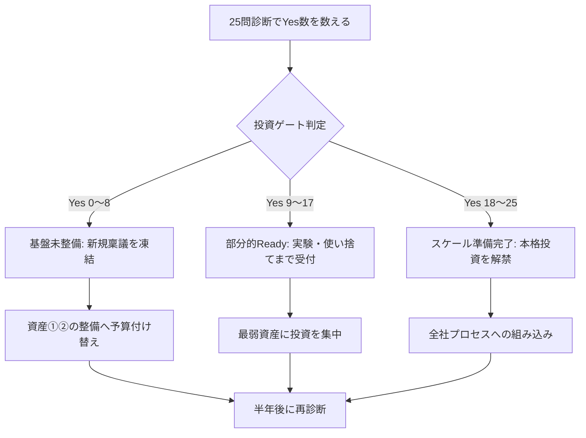

## AI-Readyはツールの導入度ではなく組織の受容能力で測る

AI-Readyかどうかは「何を導入したか」では測れない。モデルとツールは陳腐化する。複利で効くのは、構造化されたデータ・分解された業務・検証できる人・統制の仕組み・乗り換えられる契約という、組織側の資産である。本ページではこれを次の5資産として定義し、各5問・計25問のYes/Noで自己診断する。

1. **データ・ナレッジの構造化** — AIが読める形で社内知が存在するか
2. **業務フローの文書化・分解可能性** — 業務をAIに渡せる単位に切れるか
3. **人材の検証・委任能力** — AIの出力を評価し、任せる範囲を判断できるか
4. **ガバナンス** — リスクを把握し、止められる仕組みがあるか
5. **調達・契約の可換性** — 特定ベンダー・特定モデルに縛られず乗り換えられるか

なお、この5資産と25問の設計、後述の実施要領・役員用の5問・判定基準は、後述する複数の成熟度フレームワークを参考に編集部が独自に組み立てたものであり、特定の調査機関の公式診断ではない。

### 実施のしかた

- **回答単位**: 全社一括ではなく、まず1事業部門で実施する。部門間の偏りこそが論点であり、全社平均は実態を均してしまう(整備の進んだ部門と紙の書類中心の部門を平均すると、どちらの実態も見えなくなる)
- **回答者**: 推進担当と部門長の合議とする。どちらか一方の自己申告にしない
- **判定**: Yesと答えるには根拠資料(文書・台帳・規程・契約書など)を1つ挙げられること。挙げられない・迷う場合はNo

### 役員がまず試す5問

25問のフル診断に入る前に、経営会議の場で役員自身が次の5問(各資産から1問)に即答できるか試すとよい。

| 資産 | 問 | 問い |
|------|----|------|
| ①データ | 問1 | 主要業務の判断に使う情報が、個人のメールやローカルファイルではなく共有された場所にあるか |
| ②業務フロー | 問6 | 主要業務の手順が、担当者以外が読んで実行できる粒度で文書化されているか |
| ③人材 | 問12 | AIの出力の正誤を判断できる業務知識を持つ人を、利用場面ごとに特定できるか |
| ④ガバナンス | 問17 | 社内でどの部署が何にAIを使っているか、一覧で把握できるか |
| ⑤調達 | 問25 | AI関連支出の全体額と内訳を経営層が把握しているか |

Noまたは即答不能が2問以上あれば、25問のフル診断を推進担当に指示する。

## なぜこの5資産か

5資産の定義・各資産の根拠・整備の最初の90日は、**姉妹ページ「AI-Readyの5資産」**で詳しく説明している。本ページは診断ツールとして要点のみを要約する。

- **①データ・ナレッジの構造化**: AIの精度を決めるのはモデルではなく食わせるデータである。AI-readyなデータ基盤を欠くプロジェクトの大量放棄を予測する見解もある(ベンダー寄稿経由の予測)[src-2026-011]
- **②業務フローの文書化・分解可能性**: 日本は個人利用は高い一方、部署の業務プロセスへの組み込みが弱い [src-2026-046]。組み込みの前提は、業務が文書化され「AIに渡せる単位」に分解できることである
- **③人材の検証・委任能力**: 国内調査ではスキル・リテラシー不足が活用課題の最多であり [src-2026-051]、AIの出力を検証できる人がいなければ導入は事故の入口になる
- **④ガバナンス**: 管理されていないAIリスクを報告する企業は既に多数派だが、統制が成熟した企業は少数にとどまる [src-2026-002]。この差があるからこそ、統制は整備すれば差がつく資産になる
- **⑤調達・契約の可換性**: 日本はコア事業のシステムすら外部委託が最多であり [src-2026-046]、作る・買う・捨てるを選び直せる契約構造そのものが資産になる

5資産という切り方の背景には、MIT CISRの4段階エンタープライズAI成熟度モデル [src-2026-001]、BCGの成熟度4分類 [src-2026-002]、Oxford EconomicsとServiceNow(ITベンダー)の共同調査による5次元のAI成熟度指数 [src-2026-006] がある。いずれも技術導入ではなく組織能力で成熟度を測る点で共通する。なお同指数では、AI投資の拡大と並行して平均成熟度スコアが低下する局面が観測されている [src-2026-006]——技術の進化で要求水準自体が上がるためであり、本診断も定点ではなく半年ごとの再測定を推奨する。

## 25問チェックリスト

各問にYes/Noで答える。「迷ったらNo」が原則である。

### 資産① データ・ナレッジの構造化

| # | 問い | Yesの状態の例 | Noなら最初にやること |
|---|------|--------------|---------------------|
| 1 | 主要業務の判断に使う情報が、個人のメールやローカルファイルではなく共有された場所にあるか | 案件情報・顧客情報・ナレッジが全社共有基盤に集約 | 1部門を選び、散在ファイルの棚卸しから始める |
| 2 | 社内文書に「どれが最新版か」を判別する仕組みがあるか | 版管理・更新日・責任者が文書に明記 | 最重要文書20件に責任者と更新日を付ける |
| 3 | 暗黙知(ベテランの判断基準・例外処理)を文書化する活動が継続しているか | 業務マニュアルが半年以内に更新されている | 退職リスクの高い業務1つから聞き書きを開始 |
| 4 | データの定義(顧客・売上等の意味)が部門間で揃っているか | 全社共通のデータ定義書・用語集が存在 | 部門間で数字が食い違う指標を1つ特定し定義を統一 |
| 5 | AIに渡してよいデータと渡してはならないデータの区分があるか | 機密区分ラベルが運用されている | 機密・社外秘・公開の3区分を仮決めして主要文書に付与 |

### 資産② 業務フローの文書化・分解可能性

| # | 問い | Yesの状態の例 | Noなら最初にやること |
|---|------|--------------|---------------------|
| 6 | 主要業務の手順が、担当者以外が読んで実行できる粒度で文書化されているか | 引き継ぎが文書ベースで完了する | 月次で必ず発生する業務1つを手順書化 |
| 7 | 業務を「判断が必要な工程」と「定型的な工程」に分けて把握しているか | 工程ごとに判断/定型のタグがある | 1業務を工程に分解し、各工程に判断/定型を付ける |
| 8 | 各工程の入力と出力(何を受け取り何を渡すか)が定義されているか | 工程間の受け渡し物が明文化 | 手順書に「入力」「出力」の欄を追加する |
| 9 | 業務の成果物に「合格基準」(何ができていれば完了か)があるか | チェックリストやレビュー観点が存在 | 成果物1種類に完了条件を3項目書き出す |
| 10 | AIを個人の時短ではなく、部署の業務プロセスに組み込んだ事例があるか | 特定工程がAI前提のフローに置き換わっている | 問7で「定型」と分類した工程から1つ選び試行 |

### 資産③ 人材の検証・委任能力

| # | 問い | Yesの状態の例 | Noなら最初にやること |
|---|------|--------------|---------------------|
| 11 | AIの出力をそのまま使わず検証するルールが周知されているか | 「確認なしで社外提出禁止」等の明文ルール | 検証必須の場面を3つ定めて全員に通知 |
| 12 | AIの出力の正誤を判断できる業務知識を持つ人を、利用場面ごとに特定できるか | 各業務にレビュー担当が紐づいている | 主要業務ごとに「検証できる人」を名指しで一覧化 |
| 13 | 「AIに任せてよい仕事」と「人が握るべき仕事」の判断基準を議論したことがあるか | 委任範囲の社内ガイドラインがある | 経営層・現場で委任範囲のワークショップを1回実施 |
| 14 | 全社員向けのAIリテラシー教育(誤情報・機密の扱いを含む)を実施しているか | 年1回以上の必須研修と受講記録 | 1時間の基礎研修を内製または外部調達で実施 |
| 15 | AIで浮いた時間・人員の再配置を計画しているか | 配置転換・役割再設計の計画が文書化 | 削減時間の使い道を部門長レベルで仮決めする |

### 資産④ ガバナンス

| # | 問い | Yesの状態の例 | Noなら最初にやること |
|---|------|--------------|---------------------|
| 16 | 全社のAI利用ルール(利用範囲・禁止事項)が明文化され、更新されているか | 1年以内に改訂されたAI利用ポリシー | 1枚もののポリシー(目的・禁止・相談先)を発行 |
| 17 | 社内でどの部署が何にAIを使っているか、一覧で把握できるか | AI利用台帳・申請制または自動把握 | 各部署に利用状況の自己申告を依頼し台帳化 |
| 18 | AIが関与した成果物で問題が起きた際の報告・対応ルートがあるか | インシデント報告先と手順が定義済み | 既存の情報セキュリティ報告ルートにAIを追加 |
| 19 | AI活用の推進責任者(役員クラス)が明確か | 社長直轄体制または担当役員の任命 | 経営会議でAI推進のオーナーを決める |
| 20 | 法規制・契約上の制約(顧客との守秘義務等)とAI利用の整合を確認したか | 法務レビューを経たガイドライン | 顧客契約の守秘条項とAI利用の関係を法務に照会 |

### 資産⑤ 調達・契約の可換性

| # | 問い | Yesの状態の例 | Noなら最初にやること |
|---|------|--------------|---------------------|
| 21 | AI関連の外部委託で、データ・プロンプト・業務知識が自社に残る契約になっているか | 成果物・中間生成物の権利帰属が明記 | 既存契約の権利帰属条項を棚卸しする |
| 22 | 特定のツール・モデルが使えなくなった場合の代替手段を検討したことがあるか | 乗り換え時の影響範囲が文書化されている | 最も依存度の高いAI利用1つで代替シナリオを書く |
| 23 | AI投資を「本格投資/使い捨て構築/実験/待つ/やらない」のように区分して判断しているか | 投資区分と撤退条件が稟議に含まれる | 進行中のAI案件に投資区分と捨てる条件を後付けで定義 |
| 24 | コア事業に関わる部分について、内製化または内製への移行余地を確保しているか | コア領域の仕様・運用知識を社内が保持 | 外部委託中のコア案件で社内側の担当者を置く |
| 25 | AI関連支出の全体額と内訳を経営層が把握しているか | 部署横断のAI支出が四半期で報告される | 各部署のAI関連支出を1度集計して可視化 |

## 採点と判定

Yesの数を数える。以下の3段階の切り方は、各種成熟度モデルの段階構造 [src-2026-001] [src-2026-002] を参考に編集部が置いた便宜的な区分であり、統計的に検証された閾値ではない。

| Yes数 | 判定 | 状態 | 次にやるべきこと |
|-------|------|------|------------------|
| 0〜8 | **基盤未整備** | 個人利用は始まっていても、組織としての受け皿がない | 拡大より先に、資産①②の整備と資産④の最低限(問11・16・18)を固める |
| 9〜17 | **部分的Ready** | 一部の資産・部門に偏りがある | Noが集中した資産を特定し、そこに投資を集中する。全方位の底上げより偏り解消が速い |
| 18〜25 | **スケール準備完了** | パイロットから全社の働き方への移行に挑める | 部門単位の成功を全社プロセスに組み込む。MIT CISRの調査では、パイロット段階から「AIの働き方」段階への移行が最大の財務インパクトをもたらす [src-2026-001] |

重要なのは合計点よりも**5資産ごとのYes/No分布**である。1つの資産が0〜1点なら、他が満点でもそこがボトルネックになる。特に資産①が低い場合は他資産への投資効果が出にくい——AI-readyなデータを欠くプロジェクトの6割は放棄されるという前掲の予測 [src-2026-011] とも整合する。

### 採点結果を投資判断につなぐ

診断結果は、投資判断の5択(本格投資/使い捨て構築/実験/待つ/やらない。詳細はロードマップ編「投資判断の5択」)の受付ゲートとして使える。以下の接続と金額の目安に出典はなく、実務上の経験則である。自社の決裁規程に合わせて読み替えてほしい。

| Yes数 | 投資ゲート | 体制と費用の目安 |
|-------|-----------|--------------|
| 0〜8 | 新規AI施策の稟議を**凍結**し、データ整備・業務文書化へ予算を付け替える | 整備は1部門・四半期単位で、部門予算内(数百万円規模)から始める |
| 9〜17 | 「実験」「使い捨て構築」までを受け付ける。「本格投資」は凍結を維持 | 1案件の上限は「捨てられる額」。撤退条件と再判定日を稟議の必須項目にする |
| 18〜25 | 「本格投資」の稟議受付を**解禁**する | 全社基盤・プロセス再設計クラスの投資を検討対象に含める |

診断から投資ゲート、次のアクション、再診断までの流れは次の通りである(Yes数の区分は上表のゲート定義)。



再診断を翌年度予算編成に直結させる年次サイクルは、ロードマップ編「1年プランと3年シナリオ」を参照。投資ゲートの判定を中計・取締役会決議の文言(ゲート条件付き決議)へ落とす型は、ロードマップ編「経営計画への翻訳」を参照。

### 経営会議に出す1枚様式(そのまま使える記載例)

診断結果は次の1枚に集約して経営会議に出す。様式・記載例とも編集部が作成した架空の例である。レーダーチャートは5資産×各5点満点で描く。AI施策が複数走る段階では、ポートフォリオの分布(成功・継続・中止・学習回収の内訳)の行を加える運用も検討する(この運用の詳細はロードマップ編「AIDXのリターン構造」で説明している)。

```text
AI-Ready診断 経営報告(四半期)            診断日: 2026-06-15
対象: ○○事業部 / 回答者: 推進担当+部門長の合議
総合: 13/25(部分的Ready)  投資ゲート: 実験・使い捨て構築まで可
5資産レーダー(各5点満点): ①データ 4 ②業務 3 ③人材 3 ④ガバナンス 2 ⑤調達 1
最弱資産: ⑤調達・契約の可換性(委託契約に権利帰属・撤退条項なし)
次四半期の一手: AI委託契約2件の権利帰属条項を改訂
  (所管: 法務+推進担当 / 完了条件: 改訂契約の締結)
次回診断日: 2026-09-15(再診断で最弱資産のYes+2問を目標)
```

## 日本企業の現在地 — 自社の相対位置の参考に

構造として読み取れるのは三点である。第一に、日本の大企業では導入そのものは飽和に近づいたが、全社員への利用浸透には大きな段差がある。第二に、利用しても成果創出で米国に劣後し、格差は拡大傾向が報告されている。第三に、その背景には、個人利用止まりでプロセスに組み込まれない・検証できる人材が足りない・外部委託依存で内製余地が乏しいという、前節「なぜこの5資産か」で挙げた構造が重なる。具体的な数値は下のデータボックスを参照されたい。

> 📊 **データボックス(2026-06時点)**
> - 生成AI導入済み: 57.7%(2023年度33.8%から一貫増)、最大の課題は「リテラシーやスキルが不足している」70.3%(NRI、2025年9月調査、国内売上高上位約3,000社のCIO等517社回答)[src-2026-051]
> - 部分導入を含む導入済みは95.6%に達する一方、「ほぼ全社員が生成AIを利用している」企業は18.5%(デロイト トーマツ、2025年7月調査、プライム上場・売上1,000億円以上の部長クラス以上700名)[src-2026-050]
> - 生成AIで「期待を大きく上回る効果」: 日本10%、米国45%。格差は拡大傾向(報道によればPwC Japan 5か国比較、2025年6月発表)[src-2026-048]
> - DXで「成果が出ている」企業: 米独8割以上、日本6割弱。生成AIに前向きな企業: 米国8割弱、日本5割弱(IPA DX動向2025、2025年2〜3月調査)[src-2026-046]
> - 推進体制が社長直轄の企業の61%が期待以上の効果を達成(報道によればPwC、同調査)[src-2026-048] ※実施企業側の比率のみで非実施群の比較値は報道になく、要因と断定する根拠にはならない

本診断の段階を直接測った調査はないが、上記のデータからは、日本の大企業の多くは「部分的Ready」に相当すると読める。導入率(問の外側)は高くても、資産②(プロセス組み込み)と資産③(検証能力)、資産⑤(内製・可換性)のNoが多い、という偏りが上記データと整合的である。

## 診断後の進み方

- **今すぐ**【部門長】【推進担当】: Noが付いた問の「最初にやること」のうち、1部門・1業務で完結するもの(問1・3・6・7・11・16)に着手する。使う道具: 25問表の右列。完了条件: 対象業務について手順書・台帳・1枚ポリシーのいずれかが実物として存在する。いずれも投資判断不要で始められる。
- **今すぐ**【経営】: 判定結果と5資産の分布を経営会議で確認し、推進オーナー(問19)を任命する。使う道具: 前掲の経営報告1枚様式。完了条件: オーナーの氏名が経営会議の議事録に残る。社長直轄体制の企業で期待以上の効果の比率が高いという結果(前掲61%)[src-2026-048] は実施企業側の比率のみ(非実施群の比較値は報道になく、要因と断定する根拠にはならない)であり、推進力のある企業ほど社長直轄を選ぶという選択効果・逆因果の可能性も排除できない。それでも、オーナー不在のまま各論に入るより任命を先にすることを推奨する。
- **1年以内**【推進担当】【経営】: 最弱資産の引き上げを四半期目標に落とし、半年後に本診断を再実施して差分を測る。使う道具: 本診断+経営報告様式。完了条件: 再診断で最弱資産のYesが2問以上増えている(この目標値に出典はなく、実務上の目安である)。成熟度の要求水準自体が年々上がるため [src-2026-006]、定点の点数より変化量を見る。
- **能力向上を待て**【CFO】【経営】: 全社一斉のプロセス再設計や大型のAI基盤投資は、資産①と④が「部分的Ready」水準に達するまで待つ。使う道具: 前掲の投資ゲート。完了条件: ゲート通過を「本格投資」稟議の前提条件として決裁規程・稟議様式に明文化する。基盤未整備のまま進めた投資は放棄リスクが高いと指摘されている [src-2026-011]。

**この主張が崩れる条件**: 5資産のスコアが低いまま(特に資産①が0〜1点のまま)AIから持続的に成果を上げる企業が相当数観測されるなら、「組織資産の整備が先」という本診断の前提と投資ゲートの設計は成立しない。

(関連: 組織・人材編「業務分解×再配置プレイブック」、ロードマップ編「投資判断の5択」・段階設計)

<!--
執筆メモ(レビュー重点ポイント):
1. 指示にあった「導入57.7% vs 従業員利用32.4%の二重ギャップ(051)」のうち、32.4%という数値はsrc-2026-051のkey_factsに存在しない(32.4%はsrc-2026-050の「前年の配置転換実施率」)。規約「sourcesにない数値は書かない」に従い、二重ギャップはNRI 57.7%+課題70.3% [051] と デロイト導入95.6% vs ほぼ全社員利用18.5% [050] で構成し直した。意図と異なる場合はソース追加リサーチが必要。
2. 25問の各問・「Yesの状態の例」「Noなら最初にやること」・3段階判定の閾値(0-8/9-17/18-25)に加え、2026-06-11改稿で追加した実施要領・「まずこの5問」・投資ゲート(凍結/解禁の接続と決裁レンジ)・経営報告1枚様式もすべて編集部の設計であり出典はない(本文に見立て明記済み)。レビューで妥当性を確認されたい。特に資産⑤(調達・契約の可換性)は直接の裏付けソースがIPAの内製化データ [046] のみで最も薄い。
3. Gartner 60%予測 [011] は原典プレスリリース未確認(CIO誌のベンダー寄稿経由、reliability: medium)。2026-06-11改稿で寄稿経由であることを本文に明示し、「予測が示す通り」→「予測とも整合する」に弱めた。原典確認または代替ソースの追加は引き続き望ましい。
4. 2026-06-11レビュー(batch2、five-assets指示2)に基づき、「なぜこの5資産か」節を正本(readiness/five-assets)への参照+要点要約に置換・圧縮した(単一情報源ルール対応、正本宣言は双方向)。圧縮に伴いAI成熟度指数のスコア低下(44→35)は構造記述化した(数値の根拠はsrc-2026-006に保持)。25問・採点閾値・投資ゲート・経営報告様式・実施要領は変更していない。
2026-06-12 文体改修: 格言調見出し平易化・内部用語排除・見立て定型句を自然文に置換
-->
