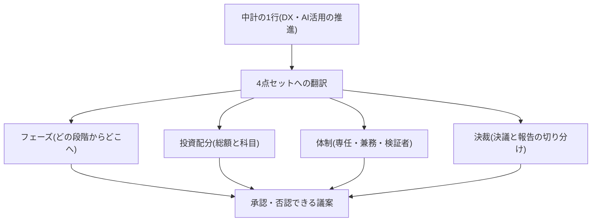
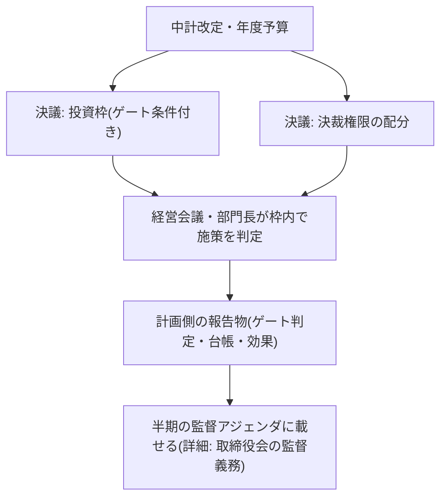
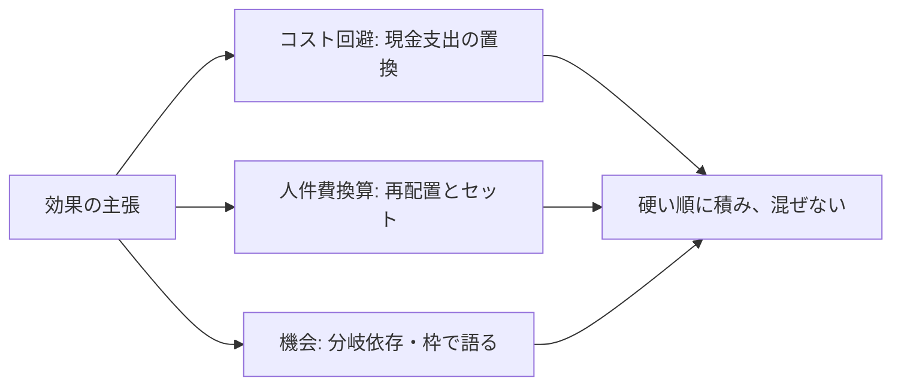

> 💡 **ひとことで言うと**
> 経営計画に「AIをがんばる」と1行書くだけでは、役員会は賛成も反対もできない。家の改装を頼むとき「いい感じにして」ではなく、どこを・いくらで・誰が直し、何が起きたらやめるかまで決めるのと同じである。AIの計画も、金額・体制・やめる条件まで書いて初めて議論の土俵に載る。

## 「DX推進」の1行のままでは取締役会は承認も否認もできない

中期経営計画に「DX・AI活用の推進」(DX=デジタル技術で仕事のやり方を変える取り組み)と1行書いても、取締役会はそれを承認も否認もできない。金額がなく、体制がなく、何を決議し何を報告で済ませるかの切り分けがないからだ。承認できない議案は、実質的には白紙委任か放置のどちらかになる。実際、日本企業ではIT予算の増勢が続く。その一方で、予算の大半は現行ビジネスの維持に費やされ、価値創出に向かう比率は長年横ばいである。投資の事前・事後評価を実施しない企業も一定数ある [src-2026-104]。包括的な1行予算は、この「増えるが評価されない」構造をそのまま再生産する。

本ページの提案は、AIDX(AIを前提に仕事のやり方を作り直す取り組み。用語集「AIDX」参照)を次の**4点セット**に翻訳してから、中計・予算・決議に載せることである。

1. **フェーズ** — 自社がいまどの段階にいて、計画期間でどこまで行くのか(段階の定義はAI-Ready編「成熟度モデル」にある=実験期→パイロット期→組み込み期→再設計期の4段階)
2. **投資配分** — 総額をいくら置き、どの科目に何割を配るのか(本ページで10-20-70原則を予算科目に変換する)
3. **体制** — 専任・兼務・検証者(AIの答えが正しいかを確かめる役。用語集「検証者」参照)を何名置くのか(規模別の専任・兼務レンジと2シナリオ運用はロードマップ編「1年プランと3年シナリオ」で、検証者・設計者・例外処理者の3役割は組織・人材編「実行者から検証者・設計者へ」で説明している)
4. **決裁** — 取締役会が計画サイクルで何を決議し、定期報告をどこに載せ、何を経営会議以下に委ねるのか(施策単位の決裁レンジはロードマップ編「投資判断の5択」=本格投資は経営会議以上・実験/使い捨て(用語集「使い捨て構築」参照)は部門長以下、取締役会の監督アジェンダは組織・人材編「取締役会の監督義務」=半期1回・報告事項5項目)

この4点セットは新しい判定基準ではない。成熟度4段階・投資ゲート(準備が整うまで投資を通さない関門)・5択の決裁レンジ・1年プランの体制レンジという既存の判定基準を、中計・予算・取締役会決議という経営計画の様式に**束ねて載せ替える**ための整理である。この束ね方自体に出典はなく、実務上の整理である。本ページが扱う範囲と、各判定基準を説明しているページ(結論1行)は次の対応表の通りである。判定基準を本ページで定義し直すことはない。

この表の見方: 縦に9つの論点、横に「本ページの扱い」と「定義のあるページ」が並ぶ。気になる論点の行だけ読めばよい。

| 論点 | 本ページの扱い | 判定基準を説明しているページ(結論1行) |
|---|---|---|
| フェーズの段階定義 | 計画への転記のみ | AI-Ready編「成熟度モデル」=実験期→パイロット期→組み込み期→再設計期の4段階 |
| 投資の可否判定 | 決議文言への埋め込みのみ | AI-Ready編「AI-Ready自己診断」の投資ゲート=25問診断で0〜8点は新規稟議凍結/9〜17点は実験・使い捨てまで/18点以上で本格投資解禁 |
| 施策単位の決裁・稟議 | 委譲ラインの決議のみ | ロードマップ編「投資判断の5択」=本格投資は経営会議以上、実験・使い捨ては部門長以下。全施策の稟議に撤退条件・再判定日(稟議追記欄) |
| 年次運用・体制レンジ | 絵姿への転記のみ | ロードマップ編「1年プランと3年シナリオ」=基本/加速の2シナリオで年次分岐を管理、下振れは両シナリオ共通のストレステスト(悪化時の耐久点検) |
| 施策単位の効果見積・実測 | 報告の語彙(3分類)への束ねのみ | ロードマップ編「AIDXのリターン構造」=純効果(浮く工数×単価−検証工数×単価−月次費用)で実測し、二重計上を点検 |
| 取締役会の監督・AIガバナンス基本方針の決議 | 計画サイクル側の決議2点の追加のみ | 組織・人材編「取締役会の監督義務」=監督4点+半期1回の監督アジェンダ(報告事項5項目)。基本方針の決議は計画とは別の時計で動く |
| 規程・報告経路 | 参照のみ | 組織・人材編「推進体制とガバナンスの設計図」=規程骨子(第9章が取締役会への報告・監督を定める) |
| 浮いた工数の再配置 | 人件費換算の計上条件として参照 | 組織・人材編「実行者から検証者・設計者へ」=浮いた時間は3役割へ振り替えて初めて効果になる |
| 経営企画部門自身の業務AIDX | 扱わない(本ページは計画の「中身」) | 部門別ガイド「事業企画・経営企画のAIDX」 |

**会議に出る最小セット**: 中計・予算の審議は、本ページ+別添4枚——①3年の投資の絵姿(本ページのテンプレ)②投資ゲート判定結果(経営報告1枚様式=AI-Ready編「AI-Ready自己診断」)③AI施策台帳サマリー(原理編「負債とスロップの分類学」)④AI監督アジェンダ(取締役会の議題セット。組織・人材編「取締役会の監督義務」)——で足りる。議案書ドラフト(本ページ末尾に現物を載せた)はこの別添を綴じる表紙である。

1行の記述から決議可能な議案への翻訳の構造は次の通りである。

## 投資総額と配分の置き方

### 総額は他社相場ではなく投資ゲートの判定から決める

「他社はAIにいくら使っているのか」から総額を逆算したくなるが、市場全体の支出見通し(下記データボックス)は自社の適正額に直接は答えない。総額は次の順で置く。この手順に出典はなく、実務上の経験則である。**①投資ゲートの判定(判定手順はAI-Ready編「AI-Ready自己診断」にある=18点以上で本格投資解禁、9〜17点は実験・使い捨てまで、8点以下は新規稟議凍結)で受け付けられる投資の種類を確定する → ②受け付けられる種類(整備・実験・使い捨て・本格投資)ごとに件数×単価レンジで積み上げる → ③市場データは「環境が拡大している」という背景説明にのみ使う**。ゲート未通過の段階で本格投資枠を積んだ計画は、金額の大小にかかわらず構造が誤っている。

> 📊 **データボックス(2026-06時点)**
> - 世界のAI支出は2024年の約2,350億ドルから2028年に6,310億ドル超へ拡大見通し、5年CAGR約27%(IDC、2024年8月。推計モデル非開示のベンダー推計であり、水準は幅をもって読む)[src-2026-105]
> - 日本企業のIT予算DI値(増加−減少)は2024年度計画42.3ポイントと過去10年で最高。ただし増加理由の最多は円安・人件費高騰・ベンダー値上げの影響(JUAS企業IT動向調査2025、回答981社、経済産業省監修)[src-2026-104]
> - IT予算配分はランザビジネス(現行維持)76.2%、バリューアップ(新施策)23.8%で2018年度からほぼ横ばい [src-2026-104]
> - IT投資の評価を「実施していない」企業は事前評価で35.0%、事後評価で42.8%。戦略系投資(DX等)の事後評価実施は23.9%にとどまる [src-2026-104]
> - AIから大きな価値をスケールで実現している企業(future-built)はIT支出が他社より26%多く、IT予算に占めるAI比率は最大64%高い(BCG、2025年、n=1,250社)[src-2026-002]

### 配分は10-20-70原則を予算科目に変換して置く

BCGの調査では、AIで価値を出しているリーダー企業に「アルゴリズムに10%・テクノロジーとデータに20%・人と業務プロセスに70%」というリソース配分(10-20-70原則)が観察されている [src-2026-038]。これは横断面調査(ある一時点の企業を比べた調査)でリーダー企業に観察された配分である。この配分にすれば成果が出るという因果の証明ではない(成果が出ている企業だから人とプロセスに割けるという、逆向きの因果も排除できない)。それでも、この配分は予算編成の出発点として有用だと考えている。理由は単純で、**日本企業の予算書ではこの3層のうち「人とプロセス」の層だけが科目として見えず、最初に削られる**からだ。3層を予算科目に変換すると次のようになる。この科目への対応づけに出典はなく、実務上の経験則である。

この表の見方: 縦に3つの層、横に中身・予算書での現れ方・落とし穴が並ぶ。自社の予算書に見当たらない行こそ要注意である。

| 層(BCG調査の観察 [src-2026-038]) | 中身 | 予算書での現れ方(科目例。出典のない目安) | 落とし穴 |
|---|---|---|---|
| アルゴリズム(1割) | モデル・ツールの利用 | ソフトウェア利用料・API(システム同士の接続口)利用料(販管費) | 唯一見えやすい層であり、ここだけが「AI予算」と誤認される |
| テクノロジーとデータ(2割) | データ整備・利用基盤・既存システム改修 | 業務委託費と資産計上(無形固定資産・仮勘定)の混在 | 資本的支出と費用が混在し、一般のIT予算に埋没する |
| 人と業務プロセス(7割) | 検証者育成・教育・業務再設計の工数・規程整備・外部伴走 | 教育研修費・既存人件費の工数振替・支払報酬 | 大半が新規の現金支出ではなく既存工数の振替のため予算書に現れず、最初に削られる |

「人とプロセス」層が削られやすいのは、検証者の育成や業務再設計の多くが既存社員の勤務時間の使い途を変えるだけで、新しい請求書が発生しないからである。予算の審議では「何も要らない」ように見え、項目ごと消える。つまり「AI予算」をツール利用料の行だけで作ると、原則の1割の部分だけを予算化したことになる。中計・年度予算には、人とプロセス層を**工数の振替計画(誰の時間を何に付け替えるか)**として明記することが翻訳の要点である。

**自社集計のやり方(CFO=財務担当役員向け・3行)**——表があっても集計手順で詰まることが多いため、現状配分は次の順で拾う。手順に出典はなく、実務上の経験則である。
1. **利用料層**: 販管費のソフトウェア利用料・API利用料・通信費から、契約台帳・ベンダー名でAI関連契約を名寄せして抽出する
2. **基盤とデータ層**: 無形固定資産台帳(建設仮勘定・ソフトウェア仮勘定を含む)とIT業務委託費から、AI・データ整備を目的とする案件コードを抽出する(資産計上分は年額換算で按分)
3. **人とプロセス層**: 勘定科目には現れないため、教育研修費のAI関連分に加えて、検証・再設計・規程整備の担当者工数(検証ログ・工数管理の実績)を人件費単価で換算して積む。AI施策台帳(原理編「負債とスロップの分類学」=全施策を5択と撤退条件付きで台帳化)の施策単位で拾うと漏れにくい

なお、この3層はロードマップ編「1年プランと3年シナリオ」が示す費目構成比の目安(人件費4〜5割/利用環境・基盤2〜3割/教育1割前後/外部支援1〜2割)と矛盾しない——同ページの人件費・教育・外部支援の合算が本ページの「人と業務プロセス」層に相当する。この対応づけにも出典はない。

## 3年の投資の絵姿テンプレ(2例+記入例。そのまま使える)

中計に添付する「3年の絵姿」の雛形を2例+記入済み1例で示す。**投資レンジ・配分・効果の列の数値はいずれも出典がなく、実務経験にもとづく目安である**(列見出しに※目安と明記)。自社の規模・段階に合わせて置き換える叩き台として使う。投資・効果のレンジは、ロードマップ編「1年プランと3年シナリオ」の体制・費用の目安など、**他ページの目安と桁を揃えてあるだけである。桁が揃っていること自体は検証ではない**。90日以内に検証ログの実測値(処理時間・差し戻し率)へ置き換える前提の仮置きである。したがって、この表の投資レンジ・効果の目安を予算資料や稟議書にそのまま転記してはならない。予算に書いてよいのは、90日以内に自社の処理時間・差し戻し率・検証工数の実測で置き換えた後の数字だけである。なお90日で揃うのは処理時間・差し戻し率・検証工数比の初期値である。業務組み込み率・純効果のような四半期集計の指標は、最初の四半期レビューで初回値を確定する(この区別はロードマップ編「成果をどう測るか」の計測体系と共通である)。絵姿は金額の確約ではなく、**ゲート条件付きの枠**として書く(条件の判定はAI-Ready編「AI-Ready自己診断」の投資ゲートで行う=18点以上で本格投資解禁、未通過なら凍結)。年次の運用と分岐管理はロードマップ編「1年プランと3年シナリオ」(=基本/加速の2シナリオで分岐を管理)に従い、3年目の数字は分岐依存であることを枠内に明記する。

**例1: 中堅企業(数百名規模)の絵姿**

この表の見方: 縦に1〜3年目、横に目標・投資・配分・決裁条件が並ぶ。自社の規模に近い例を選び、年次の行を順に読む(例2・記入例も同じ並びである)。

| 年次 | フェーズ目標(段階の定義は成熟度モデル) | 投資レンジ(年)※目安 | 配分の力点 ※目安 | 決裁・ゲート条件 |
|---|---|---|---|---|
| 1年目 | 90日の3手を完遂し、組み込み期入りを狙う | 数百万〜2,000万円 | 人とプロセス6〜7割(検証者育成・1業務の再設計)、利用料は既存契約中心 | 経営会議決裁。本格投資は凍結(ゲート未通過時) |
| 2年目 | 組み込みの横展開(2〜3部門) | 1,000万〜数千万円 | 基盤・データ整備の比重を上げる | 投資ゲート再判定。解禁水準なら本格投資枠を起票 |
| 3年目 | 再設計期への移行判断 | 数千万円規模(分岐依存) | 本格投資はゲート通過+組み込み実績のある領域のみ | 取締役会へ枠の決議(ゲート条件を文言に含める) |

効果側の目安(出典はなく実務上の経験則): 組み込みが回った場合、対象業務群の削減工数の人件費換算で年200万〜2,000万円程度+外部委託費・残業の置換(コスト回避)。内訳式: **対象5〜15業務 × 浮く工数(月10〜30時間/業務)× 人件費単価4,000〜5,000円/時 × 12ヶ月 − 検証工数(浮く工数の2〜3割を同単価で控除)**。感度: 検証工数が浮く工数の5割を超える業務が大半なら純効果はほぼ半減し、1年目投資との相殺圏に入る——その場合は対象業務の選定からやり直す。

**例2: 大企業(数千〜数万名規模)の絵姿**

| 年次 | フェーズ目標 | 投資レンジ(年)※目安 | 配分の力点 ※目安 | 決裁・ゲート条件 |
|---|---|---|---|---|
| 1年目 | 1事業会社・先行部門で型の獲得(台帳・ガードレール(用語集「ガードレール」)・分解の実物) | 数千万〜1億円 | 人とプロセス中心。基盤の大型投資はしない | 経営会議決裁+取締役会報告 |
| 2年目 | 横展開と規程・基盤の整備(規程初版・共通の検証基準) | 1億〜3億円 | 基盤・データ整備の比重増。教育を全社化 | 投資ゲート再判定。部門別の偏りを開示 |
| 3年目 | 再設計投資の解禁判定(全社基盤・プロセス再設計) | 数億円規模まで(分岐依存) | 本格投資はゲート通過領域に限定 | 取締役会で枠を決議。未通過なら枠は自動凍結 |

効果側の目安(出典はなく実務上の経験則): 先行領域だけで削減工数の人件費換算で年2,000万〜3億円程度+委託費置換等のコスト回避。内訳式: **対象30〜150業務 × 浮く工数(月10〜40時間/業務)× 人件費単価5,000〜6,000円/時 × 12ヶ月 − 検証工数(浮く工数の2〜3割を同単価で控除)**。感度は例1と同じ(検証工数5割超で純効果は半減圏)。機会側(売上・速度)は、加速シナリオのトリガー(あらかじめ決めた発動の合図)を観測した後にのみ、枠として計上する。

**記入例: 架空の中堅企業A社(製造業・従業員600名)の絵姿(数値はすべて架空の例示で、出典はない)**

空欄のテンプレより埋まった1例のほうが書き始められる。例1の雛形をA社が埋めるとこうなる。

| 年次 | フェーズ目標 | 投資額(年)※架空の例 | 配分 ※架空の例 | 決裁・ゲート条件 |
|---|---|---|---|---|
| 1年目 | 90日の3手を完遂し、見積・受発注事務1業務の組み込み | 1,200万円 | 人とプロセス65%(検証者2名育成・業務再設計の工数振替を含む)/基盤・データ20%/利用料15% | 経営会議決裁。診断12点(実験まで)のため本格投資枠は置かない |
| 2年目 | 経理・営業事務へ横展開(計3部門) | 2,500万円 | 基盤・データ整備を35%へ引き上げ | Q4の再診断で18点以上なら本格投資枠を起票 |
| 3年目 | 受発注プロセスの再設計判断 | 上限4,000万円の枠(分岐依存) | 本格投資はゲート通過領域のみ | 取締役会決議「ゲート未通過の間は本格投資枠の執行を凍結する」 |

A社の効果側の仮置き(架空の例): 対象8業務 × 浮く工数 月20時間 × 単価4,500円 × 12ヶ月 ≒ 年860万円、検証工数3割を控除して**約600万円/年**。感度: 検証工数が5割なら約430万円まで縮み、浮く工数が想定の半分なら1年目投資を下回るため2年目の横展開を凍結する。

どの例でも、経営が3年分を一括で確約するのは**1年目の投資と、2年目以降の「ゲート条件付きの枠」**だけである。3年分の金額を無条件に確約した中計は、撤退条件のない投資を3年分予約したのと同じである。

## 取締役会に何を決議として上げ、何を報告に載せるか

取締役会のAI監督そのものの設計は**組織・人材編「取締役会の監督義務」で説明している**(監督4点+半期1回の監督アジェンダ。冒頭の対応表参照)。本ページが扱うのはその手前、すなわち**中計改定・年度予算という計画サイクルの側で取締役会に上程する決議**である。この切り分けに出典はなく、実務上の設計である。全部を決議にすると取締役会が施策の個別審査機関になって滞り、全部を報告にすると白紙委任になる。そこで決議は「枠と権限」に絞り、施策の個別判定は委譲した決裁レンジの中で回す。

**計画サイクル側の決議事項(中計改定時・年度予算時)**

| 議案 | 内容 | 参照 |
|---|---|---|
| ① 3年投資枠と年度予算 | 絵姿テンプレの枠+「投資ゲート未通過の間は本格投資枠を凍結する」条件を決議文言に含める | 投資ゲートの定義: AI-Ready編「AI-Ready自己診断」(未通過なら本格投資不可) |
| ② 決裁権限の配分 | 5択×決裁レンジ(本格投資=経営会議以上、実験・使い捨て=部門長以下)の委譲ライン | 決裁レンジの定義: ロードマップ編「投資判断の5択」(全施策の稟議に撤退条件・再判定日を義務づける) |

決議文言の現物は本ページ末尾の議案書ドラフトに示す。AIガバナンス基本方針の決議は冒頭の対応表の通り監督側(組織・人材編「取締役会の監督義務」)で扱う決議事項であり、計画サイクルとは別の時計で動く。

**報告の系列は新しく作らず、既存のAI監督アジェンダに載せる**

計画側の定期報告のために新しい報告系列を作らない。組織・人材編「取締役会の監督義務」のAI監督アジェンダ(半期1回・報告事項5項目)が既に報告の置き場として用意されているので、計画側の報告物は次の対応でそこに載せる。この対応づけに出典はない。

| 計画側の報告物 | 使う様式(定義しているページ) | 監督アジェンダ上の置き場 |
|---|---|---|
| 投資ゲート判定・再診断の結果 | 経営報告1枚様式(AI-Ready編「AI-Ready自己診断」=ゲート判定と投資分布を1枚で報告する四半期様式) | 報告事項4「投資の状況」に年1回(Q4)添付 |
| 施策台帳サマリー(5択の分布・中止/撤退発動の件数) | AI施策台帳(原理編「負債とスロップの分類学」=全施策を5択と撤退条件付きで台帳化) | 報告事項4「投資の状況」(半期) |
| 効果実績 | 次節の3分類(報告の語彙) | 報告事項4の効果欄の記載区分として使う |

図は計画サイクル側の決議2点と、報告が監督アジェンダ(設計は組織・人材編「取締役会の監督義務」にある)へ合流する流れを示す。撤退条件と再判定日が全施策に付いている限り、取締役会は件数ではなく分布で監督できる。

## 効果はコスト回避・人件費換算・機会の3つに分けて語る

役員会で効果を1つの「期待効果額」に丸めると、硬い数字と柔らかい数字が混ざり、後から検証できなくなる。効果は次の3分類で分けて語り、**硬い順に積む**。この3分類に出典はなく、報告実務のための区分である。

1. **コスト回避** — 外部委託費・残業代・採用予定の置換など、現金支出が実際に減るもの。最も硬く、実測で検証できる。初年度の効果はここだけを確定値として扱う
2. **人件費換算** — 削減工数×人件費単価。**再配置(浮いた時間の使い道の決定)が伴わなければ帳簿上の数字にとどまる**ため、役員会では必ず「換算」と明示し、再配置計画(組織・人材編「実行者から検証者・設計者へ」=浮いた時間を検証者・設計者・例外処理者へ振り替える)とセットでのみ計上する
3. **機会** — 売上・リードタイム(着手から納品までの所要時間)・品質・防げる損害。最も大きく最も不確かであり、分岐(加速シナリオ)に依存する分は確約せず、トリガー観測後の枠として語る

日本企業のDX推進の目的は既存事業のコスト削減が最多で、事業モデルの再構築を最重要に置く企業は少数である [src-2026-104]。つまり多くの役員会は1と2の語彙には慣れているが、3を過大にも過小にも扱いやすい。一方でAIの潜在価値は営業・製造・サプライチェーン(調達から配送までの供給網)等の中核業務に集中するという調査がある [src-2026-002]——機会側を語らない計画は、価値の大きい部分を最初から計画の外に置くことになる。3分類の要点は「機会を語らない」ことではなく、「機会をコスト回避と混ぜて1つの数字にしない」ことである。

図は効果報告の3分類と「硬い順」の原則を示す。**施策単位の効果の見積もり・実測の方法はロードマップ編「AIDXのリターン構造」で説明している**(純効果は浮く工数×単価−検証工数×単価−月次費用で実測し、二重計上を点検)。本ページの3分類は、その実測値を役員会・取締役会向けに束ねる**報告のための集計区分**である。施策台帳・経営報告1枚・監督アジェンダ報告事項4の効果欄に、同じ区分で書く。とくに人件費換算には、同ページが挙げる「浮いた工数と生まれた価値の混同」という二重計上の典型がそのまま当てはまる。再配置の確認なしに計上しない。

## 役員会で出る3つの質問への答え方(そのまま使える)

役員会・取締役会で必ず出る3問への「答の型」である。問の選定と答の型に出典はなく、実務上の想定である。

**問1「結局いくら使って、いくら返ってくるのか」**
- 避けるべき回答: 全社効果を1つの期待値に丸めて「3年で○億円の効果」と即答する(検証不能な約束になる)
- 答の型: 投資は絵姿テンプレの3行(年次×レンジ×ゲート条件)で示す。効果は3分類で硬い順に——「初年度に確定で返るのはコスト回避分です。人件費換算分は再配置の決定をもって計上します。機会分は確約せず、シナリオのトリガーを観測してから枠を申請します」。効果は点ではなく幅で語り(施策単位の期待値の立て方はロードマップ編「AIDXのリターン構造」で説明している=効果幅×確率−費用で事前試算し事後実測で更新)、数字の裏に検証ログ(実測の処理時間・差し戻し率)があることを添える

**問2「競合はもっと進んでいるのではないか。この計画は遅すぎないか」**
- 避けるべき回答: 競合の導入発表の件数に合わせて投資枠を積み増す(発表と価値創出は別物である)
- 答の型: 導入の発表と組み込みの深さは別である。PoC(本格投資前の小さな試し。用語集「PoC」参照)を超えて価値を出せている企業は、世界的にも少数にとどまる [src-2026-038] [src-2026-002]。出遅れの判定は他社の発表ではなく自社の観測値(投資ゲートのYes数・組み込み判定を通った業務数)で行う。前倒しするなら、金額の積み増しではなくゲート通過の前提(データ整備・検証者育成)に積む

**問3「失敗したら、誰がどう止めるのか」**
- 避けるべき回答: 「四半期でモニタリングします」(止める基準と権限を答えていない)
- 答の型: 施策単位は全件に撤退条件と再判定日が付いており(様式: ロードマップ編「投資判断の5択」の稟議追記欄=撤退条件・再判定日を稟議に書く欄)、計画単位は年次の下振れストレステスト(ロードマップ編「1年プランと3年シナリオ」の点検メモ=年1回Q4の下振れトリガー点検)で分岐依存投資を凍結する。さらに投資枠の決議文言にゲート条件を含めているため、ゲート未通過になれば本格投資枠は決議上も自動的に凍結される。止める権限と報告経路はAIガバナンス基本方針と重大インシデント報告基準(組織・人材編「取締役会の監督義務」=監督4点の一つとして報告ラインの存在を確認、および「推進体制とガバナンスの設計図」=規程骨子が報告経路を定義)で定まっている

## 議案書ドラフトと中計本文への記載例(そのまま使える)

決議文言の「現物」である。社名・金額はすべて架空の例示であり、文面自体に出典はない。自社の議案書様式・決裁権限規程に合わせて置き換える。決議事項2の太字部分がゲート条件の埋め込みであり、この1文があるかどうかで「止まれる計画」かどうかが決まる。

**議案書ドラフト(中計改定時・取締役会上程用)**

> **第○号議案 AI活用投資枠の設定および決裁権限の配分に関する件**
>
> **提案の理由**
>
> (1) 現中期経営計画はAI活用を「DX・AI活用の推進」として方針記載するにとどまり、投資額・体制・決裁権限が定まっていないため、取締役会として承認・否認・監督のいずれも行えない状態にある。本議案は、これをフェーズ・投資配分・体制・決裁の4点で具体化し、決議可能な形式に改めるものである。
>
> (2) 投資枠は「3年の投資の絵姿」(別紙1)の通り、1年目○○百万円の確定予算と、2年目以降のゲート条件付きの枠で構成する。AI-Ready投資ゲートの判定(別紙2)を枠の執行条件とすることで、準備が整わないままの大型投資を構造的に防止する。
>
> (3) 施策単位の決裁は、本格投資を経営会議以上、実験・使い捨て構築を部門長以下とする決裁権限基準の改定(別紙3)により委譲し、取締役会は半期のAI監督アジェンダ(別紙4)により投資分布・撤退発動・効果実績の報告を受けて監督する。
>
> **決議事項(案)**
>
> 1. AI活用投資について、1年目予算○○百万円および2〜3年目の投資枠(上限○○百万円)を別紙1の通り設定する
> 2. **2年目以降の本格投資枠の執行は、AI-Ready投資ゲートの解禁水準の充足を条件とし、未通過の間は本格投資枠の執行を凍結する**
> 3. AI施策の決裁権限を別紙3の通り改定し、全施策の稟議に撤退条件および再判定日の記載を義務づける
> 4. 執行状況は半期1回、AI監督アジェンダにより取締役会へ報告する
>
> **別紙一覧**: 別紙1 3年の投資の絵姿(本ページのテンプレ)/別紙2 投資ゲート判定結果(経営報告1枚様式=AI-Ready編「AI-Ready自己診断」)/別紙3 決裁権限基準の新旧対照(決裁レンジ=ロードマップ編「投資判断の5択」)/別紙4 AI監督アジェンダ(組織・人材編「取締役会の監督義務」)

**中計本文への記載例(章タイトル+3段落)**

> **第○章 AI活用による業務基盤の再構築**
>
> 当社はAI活用を、ツールの導入ではなく業務・データ・人材の再設計として推進する。計画期間の到達目標は、初年度に先行業務での組み込み(業務フローへの正式な位置づけと検証体制の確立)を実現し、最終年度に再設計投資の解禁判定に至ることである(段階の定義は社内の成熟度基準による)。
>
> 投資は3年累計○○億円を上限とする枠とし、ツール利用料に偏らず、データ・基盤の整備および人材育成・業務再設計の工数に重点配分する。2年目以降の本格投資枠の執行には社内のAI-Ready投資ゲートの通過を条件とし、未通過の間は凍結する。
>
> 効果はコスト回避・人件費換算・機会の3区分で計測し、人件費換算分は人員再配置の決定をもって計上する。投資・効果の実績ならびに撤退・中止の状況は、半期ごとに取締役会へ報告する。

議案の判定基準はいずれも既存ページで定義済みのものへの振り分けであり、本ドラフトが新しい基準を作ることはない(冒頭の対応表参照)。

## 今日からやること

- 【今すぐ】【経営】現行の中計・年度計画のAI/DXに関する記述を4点セット(フェーズ/投資配分/体制/決裁)で点検し、欠けている点を特定する。道具: 本ページの4点セットと絵姿テンプレ。完了条件: 4点それぞれの有無の点検結果と補完方針が経営会議の議事録に残る
- 【今すぐ】【CFO(財務担当役員)】AI関連支出を3層(利用料/基盤とデータ/人とプロセス)で集計し、現状の配分比率を出す。道具: 予算科目変換表+「自社集計のやり方」3行+AI施策台帳(原理編「負債とスロップの分類学」=全施策を5択と撤退条件付きで台帳化)。完了条件: 配分比率が経営会議に報告され、「人とプロセス」層の予算(工数振替を含む)の有無が確認される
- 【今すぐ】【推進担当】計画側の報告物(ゲート判定・台帳サマリー・効果3分類)を、取締役会のAI監督アジェンダ(組織・人材編「取締役会の監督義務」=半期1回・報告事項5項目)の報告事項4に割り付ける。道具: 本ページの対応表+監督アジェンダ。完了条件: 報告事項4の構成に3点が割り付けられ、年間スケジュールに半期・年次の報告枠が確保されている
- 【1年以内】【CFO】【経営】次回の中計改定または年度予算編成で、本格投資枠に投資ゲート条件を決議文言として組み込む。道具: 議案書ドラフト(本ページに現物)+AI-Ready編「AI-Ready自己診断」の投資ゲート(=未通過なら本格投資不可)+絵姿テンプレ。完了条件: 決議文書に「ゲート未通過の間は本格投資枠を凍結する」旨の条件付き枠が記載される
- 【能力向上を待て】【経営】ゲート未通過段階での3年大型投資額の無条件コミット(中計への金額確約)。再開条件: 投資ゲートの解禁判定を通過し、組み込み判定(原理編「AIDXの定義」=フロー記載・停止影響・検証責任の3テスト)を通った業務が存在すること

**この主張が崩れる条件**: 4点セットの決議・報告運用を1年(四半期報告4回)続けても、ゲート判定・撤退条件・3分類の効果報告が投資の継続/中止/再配分の決定を1件も動かさなければ、本ページの翻訳形式は儀式であり簡素化すべきである。また「DX推進」1行型の包括予算のまま投資評価の規律と効果創出を両立する企業が複数の独立した調査で相当数確認されたときも、本ページの骨格は崩れる。

(関連: AI-Ready編「AI-Ready自己診断」=投資ゲート・経営報告1枚を定義、AI-Ready編「成熟度モデル」=フェーズの4段階を定義、ロードマップ編「投資判断の5択」=決裁レンジ・稟議追記欄を定義、ロードマップ編「1年プランと3年シナリオ」=年次運用・2シナリオを定義、ロードマップ編「AIDXのリターン構造」=施策単位の期待値・効果実測を定義、ロードマップ編「最初の90日」=1年目Q1の初手、組織・人材編「取締役会の監督義務」=監督4点・AI監督アジェンダを定義、組織・人材編「推進体制とガバナンスの設計図」=規程骨子を定義)

<!--
執筆メモ(レビュー重点ポイント):
1. 見立てで書いた箇所: ①4点セットという束ね方そのもの ②総額を「相場でなくゲートから」決める手順 ③10-20-70の予算科目変換表(科目例・落とし穴・自社集計3行を含む) ④3年の絵姿テンプレ2例+記入例A社(架空)の全数値(投資レンジ・配分・効果側レンジ・内訳式・感度) ⑤計画サイクル側の決議2点という切り分けと、報告物→監督アジェンダ報告事項4への対応づけ ⑥効果の3分類 ⑦想定問答の問の選定と答の型 ⑧議案書ドラフト・中計記載例の文面。いずれも本文にマーカー明記済み。
2. 10-20-70 [src-2026-038] は横断面調査でリーダー企業に観察された配分のため、「因果の証明ではない・逆因果も排除できない」の注記を本文に付し、推奨は見立てマーカー付きにした(相関と因果ルール対応)。ページの結論(1行では決議できない・4点セット)はJUAS [src-2026-104](high)とBCG [src-2026-038] [src-2026-002](high)の独立2源以上で支えており、medium単源(IDC [src-2026-105])はデータボックスの相場観のみに使用し「ベンダー推計・幅をもって読む」と注記した。
3. 単一情報源ルール: 投資ゲート・5択・決裁レンジ・成熟度4段階・2シナリオ・90日の3手・規程骨子・経営報告1枚・施策台帳・監督4点・AI監督アジェンダ・期待値構造はすべて正本参照のみで再定義していない。執筆途中で organization/board-oversight と roadmap/return-structure が並行作成されたため、初稿にあった「決議3点・報告4点の切り分け表」(board-oversightのアジェンダと衝突)を撤去し、計画サイクル側の決議2点+監督アジェンダ報告事項4への対応表という差分定義に改めた(会社法362条・AI事業者ガイドライン・Deloitte取締役調査の引用も正本側にあるため本ページから除去し、sourcesも4件に縮減)。効果の3分類はreturn-structure(施策単位の期待値・実測の正本)の報告側の語彙である旨を本文に明記。新フレーム「経営計画翻訳の4点セット」「効果の3分類」と実行素材2点(絵姿テンプレ/想定問答)はフレーム台帳に登録済み。10-20-70の3層とone-three-yearの費目構成比の対応づけ(人件費+教育+外部支援≒人とプロセス層)も本文に明記。
4. 絵姿テンプレの投資レンジはone-three-yearの規模感(中堅: 年数百万〜数千万円/大企業: 年数千万〜数億円)と整合させた。効果側レンジはreturn-structure・finance・engineering等の効果見立てと桁が揃うよう設計した完全な仮置きであり、「相互整合の見立てであり整合は検証ではない」旨と内訳式・感度1行を本文側に開示し(2026-06-11 第5陣改稿)、検証ログによる実測置き換えを本文で義務づけた。
5. 逆リンク要望(既存ページ編集は禁止のため報告のみ): investment-decision「金額とガバナンス」節→本ページの計画側決議2点、self-assessment「投資ゲート」→本ページのゲート条件付き決議文言、one-three-year「年次サイクル」→本ページ(中計・決議への翻訳)、board-oversight「報告事項4」→本ページの効果3分類(効果欄の記載区分)、corporate-planning→本ページ(計画の中身の断面)。
6. 2026-06-11 第5陣レビュー対応: ①正本参照の各所に結論1行要約を付し、境界防衛文(「本ページで再定義しない」型)を冒頭の対応表(論点×扱い×正本)へ集約、別添一覧(本ページ+別添4枚)を冒頭に明記 ②実行素材③として議案書ドラフト1枚(議案名・提案理由3段落・ゲート条件付き決議文言・別紙一覧)+中計記載例(章タイトル+3段落)を追加(フレーム台帳に登録済み。判定基準の新造なし) ③絵姿テンプレに記入済み架空1社例(A社)を追加し、見立て列を列見出しレベルで明示 ④効果側レンジに内訳式(対象業務数×浮く工数×単価−検証工数)と感度1行を併記 ⑤予算科目変換表に「自社集計のやり方」3行を追加。
2026-06-12 文体改修: 格言調見出し平易化・内部用語排除・見立て定型句を自然文に置換
2026-06-12 平易化改修済み
7. 2026-06-12 kpi-design改稿の同根修正: ①純効果式の1行要約2箇所(冒頭対応表・効果3分類節)を正規形「浮く工数×単価−検証工数×単価−月次費用」へ修正(月次費用を落とした省略形の禁止はフレーム台帳「5択の期待値構造」行に登録済み) ②絵姿テンプレ節の90日実測置換に「四半期指標(業務組み込み率・純効果)は最初の四半期レビューで初回値確定」の限定句を追記し、kpi-design「外部の目安は90日以内に自社実測へ置き換える」節と表現を統一。
-->
