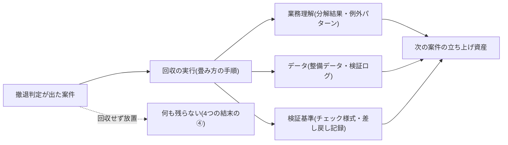
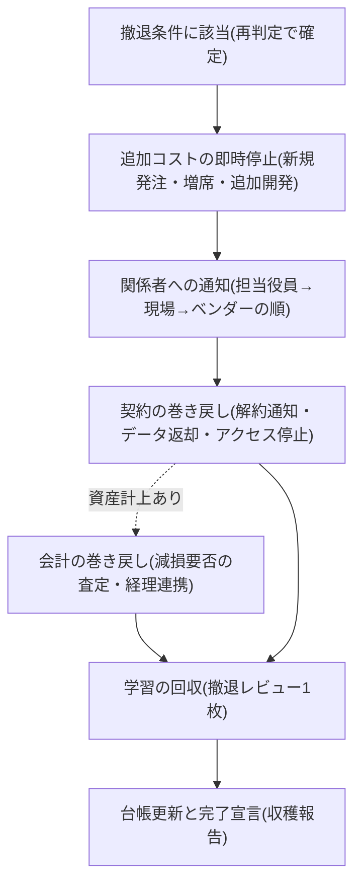

## 撤退はよくあることであり、回収すべき資産が3つある

走り出したAI案件の相当部分は、どの調査でも本番化の手前または運用の途中で止まる(数値はデータボックス参照)。つまり撤退は例外処理ではなく、AI投資ポートフォリオの通常運転である。調査の報道自身が注記する通り、中止には「失敗」だけでなくポートフォリオ運営上の健全な絞り込みが含まれる [src-2026-034]。問題は撤退することではなく、**何も回収せずに撤退すること**だ。

撤退時に回収すべき資産は3つ——**業務理解**(業務を分解して判明した手順と例外パターン)、**データ**(整備したデータ・運用ログ・検証ログ)、**検証基準**(出力の正否を判定する基準と差し戻しの記録)である。これは原理編「負債とスロップの分類学」が定める使い捨て構築の3条件のうち②「捨てても残る資産の分離」に挙がる3点と同一であり、本ページはそれを使い捨て構築に限らず**全案件の終了時の検収項目**として使う(新しい分類の新造ではない)。着手時に「捨てても残るもの」として分離した資産を、終了時に実際に回収する——撤退とはこの裏返しの実行である。

撤退判定が出た案件の分岐を図にすると次の通りである(回収するかどうかで結末が変わる)。



> 📊 **データボックス(2026-06時点)**
> - RANDの研究報告(2024年8月、AI/ML実務経験5年以上の65人への半構造化インタビュー)が引く推計では、80%超のAIプロジェクトが失敗し、これは非AIの企業ITプロジェクトの2倍にあたる(80%はRAND自身の実測値ではなく外部推計の引用)[src-2026-035]
> - 同じRANDの研究では、産業界回答者の84%が、経営リーダーシップの判断・期待に起因する失敗(誤った課題設定・AIへの過信・必要な時間の過小評価)をAIプロジェクト失敗の主因として挙げた [src-2026-035]
> - 報道によれば、S&P Global Market Intelligenceの調査(n=1,006、北米・欧州、2024年10〜11月実施)で「AIイニシアチブの大半を中止した」企業は42%(前年17%)。平均的な組織はPoCの約46%を本番化前に打ち切っている。中止の主因はコスト・データプライバシー・セキュリティリスク [src-2026-034]
> - Gartnerは2024年7月、生成AIプロジェクトの少なくとも30%が、低品質データ・不十分なリスク統制・コスト膨張・不明確なビジネス価値により2025年末までにPoC後に放棄されると予測(予測値であり実測ではない)[src-2026-033]
> - 報道によれば、MIT NANDAの報告書(2025年8月)は企業の生成AIパイロットの約95%が測定可能なP&L効果を出せていないとした(「失敗」の定義は財務効果の未達であり、中止・撤退とは異なる。方法論の限界は原理編「負債とスロップの分類学」の囲み参照)[src-2026-031]
> - 各数値は「失敗」「中止」の定義・対象・方法が異なり、単独では使わず「中止・価値未達は高頻度で起きる」という幅として読む

## 撤退の判定基準は既存の仕組みをそのまま使う

本ページは撤退の判定基準を定義しない。判定の基準と運用はすでに次の2ページで説明されている。

- **施策1件の判定**: 原理編「負債とスロップの分類学」の判定フロー(Q1〜Q5)と4列台帳(施策名/出口/撤退条件/次回判定日)。撤退条件に触れた施策は次回を待たず即時再判定する、という運用も同ページで定めている
- **撤退条件と再判定日の統治**: ロードマップ編「投資判断の5択」の稟議追記欄。全調達経路で撤退条件(項目4)と次回再判定日(項目5)の記入を必須とし、空欄の申請は受理しない

本ページの開始点は、この仕組みが作動した瞬間——**再判定で「中止」「やらない」への変更、または使い捨て構築の「捨てる条件」への該当が確定した瞬間**——である。逆に言えば、台帳も撤退条件もない案件には本ページは適用できない。

## 撤退条件なしで走っている既存案件は、まず台帳に遡って登録する

現実には、読者の手元の案件の多くは撤退条件なしで走り出しており、本ページの手順が前提とする台帳・撤退条件・再判定日がそもそも存在しない。この場合の初手は撤退の判定ではなく**遡及台帳化**である。手順は3つ。

1. **全件の遡及登録**: 走っている案件を全件、4列台帳(様式は原理編「負債とスロップの分類学」にある。施策名/出口/撤退条件/次回判定日)に登録する(同ページの【今すぐ】と同一の作業)
2. **撤退条件・再判定日の遡及記入**: 起案時の稟議に遡って修正するのではなく、**現在の責任者が今の判断で**記入する——今日から統治を始めるのが目的である。記入した条件は稟議追記欄(ロードマップ編「投資判断の5択」が全調達経路で撤退条件・再判定日の記入を必須としている)の事後補完であり、次回の更新・増額申請時に正規の稟議様式へ載せ替える
3. **書けない案件の査定送り**: 「何が起きたらやめるか」に現在の責任者も答えられない案件は、それ自体を次回の経営会議で再判定(後述の凍結か収穫かの査定)にかける。遡及してもなお撤退条件が書けない案件こそ、最初に畳むべき候補である可能性が高い——これは出典のある知見ではなく、実務上の経験則である

## 判定から完了宣言までの5段の手順

判定確定から完了までの標準手順は次の5段である(投資を資産計上している案件は第3段の後に会計の巻き戻しが加わる)。



**第1段: 追加コストの即時停止。** 判定が出たら、解約交渉の完了を待たずに新規発注・ライセンス増席・追加開発をまず止める。撤退の総コストは「判定から完了までの期間 × 月次ランニング費用」で膨らむため、先に費用の流出を止め、手続きは後から追いかける。

**第2段: 関係者への通知(順序が重要)。** 通知は担当役員→現場→ベンダーの順に行う。この順序に出典はなく、実務上の経験則である。第一に**推進した担当役員**。報告の語法は次節で扱うが、要点は「役員が承認した撤退条件が機能した」という事実をそのまま使うことである。第二に**現場の担当者**。撤退条件どおりに畳んだ担当者を人事評価で減点しないことを、撤退の通知と同時に明示する。これを怠ると、次の案件から誰も撤退条件を正直に書かなくなり、台帳制度そのものが機能しなくなる。第三に**ベンダー**。社内の方針が固まる前にベンダーへ伝えると、解約阻止の働きかけ(値引き・機能追加の提案)が役員・現場に直接入り、判定が巻き戻されやすいからである。

**第3段: 契約の巻き戻し。** 使う道具は原理編「反脆弱性の原則」の可換性チェックリストである。契約時に同チェックリストの1〜3(出口条項・データ可搬性・解約条件)を通していれば、ここで効く——解約通知の期限、違約金の上限、データ返却の形式・費用・期間が契約書に書いてある。確認すべきは、①解約・更新拒否の通知期限(自動更新を1日過ぎると1年延びる契約は珍しくない)、②入力・出力・ログ・設定を含む全データのエクスポート、③アカウント・API・連携の停止(野良の残存接続を残さない)、の3点である。契約時にチェックリストを通していない案件は、データ返却が契約上保証されていない可能性がある。その場合は**解約通知の前に**データとログのエクスポートを完了させる——解約を告げた後では、データ返却の交渉に応じてもらいにくくなるからだ。この読みに出典はなく、交渉実務の経験則である。

**第3.5段: 会計の巻き戻し(資産計上がある場合)。** 開発費・導入費を無形固定資産(ソフトウェア・ソフトウェア仮勘定)に計上している案件の撤退は、契約の解約だけでは終わらない——利用中止の決定により減損損失の認識や除却の検討が必要になりうるし、金額次第で監査法人への説明・開示にも波及する。最小の備えは2つである(この2点に出典はなく、実務上の整理である)。①撤退判定の確定と同時に【CFO】経由で経理に連絡し、減損要否の査定ルートに乗せる(完了宣言の後に経理が知る、を起こさない)。②累計投資額のうち資産計上額と費用処理額を撤退レビュー(項目1)で切り分けて記録する。なお具体的な会計処理の判断は自社の会計方針と監査法人への確認によるべきもので、本段は論点の所在の指摘であり会計基準の解説ではない。

**第4段: 学習の回収。** 次節の撤退レビュー1枚を記入し、3資産の保管場所を確定させる。検証ログと差し戻し基準は、ツールが消えても次の案件・次のモデルでそのまま使える、撤退時に最も劣化しにくい資産である(原理編「複利の法則」の複利テストが言う「モデル交代後も残る価値」に対応)。

**第5段: 台帳更新と完了宣言。** 4列台帳の出口を更新し、撤退レビューを添えて部門長(高リスク案件は経営会議)に報告して完了とする。完了宣言のない撤退は、誰も止めていないゾンビ案件——誰も使っていないのにライセンス費と保守費だけが毎月引き落とされ、担当者に聞いても「止まっている」のか「続いている」のか答えが返ってこない案件——と外形上区別がつかない。

## 撤退レビュー1枚(終了時に30分で書ける様式)

案件の終了時に推進担当が記入し、部門長が確認する。様式の位置づけ: 項目2は稟議追記欄(ロードマップ編「投資判断の5択」)の撤退条件の転記、項目3は使い捨て3条件②の資産分離(原理編「負債とスロップの分類学」)の終了時検収、項目4は可換性チェックリスト(原理編「反脆弱性の原則」)の出口側の消し込みであり、いずれも既存フレームの終了時への展開である(新フレームの新造ではない)。

```
【撤退レビュー(案件終了時に1枚)】
1. 案件名 / 5択の出口(変更前→変更後) / 累計投資額(概算): ______
   うち資産計上額(無形固定資産・仮勘定): ______ / 費用処理額: ______
   ※資産計上があれば経理へ減損要否の査定を依頼済か: □依頼済(__月__日)
2. 触れた撤退条件(稟議追記欄4の記載を転記): ______
   ※事前に書いた条件と異なる理由で畳む場合、その理由: ______
3. 回収する3資産の保管場所(「なし」も可。ただし3つともなしなら
   その旨を部門長に報告——それは回収ではなく単なる中止である):
   ・業務理解(業務分解の結果・例外パターンの文書): ______
   ・データ(整備データ・運用ログ・検証ログのエクスポート先): ______
   ・検証基準(チェック様式・差し戻し基準と判定記録): ______
4. 巻き戻しの消し込み:
   □解約・更新拒否を通知済(通知期限: __月__日) □データ返却完了
   □アクセス権・API・連携の停止 □残存費用ゼロの確認(最終請求月: __月)
5. 再挑戦の条件: 何が変われば再判定にかけるか
   (□能力向上 □価格低下 □データ整備の完了 □再挑戦しない)+再判定の時期: ______
6. 次の起案者への申し送り(1行): ______
記入: 推進担当 / 確認: 部門長(高リスク案件は経営会議に報告)
```

## 推進した役員の面子を立てる言葉の選び方

撤退の最大の障害は技術でも契約でもなく、推進した役員の面子であることが多い。この節の提案に直接の出典はないが、間接的な裏付けはある。RANDの研究では、産業界回答者の大半がAIプロジェクト失敗の主因として経営リーダーシップ側の要因(課題の誤設定・過大な期待・時間の過小評価)を挙げた(数値はデータボックス参照)[src-2026-035]。失敗の主因が経営側にあるなら、撤退を現場担当者個人の失敗として処理するのは事実に反する上、以後の正直な報告を止める。同様に、撤退を役員個人の敗北として演出すれば、役員は撤退条件への該当を認めなくなる。

そこで語彙を設計する。使う言葉は2つで足りる。

- **「凍結」** — 再開可能性を残す撤退。実体は5択の「待つ」への移行であり、ロードマップ編「投資判断の5択」の運用に従い**再判定日のない凍結は認めない**(日付のない凍結は放棄と同じだと同ページが定めている)。「中止ではなく、能力・価格の前提が変わるまで凍結し、〇月に再判定する」という報告は、役員の判断の連続性を保ったまま実質的な撤退を成立させる
- **「収穫」** — 再開を前提としない撤退。「この案件は終了し、業務理解・データ・検証基準を収穫して次の案件に引き継ぐ」と報告する。撤退レビューの項目3が埋まっていれば、これは言い換えではなく事実の記述である

そして報告の主語を設計する。「〇〇案件は失敗した」ではなく「**着手時に役員会が承認した撤退条件が、設計どおり作動した**」と報告する。撤退条件を事前に書かせる制度の存在価値はここにある——条件どおりの撤退は、推進した役員にとってガバナンスの成功実績であり、隠す理由がなくなる。逆に言えば、この語彙設計は撤退条件の事前定義とセットでのみ機能する。条件なしの案件を後から「収穫」と呼ぶのは、ただの粉飾である。

ただし「凍結」は2語のうち濫用されやすい方である。全撤退が凍結に逃げれば、台帳には再判定日だけが更新され続けるゾンビ案件がたまっていく。歯止めは1つで足りる——**再判定日の延長は1回まで。2回目の延長申請は受理せず、自動的に収穫(終了)の査定に回す**。この運用ルールに出典はなく、実務上の経験則である。また、推進役員が再判定そのものを握りつぶす場合への備えは取締役会の監督ラインにある。組織・人材編「取締役会の監督義務」のアジェンダ報告事項4(投資の状況=5択区分別の件数・「捨てる条件」の発動実績を半期ごとに取締役会へ報告)により、凍結の滞留や発動実績ゼロの不自然さは、台帳の分布として役員個人の意向と無関係に可視化される。

なお「凍結」「収穫」は報告の語法であって、台帳上の出口(5択)の別名ではない。台帳には「待つ(再判定日付き)」「やらない/終了」という台帳本来の語彙で記録し、二重帳簿を作らない。

報告の完成形を1段落で示す(条件・数値・資産名は記入例であり、自社の撤退レビューの記載で置き換える)。

```
【収穫報告の文例(経営会議・報告事項として3分)】
「〇〇案件は、着手時に承認いただいた撤退条件『検証後の修正率が2四半期連続で
4割を超えたら中止』に該当したため、稟議のとおり終了します。累計投資額は概算
〇〇万円、うち資産計上額〇〇万円は経理にて減損要否を査定中です。回収資産は
3点——△△業務の分解結果(手順書と例外パターン一覧)、検証ログ一式のエクス
ポート、差し戻し基準1式——で、保管場所は撤退レビューに記載のとおりです。
再挑戦の条件は□□の能力向上で、20XX年〇月に台帳で再判定します。本件は、
承認いただいた撤退条件が設計どおり作動したことの報告であり、審議事項では
ありません。」
```

## 一部だけを畳む撤退のミニケース

撤退判定は案件全体の生死だけでなく、「何を畳み、何を残すか」の切り分けでもある。決済企業Klarnaは、AIアシスタントの成果を公表して人員を削減したが、報道によれば2025年5月、CEO自身が「コストを重視しすぎた結果、品質の低下を招いた」と認めて人間のエージェント採用を再開し、AIから人間への引き継ぎを備えたハイブリッド体制に移行した。一方でAI導入自体の効果(応答時間短縮・リピート問い合わせ減)は維持されており、撤回されたのは「人間を置き換える」という運用方針の方である [src-2026-071]。

これは部分撤退の切り分けをそのまま示す例として読める。畳んだのは方針(人間の排除)であり、残したのは資産(対応フロー・エスカレーション設計・運用データ)である。撤退レビューの項目3が機能していれば、全面中止か全面継続かの二択を迫られる前に、この中間解を設計できる(事例の詳細は部門別ガイド「カスタマーサポートのAIDX」参照)。

## 撤退にかかる工数と止まる費用の目安

以下の目安に出典はなく、実務上の経験則である。自社の契約構成に合わせて調整する叩き台として使う。

- **中堅(数百名)**: 単一部門・単一契約の案件なら、判定から完了宣言まで**1〜2カ月**。体制は推進担当の兼務(実働2〜5人日)+部門長のレビュー半日。撤退レビューは30分〜半日で書ける粒度を守る(重い様式は書かれない)
- **大企業(数千〜数万名)**: 複数部門・複数契約に跨る案件は、解約通知期限とデータ移行が律速になり**3〜6カ月**。中央の推進組織が巻き戻しの消し込みを一元管理し、実働は専任換算0.5〜1人/案件
- **効果側(止まる費用)**: 撤退の直接効果はゾンビ案件のランニング費用の停止である。ライセンス・保守・兼務工数を含め月額数十万〜数百万円規模の案件が多く、判定の先送り1年は**数百万〜数千万円の追加流出**に相当する(中堅で案件単位の数百万円、大企業で複数案件を束ねれば年間数千万円規模)。加えて、回収した検証基準・業務分解の再利用は次案件の立ち上げ工数を下げる——回収資産が次の起案で参照された件数を、推進組織の成果指標にしてよい

## 今日からやること

- 【推進担当】(今すぐ)4列台帳を点検し、「撤退条件に触れているのに走り続けている案件」「撤退条件・再判定日が空欄の案件」を抽出する。道具: 原理編「負債とスロップの分類学」の4列台帳。完了条件: 該当案件ゼロ、または全件に再判定の日程が入ること
- 【部門長】(今すぐ)直近で終了・縮小した案件1件に撤退レビュー様式を遡及適用してみる。道具: 本ページの撤退レビュー1枚。完了条件: 3資産の保管場所欄が埋まるか、「3つともなし(=何も残らなかった)」が文書として確認されること
- 【CHRO】(今すぐ)撤退条件どおりに案件を畳んだ担当者を評価で減点しない旨を、評価ガイドラインに1行明記する。道具: 評価ガイドラインへの追記と推進担当への周知文。完了条件: 次の評価サイクルの評価者向け資料に記載されること
- 【CFO】(今すぐ)撤退判定が出た案件について、無形固定資産・仮勘定への計上の有無を経理に確認させ、計上があれば減損要否の査定ルートに乗せる。道具: 撤退レビュー項目1の資産計上額欄+固定資産台帳。完了条件: 完了宣言までに減損要否の査定結果(監査法人への説明要否を含む)が文書で残ること
- 【CFO】(1年以内)AI案件のランニング費用(ライセンス・保守・クラウド利用料)を案件単位で月次把握できる勘定の切り方にする。道具: 費用科目・タグの整理。完了条件: 撤退完了宣言の翌月に当該案件の費用がゼロになったことを月次で確認できること
- 【経営】(1年以内)経営会議の定例議題に「収穫報告」(完了した撤退レビューの回覧)を加え、条件どおりの撤退を承認事項ではなく報告事項として処理する。完了条件: 撤退が四半期に1件も報告されない状態が続いたら、撤退がないのではなく報告が止まっていると疑い、台帳監査を指示すること
- 【経営】(待て)撤退の社外公表(プレスリリース等)の標準化。社内の語彙設計と台帳運用が回るまでは、社外向けの説明様式まで作り込まない。再開条件: 撤退レビューの運用が2四半期続くこと

**この主張が崩れる条件**: 撤退レビューで回収した資産(業務理解・データ・検証基準)が、その後の新規案件の起案で4四半期連続で一度も参照・再利用されないなら、自社において「撤退は資産の回収」は成立しておらず、本ページの手順は儀式である——回収する資産の粒度か保管場所の設計を見直す。また、撤退条件を事前定義した案件群と定義しなかった案件群とで、中止時の回収資産・再着手の速度に差がないことを示す追跡調査が出た場合、事前定義を前提とする本ページの骨格は崩れる。

(関連: 原理編「負債とスロップの分類学」=5択判定フロー・4列台帳・使い捨て3条件を定義/ロードマップ編「投資判断の5択」=撤退条件・再判定日・稟議追記欄を定義/原理編「反脆弱性の原則」=契約巻き戻しに使う可換性チェックリストを定義/原理編「複利の法則」=回収資産の複利テスト/部門別ガイド「カスタマーサポートのAIDX」=Klarna事例の詳細/アンチパターン集「PoC煉獄」=撤退判定なき案件増殖の失敗形)

<!--
執筆メモ(2026-06-11 新規作成 / 同日batch5レビュー反映で改稿):
- 「撤退=3資産の回収」の3資産は debt-slop-taxonomy の使い捨て3条件②(データ・業務理解・検証基準)と同一であることを本文に明記し、新分類の新造を回避した。撤退レビュー様式は08-framework-registry.mdの実行素材表に登録済み(batch5改稿で項目1に資産計上額・費用処理額欄を追加、台帳側にも追記済み)。
- 判定基準は一切再定義していない(debt-slop-taxonomy=5択フロー・4列台帳・即時再判定、investment-decision=撤退条件・再判定日が正本)。本ページの守備範囲は「判定確定後の手順」のみ。遡及台帳化の小節も判定基準を作らず正本2ページへの導線のみ。
- 政治の節(通知の順序・語彙設計・報告の主語)は全面的に編集部の見立て。間接的裏付けはRANDの「失敗の主因は経営リーダーシップ側」[src-2026-035]のみ。【batch5必須修正1の訂正】初稿の本メモは「84%は本文に直書きせず」と申告していたが実際は本文に直書きされていた(虚偽申告)。batch5指摘を受け、本文は「大半」(7〜9割の変換基準どおり)+データボックス参照に修正し、84%はデータボックスへ隔離した。
- 【batch5必須修正2】Gartner 30%の出典を報道経由のsrc-2026-102(medium)からGartner公式プレスリリースのsrc-2026-033(high・一次)へ差し替え、「報道によれば」を外した(予測値であり実測ではない注記は維持)。これによりdebt-slop-taxonomyと同一ソースIDになった。
- 「凍結=待つ+再判定日必須」は investment-decision の「日付のない凍結は放棄と同じ」と整合させた(矛盾しないことを本文で明示)。batch5指摘3で「再判定日の延長は1回まで・2回目は自動的に収穫査定」の歯止めを追加——これは編集部の見立て(出典なし)の運用ルールで、board-oversightアジェンダ報告事項4(台帳分布の半期報告)への接続も同指摘による。
- 第3.5段(会計の巻き戻し: 減損・監査法人説明)はbatch5指摘4で追加。会計処理の記述は編集部の見立てで、論点の所在の指摘に留め会計基準の解説をしない旨を本文に明記した。公認会計士・CFO経験者の専門レビュー要否はbatch5要判断7(人間判断待ち)。
- 収穫報告の文例(batch5指摘6)内の条件・数値は記入例であり、データ・出典ではない(文例の前文に明記)。
- データボックス: RAND 80%は「RAND自身の実測ではなく外部推計の引用」(jp_note指示)を明記。S&P・MITは報道経由mediumのため「報道によれば」を付し、定義が異なるため「幅として読む」注記を置いた。結論のテーゼ(中止は高頻度)はhigh 2源+medium 2源の束で支えており、medium単源依存はない。
- 【2026-06-12監査で統合】当初引いていたsrc-2026-100/101/103は、それぞれsrc-2026-035(RAND同一報告書)・src-2026-034(CIO Dive同一記事)・src-2026-031(Fortune同一記事)とURL重複のため、正本ID(035/034/031)へ差し替えた。数値が両ページで一致していることは確認済み(42%/46%/30%)。
- Klarnaは customer-support ページの既出事例の参照+部分撤退という本ページ固有の切り口のみ。CEO発言は「報道によれば」帰属。
- 規模感(1〜2カ月/3〜6カ月、止血額の月額数十万〜数百万円・年間数百万〜数千万円)は全面的に見立てで出典なし(本文明記済み)。人間レビューで妥当性確認を。
- 「解約を告げた瞬間に返却交渉力が最も弱くなる」「ベンダー通知を最後にする」は交渉実務の見立てで出典なし。マーカー付与済み。【/aidx-research起案(batch5指摘6)】契約実務文献・IPAのベンダーロックイン関連資料(クラウドサービス利用の解約・データ可搬性のガイダンス等)を収集し、交渉実務の見立て(通知順序・解約前エクスポート)の裏付けまたは修正を行うこと——現状この見立て群は0源。
2026-06-12 文体改修: 格言調見出し平易化・内部用語排除・見立て定型句を自然文に置換
-->
