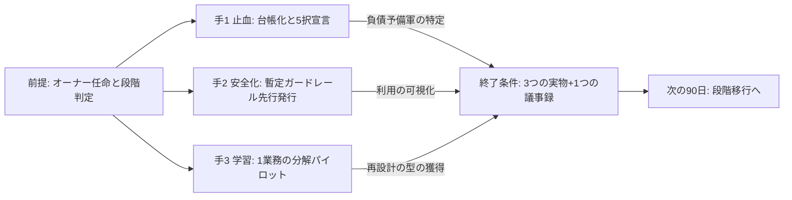
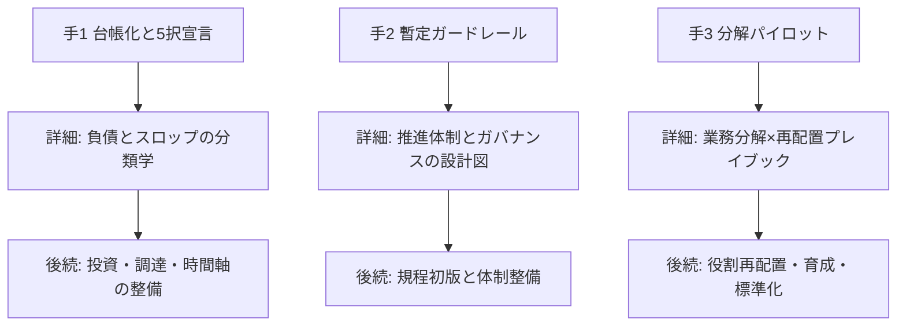

## 最初の90日でやることは3つに絞る

AIDXの初動でやるべきことは、3手に絞られる。

1. **AI施策の台帳化と5択宣言** — 進行中・計画中の全施策を一覧化し、1件ずつ「本格投資・使い捨て構築・実験・待つ・やらない」のどれかを宣言する。判定フローと台帳様式は原理編「負債とスロップの分類学」にある
2. **暫定ガードレールの先行発行** — 匿名の利用実態調査とあわせて、入力可否・検証義務・相談先の3点だけの1枚文書を規程完成より先に出す。構成と工程は組織・人材編「推進体制とガバナンスの設計図」で説明している
3. **1業務の分解パイロット** — 対象業務を1つ選び、分解→再配置→再構築の型を小さく一周する。手順とワークシートは組織・人材編「業務分解×再配置プレイブック」にある

3手に共通する前提が2つある。**推進オーナーの任命**(任命手順と経営報告1枚様式はAI-Ready編「AI-Ready自己診断」を参照)と、**自社の段階判定**(AI-Ready編「成熟度モデル」の速見表)である。つまり90日の実負荷は正確には「3手」ではなく「前提2つ+3手」であり、W1はまず前提づくりに充てる。オーナー不在のまま3手を始めると、台帳もガードレールも持ち主のない文書になる。

本ページは新しい判定基準・段階モデル・様式を一切作らない。本サイトの13ページが出している「今すぐ」アクション約30個(2026-06-11再集計で27個。ページ別件数は対応マップ末尾に付記)を、この3手とその後続に束ね、90日の週次に割り付けるのが本ページの全機能である。束ね方と週次割付に出典はなく、実務上の整理である。3手以外のアクションは「やらなくてよい」のではなく、3手の成果物——台帳・ガードレール・分解済み1業務——を入力として初めて意味を持つ後続である。

3手の並走と、90日の出口の関係を図にすると次の通りである(順序は論理的な優先順位であり、実行は初週から並走する)。

## この3手を選んだ理由と順序

3手の選定と順序に出典はなく、実務上の判断である。論理は次の通りである。

**第1手は止血である。** AI施策は放置すると資産ではなく負債・スロップ・「何も残らない」へ流れる。アナリストは生成AIプロジェクトの相当部分がPoC後に放棄されると事前に予測しており、主因として不明確なビジネス価値・低品質データ・リスク統制の不備を挙げた [src-2026-033]。撤退条件を言えない施策は負債予備軍であり、その数を数えることが初動の第一歩になる。新しい施策を足す前に、いま走っているものの出口を宣言する——これが止血である(放置した場合の典型的な結末はアンチパターン集「PoC煉獄」を参照)。

**第2手は安全化である。** 未承認のAI利用はすでに存在する——たとえば担当者が個人のスマートフォンで生成AIに顧客名入りの問い合わせ文を貼り付け、返信の下書きを作る。この利用は会社のログにいっさい残らない。この前提に立つと、規程の完成を利用解禁の条件にする工程は、完成までの期間まるごとシャドーAIを放置する工程と同義になる。だから順序は逆で、入力可否・検証義務・相談先の3点だけの暫定ガードレールを先に発行し、利用を可視化された場所へ呼び戻す(工程の詳細とテンプレは組織・人材編「推進体制とガバナンスの設計図」を参照)。

**第3手は学習である。** 財務インパクトはパイロットの本数ではなく、業務フロー本体への組み込みから生まれる(関連: AI-Ready編「成熟度モデル」)。だから90日の目的はパイロットを増やすことではなく、分解→再配置→再構築という再設計の型を1業務で一周し、組織として習得することにある。1業務でよい。型のないパイロットを10本走らせるより、型を一周した1業務を持つ方が、次の90日は速く進む——この判断に出典はなく、実務上の経験則である。

### 推進オーナーの任命を支持する日本の調査

前提に置いた「推進オーナーの任命」を支持する観察が日本の調査にある。報道によれば、PwC Japanの5か国比較調査では、日本企業は推進度こそ平均的だが効果創出で他国に劣後しており、効果を出す企業には目的意識・推進体制(社長直轄・CAIO配置)・業務プロセスへの組み込みという共通項が観察された [src-2026-048]。ただしいずれも実施企業側の比率のみで非実施群の比較値は報道になく、これらを効果の「要因」と断定する根拠にはならない。また肩書の新設自体が本質でもない——米国の調査では、CAIOを置く企業でもその過半は既存役職への兼務である [src-2026-026]。それでも、90日プランの承認者と持ち主を最初に決めることは、効果の要因とまでは断定できなくても損のない初手だと考えられる。

> 📊 **データボックス(2026-06時点)**
> - 報道によれば、生成AIで「期待を大きく上回る効果」を得た日本企業は10%にとどまり、米国は45%(PwC Japan「生成AIに関する実態調査2025春」5か国比較、2025年6月発表)[src-2026-048]
> - 報道によれば同調査で、推進体制が社長直轄の企業は61%、CAIO(チーフAIオフィサー)配置企業は60%、生成AIを業務プロセスに正式に組み込んでいる企業は72%が期待以上の効果を達成(いずれも実施企業側の比率のみで非実施群の比較値は報道になく、要因と断定する根拠にはならない)[src-2026-048]
> - CAIOは米国大企業の60%に存在するが、その過半は既存役職への兼務(Wharton/GBK調査、2025年10月。従業員1,000人超・売上5,000万ドル超の米国企業のシニアリーダー約800人)[src-2026-026]
> - Gartnerは2024年7月、生成AIプロジェクトの少なくとも30%が低品質データ・不十分なリスク統制・コスト膨張・不明確なビジネス価値により2025年末までにPoC後に放棄されると予測 [src-2026-033]

### 多くの企業ではAIはすでに使われており、そこが出発点になる

日本の大企業に限れば、生成AIの導入自体はほぼ飽和し、人員の配置転換に踏み込む企業も現れている [src-2026-050]。つまり多くの読者にとって90日の出発点は「導入するかどうかの検討」ではなく、「すでに使われ、すでに施策が走っている状態をどう統治し、どう再設計に向けるか」である。3手がいずれも「新規導入」ではなく「棚卸し・可視化・型の習得」から始まるのはこのためである。

> 📊 **データボックス(2026-06時点)**
> - 生成AIを「全社的に導入」47.0%(前年26.4%)、部分導入を含む導入済み95.6%。「ほぼ全社員が利用」は18.5%、人材の配置転換を行っている企業は約4割(デロイト トーマツ、2025年7月調査、プライム上場・売上1,000億円以上の部長クラス以上700名)[src-2026-050]
> - (母集団が大企業の部長以上に限定されている点に注意。中堅・中小の実態とは乖離がある)

## 3手の手順ページと後続アクションの対応マップ

各ページの「今すぐ」アクションは、次の通り3手の本体または後続に束ねられる。束ね方に出典はなく、実務上の整理である。各アクションの定義・道具・完了条件は各手順ページの記述に従う。

| 手 | 手順を説明しているページ | 90日内の本体アクション | 90日後に続く主な後続アクション(参照先) |
|---|---|---|---|
| 手1 止血 | 原理編「負債とスロップの分類学」 | 施策の一覧化・5択宣言・4列台帳(同ページ) | 複利テストによる資産/消耗品/負債の3分類(原理編「複利の法則」)/外部依存の台帳化・稟議チェックリスト(原理編「反脆弱性の原則」)/稟議追記欄・調達経路の設計(ロードマップ編「投資判断の5択」)/3年逆算と見送り案件の再判定日(原理編「時間軸の考え方」) |
| 手2 安全化 | 組織・人材編「推進体制とガバナンスの設計図」 | 匿名利用実態調査・暫定ガードレール発行(同ページ) | 規程初版の起草・部門推進担当の任命(同ページ)/送り手検証ルールの明文化(原理編「負債とスロップの分類学」)/職位別利用率の測定(組織・人材編「新人が育たない問題」) |
| 手3 学習 | 組織・人材編「業務分解×再配置プレイブック」 | 1業務の分解・「AI委任・今すぐ」タスクの移行と計測(同ページ) | 検証者の任命・職務定義書の改訂(組織・人材編「実行者から検証者・設計者へ」)/訓練価値の点検(組織・人材編「新人が育たない問題」)/手順・プロンプトの標準化(原理編「複利の法則」)/判定3テストでの業務棚卸し(原理編「AIDXの定義」)/5資産の整備(AI-Ready編「AI-Readyの5資産」「AI-Ready自己診断」) |

冒頭の「約30個」のページ別件数(2026-06-11再集計。サイト内部の集計値であり、ページ追加・改稿時に再集計する=監査対象): 原理編5ページ10個(「負債とスロップの分類学」2・「複利の法則」2・「反脆弱性の原則」2・「時間軸の考え方」2・「AIDXの定義」2)、AI-Ready編3ページ6個(「AI-Readyの5資産」2・「AI-Ready自己診断」2・「成熟度モデル」2)、組織・人材編4ページ8個(「推進体制とガバナンスの設計図」2・「業務分解×再配置プレイブック」2・「実行者から検証者・設計者へ」2・「新人が育たない問題」2)、ロードマップ編1ページ3個(「投資判断の5択」3)——計13ページ27個。

3手とその手順ページ・後続の構造を図にすると次の通りである。

なお、AI-Ready編「成熟度モデル」に載っている「段階別『次の90日』表」は**段階移行**の断面(いまの段階から次の段階へ渡るための90日)であり、本ページは**初動の統合**の断面(13ページのアクションをどの順で始めるか)である。別物の90日プランを作らないため、段階の判定と段階別の力点は同ページに従い、本ページは次節の入口調整でそれに接続する。

## 週次プラン表(そのまま使える)

3手を90日の週次に割り付ける。割付に出典はなく、実務上の整理である。各セルの道具・完了条件は各手順ページの該当アクションを参照。前提として、W1で【経営】が推進オーナーを任命し、AI-Ready編「成熟度モデル」の速見表で自社の段階を判定しておく。

| 週 | 手1 止血: 台帳化と5択宣言 | 手2 安全化: 暫定ガードレール | 手3 学習: 分解パイロット |
|---|---|---|---|
| W1-2 | 【推進担当】進行中・計画中の施策を一覧化(4列台帳に着手) | 【推進担当】匿名利用実態調査を配信(設問例3問・処罰しない旨を明記) | 【経営】【部門長】対象業務を1つ選定し、現場ヒアリングを設定 |
| W3-4 | 【推進担当】【部門長】全施策を判定フローにかけ、5択の出口を宣言・部門長承認 | 【経営】暫定ガードレール(入力可否・検証義務・相談先の1枚)を発行し、承認済み利用環境を最低1つ提供 | 【部門長】【推進担当】ワークシートで分解し、全タスクに4分類・再配置・検証者を記入 |
| W5-8 | 【経営】台帳を経営会議で確認し、撤退条件を言えない施策の扱い(再判定か中止)を決める | 【推進担当】調査結果を経営会議に報告し、規程初版の起草に着手 | 【推進担当】【現場担当】「AI委任・今すぐ」のタスクから移行し、処理時間・差し戻し率を計測 |
| W9-12 | 【推進担当】全施策に次回判定日を入れ、四半期再判定を定例化 | 【部門長】検証義務化ラインと差し戻しルールを自部門に周知 | 【部門長】パイロット結果(計測値・判定者間一致)を経営会議に報告し、次の対象業務を選定 |

運用ルールは2つ。①3手は直列にしない。W1-2で3手とも着手し、止まった手があれば週次でオーナーに上げる。②各セルの完了条件を満たさないまま次の週次に進む場合は、理由を台帳または議事録に残す(黙ってスキップした項目は90日後に存在ごと忘れられる)。

## 自社の段階別の入口調整

段階の判定にはAI-Ready編「成熟度モデル」の速見表を使う。判定結果に応じて、3手の力点を次のように調整する。この調整に出典はなく、実務上の経験則である。

- **実験期に達していない(利用ルールも経営の議題もない)**: 手2を最初に置く。ガードレールと相談先がないと、利用実態調査にも正直な回答が集まらない。手1は対象施策が少ないため数日で終わる。手3は最小構成(タスク10件程度の小さな業務)で型の習得に徹する
- **実験期〜パイロット期(パイロットがすでに乱立している)**: 手1を最優先かつ最厚にする。新規パイロットの追加を原則凍結し、全件を5択フローにかけて昇格・中止を宣言する(脱出手順の詳細はアンチパターン集「PoC煉獄」)。手3は新規に立てず、生き残ったパイロットから1件選んで分解をやり直す
- **組み込み期以降**: 本ページの3手は本来済んでいるはずである。3つの実物(台帳・ガードレール・分解済み業務)のうち欠けているものを埋める点検として使い、90日の主題は同「成熟度モデル」の段階別表(共通化・横展開・再配置)に移す

### 3手が詰まったときの縮小プラン

いずれも出典のない実務上の打ち手である。

- **経営が動かず、オーナー任命が出ない**: 全社版を待たず、部門限定の暫定ガードレール+自部門分の施策台帳で先行する。実物を持って上申する方が任命は早い(上申の道具は「今日からやること」第1項)
- **大企業で決裁が3手に追いつかない**: 稟議リードタイムを織り込み、ガードレール発行・台帳承認のW3-4目標をW6目安に置き直すのが現実線である。遅らせてよいのは決裁であって着手ではない——W1-2の一覧化・調査配信は決裁前に始められる

## 90日の終了条件と、よくある脱線

### 終了条件は3つの実物と1つの議事録

次が揃っていれば、90日は成功である。逆に言えば、これ以外(ツールの選定数、パイロットの本数、研修の受講率)は90日の成功指標にしない。まず3つの実物。

1. **施策台帳**: 全施策に5択の出口・撤退条件・次回判定日が入り、部門長承認済み
2. **暫定ガードレール**: 1枚文書が全社周知され、承認済み利用環境が最低1つあり、利用実態が経営会議に報告済み
3. **分解済み1業務**: ワークシートが現場レビューを通り、移行したタスクの移行前後の計測値が存在する

これに加えて**1つの議事録**——推進オーナーの氏名と、次の90日の着手項目(段階別表に基づく)が経営会議の議事録に残っていること。

この「3つの実物+1つの議事録」が揃ったら、次のフェーズは規程初版の起草・調達ゲートの整備・役割再配置の設計に移る(前掲の対応マップの「後続」列)。なお全社基盤や本格投資の解禁判定は本ページの守備範囲外であり、AI-Ready編「AI-Ready自己診断」の投資ゲートで行う。

### よくある脱線4つ

- **ツール選定から入る** — 3手のどれよりも先にベンダー比較を始める。データと業務の整備を飛ばした自動化の典型的な入口である(アンチパターン集「データなき自動化」)
- **規程完成まで全面禁止** — 手2の倒錯。整備には時間がかかる以上、完成待ちはシャドーAIの放置と同義になる(詳しくは組織・人材編「推進体制とガバナンスの設計図」)
- **パイロットの追加で90日を埋める** — 手1の判定から逃げ、出口宣言の代わりに新規案件を立てる。本数は増えるが実物は何も残らない(アンチパターン集「PoC煉獄」)
- **90日以内に大型投資を決めようとする** — 3手は投資判断の材料を揃える工程であり、判断そのものではない。解禁の判定は投資ゲート(AI-Ready編「AI-Ready自己診断」)を通す

## 体制と費用の目安

出典のある標準はない。以下は関連ページの目安と桁を揃えた実務上の経験則であり、桁が揃っていること自体は検証ではない。

- **中堅(数百名規模)**: 推進担当は専任1名+兼務3〜5名(法務・情報システム・対象部門)。外部支出はほぼゼロ〜数百万円(承認済み利用環境のライセンス程度)で、既存予算内に収まる。決裁は、ガードレール発行と台帳の確認が経営会議、パイロットは部門長決裁で足りる
- **大企業(数千〜数万名規模)**: 専任2〜3名+CoE側の兼務5名規模+対象部門の兼務3〜5名。外部支出は数百万〜数千万円(利用環境・利用実態調査・パイロット支援)。決裁は、ガードレールと台帳が経営会議、パイロットは事業部長〜担当役員。複数事業会社のグループでは、90日はまず1事業会社で完結させ、グループ展開は型の獲得後に行う

外部支出の内訳の置き方(出典のない目安): 本体は「承認済み利用環境のライセンス単価×対象人数×3か月」でまず見積もる。大企業ではこれに利用実態調査の設計支援・分解パイロットの伴走委託が加わり、ライセンス費と同規模になりうる。

どちらのレンジでも、90日で「全社一斉」をやらないことが共通の制約である。台帳は全社、ガードレールは全社、しかし分解パイロットは1業務——広げるのは型を持ってからである。

## 今日からやること

- 【今すぐ】【推進担当】【経営】推進オーナーの任命を上申し、決定する。道具: 上申1枚はAI-Ready編「AI-Ready自己診断」の経営報告1枚様式を流用し、進行中の施策数・利用実態の想定・3手と終了条件を記入して経営会議に出す。決定後、本ページの週次プラン表を3手の担当付きで承認する。完了条件: オーナー氏名と3手それぞれの担当・週次レビューの日程が経営会議の議事録に残る
- 【今すぐ】【推進担当】手1に着手し、進行中・計画中の施策を一覧化する。道具: 原理編「負債とスロップの分類学」の判定フローと4列台帳。完了条件: W4までに全施策の出口宣言が部門長承認を得ている
- 【今すぐ】【経営】【推進担当】手2に着手し、匿名利用実態調査の配信と暫定ガードレールの発行を行う。道具: 組織・人材編「推進体制とガバナンスの設計図」の設問例3問と骨子テンプレ第3・4章+相談先。完了条件: W4までに1枚文書が全社周知され、承認済み利用環境が最低1つ提供される
- 【今すぐ】【部門長】【推進担当】手3に着手し、対象業務1つを選んで分解する。道具: 組織・人材編「業務分解×再配置プレイブック」のワークシート。完了条件: W12までに移行タスクの移行前後の計測値(処理時間・差し戻し率)が存在する
- 【1年以内】【推進担当】【CFO】後続アクション(規程初版・稟議追記欄・依存台帳・役割再配置)を対応マップの参照先に従って展開する。完了条件: 対応マップの後続列の各項目に着手時期が割り当てられている
- 【能力向上を待て】【経営】90日以内の全社共通基盤・本格投資の意思決定。3手の成果物が揃い、投資ゲート(AI-Ready編「AI-Ready自己診断」)が解禁水準に達するまで承認しない

**この主張が崩れる条件**: 台帳化・ガードレール・分解パイロットを経ずにツールの一斉導入から始めた企業群が、3手から始めた企業群と同等以上の定着・財務成果を示すことが複数の独立した調査で確認されたとき、「初動は止血→安全化→学習の3手」という本ページの骨格は崩れる。

(関連: 原理編「負債とスロップの分類学」=手1の手順を定義/組織・人材編「推進体制とガバナンスの設計図」=手2の手順を定義/組織・人材編「業務分解×再配置プレイブック」=手3の手順を定義/AI-Ready編「成熟度モデル」=段階判定と段階別90日を定義/AI-Ready編「AI-Ready自己診断」=投資ゲートとオーナー任命を定義/組織・人材編「抵抗と定着」=手3で現場が動かないときの抵抗診断と説明会素材/ロードマップ編「経営計画への翻訳」=90日の先、中計・予算・取締役会決議への接続)

<!--
執筆メモ(レビュー重点ポイント):
1. 本ページの中核(3手の選定・止血→安全化→学習の順序論・週次割付・終了条件4点・段階別入口調整・規模感)はすべて編集部の見立てであり出典はない(本文に明記済み)。ページの価値は新規性ではなく既存13ページの統合にある、という位置づけを本文冒頭で宣言した。
2. 単一情報源ルールの対応: 5択・4列台帳(debt-slop-taxonomy)、暫定ガードレール構成(governance-structure)、分解3手順・ワークシート(work-redesign)、段階判定・段階別90日表(maturity-model)、投資ゲート・オーナー任命(self-assessment)はいずれも再定義せず参照のみ。本ページ独自の様式は週次プラン表と対応マップの2つで、どちらも既存アクションの配列であり判定基準を含まない。「最初の90日の3手」はフレーム台帳に登録した(既存3フレームの束ねである旨を台帳と本文の両方に明記)。
3. src-2026-048はreliability: mediumのため「報道によれば」帰属+データボックス隔離。2026-06-11 batch3指示1・2で「相関」表記を全削除し、one-three-year / copilot-scatter と同一の注記(実施企業側の比率のみ・非実施群の比較値なし・要因と断定する根拠にならない)に統一、「専任責任者」を出典通り「CAIO配置」へ修正、CAIOの過半兼務はsrc-2026-026(high)で補足した。同指示6によりAnthropicガイド整合の段落(src-2026-010)は順序論の根拠から外して削除し、sourcesからも除いた(順序論は見立てとして自立)。
4. 約30個という「今すぐ」アクションの数はサイト内部の集計(2026-06-11再集計: 13ページ・27個。ページ別件数は対応マップ末尾に付記し監査可能化)であり外部統計ではない。ページ追加・改稿で変動するため監査時に再集計が必要。
5. アンチパターン集のPoC煉獄はescapeにfirst-90-daysを指定済み(本ページ公開で相互参照が成立)。データなき自動化も脱線節から参照した。
2026-06-12 文体改修: 格言調見出し平易化・内部用語排除・見立て定型句を自然文に置換
-->
