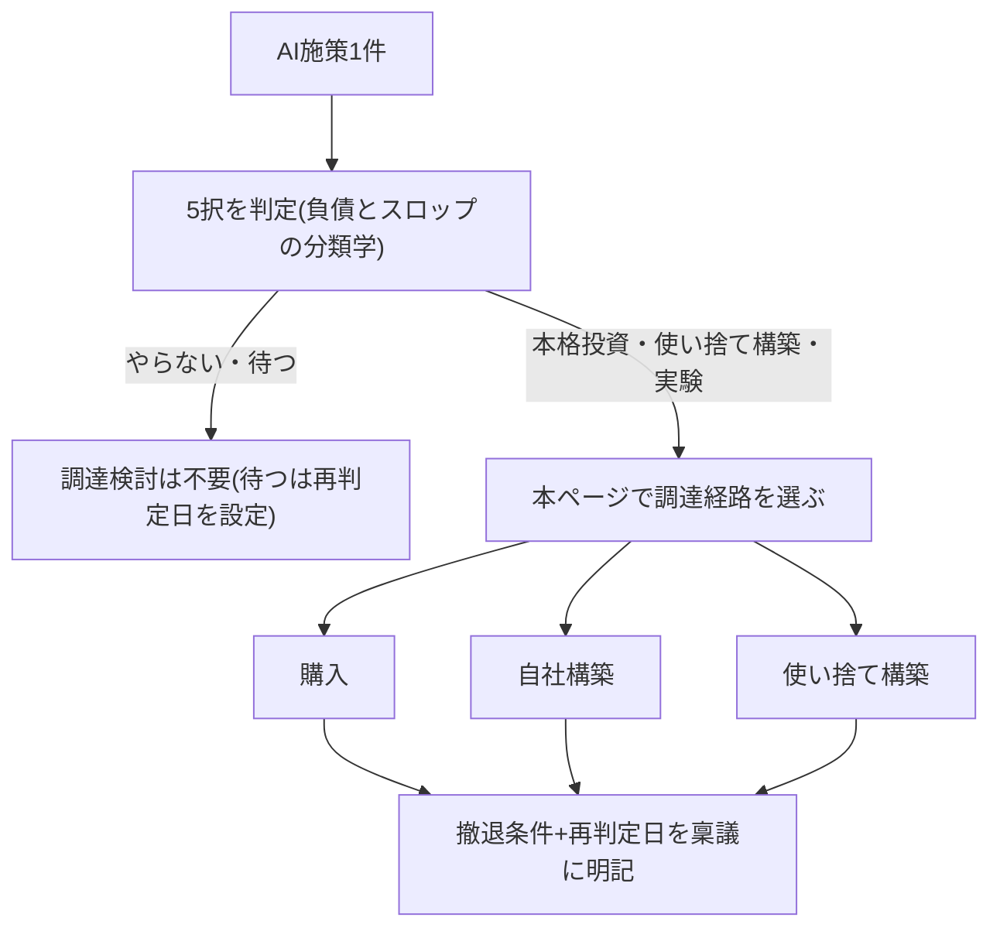
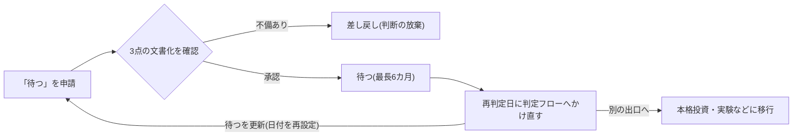

## このページで扱う範囲

AI投資の選択肢は「やる/やらない」の2択ではなく5択——**本格投資・使い捨て構築・実験・待つ・やらない**——である。施策1件がこの5択のどれに当たるかを振り分ける判定フロー(Q1〜Q5)は原理編「負債とスロップの分類学」で説明しており、本ページで再定義しない。本ページはその次の段階を扱う。

扱うのは2つの問いである。第一に、**調達経路の設計**。判定が出た施策を、購入(buy)・自社構築(build)・使い捨て構築・待つ、のどの経路で実行するか。重要なのは、5択の判定と調達経路は別の問いだということだ。「専門ベンダーで満たせるなら本格投資」でもなければ、「待てないなら本格投資」でもない。第二に、**ポートフォリオ・ガバナンス**。5択それぞれに決裁レンジ・承認者・再判定頻度を割り当て、経路を問わず撤退条件のない投資を承認しない統治の型である。

## 5択の要点(定義と判定は「負債とスロップの分類学」にある)

各出口の投資上の含意のみ1行で確認する。判定フロー・使い捨て3条件の全文は原理編「負債とスロップの分類学」を参照。

- **本格投資** — 成立条件は、成果が**スケールする資産**(構造化データ・再設計された業務・人の検証能力)に紐づくことのみ。ツールやモデルそのものは資産にならない。緊急性やベンダー製品の有無は成立条件ではない(後述)
- **使い捨て構築** — 3条件(捨てられる額・残る資産の分離・捨てる条件の事前決定)を満たすときのみ負債と区別される(条件の詳細は同ページ)
- **実験** — 成果物は売上ではなく**学習**である。「成果が出なかった」は実験の失敗ではないが、「何を学んだか言えない」は失敗である。本番化基準(どの数値を超えたら本格投資・購入に切り替えるか)を着手前に決める。基準なき実験はPoC止まりの温床になる
- **待つ** — 能動的な選択であり、再判定日のない「待つ」は承認しない(後述)
- **やらない** — 前提(AI-readyなデータ・実行体制)を欠く施策の正解。浮いた予算は前提づくりに付け替える

## 前提として押さえる調達環境の3つの変化

調達経路の設計が独立した論点になるのは、市場環境が3つの方向で構造的に動いているからである。

第一に、**推論コストの急速な低下が続いている**。一定性能のAI処理の価格が桁違いの速度で下がる環境では、「今作り込む」ことが高値掴みになりうる(数値は原理編「AIDXの定義」のコストカーブ参照 [src-2026-003])。第二に、**企業のAI調達は外部購入へ大きくシフトした**。「まず買えないか」を最初に検討するのが定石になりつつある。第三に、**ベンダー側の能力の過剰申告が横行している**。既存製品を実質的な能力なしに「エージェント」と再ブランドするエージェント・ウォッシングであり、買えば安全という話ではない。

> 📊 **データボックス(2026-06時点)**
> - 調達構造: AIユースケースの76%が外部購入(buy)、自社構築(build)は24%。前年の購入53%/構築47%から1年で購入へ大きくシフト(Menlo Ventures、2025年11月、米国の企業AI購買意思決定者約500名調査。VCの自社調査であり投資先へのポジションに留意)[src-2026-007]
> - モデルの陳腐化速度: 米国企業における主要モデルの社内シェアは2年余りで大きく入れ替わった(同調査)[src-2026-007]
> - ベンダー実態: 報道によればGartnerは、エージェント型AIを称する数千社のベンダーのうち実際にエージェント能力を持つのは約130社のみと推計し、同分野プロジェクトの40%超がコスト上昇・不明確なビジネス価値・不十分なリスク統制により2027年末までに中止されると予測(2025年6月)[src-2026-041]
> - 購入の成功率: Fortune報道によればMIT NANDA調査では、専門ベンダーからの購入は約67%の確率で成功し、内製の成功率はその約3分の1。ただし「成功」の定義は6カ月以内に測定可能な財務ROIを伴う本番展開に限定され、判定はわずか52件のインタビューに依拠する。方向性の参考値として扱う [src-2026-008] [src-2026-032]
> - データ前提: 報道によればGartnerは「AI-readyなデータ基盤を欠く組織は、2026年を通じてAIプロジェクトの60%を放棄することになる」と予測(CIO誌寄稿、2026年2月。寄稿者はAI関連企業役員のため利益相反に留意)[src-2026-011]

## 調達経路は購入・自社構築・使い捨て・待つの4つから選ぶ

5択の判定フローで「やらない」「待つ」と判定された施策に調達検討は不要である。出口が本格投資・使い捨て構築・実験のいずれかになった施策だけが、この表に進む。判定(原理編「負債とスロップの分類学」)と調達経路(本ページ)の二段構えを図にすると次の通りである。



| 調達経路 | 向く状況 | 5択との対応 | 撤退条件の例(契約・設計に書き込む) |
|---|---|---|---|
| 購入(buy) | 専門ベンダーの製品で要件を満たせる。業務が標準的で固有性が低い | 全社展開・複数年契約=**本格投資**(資産紐づけ+撤退条件が必須) / 少席数・単年契約のトライアル=**実験** / 解約前提の期間限定導入=**使い捨て構築** | 解約条項と違約金の上限、データのエクスポート手段、利用率・効果指標の下限(下回ったら更新しない) |
| 自社構築(build) | 競争優位の源泉で外部に出せない、または要件が固有でベンダー製品が存在しない | 成果がスケールする資産に紐づく場合のみ**本格投資**。紐づかないなら本格構築はしない(実験か使い捨てに格下げ) | 保守体制を維持できなくなったら停止、効果指標が基準を割ったら廃止 |
| 使い捨て構築 | 周辺・低リスク領域で短命前提。開発が著しく安くなった領域 [src-2026-009] | **使い捨て構築**(3条件は「負債とスロップの分類学」参照) | 捨てる条件の文書化そのものが撤退条件(3条件の③) |
| 待つ | 能力向上・コスト低下カーブ上にあり、今の作り込みが高値掴みになる領域 | **待つ**(再判定日が必須) | 再判定日と、待つ間に整える前提(データ整備等)を明記 |

この表が示す通り、**購入は本格投資と同義ではない**。購入にも5択がそのまま適用される。少席数のSaaS契約は実験であり、繁忙期だけの解約前提導入は使い捨て構築である。逆に全社・複数年の購入契約は、内製と同じく「スケールする資産に紐づくか」「撤退条件を言えるか」の審査を通さなければ本格投資として承認できない。買い物だから気軽、という抜け道を作らないことが要点である。

同様に、**緊急性は本格投資の理由にならない**。「待てないから本格投資」という推論は、本格投資の成立条件(資産への紐づけ)と無関係な要素で投資を正当化する誤りである。急ぎは調達経路で吸収する——買って早く入れるか、使い捨てで早く作るか、である。

経路選択にはもう一つ、時間に関する**非対称性**がある。**捨てる前提の構築は早く着手してよく、本格的な作り込みは待つ方がよい**——この使い分けに出典はなく、実務上の経験則である。使い捨て構築はコストが小さく、捨てても学習(データ・業務理解・検証基準)が残るため早期着手が正当化される。一方、本格的な作り込みは、コスト低下とモデル世代交代 [src-2026-003] [src-2026-007] により半年後に前提が変わるリスクを負う。同じ「早くやりたい」でも、答えは投資の重さで逆になる。

## 「待つ」には必ず再判定日を付ける

「待つ」は5択の中で最も誤用されやすい。意思決定の先送りを「戦略的に待っている」と言い換える誘惑が常にあるからだ。そこで本ページは運用ルールを1つ置く。**再判定日のない「待つ」は禁止**である。「待つ」の承認には、(1)何を待つのか(能力・価格・製品の成熟のどれか)、(2)いつ再判定するのか(日付)、(3)待つ間に何を整えるのか(データ整備・検証基準づくり等)の3点の文書化を必須とし、どれかを欠く申請は「待つ」ではなく「判断の放棄」として差し戻す。

待つことの費用はゼロではない。待っている間に競合は実験や使い捨て構築から学習を蓄積していくため、「待つ」の実質的な費用は競合に対する遅れとして現れる——この読みに出典はない。だからこそ期限が要る。再判定日に5択の判定フローへかけ直し、「待つ」を更新するならば再び日付を付ける。

「待つ」の承認から再判定までの運用サイクルは次の通りである(3点=何を待つか・再判定日・待つ間に整える前提)。



## 購入ではベンダーの能力の過剰申告を見抜く

外部購入へのシフトが進み、購入の成功率は内製を上回るとの調査もある(ただし成功の定義が狭い点は前掲データボックスの注記の通り)[src-2026-007] [src-2026-008] [src-2026-032]。buyは合理的な初手だが、ベンダー側の能力の過剰申告——エージェント・ウォッシング(用語集「AIエージェント」参照)——が横行していると報じられる以上 [src-2026-041]、購入経路には選定時の検証が必須である。Gartnerが挙げる中止要因(不明確なビジネス価値・不十分なリスク統制・既存製品の再ブランド)を裏返すと、ベンダーには次を質問すべきである。

- 既存のアシスタント・RPA・チャットボットと、この製品の「エージェント能力」の差分は具体的に何か。人手の介在なしに何をどこまで判断・実行するのか [src-2026-041]
- ビジネス価値をどの指標で測り、導入企業で実測値があるか [src-2026-041]
- 自律実行に対するリスク統制(権限の範囲、誤動作時の停止・巻き戻し)はどう設計されているか [src-2026-041]

ベンダー任せの調達が多い日本企業では、この検証を省略した購入こそが「buyの成功率」の前提を崩す最大の要因になりうる——この読みに出典はない。また米国調査の購入比率は購入可能な選択肢の厚い市場での数字であり、国内で同等の選択肢が薄い領域ではbuild比率が高まらざるをえない点も読み替えが必要である。

## 決裁レンジと承認者の目安

5択をポートフォリオとして統治するには、出口ごとに決裁レンジ・承認者・再判定頻度を固定しておくのが実務的である。**以下の目安に出典はなく、実務上の経験則である**。自社の決裁規程に合わせて調整する叩き台として示す。

| 5択 | 決裁レンジの目安 | 承認者 | 再判定頻度 |
|---|---|---|---|
| 本格投資 | 数千万円〜(複数年) | 経営会議(規模により取締役会) | 四半期ごとに効果指標を確認、年1回は5択を判定し直す |
| 使い捨て構築 | 部門長決裁枠内(数十万〜数百万円、単年度費用化できる額) | 部門長 | 四半期ごとに「捨てる条件」への該当を確認 |
| 実験 | 〜数百万円(推進担当の裁量予算) | 推進担当が起案、部門長が承認 | 90日で本番化基準と照合し、継続・昇格・終了を決める |
| 待つ | 0円(待つ間の前提整備は別予算) | 部門長(再判定日の設定をもって承認) | 再判定日に5択の判定フローへかけ直す(最長6カ月後) |
| やらない | 0円(浮いた予算はデータ整備へ付け替え) | 部門長 | 前提が整った時点で5択の判定フローにかけ直す |

このレンジ設計の意図は2つある。第一に、使い捨て構築の上限を「全損しても経営会議への説明が不要な額」に抑えることで、3条件の①(捨てられる額)を決裁制度の側から担保する。第二に、実験と使い捨て構築を部門長以下で回せるようにすることで、経営会議を本格投資の審査に集中させる。なお、この決裁レンジを中計・年度予算の取締役会決議(投資枠・決裁権限の配分の2点)へ翻訳する手順は、ロードマップ編「経営計画への翻訳」を参照。

## 稟議書にそのまま足せる追記欄

既存の稟議書様式の末尾に、次の追記欄をそのまま貼って使う。経路を問わず全AI投資案件に適用する。記入の前段で施策の期待値(効果幅×確率−費用)を試算する場合は、ロードマップ編「AIDXのリターン構造」の簡易期待値ワークシート(5行)を使う。

```
【AI投資 追記欄】
1. 5択の判定: □本格投資 □使い捨て構築 □実験 □待つ □やらない
   (原理編「負債とスロップの分類学」Q1〜Q5の回答を添付)
2. 調達経路: □購入 □自社構築 □使い捨て構築 □待つ
   (購入の場合、エージェント・ウォッシング検証3問へのベンダー回答を添付)
3. 使い捨て構築の3条件(該当時のみ):
   ・投資上限(捨てられる額): ______円
   ・捨てても残す資産(データ/業務理解/検証基準)の保管場所: ______
   ・捨てる条件(いつ・何が起きたら廃棄するか): ______
4. 撤退条件(全経路で必須): 「______が______を下回ったら/______が起きたら」中止する
5. 次回再判定日: ____年__月__日
   ※「待つ」の場合は必須。4・5が空欄の申請は受理しない。
```

## 今日からやること

- 【推進担当】(今すぐ)進行中・計画中の全AI施策を5択の判定フロー(原理編「負債とスロップの分類学」)にかけ、台帳(施策名/5択/調達経路/撤退条件/次回再判定日の5列)に記入する。完了条件: 全件に撤退条件と再判定日が入っていること
- 【CFO】(今すぐ)上記の稟議追記欄を自社の稟議様式に組み込み、撤退条件・再判定日が空欄の申請を差し戻すルールを決裁規程に追加する。完了条件: 次の稟議サイクルから新様式で受付が始まること
- 【部門長】(今すぐ)購入検討中の案件にエージェント・ウォッシング検証3問を投げ、ベンダーの回答書面を稟議に添付する [src-2026-041]。完了条件: 回答のない案件の選定を保留にすること
- 【経営】(1年以内)「待つ」「やらない」と判定した施策の予算をAI-readyなデータ整備に付け替える [src-2026-011]。完了条件: 付け替え額と整備対象が次年度予算に明記されること
- 【経営】(待て)能力向上カーブ上にある作り込み型の案件は、再判定日を明記した上で凍結する。完了条件: 凍結案件の全件に再判定日が付いていること。日付のない凍結は放棄と同じである

(関連: 原理編「負債とスロップの分類学」=施策判定のフローを定義、原理編「AIDXの定義」=コストカーブ、ロードマップ編「撤退プレイブック」=撤退条件作動後の畳み方の手順、AI-Ready編のデータ整備各ページ)

---

**この主張が崩れる条件**: 推論コストの低下が止まって「待つ」の経済合理性が消え、かつベンダー市場の淘汰が進んで購入の失敗リスクが無視できる水準まで下がれば、本ページの撤退条件中心のガバナンスは過剰な規律となり、単純な「即・購入」が最適解になる。

<!--
執筆メモ(レビュー重点ポイント):
- 2026-06-11改稿: 施策単体の5択判定をdebt-slop-taxonomy(正本)に委譲し、本ページを調達経路の設計+ポートフォリオ・ガバナンスに再定義。旧判定表の矛盾2点(ベンダーで満たせる→本格投資の短絡/待てない→本格投資)は、5択と調達経路を直交させることで解消した。
- 「金額とガバナンス」表の決裁レンジ・承認者・再判定頻度は全面的に編集部の見立てで出典なし(本文に明記済み)。「全損しても経営会議への説明が不要な額」という基準の妥当性は人間レビューで確認を。
- 調達経路表の「購入の3形態=本格投資/実験/使い捨て構築」の対応づけも編集部の整理。契約形態と5択の対応が一意でないケース(例: 単年契約だが全社展開)の扱いは将来の論点。
- NANDA 67%は95%と同一調査であり、成功定義の限定(6カ月以内ROI)と52件インタビュー依拠 [src-2026-032] をデータボックスに注記した。本文では「方向性の参考値」扱い。
- モデルシェアの入れ替わり期間は原データ2023→2025年のため「2年余り」と表現(旧版の「2年で」を修正)。
- Gartner 60%予測 [src-2026-011]・agent washing [src-2026-041] は原典プレスリリースがbot保護で未確認のため、本文・データボックスとも「報道によれば」を付した。
- 「待つの実質コスト=相対的劣後」は競争時間軸の見立てで直接の出典なし。マーカー付与済み。
2026-06-12 文体改修: 格言調見出し平易化・内部用語排除・見立て定型句を自然文に置換
-->
