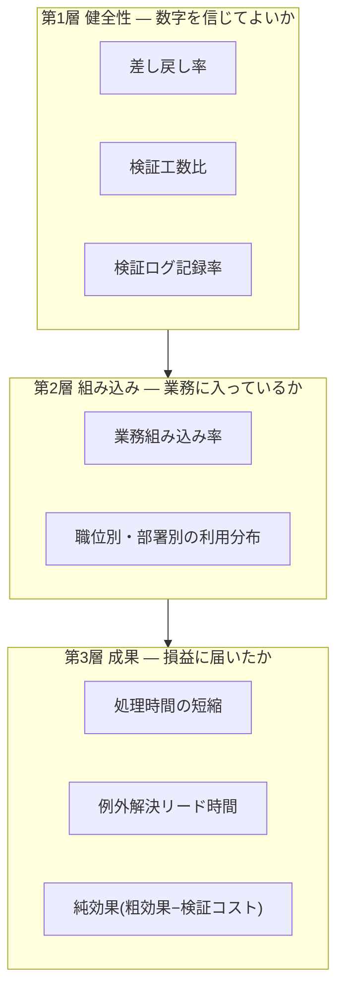

> 💡 **ひとことで言うと**
> AIの成果を「何時間浮いたか」だけで測るのは、ダイエットを歩いた歩数だけで測るようなものだ。食べた量(AIの答えを確かめ直す手間)を引き、体重(会社の損益)まで動いたかを見なければ、頑張った気分だけが残る。

## このページで扱う範囲

AI施策の成果計測には、すでに散らばった部品がある。検証の記録様式、組み込みの判定テスト、純効果の算出式——いずれも別ページで定義済みである。本ページはそれらを**計測の体系(3層8指標のKPI=達成度を測る重要指標のセット)**として束ね、各指標の定義・算出式・観測者・頻度・記録場所を1枚で確定する。判定基準や記録様式を本ページで作り直すことはない(各論点の定義がどのページにあるかは、8指標の定義表の直後に対応表で一覧する)。

**四半期の効果レビューに出る最小セット**: 本ページのKPI定義シート+別添3枚で足りる。別添3枚とは、①検証ログの月次集計(検証と差し戻しの記録。様式は組織・人材編「実行者から検証者・設計者へ」)、②施策ごとの効果の実測と、ポートフォリオ集計1枚(ポートフォリオ=施策全体のこと。全施策の効果を1枚に並べた集計表。様式はロードマップ編「AIDXのリターン構造」の簡易期待値ワークシートと同ページの集計様式)、③AI施策台帳のサマリー(原理編「負債とスロップの分類学」=全施策を5択区分・撤退条件付きで一覧化)である。

## 個人の時短は組織の損益に届かない

AI導入の効果報告で最初に出てくる数字は、ほぼ例外なく「1人あたり週○時間浮いた」という時短である。この数字自体は、多くの場合正しい。問題は、個人のタスク(作業)時間の短縮が、組織の損益改善に自動的には積み上がらないことである。国内の就業者調査では、タスク単位の時間削減を確認した利用者でも、業務全体の時間が減ったと答える者は少数にとどまる。浮いた時間の過半は、新しい価値を生む業務ではなく既存業務にそのまま再投入されていた [src-2026-052]。浮いた30分は、放っておけば別の作業に吸収されて消える。報道によれば、米国の研究機関の調査も、企業の生成AIパイロット(試験導入)の大半が損益計算書に測定可能な効果を出せていないと指摘している(「失敗」の定義は測定可能なP&L(損益計算書)効果の欠如であり、この数字の方法論への批判は原理編「負債とスロップの分類学」の囲みを参照)[src-2026-031]。

つまり時短は効果の「原材料」にすぎない。浮いた時間が検証・改善・新業務へ転換されたことを確認して初めて、損益に届く効果として計上できる(この転換の確認を人件費換算の計上条件とする考え方は、組織・人材編「実行者から検証者・設計者へ」=浮いた時間は3役割へ振り替えて初めて効果になる、と同じものである)。時短の集計だけを成果指標にした推進プロジェクトは、現場の体感と経理の数字が一致しないまま2年目の予算審議で止まる——これが「時短だけを見ると失敗する」の意味である。

## 検証の工数を引かない効果は過大計上になる

もう1つの落とし穴は、効果の足し算だけをして引き算をしないことである。AIに業務を委ねれば、出力を検証し修正する工数が必ず発生する。この検証工数は体感されにくい。熟練開発者を対象としたランダム化比較試験(くじ引きでAIを使う群と使わない群に分けて比べる実験)では、AI支援で「速くなった」という本人の事後の体感と、検証・修正込みの実測が逆方向に食い違った(対象は熟練者×熟知したプログラム一式に限定され、一般化はできないと研究自身が明記している)[src-2026-076]。また、検証が不十分なまま流通した低品質なAI生成物は、解釈・修正・やり直しの負担を受け手側に移す。送り手の時短が受け手の工数増として組織内を移動するだけで、組織全体では損失になる [src-2026-036]。

したがって、体感ベース・粗効果(検証の手間を引く前の効果)ベースの効果報告は、構造的に正へ偏る。検証工数を計測し、粗効果から引いた**純効果**だけを成果と呼ぶ——これが本ページのKPIセットの背骨である。

> 📊 **データボックス(2026-06時点)**
> - タスク単位の業務時間は平均16.7%削減(週あたり26.4分)された一方、業務全体の時間が減ったと答えたのは利用者の25.4%のみ。削減できた時間の61%超は既存業務に再投入(パーソル総合研究所、2025年10月実施、調査会社モニターによるインターネット定量調査、正規雇用就業者3,000名)[src-2026-052]
> - 熟練OSS(オープンソースソフトウェア)開発者16名のランダム化比較試験で、AIツール使用時の完了時間は不使用時より19%長かった。本人は事後も「20%速くなった」と認識(METR、2025年7月公表。対象は成熟リポジトリの熟練開発者に限定)[src-2026-076]
> - 実質を欠くAI生成の業務コンテンツ1件への対処に受け手は平均1時間56分を要すると推計(BetterUp Labs×Stanford Social Media Lab、2025年8〜9月集計、米フルタイムデスクワーカー1,150名)[src-2026-036]
> - 報道によればMIT NANDAの報告書(2025年8月)は、企業の生成AIパイロットの約95%が測定可能なP&L効果を出せていないとした(定義と方法論批判は原理編「負債とスロップの分類学」の囲み参照)[src-2026-031]

## 成果は3層で測る

以上の2つの失敗——時短の再吸収と検証コストの引き忘れ——を防ぐには、成果の数字そのものより手前に2つの問いを置く必要がある。「その数字を信じてよいか(検証と記録が機能しているか)」と「業務に本当に入っているか(個人の裁量利用で水増しされていないか)」である。本ページのKPIセットはこの順に3層で構成する。この3層構成に出典はなく、既存の判定基準・様式を計測体系として束ねた実務上の整理である。

図は3層の構成を示す。下の層(健全性)が崩れていると、上の層の数字は良くても悪くても信用できない。

- **第1層 健全性**: 検証が実際に行われ、記録され、検証コストが見えているか。ここが空欄のまま報告される成果の数字は、体感の写しである
- **第2層 組み込み**: AIが個人の道具ではなく業務の工程になっているか。組み込まれていない利用の「効果」は、担当者の異動とともに消える
- **第3層 成果**: 処理時間・例外対応・純効果という、経営会議が損益と接続して読める数字。第1層・第2層が立っていることを前提に、ここだけを役員向け報告に載せる

## 8指標の定義 — KPI定義シート

以下が本ページの中核である。各指標に定義・算出式・観測者(役割)・頻度・記録場所を確定する。観測者と記録場所が空欄の指標は運用されない——表を自社用に確定するまでが導入である。しきい値・目標値は意図的に載せていない。外部の目安を目標にせず、後述の通り90日の実測で自社の基準線を引く。

### 第1層 健全性

この表の見方: 以下の3つの表はいずれも、縦に指標、横に定義・算出式・観測者・頻度・記録場所が並ぶ。まず観測者欄に自分の役割がある行を見る。

| 指標 | 定義 | 算出式 | 観測者 | 頻度 | 記録場所 |
|---|---|---|---|---|---|
| 差し戻し率 | 検証したAI出力のうち差し戻した比率 | 差し戻し件数 ÷ 検証件数 | 【設計者】が集計、【推進担当】が横串で確認 | 月次 | 検証ログ(様式は組織・人材編「実行者から検証者・設計者へ」) |
| 検証工数比 | 委任で浮いた工数に対する検証・修正工数の比。1.0以上なら浮いた時間より検証に使う時間が長い | 検証・修正工数 ÷ 委任で浮いた粗工数 | 【部門長】 | 月次 | 検証ログ+工数記録(タイムシート等) |
| 検証ログ記録率 | 検証義務のあるAI出力のうち、ログに記録された比率 | 記録済み検証件数 ÷ 検証義務対象の出力件数 | 【推進担当】 | 月次 | 検証ログとAI施策台帳の突合表 |

差し戻し率は単独で目標化しない。低すぎる差し戻し率は「品質が高い」ではなく「検証が素通しになっている」合図かもしれない。高すぎれば、委任の品質か検証基準のどちらかに問題がある。検証ログには差し戻し的中率と見逃し重大度の集計列があり(定義は同ログの様式にある)、差し戻し率は必ずこの2つと対で読む。また検証ログ記録率が低いままなら、本表の他の7指標はすべて分母の怪しい数字になる——立ち上げ期はこの記録率を最初のKPIにする。

### 第2層 組み込み

| 指標 | 定義 | 算出式 | 観測者 | 頻度 | 記録場所 |
|---|---|---|---|---|---|
| 業務組み込み率 | 主要業務のうち、判定3テスト(業務フロー記載・停止影響・検証責任。原理編「AIDXの定義」の3問)をすべて満たす業務の比率 | 3テスト全Yesの業務数 ÷ 主要業務数 | 【推進担当】 | 四半期 | 主要業務一覧(AI施策台帳と対応付け) |
| 職位別・部署別の利用分布 | 利用率を全社平均ではなく職位・部署別の分布で見る | 職位・部署ごとの利用率一覧(平均値を単独で報告しない) | 【推進担当】+【CHRO(人事担当役員)】 | 四半期 | 利用ログまたは社内調査の集計表 |

業務組み込み率は判定3テストの適用比率であり、新しい判定基準ではない。定着施策の文脈でこの2指標をどう使うかは組織・人材編「抵抗と定着」(定着は利用率で測らない)が扱っており、定義は同一である。分布で見る理由は、利用が職位・属性間で大きく偏ることが国内調査で確認されているからである [src-2026-052]——平均の上昇は、よく使う一部の人の伸びだけでも作れてしまう。

### 第3層 成果

| 指標 | 定義 | 算出式 | 観測者 | 頻度 | 記録場所 |
|---|---|---|---|---|---|
| 処理時間の短縮 | 対象業務1件あたり処理時間のbefore/after(導入前後)の実測差。体感の「速くなった」は採用しない | (移行前の1件あたり処理時間 − 移行後)÷ 移行前 | 【部門長】 | 移行前に必ずbefore値を取り、以後四半期 | 業務分解ワークシート+AI施策台帳 |
| 例外解決リード時間 | AIで処理できない例外案件の、検知から解決までの時間。委任拡大後の業務品質の劣化はまずここに現れる | 例外案件の検知〜解決の経過時間(中央値) | 【部門長】 | 月次 | 例外案件の記録(検証ログの差し戻し理由欄と対応付け) |
| 純効果 | 検証コストを引いた後の効果。経営向け報告で「成果」と呼んでよいのはこの数字だけ | (浮く工数×担当者単価)−(検証工数×検証者単価)−月次費用(利用料・保守)。式の定義はロードマップ編「AIDXのリターン構造」の「月次の純効果」に従う | 【CFO(財務担当役員)】(集計は経理) | 四半期 | 簡易期待値ワークシートの事後実測欄+ポートフォリオ集計1枚 |

純効果の式は事後の実測に使う。一点だけ混同を防ぐ注意がある。記録場所として共用するワークシートには「保守的試算」という行(4行目)があるが、あれは着手前に「成功確率を低めに見ても割に合うか」を確かめる事前の見積もりである。事後の実測である本指標とは別物なので、実測値に成功確率を掛けてはならない。

なお、個人の評価制度側の指標(検証精度・例外解決時間系への張り替え)は組織・人材編「業務分解×再配置プレイブック」が3つの例とともに扱っている。本表は組織・施策の計測体系であり、評価制度の指標はその個人側への展開という関係になる。

### 各指標の定義はどのページにあるか

本ページは束ねの体系のみを定義しており、各指標の判定基準・記録様式の定義は次の対応表のページにある。

| 論点 | 本ページの扱い | 説明しているページ(結論1行) |
|---|---|---|
| 検証の記録様式 | 集計して指標にするのみ | 組織・人材編「実行者から検証者・設計者へ」=1件1行・5列の検証ログ。差し戻し的中率と見逃し重大度は必ず対で見る |
| 組み込みの判定 | 比率として計測するのみ | 原理編「AIDXの定義」の判定3テスト=フロー記載・停止影響・検証責任の3問すべてYesで「組み込み」 |
| 定着の計測の文脈 | 指標を共用 | 組織・人材編「抵抗と定着」=定着は利用率ではなく業務組み込み率と職位別の利用分布で測る |
| 施策単位の効果の見積もり・実測 | 成果層の算出式として参照 | ロードマップ編「AIDXのリターン構造」=純効果(浮く工数×単価−検証工数×単価−月次費用)で実測し、二重計上を3点で点検 |
| 評価制度への接続 | 扱わない | 組織・人材編「業務分解×再配置プレイブック」=個人の評価指標を処理件数系から検証精度・例外解決時間系へ張り替える |
| 経営・取締役会への報告様式 | 扱わない | AI-Ready編「AI-Ready自己診断」の四半期経営報告1枚と、ロードマップ編「経営計画への翻訳」の効果3分類(コスト回避/人件費換算/機会)へ実測値を渡す |

## 計測は検証ログから始める

8指標のうち、新しい記録様式を必要とするものは1つもない。第1層の3指標は検証ログ(1件1行・5列。様式は組織・人材編「実行者から検証者・設計者へ」で定義しており、本ページでは再掲しない)と工数記録から、第2層は判定3テストの棚卸しと利用ログから、第3層は業務分解ワークシートと簡易期待値ワークシートから、すべて集計できる。計測の立ち上げは次の3手で足りる。

1. パイロット(試験導入)対象の施策で検証ログの運用を開始する(記録は1件あたり1〜2分。この所要時間は出典のない実務上の目安である)
2. 移行前にbefore値(導入前の1件あたり処理時間)を取る——移行後にbeforeは二度と測れない。これだけは先送りできない
3. 月次集計の場(部門定例など)と四半期レビューの場(経営会議の効果報告)を決め、KPI定義シートの観測者・記録場所欄を実名・実ファイルで埋める

## 効果の重複計上を防ぐ

複数の施策が同じ業務の「削減工数」をそれぞれ全額計上すると、合計が元の業務量を超える。効果の二重計上の点検——体感と実測のすり替え・同じ工数の重複計上・浮いた工数と生まれた価値の混同の3点チェック(所管は経理・財務)——は、ロードマップ編「AIDXのリターン構造」で定めている。本ページの純効果の実測値は、このチェックを通過したものだけを使う。原則は1行で言える: **効果は業務単位で1回しか計上できない**。施策単位の効果を足し上げる前に、AI施策台帳上で対象業務の重なりを名寄せして(同じ業務を指す行を1つにまとめて)確認する。

役員会・取締役会向けの報告では、こうして確定した純効果をコスト回避/人件費換算/機会の3分類(ロードマップ編「経営計画への翻訳」=実測値を硬い順に積む報告用の集計区分)に束ねる。計測(本ページ)→点検(リターン構造)→報告(経営計画への翻訳)という分業であり、同じ数字が3つの顔で別々に増殖しないことがこの分業の目的である。

## 外部の目安は90日以内に自社実測へ置き換える

本サイトを含む外部の数値——差し戻し率の水準、検証工数の見込み、浮く工数のレンジ——は、計測開始前の仮置きにしか使えない。調査の母集団も業務の中身も自社とは違うからである。原則として、**稟議・予算・効果報告に使う数値は、計測開始から90日以内に自社の実測値へ置き換える**(この期限に出典はなく、月次集計3回分で最初の傾向線が引けるという実務上の経験則である)。90日で揃うのは処理時間・差し戻し率・検証工数比の初期値であり、四半期指標(組み込み率・純効果)は最初の四半期レビューで初回値を確定する。置き換えが済むまでの仮置き数値には、報告資料上も「外部目安・実測未了」と明記する——この注記が消える日を、推進計画の節目の目標にするとよい。

## ダウンロードして使う

本ページのKPI定義シート(8指標×層・定義・算出式・観測者・頻度・記録場所+自社実測値の記入欄)は、CSV形式(表計算ソフトで開けるファイル形式)でサイト内のテンプレート一覧ページ(/templates/)から取得できる。観測者・記録場所・実測値の欄を自社用に埋めて、四半期レビューの正面の1枚として使う。

## 体制と費用の目安

以下の数字はいずれも出典のない実務上の目安である(ロードマップ編「AIDXのリターン構造」の規模感と桁を揃えているが、見立て同士の整合であり検証ではない)。

- **中堅企業(数百名)**: 計測の専任は不要。推進担当の兼務で月10〜20時間(定義シートの維持・突合・四半期集計)+対象部門の検証ログ記入と月次集計が部門あたり月2〜3時間。人件費換算で年50万〜150万円程度
- **大企業(数千〜数万名)**: 推進部門に計測担当1〜2名(兼務可)+部門ごとに集計役を指名。集計の仕組み整備を含め年300万〜1,500万円程度。全部門一斉ではなく、検証ログが動いている部門から段階的に計測対象へ加える

効果側の目安(同じく出典のない見立て): この計測体系の直接の効果は、過大計上の排除と中止判断の早期化である。内訳式: 進行施策10〜30件 × 1件あたり粗効果の見積もり年200万〜500万円 × 検証工数控除と重複排除で目減りする比率2〜4割 = **年400万〜6,000万円の過大計上を防ぐ**(防いだ過大計上は、誤った本格投資・誤った継続判断の回避額として効く)。感度1行(前提が変わったら結論がどれだけ動くかの確認): 検証工数比が0.5を超える施策が過半を占める場合、粗効果ベースの効果報告はおよそ半分が実在しない——その状態で計測より先にやるべきは、効果報告の純効果への全面切り替えである。

## 今日からやること

- 【推進担当】(今すぐ)KPI定義シートを自社用に確定する。道具: 本ページの定義表+CSV版。完了条件: 8指標すべての観測者欄に実在の役職名、記録場所欄に実在のファイル・システム名が入り、経営会議で計測体系として承認されていること
- 【部門長】(今すぐ)パイロット対象業務のbefore値を取る。道具: 業務分解ワークシート(組織・人材編「業務分解×再配置プレイブック」)+検証ログ。完了条件: 1件あたり処理時間と差し戻し率のベースライン(出発点となる基準値)が、KPI定義シートに書いた記録場所に格納されていること
- 【CFO】【経理】(今すぐ〜90日)効果報告を粗効果から純効果へ切り替える。道具: 簡易期待値ワークシート(ロードマップ編「AIDXのリターン構造」)+二重計上3点チェック。完了条件: 次回四半期報告の効果欄がすべて検証工数控除後の純効果で記載され、外部目安のまま残る数値に「実測未了」の注記が付いていること
- 【CHRO】【部門長】(1年以内)計測指標を評価制度へ接続する。道具: 評価指標の張り替え例(組織・人材編「業務分解×再配置プレイブック」)。完了条件: 対象部門の評価面談で検証精度・例外解決時間系の指標が実際に使われていること
- 【経営】(能力向上を待て)利用率の全社KPI化。利用率は定着の指標として機能せず、強制は形だけの利用実績を量産する(組織・人材編「抵抗と定着」)。KPIにするなら業務組み込み率と検証ログの稼働が先である

---

**この主張が崩れる条件**: 検証ログと純効果の計測を4四半期続けても、全施策で粗効果と純効果の乖離が1割未満にとどまり、かつ見逃し重大度「高」(対外・金額影響)の欠陥がゼロのまま推移するなら、自社の業務構成では検証コストが効果計上を歪めるほど大きくなく、第1層(健全性)の月次計測は維持コストに見合わない——成果層中心の簡素な計測に縮小してよい。観測は【CFO】が年次の事前・事後乖離レビュー(ロードマップ編「AIDXのリターン構造」で定める)で簡易期待値ワークシートの事後実測欄とポートフォリオ集計1枚を突き合わせて判定し、判定結果を同集計の欄外に記録する。

(関連: 原理編「AIDXの定義」=判定3テスト/組織・人材編「実行者から検証者・設計者へ」=検証ログの様式と3役割/組織・人材編「抵抗と定着」=定着計測の使い方/ロードマップ編「AIDXのリターン構造」=純効果と二重計上の点検/ロードマップ編「経営計画への翻訳」=効果3分類への報告の束ね方)

<!--
執筆メモ(レビュー重点ポイント):
- 2026-06-12 外部評価(指摘4「KPIテンプレが薄い・時短偏重」)対応の新規ページ。3層KPI(健全性/組み込み/成果)はフレーム台帳に登録済み。8指標の判定基準・様式はすべて既存正本(検証ログ=talent-reallocation、判定3テスト=aidx-is-redesign、定着計測=resistance-adoption、純効果・二重計上=return-structure、KPI張り替え=work-redesign)を参照し、本ページは束ねの体系のみ新造。対応関係は8指標表直後の対応表「各指標の定義はどのページにあるか」+各層の本文に明記。
- 3層構成・8指標の選定・閾値を載せない方針・90日置き換え原則・計測コストと効果側レンジ(年400万〜6,000万円)はすべて出典のない編集部の見立て(本文に明記)。効果側レンジの妥当性は人間レビューで要確認。
- 結論(時短だけでは失敗する)はhigh3源(052パーソル/076 METR/036 workslop)で支え、MIT NANDA(031, medium)は「報道によれば」+方法論批判への参照付きの補強のみ。medium単源にテーゼを背負わせていない。
- パーソルの25.4%(総時間減の実感)は「少数」、61%超(再投入)は「過半」に変換(数値→程度表現の基準どおり)。時点依存の数値はすべてデータボックスへ隔離し、本文は構造記述で自立。
- 2026-06-12 レビュー対応改稿(必須修正4件+推奨1件実施):
  ①純効果の式に−月次費用(利用料・保守)を補い、「簡易期待値ワークシートと同一」表現を削除(正本return-structureの「月次の純効果」に従う旨へ修正。ワークシート4行目=成功確率込み保守的試算とは別物である注記を追加)。1行要約の正規形「浮く工数×単価−検証工数×単価−月次費用」をフレーム台帳(5択の期待値構造の行)に登録し、business-translation側の同根転写2箇所(冒頭対応表・効果3分類節)も同時修正。
  ②パーソル[052]のjp_note開示義務(調査会社モニターによるインターネット定量調査)をデータボックスに追記。
  ③90日実測置換の限定句(四半期指標=組み込み率・純効果は90日で揃わず最初の四半期レビューで初回値確定)をbusiness-translation絵姿テンプレ節と相互突合し、同旨の文を同ページに追記して統一。
  ④推奨対応: 冒頭の「扱う/扱わない」対応表を8指標表の直後(「各指標の定義はどのページにあるか」節)へ移動し核到達を速めた。フレーム台帳の「冒頭の対応表」記載も追随修正。
- 【公開の前提条件(TODOゲート・消化済み 2026-06-12)】templates側必須修正1を実施済み: 旧 kpi-definitions.csv を削除し kpi-definition-sheet.csv へ一本化(BOM付与・管理行追加)、templates.astro のKPI行も kpi-definition-sheet.csv へ差し替え済み——本文「/templates/ から取得できる」は成立。残タスク1点のみ: templates.astro の解説リンク(refHref)は本ページ公開と同時に return-structure → kpi-design へ切り替える(draftへのリンクは公開ビルドで切れるため。templates.astro 内にTODOコメントあり)。
- 【要判断①・人間待ち(推奨2未実施)】効果レンジ幅15倍(年400万〜6,000万円)の絞り込みまたは規模別中央例示の追加は、要判断(レビュー記録2026-06-12)の人間の結論を待って実施する。現状は内訳式+感度1行付きで維持。
2026-06-12 平易化改修済み
2026-06-12 検品反映: 冒頭の別添3枚を1枚ずつ平文で説明(ポートフォリオ集計の言い換え含む)/ワークシート4行目の注記を「事前見積もりと事後実測は別物」の平文へ書き直し/ランダム化比較試験・OSS・名寄せ・感度の初出言い換え/CFO・CHRO初出言い換え(表セル内)。事実・数値・出典タグは不変。
-->
