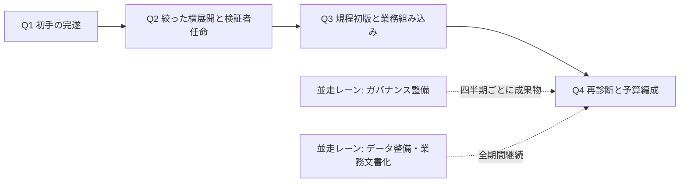
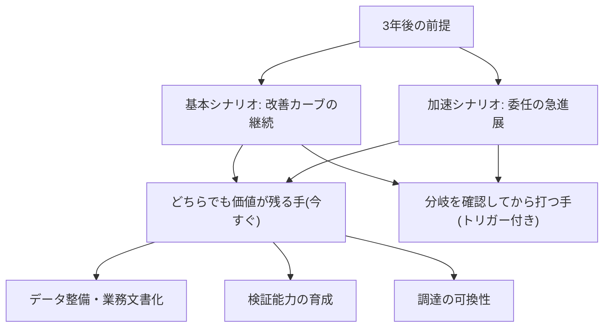

> 💡 **ひとことで言うと**
> 1年目の目標は、AIを「個人の便利道具」で終わらせず、部署の仕事の手順そのものに組み込むことである。3年先は天気予報と同じで、当てようとしない。「晴れでも雨でも困らない準備」を今進め、「降り出したら開く傘」は降り始めの合図を決めて待つ。

## 1年は並走の計画として、3年は分岐のシナリオとして持つ

最初の90日で初手を打った組織が次に置く現実的な目標は「**1年で組み込み期に入る**」である。この目標設定に出典はなく、実務上の判断である。段階の定義はAI-Ready編「成熟度モデル」にあり、財務インパクトはパイロット期から組み込み期への移行(ここが差の分かれ目)で初めて現れる。パイロット(小規模な試験運用)の本数を増やす1年にしてしまえば、忙しさだけが残る。

ただし工程には現実がある。組織変革とガバナンス(利用ルールと統制のしくみ)の整備は、技術の進歩より遅い。ガバナンス体制の整備完了には、1年超を見込む企業が多数を占める。走り出した実験のうち、短期で完全にスケールする(全社規模に広がる)のは少数にとどまる——経営層の多数派自身がそう見ている [src-2026-024]。ここから設計原則が2つ導かれる。第一に、**1年プランは直列ではなく並走で組む**。パイロットの成功を見届けてからガバナンスに着手する直列設計では、規程が組み込みの速度に間に合わない。第二に、**3年は計画ではなくシナリオで持つ**。3年後の前提から逆算する方法は原理編「時間軸の考え方」で説明しており、本ページはそれを再定義せず、1年の実行計画と3年の分岐管理に展開する。

## 1年プランは四半期の主線とガバナンスの並走で組む

1年プランの骨格は「四半期ごとの主線」と「全期間の並走レーン(主線と並行して走らせる作業の束)」の二層である。主線はQ1で初手を完遂し、Q2で絞った横展開と検証者(AIの成果物を確認し責任を持つ人。用語集「検証者」)の任命、Q3で規程初版と業務組み込み、Q4で再診断と翌年度予算編成へ進む。並走レーンはガバナンス整備とデータ・業務文書化で、どの四半期にも途切れず走らせる。ガバナンスに1年超かかるという工程の現実 [src-2026-024] を踏まえれば、Q3に規程初版を出すにはQ1着手が必須である。「整ってから広げる」でも「広げてから整える」でもなく、同時に進めるしかない。なお、この工程感(整備に1年超)は現時点で単一の調査 [src-2026-024] に依拠しており、独立の裏付けがあるのは組み込みの弱さという構造 [src-2026-046] までである。ただし並走設計の妥当性はこの数値の精度に依存しない——整備が想定より早く終わるなら並走に損はなく、遅いほど並走の価値が増す。

Q2を「絞る」と書いたのには根拠がある。経営層の多数派は、自社の実験のうち短期で完全にスケールするものは少数にとどまる(3分の2超が、完全スケールは30%以下と予想)と見ている [src-2026-024]。横展開の対象は全パイロットではなく、終了判定を通った勝ち筋だけである。またQ3の業務組み込みを1年の山場に置く理由も調査にある。日本企業は個人利用こそ高い一方、部署の業務プロセスへの組み込みが弱い [src-2026-046]。多くの企業が、まさにこの工程で止まっている。

> 📊 **データボックス(2026-06時点)**
> - ガバナンス体制の整備完了に1年超かかると見込む企業は69%。規制コンプライアンスが最大の障壁で38%(前回調査から10ポイント上昇)(Deloitte、2025年1月発表、14か国2,773名のディレクター〜Cスイート調査)[src-2026-024]
> - 回答者の3分の2超が、自社の生成AI実験のうち今後3〜6か月で完全にスケールするのは30%以下と予想(同調査)[src-2026-024]
> - 生成AIの「個人で業務利用」は日米独3か国とも高いが、「部署の業務プロセスに組み込まれている」は日本の回答率が低い(IPA DX動向2025、2025年2〜3月調査)[src-2026-046]
> - 報道によればPwC Japanの5か国比較調査(2025年6月発表)では、生成AIを業務プロセスに正式に組み込んでいる企業の72%が期待以上の効果を創出。ただし実施企業側の比率のみで非実施群の比較値は報道になく、組み込みを効果の「要因」と断定する根拠にはならない [src-2026-048]

日本企業では法務・労務の社内調整コストが海外調査の前提に上乗せされる傾向があり、「1年超」はさらに延びうる——この読み替えに出典はない。Q1からの並走着手は、海外水準の工程感をそのまま当てはめるより一段慎重な読み替えである。

### 四半期マイルストーン表(年度カレンダーに当てはめてそのまま使える)

マイルストーンとは節目の目標のことである。各セルが参照するページとあわせて使う。表の設計に出典はなく、実務上の整理である。

この表の見方: 縦に四半期、横に「目標」「やること」「成果物」「お金の確認点」が並ぶ。自分の【役割】タグが付いた欄と、右端のCFO列を対で見る。

| 四半期 | 主目標 | 主要アクション(役割) | 成果物・完了条件 | CFOが見る計数(目安) |
|---|---|---|---|---|
| Q1 | 90日の3手の完遂(内容はロードマップ編「最初の90日」) | 初手の完遂と結果の経営報告(【経営】【推進担当】) | 90日の終了条件(同「最初の90日」)と同一——3つの実物(5択宣言済みの施策台帳/全社周知された暫定ガードレール(最低限の利用ルール。用語集「ガードレール」)/移行前後の計測値付きの分解済み1業務)と、推進オーナーと次の着手項目が残る経営会議議事録が揃っている | パイロット予算の上限設定と消化率/台帳上の「待つ・やらない」宣言件数 |
| Q2 | 絞った横展開と検証者の任命 | パイロットを終了判定で絞り、勝ち筋1〜2件を隣接部門へ展開(【部門長】【推進担当】)。対象業務ごとに検証者(役割定義は組織・人材編「実行者から検証者・設計者へ」)を任命(【CHRO(人事担当役員)】【部門長】) | 横展開先でも同じ成功基準・終了条件が運用され、検証者が名簿で特定されている | 終了判定で中止・凍結した件数/横展開対象数(1〜2件に絞れているか) |
| Q3 | 規程初版と業務組み込み | 暫定ガードレールの運用実績を社内規程初版へ昇格(【推進担当】+法務。骨子は組織・人材編「推進体制とガバナンスの設計図」)。勝ち筋業務の手順書を改訂しAI工程を明記(【部門長】) | 規程初版が決裁済み。対象業務が組み込み判定(原理編「AIDXの定義」の判定3テスト)を通る | 組み込み判定を通った業務数/対象業務の処理時間・差し戻し率の前後差 |
| Q4 | 再診断と翌年度予算編成 | 25問の再診断と投資ゲート判定(AI-Ready編「AI-Ready自己診断」)(【推進担当】)。結果を翌年度予算に直結(【CFO(財務担当役員)】) | 経営報告1枚(様式は同上)が経営会議に提出され、翌年度予算がパイロット予算と組み込み予算に区分されている | 投資ゲートの判定結果/翌年度予算のパイロット/組み込みの区分比率 |

但し書き(開始段階別): この表は90日の3手を終えた実験期後半〜パイロット期のスタートを想定している。実験期に達していない状態から始める場合は、1年の目標を「組み込み期入り」ではなく「**パイロット期の出口**」に置き直し、Q2以降を1四半期単位で後ろ倒しする(段階定義と移行条件はAI-Ready編「成熟度モデル」にある。調整幅に出典はない)。

1年プランの構造を図にすると次の通りである(主線は四半期で進み、ガバナンスとデータ整備のレーンは全期間並走する)。



## 3年は単一の計画ではなく2本のシナリオで持つ

3年を単一の計画にしない理由は、原理編「時間軸の考え方」が示す通り、特定時点の能力評価を土台にした計画が短命だからである。「基本/加速の2シナリオ」と後述の「3年シナリオ点検メモ」は、本ページで定義する道具である。原理編「時間軸の考え方」の3年逆算(投資対象を選定する逆算の時計)を、年次の分岐管理と予算運用に落とす展開である。逆算の方法と「残る制約4つ」の定義は同編に従い、本ページでは再定義しない。3年を次の2本のシナリオで持つという設計に出典はなく、実務上の判断である。

- **基本シナリオ**: 能力・コストの改善が現在の基調のまま続く。利用は協働中心から徐々に委任へ移り、差は導入の有無ではなく組み込みの深さで開く。1年プランの延長線上で、組み込み期から再設計期への移行を狙う
- **加速シナリオ**: 自律的なエージェント(自律的に判断して動くAI。用語集「AIエージェント」)への委任が急進展し、業務の実行工程が広く外部の知能へ移る。実際、自律エージェントの探索は広範に始まっている一方、その統制を成熟させた企業は少数にとどまる [src-2026-024] [src-2026-005]。加速が来た場合に差を分けるのは技術の採否ではなく、検証能力と統制が委任の速度に追いつくかである

下振れ(規制強化・重大事故・能力改善の停滞などにより、翌年度のAI予算が半減する事態)は、第3のシナリオとしては置かず、両シナリオ共通のストレステスト(最悪時を想定した点検)として点検メモに組み込む(この組み込み方にも出典はない)。後悔しない手は下振れ時にも価値が残る——データの構造化と業務の文書化はAI以外の効率化・統制にも効き、検証能力と統制への投資は規制強化時にむしろ要求水準が上がる。下振れで損失が確定するのは、分岐依存の手(大型基盤・広範な委任)に先行投資していた場合である。トリガー(「これが起きたら動く」という引き金の条件)付きで待つ運用は、その保険を兼ねる。

> 📊 **データボックス(2026-06時点)**
> - 26%の組織が自律エージェント開発を大規模に(extensively)探索中で、さらに42%がある程度探索中(Deloitte、2025年1月発表、14か国2,773名調査)[src-2026-024]
> - 自律型AIエージェントのガバナンスについて成熟したモデルを持つ企業は約5社に1社(Deloitte Global第7期年次調査、2025年8〜9月実施、24か国3,235名のシニアリーダー)[src-2026-005]
> - AI活用の深さは三層に分化: 37%は業務プロセスをほぼ変えない表層利用、30%は主要プロセスの再設計、34%は事業モデルの深い変革(同調査)[src-2026-005]
> - 生産性・効率の向上を報告した組織は66%。一方、売上増を実現したのは20%(同調査)[src-2026-005]

シナリオの使い方は、手を2種類に区分することである。この区分に出典はなく、実務上の整理である。

1. **どちらでも後悔しない手(今すぐ)** — データの構造化・業務の文書化・検証能力の育成・調達の可換性(いつでも乗り換えられること。用語集「可換性」)。これは本ページの新しい分類ではなく、原理編「時間軸の考え方」の「残る制約4つ」およびAI-Ready編「AI-Readyの5資産」で定義済みの対象そのものである。両シナリオのどちらが来ても価値が落ちないことが投資根拠であり、シナリオの確定を待つ理由がない
2. **分岐を確認してから打つ手(トリガー付きで待つ)** — 全社共通基盤への大型投資、実行工程の広範な委任(エージェント化)、推進組織の大型専任化。これらはシナリオによって最適な形が変わるため、観測可能なトリガーを決めて待つ。「待つ」に再判定日を必須とする運用はロードマップ編「投資判断の5択」で定めている

シナリオと手の区分の関係を図にすると次の通りである(共通の手はシナリオの確定を待たず、分岐依存の手はトリガーで判断する)。



### 3年シナリオ点検メモ(年1回、Q4の再診断とセットでそのまま使える)

```
【3年シナリオ点検メモ】記入日: ____年__月__日
1. 委任の進展: 自社業務で「人の事前確認なしに実行まで任せる」工程は
   この1年で 増えた / 横ばい / 減った
2. 統制の追随: その工程すべてに検証責任者と停止手順があるか: Yes / No
3. 市場の観測: 主要業務と同型の業務で、委任型の実用事例を
   社外(同業・調査機関の公表情報)に確認できたか: Yes / No
4. 下振れの兆候: 規制強化・重大事故(自社または同業)・能力改善の停滞のうち、
   翌年度のAI投資を縮小させうる事象が発生したか: Yes / No
5. 判定:
   ・1が「増えた」かつ2がYes → 加速シナリオ寄りに翌年度の手を再配分
   ・2がNo → 委任拡大を凍結し、検証体制の整備を先行させる
   ・1が「横ばい/減った」 → 基本シナリオ維持(後悔しない手を継続)
   ・4がYes → 分岐依存の手を凍結・縮小し、後悔しない手(データ・文書化・
     検証能力・可換性)だけで翌年度計画が成立するかを確認する
6. 次回点検日: ____年__月__日(再診断と同日)
```

トリガーの置き方に出典はなく、実務上の経験則である。要点は、シナリオの判定を「世の中の空気」ではなく自社業務の観測値(委任工程の増減と統制の追随)で行うことにある。

## 年に1度の再診断を翌年度の予算編成に直結させる

1年プランのQ4は、単年の締めではなく翌年のゲート(通過してよいかを判定する関門)である。サイクルは4つの部品でできている。①25問の再診断と投資ゲート判定(凍結・実験までの受付・本格投資の解禁を判定する。手順はAI-Ready編「AI-Ready自己診断」)、②翌年度予算のパイロット予算/組み込み予算への区分(運用はAI-Ready編「成熟度モデル」のCFO向けアクションと同一)、③全AI施策の5択の年次再判定と「待つ」案件の再判定日更新(運用はロードマップ編「投資判断の5択」)、④前掲のシナリオ点検メモ。この4点セットを毎年Q4に回し、投資ゲート判定を添付しないAI予算要求は受理しない、という接続が本ページの提案である。年次サイクルの結果を中計・年度予算・取締役会決議の様式へ翻訳する手順は、ロードマップ編「経営計画への翻訳」を参照。

なお時計は三重になる。原理編「時間軸の考え方」が整理する「3年逆算の時計」(投資対象の選定)と「再判定最長6カ月の運用の時計」(見送り判断の鮮度)に、本ページは「年次の予算の時計」(資源配分)を加える。三者は矛盾しない——半年の再判定で施策単位の鮮度を保ち、年次で配分を組み替え、3年前提で選定基準を固定する。中間のQ2には、役員5問のショートカット診断(AI-Ready編「AI-Ready自己診断」)で軽い中間測定を挟むとよい。これで「物差しのインフレ」(要求水準の上昇)による定点スコアの誤読を避けられる。たとえば去年なら3点を付けた項目に、目の肥えた今年の回答者が2点を付ける。実際には改善しているのに、スコアが下がって見える現象である(関連: AI-Ready編「成熟度モデル」)。

## 体制と費用の目安

1年プランを回す体制・予算のレンジに出典のある基準はなく、以下は実務上の経験則である。自社の決裁規程に合わせて読み替えること。

- **中堅(数百名)**: 推進担当は専任1名+兼務2〜3名。年間予算は数百万〜数千万円規模(パイロット・横展開・教育・規程整備の合算)。四半期マイルストーンは経営会議の定例議題(アジェンダ)に載せ、予算区分の決裁は経営会議
- **大企業(数千〜数万名)**: 役員スポンサー(後ろ盾となる担当役員)+専任2〜5名+各部門の兼務5〜10名。年間予算は数千万〜数億円規模。Q3の規程初版には法務・リスク部門の専任関与が必要で、決裁は経営会議(規模により取締役会報告)
- **費目の構成比(出典のない目安)**: どちらのレンジでも、人件費(専任・兼務工数の按分)4〜5割/利用環境・基盤2〜3割/教育1割前後/外部支援1〜2割を起点に置く。大企業では基盤と外部支援の比重が上がりやすい。絶対額の精度より先に、パイロット予算と組み込み予算の区分(運用はAI-Ready編「成熟度モデル」)を立てること

## 今日からやること

- 【今すぐ】【経営】四半期マイルストーン表を自社の年度カレンダーに当てはめ、Q1〜Q4の担当役員を決める。道具: 本ページの四半期マイルストーン表。完了条件: 各四半期の主目標とオーナーが経営会議の議事録に残る
- 【今すぐ】【推進担当】ガバナンス並走レーンの起点として、暫定ガードレールの周知状況を確認し、規程初版までの残作業を一覧化する。道具: 組織・人材編「推進体制とガバナンスの設計図」の規程骨子。完了条件: Q3決裁から逆算した残作業リストに担当と期日が入っている
- 【1年以内】【CFO】Q4の再診断結果を翌年度予算の前提とするルールを予算編成方針に明記する。道具: 経営報告1枚様式(AI-Ready編「AI-Ready自己診断」)。完了条件: 「投資ゲート判定を添付しないAI予算要求は受理しない」が予算編成方針に書かれている
- 【1年以内】【CHRO】【部門長】Q2で任命する検証者を役割定義と評価に反映する。道具: 組織・人材編「実行者から検証者・設計者へ」の3役割。完了条件: 検証者の名簿と役割記述書が存在し、対象業務と紐づいている
- 【能力向上を待て】【経営】加速シナリオを先取りした実行工程の広範な委任と、全社共通基盤への大型投資。再開条件: シナリオ点検メモの判定が「加速寄り」かつ投資ゲートの解禁判定(AI-Ready編「AI-Ready自己診断」)を通過していること

**この主張が崩れる条件**: 規程を後回しにしパイロットの追加を続けたまま、業界平均超の成果を持続する企業が複数の独立した調査で相当数確認されたとき。あるいは能力・コスト改善の基調が止まり、基本/加速の分岐自体が消えたとき。このどちらかが起きれば、本ページの並走設計と2シナリオ管理は前提を失う。

(関連: ロードマップ編「最初の90日」=Q1の初手を定義、AI-Ready編「成熟度モデル」=段階定義と予算区分、AI-Ready編「AI-Ready自己診断」=投資ゲート・経営報告様式を定義、原理編「時間軸の考え方」=3年逆算を定義、ロードマップ編「投資判断の5択」=5択と再判定運用を定義)

<!--
執筆メモ(レビュー重点ポイント):
1. 「1年で組み込み期に入る」という目標設定、四半期マイルストーン表(Q1〜Q4の割り付け・CFO計数列・開始段階別の但し書き)、シナリオ2本構成+下振れストレステスト、点検メモのトリガー、規模感2レンジ・費目構成比はすべて編集部の設計であり出典はない(本文に見立て明記済み)。工程の根拠が実質 [src-2026-024] 単一調査である旨は本文で開示済み(2026-06-11 第3陣レビュー指示6対応)。
2. 「どちらでも後悔しない手」はtime-horizonの「残る制約4つ」とfive-assetsの参照であり新フレームではない旨を本文に明記(単一情報源ルール対応)。投資ゲート・5択・3役割・判定3テスト・暫定ガードレール・予算区分はすべて正本参照のみで再定義していない。「基本/加速の2シナリオ」と「3年シナリオ点検メモ」は本ページを正本としてフレーム台帳に登録済み(2026-06-11)。time-horizonの3年逆算との対応(年次運用への展開・別断面)は台帳と本文の双方に明記した。
3. src-2026-048(PwC調査のEnterpriseZine報道、medium)の72%は片側比率のため、データボックス内で「要因と断定する根拠にはならない」と注記し、本文の論旨はsrc-2026-024/005(high)で自立させた。結論はmedium単源に依存していない。
4. Q1の完了条件はfirst-90-daysの終了条件「3つの実物+1つの議事録」と突合済み(2026-06-11 第3陣レビュー指示2対応。文言を同ページの終了条件節に一致させた)。
5. roadmapコレクション内のorderが investment-decision と本ページで競合しないか(指示によりorder: 3)。first-90-days=1、investment-decision=2想定。
6. 下振れは第3シナリオにせず点検メモの設問4(ストレステスト)として実装(第3陣レビュー指示4で「シナリオ追加かトリガー追加か」の選択肢のうち後者を採用。2シナリオというフレームの台帳登録と整合させるため)。
2026-06-12 文体改修: 格言調見出し平易化・内部用語排除・見立て定型句を自然文に置換
2026-06-12 平易化改修済み
-->
