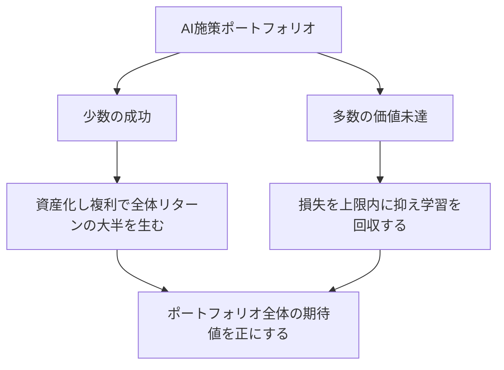
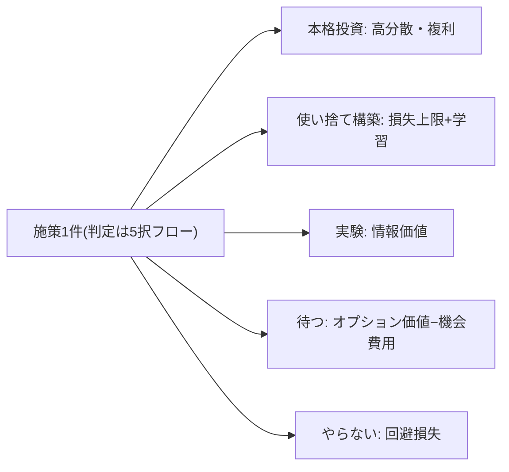
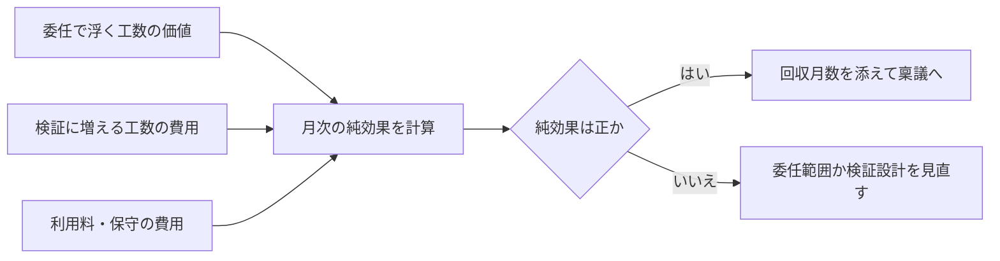

## リターンは平均ではなく分布で考える

「AI投資のROIは平均でどれくらいか」という問いは、答えても意味がない。複数の独立した調査が一致して示すのは、**価値を大きく実現する企業はごく一部にとどまり、過半は実質的な価値を出せていない**という偏りの構造である [src-2026-002]。一方で、早期に成果を出した採用者には収益増・コスト削減・生産性向上が同時に報告されており [src-2026-033]、企業の多数派自身も「最も進んだ施策はROI期待を満たすが、実験の大半は短期にスケールしない」と認めている [src-2026-042]。つまり「平均は失敗・上位は成功」が同時に成立しており、平均値はどちらの実態も表さない。

この二極化から引くべき結論は「AIは儲からない」でも「AIは必ず儲かる」でもなく、**これはポートフォリオ問題だ**ということである。施策1件ごとの成否を事前に当てることはできない。できるのは、(1)失敗の損失に上限を付け、(2)成功した少数を素早く本格投資に昇格させ、(3)外れた施策からも学習を回収する——という分布の管理である。問うべきは「この施策は成功するか」ではなく「このポートフォリオは期待値が正か」だ。

分布で考える投資管理の構造は次の通りである(少数の成功が全体を支え、多数の未達は損失上限と学習回収で処理する)。



> 📊 **データボックス(2026-06時点)**
> - AIの価値をスケールで実現している企業は5%(future-built)、35%がスケール途上、60%は実質的な価値を実現できていない(BCG、2025年9月発表、n=1,250社のグローバル調査)[src-2026-002]
> - Gartnerの早期採用者調査(2023年9〜11月、822組織)では平均で収益15.8%増・コスト15.2%削減・生産性22.6%向上。同じGartnerが生成AIプロジェクトの少なくとも30%は2025年末までにPoC後に放棄されると予測しており、成功側と失敗側の数値が同居する [src-2026-033]
> - Deloitte調査(2024年7〜9月、14か国2,773名)では、約4分の3が「最も進んだ生成AI施策はROI期待を満たすか上回る」と回答する一方、3分の2超が「今後3〜6か月で本格スケールできる実験は全体の30%以下」と回答 [src-2026-042]

## 5択それぞれの期待値構造

施策1件を**本格投資・使い捨て構築・実験・待つ・やらない**のどれにするかの判定フローは、原理編「負債とスロップの分類学」で説明している。判定後の調達経路とポートフォリオ・ガバナンスはロードマップ編「投資判断の5択」が扱う。本節はそのどちらでもない第3の断面——**各出口が持つリターンの「形」**——を加える。以下の定式化に出典のある標準はなく、実務のための整理である。判定基準そのものは変えない(迷ったら同ページのQ1〜Q5に戻る)。

| 5択 | リターンの形 | 損失の形 | 期待値計算の要点 |
|---|---|---|---|
| 本格投資 | **高分散・複利型**。成功すればスケールする資産(データ・業務・検証能力)が複利で効き、リターンの上限が事前に見えない(実際には委任範囲×業務量で上限はある) | 失敗すれば保守不能な負債が残り、損失は投資額を超えうる | 分散が大きいからこそ撤退条件が期待値を決める。撤退条件のない本格投資は下振れが無限大に開く |
| 使い捨て構築 | **損失上限+学習リターン型**。金銭リターンは小さくてよい | 損失は投資上限でキャップされる(3条件の①)。捨てても資産(データ・業務理解・検証基準)が残る(②) | 「全損しても残るもの」が実質のリターン。上限を破った瞬間にこの型から外れ、本格投資の下振れだけを持つ最悪の形になる |
| 実験 | **情報価値型**。成果物は売上ではなく「次の意思決定の質」 | 損失は実験予算と期間に限定 | 「やってみないと分からない」度合いが大きい施策ほど実験の価値は高い。結果がほぼ確実に予想できる実験は情報価値ゼロであり、やる意味がない |
| 待つ | **オプション価値−機会費用型**。能力向上・コスト低下を無償で取り込める | 待つ間に競合が蓄積する学習との差(機会費用)。観測されにくい損失 | オプションには行使期限が要る。再判定日のない「待つ」は期待値を計算できない(運用は「投資判断の5択」参照) |
| やらない | **回避損失型**。リターンは「失わなかった額」 | 前提が整った後も放置すれば「待つ」と同じ機会費用に転化する | 期待値が負の施策を退けた額は、成功施策の利益と同じ重みで全体の期待値に効く。ただし帳簿に現れないため過小評価されやすい |

5つの出口とリターンの形の対応を図にすると次の通りである(各出口は「何で報われ、何で損するか」が異なる)。



この定式化の実務的な含意は一つだ。**5択は「やる気の強さ」の5段階ではなく、リターンの形が異なる別々の金融商品である**。だから成果の測り方も別々でなければならない。実験を売上で評価すれば全実験が失敗になり、本格投資を「学び」で評価すれば負債が温存される。出口を宣言するとは、評価軸を宣言することでもある。

## 検証コストの増分と浮く工数の損益分岐を計算する

AIへの委任は工数を浮かせると同時に、出力を検証する工数を新たに発生させる。この差し引きを式にすると次の通りである。数式の形に出典はなく、自社の単価・工数で埋めて使う叩き台である。

```
月次の純効果 = (委任で浮く工数 × 担当者の時間単価)
            − (検証に増える工数 × 検証者の時間単価)
            − 月次費用(利用料・保守)

回収月数 = 初期費用 ÷ 月次の純効果
```

要点は2つある。第一に、**単価の非対称**。浮くのは担当者の時間だが、増えるのは検証者——多くの場合その業務に最も習熟した高単価人材——の時間である。工数の差し引きがプラスでも、金額の差し引きはマイナスになりうる。第二に、**検証工数は体感されにくい**。AI支援で「速くなった」という主観と、検証・修正込みの実測が食い違うことは、熟練開発者を対象としたランダム化比較試験で実証されている(対象は熟練開発者×成熟リポジトリに限定され、一般化はできないと研究自身が明記)[src-2026-076]。体感で効果側を計上し、検証側を引き忘れた期待値は、構造的に正へ偏る。

> 📊 **データボックス(2026-06時点)**
> - METRのRCT(2025年2〜6月、熟練OSS開発者16名・実タスク246件)では、AIツール使用を許可されたタスクの完了時間が19%長くなった。開発者は事前に「24%速くなる」と予測し、事後も「20%速くなった」と認識しており、知覚と実測が持続的に乖離した [src-2026-076]

純効果の判定から稟議までの流れは次の通りである(純効果が負なら、委任範囲か検証設計のどちらかを直してから出し直す)。



ここで純効果が負になった施策の正しい出口は、「やらない」とは限らない。検証設計を変える(検証をサンプリングにする・低リスク業務に委任範囲を絞る)ことで分岐点を越える施策は多く、それは5択の判定フロー(原理編「負債とスロップの分類学」)のQ2・Q3をかけ直すことに相当する。

## 失敗の基準率を直視する

期待値計算で最も操作されやすい変数は「成功確率」である。稟議の成功確率はほぼ常に高く見積もられるが、外部の調査が示す基準率(base rate)はそれを支持しない。調査ごとに「失敗」の定義が異なるため単一の数字を信じるべきではないが、**どの調査で見ても過半の施策が価値未達か中止に終わる**という幅は一致している。

> 📊 **データボックス(2026-06時点)**
> - RANDの研究報告(2024年8月、AI/ML実務経験5年以上の65名への半構造化インタビュー)が引く外部推計では、80%超のAIプロジェクトが失敗し、これは非AIのITプロジェクトの2倍にあたる(※この80%はRANDの実測値ではなく序文で引用された推計)[src-2026-035]
> - 報道によればS&P Global Market Intelligenceの調査(2024年10〜11月、北米・欧州n=1,006)では、「AIイニシアチブの大半を中止した」企業は42%(前年17%)、平均してPoCの約46%が本番化前に打ち切られている [src-2026-034]
> - 報道によればMIT NANDAの報告書(2025年8月)は、企業の生成AIパイロットの約95%が測定可能なP&L効果を出せていないとした(「失敗」の定義は測定可能なP&L効果の欠如であり、中止とは異なる。方法論への批判の詳細は原理編「負債とスロップの分類学」の囲み参照)[src-2026-031]
> - Gartnerは2024年7月、生成AIプロジェクトの少なくとも30%が2025年末までにPoC後に放棄されると予測 [src-2026-033]
> - 日本側: JUAS調査(2025年4月発表、上場企業等981社)では、IT投資の評価を「実施していない」企業が事前評価で35.0%、事後評価で42.8%。DX等の戦略系投資の事後評価実施は23.9%にとどまる [src-2026-104]

この基準率の読み方を2点に絞る。第一に、**基準率は宿命ではなく、動かせる変数である**。RANDの研究の固有の価値は失敗率の数字ではなく、失敗の根本原因の筆頭が技術ではなく「経営層による解くべき課題の誤設定・誤伝達」だったという質的発見にある(産業界回答者の大半がこれを主因に挙げた)[src-2026-035]。成功確率を上げる投資先は、モデルではなく課題設定と検証体制の側にある。第二に、**日本企業の多くは自社の基準率を知らない**。投資の事後評価をしていない企業が一定数を超えて存在する以上 [src-2026-104]、「うちのAI投資は成功している」という体感には分母がない。外部の基準率を直視する最大の効用は、悲観ではなく「自社の本番化率・中止率を測り始める動機」になることだと考えられる。測り始めれば、外部の数字に頼る必要はなくなる。

なお、中止率の高さは必ずしも病ではない。実験の出口が「情報価値」である以上、見込みのない施策を早く畳むのはポートフォリオ運営として健全であり、問題なのは中止の多さではなく、**撤退条件なしに始めて学習も回収せずに終わる中止**である。

## 施策1件の簡易期待値ワークシート(5行。そのまま使える)

稟議や台帳記入の前に、施策1件につき次の5行を埋める。原理編「負債とスロップの分類学」の5択判定とロードマップ編「投資判断の5択」の稟議追記欄の**前段の試算**であり、判定そのものはこのワークシートでは行わない。

```
【簡易期待値ワークシート(施策1件・月次ベース)】
1. 効果(幅で書く): 浮く工数 下振れ__〜上振れ__時間/月 × 担当者単価__円
   = __〜__円/月
2. 費用: 月次費用 = 利用料・保守__円
   + 検証工数__時間/月 × 検証者単価__円
   (初期費用__円は4行目に入れず、回収月数の計算にのみ使う)
3. 成功確率の仮置き: __%
   (根拠: 自社台帳の本番化率。実績がなければ、出典のない目安として
    外部の基準率から本番化3〜5割を初期値に置き、上振れ確率を半分にして
    検算する。自社実績が貯まり次第この初期値を捨てて更新する)
4. 保守的試算(下限テスト): 成功確率 × 下振れ効果 − 月次費用(検証込み)
   = __円/月
   (正なら、初期費用 ÷ 保守的試算 = 回収__か月)
5. 撤退条件と再判定日: __が__を下回ったら中止 / 再判定日 ____年__月
   (事後実測をこの紙に追記し、3の確率を次回から自社実績で更新する)
```

4行目は、失敗時の効果をゼロ・効果を下振れ側・月次費用を全額発生と置く**保守側の下限テスト**であり、確率加重した厳密な期待値ではない(だから「期待値」とは呼ばない)。下限で正なら実際の期待値はそれより悪くない——稟議前の試算にはこの片側の保証で足りる。使い方の規律は1つだけ——**4行目(保守的試算)が負のまま稟議に進めない**こと。負なら2(検証設計)か1(委任範囲)を直すか、出口を実験・待つ・やらないに変える。5行目の事後実測の追記が積み上がると、このワークシートはそのまま自社の基準率の記録になる。

## ポートフォリオ集計1枚(四半期・出口別。そのまま使える)

施策単票(ワークシート)だけでは「分布で管理せよ」は実行できない。四半期に1回、AI施策台帳(様式は原理編「負債とスロップの分類学」の4列。台帳=全施策の出口宣言の記録)の全施策を出口別に次の1枚へ集計する。これは新しい台帳ではなく台帳と単票の集計面であり、四半期経営報告1枚(様式はAI-Ready編「AI-Ready自己診断」)に分布の行として転記する元データである。

```
【ポートフォリオ集計1枚(四半期・出口別)】
出口ごとに: 件数 / 累計投資額 / 実測効果(ワークシート5行目の月次純効果の合計) /
期中の中止・終了数 / うち学習(データ・業務理解・検証基準)を回収できた数
- 本格投資:     __件 / __円 / __円/月 / __件 / __件
- 使い捨て構築: __件 / __円 / __円/月 / __件 / __件
- 実験:         __件 / __円 / 金額でなく「結果が次の意思決定に使われた件数 __」/ __件 / __件
- 待つ:         __件(全件に再判定日が付いているか: はい・いいえ)
- やらない:     __件(退けた投資額のメモ: __円)
欄外(差し戻し記録): 保守的試算(4行目)が負のまま申請され差し戻した案件 __件
(案件名と理由を1行ずつ。投資委員会・経営会議の議事資料に添付する)
```

この1枚で見るべきは合計値ではなく**偏り**である——上位少数の施策が実測効果の大半を占めているか(占めていれば本ページの分布前提どおり)、中止が学習回収を伴っているか(伴わない中止が並ぶなら撤退条件なしの開始が常態化している)、「待つ」に再判定日のない案件が紛れていないか。実験の行を金額で埋めたくなったら、出口の宣言と評価軸がずれている合図である。

## 期待値を壊しやすい3つの誤り

**サンクコスト**。「ここまで投じたのだから」は期待値計算に存在しない変数である。再判定で問うてよいのは将来の追加投資と将来のリターンだけであり、過去の投資額は出口の変更(本格投資→中止、実験→終了)を妨げる理由にならない。再判定の席に「これまでの累計投資額」を資料として出させないのが、最も簡単な運用である(この運用に出典はない)。

**選択効果**。成功事例集は定義上、生存者の集合である。「価値を実現している企業はこういう特徴を持つ」という横断面調査の知見(たとえば上位企業の財務指標が下位企業を大きく上回るという倍率 [src-2026-002])は相関であり、「成功したからAIに投資し続けられた」という逆因果を排除できない。事例を自社の成功確率の根拠に使うときは、失敗側の事例数——基準率——とセットでしか使わないこと。

**効果の二重計上**。3つの形がある。(1)体感と実測のすり替え——「速くなった気がする」は効果ではない。知覚と実測は逆方向にすら乖離しうる [src-2026-076]。(2)同じ工数の重複計上——複数の施策が同じ業務の「削減工数」をそれぞれ全額計上すると、合計が元の業務量を超える。効果は業務単位で1回しか計上できない。(3)浮いた工数と生まれた価値の混同——工数が浮いたことと、その時間が検証・改善・新業務に転換されたことは別の事実であり、後者を確認して初めて効果計上できる。ワークシート5行目の事後実測をこの3点でチェックする役は、経理・財務に置くのが実務的である。

## 投資と効果のレンジの目安

以下のレンジはいずれも出典がなく、実務上の経験則である。ロードマップ編「投資判断の5択」の決裁レンジ(使い捨て=部門長枠内、実験=数百万円まで、本格投資=数千万円〜)と整合させた叩き台だが、この整合は出典のない目安同士の桁を揃えたものであり、検証ではない。実測に置き換わるまでの仮の桁感として扱い、ワークシート5行目の事後実測が貯まり次第そちらを優先する。

- **中堅企業(数百名)**: 実験+使い捨て構築のポートフォリオ予算は年500万〜2,000万円(同時進行3〜8件、推進担当1〜2名の兼務体制)。本格投資は案件単位で別枠数千万円〜。効果側は、成功側に入った施策1件あたり浮く工数月50〜200時間=人件費換算で年200万〜800万円程度(内訳式: 浮く工数50〜200時間/月 × 12か月 × 担当者単価3,000〜3,500円。検証工数の控除前の粗計であり、純効果はワークシートの式で別途算出する)。ポートフォリオ全体では、成功が2〜3件育てば年1,000万円規模の純効果と、それより価値の大きい検証能力・データ資産が残る勘定である
- **大企業(数千〜数万名)**: 実験+使い捨て構築で年数千万〜数億円(同時進行10〜30件、専任チーム)。本格投資は案件単位で数千万〜数億円(複数年)。効果側は、部門横断の成功施策1件で浮く工数月500〜数千時間=年2,000万円〜数億円規模(内訳式は中堅と同じ工数×12か月×単価の粗計)。ただしいずれの規模でも、効果は施策間で均等に出ず少数に集中する分布を前提に置くこと——「全施策が平均的に小さく儲かる」計画は、本ページの分布構造と矛盾する

感度1行(出典のない目安): 検証工数が想定の2倍に膨らむと、単価の非対称(検証者が高単価)により上記の効果側レンジの純効果はゼロ近傍まで落ちうる。レンジを使う前にワークシート2行目の検証工数を自社の実測で埋め直すこと。

## 今日からやること

- 【CFO】(今すぐ)進行中・申請中の全AI施策に簡易期待値ワークシートを適用させる。道具: 本ページのワークシート+AI施策台帳(原理編「負債とスロップの分類学」の4列)。完了条件: 保守的試算(4行目)が負のまま、または5行目(撤退条件・再判定日)が空欄のまま稟議に乗る案件がゼロになること。負のまま申請された案件は差し戻し、ポートフォリオ集計1枚の差し戻し記録欄に転記して投資委員会・経営会議の議事資料に残す
- 【推進担当】(今すぐ)終了・中止済みの過去施策を台帳から拾い、自社の本番化率と中止率を1枚で算出する。道具: AI施策台帳+ワークシート5行目の事後実測欄。完了条件: 「自社の基準率」が数字として経営会議に一度報告されること
- 【経営】(今すぐ)AI投資の報告形式を施策単件の成否からポートフォリオの分布(成功・継続・中止・学習回収の内訳)に変える。道具: 本ページのポートフォリオ集計1枚を元データに、四半期経営報告1枚(AI-Ready編「AI-Ready自己診断」の様式)へ分布の行を追加。完了条件: 次回四半期報告が件数の内訳と全体の偏り(上位施策への効果集中・差し戻し件数を含む)で示されること
- 【CFO】(1年以内)事前期待値と事後実測の乖離レビューを年次で制度化し、二重計上3点チェック(体感すり替え・工数の重複・転換未確認)を経理・財務の所管にする。完了条件: ワークシート3行目の成功確率が外部の基準率ではなく自社実績で更新され始めること
- 【経営】(待て)全施策一律のROIハードルレート設定は、分布管理が1年回るまで待つ。一律ハードルは実験(情報価値)と使い捨て(学習リターン)を金銭リターンで裁いてしまい、ポートフォリオの入口を塞ぐ。再開条件: 自社の基準率データが揃い、出口別に別々のハードルを置けるようになったとき

(関連: 原理編「負債とスロップの分類学」=5択判定のフローを定義/ロードマップ編「投資判断の5択」=調達経路と決裁レンジ、稟議追記欄/原理編「複利の法則」=複利テスト3問/AI-Ready編「AI-Ready自己診断」=四半期経営報告1枚)

---

**この主張が崩れる条件**: 自社のAI施策台帳で、事後実測の効果が施策間でほぼ均等に分布し(目安: 累計10件以上・2年分の実測で、上位2割の施策が効果総額の過半を占めない)、かつ中止・撤退がごく一部にとどまる状態が続くなら、分布前提のポートフォリオ管理は自社には過剰であり、平均ベースの単純なROI管理に簡素化してよい。加えて、独立した複数の調査で企業間・施策間の価値の偏りが解消した(平均的な導入企業が平均的に儲かる)ことが示された場合、本ページの骨格である二極化前提そのものが失効する。

<!--
執筆メモ(レビュー重点ポイント):
- 「5択の期待値構造」(リターンの形5型)は新フレームとしてフレーム台帳に登録済み。debt-slop-taxonomy(判定の正本)・investment-decision(調達・ガバナンス)との役割分担=「判定基準は変えず期待値の断面を加える」を本文に明記した。定式化自体は全面的に編集部の見立てで出典なし。
- ブレークイーブンの式・「単価の非対称」は編集部の見立て(本文明記)。裏付けはMETR RCT [src-2026-076] の知覚と実測の乖離のみで、式の係数的な妥当性の出典はない。
- RAND「80%超失敗」は外部推計の引用である旨をデータボックス内に明記(jp_noteの指示どおり「RANDが実測した」とは書いていない)。RANDの固有価値は「主因が経営層の課題設定」という質的発見として本文で使用。84%は「産業界回答者の大半」に変換(7〜9割=大半)。
- S&P(src-2026-034)・MIT(src-2026-031)はmedium(報道経由)のため「報道によれば」を付し、定義の違い(中止と価値未達は別物)・方法論批判への参照を併記。結論節(冒頭)はhigh3源(002/033/042)のみで支えており、medium単源にテーゼを背負わせていない。
- BCGのfuture-built倍率は本文に直書きせず、「選択効果」の罠の節で相関・逆因果の教材として言及するにとどめた(相関と因果ルール対応)。
- 規模感のレンジ(予算・件数・浮く工数・人件費換算)は全面的に編集部の見立て。investment-decisionの決裁レンジと矛盾しないよう整合させたが、効果側レンジ(年200万〜800万円等)の妥当性は人間レビューで要確認。
- MIT統計は当初 src-2026-103 で引いていたが、src-2026-031(同一Fortune報道)とのID重複(batch5必須修正7)により正本ID src-2026-031 へ差し替え済み(2026-06-11 第5陣改稿)。S&Pは2026-06-12監査でsrc-2026-101がsrc-2026-034と同一URL(CIO Dive同一記事)であることが判明し、正本ID src-2026-034 へ統合。RANDのsrc-2026-100も同様にsrc-2026-035(同一報告書のPDF直リンク)へ統合。base-rateデータボックスのexit-playbook等との共有コンポーネント化は要判断2として人間裁定待ちで、本改稿では表現は統合していない。
- 「やらない=回避損失」の「成功施策の利益と同じ重みで期待値に効く」は算術的な整理であり実証ではない。
- 2026-06-11 第5陣改稿: ①ワークシート4行目を「月次期待値」から「保守的試算(下限テスト)」へ改名(成功確率×下振れ効果−月次費用は数学的に期待値ではないため。費用は月次費用(検証込み)と明記し、初期費用は回収月数側のみで使用。下限テストである旨と「下限で正なら期待値はそれより悪くない」を本文に明記)②ポートフォリオ集計1枚(出口別件数×投資額×実測効果×中止数+差し戻し記録欄)を実行素材②として追加し、フレーム台帳の実行素材表に登録。AI施策台帳・四半期経営報告1枚の集計面であり新台帳の新造ではない旨を本文に明記 ③「リターンに上限がない」を「上限が事前に見えない(委任範囲×業務量で実際は上限がある)」へ弱めた ④成功確率の初期アンカー(本番化3〜5割を初期値、自社実績で更新)を見立てとしてワークシート3行目に追加 ⑤規模感の効果側レンジに内訳式(工数×12か月×単価、検証控除前)と感度1行を併記し、「決裁レンジとの整合は見立て同士の桁合わせであり検証ではない」旨を本文側に開示。
2026-06-12 文体改修: 格言調見出し平易化・内部用語排除・見立て定型句を自然文に置換
-->
